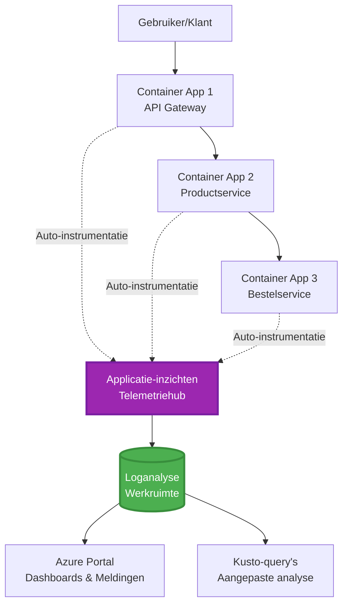
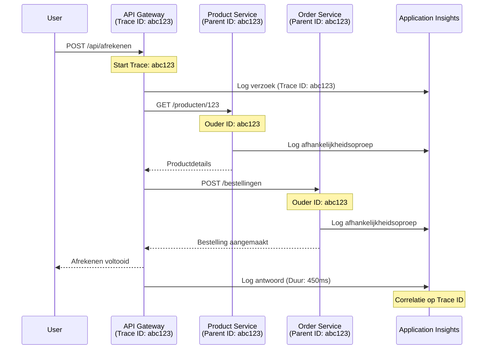

# Integratie van Application Insights met AZD

⏱️ **Geschatte tijd**: 40-50 minuten | 💰 **Kostenimpact**: ~$5-15/maand | ⭐ **Complexiteit**: Gemiddeld

**📚 Leerpad:**
- ← Vorige: [Preflight Checks](preflight-checks.md) - Validatie vóór implementatie
- 🎯 **Je bent hier**: Integratie van Application Insights (Monitoring, telemetrie, debugging)
- → Volgende: [Deployment Guide](../deployment/deployment-guide.md) - Implementeren naar Azure
- 🏠 [Cursus Home](../../README.md)

---

## Wat je zult leren

Na het voltooien van deze les kun je:
- **Application Insights** automatisch integreren in AZD-projecten
- **Distributed tracing** configureren voor microservices
- **Aangepaste telemetrie** implementeren (metrics, events, afhankelijkheden)
- **Live metrics** instellen voor realtime monitoring
- **Alerts en dashboards** maken vanuit AZD-implementaties
- Productieproblemen debuggen met **telemetriequery's**
- **Kosten en sampling** strategieën optimaliseren
- **AI/LLM-toepassingen** monitoren (tokens, latentie, kosten)

## Waarom Application Insights met AZD belangrijk is

### De uitdaging: Observability in productie

**Zonder Application Insights:**
```
❌ No visibility into production behavior
❌ Manual log aggregation across services
❌ Reactive debugging (wait for customer complaints)
❌ No performance metrics
❌ Cannot trace requests across services
❌ Unknown failure rates and bottlenecks
```

**Met Application Insights + AZD:**
```
✅ Automatic telemetry collection
✅ Centralized logs from all services
✅ Proactive issue detection
✅ End-to-end request tracing
✅ Performance metrics and insights
✅ Real-time dashboards
✅ AZD provisions everything automatically
```

**Analogie**: Application Insights is als een "zwarte doos" vluchtrecorder + cockpitdashboard voor je applicatie. Je ziet alles wat er in realtime gebeurt en kunt elk incident opnieuw afspelen.

---

## Architectuuroverzicht

### Application Insights in AZD-architectuur


### Wat automatisch wordt gemonitord

| Telemetrietype | Wat het vastlegt | Gebruiksscenario |
|----------------|------------------|------------------|
| **Requests** | HTTP-verzoeken, statuscodes, duur | API-prestatiemonitoring |
| **Dependencies** | Externe oproepen (DB, API's, opslag) | Bottlenecks identificeren |
| **Exceptions** | Onverwerkte fouten met stacktraces | Fouten debuggen |
| **Custom Events** | Bedrijfsevenementen (aanmelding, aankoop) | Analyse en funnels |
| **Metrics** | Prestatiecounters, aangepaste metrics | Capaciteitsplanning |
| **Traces** | Logberichten met ernstniveau | Debuggen en auditen |
| **Availability** | Uptime- en responstijdtests | SLA-monitoring |

---

## Vereisten

### Benodigde tools

```bash
# Verifieer Azure Developer CLI
azd version
# ✅ Verwacht: azd versie 1.0.0 of hoger

# Verifieer Azure CLI
az --version
# ✅ Verwacht: azure-cli 2.50.0 of hoger
```

### Azure-vereisten

- Actief Azure-abonnement
- Machtigingen om te maken:
  - Application Insights-resources
  - Log Analytics-werkruimten
  - Container Apps
  - Resourcegroepen

### Kennisvereisten

Je moet hebben afgerond:
- [AZD Basics](../getting-started/azd-basics.md) - Kernconcepten van AZD
- [Configuration](../getting-started/configuration.md) - Omgevingsinstellingen
- [First Project](../getting-started/first-project.md) - Basisimplementatie

---

## Les 1: Automatische Application Insights met AZD

### Hoe AZD Application Insights implementeert

AZD maakt en configureert automatisch Application Insights wanneer je implementeert. Laten we zien hoe dit werkt.

### Projectstructuur

```
monitored-app/
├── azure.yaml                     # AZD configuration
├── infra/
│   ├── main.bicep                # Main infrastructure
│   ├── core/
│   │   └── monitoring.bicep      # Application Insights + Log Analytics
│   └── app/
│       └── api.bicep             # Container App with monitoring
└── src/
    ├── app.py                    # Application with telemetry
    ├── requirements.txt
    └── Dockerfile
```

---

### Stap 1: AZD configureren (azure.yaml)

**Bestand: `azure.yaml`**

```yaml
name: monitored-app
metadata:
  template: monitored-app@1.0.0

services:
  api:
    project: ./src
    language: python
    host: containerapp

# AZD automatically provisions monitoring!
```

**Dat is alles!** AZD maakt standaard Application Insights aan. Geen extra configuratie nodig voor basisbewaking.

---

### Stap 2: Monitoringinfrastructuur (Bicep)

**Bestand: `infra/core/monitoring.bicep`**

```bicep
param logAnalyticsName string
param applicationInsightsName string
param location string = resourceGroup().location
param tags object = {}

// Log Analytics Workspace (required for Application Insights)
resource logAnalytics 'Microsoft.OperationalInsights/workspaces@2022-10-01' = {
  name: logAnalyticsName
  location: location
  tags: tags
  properties: {
    sku: {
      name: 'PerGB2018'  // Pay-as-you-go pricing
    }
    retentionInDays: 30  // Keep logs for 30 days
    features: {
      enableLogAccessUsingOnlyResourcePermissions: true
    }
  }
}

// Application Insights
resource applicationInsights 'Microsoft.Insights/components@2020-02-02' = {
  name: applicationInsightsName
  location: location
  tags: tags
  kind: 'web'
  properties: {
    Application_Type: 'web'
    WorkspaceResourceId: logAnalytics.id
    IngestionMode: 'LogAnalytics'
    publicNetworkAccessForIngestion: 'Enabled'
    publicNetworkAccessForQuery: 'Enabled'
  }
}

// Outputs for Container Apps
output logAnalyticsWorkspaceId string = logAnalytics.id
output logAnalyticsWorkspaceName string = logAnalytics.name
output applicationInsightsConnectionString string = applicationInsights.properties.ConnectionString
output applicationInsightsInstrumentationKey string = applicationInsights.properties.InstrumentationKey
output applicationInsightsName string = applicationInsights.name
```

---

### Stap 3: Container App verbinden met Application Insights

**Bestand: `infra/app/api.bicep`**

```bicep
param name string
param location string
param tags object = {}
param containerAppsEnvironmentName string
param applicationInsightsConnectionString string

resource containerApp 'Microsoft.App/containerApps@2023-05-01' = {
  name: name
  location: location
  tags: tags
  properties: {
    configuration: {
      ingress: {
        external: true
        targetPort: 8000
      }
      secrets: [
        {
          name: 'appinsights-connection-string'
          value: applicationInsightsConnectionString
        }
      ]
    }
    template: {
      containers: [
        {
          name: 'api'
          image: 'myregistry.azurecr.io/api:latest'
          resources: {
            cpu: json('0.5')
            memory: '1Gi'
          }
          env: [
            {
              name: 'APPLICATIONINSIGHTS_CONNECTION_STRING'
              secretRef: 'appinsights-connection-string'
            }
            {
              name: 'APPLICATIONINSIGHTS_ENABLED'
              value: 'true'
            }
          ]
        }
      ]
    }
  }
}

output uri string = 'https://${containerApp.properties.configuration.ingress.fqdn}'
```

---

### Stap 4: Applicatiecode met telemetrie

**Bestand: `src/app.py`**

```python
from flask import Flask, request, jsonify
from opencensus.ext.azure.log_exporter import AzureLogHandler
from opencensus.ext.azure.trace_exporter import AzureExporter
from opencensus.ext.flask.flask_middleware import FlaskMiddleware
from opencensus.trace.samplers import ProbabilitySampler
import logging
import os

app = Flask(__name__)

# Haal de verbindingsreeks voor Application Insights op
connection_string = os.environ.get('APPLICATIONINSIGHTS_CONNECTION_STRING')

if connection_string:
    # Configureer gedistribueerde tracing
    middleware = FlaskMiddleware(
        app,
        exporter=AzureExporter(connection_string=connection_string),
        sampler=ProbabilitySampler(rate=1.0)  # 100% sampling voor ontwikkeling
    )
    
    # Configureer logging
    logger = logging.getLogger(__name__)
    logger.addHandler(AzureLogHandler(connection_string=connection_string))
    logger.setLevel(logging.INFO)
    
    print("✅ Application Insights enabled")
else:
    logger = logging.getLogger(__name__)
    logger.setLevel(logging.INFO)
    print("⚠️ Application Insights not configured")

@app.route('/health')
def health():
    logger.info('Health check endpoint called')
    return jsonify({'status': 'healthy', 'monitoring': 'enabled'})

@app.route('/api/products')
def get_products():
    logger.info('Fetching products')
    
    # Simuleer database-oproep (automatisch gevolgd als afhankelijkheid)
    products = [
        {'id': 1, 'name': 'Laptop', 'price': 999.99},
        {'id': 2, 'name': 'Mouse', 'price': 29.99},
        {'id': 3, 'name': 'Keyboard', 'price': 79.99}
    ]
    
    logger.info(f'Returned {len(products)} products')
    return jsonify(products)

@app.route('/api/error-test')
def error_test():
    """Test error tracking"""
    logger.error('Testing error tracking')
    try:
        raise ValueError('This is a test exception')
    except Exception as e:
        logger.exception('Exception occurred in error-test endpoint')
        return jsonify({'error': str(e)}), 500

@app.route('/api/slow')
def slow_endpoint():
    """Test performance tracking"""
    import time
    logger.info('Slow endpoint called')
    time.sleep(3)  # Simuleer langzame operatie
    logger.warning('Endpoint took 3 seconds to respond')
    return jsonify({'message': 'Slow operation completed'})

if __name__ == '__main__':
    app.run(host='0.0.0.0', port=8000)
```

**Bestand: `src/requirements.txt`**

```txt
Flask==3.0.0
opencensus-ext-azure==1.1.13
opencensus-ext-flask==0.8.1
gunicorn==21.2.0
```

---

### Stap 5: Implementeren en verifiëren

```bash
# Initialiseer AZD
azd init

# Implementeer (voorziet automatisch Application Insights)
azd up

# Verkrijg app-URL
APP_URL=$(azd env get-values | grep API_URL | cut -d '=' -f2 | tr -d '"')

# Genereer telemetrie
curl $APP_URL/health
curl $APP_URL/api/products
curl $APP_URL/api/error-test
curl $APP_URL/api/slow
```

**✅ Verwachte output:**
```json
{
  "status": "healthy",
  "monitoring": "enabled"
}
```

---

### Stap 6: Telemetrie bekijken in Azure Portal

```bash
# Haal Application Insights-details op
azd env get-values | grep APPLICATIONINSIGHTS

# Open in Azure Portal
az monitor app-insights component show \
  --app $(azd env get-values | grep APPLICATIONINSIGHTS_NAME | cut -d '=' -f2 | tr -d '"') \
  --resource-group $(azd env get-values | grep AZURE_RESOURCE_GROUP | cut -d '=' -f2 | tr -d '"') \
  --query "appId" -o tsv
```

**Navigeer naar Azure Portal → Application Insights → Transaction Search**

Je zou moeten zien:
- ✅ HTTP-verzoeken met statuscodes
- ✅ Verzoekduur (3+ seconden voor `/api/slow`)
- ✅ Foutdetails van `/api/error-test`
- ✅ Aangepaste logberichten

---

## Les 2: Aangepaste telemetrie en evenementen

### Bedrijfsevenementen volgen

Laten we aangepaste telemetrie toevoegen voor bedrijfskritieke gebeurtenissen.

**Bestand: `src/telemetry.py`**

```python
from opencensus.ext.azure import metrics_exporter
from opencensus.stats import aggregation as aggregation_module
from opencensus.stats import measure as measure_module
from opencensus.stats import stats as stats_module
from opencensus.stats import view as view_module
from opencensus.tags import tag_map as tag_map_module
from opencensus.ext.azure.log_exporter import AzureLogHandler
from opencensus.ext.azure.trace_exporter import AzureExporter
from opencensus.trace import tracer as tracer_module
import logging
import os

class TelemetryClient:
    """Custom telemetry client for Application Insights"""
    
    def __init__(self, connection_string=None):
        self.connection_string = connection_string or os.environ.get('APPLICATIONINSIGHTS_CONNECTION_STRING')
        
        if not self.connection_string:
            print("⚠️ Application Insights connection string not found")
            return
        
        # Logger instellen
        self.logger = logging.getLogger(__name__)
        self.logger.addHandler(AzureLogHandler(connection_string=self.connection_string))
        self.logger.setLevel(logging.INFO)
        
        # Metrics-exporteur instellen
        self.stats = stats_module.stats
        self.view_manager = self.stats.view_manager
        self.stats_recorder = self.stats.stats_recorder
        
        exporter = metrics_exporter.new_metrics_exporter(
            connection_string=self.connection_string
        )
        self.view_manager.register_exporter(exporter)
        
        # Tracer instellen
        self.tracer = tracer_module.Tracer(
            exporter=AzureExporter(connection_string=self.connection_string)
        )
        
        print("✅ Custom telemetry client initialized")
    
    def track_event(self, event_name: str, properties: dict = None):
        """Track custom business event"""
        properties = properties or {}
        self.logger.info(
            f"CustomEvent: {event_name}",
            extra={
                'custom_dimensions': {
                    'event_name': event_name,
                    **properties
                }
            }
        )
    
    def track_metric(self, metric_name: str, value: float, properties: dict = None):
        """Track custom metric"""
        properties = properties or {}
        self.logger.info(
            f"CustomMetric: {metric_name} = {value}",
            extra={
                'custom_dimensions': {
                    'metric_name': metric_name,
                    'value': value,
                    **properties
                }
            }
        )
    
    def track_dependency(self, name: str, dependency_type: str, duration: float, success: bool):
        """Track external dependency call"""
        with self.tracer.span(name=name) as span:
            span.add_attribute('dependency.type', dependency_type)
            span.add_attribute('duration', duration)
            span.add_attribute('success', success)

# Globale telemetrieclient
telemetry = TelemetryClient()
```

### Applicatie bijwerken met aangepaste evenementen

**Bestand: `src/app.py` (uitgebreid)**

```python
from flask import Flask, request, jsonify
from telemetry import telemetry
import time
import random

app = Flask(__name__)

@app.route('/api/purchase', methods=['POST'])
def purchase():
    """Track purchase event with custom telemetry"""
    data = request.json
    product_id = data.get('product_id')
    quantity = data.get('quantity', 1)
    price = data.get('price', 0)
    
    # Volg zakelijke gebeurtenis
    telemetry.track_event('Purchase', {
        'product_id': product_id,
        'quantity': quantity,
        'total_amount': price * quantity,
        'user_id': request.headers.get('X-User-Id', 'anonymous')
    })
    
    # Volg omzetmetriek
    telemetry.track_metric('Revenue', price * quantity, {
        'product_id': product_id,
        'currency': 'USD'
    })
    
    return jsonify({
        'order_id': f'ORD-{random.randint(1000, 9999)}',
        'status': 'confirmed',
        'total': price * quantity
    })

@app.route('/api/search')
def search():
    """Track search queries"""
    query = request.args.get('q', '')
    
    start_time = time.time()
    
    # Simuleer zoekopdracht (zou een echte databasequery zijn)
    results = [{'id': 1, 'name': f'Result for {query}'}]
    
    duration = (time.time() - start_time) * 1000  # Converteer naar ms
    
    # Volg zoekgebeurtenis
    telemetry.track_event('Search', {
        'query': query,
        'results_count': len(results),
        'duration_ms': duration
    })
    
    # Volg zoekprestatiemetriek
    telemetry.track_metric('SearchDuration', duration, {
        'query_length': len(query)
    })
    
    return jsonify({'results': results, 'count': len(results)})

@app.route('/api/external-call')
def external_call():
    """Track external API dependency"""
    import requests
    
    start_time = time.time()
    success = True
    
    try:
        # Simuleer externe API-oproep
        response = requests.get('https://api.example.com/data', timeout=5)
        result = response.json()
    except Exception as e:
        success = False
        result = {'error': str(e)}
    
    duration = (time.time() - start_time) * 1000
    
    # Volg afhankelijkheid
    telemetry.track_dependency(
        name='ExternalAPI',
        dependency_type='HTTP',
        duration=duration,
        success=success
    )
    
    return jsonify(result)

if __name__ == '__main__':
    app.run(host='0.0.0.0', port=8000)
```

### Aangepaste telemetrie testen

```bash
# Volg aankoopgebeurtenis
curl -X POST $APP_URL/api/purchase \
  -H "Content-Type: application/json" \
  -H "X-User-Id: user123" \
  -d '{"product_id": 1, "quantity": 2, "price": 29.99}'

# Volg zoekgebeurtenis
curl "$APP_URL/api/search?q=laptop"

# Volg externe afhankelijkheid
curl $APP_URL/api/external-call
```

**Bekijken in Azure Portal:**

Navigeer naar Application Insights → Logs en voer uit:

```kusto
// View purchase events
traces
| where customDimensions.event_name == "Purchase"
| project 
    timestamp,
    product_id = tostring(customDimensions.product_id),
    total_amount = todouble(customDimensions.total_amount),
    user_id = tostring(customDimensions.user_id)
| order by timestamp desc

// View revenue metrics
traces
| where customDimensions.metric_name == "Revenue"
| summarize TotalRevenue = sum(todouble(customDimensions.value)) by bin(timestamp, 1h)
| render timechart

// View search performance
traces
| where customDimensions.event_name == "Search"
| summarize 
    AvgDuration = avg(todouble(customDimensions.duration_ms)),
    SearchCount = count()
  by bin(timestamp, 5m)
| render timechart
```

---

## Les 3: Distributed Tracing voor microservices

### Cross-Service Tracing inschakelen

Voor microservices correleert Application Insights automatisch verzoeken tussen services.

**Bestand: `infra/main.bicep`**

```bicep
targetScope = 'subscription'

param environmentName string
param location string = 'eastus'

var tags = { 'azd-env-name': environmentName }

resource rg 'Microsoft.Resources/resourceGroups@2021-04-01' = {
  name: 'rg-${environmentName}'
  location: location
  tags: tags
}

// Monitoring (shared by all services)
module monitoring './core/monitoring.bicep' = {
  name: 'monitoring'
  scope: rg
  params: {
    logAnalyticsName: 'log-${environmentName}'
    applicationInsightsName: 'appi-${environmentName}'
    location: location
    tags: tags
  }
}

// API Gateway
module apiGateway './app/api-gateway.bicep' = {
  name: 'api-gateway'
  scope: rg
  params: {
    name: 'ca-gateway-${environmentName}'
    location: location
    tags: union(tags, { 'azd-service-name': 'gateway' })
    applicationInsightsConnectionString: monitoring.outputs.applicationInsightsConnectionString
  }
}

// Product Service
module productService './app/product-service.bicep' = {
  name: 'product-service'
  scope: rg
  params: {
    name: 'ca-products-${environmentName}'
    location: location
    tags: union(tags, { 'azd-service-name': 'products' })
    applicationInsightsConnectionString: monitoring.outputs.applicationInsightsConnectionString
  }
}

// Order Service
module orderService './app/order-service.bicep' = {
  name: 'order-service'
  scope: rg
  params: {
    name: 'ca-orders-${environmentName}'
    location: location
    tags: union(tags, { 'azd-service-name': 'orders' })
    applicationInsightsConnectionString: monitoring.outputs.applicationInsightsConnectionString
  }
}

output APPLICATIONINSIGHTS_CONNECTION_STRING string = monitoring.outputs.applicationInsightsConnectionString
output GATEWAY_URL string = apiGateway.outputs.uri
```

### End-to-End Transactie bekijken


**Query voor end-to-end trace:**

```kusto
// Find complete request flow
let traceId = "abc123...";  // Get from response header
dependencies
| union requests
| where operation_Id == traceId
| project 
    timestamp,
    type = itemType,
    name,
    duration,
    success,
    cloud_RoleName
| order by timestamp asc
```

---

## Les 4: Live Metrics en realtime monitoring

### Live Metrics Stream inschakelen

Live Metrics biedt realtime telemetrie met <1 seconde latentie.

**Toegang tot Live Metrics:**

```bash
# Haal Application Insights-resource op
APPI_NAME=$(azd env get-values | grep APPLICATIONINSIGHTS_NAME | cut -d '=' -f2 | tr -d '"')

# Haal resourcegroep op
RG_NAME=$(azd env get-values | grep AZURE_RESOURCE_GROUP | cut -d '=' -f2 | tr -d '"')

echo "Navigate to: Azure Portal → Resource Groups → $RG_NAME → $APPI_NAME → Live Metrics"
```

**Wat je in realtime ziet:**
- ✅ Binnenkomende verzoekfrequentie (verzoeken/seconde)
- ✅ Uitgaande afhankelijkheidsoproepen
- ✅ Aantal uitzonderingen
- ✅ CPU- en geheugengebruik
- ✅ Actief serveraantal
- ✅ Voorbeeldtelemetrie

### Load genereren voor testen

```bash
# Genereer belasting om live statistieken te zien
for i in {1..100}; do
  curl $APP_URL/api/products &
  curl $APP_URL/api/search?q=test$i &
done

# Bekijk live statistieken in Azure Portal
# Je zou een piek in het aanvraagpercentage moeten zien
```

---

## Praktische oefeningen

### Oefening 1: Alerts instellen ⭐⭐ (Gemiddeld)

**Doel**: Maak alerts voor hoge foutpercentages en trage reacties.

**Stappen:**

1. **Alert maken voor foutpercentage:**

```bash
# Haal resource-ID van Application Insights op
APPI_ID=$(az monitor app-insights component show \
  --app $APPI_NAME \
  --resource-group $RG_NAME \
  --query "id" -o tsv)

# Maak een metrische waarschuwing voor mislukte verzoeken
az monitor metrics alert create \
  --name "High-Error-Rate" \
  --resource-group $RG_NAME \
  --scopes $APPI_ID \
  --condition "count requests/failed > 10" \
  --window-size 5m \
  --evaluation-frequency 1m \
  --description "Alert when error rate exceeds 10 per 5 minutes"
```

2. **Alert maken voor trage reacties:**

```bash
az monitor metrics alert create \
  --name "Slow-Responses" \
  --resource-group $RG_NAME \
  --scopes $APPI_ID \
  --condition "avg requests/duration > 3000" \
  --window-size 5m \
  --evaluation-frequency 1m \
  --description "Alert when average response time exceeds 3 seconds"
```

3. **Alert maken via Bicep (voorkeur voor AZD):**

**Bestand: `infra/core/alerts.bicep`**

```bicep
param applicationInsightsId string
param actionGroupId string = ''
param location string = resourceGroup().location

// High error rate alert
resource errorRateAlert 'Microsoft.Insights/metricAlerts@2018-03-01' = {
  name: 'high-error-rate'
  location: 'global'
  properties: {
    description: 'Alert when error rate exceeds threshold'
    severity: 2
    enabled: true
    scopes: [
      applicationInsightsId
    ]
    evaluationFrequency: 'PT1M'
    windowSize: 'PT5M'
    criteria: {
      'odata.type': 'Microsoft.Azure.Monitor.SingleResourceMultipleMetricCriteria'
      allOf: [
        {
          name: 'Error rate'
          metricName: 'requests/failed'
          operator: 'GreaterThan'
          threshold: 10
          timeAggregation: 'Count'
        }
      ]
    }
    actions: actionGroupId != '' ? [
      {
        actionGroupId: actionGroupId
      }
    ] : []
  }
}

// Slow response alert
resource slowResponseAlert 'Microsoft.Insights/metricAlerts@2018-03-01' = {
  name: 'slow-responses'
  location: 'global'
  properties: {
    description: 'Alert when response time is too high'
    severity: 3
    enabled: true
    scopes: [
      applicationInsightsId
    ]
    evaluationFrequency: 'PT1M'
    windowSize: 'PT5M'
    criteria: {
      'odata.type': 'Microsoft.Azure.Monitor.SingleResourceMultipleMetricCriteria'
      allOf: [
        {
          name: 'Response duration'
          metricName: 'requests/duration'
          operator: 'GreaterThan'
          threshold: 3000
          timeAggregation: 'Average'
        }
      ]
    }
  }
}

output errorAlertId string = errorRateAlert.id
output slowResponseAlertId string = slowResponseAlert.id
```

4. **Alerts testen:**

```bash
# Genereer fouten
for i in {1..20}; do
  curl $APP_URL/api/error-test
done

# Genereer trage reacties
for i in {1..10}; do
  curl $APP_URL/api/slow
done

# Controleer alarmstatus (wacht 5-10 minuten)
az monitor metrics alert list \
  --resource-group $RG_NAME \
  --query "[].{Name:name, Enabled:enabled, State:properties.enabled}" \
  --output table
```

**✅ Succescriteria:**
- ✅ Alerts succesvol aangemaakt
- ✅ Alerts worden geactiveerd bij overschrijding van drempels
- ✅ Alertgeschiedenis zichtbaar in Azure Portal
- ✅ Geïntegreerd met AZD-implementatie

**Tijd**: 20-25 minuten

---

### Oefening 2: Aangepast dashboard maken ⭐⭐ (Gemiddeld)

**Doel**: Bouw een dashboard met belangrijke applicatiemetrics.

**Stappen:**

1. **Dashboard maken via Azure Portal:**

Navigeer naar: Azure Portal → Dashboards → Nieuw Dashboard

2. **Tegels toevoegen voor belangrijke metrics:**

- Aantal verzoeken (laatste 24 uur)
- Gemiddelde responstijd
- Foutpercentage
- Top 5 traagste operaties
- Geografische spreiding van gebruikers

3. **Dashboard maken via Bicep:**

**Bestand: `infra/core/dashboard.bicep`**

```bicep
param dashboardName string
param applicationInsightsId string
param location string = resourceGroup().location

resource dashboard 'Microsoft.Portal/dashboards@2020-09-01-preview' = {
  name: dashboardName
  location: location
  properties: {
    lenses: [
      {
        order: 0
        parts: [
          // Request count
          {
            position: { x: 0, y: 0, rowSpan: 4, colSpan: 6 }
            metadata: {
              type: 'Extension/Microsoft_OperationsManagementSuite_Workspace/PartType/LogsDashboardPart'
              inputs: [
                {
                  name: 'resourceId'
                  value: applicationInsightsId
                }
                {
                  name: 'query'
                  value: '''
                    requests
                    | summarize RequestCount = count() by bin(timestamp, 1h)
                    | render timechart
                  '''
                }
              ]
            }
          }
          // Error rate
          {
            position: { x: 6, y: 0, rowSpan: 4, colSpan: 6 }
            metadata: {
              type: 'Extension/Microsoft_OperationsManagementSuite_Workspace/PartType/LogsDashboardPart'
              inputs: [
                {
                  name: 'resourceId'
                  value: applicationInsightsId
                }
                {
                  name: 'query'
                  value: '''
                    requests
                    | summarize 
                        Total = count(),
                        Failed = countif(success == false)
                    | extend ErrorRate = (Failed * 100.0) / Total
                    | project ErrorRate
                  '''
                }
              ]
            }
          }
        ]
      }
    ]
  }
}

output dashboardId string = dashboard.id
```

4. **Dashboard implementeren:**

```bash
# Toevoegen aan main.bicep
module dashboard './core/dashboard.bicep' = {
  name: 'dashboard'
  scope: rg
  params: {
    dashboardName: 'dashboard-${environmentName}'
    applicationInsightsId: monitoring.outputs.applicationInsightsId
    location: location
  }
}

# Implementeren
azd up
```

**✅ Succescriteria:**
- ✅ Dashboard toont belangrijke metrics
- ✅ Kan worden vastgezet op Azure Portal home
- ✅ Updates in realtime
- ✅ Implementeerbaar via AZD

**Tijd**: 25-30 minuten

---

### Oefening 3: AI/LLM-toepassing monitoren ⭐⭐⭐ (Geavanceerd)

**Doel**: Azure OpenAI-gebruik (tokens, kosten, latentie) volgen.

**Stappen:**

1. **AI-monitoring wrapper maken:**

**Bestand: `src/ai_telemetry.py`**

```python
from telemetry import telemetry
from openai import AzureOpenAI
import time

class MonitoredAzureOpenAI:
    """Azure OpenAI client with automatic telemetry"""
    
    def __init__(self, api_key, endpoint, api_version="2024-02-01"):
        self.client = AzureOpenAI(
            api_key=api_key,
            api_version=api_version,
            azure_endpoint=endpoint
        )
    
    def chat_completion(self, model: str, messages: list, **kwargs):
        """Track chat completion with telemetry"""
        start_time = time.time()
        
        try:
            # Roep Azure OpenAI aan
            response = self.client.chat.completions.create(
                model=model,
                messages=messages,
                **kwargs
            )
            
            duration = (time.time() - start_time) * 1000  # ms
            
            # Gebruik extraheren
            usage = response.usage
            prompt_tokens = usage.prompt_tokens
            completion_tokens = usage.completion_tokens
            total_tokens = usage.total_tokens
            
            # Kosten berekenen (GPT-4 prijsstelling)
            prompt_cost = (prompt_tokens / 1000) * 0.03  # $0,03 per 1K tokens
            completion_cost = (completion_tokens / 1000) * 0.06  # $0,06 per 1K tokens
            total_cost = prompt_cost + completion_cost
            
            # Aangepaste gebeurtenis bijhouden
            telemetry.track_event('OpenAI_Request', {
                'model': model,
                'prompt_tokens': prompt_tokens,
                'completion_tokens': completion_tokens,
                'total_tokens': total_tokens,
                'duration_ms': duration,
                'cost_usd': total_cost,
                'success': True
            })
            
            # Statistieken bijhouden
            telemetry.track_metric('OpenAI_Tokens', total_tokens, {
                'model': model,
                'type': 'total'
            })
            
            telemetry.track_metric('OpenAI_Cost', total_cost, {
                'model': model,
                'currency': 'USD'
            })
            
            telemetry.track_metric('OpenAI_Duration', duration, {
                'model': model
            })
            
            return response
            
        except Exception as e:
            duration = (time.time() - start_time) * 1000
            
            telemetry.track_event('OpenAI_Request', {
                'model': model,
                'duration_ms': duration,
                'success': False,
                'error': str(e)
            })
            
            raise
```

2. **Gemonitorde client gebruiken:**

```python
from flask import Flask, request, jsonify
from ai_telemetry import MonitoredAzureOpenAI
import os

app = Flask(__name__)

# Initialiseer bewaakte OpenAI-client
openai_client = MonitoredAzureOpenAI(
    api_key=os.environ['AZURE_OPENAI_API_KEY'],
    endpoint=os.environ['AZURE_OPENAI_ENDPOINT']
)

@app.route('/api/chat', methods=['POST'])
def chat():
    data = request.json
    user_message = data.get('message')
    
    # Oproep met automatische monitoring
    response = openai_client.chat_completion(
        model='gpt-4',
        messages=[
            {'role': 'user', 'content': user_message}
        ]
    )
    
    return jsonify({
        'response': response.choices[0].message.content,
        'tokens': response.usage.total_tokens
    })
```

3. **AI-metrics queryen:**

```kusto
// Total AI spend over time
traces
| where customDimensions.event_name == "OpenAI_Request"
| where customDimensions.success == "True"
| summarize TotalCost = sum(todouble(customDimensions.cost_usd)) by bin(timestamp, 1h)
| render timechart

// Token usage by model
traces
| where customDimensions.event_name == "OpenAI_Request"
| summarize 
    TotalTokens = sum(toint(customDimensions.total_tokens)),
    RequestCount = count()
  by Model = tostring(customDimensions.model)

// Average latency
traces
| where customDimensions.event_name == "OpenAI_Request"
| summarize AvgDuration = avg(todouble(customDimensions.duration_ms))
| project AvgDurationSeconds = AvgDuration / 1000

// Cost per request
traces
| where customDimensions.event_name == "OpenAI_Request"
| extend Cost = todouble(customDimensions.cost_usd)
| summarize 
    TotalCost = sum(Cost),
    RequestCount = count(),
    AvgCostPerRequest = avg(Cost)
```

**✅ Succescriteria:**
- ✅ Elke OpenAI-oproep automatisch gevolgd
- ✅ Tokengebruik en kosten zichtbaar
- ✅ Latentie gemonitord
- ✅ Budgetalerts instelbaar

**Tijd**: 35-45 minuten

---

## Kostenoptimalisatie

### Samplingstrategieën

Beheer kosten door telemetrie te sampelen:

```python
from opencensus.trace.samplers import ProbabilitySampler

# Ontwikkeling: 100% bemonstering
sampler = ProbabilitySampler(rate=1.0)

# Productie: 10% bemonstering (kosten met 90% verlagen)
sampler = ProbabilitySampler(rate=0.1)

# Adaptieve bemonstering (past zich automatisch aan)
from opencensus.trace.samplers import AdaptiveSampler
sampler = AdaptiveSampler()
```

**In Bicep:**

```bicep
resource applicationInsights 'Microsoft.Insights/components@2020-02-02' = {
  name: applicationInsightsName
  properties: {
    SamplingPercentage: 10  // 10% sampling
  }
}
```

### Gegevensretentie

```bicep
resource logAnalytics 'Microsoft.OperationalInsights/workspaces@2022-10-01' = {
  name: logAnalyticsName
  properties: {
    retentionInDays: 30  // Minimum (cheapest)
    // Options: 30, 31, 60, 90, 120, 180, 270, 365, 550, 730
  }
}
```

### Maandelijkse kostenramingen

| Gegevensvolume | Retentie | Maandelijkse kosten |
|----------------|----------|---------------------|
| 1 GB/maand | 30 dagen | ~$2-5 |
| 5 GB/maand | 30 dagen | ~$10-15 |
| 10 GB/maand | 90 dagen | ~$25-40 |
| 50 GB/maand | 90 dagen | ~$100-150 |

**Gratis tier**: 5 GB/maand inbegrepen

---

## Kenniscontrole

### 1. Basisintegratie ✓

Test je begrip:

- [ ] **Q1**: Hoe implementeert AZD Application Insights?
  - **A**: Automatisch via Bicep-sjablonen in `infra/core/monitoring.bicep`

- [ ] **Q2**: Welke omgevingsvariabele activeert Application Insights?
  - **A**: `APPLICATIONINSIGHTS_CONNECTION_STRING`

- [ ] **Q3**: Wat zijn de drie belangrijkste telemetrietypes?
  - **A**: Requests (HTTP-oproepen), Dependencies (externe oproepen), Exceptions (fouten)

**Praktische verificatie:**
```bash
# Controleer of Application Insights is geconfigureerd
azd env get-values | grep APPLICATIONINSIGHTS

# Verifieer of telemetrie wordt verzonden
az monitor app-insights metrics show \
  --app $APPI_NAME \
  --resource-group $RG_NAME \
  --metric "requests/count"
```

---

### 2. Aangepaste telemetrie ✓

Test je begrip:

- [ ] **Q1**: Hoe volg je aangepaste bedrijfsevenementen?
  - **A**: Gebruik logger met `custom_dimensions` of `TelemetryClient.track_event()`

- [ ] **Q2**: Wat is het verschil tussen evenementen en metrics?
  - **A**: Evenementen zijn discrete gebeurtenissen, metrics zijn numerieke metingen

- [ ] **Q3**: Hoe correleer je telemetrie tussen services?
  - **A**: Application Insights gebruikt automatisch `operation_Id` voor correlatie

**Praktische verificatie:**
```kusto
// Verify custom events
traces
| where customDimensions.event_name != ""
| summarize count() by tostring(customDimensions.event_name)
```

---

### 3. Productiemonitoring ✓

Test je begrip:

- [ ] **Q1**: Wat is sampling en waarom gebruik je het?
  - **A**: Sampling vermindert gegevensvolume (en kosten) door slechts een percentage van de telemetrie vast te leggen

- [ ] **Q2**: Hoe stel je alerts in?
  - **A**: Gebruik metrische alerts in Bicep of Azure Portal op basis van Application Insights-metrics

- [ ] **Q3**: Wat is het verschil tussen Log Analytics en Application Insights?
  - **A**: Application Insights slaat gegevens op in Log Analytics-werkruimte; App Insights biedt applicatiespecifieke weergaven

**Praktische verificatie:**
```bash
# Controleer bemonsteringsconfiguratie
az monitor app-insights component show \
  --app $APPI_NAME \
  --resource-group $RG_NAME \
  --query "properties.SamplingPercentage"
```

---

## Best Practices

### ✅ DO:

1. **Gebruik correlatie-ID's**
   ```python
   logger.info('Processing order', extra={
       'custom_dimensions': {
           'order_id': order_id,
           'user_id': user_id
       }
   })
   ```

2. **Stel alerts in voor kritieke metrics**
   ```bicep
   // Error rate, slow responses, availability
   ```

3. **Gebruik gestructureerde logging**
   ```python
   # ✅ GOED: Gestructureerd
   logger.info('User signup', extra={'custom_dimensions': {'user_id': 123}})
   
   # ❌ SLECHT: Ongestructureerd
   logger.info(f'User 123 signed up')
   ```

4. **Monitor afhankelijkheden**
   ```python
   # Automatisch database-oproepen, HTTP-verzoeken, enz. volgen.
   ```

5. **Gebruik Live Metrics tijdens implementaties**

### ❌ DON'T:

1. **Log geen gevoelige gegevens**
   ```python
   # ❌ SLECHT
   logger.info(f'Login: {username}:{password}')
   
   # ✅ GOED
   logger.info('Login attempt', extra={'custom_dimensions': {'username': username}})
   ```

2. **Gebruik geen 100% sampling in productie**
   ```python
   # ❌ Duur
   sampler = ProbabilitySampler(rate=1.0)
   
   # ✅ Kosteneffectief
   sampler = ProbabilitySampler(rate=0.1)
   ```

3. **Negeer geen dead letter queues**

4. **Vergeet niet om gegevensretentielimieten in te stellen**

---

## Probleemoplossing

### Probleem: Geen telemetrie zichtbaar

**Diagnose:**
```bash
# Controleer of de verbindingsreeks is ingesteld
azd env get-values | grep APPLICATIONINSIGHTS

# Controleer applicatielogs
azd logs api --tail 50
```

**Oplossing:**
```bash
# Verifieer verbindingsreeks in Container App
az containerapp show \
  --name $APP_NAME \
  --resource-group $RG_NAME \
  --query "properties.template.containers[0].env" \
  | grep -i applicationinsights
```

---

### Probleem: Hoge kosten

**Diagnose:**
```bash
# Controleer gegevensinvoer
az monitor app-insights metrics show \
  --app $APPI_NAME \
  --resource-group $RG_NAME \
  --metric "availabilityResults/count"
```

**Oplossing:**
- Verlaag de sampling rate
- Verkort de retentieperiode
- Verwijder gedetailleerde logging

---

## Meer leren

### Officiële documentatie
- [Application Insights Overzicht](https://learn.microsoft.com/azure/azure-monitor/app/app-insights-overview)
- [Application Insights voor Python](https://learn.microsoft.com/azure/azure-monitor/app/opencensus-python)
- [Kusto Query Language](https://learn.microsoft.com/azure/data-explorer/kusto/query/)
- [AZD Monitoring](https://learn.microsoft.com/azure/developer/azure-developer-cli/monitor-your-app)

### Volgende stappen in deze cursus
- ← Vorige: [Preflight Checks](preflight-checks.md)
- → Volgende: [Deployment Guide](../deployment/deployment-guide.md)
- 🏠 [Cursus Home](../../README.md)

### Gerelateerde voorbeelden
- [Azure OpenAI Voorbeeld](../../../../examples/azure-openai-chat) - AI-telemetrie
- [Microservices Voorbeeld](../../../../examples/microservices) - Distributed tracing

---

## Samenvatting

**Je hebt geleerd:**
- ✅ Automatische provisioning van Application Insights met AZD
- ✅ Aangepaste telemetrie (evenementen, metrics, afhankelijkheden)
- ✅ Distributed tracing tussen microservices
- ✅ Live metrics en realtime monitoring
- ✅ Alerts en dashboards
- ✅ AI/LLM applicatie monitoring
- ✅ Kostenoptimalisatie strategieën

**Belangrijkste punten:**
1. **AZD regelt monitoring automatisch** - Geen handmatige installatie nodig
2. **Gebruik gestructureerde logging** - Maakt het eenvoudiger om te zoeken
3. **Volg zakelijke gebeurtenissen** - Niet alleen technische statistieken
4. **Houd AI-kosten in de gaten** - Volg tokens en uitgaven
5. **Stel meldingen in** - Wees proactief, niet reactief
6. **Optimaliseer kosten** - Gebruik sampling en retentiegrenzen

**Volgende stappen:**
1. Voltooi de praktische oefeningen
2. Voeg Application Insights toe aan je AZD-projecten
3. Maak aangepaste dashboards voor je team
4. Leer [Deployment Guide](../deployment/deployment-guide.md)

---

<!-- CO-OP TRANSLATOR DISCLAIMER START -->
**Disclaimer**:  
Dit document is vertaald met behulp van de AI-vertalingsservice [Co-op Translator](https://github.com/Azure/co-op-translator). Hoewel we streven naar nauwkeurigheid, dient u zich ervan bewust te zijn dat geautomatiseerde vertalingen fouten of onnauwkeurigheden kunnen bevatten. Het originele document in de oorspronkelijke taal moet worden beschouwd als de gezaghebbende bron. Voor kritieke informatie wordt professionele menselijke vertaling aanbevolen. Wij zijn niet aansprakelijk voor misverstanden of verkeerde interpretaties die voortvloeien uit het gebruik van deze vertaling.
<!-- CO-OP TRANSLATOR DISCLAIMER END -->