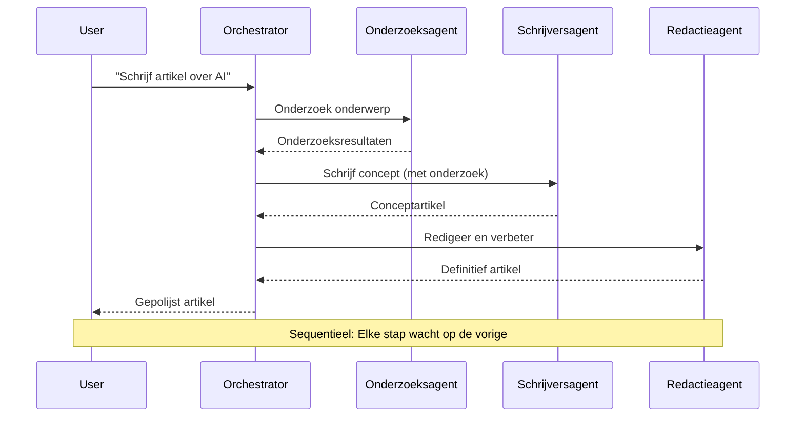
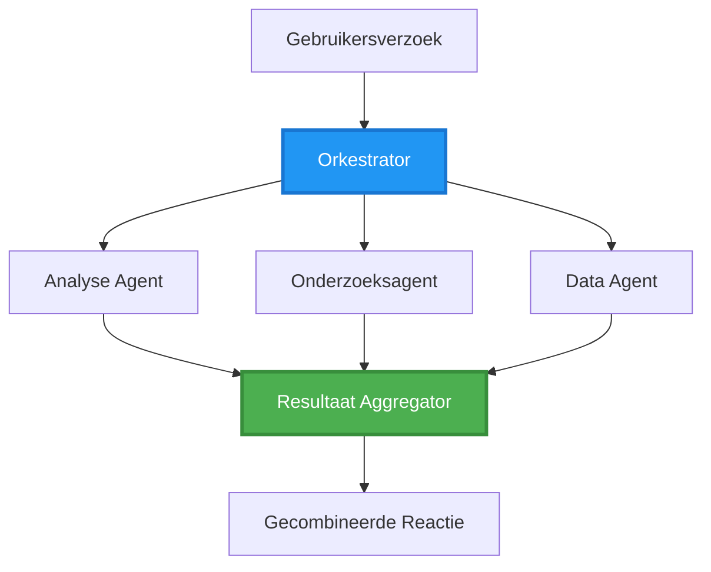
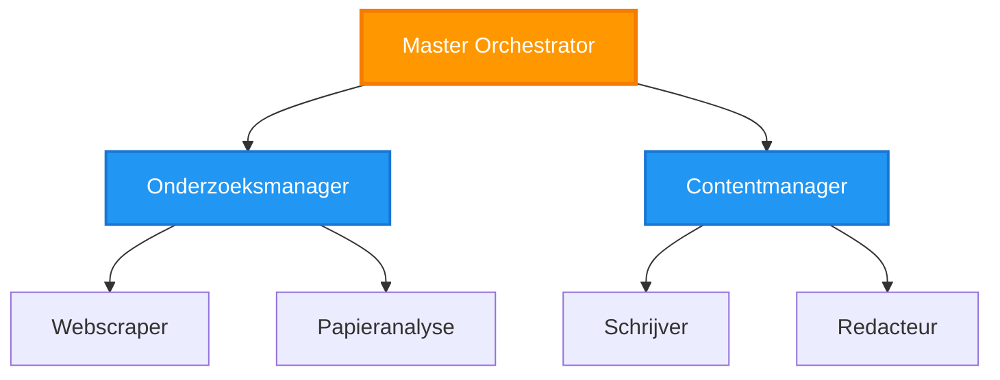
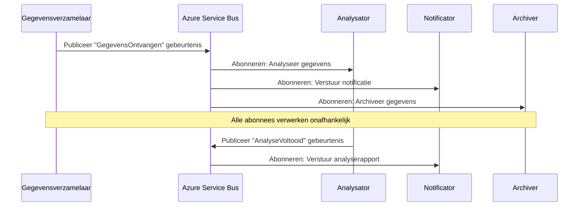
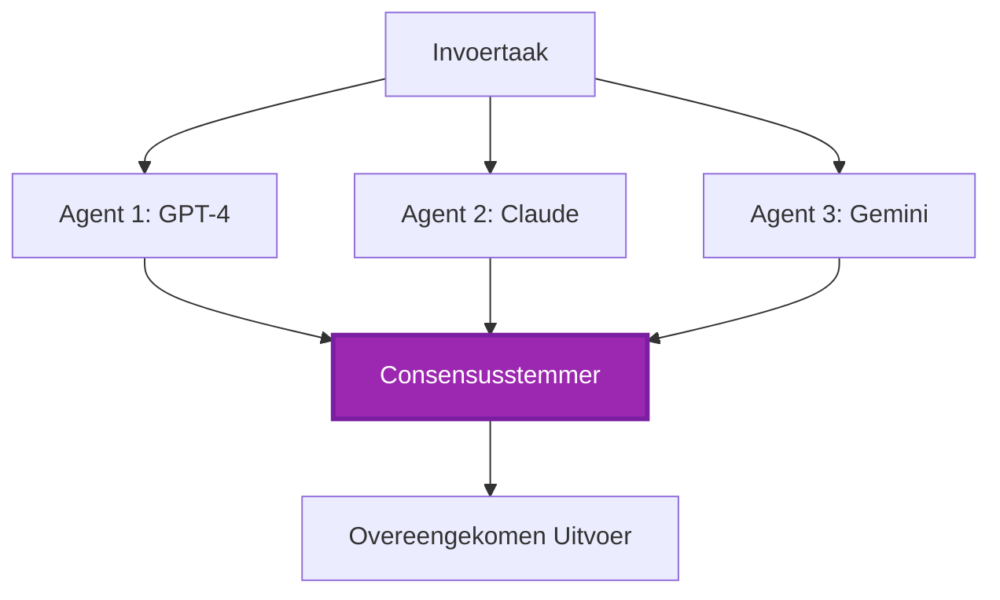
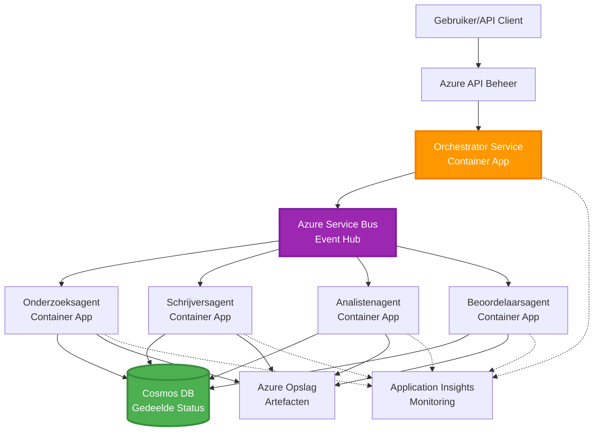

# Multi-Agent Coördinatiepatronen

⏱️ **Geschatte Tijd**: 60-75 minuten | 💰 **Geschatte Kosten**: ~$100-300/maand | ⭐ **Complexiteit**: Geavanceerd

**📚 Leerpad:**
- ← Vorige: [Capaciteitsplanning](capacity-planning.md) - Strategieën voor resource sizing en schaalvergroting
- 🎯 **Je Bent Hier**: Multi-Agent Coördinatiepatronen (Orchestratie, communicatie, statusbeheer)
- → Volgende: [SKU Selectie](sku-selection.md) - De juiste Azure-diensten kiezen
- 🏠 [Cursus Home](../../README.md)

---

## Wat Je Leert

Na het voltooien van deze les zul je:
- Begrijpen wat **multi-agent architectuur** patronen zijn en wanneer je ze gebruikt
- **Orchestratiepatronen** implementeren (gecentraliseerd, gedecentraliseerd, hiërarchisch)
- **Agentcommunicatiestrategieën** ontwerpen (synchroon, asynchroon, event-gedreven)
- **Gedeelde status** beheren tussen gedistribueerde agents
- **Multi-agent systemen** implementeren op Azure met AZD
- **Coördinatiepatronen** toepassen op real-world AI-scenario's
- Gedistribueerde agent-systemen monitoren en debuggen

## Waarom Multi-Agent Coördinatie Belangrijk Is

### De Evolutie: Van Single Agent naar Multi-Agent

**Single Agent (Eenvoudig):**
```
User → Agent → Response
```
- ✅ Makkelijk te begrijpen en implementeren
- ✅ Snel voor eenvoudige taken
- ❌ Beperkt door de mogelijkheden van één model
- ❌ Kan complexe taken niet parallel uitvoeren
- ❌ Geen specialisatie

**Multi-Agent Systeem (Geavanceerd):**
```
           ┌─────────────┐
           │ Orchestrator│
           └──────┬──────┘
        ┌─────────┼─────────┐
        │         │         │
    ┌───▼──┐  ┌──▼───┐  ┌──▼────┐
    │Agent1│  │Agent2│  │Agent3 │
    │(Plan)│  │(Code)│  │(Review)│
    └──────┘  └──────┘  └───────┘
```
- ✅ Gespecialiseerde agents voor specifieke taken
- ✅ Parallelle uitvoering voor snelheid
- ✅ Modulair en onderhoudbaar
- ✅ Beter in complexe workflows
- ⚠️ Vereist coördinatielogica

**Analogie**: Een single agent is als één persoon die alle taken uitvoert. Een multi-agent systeem is als een team waarin elk lid gespecialiseerde vaardigheden heeft (onderzoeker, programmeur, reviewer, schrijver) en samenwerkt.

---

## Kern Coördinatiepatronen

### Patroon 1: Sequentiële Coördinatie (Chain of Responsibility)

**Wanneer te gebruiken**: Taken moeten in een specifieke volgorde worden voltooid, waarbij elke agent voortbouwt op de output van de vorige.


**Voordelen:**
- ✅ Duidelijke datastroom
- ✅ Makkelijk te debuggen
- ✅ Voorspelbare uitvoeringsvolgorde

**Beperkingen:**
- ❌ Langzamer (geen parallelisme)
- ❌ Eén fout blokkeert de hele keten
- ❌ Kan geen onderling afhankelijke taken aan

**Voorbeeldtoepassingen:**
- Contentcreatiepijplijn (onderzoek → schrijven → bewerken → publiceren)
- Codegeneratie (plannen → implementeren → testen → implementeren)
- Rapportgeneratie (gegevens verzamelen → analyseren → visualiseren → samenvatten)

---

### Patroon 2: Parallelle Coördinatie (Fan-Out/Fan-In)

**Wanneer te gebruiken**: Onafhankelijke taken kunnen gelijktijdig worden uitgevoerd, resultaten worden aan het einde gecombineerd.


**Voordelen:**
- ✅ Snel (parallelle uitvoering)
- ✅ Fouttolerant (gedeeltelijke resultaten acceptabel)
- ✅ Horizontaal schaalbaar

**Beperkingen:**
- ⚠️ Resultaten kunnen in willekeurige volgorde aankomen
- ⚠️ Aggregatielogica nodig
- ⚠️ Complex statusbeheer

**Voorbeeldtoepassingen:**
- Gegevensverzameling uit meerdere bronnen (API's + databases + webscraping)
- Concurrentieanalyse (meerdere modellen genereren oplossingen, beste wordt geselecteerd)
- Vertaalservices (gelijktijdig naar meerdere talen vertalen)

---

### Patroon 3: Hiërarchische Coördinatie (Manager-Worker)

**Wanneer te gebruiken**: Complexe workflows met subtaken, delegatie nodig.


**Voordelen:**
- ✅ Behandelt complexe workflows
- ✅ Modulair en onderhoudbaar
- ✅ Duidelijke verantwoordelijkheidsgrenzen

**Beperkingen:**
- ⚠️ Complexere architectuur
- ⚠️ Hogere latentie (meerdere coördinatielagen)
- ⚠️ Vereist geavanceerde orchestratie

**Voorbeeldtoepassingen:**
- Documentverwerking in bedrijven (classificeren → routeren → verwerken → archiveren)
- Meerstaps datapijplijnen (invoeren → opschonen → transformeren → analyseren → rapporteren)
- Complexe automatiseringsworkflows (plannen → resourceallocatie → uitvoering → monitoring)

---

### Patroon 4: Event-Driven Coördinatie (Publish-Subscribe)

**Wanneer te gebruiken**: Agents moeten reageren op gebeurtenissen, losse koppeling gewenst.


**Voordelen:**
- ✅ Losse koppeling tussen agents
- ✅ Makkelijk nieuwe agents toevoegen (gewoon abonneren)
- ✅ Asynchrone verwerking
- ✅ Resilient (berichtpersistentie)

**Beperkingen:**
- ⚠️ Eventuele consistentie
- ⚠️ Complex debuggen
- ⚠️ Uitdagingen met berichtvolgorde

**Voorbeeldtoepassingen:**
- Realtime monitoringsystemen (meldingen, dashboards, logs)
- Multikanaal notificaties (e-mail, SMS, push, Slack)
- Dataverwerkingspijplijnen (meerdere consumenten van dezelfde data)

---

### Patroon 5: Consensus-Based Coördinatie (Voting/Quorum)

**Wanneer te gebruiken**: Overeenstemming van meerdere agents nodig voordat verder gegaan kan worden.


**Voordelen:**
- ✅ Hogere nauwkeurigheid (meerdere meningen)
- ✅ Fouttolerant (minderheidsfouten acceptabel)
- ✅ Kwaliteitsborging ingebouwd

**Beperkingen:**
- ❌ Duur (meerdere modeloproepen)
- ❌ Langzamer (wachten op alle agents)
- ⚠️ Conflictresolutie nodig

**Voorbeeldtoepassingen:**
- Contentmoderatie (meerdere modellen beoordelen content)
- Code review (meerdere linters/analyzers)
- Medische diagnose (meerdere AI-modellen, validatie door experts)

---

## Architectuuroverzicht

### Compleet Multi-Agent Systeem op Azure


**Belangrijke Componenten:**

| Component | Doel | Azure Service |
|-----------|------|---------------|
| **API Gateway** | Ingangspunt, rate limiting, authenticatie | API Management |
| **Orchestrator** | Coördineert agentworkflows | Container Apps |
| **Message Queue** | Asynchrone communicatie | Service Bus / Event Hubs |
| **Agents** | Gespecialiseerde AI-werkers | Container Apps / Functions |
| **State Store** | Gedeelde status, taaktracking | Cosmos DB |
| **Artifact Storage** | Documenten, resultaten, logs | Blob Storage |
| **Monitoring** | Gedistribueerde tracing, logs | Application Insights |

---

## Vereisten

### Benodigde Tools

```bash
# Verifieer Azure Developer CLI
azd version
# ✅ Verwacht: azd versie 1.0.0 of hoger

# Verifieer Azure CLI
az --version
# ✅ Verwacht: azure-cli 2.50.0 of hoger

# Verifieer Docker (voor lokaal testen)
docker --version
# ✅ Verwacht: Docker versie 20.10 of hoger
```

### Azure Vereisten

- Actief Azure-abonnement
- Machtigingen om te maken:
  - Container Apps
  - Service Bus namespaces
  - Cosmos DB-accounts
  - Opslagaccounts
  - Application Insights

### Kennisvereisten

Je moet hebben afgerond:
- [Configuratiebeheer](../getting-started/configuration.md)
- [Authenticatie & Beveiliging](../getting-started/authsecurity.md)
- [Microservices Voorbeeld](../../../../examples/microservices)

---

## Implementatiehandleiding

### Projectstructuur

```
multi-agent-system/
├── azure.yaml                    # AZD configuration
├── infra/
│   ├── main.bicep               # Main infrastructure
│   ├── core/
│   │   ├── servicebus.bicep     # Message queue
│   │   ├── cosmos.bicep         # State store
│   │   ├── storage.bicep        # Artifact storage
│   │   └── monitoring.bicep     # Application Insights
│   └── app/
│       ├── orchestrator.bicep   # Orchestrator service
│       └── agent.bicep          # Agent template
└── src/
    ├── orchestrator/            # Orchestration logic
    │   ├── app.py
    │   ├── workflows.py
    │   └── Dockerfile
    ├── agents/
    │   ├── research/            # Research agent
    │   ├── writer/              # Writer agent
    │   ├── analyst/             # Analyst agent
    │   └── reviewer/            # Reviewer agent
    └── shared/
        ├── state_manager.py     # Shared state logic
        └── message_handler.py   # Message handling
```

---

## Les 1: Sequentieel Coördinatiepatroon

### Implementatie: Contentcreatiepijplijn

Laten we een sequentiële pijplijn bouwen: Onderzoek → Schrijven → Bewerken → Publiceren

### 1. AZD Configuratie

**Bestand: `azure.yaml`**

```yaml
name: content-pipeline
metadata:
  template: multi-agent-sequential@1.0.0

services:
  orchestrator:
    project: ./src/orchestrator
    language: python
    host: containerapp
  
  research-agent:
    project: ./src/agents/research
    language: python
    host: containerapp
  
  writer-agent:
    project: ./src/agents/writer
    language: python
    host: containerapp
  
  editor-agent:
    project: ./src/agents/editor
    language: python
    host: containerapp
```

### 2. Infrastructuur: Service Bus voor Coördinatie

**Bestand: `infra/core/servicebus.bicep`**

```bicep
param name string
param location string
param tags object = {}

resource serviceBusNamespace 'Microsoft.ServiceBus/namespaces@2022-10-01-preview' = {
  name: name
  location: location
  tags: tags
  sku: {
    name: 'Standard'
    tier: 'Standard'
  }
  properties: {
    minimumTlsVersion: '1.2'
  }
}

// Queue for orchestrator → research agent
resource researchQueue 'Microsoft.ServiceBus/namespaces/queues@2022-10-01-preview' = {
  parent: serviceBusNamespace
  name: 'research-tasks'
  properties: {
    maxDeliveryCount: 3
    lockDuration: 'PT5M'
    deadLetteringOnMessageExpiration: true
  }
}

// Queue for research agent → writer agent
resource writerQueue 'Microsoft.ServiceBus/namespaces/queues@2022-10-01-preview' = {
  parent: serviceBusNamespace
  name: 'writer-tasks'
  properties: {
    maxDeliveryCount: 3
    lockDuration: 'PT5M'
  }
}

// Queue for writer agent → editor agent
resource editorQueue 'Microsoft.ServiceBus/namespaces/queues@2022-10-01-preview' = {
  parent: serviceBusNamespace
  name: 'editor-tasks'
  properties: {
    maxDeliveryCount: 3
    lockDuration: 'PT5M'
  }
}

output namespace string = serviceBusNamespace.name
output connectionString string = listKeys('${serviceBusNamespace.id}/AuthorizationRules/RootManageSharedAccessKey', serviceBusNamespace.apiVersion).primaryConnectionString
```

### 3. Gedeelde Statusbeheerder

**Bestand: `src/shared/state_manager.py`**

```python
from azure.cosmos import CosmosClient, PartitionKey
from datetime import datetime
import os

class StateManager:
    """Manages shared state across agents using Cosmos DB"""
    
    def __init__(self):
        endpoint = os.environ['COSMOS_ENDPOINT']
        key = os.environ['COSMOS_KEY']
        
        self.client = CosmosClient(endpoint, key)
        self.database = self.client.get_database_client('agent-state')
        self.container = self.database.get_container_client('tasks')
    
    def create_task(self, task_id: str, task_type: str, input_data: dict):
        """Create a new task"""
        task = {
            'id': task_id,
            'type': task_type,
            'status': 'pending',
            'input': input_data,
            'created_at': datetime.utcnow().isoformat(),
            'steps': []
        }
        self.container.create_item(task)
        return task
    
    def update_task_step(self, task_id: str, step_name: str, result: dict):
        """Update task with completed step"""
        task = self.container.read_item(task_id, partition_key=task_id)
        
        task['steps'].append({
            'name': step_name,
            'completed_at': datetime.utcnow().isoformat(),
            'result': result
        })
        
        self.container.replace_item(task_id, task)
        return task
    
    def complete_task(self, task_id: str, final_result: dict):
        """Mark task as complete"""
        task = self.container.read_item(task_id, partition_key=task_id)
        task['status'] = 'completed'
        task['result'] = final_result
        task['completed_at'] = datetime.utcnow().isoformat()
        self.container.replace_item(task_id, task)
        return task
    
    def get_task(self, task_id: str):
        """Retrieve task state"""
        return self.container.read_item(task_id, partition_key=task_id)
```

### 4. Orchestrator Service

**Bestand: `src/orchestrator/app.py`**

```python
from flask import Flask, request, jsonify
from azure.servicebus import ServiceBusClient, ServiceBusMessage
import json
import uuid
import os
from shared.state_manager import StateManager

app = Flask(__name__)
state_manager = StateManager()

# Service Bus-verbinding
servicebus_connection_str = os.environ['SERVICEBUS_CONNECTION_STRING']
servicebus_client = ServiceBusClient.from_connection_string(servicebus_connection_str)

@app.route('/health', methods=['GET'])
def health():
    return jsonify({'status': 'healthy', 'service': 'orchestrator'})

@app.route('/create-content', methods=['POST'])
def create_content():
    """
    Sequential workflow: Research → Write → Edit → Publish
    """
    data = request.json
    topic = data.get('topic')
    
    if not topic:
        return jsonify({'error': 'Topic required'}), 400
    
    # Taak aanmaken in statusopslag
    task_id = str(uuid.uuid4())
    task = state_manager.create_task(
        task_id=task_id,
        task_type='content_creation',
        input_data={'topic': topic}
    )
    
    # Bericht sturen naar onderzoeksagent (eerste stap)
    sender = servicebus_client.get_queue_sender('research-tasks')
    message = ServiceBusMessage(
        body=json.dumps({
            'task_id': task_id,
            'topic': topic,
            'next_queue': 'writer-tasks'  # Waar resultaten naartoe sturen
        }),
        content_type='application/json'
    )
    
    with sender:
        sender.send_messages(message)
    
    return jsonify({
        'task_id': task_id,
        'status': 'started',
        'workflow': 'sequential',
        'steps': ['research', 'write', 'edit', 'publish'],
        'message': 'Content creation pipeline initiated'
    }), 202

@app.route('/task/<task_id>', methods=['GET'])
def get_task_status(task_id):
    """Check task status"""
    try:
        task = state_manager.get_task(task_id)
        return jsonify(task)
    except Exception as e:
        return jsonify({'error': str(e)}), 404

if __name__ == '__main__':
    app.run(host='0.0.0.0', port=8080)
```

### 5. Onderzoeksagent

**Bestand: `src/agents/research/app.py`**

```python
from azure.servicebus import ServiceBusClient, ServiceBusMessage
from openai import AzureOpenAI
import json
import os
import time
from shared.state_manager import StateManager

# Initialiseer clients
state_manager = StateManager()
servicebus_client = ServiceBusClient.from_connection_string(
    os.environ['SERVICEBUS_CONNECTION_STRING']
)

openai_client = AzureOpenAI(
    api_key=os.environ['AZURE_OPENAI_API_KEY'],
    api_version="2024-02-01",
    azure_endpoint=os.environ['AZURE_OPENAI_ENDPOINT']
)

def process_research_task(message_data):
    """Process research request and pass to writer"""
    task_id = message_data['task_id']
    topic = message_data['topic']
    next_queue = message_data['next_queue']
    
    print(f"🔬 Researching: {topic}")
    
    # Roep Azure OpenAI aan voor onderzoek
    response = openai_client.chat.completions.create(
        model="gpt-4",
        messages=[
            {"role": "system", "content": "You are a research assistant. Provide comprehensive research on the given topic."},
            {"role": "user", "content": f"Research this topic thoroughly: {topic}"}
        ],
        max_tokens=1500
    )
    
    research_results = response.choices[0].message.content
    
    # Werk status bij
    state_manager.update_task_step(
        task_id=task_id,
        step_name='research',
        result={'research': research_results}
    )
    
    # Verstuur naar volgende agent (schrijver)
    sender = servicebus_client.get_queue_sender(next_queue)
    message = ServiceBusMessage(
        body=json.dumps({
            'task_id': task_id,
            'topic': topic,
            'research': research_results,
            'next_queue': 'editor-tasks'
        }),
        content_type='application/json'
    )
    
    with sender:
        sender.send_messages(message)
    
    print(f"✅ Research complete for task {task_id}")

def main():
    """Listen to research queue"""
    receiver = servicebus_client.get_queue_receiver('research-tasks')
    
    print("🔬 Research Agent started, listening for tasks...")
    
    with receiver:
        while True:
            messages = receiver.receive_messages(max_wait_time=5)
            for message in messages:
                try:
                    message_data = json.loads(str(message))
                    process_research_task(message_data)
                    receiver.complete_message(message)
                except Exception as e:
                    print(f"❌ Error processing message: {e}")
                    receiver.abandon_message(message)

if __name__ == '__main__':
    main()
```

### 6. Schrijver Agent

**Bestand: `src/agents/writer/app.py`**

```python
from azure.servicebus import ServiceBusClient, ServiceBusMessage
from openai import AzureOpenAI
import json
import os
from shared.state_manager import StateManager

state_manager = StateManager()
servicebus_client = ServiceBusClient.from_connection_string(
    os.environ['SERVICEBUS_CONNECTION_STRING']
)

openai_client = AzureOpenAI(
    api_key=os.environ['AZURE_OPENAI_API_KEY'],
    api_version="2024-02-01",
    azure_endpoint=os.environ['AZURE_OPENAI_ENDPOINT']
)

def process_writing_task(message_data):
    """Write article based on research"""
    task_id = message_data['task_id']
    topic = message_data['topic']
    research = message_data['research']
    next_queue = message_data['next_queue']
    
    print(f"✍️ Writing article: {topic}")
    
    # Roep Azure OpenAI aan om artikel te schrijven
    response = openai_client.chat.completions.create(
        model="gpt-4",
        messages=[
            {"role": "system", "content": "You are a professional writer. Write engaging, well-structured articles."},
            {"role": "user", "content": f"Based on this research:\n\n{research}\n\nWrite a comprehensive article about: {topic}"}
        ],
        max_tokens=2000
    )
    
    article_draft = response.choices[0].message.content
    
    # Update status
    state_manager.update_task_step(
        task_id=task_id,
        step_name='writing',
        result={'draft': article_draft}
    )
    
    # Verstuur naar redacteur
    sender = servicebus_client.get_queue_sender(next_queue)
    message = ServiceBusMessage(
        body=json.dumps({
            'task_id': task_id,
            'topic': topic,
            'draft': article_draft
        }),
        content_type='application/json'
    )
    
    with sender:
        sender.send_messages(message)
    
    print(f"✅ Article draft complete for task {task_id}")

def main():
    """Listen to writer queue"""
    receiver = servicebus_client.get_queue_receiver('writer-tasks')
    
    print("✍️ Writer Agent started, listening for tasks...")
    
    with receiver:
        while True:
            messages = receiver.receive_messages(max_wait_time=5)
            for message in messages:
                try:
                    message_data = json.loads(str(message))
                    process_writing_task(message_data)
                    receiver.complete_message(message)
                except Exception as e:
                    print(f"❌ Error: {e}")
                    receiver.abandon_message(message)

if __name__ == '__main__':
    main()
```

### 7. Editor Agent

**Bestand: `src/agents/editor/app.py`**

```python
from azure.servicebus import ServiceBusClient
from openai import AzureOpenAI
import json
import os
from shared.state_manager import StateManager

state_manager = StateManager()
servicebus_client = ServiceBusClient.from_connection_string(
    os.environ['SERVICEBUS_CONNECTION_STRING']
)

openai_client = AzureOpenAI(
    api_key=os.environ['AZURE_OPENAI_API_KEY'],
    api_version="2024-02-01",
    azure_endpoint=os.environ['AZURE_OPENAI_ENDPOINT']
)

def process_editing_task(message_data):
    """Edit and finalize article"""
    task_id = message_data['task_id']
    topic = message_data['topic']
    draft = message_data['draft']
    
    print(f"📝 Editing article: {topic}")
    
    # Roep Azure OpenAI aan om te bewerken
    response = openai_client.chat.completions.create(
        model="gpt-4",
        messages=[
            {"role": "system", "content": "You are an expert editor. Improve grammar, clarity, and structure."},
            {"role": "user", "content": f"Edit and improve this article:\n\n{draft}"}
        ],
        max_tokens=2000
    )
    
    final_article = response.choices[0].message.content
    
    # Markeer taak als voltooid
    state_manager.complete_task(
        task_id=task_id,
        final_result={
            'topic': topic,
            'final_article': final_article,
            'word_count': len(final_article.split())
        }
    )
    
    print(f"✅ Article finalized for task {task_id}")

def main():
    """Listen to editor queue"""
    receiver = servicebus_client.get_queue_receiver('editor-tasks')
    
    print("📝 Editor Agent started, listening for tasks...")
    
    with receiver:
        while True:
            messages = receiver.receive_messages(max_wait_time=5)
            for message in messages:
                try:
                    message_data = json.loads(str(message))
                    process_editing_task(message_data)
                    receiver.complete_message(message)
                except Exception as e:
                    print(f"❌ Error: {e}")
                    receiver.abandon_message(message)

if __name__ == '__main__':
    main()
```

### 8. Implementeren en Testen

```bash
# Initialiseren en implementeren
azd init
azd up

# Verkrijg orchestrator-URL
ORCHESTRATOR_URL=$(azd env get-values | grep ORCHESTRATOR_URL | cut -d '=' -f2 | tr -d '"')

# Maak inhoud
curl -X POST $ORCHESTRATOR_URL/create-content \
  -H "Content-Type: application/json" \
  -d '{"topic": "The Future of AI in Healthcare"}'
```

**✅ Verwachte output:**
```json
{
  "task_id": "a1b2c3d4-e5f6-7890-abcd-ef1234567890",
  "status": "started",
  "workflow": "sequential",
  "steps": ["research", "write", "edit", "publish"],
  "message": "Content creation pipeline initiated"
}
```

**Controleer taakvoortgang:**
```bash
TASK_ID="a1b2c3d4-e5f6-7890-abcd-ef1234567890"
curl $ORCHESTRATOR_URL/task/$TASK_ID
```

**✅ Verwachte output (voltooid):**
```json
{
  "id": "a1b2c3d4-e5f6-7890-abcd-ef1234567890",
  "type": "content_creation",
  "status": "completed",
  "steps": [
    {
      "name": "research",
      "completed_at": "2025-11-19T10:30:00Z",
      "result": {"research": "..."}
    },
    {
      "name": "writing",
      "completed_at": "2025-11-19T10:32:00Z",
      "result": {"draft": "..."}
    }
  ],
  "result": {
    "topic": "The Future of AI in Healthcare",
    "final_article": "...",
    "word_count": 1500
  }
}
```

---

## Les 2: Parallel Coördinatiepatroon

### Implementatie: Multi-Source Onderzoeksaggregator

Laten we een parallel systeem bouwen dat informatie uit meerdere bronnen tegelijkertijd verzamelt.

### Parallel Orchestrator

**Bestand: `src/orchestrator/parallel_workflow.py`**

```python
from flask import Flask, request, jsonify
from azure.servicebus import ServiceBusClient, ServiceBusMessage
import json
import uuid
import os
from shared.state_manager import StateManager

app = Flask(__name__)
state_manager = StateManager()

servicebus_client = ServiceBusClient.from_connection_string(
    os.environ['SERVICEBUS_CONNECTION_STRING']
)

@app.route('/research-parallel', methods=['POST'])
def research_parallel():
    """
    Parallel workflow: Multiple agents work simultaneously
    """
    data = request.json
    query = data.get('query')
    
    task_id = str(uuid.uuid4())
    task = state_manager.create_task(
        task_id=task_id,
        task_type='parallel_research',
        input_data={
            'query': query,
            'agents': ['web', 'academic', 'news', 'social']
        }
    )
    
    # Fan-out: Verstuur naar alle agenten tegelijkertijd
    agents = [
        ('web-research-queue', 'web'),
        ('academic-research-queue', 'academic'),
        ('news-research-queue', 'news'),
        ('social-research-queue', 'social')
    ]
    
    for queue_name, agent_type in agents:
        sender = servicebus_client.get_queue_sender(queue_name)
        message = ServiceBusMessage(
            body=json.dumps({
                'task_id': task_id,
                'query': query,
                'agent_type': agent_type,
                'result_queue': 'aggregation-queue'
            }),
            content_type='application/json'
        )
        
        with sender:
            sender.send_messages(message)
    
    return jsonify({
        'task_id': task_id,
        'status': 'started',
        'workflow': 'parallel',
        'agents_dispatched': 4,
        'message': 'Parallel research initiated'
    }), 202

if __name__ == '__main__':
    app.run(host='0.0.0.0', port=8080)
```

### Aggregatielogica

**Bestand: `src/agents/aggregator/app.py`**

```python
from azure.servicebus import ServiceBusClient
import json
import os
from collections import defaultdict
from shared.state_manager import StateManager

state_manager = StateManager()
servicebus_client = ServiceBusClient.from_connection_string(
    os.environ['SERVICEBUS_CONNECTION_STRING']
)

# Resultaten per taak bijhouden
task_results = defaultdict(list)
expected_agents = 4  # web, academisch, nieuws, sociaal

def process_result(message_data):
    """Aggregate results from parallel agents"""
    task_id = message_data['task_id']
    agent_type = message_data['agent_type']
    result = message_data['result']
    
    # Resultaat opslaan
    task_results[task_id].append({
        'agent': agent_type,
        'data': result
    })
    
    print(f"📊 Received result from {agent_type} agent ({len(task_results[task_id])}/{expected_agents})")
    
    # Controleren of alle agenten voltooid zijn (fan-in)
    if len(task_results[task_id]) == expected_agents:
        print(f"✅ All agents completed for task {task_id}. Aggregating...")
        
        # Resultaten combineren
        aggregated = {
            'query': message_data['query'],
            'sources': task_results[task_id],
            'summary': generate_summary(task_results[task_id])
        }
        
        # Markeren als voltooid
        state_manager.complete_task(task_id, aggregated)
        
        # Opruimen
        del task_results[task_id]
        
        print(f"✅ Aggregation complete for task {task_id}")

def generate_summary(results):
    """Generate summary from all sources"""
    summaries = [r['data'].get('summary', '') for r in results]
    return '\n\n'.join(summaries)

def main():
    """Listen to aggregation queue"""
    receiver = servicebus_client.get_queue_receiver('aggregation-queue')
    
    print("📊 Aggregator started, listening for results...")
    
    with receiver:
        while True:
            messages = receiver.receive_messages(max_wait_time=5)
            for message in messages:
                try:
                    message_data = json.loads(str(message))
                    process_result(message_data)
                    receiver.complete_message(message)
                except Exception as e:
                    print(f"❌ Error: {e}")
                    receiver.abandon_message(message)

if __name__ == '__main__':
    main()
```

**Voordelen van Parallel Patroon:**
- ⚡ **4x sneller** (agents werken gelijktijdig)
- 🔄 **Fouttolerant** (gedeeltelijke resultaten acceptabel)
- 📈 **Schaalbaar** (eenvoudig meer agents toevoegen)

---

## Praktische Oefeningen

### Oefening 1: Timeout Afhandeling Toevoegen ⭐⭐ (Gemiddeld)

**Doel**: Implementeer timeout-logica zodat de aggregator niet eindeloos wacht op trage agents.

**Stappen**:

1. **Voeg timeout-tracking toe aan de aggregator:**

```python
from datetime import datetime, timedelta

task_timeouts = {}  # taak_id -> vervaltijd

def process_result(message_data):
    task_id = message_data['task_id']
    
    # Stel timeout in op eerste resultaat
    if task_id not in task_timeouts:
        task_timeouts[task_id] = datetime.utcnow() + timedelta(seconds=30)
    
    task_results[task_id].append({
        'agent': message_data['agent_type'],
        'data': message_data['result']
    })
    
    # Controleer of voltooid OF verlopen
    if len(task_results[task_id]) == expected_agents or \
       datetime.utcnow() > task_timeouts[task_id]:
        
        print(f"📊 Aggregating with {len(task_results[task_id])}/{expected_agents} results")
        
        aggregated = {
            'query': message_data['query'],
            'sources': task_results[task_id],
            'completed_agents': len(task_results[task_id]),
            'timed_out': len(task_results[task_id]) < expected_agents
        }
        
        state_manager.complete_task(task_id, aggregated)
        
        # Opruimen
        del task_results[task_id]
        del task_timeouts[task_id]
```

2. **Test met kunstmatige vertragingen:**

```python
# Voeg vertraging toe in één agent om langzame verwerking te simuleren
import time
time.sleep(35)  # Overschrijdt de time-out van 30 seconden
```

3. **Implementeer en verifieer:**

```bash
azd deploy aggregator

# Taak indienen
curl -X POST $ORCHESTRATOR_URL/research-parallel \
  -H "Content-Type: application/json" \
  -d '{"query": "AI safety research"}'

# Controleer resultaten na 30 seconden
curl $ORCHESTRATOR_URL/task/$TASK_ID
```

**✅ Succescriteria:**
- ✅ Taak voltooit na 30 seconden, zelfs als agents niet klaar zijn
- ✅ Reactie geeft gedeeltelijke resultaten aan (`"timed_out": true`)
- ✅ Beschikbare resultaten worden geretourneerd (3 van de 4 agents)

**Tijd**: 20-25 minuten

---

### Oefening 2: Retry Logica Implementeren ⭐⭐⭐ (Geavanceerd)

**Doel**: Mislukte agenttaken automatisch opnieuw proberen voordat ze worden opgegeven.

**Stappen**:

1. **Voeg retry-tracking toe aan de orchestrator:**

```python
from dataclasses import dataclass
from typing import Dict

@dataclass
class RetryConfig:
    max_retries: int = 3
    backoff_seconds: int = 5

retry_counts: Dict[str, int] = {}  # bericht_id -> aantal_herhalingen

def send_with_retry(queue_name: str, message_data: dict, retry_config: RetryConfig):
    """Send message with retry metadata"""
    message_id = message_data.get('message_id', str(uuid.uuid4()))
    message_data['message_id'] = message_id
    message_data['retry_count'] = retry_counts.get(message_id, 0)
    message_data['max_retries'] = retry_config.max_retries
    
    sender = servicebus_client.get_queue_sender(queue_name)
    message = ServiceBusMessage(
        body=json.dumps(message_data),
        content_type='application/json',
        message_id=message_id
    )
    
    with sender:
        sender.send_messages(message)
```

2. **Voeg retry-handler toe aan agents:**

```python
def process_with_retry(message, receiver, process_func):
    """Process message with automatic retry on failure"""
    try:
        message_data = json.loads(str(message))
        
        # Verwerk het bericht
        process_func(message_data)
        
        # Succes - voltooid
        receiver.complete_message(message)
        
    except Exception as e:
        message_id = message.message_id
        retry_count = message_data.get('retry_count', 0)
        max_retries = message_data.get('max_retries', 3)
        
        if retry_count < max_retries:
            # Opnieuw proberen: verlaten en opnieuw in de wachtrij plaatsen met verhoogde telling
            print(f"⚠️ Retry {retry_count + 1}/{max_retries} for message {message_id}")
            
            message_data['retry_count'] = retry_count + 1
            
            # Terugsturen naar dezelfde wachtrij met vertraging
            time.sleep(5 * (retry_count + 1))  # Exponentiële terugval
            send_with_retry(queue_name, message_data, RetryConfig())
            
            receiver.complete_message(message)  # Verwijder origineel
        else:
            # Maximale pogingen overschreden - verplaatsen naar dead letter queue
            print(f"❌ Max retries exceeded for message {message_id}")
            receiver.dead_letter_message(
                message,
                reason="MaxRetriesExceeded",
                error_description=str(e)
            )
```

3. **Monitor dead letter queue:**

```python
def monitor_dead_letters():
    """Check dead letter queue for failed messages"""
    receiver = servicebus_client.get_queue_receiver(
        'research-queue',
        sub_queue='deadletter'
    )
    
    with receiver:
        messages = receiver.receive_messages(max_wait_time=5)
        for message in messages:
            print(f"☠️ Dead letter: {message.message_id}")
            print(f"Reason: {message.dead_letter_reason}")
            print(f"Description: {message.dead_letter_error_description}")
```

**✅ Succescriteria:**
- ✅ Mislukte taken worden automatisch opnieuw geprobeerd (maximaal 3 keer)
- ✅ Exponentiële backoff tussen retries (5s, 10s, 15s)
- ✅ Na maximale retries gaan berichten naar de dead letter queue
- ✅ Dead letter queue kan worden gemonitord en opnieuw afgespeeld

**Tijd**: 30-40 minuten

---

### Oefening 3: Circuit Breaker Implementeren ⭐⭐⭐ (Geavanceerd)

**Doel**: Voorkom cascadefouten door verzoeken aan falende agents te stoppen.

**Stappen**:

1. **Maak een circuit breaker klasse:**

```python
from enum import Enum
from datetime import datetime, timedelta

class CircuitState(Enum):
    CLOSED = "closed"      # Normale werking
    OPEN = "open"          # Mislukt, verzoeken afwijzen
    HALF_OPEN = "half_open"  # Testen of hersteld

class CircuitBreaker:
    def __init__(self, failure_threshold=5, timeout_seconds=60):
        self.failure_threshold = failure_threshold
        self.timeout_seconds = timeout_seconds
        self.failure_count = 0
        self.last_failure_time = None
        self.state = CircuitState.CLOSED
    
    def call(self, func):
        """Execute function with circuit breaker protection"""
        if self.state == CircuitState.OPEN:
            # Controleren of timeout is verlopen
            if datetime.utcnow() - self.last_failure_time > timedelta(seconds=self.timeout_seconds):
                self.state = CircuitState.HALF_OPEN
                print("🔄 Circuit breaker: HALF_OPEN (testing)")
            else:
                raise Exception(f"Circuit breaker OPEN for agent. Try again in {self.timeout_seconds}s")
        
        try:
            result = func()
            
            # Succes
            if self.state == CircuitState.HALF_OPEN:
                self.state = CircuitState.CLOSED
                self.failure_count = 0
                print("✅ Circuit breaker: CLOSED (recovered)")
            
            return result
            
        except Exception as e:
            self.failure_count += 1
            self.last_failure_time = datetime.utcnow()
            
            if self.failure_count >= self.failure_threshold:
                self.state = CircuitState.OPEN
                print(f"🔴 Circuit breaker: OPEN (too many failures)")
            
            raise e
```

2. **Pas toe op agentoproepen:**

```python
# In orkestrator
agent_circuits = {
    'web': CircuitBreaker(failure_threshold=5, timeout_seconds=60),
    'academic': CircuitBreaker(failure_threshold=5, timeout_seconds=60),
    'news': CircuitBreaker(failure_threshold=5, timeout_seconds=60),
    'social': CircuitBreaker(failure_threshold=5, timeout_seconds=60)
}

def send_to_agent(agent_type, message_data):
    """Send with circuit breaker protection"""
    circuit = agent_circuits[agent_type]
    
    try:
        circuit.call(lambda: send_message(agent_type, message_data))
    except Exception as e:
        print(f"⚠️ Skipping {agent_type} agent: {e}")
        # Ga verder met andere agenten
```

3. **Test circuit breaker:**

```bash
# Simuleer herhaalde fouten (stop één agent)
az containerapp stop --name web-research-agent --resource-group rg-agents

# Verstuur meerdere verzoeken
for i in {1..10}; do
  curl -X POST $ORCHESTRATOR_URL/research-parallel \
    -H "Content-Type: application/json" \
    -d '{"query": "test query '$i'"}'
  sleep 2
done

# Controleer logs - zou circuit open moeten zien na 5 fouten
azd logs orchestrator --tail 50
```

**✅ Succescriteria:**
- ✅ Na 5 fouten opent het circuit (weigert verzoeken)
- ✅ Na 60 seconden gaat het circuit half-open (test herstel)
- ✅ Andere agents blijven normaal werken
- ✅ Circuit sluit automatisch wanneer agent herstelt

**Tijd**: 40-50 minuten

---

## Monitoring en Debuggen

### Gedistribueerde Tracing met Application Insights

**Bestand: `src/shared/tracing.py`**

```python
from opencensus.ext.azure.log_exporter import AzureLogHandler
from opencensus.ext.azure.trace_exporter import AzureExporter
from opencensus.trace import config_integration
from opencensus.trace.tracer import Tracer
from opencensus.trace.samplers import AlwaysOnSampler
import logging
import os

# Configureer tracering
config_integration.trace_integrations(['requests', 'logging'])

connection_string = os.environ.get('APPLICATIONINSIGHTS_CONNECTION_STRING')

# Maak tracer
tracer = Tracer(
    exporter=AzureExporter(connection_string=connection_string),
    sampler=AlwaysOnSampler()
)

# Configureer logboekregistratie
logger = logging.getLogger(__name__)
logger.addHandler(AzureLogHandler(connection_string=connection_string))
logger.setLevel(logging.INFO)

def trace_agent_call(agent_name, task_id, operation):
    """Trace agent operations"""
    with tracer.span(name=f'{agent_name}.{operation}') as span:
        span.add_attribute('agent', agent_name)
        span.add_attribute('task_id', task_id)
        span.add_attribute('operation', operation)
        
        try:
            result = operation()
            span.add_attribute('status', 'success')
            return result
        except Exception as e:
            span.add_attribute('status', 'error')
            span.add_attribute('error', str(e))
            raise
```

### Application Insights Queries

**Volg multi-agent workflows:**

```kusto
// Trace complete workflow for a task
traces
| where customDimensions.task_id == "a1b2c3d4-..."
| project timestamp, message, customDimensions.agent, customDimensions.operation
| order by timestamp asc
```

**Vergelijk agentprestaties:**

```kusto
// Compare agent execution times
dependencies
| where name contains "agent"
| summarize 
    avg_duration = avg(duration),
    p95_duration = percentile(duration, 95),
    count = count()
  by agent = tostring(customDimensions.agent)
| order by avg_duration desc
```

**Foutanalyse:**

```kusto
// Find which agents fail most
exceptions
| where customDimensions.agent != ""
| summarize 
    failure_count = count(),
    unique_errors = dcount(outerMessage)
  by agent = tostring(customDimensions.agent)
| order by failure_count desc
```

---

## Kostenanalyse

### Kosten Multi-Agent Systeem (Maandelijkse Schattingen)

| Component | Configuratie | Kosten |
|-----------|--------------|--------|
| **Orchestrator** | 1 Container App (1 vCPU, 2GB) | $30-50 |
| **4 Agents** | 4 Container Apps (0.5 vCPU, 1GB elk) | $60-120 |
| **Service Bus** | Standaard tier, 10M berichten | $10-20 |
| **Cosmos DB** | Serverless, 5GB opslag, 1M RUs | $25-50 |
| **Blob Storage** | 10GB opslag, 100K operaties | $5-10 |
| **Application Insights** | 5GB ingestie | $10-15 |
| **Azure OpenAI** | GPT-4, 10M tokens | $100-300 |
| **Totaal** | | **$240-565/maand** |

### Kostenoptimalisatiestrategieën

1. **Gebruik serverless waar mogelijk:**
   ```bicep
   // Cosmos DB serverless (no minimum cost)
   properties: {
     databaseAccountOfferType: 'Standard'
     capabilities: [{ name: 'EnableServerless' }]
   }
   ```

2. **Schaal agents naar nul wanneer inactief:**
   ```bicep
   scale: {
     minReplicas: 0  // Scale to zero when no messages
     maxReplicas: 10
   }
   ```

3. **Gebruik batching voor Service Bus:**
   ```python
   # Verstuur berichten in batches (goedkoper)
   sender.send_messages([message1, message2, message3])
   ```

4. **Cache vaak gebruikte resultaten:**
   ```python
   # Gebruik Azure Cache voor Redis
   if cache.exists(query_hash):
       return cache.get(query_hash)
   ```

---

## Best Practices

### ✅ DO:

1. **Gebruik idempotente operaties**
   ```python
   # Agent kan veilig hetzelfde bericht meerdere keren verwerken
   def process_task(task_id):
       if state_manager.task_exists(task_id):
           print(f"Task {task_id} already processed, skipping")
           return
       # Taak verwerken...
   ```

2. **Implementeer uitgebreide logging**
   ```python
   logger.info(f"Agent: {agent_name}, Task: {task_id}, Action: {action}")
   ```

3. **Gebruik correlatie-ID's**
   ```python
   # Geef task_id door in de hele workflow
   message_data = {
       'task_id': task_id,  # Correlatie-ID
       'timestamp': datetime.utcnow().isoformat()
   }
   ```

4. **Stel bericht-TTL (time-to-live) in**
   ```bicep
   properties: {
     defaultMessageTimeToLive: 'PT1H'  // 1 hour max
   }
   ```

5. **Monitor dead letter queues**
   ```python
   # Regelmatige monitoring van mislukte berichten
   monitor_dead_letters()
   ```

### ❌ DON'T:

1. **Creëer geen circulaire afhankelijkheden**
   ```python
   # ❌ SLECHT: Agent A → Agent B → Agent A (oneindige lus)
   # ✅ GOED: Definieer een duidelijke gerichte acyclische graaf (DAG)
   ```

2. **Blokkeer geen agentthreads**
   ```python
   # ❌ SLECHT: Synchronous wachten
   while not task_complete:
       time.sleep(1)
   
   # ✅ GOED: Gebruik message queue callbacks
   ```

3. **Negeer geen gedeeltelijke fouten**
   ```python
   # ❌ SLECHT: Hele workflow laten falen als één agent faalt
   # ✅ GOED: Gedeeltelijke resultaten retourneren met foutindicatoren
   ```

4. **Gebruik geen oneindige retries**
   ```python
   # ❌ SLECHT: blijf voor altijd opnieuw proberen
   # ✅ GOED: max_retries = 3, daarna dead letter
   ```

---
## Probleemoplossingsgids

### Probleem: Berichten blijven in de wachtrij hangen

**Symptomen:**
- Berichten stapelen zich op in de wachtrij
- Agents verwerken niet
- Taakstatus blijft op "in afwachting"

**Diagnose:**
```bash
# Controleer wachtrijdiepte
az servicebus queue show \
  --namespace-name mybus \
  --name research-tasks \
  --query "countDetails"

# Controleer agentgezondheid
azd logs research-agent --tail 50
```

**Oplossingen:**

1. **Verhoog het aantal agent-replica's:**
   ```bash
   az containerapp update \
     --name research-agent \
     --min-replicas 3 \
     --max-replicas 10
   ```

2. **Controleer de dead letter queue:**
   ```bash
   az servicebus queue show \
     --namespace-name mybus \
     --name research-tasks \
     --query "countDetails.deadLetterMessageCount"
   ```

---

### Probleem: Taak time-out/nooit voltooid

**Symptomen:**
- Taakstatus blijft "in_progress"
- Sommige agents voltooien, anderen niet
- Geen foutmeldingen

**Diagnose:**
```bash
# Controleer taakstatus
curl $ORCHESTRATOR_URL/task/$TASK_ID

# Controleer Application Insights
# Voer query uit: traces | where customDimensions.task_id == "..."
```

**Oplossingen:**

1. **Implementeer een time-out in de aggregator (Oefening 1)**

2. **Controleer op agent-fouten:**
   ```bash
   azd logs --follow | grep "ERROR\|FAIL"
   ```

3. **Verifieer dat alle agents actief zijn:**
   ```bash
   az containerapp list \
     --resource-group rg-agents \
     --query "[].{name:name, status:properties.runningStatus}"
   ```

---

## Meer leren

### Officiële documentatie
- [Azure Service Bus](https://learn.microsoft.com/azure/service-bus-messaging/service-bus-messaging-overview)
- [Cosmos DB](https://learn.microsoft.com/azure/cosmos-db/introduction)
- [Container Apps DAPR](https://learn.microsoft.com/azure/container-apps/dapr-overview)
- [Multi-Agent Design Patterns](https://learn.microsoft.com/azure/architecture/guide/ai/multi-agent-systems)

### Volgende stappen in deze cursus
- ← Vorige: [Capaciteitsplanning](capacity-planning.md)
- → Volgende: [SKU-selectie](sku-selection.md)
- 🏠 [Cursus Home](../../README.md)

### Gerelateerde voorbeelden
- [Microservices Voorbeeld](../../../../examples/microservices) - Communicatiepatronen tussen services
- [Azure OpenAI Voorbeeld](../../../../examples/azure-openai-chat) - AI-integratie

---

## Samenvatting

**Je hebt geleerd:**
- ✅ Vijf coördinatiepatronen (sequentieel, parallel, hiërarchisch, event-driven, consensus)
- ✅ Multi-agent architectuur op Azure (Service Bus, Cosmos DB, Container Apps)
- ✅ Statusbeheer over gedistribueerde agents
- ✅ Time-outbeheer, retries en circuit breakers
- ✅ Monitoring en debugging van gedistribueerde systemen
- ✅ Kostenoptimalisatiestrategieën

**Belangrijke inzichten:**
1. **Kies het juiste patroon** - Sequentieel voor gestructureerde workflows, parallel voor snelheid, event-driven voor flexibiliteit
2. **Beheer status zorgvuldig** - Gebruik Cosmos DB of vergelijkbare oplossingen voor gedeelde status
3. **Ga goed om met fouten** - Time-outs, retries, circuit breakers, dead letter queues
4. **Monitor alles** - Gedistribueerde tracing is essentieel voor debugging
5. **Optimaliseer kosten** - Schaal naar nul, gebruik serverless, implementeer caching

**Volgende stappen:**
1. Voltooi de praktische oefeningen
2. Bouw een multi-agent systeem voor jouw use case
3. Bestudeer [SKU-selectie](sku-selection.md) om prestaties en kosten te optimaliseren

---

<!-- CO-OP TRANSLATOR DISCLAIMER START -->
**Disclaimer**:  
Dit document is vertaald met behulp van de AI-vertalingsservice [Co-op Translator](https://github.com/Azure/co-op-translator). Hoewel we streven naar nauwkeurigheid, dient u zich ervan bewust te zijn dat geautomatiseerde vertalingen fouten of onnauwkeurigheden kunnen bevatten. Het originele document in de oorspronkelijke taal moet worden beschouwd als de gezaghebbende bron. Voor kritieke informatie wordt professionele menselijke vertaling aanbevolen. Wij zijn niet aansprakelijk voor eventuele misverstanden of verkeerde interpretaties die voortvloeien uit het gebruik van deze vertaling.
<!-- CO-OP TRANSLATOR DISCLAIMER END -->