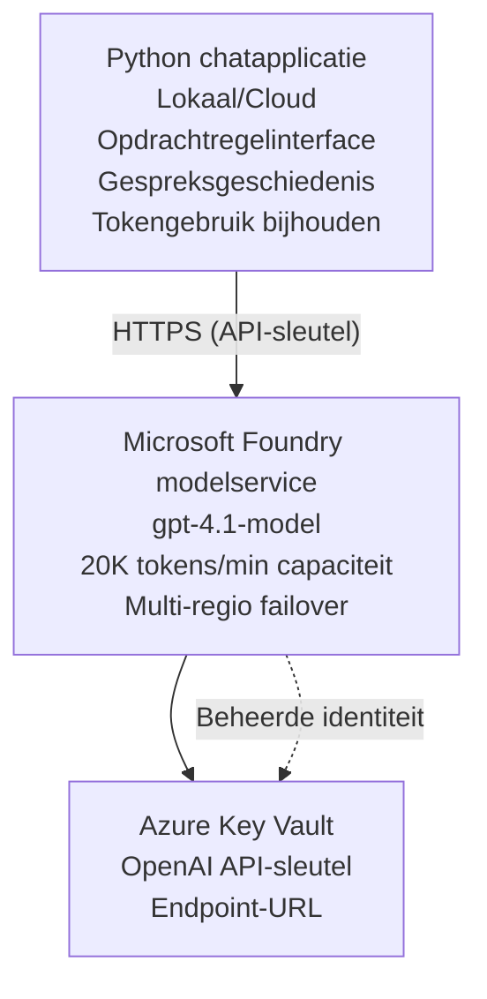

# Microsoft Foundry Models Chatapplicatie

**Leerpad:** Gevorderd ⭐⭐ | **Tijd:** 35-45 minuten | **Kosten:** $50-200/maand

Een volledige Microsoft Foundry Models chatapplicatie uitgerold met behulp van Azure Developer CLI (azd). Dit voorbeeld laat zien hoe je gpt-4.1 implementeert, veilige API-toegang configureert en een eenvoudige chatinterface bouwt.

## 🎯 Wat je zult leren

- Microsoft Foundry Models Service implementeren met het gpt-4.1-model
- OpenAI API-sleutels beveiligen met Key Vault
- Een eenvoudige chatinterface bouwen met Python
- Tokengebruik en kosten monitoren
- Rate limiting en foutafhandeling implementeren

## 📦 Inbegrepen

✅ **Microsoft Foundry Models Service** - gpt-4.1 modelimplementatie  
✅ **Python Chat App** - Eenvoudige chatinterface voor de opdrachtregel  
✅ **Key Vault-integratie** - Beveiligde opslag van API-sleutels  
✅ **ARM-sjablonen** - Volledige infrastructuur als code  
✅ **Kostenbewaking** - Bijhouden van tokengebruik  
✅ **Rate Limiting** - Voorkom opbranden van quota  

## Architectuur



## Vereisten

### Benodigd

- **Azure Developer CLI (azd)** - [Install guide](https://learn.microsoft.com/azure/developer/azure-developer-cli/install-azd)
- **Azure-abonnement** met OpenAI-toegang - [Request access](https://aka.ms/oai/access)
- **Python 3.9+** - [Install Python](https://www.python.org/downloads/)

### Controleer vereisten

```bash
# Controleer azd-versie (vereist 1.5.0 of hoger)
azd version

# Controleer Azure-aanmelding
azd auth login

# Controleer Python-versie
python --version  # of python3 --version

# Controleer OpenAI-toegang (controleer in de Azure-portal)
az cognitiveservices account list-skus \
  --kind OpenAI \
  --location eastus
```

> **⚠️ Belangrijk:** Microsoft Foundry Models vereist goedkeuring voor applicaties. Als je nog niet hebt aangevraagd, bezoek [aka.ms/oai/access](https://aka.ms/oai/access). Goedkeuring duurt doorgaans 1-2 werkdagen.

## ⏱️ Implementatietijdlijn

| Phase | Duration | What Happens |
|-------|----------|--------------|
| Prerequisites check | 2-3 minutes | Verify OpenAI quota availability |
| Deploy infrastructure | 8-12 minutes | Create OpenAI, Key Vault, model deployment |
| Configure application | 2-3 minutes | Set up environment and dependencies |
| **Total** | **12-18 minutes** | Ready to chat with gpt-4.1 |

**Opmerking:** Een eerste OpenAI-implementatie kan langer duren vanwege modelprovisioning.

## Quick Start

```bash
# Navigeer naar het voorbeeld
cd examples/azure-openai-chat

# Initialiseer de omgeving
azd env new myopenai

# Implementeer alles (infrastructuur + configuratie)
azd up
# Je wordt gevraagd om:
# 1. Selecteer een Azure-abonnement
# 2. Kies een locatie met OpenAI-beschikbaarheid (bijv. eastus, eastus2, westus)
# 3. Wacht 12-18 minuten op de implementatie

# Installeer Python-afhankelijkheden
pip install -r requirements.txt

# Begin met chatten!
python chat.py
```

**Verwachte uitvoer:**
```
🤖 Microsoft Foundry Models Chat Application
Connected to: gpt-4.1 (eastus)
Type your message (or 'quit' to exit)

You: Hello! Tell me about Microsoft Foundry Models.
Assistant: Microsoft Foundry Models Service provides REST API access to OpenAI's powerful language models including gpt-4.1, GPT-3.5-Turbo, and Embeddings...

[Tokens used: 145 | Estimated cost: $0.0044]
```

## ✅ Verifieer implementatie

### Stap 1: Controleer Azure-resources

```bash
# Bekijk geïmplementeerde resources
azd show

# Verwachte uitvoer toont:
# - OpenAI-service: (naam van de resource)
# - Key Vault: (naam van the resource)
# - Implementatie: gpt-4.1
# - Locatie: eastus (of uw geselecteerde regio)
```

### Stap 2: Test OpenAI API

```bash
# Haal OpenAI-eindpunt en sleutel op
OPENAI_ENDPOINT=$(azd env get-value AZURE_OPENAI_ENDPOINT)
OPENAI_KEY=$(azd env get-value AZURE_OPENAI_API_KEY)

# Test API-aanroep
curl "$OPENAI_ENDPOINT/openai/deployments/gpt-4.1/chat/completions?api-version=2024-08-01-preview" \
  -H "Content-Type: application/json" \
  -H "api-key: $OPENAI_KEY" \
  -d '{
    "messages": [{"role": "user", "content": "Say hello!"}],
    "max_tokens": 50
  }'
```

**Verwachte reactie:**
```json
{
  "choices": [
    {
      "message": {
        "role": "assistant",
        "content": "Hello! How can I assist you today?"
      }
    }
  ],
  "usage": {
    "prompt_tokens": 8,
    "completion_tokens": 9,
    "total_tokens": 17
  }
}
```

### Stap 3: Verifieer Key Vault-toegang

```bash
# Geef geheimen in Key Vault weer
KV_NAME=$(azd env get-value AZURE_KEY_VAULT_NAME)

az keyvault secret list \
  --vault-name $KV_NAME \
  --query "[].name" \
  --output table
```

**Verwachte secrets:**
- `openai-api-key`
- `openai-endpoint`

**Succescriteria:**
- ✅ OpenAI-service geïmplementeerd met gpt-4.1
- ✅ API-aanroep retourneert geldige completion
- ✅ Secrets opgeslagen in Key Vault
- ✅ Tracking van tokengebruik werkt

## Projectstructuur

```
azure-openai-chat/
├── README.md                   ✅ This guide
├── azure.yaml                  ✅ AZD configuration
├── infra/                      ✅ Infrastructure as Code
│   ├── main.bicep             ✅ Main Bicep template
│   ├── main.parameters.json   ✅ Parameters
│   └── openai.bicep           ✅ OpenAI resource definition
├── src/                        ✅ Application code
│   ├── chat.py                ✅ Chat interface
│   ├── config.py              ✅ Configuration loader
│   └── requirements.txt       ✅ Python dependencies
└── .gitignore                  ✅ Git ignore rules
```

## Applicatiefuncties

### Chatinterface (`chat.py`)

De chatapplicatie bevat:

- **Gesprekshistorie** - Handhaaft context over berichten heen
- **Tokentelling** - Houdt gebruik bij en schat kosten
- **Foutafhandeling** - Verzorgde afhandeling van rate limits en API-fouten
- **Kostenschatting** - Realtime kostencalculatie per bericht
- **Streaming-ondersteuning** - Optionele streamingreacties

### Commando's

Tijdens het chatten kun je gebruiken:
- `quit` of `exit` - Sessie beëindigen
- `clear` - Gesprekshistorie wissen
- `tokens` - Toon totaal tokengebruik
- `cost` - Toon geschatte totale kosten

### Configuratie (`config.py`)

Laadt configuratie uit omgevingsvariabelen:
```python
AZURE_OPENAI_ENDPOINT  # Van Key Vault
AZURE_OPENAI_API_KEY   # Van Key Vault
AZURE_OPENAI_MODEL     # Standaard: gpt-4.1
AZURE_OPENAI_MAX_TOKENS # Standaard: 800
```

## Gebruikvoorbeelden

### Basis Chat

```bash
python chat.py
```

### Chat met aangepast model

```bash
export AZURE_OPENAI_MODEL=gpt-35-turbo
python chat.py
```

### Chat met streaming

```bash
python chat.py --stream
```

### Voorbeeldgesprek

```
You: Explain Microsoft Foundry Models Service in 3 sentences.
Assistant: Microsoft Foundry Models Service is Microsoft Azure's cloud platform offering 
that provides access to OpenAI's powerful language models. It enables developers 
to integrate capabilities like gpt-4.1 into their applications with enterprise-grade 
security and compliance. The service includes features for content filtering, 
abuse monitoring, and responsible AI practices.

[Tokens used: 89 | Estimated cost: $0.0027]

You: What models are available?
Assistant: Microsoft Foundry Models Service offers several model families including gpt-4.1 
(most capable), GPT-3.5-Turbo (faster and cost-effective), and Embeddings models 
for vector search. Each model has different capabilities, pricing, and token limits.

[Tokens used: 67 | Estimated cost: $0.0020]

Total session: 156 tokens | $0.0047
```

## Kostenbeheer

### Tokenprijzen (gpt-4.1)

| Model | Input (per 1K tokens) | Output (per 1K tokens) |
|-------|----------------------|------------------------|
| gpt-4.1 | $0.03 | $0.06 |
| GPT-3.5-Turbo | $0.0015 | $0.002 |

### Geschatte maandelijkse kosten

Op basis van gebruikspatronen:

| Usage Level | Messages/Day | Tokens/Day | Monthly Cost |
|-------------|--------------|------------|--------------|
| **Light** | 20 messages | 3,000 tokens | $3-5 |
| **Moderate** | 100 messages | 15,000 tokens | $15-25 |
| **Heavy** | 500 messages | 75,000 tokens | $75-125 |

**Basiskosten infrastructuur:** $1-2/maand (Key Vault + minimale compute)

### Tips voor kostenoptimalisatie

```bash
# 1. Gebruik GPT-3.5-Turbo voor eenvoudigere taken (20x goedkoper)
export AZURE_OPENAI_MODEL=gpt-35-turbo

# 2. Verminder het maximale aantal tokens voor kortere antwoorden
export AZURE_OPENAI_MAX_TOKENS=400

# 3. Houd het tokenverbruik in de gaten
python chat.py --show-tokens

# 4. Stel budgetmeldingen in
az consumption budget create \
  --budget-name "openai-budget" \
  --amount 50 \
  --time-grain Monthly
```

## Monitoring

### Bekijk tokengebruik

```bash
# In het Azure-portaal:
# OpenAI-resource → Metrieken → Selecteer "Token Transaction"

# Of via Azure CLI:
az monitor metrics list \
  --resource $(azd env get-value AZURE_OPENAI_RESOURCE_ID) \
  --metric "TokenTransaction" \
  --start-time $(date -u -d '1 hour ago' '+%Y-%m-%dT%H:%M:%S') \
  --interval PT1M
```

### Bekijk API-logs

```bash
# Stuur diagnostische logbestanden
az monitor diagnostic-settings create \
  --resource $(azd env get-value AZURE_OPENAI_RESOURCE_ID) \
  --name openai-logs \
  --logs '[{"category": "Audit", "enabled": true}]' \
  --workspace $(azd env get-value LOG_ANALYTICS_WORKSPACE_ID)

# Logbestanden van queries
az monitor log-analytics query \
  --workspace $(azd env get-value LOG_ANALYTICS_WORKSPACE_ID) \
  --analytics-query "AzureDiagnostics | where Category == 'Audit' | top 10 by TimeGenerated"
```

## Problemen oplossen

### Probleem: "Access Denied" fout

**Symptomen:** 403 Forbidden bij het aanroepen van de API

**Oplossingen:**
```bash
# 1. Controleer of OpenAI-toegang is goedgekeurd
az cognitiveservices account show \
  --name $(azd env get-value AZURE_OPENAI_NAME) \
  --resource-group $(azd env get-value AZURE_RESOURCE_GROUP)

# 2. Controleer of de API-sleutel correct is
azd env get-value AZURE_OPENAI_API_KEY

# 3. Controleer het formaat van de endpoint-URL
azd env get-value AZURE_OPENAI_ENDPOINT
# Moet zijn: https://[name].openai.azure.com/
```

### Probleem: "Rate Limit Exceeded"

**Symptomen:** 429 Too Many Requests

**Oplossingen:**
```bash
# 1. Controleer de huidige quota
az cognitiveservices account deployment show \
  --name $(azd env get-value AZURE_OPENAI_NAME) \
  --resource-group $(azd env get-value AZURE_RESOURCE_GROUP) \
  --deployment-name gpt-4.1

# 2. Vraag een verhoging van de quota aan (indien nodig)
# Ga naar het Azure-portaal → OpenAI-resource → Quota → Verhoging aanvragen

# 3. Implementeer retry-logica (reeds in chat.py)
# De applicatie probeert automatisch opnieuw met exponentiële backoff
```

### Probleem: "Model Not Found"

**Symptomen:** 404-fout voor deployment

**Oplossingen:**
```bash
# 1. Toon beschikbare implementaties
az cognitiveservices account deployment list \
  --name $(azd env get-value AZURE_OPENAI_NAME) \
  --resource-group $(azd env get-value AZURE_RESOURCE_GROUP)

# 2. Controleer modelnaam in de omgeving
echo $AZURE_OPENAI_MODEL

# 3. Werk de naam van de implementatie bij
export AZURE_OPENAI_MODEL=gpt-4.1  # of gpt-35-turbo
```

### Probleem: Hoge latency

**Symptomen:** Trage reactietijden (>5 seconden)

**Oplossingen:**
```bash
# 1. Controleer regionale latentie
# Implementeer naar de regio die het dichtst bij gebruikers ligt

# 2. Verlaag max_tokens voor snellere antwoorden
export AZURE_OPENAI_MAX_TOKENS=400

# 3. Gebruik streaming voor een betere gebruikerservaring
python chat.py --stream
```

## Beveiligingsbest practices

### 1. Bescherm API-sleutels

```bash
# Plaats nooit sleutels in versiebeheer
# Gebruik Key Vault (al geconfigureerd)

# Roteer sleutels regelmatig
az cognitiveservices account keys regenerate \
  --name $(azd env get-value AZURE_OPENAI_NAME) \
  --resource-group $(azd env get-value AZURE_RESOURCE_GROUP) \
  --key-name key1
```

### 2. Implementeer contentfiltering

```python
# Microsoft Foundry Models bevat ingebouwde contentfiltering
# Configureren in de Azure-portal:
# OpenAI-resource → Contentfilters → Aangepaste filter maken

# Categorieën: Haat, Seksueel, Geweld, Zelfbeschadiging
# Niveaus: lage, gemiddelde en hoge filtering
```

### 3. Gebruik een Managed Identity (productie)

```bash
# Gebruik voor productie-implementaties een beheerde identiteit
# in plaats van API-sleutels (vereist dat de app op Azure wordt gehost)

# Werk infra/openai.bicep bij om het volgende op te nemen:
# identity: { type: 'SystemAssigned' }
```

## Ontwikkeling

### lokaal uitvoeren

```bash
# Installeer afhankelijkheden
pip install -r src/requirements.txt

# Stel omgevingsvariabelen in
export AZURE_OPENAI_ENDPOINT="https://[name].openai.azure.com/"
export AZURE_OPENAI_API_KEY="your-api-key"
export AZURE_OPENAI_MODEL="gpt-4.1"

# Voer de applicatie uit
python src/chat.py
```

### Tests uitvoeren

```bash
# Installeer testafhankelijkheden
pip install pytest pytest-cov

# Voer tests uit
pytest tests/ -v

# Met testdekking
pytest tests/ --cov=src --cov-report=html
```

### Update modelimplementatie

```bash
# Rol een andere modelversie uit
az cognitiveservices account deployment create \
  --name $(azd env get-value AZURE_OPENAI_NAME) \
  --resource-group $(azd env get-value AZURE_RESOURCE_GROUP) \
  --deployment-name gpt-35-turbo \
  --model-name gpt-35-turbo \
  --model-version "0613" \
  --model-format OpenAI \
  --sku-capacity 20 \
  --sku-name "Standard"
```

## Opruimen

```bash
# Verwijder alle Azure-bronnen
azd down --force --purge

# Dit verwijdert:
# - OpenAI-service
# - Key Vault (met 90 dagen zachte verwijdering)
# - Resourcegroep
# - Alle implementaties en configuraties
```

## Volgende stappen

### Breid dit voorbeeld uit

1. **Add Web Interface** - Build React/Vue frontend
   ```bash
   # Voeg frontend-service toe aan azure.yaml
   # Implementeer in Azure Static Web Apps
   ```

2. **Implement RAG** - Add document search with Azure AI Search
   ```python
   # Integreer Azure AI Search
   # Upload documenten en maak een vectorindex
   ```

3. **Add Function Calling** - Enable tool use
   ```python
   # Definieer functies in chat.py
   # Laat gpt-4.1 externe API's aanroepen
   ```

4. **Multi-Model Support** - Deploy multiple models
   ```bash
   # Voeg gpt-35-turbo en embeddings-modellen toe
   # Implementeer modelrouteringslogica
   ```

### Gerelateerde voorbeelden

- **[Retail Multi-Agent](../retail-scenario.md)** - Geavanceerde multi-agent architectuur
- **[Database App](../../../../examples/database-app)** - Voeg persistente opslag toe
- **[Container Apps](../../../../examples/container-app)** - Deploy als gecontaineriseerde service

### Leerbronnen

- 📚 [AZD For Beginners Course](../../README.md) - Hoofdcursus startpagina
- 📚 [Microsoft Foundry Models Documentation](https://learn.microsoft.com/azure/ai-services/openai/) - Officiële documentatie
- 📚 [OpenAI API Reference](https://platform.openai.com/docs/api-reference) - API-details
- 📚 [Responsible AI](https://www.microsoft.com/ai/responsible-ai) - Best practices

## Aanvullende bronnen

### Documentatie
- **[Microsoft Foundry Models Service](https://learn.microsoft.com/azure/ai-services/openai/)** - Volledige gids
- **[gpt-4.1 Models](https://learn.microsoft.com/azure/ai-services/openai/concepts/models)** - Modelmogelijkheden
- **[Content Filtering](https://learn.microsoft.com/azure/ai-services/openai/concepts/content-filter)** - Veiligheidsfuncties
- **[Azure Developer CLI](https://learn.microsoft.com/azure/developer/azure-developer-cli/)** - azd-referentie

### Tutorials
- **[OpenAI Quickstart](https://learn.microsoft.com/azure/ai-services/openai/quickstart)** - Eerste implementatie
- **[Chat Completions](https://learn.microsoft.com/azure/ai-services/openai/how-to/chatgpt)** - Chatapps bouwen
- **[Function Calling](https://learn.microsoft.com/azure/ai-services/openai/how-to/function-calling)** - Geavanceerde functies

### Tools
- **[Microsoft Foundry Models Studio](https://oai.azure.com/)** - Webgebaseerde playground
- **[Prompt Engineering Guide](https://platform.openai.com/docs/guides/prompt-engineering)** - Beter prompts schrijven
- **[Token Calculator](https://platform.openai.com/tokenizer)** - Schat tokengebruik

### Community
- **[Azure AI Discord](https://discord.gg/azure)** - Hulp van de community
- **[GitHub Discussions](https://github.com/Azure-Samples/openai/discussions)** - Q&A-forum
- **[Azure Blog](https://azure.microsoft.com/blog/tag/azure-openai-service/)** - Laatste updates

---

**🎉 Gefeliciteerd!** Je hebt Microsoft Foundry Models uitgerold en een werkende chatapplicatie gebouwd. Begin met het verkennen van de mogelijkheden van gpt-4.1 en experimenteer met verschillende prompts en use cases.

**Vragen?** [Open an issue](https://github.com/microsoft/AZD-for-beginners/issues) of bekijk de [FAQ](../../resources/faq.md)

**Kostenwaarschuwing:** Vergeet niet `azd down` uit te voeren wanneer je klaar bent met testen om doorlopende kosten te voorkomen (~$50-100/maand voor actief gebruik).

---

<!-- CO-OP TRANSLATOR DISCLAIMER START -->
**Disclaimer**:
Dit document is vertaald met behulp van de AI vertaaldienst [Co-op Translator](https://github.com/Azure/co-op-translator). Hoewel we streven naar nauwkeurigheid, dient u er rekening mee te houden dat geautomatiseerde vertalingen fouten of onnauwkeurigheden kunnen bevatten. Het originele document in de oorspronkelijke taal moet worden beschouwd als de gezaghebbende bron. Voor kritieke informatie wordt professionele menselijke vertaling aanbevolen. Wij zijn niet aansprakelijk voor eventuele misverstanden of verkeerde interpretaties die voortvloeien uit het gebruik van deze vertaling.
<!-- CO-OP TRANSLATOR DISCLAIMER END -->