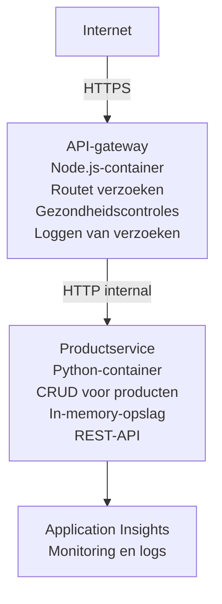

# Microservices Architecture - Container App Example

⏱️ **Geschatte tijd**: 25-35 minuten | 💰 **Geschatte kosten**: ~$50-100/maand | ⭐ **Complexiteit**: Advanced

Een **vereenvoudigde maar functionele** microservices-architectuur uitgerold naar Azure Container Apps met behulp van de AZD CLI. Dit voorbeeld demonstreert service-naar-service communicatie, containerorkestratie en monitoring met een praktisch 2-service opzet.

> **📚 Leerbenadering**: Dit voorbeeld begint met een minimale 2-service architectuur (API Gateway + Backend Service) die je daadwerkelijk kunt implementeren en waar je van kunt leren. Nadat je deze basis beheerst, geven we aanwijzingen voor uitbreiding naar een volledig microservices-ecosysteem.

## Wat je zult leren

Door dit voorbeeld te voltooien, zul je:
- Meerdere containers naar Azure Container Apps implementeren
- Service-naar-service communicatie implementeren met interne netwerkverbinding
- Omgevingsgebaseerde scaling en health checks configureren
- Gedistribueerde applicaties monitoren met Application Insights
- Microservices-implementatiepatronen en best practices begrijpen
- Leren hoe je geleidelijk uitbreidt van eenvoudige naar complexe architecturen

## Architectuur

### Fase 1: Wat we bouwen (opgenomen in dit voorbeeld)


**Waarom eenvoudig beginnen?**
- ✅ Snel implementeren en begrijpen (25-35 minuten)
- ✅ Leer kernpatronen van microservices zonder complexiteit
- ✅ Werkende code die je kunt aanpassen en mee kunt experimenteren
- ✅ Lagere kosten om te leren (~$50-100/maand vs $300-1400/maand)
- ✅ Bouw vertrouwen op voordat je databases en berichtwachtrijen toevoegt

**Analogie**: Zie het als leren autorijden. Je begint op een lege parkeerplaats (2 services), beheerst de basis en gaat dan naar stadsverkeer (5+ services met databases).

### Fase 2: Toekomstige uitbreiding (referentiearchitectuur)

Zodra je de 2-service architectuur beheerst, kun je uitbreiden naar:

```
Full Architecture (Not Included - For Reference)
├── API Gateway (✅ Included)
├── Product Service (✅ Included)
├── Order Service (🔜 Add next)
├── User Service (🔜 Add next)
├── Notification Service (🔜 Add last)
├── Azure Service Bus (🔜 For async communication)
├── Cosmos DB (🔜 For product persistence)
├── Azure SQL (🔜 For order management)
└── Azure Storage (🔜 For file storage)
```

Zie de sectie "Expansion Guide" aan het einde voor stapsgewijze instructies.

## Inbegrepen functies

✅ **Service Discovery**: Automatische DNS-gebaseerde ontdekking tussen containers  
✅ **Load Balancing**: Ingebouwde load balancing over replicas  
✅ **Auto-scaling**: Onafhankelijke scaling per service op basis van HTTP-verzoeken  
✅ **Health Monitoring**: Liveness- en readiness-probes voor beide services  
✅ **Gedistribueerde logging**: Gecentraliseerde logging met Application Insights  
✅ **Interne netwerken**: Veilige service-naar-service communicatie  
✅ **Containerorkestratie**: Automatische implementatie en scaling  
✅ **Updates zonder onderbreking**: Rolling updates met revisiebeheer  

## Vereisten

### Vereiste tools

Voordat je begint, controleer of je deze tools hebt geïnstalleerd:

1. **[Azure Developer CLI (azd)](https://learn.microsoft.com/azure/developer/azure-developer-cli/install-azd)** (versie 1.0.0 of hoger)
   ```bash
   azd version
   # Verwachte uitvoer: azd-versie 1.0.0 of hoger
   ```

2. **[Azure CLI](https://learn.microsoft.com/cli/azure/install-azure-cli)** (versie 2.50.0 of hoger)
   ```bash
   az --version
   # Verwachte uitvoer: azure-cli 2.50.0 of hoger
   ```

3. **[Docker](https://www.docker.com/get-started)** (voor lokale ontwikkeling/testen - optioneel)
   ```bash
   docker --version
   # Verwachte uitvoer: Docker-versie 20.10 of hoger
   ```

### Azure-vereisten

- Een actief **Azure-abonnement** ([maak een gratis account aan](https://azure.microsoft.com/free/))
- Machtigingen om resources te maken in je abonnement
- De rol **Contributor** op het abonnement of de resourcegroep

### Vereiste kennis

Dit is een **gevorderd** voorbeeld. Je zou het volgende moeten hebben:
- Het [Simple Flask API-voorbeeld](../../../../../examples/container-app/simple-flask-api) voltooid hebben 
- Basiskennis van microservices-architectuur
- Bekendheid met REST-API's en HTTP
- Begrip van containerconcepten

**Nieuw met Container Apps?** Begin eerst met het [Simple Flask API-voorbeeld](../../../../../examples/container-app/simple-flask-api) om de basis te leren.

## Snelle start (stap-voor-stap)

### Stap 1: Kloon en navigeer

```bash
git clone https://github.com/microsoft/AZD-for-beginners.git
cd AZD-for-beginners/examples/container-app/microservices
```

**✓ Succescontrole**: Controleer of je `azure.yaml` ziet:
```bash
ls
# Verwacht: README.md, azure.yaml, infra/, src/
```

### Stap 2: Meld je aan bij Azure

```bash
azd auth login
```

Dit opent je browser voor Azure-authenticatie. Meld je aan met je Azure-gegevens.

**✓ Succescontrole**: Je zou het volgende moeten zien:
```
Logged in to Azure.
```

### Stap 3: Initialiseer de omgeving

```bash
azd init
```

Vragen die je zult zien:
- **Omgevingsnaam**: Voer een korte naam in (bijv. `microservices-dev`)
- **Azure-abonnement**: Selecteer je abonnement
- **Azure-locatie**: Kies een regio (bijv. `eastus`, `westeurope`)

**✓ Succescontrole**: Je zou het volgende moeten zien:
```
SUCCESS: New project initialized!
```

### Stap 4: Implementeer infrastructuur en services

```bash
azd up
```

**Wat er gebeurt** (duurt 8-12 minuten):
1. Maakt Container Apps-omgeving aan
2. Maakt Application Insights aan voor monitoring
3. Bouwt API Gateway-container (Node.js)
4. Bouwt Product Service-container (Python)
5. Implementeert beide containers in Azure
6. Configureert netwerken en health checks
7. Stelt monitoring en logging in

**✓ Succescontrole**: Je zou het volgende moeten zien:
```
SUCCESS: Your application was deployed to Azure in X minutes Y seconds.
Endpoint: https://api-gateway-<unique-id>.azurecontainerapps.io
```

**⏱️ Tijd**: 8-12 minuten

### Stap 5: Test de implementatie

```bash
# Haal het gateway-eindpunt op
GATEWAY_URL=$(azd env get-values | grep API_GATEWAY_URL | cut -d '=' -f2 | tr -d '"')

# Test de gezondheid van de API-gateway
curl $GATEWAY_URL/health

# Verwachte uitvoer:
# {"status":"gezond","service":"api-gateway","timestamp":"2025-11-19T10:30:00Z"}
```

**Test de productservice via de gateway**:
```bash
# Producten weergeven
curl $GATEWAY_URL/api/products

# Verwachte uitvoer:
# [
#   {"id":1,"name":"Laptop","price":999.99,"stock":50},
#   {"id":2,"name":"Muis","price":29.99,"stock":200},
#   {"id":3,"name":"Toetsenbord","price":79.99,"stock":150}
# ]
```

**✓ Succescontrole**: Beide eindpunten geven JSON-data terug zonder fouten.

---

**🎉 Gefeliciteerd!** Je hebt een microservices-architectuur in Azure gedeployed!

## Projectstructuur

Alle implementatiebestanden zijn inbegrepen—dit is een compleet, werkend voorbeeld:

```
microservices/
│
├── README.md                         # This file
├── azure.yaml                        # AZD configuration
├── .gitignore                        # Git ignore patterns
│
├── infra/                           # Infrastructure as Code (Bicep)
│   ├── main.bicep                   # Main orchestration
│   ├── abbreviations.json           # Naming conventions
│   ├── core/                        # Shared infrastructure
│   │   ├── container-apps-environment.bicep  # Container environment + registry
│   │   └── monitor.bicep            # Application Insights + Log Analytics
│   └── app/                         # Service definitions
│       ├── api-gateway.bicep        # API Gateway container app
│       └── product-service.bicep    # Product Service container app
│
└── src/                             # Application source code
    ├── api-gateway/                 # Node.js API Gateway
    │   ├── app.js                   # Express server with routing
    │   ├── package.json             # Node dependencies
    │   └── Dockerfile               # Container definition
    └── product-service/             # Python Product Service
        ├── main.py                  # Flask API with product data
        ├── requirements.txt         # Python dependencies
        └── Dockerfile               # Container definition
```

**Wat elk onderdeel doet:**

**Infrastructuur (infra/)**:
- `main.bicep`: Orkestreert alle Azure-resources en hun afhankelijkheden
- `core/container-apps-environment.bicep`: Maakt de Container Apps-omgeving en Azure Container Registry aan
- `core/monitor.bicep`: Stelt Application Insights in voor gedistribueerde logging
- `app/*.bicep`: Individuele container app-definities met scaling en health checks

**API Gateway (src/api-gateway/)**:
- Publieke service die verzoeken naar backend-services routet
- Implementeert logging, foutafhandeling en request forwarding
- Demonstreert service-naar-service HTTP-communicatie

**Productservice (src/product-service/)**:
- Interne service met productcatalogus (in geheugen voor eenvoud)
- REST API met health checks
- Voorbeeld van een backend microservice-patroon

## Overzicht van services

### API Gateway (Node.js/Express)

**Poort**: 8080  
**Toegang**: Publiek (externe ingress)  
**Doel**: Routeren van binnenkomende verzoeken naar geschikte backendservices  

**Endpoints**:
- `GET /` - Service-informatie
- `GET /health` - Health check-endpoint
- `GET /api/products` - Forward naar productservice (lijst alle producten)
- `GET /api/products/:id` - Forward naar productservice (haal op op ID)

**Belangrijkste kenmerken**:
- Verzoekroutering met axios
- Gecentraliseerde logging
- Foutafhandeling en timeoutbeheer
- Service discovery via omgevingsvariabelen
- Integratie met Application Insights

**Code-voorbeeld** (`src/api-gateway/app.js`):
```javascript
// Interne servicecommunicatie
app.get('/api/products', async (req, res) => {
  const response = await axios.get(`${PRODUCT_SERVICE_URL}/products`);
  res.json(response.data);
});
```

### Productservice (Python/Flask)

**Poort**: 8000  
**Toegang**: Alleen intern (geen externe ingress)  
**Doel**: Beheert productcatalogus met in-geheugen data  

**Endpoints**:
- `GET /` - Service-informatie
- `GET /health` - Health check-endpoint
- `GET /products` - Lijst alle producten
- `GET /products/<id>` - Haal product op per ID

**Belangrijkste kenmerken**:
- RESTful API met Flask
- In-geheugen productopslag (simpel, geen database nodig)
- Gezondheidsmonitoring met probes
- Gestructureerde logging
- Integratie met Application Insights

**Datamodel**:
```python
{
  "id": 1,
  "name": "Laptop",
  "description": "High-performance laptop",
  "price": 999.99,
  "stock": 50
}
```

**Waarom alleen intern?**
De productservice is niet publiekelijk blootgesteld. Alle verzoeken moeten via de API Gateway gaan, die zorgt voor:
- Beveiliging: Gecontroleerd toegangspunt
- Flexibiliteit: Backend kan wijzigen zonder clients te beïnvloeden
- Monitoring: Gecentraliseerde request-logging

## Inzicht in servicecommunicatie

### Hoe services met elkaar communiceren

In dit voorbeeld communiceert de API Gateway met de Productservice via **interne HTTP-aanroepen**:

```javascript
// API-gateway (src/api-gateway/app.js)
const PRODUCT_SERVICE_URL = process.env.PRODUCT_SERVICE_URL;

// Maak een intern HTTP-verzoek
const response = await axios.get(`${PRODUCT_SERVICE_URL}/products`);
```

**Belangrijke punten**:

1. **DNS-gebaseerde ontdekking**: Container Apps biedt automatisch DNS voor interne services
   - Product Service FQDN: `product-service.internal.<environment>.azurecontainerapps.io`
   - Vereenvoudigd als: `http://product-service` (Container Apps lost dit op)

2. **Geen publieke blootstelling**: Product Service heeft `external: false` in Bicep
   - Alleen toegankelijk binnen de Container Apps-omgeving
   - Niet bereikbaar vanaf het internet

3. **Omgevingsvariabelen**: Service-URL's worden tijdens deployment geïnjecteerd
   - Bicep geeft de interne FQDN door aan de gateway
   - Geen harde gecodeerde URL's in de applicatiecode

**Analogie**: Zie het als kantoorkamers. De API Gateway is de receptie (publieksgericht) en de Productservice is een kantoorruimte (alleen intern). Bezoekers moeten via de receptie naar een kantoor toe.

## Implementatie-opties

### Volledige implementatie (aanbevolen)

```bash
# Implementeer infrastructuur en beide diensten
azd up
```

Dit implementeert:
1. Container Apps-omgeving
2. Application Insights
3. Container Registry
4. API Gateway-container
5. Product Service-container

**Tijd**: 8-12 minuten

### Implementeer individuele service

```bash
# Implementeer slechts één service (na de initiële azd up)
azd deploy api-gateway

# Of implementeer de productservice
azd deploy product-service
```

**Gebruikssituatie**: Wanneer je code in één service hebt bijgewerkt en alleen die service opnieuw wilt implementeren.

### Configuratie bijwerken

```bash
# Wijzig schaalparameters
azd env set GATEWAY_MAX_REPLICAS 30

# Opnieuw uitrollen met nieuwe configuratie
azd up
```

## Configuratie

### Schaalconfiguratie

Beide services zijn geconfigureerd met op HTTP gebaseerde autoscaling in hun Bicep-bestanden:

**API Gateway**:
- Minimale replica's: 2 (altijd ten minste 2 voor beschikbaarheid)
- Maximale replica's: 20
- Schaaltrigger: 50 gelijktijdige verzoeken per replica

**Productservice**:
- Minimale replica's: 1 (kan indien nodig naar nul schalen)
- Maximale replica's: 10
- Schaaltrigger: 100 gelijktijdige verzoeken per replica

**Schaalinstellingen aanpassen** (in `infra/app/*.bicep`):
```bicep
scale: {
  minReplicas: 1
  maxReplicas: 10
  rules: [
    {
      name: 'http-scale-rule'
      http: {
        metadata: {
          concurrentRequests: '100'  // Adjust this
        }
      }
    }
  ]
}
```

### Resourcetoewijzing

**API Gateway**:
- CPU: 1.0 vCPU
- Geheugen: 2 GiB
- Reden: Verwerkt al het externe verkeer

**Productservice**:
- CPU: 0.5 vCPU
- Geheugen: 1 GiB
- Reden: Lichtgewicht in-geheugen bewerkingen

### Gezondheidscontroles

Beide services bevatten liveness- en readiness-probes:

```bicep
probes: [
  {
    type: 'Liveness'
    httpGet: {
      path: '/health'
      port: 8080
    }
    initialDelaySeconds: 10
    periodSeconds: 30
  }
  {
    type: 'Readiness'
    httpGet: {
      path: '/health'
      port: 8080
    }
    initialDelaySeconds: 5
    periodSeconds: 10
  }
]
```

**Wat dit betekent**:
- **Liveness**: Als de health check faalt, herstart Container Apps de container
- **Readiness**: Als niet klaar, stopt Container Apps met verkeer routeren naar die replica


## Monitoring en observeerbaarheid

### Bekijk service-logs

```bash
# Bekijk logs met azd monitor
azd monitor --logs

# Of gebruik de Azure CLI voor specifieke Container Apps:
# Bekijk live-logs van de API Gateway
az containerapp logs show --name api-gateway --resource-group $RG_NAME --follow

# Bekijk recente logs van de productservice
az containerapp logs show --name product-service --resource-group $RG_NAME --tail 100
```

**Verwachte uitvoer**:
```
[api-gateway] API Gateway listening on port 8080
[api-gateway] Product Service URL: http://product-service
[api-gateway] GET /api/products 200 - 45ms
[product-service] Retrieved 5 products
```

### Application Insights-query's

Ga naar Application Insights in de Azure Portal en voer dan deze queries uit:

**Zoek trage verzoeken**:
```kusto
requests
| where timestamp > ago(1h)
| where duration > 1000  // Requests taking >1 second
| summarize count() by name, cloud_RoleName
| order by count_ desc
```

**Volg service-naar-service-aanroepen**:
```kusto
dependencies
| where timestamp > ago(1h)
| where type == "Http"
| project timestamp, name, target, duration, success
| order by timestamp desc
```

**Foutpercentage per service**:
```kusto
exceptions
| where timestamp > ago(24h)
| summarize errorCount = count() by cloud_RoleName, type
| order by errorCount desc
```

**Aantal verzoeken over tijd**:
```kusto
requests
| where timestamp > ago(1h)
| summarize requestCount = count() by bin(timestamp, 5m), cloud_RoleName
| render timechart
```

### Toegang tot monitoringdashboard

```bash
# Haal Application Insights-gegevens op
azd env get-values | grep APPLICATIONINSIGHTS

# Open de monitoring in de Azure-portal
az monitor app-insights component show \
  --app $(azd env get-values | grep APPLICATIONINSIGHTS_CONNECTION_STRING | cut -d '=' -f2) \
  --resource-group $(azd env get-values | grep AZURE_RESOURCE_GROUP | cut -d '=' -f2) \
  --query "appId" -o tsv
```

### Live-metrics

1. Navigeer naar Application Insights in de Azure Portal
2. Klik op "Live Metrics"
3. Zie realtime verzoeken, fouten en prestaties
4. Test door uit te voeren: `curl $(azd env get-values | grep API_GATEWAY_URL | cut -d '=' -f2 | tr -d '"')/api/products`

## Praktische oefeningen

[Opmerking: Zie de volledige oefeningen hierboven in de sectie "Practical Exercises" voor gedetailleerde stap-voor-stap oefeningen inclusief verificatie van implementatie, gegevenswijziging, autoscaling-tests, foutafhandeling en het toevoegen van een derde service.]

## Kostenanalyse

### Geschatte maandelijkse kosten (voor dit 2-servicevoorbeeld)

| Resource | Configuratie | Geschatte kosten |
|----------|--------------|------------------|
| API Gateway | 2-20 replica's, 1 vCPU, 2GB RAM | $30-150 |
| Product Service | 1-10 replica's, 0.5 vCPU, 1GB RAM | $15-75 |
| Container Registry | Basis-tier | $5 |
| Application Insights | 1-2 GB/maand | $5-10 |
| Log Analytics | 1 GB/maand | $3 |
| **Totaal** | | **$58-243/maand** |

**Kostenopsplitsing naar gebruik**:
- **Licht verkeer** (testen/leren): ~$60/maand
- **Gemiddeld verkeer** (kleine productie): ~$120/maand
- **Zwaar verkeer** (drukke periodes): ~$240/maand

### Kostenoptimalisatietips

1. **Schaal naar nul voor ontwikkeling**:
   ```bicep
   scale: {
     minReplicas: 0  // Save $30-40/month when not in use
     maxReplicas: 10
   }
   ```

2. **Gebruik het Consumption-plan voor Cosmos DB** (wanneer je het toevoegt):
   - Betaal alleen voor wat je gebruikt
   - Geen minimumkosten

3. **Stel sampling in voor Application Insights**:
   ```javascript
   appInsights.defaultClient.config.samplingPercentage = 50; // Neem een steekproef van 50% van de verzoeken
   ```

4. **Ruim op wanneer niet nodig**:
   ```bash
   azd down
   ```

### Gratis tier-opties

Voor leren/testen, overweeg:
- Gebruik Azure gratis tegoed (de eerste 30 dagen)
- Houd het aantal replica's minimaal
- Verwijder na testen (geen doorlopende kosten)

---

## Opruimen

Om doorlopende kosten te voorkomen, verwijder alle resources:

```bash
azd down --force --purge
```

**Bevestigingsprompt**:
```
? Total resources to delete: 6, are you sure you want to continue? (y/N)
```

Typ `y` om te bevestigen.

**Wat wordt verwijderd**:
- Container Apps Environment
- Beide Container Apps (gateway & product service)
- Container Registry
- Application Insights
- Log Analytics Workspace
- Resource Group

**✓ Controleer opruiming**:
```bash
az group list --query "[?starts_with(name,'rg-microservices')]" --output table
```

Zou leeg moeten zijn.

---

## Uitbreidingsgids: Van 2 naar 5+ services

Als je deze architectuur met 2 services beheerst, kun je als volgt uitbreiden:

### Fase 1: Databasepersistentie toevoegen (volgende stap)

**Voeg Cosmos DB toe voor de productservice**:

1. Maak `infra/core/cosmos.bicep` aan:
   ```bicep
   resource cosmosAccount 'Microsoft.DocumentDB/databaseAccounts@2023-04-15' = {
     name: name
     location: location
     kind: 'GlobalDocumentDB'
     properties: {
       databaseAccountOfferType: 'Standard'
       locations: [{ locationName: location, failoverPriority: 0 }]
     }
   }
   ```

2. Werk de productservice bij zodat deze Cosmos DB gebruikt in plaats van in-memory gegevens

3. Geschatte bijkomende kosten: ~$25/maand (serverless)

### Fase 2: Derde service toevoegen (Orderbeheer)

**Maak orderservice aan**:

1. Nieuwe map: `src/order-service/` (Python/Node.js/C#)
2. Nieuwe Bicep: `infra/app/order-service.bicep`
3. Werk de API-gateway bij om te routeren naar `/api/orders`
4. Voeg een Azure SQL Database toe voor orderpersistentie

**Architectuur wordt**:
```
API Gateway → Product Service (Cosmos DB)
           → Order Service (Azure SQL)
```

### Fase 3: Asynchrone communicatie toevoegen (Service Bus)

**Implementeer gebeurtenisgestuurde architectuur**:

1. Voeg Azure Service Bus toe: `infra/core/servicebus.bicep`
2. Productservice publiceert "ProductCreated" events
3. Orderservice abonneert zich op product-events
4. Voeg Notification Service toe om events te verwerken

**Patroon**: Request/Response (HTTP) + Gebeurtenisgestuurd (Service Bus)

### Fase 4: Gebruikersauthenticatie toevoegen

**Implementeer gebruikersservice**:

1. Maak `src/user-service/` aan (Go/Node.js)
2. Voeg Azure AD B2C of aangepaste JWT-authenticatie toe
3. API-gateway valideert tokens
4. Services controleren gebruikersrechten

### Fase 5: Productieklaar

**Voeg deze componenten toe**:
- Azure Front Door (wereldwijde load balancing)
- Azure Key Vault (geheimenbeheer)
- Azure Monitor Workbooks (aangepaste dashboards)
- CI/CD-pijplijn (GitHub Actions)
- Blue-Green-implementaties
- Beheerde identiteit voor alle services

**Kosten voor volledige productiearchitectuur**: ~$300-1,400/maand

---

## Meer informatie

### Gerelateerde documentatie
- [Azure Container Apps documentatie](https://learn.microsoft.com/azure/container-apps/)
- [Microservices architectuurgids](https://learn.microsoft.com/azure/architecture/guide/architecture-styles/microservices)
- [Application Insights voor gedistribueerde tracing](https://learn.microsoft.com/azure/azure-monitor/app/distributed-tracing)
- [Azure Developer CLI documentatie](https://learn.microsoft.com/azure/developer/azure-developer-cli/)

### Volgende stappen in deze cursus
- ← Vorige: [Eenvoudige Flask API](../../../../../examples/container-app/simple-flask-api) - Beginnersvoorbeeld met één container
- → Volgende: [Gids AI-integratie](../../../../../examples/docs/ai-foundry) - Voeg AI-mogelijkheden toe
- 🏠 [Cursus startpagina](../../README.md)

### Vergelijking: Wanneer wat te gebruiken

**Single Container App** (Eenvoudig Flask API-voorbeeld):
- ✅ Eenvoudige applicaties
- ✅ Monolithische architectuur
- ✅ Snel te implementeren
- ❌ Beperkte schaalbaarheid
- **Kosten**: ~$15-50/maand

**Microservices** (Dit voorbeeld):
- ✅ Complexe applicaties
- ✅ Onafhankelijke schaalbaarheid per service
- ✅ Teamautonomie (verschillende services, verschillende teams)
- ❌ Moeilijker te beheren
- **Kosten**: ~$60-250/maand

**Kubernetes (AKS)**:
- ✅ Maximale controle en flexibiliteit
- ✅ Multi-cloud draagbaarheid
- ✅ Geavanceerde netwerken
- ❌ Vereist Kubernetes-expertise
- **Kosten**: minimaal ~$150-500/maand

**Aanbeveling**: Begin met Container Apps (dit voorbeeld), ga pas naar AKS als je Kubernetes-specifieke functies nodig hebt.

---

## Veelgestelde vragen

**V: Waarom slechts 2 services in plaats van 5+?**  
A: Educatieve opbouw. Beheers de fundamentele principes (servicecommunicatie, monitoring, schaling) met een eenvoudig voorbeeld voordat je complexiteit toevoegt. De patronen die je hier leert zijn toepasbaar op architecturen met 100 services.

**V: Kan ik zelf meer services toevoegen?**  
A: Absoluut! Volg de uitbreidingsgids hierboven. Elke nieuwe service volgt hetzelfde patroon: maak een src-map, maak een Bicep-bestand, update azure.yaml, deploy.

**V: Is dit productieklaar?**  
A: Het is een solide basis. Voor productie voeg toe: beheerde identiteit, Key Vault, persistente databases, CI/CD-pijplijn, monitoringmeldingen en back-upstrategie.

**V: Waarom geen Dapr of andere service mesh gebruiken?**  
A: Houd het eenvoudig om te leren. Zodra je native Container Apps-netwerken begrijpt, kun je Dapr toevoegen voor geavanceerde scenario's.

**V: Hoe debug ik lokaal?**  
A: Draai services lokaal met Docker:
```bash
cd src/api-gateway
docker build -t local-gateway .
docker run -p 8080:8080 -e PRODUCT_SERVICE_URL=http://localhost:8000 local-gateway
```

**V: Kan ik verschillende programmeertalen gebruiken?**  
A: Ja! Dit voorbeeld toont Node.js (gateway) + Python (productservice). Je kunt elke taal mixen die in containers kan draaien.

**V: Wat als ik geen Azure-tegoed heb?**  
A: Gebruik Azure free tier (de eerste 30 dagen voor nieuwe accounts) of deployen voor korte testperiodes en onmiddellijk verwijderen.

---

> **🎓 Samenvatting leerpad**: Je hebt geleerd een multi-servicearchitectuur te implementeren met automatische schaaling, interne netwerken, gecentraliseerde monitoring en productieklare patronen. Deze basis bereidt je voor op complexe gedistribueerde systemen en enterprise microservices-architecturen.

**📚 Cursusnavigatie:**
- ← Vorige: [Eenvoudige Flask API](../../../../../examples/container-app/simple-flask-api)
- → Volgende: [Voorbeeld database-integratie](../../../../../examples/database-app)
- 🏠 [Cursus startpagina](../../../README.md)
- 📖 [Best practices Container Apps](../../../docs/chapter-04-infrastructure/deployment-guide.md)

---

<!-- CO-OP TRANSLATOR DISCLAIMER START -->
**Disclaimer**:
Dit document is vertaald met behulp van de AI-vertalingsdienst [Co-op Translator](https://github.com/Azure/co-op-translator). Hoewel we streven naar nauwkeurigheid, houd er rekening mee dat geautomatiseerde vertalingen fouten of onnauwkeurigheden kunnen bevatten. Het oorspronkelijke document in de oorspronkelijke taal moet als gezaghebbende bron worden beschouwd. Voor cruciale informatie wordt een professionele menselijke vertaling aanbevolen. Wij zijn niet aansprakelijk voor eventuele misverstanden of verkeerde interpretaties die voortvloeien uit het gebruik van deze vertaling.
<!-- CO-OP TRANSLATOR DISCLAIMER END -->