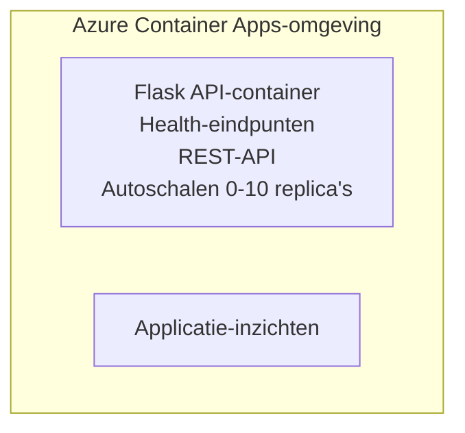

# Simple Flask API - Container App Example

**Leerpad:** Beginner ⭐ | **Tijd:** 25-35 minuten | **Kosten:** $0-15/maand

Een complete, werkende Python Flask REST API gedeployed naar Azure Container Apps met Azure Developer CLI (azd). Dit voorbeeld demonstreert containerdeploy, autoscaling en basisbewaking.

## 🎯 Wat je zult leren

- Een geïcontaineriseerde Python-toepassing naar Azure implementeren
- Autoscaling configureren met scale-to-zero
- Health probes en readiness checks implementeren
- Applicatielogs en metrics monitoren
- Azure Developer CLI gebruiken voor snelle implementatie

## 📦 Wat is inbegrepen

✅ **Flask-applicatie** - Complete REST API met CRUD-operaties (`src/app.py`)  
✅ **Dockerfile** - Productieklaar containerconfiguratie  
✅ **Bicep-infrastructuur** - Container Apps-omgeving en API-implementatie  
✅ **AZD-configuratie** - Eén-commando implementatiesetup  
✅ **Health Probes** - Liveness- en readiness-checks geconfigureerd  
✅ **Autoscaling** - 0-10 replicas gebaseerd op HTTP-load  

## Architectuur


## Vereisten

### Vereist
- **Azure Developer CLI (azd)** - [Install guide](https://learn.microsoft.com/azure/developer/azure-developer-cli/install-azd)
- **Azure-abonnement** - [Free account](https://azure.microsoft.com/free/)
- **Docker Desktop** - [Install Docker](https://www.docker.com/products/docker-desktop/) (voor lokaal testen)

### Controleer vereisten

```bash
# Controleer azd-versie (vereist 1.5.0 of hoger)
azd version

# Controleer Azure-aanmelding
azd auth login

# Controleer Docker (optioneel, voor lokaal testen)
docker --version
```

## ⏱️ Implementatietijdlijn

| Fase | Duur | Wat er gebeurt |
|-------|----------|--------------||
| Environment setup | 30 seconds | Create azd environment |
| Build container | 2-3 minutes | Docker build Flask app |
| Provision infrastructure | 3-5 minutes | Create Container Apps, registry, monitoring |
| Deploy application | 2-3 minutes | Push image and deploy to Container Apps |
| **Totaal** | **8-12 minuten** | Volledige implementatie gereed |

## Snelstart

```bash
# Navigeer naar het voorbeeld
cd examples/container-app/simple-flask-api

# Initialiseer de omgeving (kies een unieke naam)
azd env new myflaskapi

# Implementeer alles (infrastructuur + applicatie)
azd up
# Je wordt gevraagd om:
# 1. Selecteer een Azure-abonnement
# 2. Kies een locatie (bijv. eastus2)
# 3. Wacht 8-12 minuten op de implementatie

# Haal je API-eindpunt op
azd env get-values

# Test de API
curl $(azd env get-value API_ENDPOINT)/health
```

**Verwachte uitvoer:**
```json
{
  "status": "healthy",
  "timestamp": "2025-11-19T10:30:00Z",
  "service": "simple-flask-api",
  "version": "1.0.0"
}
```

## ✅ Controleer implementatie

### Stap 1: Controleer implementatiestatus

```bash
# Bekijk uitgerolde diensten
azd show

# Verwachte uitvoer toont:
# - Dienst: api
# - Eindpunt: https://ca-api-[env].xxx.azurecontainerapps.io
# - Status: Actief
```

### Stap 2: Test API-eindpunten

```bash
# Haal API-eindpunt op
API_URL=$(azd env get-value API_ENDPOINT)

# Test gezondheid
curl $API_URL/health

# Test root-eindpunt
curl $API_URL/

# Maak een item aan
curl -X POST $API_URL/api/items \
  -H "Content-Type: application/json" \
  -d '{"name": "Test Item", "description": "My first item"}'

# Haal alle items op
curl $API_URL/api/items
```

**Succescriteria:**
- ✅ Health-endpoint retourneert HTTP 200
- ✅ Root-endpoint toont API-informatie
- ✅ POST maakt item aan en retourneert HTTP 201
- ✅ GET retourneert aangemaakte items

### Stap 3: Bekijk logs

```bash
# Live logs streamen met azd monitor
azd monitor --logs

# Of gebruik de Azure CLI:
az containerapp logs show --name api --resource-group $RG_NAME --follow

# Je zou het volgende moeten zien:
# - Gunicorn opstartmeldingen
# - HTTP-verzoeklogs
# - Applicatie-infologs
```

## Projectstructuur

```
simple-flask-api/
├── azure.yaml              # AZD configuration
├── infra/
│   ├── main.bicep         # Main infrastructure
│   ├── main.parameters.json
│   └── app/
│       ├── container-env.bicep
│       └── api.bicep
└── src/
    ├── app.py             # Flask application
    ├── requirements.txt
    └── Dockerfile
```

## API-eindpunten

| Eindpunt | Methode | Beschrijving |
|----------|--------|-------------|
| `/health` | GET | Gezondheidscontrole |
| `/api/items` | GET | Alle items weergeven |
| `/api/items` | POST | Nieuw item aanmaken |
| `/api/items/{id}` | GET | Specifiek item ophalen |
| `/api/items/{id}` | PUT | Item bijwerken |
| `/api/items/{id}` | DELETE | Item verwijderen |

## Configuratie

### Omgevingsvariabelen

```bash
# Stel aangepaste configuratie in
azd env set PORT 8000
azd env set LOG_LEVEL info
azd env set MAX_REPLICAS 20
```

### Schaalconfiguratie

De API schaalt automatisch op basis van HTTP-verkeer:
- **Minimale replicas**: 0 (schaalt naar nul wanneer idle)
- **Maximale replicas**: 10
- **Gelijktijdige verzoeken per replica**: 50

## Ontwikkeling

### Lokaal uitvoeren

```bash
# Installeer afhankelijkheden
cd src
pip install -r requirements.txt

# Start de app
python app.py

# Test lokaal
curl http://localhost:8000/health
```

### Container bouwen en testen

```bash
# Docker-image bouwen
docker build -t flask-api:local ./src

# Container lokaal uitvoeren
docker run -p 8000:8000 flask-api:local

# Container testen
curl http://localhost:8000/health
```

## Implementatie

### Volledige implementatie

```bash
# Implementeer de infrastructuur en de applicatie
azd up
```

### Alleen code implementatie

```bash
# Alleen applicatiecode uitrollen (infrastructuur ongewijzigd)
azd deploy api
```

### Configuratie bijwerken

```bash
# Werk omgevingsvariabelen bij
azd env set API_KEY "new-api-key"

# Opnieuw uitrollen met nieuwe configuratie
azd deploy api
```

## Monitoring

### Logs bekijken

```bash
# Stream live-logs met azd monitor
azd monitor --logs

# Of gebruik Azure CLI voor Container Apps:
az containerapp logs show --name api --resource-group $RG_NAME --follow

# Bekijk de laatste 100 regels
az containerapp logs show --name api --resource-group $RG_NAME --tail 100
```

### Statistieken monitoren

```bash
# Open het Azure Monitor-dashboard
azd monitor --overview

# Bekijk specifieke statistieken
az monitor metrics list \
  --resource $(azd show --output json | jq -r '.services.api.resourceId') \
  --metric "Requests,ResponseTime"
```

## Testen

### Gezondheidscontrole

```bash
curl $(azd show --output json | jq -r '.services.api.endpoint')/health
```

Verwachte respons:
```json
{
  "status": "healthy",
  "timestamp": "2025-11-19T10:30:00Z"
}
```

### Item aanmaken

```bash
curl -X POST $(azd show --output json | jq -r '.services.api.endpoint')/api/items \
  -H "Content-Type: application/json" \
  -d '{"name": "Test Item", "description": "A test item"}'
```

### Alle items ophalen

```bash
curl $(azd show --output json | jq -r '.services.api.endpoint')/api/items
```

## Kostenoptimalisatie

Deze implementatie gebruikt scale-to-zero, dus je betaalt alleen wanneer de API verzoeken verwerkt:

- **Inactieve kosten**: ~$0/maand (schaalt naar nul)
- **Actieve kosten**: ~$0.000024/seconde per replica
- **Geschatte maandelijkse kosten** (licht gebruik): $5-15

### Kosten verder verminderen

```bash
# Verlaag het maximale aantal replica's voor dev
azd env set MAX_REPLICAS 3

# Gebruik een kortere time-out voor inactiviteit
azd env set SCALE_TO_ZERO_TIMEOUT 300  # 5 minuten
```

## Probleemoplossing

### Container start niet

```bash
# Controleer de containerlogs met Azure CLI
az containerapp logs show --name api --resource-group $RG_NAME --tail 100

# Controleer of de Docker-image lokaal wordt gebouwd
docker build -t test ./src
```

### API niet toegankelijk

```bash
# Controleer of ingress extern is
az containerapp show --name api --resource-group rg-simple-flask-api \
  --query properties.configuration.ingress.external
```

### Hoge responstijden

```bash
# Controleer CPU- en geheugengebruik
az monitor metrics list \
  --resource $(azd show --output json | jq -r '.services.api.resourceId') \
  --metric "CPUPercentage,MemoryPercentage"

# Schaal indien nodig de middelen op
az containerapp update --name api --resource-group rg-simple-flask-api \
  --cpu 1.0 --memory 2Gi
```

## Opschonen

```bash
# Verwijder alle bronnen
azd down --force --purge
```

## Volgende stappen

### Breid dit voorbeeld uit

1. **Database toevoegen** - Azure Cosmos DB of SQL Database integreren
   ```bash
   # Voeg Cosmos DB-module toe aan infra/main.bicep
   # Werk app.py bij met databaseverbinding
   ```

2. **Authenticatie toevoegen** - Azure AD of API-sleutels implementeren
   ```python
   # Voeg authenticatie-middleware toe aan app.py
   from functools import wraps
   ```

3. **CI/CD instellen** - GitHub Actions-workflow
   ```yaml
   # Create .github/workflows/deploy.yml
   name: Deploy to Azure
   on: [push]
   ```

4. **Beheerde identiteit toevoegen** - Beveiligde toegang tot Azure-services
   ```bicep
   # Update infra/app/api.bicep
   identity: { type: 'SystemAssigned' }
   ```

### Gerelateerde voorbeelden

- **[Database-app](../../../../../examples/database-app)** - Compleet voorbeeld met SQL Database
- **[Microservices](../../../../../examples/container-app/microservices)** - Architectuur met meerdere services
- **[Container Apps Mastergids](../README.md)** - Alle containerpatronen

### Leerbronnen

- 📚 [AZD For Beginners Course](../../../README.md) - Hoofdpagina van de cursus
- 📚 [Container Apps Patterns](../README.md) - Meer implementatiepatronen
- 📚 [AZD Templates Gallery](https://azure.github.io/awesome-azd/) - Community-sjablonen

## Aanvullende bronnen

### Documentatie
- **[Flask Documentation](https://flask.palletsprojects.com/)** - Handleiding voor het Flask-framework
- **[Azure Container Apps](https://learn.microsoft.com/azure/container-apps/)** - Officiële Azure-documentatie
- **[Azure Developer CLI](https://learn.microsoft.com/azure/developer/azure-developer-cli/)** - azd opdrachtreferentie

### Handleidingen
- **[Container Apps Quickstart](https://learn.microsoft.com/azure/container-apps/quickstart-portal)** - Implementeer je eerste app
- **[Python on Azure](https://learn.microsoft.com/azure/developer/python/)** - Python ontwikkelhandleiding
- **[Bicep Language](https://learn.microsoft.com/azure/azure-resource-manager/bicep/)** - Infrastructuur als code

### Tools
- **[Azure Portal](https://portal.azure.com)** - Resources visueel beheren
- **[VS Code Azure Extension](https://marketplace.visualstudio.com/items?itemName=ms-azuretools.vscode-azurecontainerapps)** - IDE-integratie

---

**🎉 Gefeliciteerd!** Je hebt een productieklare Flask API gedeployed naar Azure Container Apps met autoscaling en monitoring.

**Vragen?** [Open een issue](https://github.com/microsoft/AZD-for-beginners/issues) of bekijk de [FAQ](../../../resources/faq.md)

---

<!-- CO-OP TRANSLATOR DISCLAIMER START -->
**Disclaimer**:
Dit document is vertaald met behulp van de AI-vertalingsdienst [Co-op Translator](https://github.com/Azure/co-op-translator). Hoewel wij streven naar nauwkeurigheid, dient u er rekening mee te houden dat geautomatiseerde vertalingen fouten of onnauwkeurigheden kunnen bevatten. Het oorspronkelijke document in de oorspronkelijke taal moet als de gezaghebbende bron worden beschouwd. Voor cruciale informatie wordt een professionele menselijke vertaling aanbevolen. Wij zijn niet aansprakelijk voor misverstanden of verkeerde interpretaties die voortvloeien uit het gebruik van deze vertaling.
<!-- CO-OP TRANSLATOR DISCLAIMER END -->