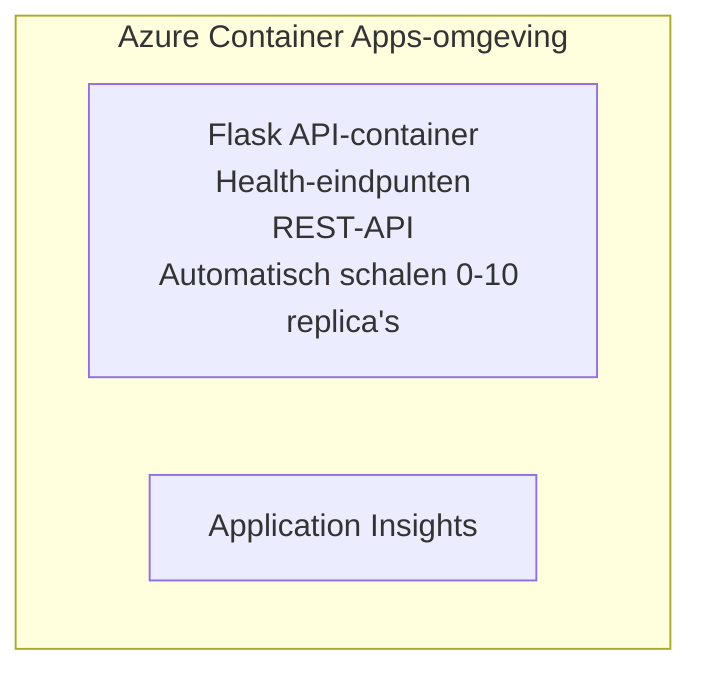

# Eenvoudige Flask-API - Container App-voorbeeld

**Leerpad:** Beginner ⭐ | **Tijd:** 25-35 minuten | **Kosten:** $0-15/maand

Een complete, werkende Python Flask REST-API die is ingezet naar Azure Container Apps met behulp van Azure Developer CLI (azd). Dit voorbeeld demonstreert implementatie van containers, automatische schaling en basisprincipes van monitoring.

## 🎯 Wat je leert

- Implementeer een gecontaineriseerde Python-toepassing naar Azure
- Configureer automatische schaling met scale-to-zero
- Implementeer health probes en readiness-controles
- Monitor applicatielogs en metrics
- Gebruik Azure Developer CLI voor snelle implementatie

## 📦 Wat is inbegrepen

✅ **Flask-toepassing** - Volledige REST-API met CRUD-bewerkingen (`src/app.py`)  
✅ **Dockerfile** - Productiegereed containerconfiguratie  
✅ **Bicep-infrastructuur** - Container Apps-omgeving en API-implementatie  
✅ **AZD-configuratie** - Implementatie met één opdracht  
✅ **Health probes** - Liveness- en readiness-controles geconfigureerd  
✅ **Auto-scaling** - 0-10 replica's op basis van HTTP-belasting  

## Architectuur



## Vereisten

### Vereist
- **Azure Developer CLI (azd)** - [Installatiehandleiding](https://learn.microsoft.com/azure/developer/azure-developer-cli/install-azd)
- **Azure subscription** - [Free account](https://azure.microsoft.com/free/)
- **Docker Desktop** - [Installeer Docker](https://www.docker.com/products/docker-desktop/) (voor lokaal testen)

### Controleer vereisten

```bash
# Controleer azd-versie (vereist 1.5.0 of hoger)
azd version

# Controleer Azure-aanmelding
azd auth login

# Controleer Docker (optioneel, voor lokaal testen)
docker --version
```

## ⏱️ Implementatietijdlijn

| Fase | Duur | Wat gebeurt er |
|-------|----------|--------------||
| Omgeving instellen | 30 seconden | Maak azd-omgeving |
| Container bouwen | 2-3 minuten | Docker build van Flask-app |
| Infrastructuur voorzien | 3-5 minuten | Maak Container Apps, registry en monitoring |
| Applicatie implementeren | 2-3 minuten | Push image en implementeer naar Container Apps |
| **Totaal** | **8-12 minuten** | Volledige implementatie gereed |

## Snelstart

```bash
# Navigeer naar het voorbeeld
cd examples/container-app/simple-flask-api

# Initialiseer de omgeving (kies een unieke naam)
azd env new myflaskapi

# Implementeer alles (infrastructuur + applicatie)
azd up
# Er wordt je gevraagd om:
# 1. Selecteer een Azure-abonnement
# 2. Kies een locatie (bijv. eastus2)
# 3. Wacht 8-12 minuten op de implementatie

# Haal je API-eindpunt op
azd env get-values

# Test de API
curl $(azd env get-value API_ENDPOINT)/health
```

**Verwachte uitvoer:**
```json
{
  "status": "healthy",
  "timestamp": "2025-11-19T10:30:00Z",
  "service": "simple-flask-api",
  "version": "1.0.0"
}
```

## ✅ Controleer implementatie

### Stap 1: Controleer de implementatiestatus

```bash
# Bekijk uitgerolde services
azd show

# Verwachte uitvoer toont:
# - Service: api
# - Eindpunt: https://ca-api-[env].xxx.azurecontainerapps.io
# - Status: Actief
```

### Stap 2: Test API-eindpunten

```bash
# Haal API-eindpunt op
API_URL=$(azd env get-value API_ENDPOINT)

# Controleer gezondheid
curl $API_URL/health

# Controleer root-eindpunt
curl $API_URL/

# Maak een item aan
curl -X POST $API_URL/api/items \
  -H "Content-Type: application/json" \
  -d '{"name": "Test Item", "description": "My first item"}'

# Haal alle items op
curl $API_URL/api/items
```

**Succescriteria:**
- ✅ Health-endpoint retourneert HTTP 200
- ✅ Root-endpoint toont API-informatie
- ✅ POST maakt item aan en retourneert HTTP 201
- ✅ GET geeft aangemaakte items terug

### Stap 3: Bekijk logs

```bash
# Bekijk live-logboeken met azd monitor
azd monitor --logs

# Of gebruik de Azure CLI:
az containerapp logs show --name api --resource-group $RG_NAME --follow

# Je zou het volgende moeten zien:
# - Opstartmeldingen van Gunicorn
# - HTTP-aanvraaglogboeken
# - Informatielogboeken van de applicatie
```

## Projectstructuur

```
simple-flask-api/
├── azure.yaml              # AZD configuration
├── infra/
│   ├── main.bicep         # Main infrastructure
│   ├── main.parameters.json
│   └── app/
│       ├── container-env.bicep
│       └── api.bicep
└── src/
    ├── app.py             # Flask application
    ├── requirements.txt
    └── Dockerfile
```

## API-eindpunten

| Eindpunt | Methode | Beschrijving |
|----------|--------|-------------|
| `/health` | GET | Gezondheidscontrole |
| `/api/items` | GET | Geef alle items weer |
| `/api/items` | POST | Maak nieuw item aan |
| `/api/items/{id}` | GET | Specifiek item ophalen |
| `/api/items/{id}` | PUT | Item bijwerken |
| `/api/items/{id}` | DELETE | Verwijder item |

## Configuratie

### Omgevingsvariabelen

```bash
# Stel aangepaste configuratie in
azd env set PORT 8000
azd env set LOG_LEVEL info
azd env set MAX_REPLICAS 20
```

### Schaalconfiguratie

De API schaalt automatisch op basis van HTTP-verkeer:
- **Min Replicas**: 0 (schaalt naar nul wanneer inactief)
- **Max Replicas**: 10
- **Gelijktijdige verzoeken per replica**: 50

## Ontwikkeling

### Lokaal uitvoeren

```bash
# Installeer afhankelijkheden
cd src
pip install -r requirements.txt

# Voer de app uit
python app.py

# Test lokaal
curl http://localhost:8000/health
```

### Container bouwen en testen

```bash
# Docker-image bouwen
docker build -t flask-api:local ./src

# Container lokaal uitvoeren
docker run -p 8000:8000 flask-api:local

# Container testen
curl http://localhost:8000/health
```

## Implementatie

### Volledige implementatie

```bash
# Implementeer infrastructuur en applicatie
azd up
```

### Alleen code-implementatie

```bash
# Implementeer alleen applicatiecode (infrastructuur ongewijzigd)
azd deploy api
```

### Configuratie bijwerken

```bash
# Werk omgevingsvariabelen bij
azd env set API_KEY "new-api-key"

# Opnieuw uitrollen met nieuwe configuratie
azd deploy api
```

## Monitoring

### Bekijk logs

```bash
# Live-logs streamen met azd monitor
azd monitor --logs

# Of gebruik de Azure CLI voor Container Apps:
az containerapp logs show --name api --resource-group $RG_NAME --follow

# Bekijk de laatste 100 regels
az containerapp logs show --name api --resource-group $RG_NAME --tail 100
```

### Monitor metrics

```bash
# Open het Azure Monitor-dashboard
azd monitor --overview

# Bekijk specifieke statistieken
az monitor metrics list \
  --resource $(azd show --output json | jq -r '.services.api.resourceId') \
  --metric "Requests,ResponseTime"
```

## Testen

### Gezondheidscontrole

```bash
curl $(azd show --output json | jq -r '.services.api.endpoint')/health
```

Verwachte reactie:
```json
{
  "status": "healthy",
  "timestamp": "2025-11-19T10:30:00Z"
}
```

### Item aanmaken

```bash
curl -X POST $(azd show --output json | jq -r '.services.api.endpoint')/api/items \
  -H "Content-Type: application/json" \
  -d '{"name": "Test Item", "description": "A test item"}'
```

### Alle items ophalen

```bash
curl $(azd show --output json | jq -r '.services.api.endpoint')/api/items
```

## Kostenoptimalisatie

Deze implementatie gebruikt scale-to-zero, dus je betaalt alleen wanneer de API verzoeken verwerkt:

- **Inactieve kosten**: ~ $0/maand (geschaald naar nul)
- **Actieve kosten**: ~ $0.000024/seconde per replica
- **Verwachte maandelijkse kosten** (licht gebruik): $5-15

### Kosten verder verlagen

```bash
# Schaal het maximale aantal replica's omlaag voor dev
azd env set MAX_REPLICAS 3

# Gebruik een kortere idle-timeout
azd env set SCALE_TO_ZERO_TIMEOUT 300  # 5 minuten
```

## Problemen oplossen

### Container start niet

```bash
# Controleer containerlogboeken met de Azure CLI
az containerapp logs show --name api --resource-group $RG_NAME --tail 100

# Controleer of Docker-images lokaal worden gebouwd
docker build -t test ./src
```

### API niet bereikbaar

```bash
# Controleer of ingress extern is
az containerapp show --name api --resource-group rg-simple-flask-api \
  --query properties.configuration.ingress.external
```

### Hoge responstijden

```bash
# Controleer CPU-/geheugengebruik
az monitor metrics list \
  --resource $(azd show --output json | jq -r '.services.api.resourceId') \
  --metric "CPUPercentage,MemoryPercentage"

# Schaal middelen op indien nodig
az containerapp update --name api --resource-group rg-simple-flask-api \
  --cpu 1.0 --memory 2Gi
```

## Opruimen

```bash
# Verwijder alle bronnen
azd down --force --purge
```

## Volgende stappen

### Breid dit voorbeeld uit

1. **Database toevoegen** - Integreer Azure Cosmos DB of SQL Database
   ```bash
   # Voeg Cosmos DB-module toe aan infra/main.bicep
   # Werk app.py bij met databaseverbinding
   ```

2. **Authenticatie toevoegen** - Implementeer Microsoft Entra ID of API-sleutels
   ```python
   # Voeg authenticatiemiddleware toe aan app.py
   from functools import wraps
   ```

3. **CI/CD opzetten** - GitHub Actions-workflow
   ```yaml
   # Create .github/workflows/deploy.yml
   name: Deploy to Azure
   on: [push]
   ```

4. **Managed Identity toevoegen** - Beveilig toegang tot Azure-services
   ```bicep
   # Update infra/app/api.bicep
   identity: { type: 'SystemAssigned' }
   ```

### Gerelateerde voorbeelden

- **[Database-app](../../../../../examples/database-app)** - Volledig voorbeeld met SQL-database
- **[Microservices](../../../../../examples/container-app/microservices)** - Architectuur met meerdere services
- **[Container Apps Master Guide](../README.md)** - Alle containerpatronen

### Leermiddelen

- 📚 [Cursus AZD voor beginners](../../../README.md) - Hoofdpagina van de cursus
- 📚 [Container Apps-patronen](../README.md) - Meer implementatiepatronen
- 📚 [AZD Templates Gallery](https://azure.github.io/awesome-azd/) - Community-sjablonen

## Aanvullende bronnen

### Documentatie
- **[Flask-documentatie](https://flask.palletsprojects.com/)** - Gids voor het Flask-framework
- **[Azure Container Apps](https://learn.microsoft.com/azure/container-apps/)** - Officiële Azure-documentatie
- **[Azure Developer CLI](https://learn.microsoft.com/azure/developer/azure-developer-cli/)** - azd commando-referentie

### Tutorials
- **[Container Apps Quickstart](https://learn.microsoft.com/azure/container-apps/quickstart-portal)** - Implementeer je eerste app
- **[Python on Azure](https://learn.microsoft.com/azure/developer/python/)** - Gids voor Python-ontwikkeling
- **[Bicep Language](https://learn.microsoft.com/azure/azure-resource-manager/bicep/)** - Infrastructuur als code

### Hulpmiddelen
- **[Azure Portal](https://portal.azure.com)** - Beheer resources visueel
- **[VS Code Azure Extension](https://marketplace.visualstudio.com/items?itemName=ms-azuretools.vscode-azurecontainerapps)** - IDE-integratie

---

**🎉 Gefeliciteerd!** Je hebt een productieklare Flask-API ingezet naar Azure Container Apps met automatische schaling en monitoring.

**Vragen?** [Open een issue](https://github.com/microsoft/AZD-for-beginners/issues) of bekijk de [FAQ](../../../resources/faq.md)

---

<!-- CO-OP TRANSLATOR DISCLAIMER START -->
**Disclaimer**:
Dit document is vertaald met behulp van de AI vertaaldienst [Co-op Translator](https://github.com/Azure/co-op-translator). Hoewel we streven naar nauwkeurigheid, dient u er rekening mee te houden dat geautomatiseerde vertalingen fouten of onnauwkeurigheden kunnen bevatten. Het originele document in de oorspronkelijke taal moet worden beschouwd als de gezaghebbende bron. Voor kritieke informatie wordt professionele menselijke vertaling aanbevolen. Wij zijn niet aansprakelijk voor eventuele misverstanden of verkeerde interpretaties die voortvloeien uit het gebruik van deze vertaling.
<!-- CO-OP TRANSLATOR DISCLAIMER END -->