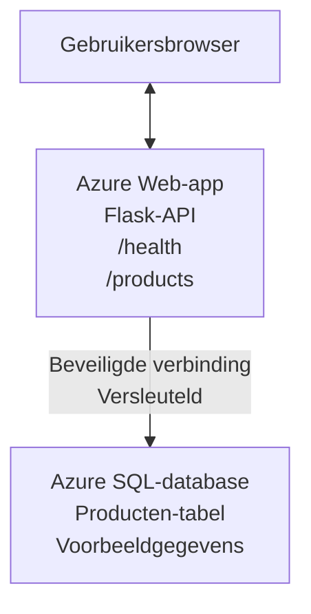

# Implementeren van een Microsoft SQL-database en Web App met AZD

⏱️ **Geschatte tijd**: 20-30 minuten | 💰 **Geschatte kosten**: ~$15-25/maand | ⭐ **Complexiteit**: Gemiddeld

Dit **volledige, werkende voorbeeld** laat zien hoe je de [Azure Developer CLI (azd)](https://learn.microsoft.com/azure/developer/azure-developer-cli/) kunt gebruiken om een Python Flask-webapplicatie met een Microsoft SQL-database naar Azure te implementeren. Alle code is inbegrepen en getest — geen externe afhankelijkheden vereist.

## Wat je zult leren

Door dit voorbeeld te voltooien, zul je:
- Een multi-tier applicatie (webapp + database) implementeren met infrastructure-as-code
- Veilige databaseverbindingen configureren zonder geheimen hard te coderen
- De gezondheid van de applicatie monitoren met Application Insights
- Azure-resources efficiënt beheren met de AZD CLI
- Azure best practices volgen voor beveiliging, kostenoptimalisatie en observeerbaarheid

## Scenario-overzicht
- **Web App**: Python Flask REST API met databaseconnectiviteit
- **Database**: Azure SQL Database met voorbeeldgegevens
- **Infrastructure**: Geprovisioneerd met Bicep (modulair, herbruikbare templates)
- **Deployment**: Volledig geautomatiseerd met `azd`-opdrachten
- **Monitoring**: Application Insights voor logs en telemetrie

## Vereisten

### Vereiste tools

Controleer vóór aanvang of je de volgende tools hebt geïnstalleerd:

1. **[Azure CLI](https://learn.microsoft.com/cli/azure/install-azure-cli)** (versie 2.50.0 of hoger)
   ```sh
   az --version
   # Verwachte uitvoer: azure-cli 2.50.0 of hoger
   ```

2. **[Azure Developer CLI (azd)](https://learn.microsoft.com/azure/developer/azure-developer-cli/install-azd)** (versie 1.0.0 of hoger)
   ```sh
   azd version
   # Verwachte uitvoer: azd versie 1.0.0 of hoger
   ```

3. **[Python 3.8+](https://www.python.org/downloads/)** (voor lokale ontwikkeling)
   ```sh
   python --version
   # Verwachte uitvoer: Python 3.8 of hoger
   ```

4. **[Docker](https://www.docker.com/get-started)** (optioneel, voor lokale containerontwikkeling)
   ```sh
   docker --version
   # Verwachte uitvoer: Docker-versie 20.10 of hoger
   ```

### Azure-vereisten

- Een actieve **Azure-subscriptie** ([maak een gratis account aan](https://azure.microsoft.com/free/))
- Machtigingen om resources in je subscriptie te maken
- **Owner** of **Contributor** rol op de subscriptie of resourcegroep

### Vereiste kennis

Dit is een voorbeeld op **gemiddeld niveau**. Je zou bekend moeten zijn met:
- Basis commandoregelbewerkingen
- Fundamentele cloudconcepten (resources, resourcegroepen)
- Basiskennis van webapplicaties en databases

**Nieuw met AZD?** Begin eerst met de [Beginnergids](../../docs/chapter-01-foundation/azd-basics.md).

## Architectuur

Dit voorbeeld implementeert een tweelaagse architectuur met een webapplicatie en SQL-database:



**Resource-implementatie:**
- **Resource Group**: Container voor alle resources
- **App Service Plan**: Linux-gebaseerde hosting (B1-tier voor kostenefficiëntie)
- **Web App**: Python 3.11-runtime met Flask-applicatie
- **SQL Server**: Beheerde databaseserver met minimaal TLS 1.2
- **SQL Database**: Basic tier (2GB, geschikt voor ontwikkeling/testen)
- **Application Insights**: Monitoring en logging
- **Log Analytics Workspace**: Gecentraliseerde logopslag

**Analogie**: Zie dit als een restaurant (webapp) met een koelkamer (database). Klanten bestellen van het menu (API-eindpunten), en de keuken (Flask-app) haalt ingrediënten (gegevens) uit de koelkamer. De restaurantmanager (Application Insights) houdt alles bij wat er gebeurt.

## Mapstructuur

Alle bestanden zijn inbegrepen in dit voorbeeld — geen externe afhankelijkheden vereist:

```
examples/database-app/
│
├── README.md                    # This file
├── azure.yaml                   # AZD configuration file
├── .env.sample                  # Sample environment variables
├── .gitignore                   # Git ignore patterns
│
├── infra/                       # Infrastructure as Code (Bicep)
│   ├── main.bicep              # Main orchestration template
│   ├── abbreviations.json      # Azure naming conventions
│   └── resources/              # Modular resource templates
│       ├── sql-server.bicep    # SQL Server configuration
│       ├── sql-database.bicep  # Database configuration
│       ├── app-service-plan.bicep  # Hosting plan
│       ├── app-insights.bicep  # Monitoring setup
│       └── web-app.bicep       # Web application
│
└── src/
    └── web/                    # Application source code
        ├── app.py              # Flask REST API
        ├── requirements.txt    # Python dependencies
        └── Dockerfile          # Container definition
```

**Wat elk bestand doet:**
- **azure.yaml**: Vertelt AZD wat er moet worden geïmplementeerd en waar
- **infra/main.bicep**: Orkestreert alle Azure-resources
- **infra/resources/*.bicep**: Individuele resource-definities (modulair voor hergebruik)
- **src/web/app.py**: Flask-applicatie met databaselogica
- **requirements.txt**: Python-pakketafhankelijkheden
- **Dockerfile**: Containerisatie-instructies voor deployment

## Snelstart (Stap-voor-stap)

### Stap 1: Klonen en navigeren

```sh
git clone https://github.com/microsoft/AZD-for-beginners.git
cd AZD-for-beginners/examples/database-app
```

**✓ Succescontrole**: Controleer of je `azure.yaml` en de map `infra/` ziet:
```sh
ls
# Verwacht: README.md, azure.yaml, infra/, src/
```

### Stap 2: Aanmelden bij Azure

```sh
azd auth login
```

Dit opent je browser voor Azure-authenticatie. Meld je aan met je Azure-gegevens.

**✓ Succescontrole**: Je zou het volgende moeten zien:
```
Logged in to Azure.
```

### Stap 3: Initialiseer de omgeving

```sh
azd init
```

**Wat er gebeurt**: AZD maakt een lokale configuratie voor je deployment.

**Prompts die je ziet**:
- **Environment name**: Voer een korte naam in (bijv. `dev`, `myapp`)
- **Azure subscription**: Selecteer je subscriptie uit de lijst
- **Azure location**: Kies een regio (bijv. `eastus`, `westeurope`)

**✓ Succescontrole**: Je zou het volgende moeten zien:
```
SUCCESS: New project initialized!
```

### Stap 4: Azure-resources inrichten

```sh
azd provision
```

**Wat er gebeurt**: AZD implementeert alle infrastructuur (duurt 5-8 minuten):
1. Maakt een resourcegroep
2. Maakt SQL Server en Database
3. Maakt App Service Plan
4. Maakt Web App
5. Maakt Application Insights
6. Configureert netwerken en beveiliging

**Je wordt gevraagd om**:
- **SQL admin username**: Voer een gebruikersnaam in (bijv. `sqladmin`)
- **SQL admin password**: Voer een sterk wachtwoord in (sla dit op!)

**✓ Succescontrole**: Je zou het volgende moeten zien:
```
SUCCESS: Your application was provisioned in Azure in X minutes Y seconds.
You can view the resources created under the resource group rg-<env-name> in Azure Portal:
https://portal.azure.com/#@/resource/subscriptions/.../resourceGroups/rg-<env-name>
```

**⏱️ Tijd**: 5-8 minuten

### Stap 5: De applicatie implementeren

```sh
azd deploy
```

**Wat er gebeurt**: AZD bouwt en implementeert je Flask-applicatie:
1. Pakt de Python-applicatie in
2. Bouwt de Docker-container
3. Pusht naar Azure Web App
4. Initialiseert de database met voorbeeldgegevens
5. Start de applicatie

**✓ Succescontrole**: Je zou het volgende moeten zien:
```
SUCCESS: Your application was deployed to Azure in X minutes Y seconds.
You can view the resources created under the resource group rg-<env-name> in Azure Portal:
https://portal.azure.com/#@/resource/subscriptions/.../resourceGroups/rg-<env-name>
```

**⏱️ Tijd**: 3-5 minuten

### Stap 6: De applicatie openen

```sh
azd browse
```

Dit opent je gedeployde webapp in de browser op `https://app-<unique-id>.azurewebsites.net`

**✓ Succescontrole**: Je zou JSON-uitvoer moeten zien:
```json
{
  "message": "Welcome to the Database App API",
  "endpoints": {
    "/": "This help message",
    "/health": "Health check endpoint",
    "/products": "List all products",
    "/products/<id>": "Get product by ID"
  }
}
```

### Stap 7: Test de API-eindpunten

**Health-check** (verifieer databaseverbinding):
```sh
curl https://app-<your-id>.azurewebsites.net/health
```

**Verwachte respons**:
```json
{
  "status": "healthy",
  "database": "connected"
}
```

**Producten weergeven** (voorbeeldgegevens):
```sh
curl https://app-<your-id>.azurewebsites.net/products
```

**Verwachte respons**:
```json
[
  {
    "id": 1,
    "name": "Laptop",
    "description": "High-performance laptop",
    "price": 1299.99,
    "created_at": "2025-11-19T10:30:00"
  },
  ...
]
```

**Een enkel product ophalen**:
```sh
curl https://app-<your-id>.azurewebsites.net/products/1
```

**✓ Succescontrole**: Alle eindpunten geven JSON-gegevens terug zonder fouten.

---

**🎉 Gefeliciteerd!** Je hebt succesvol een webapplicatie met een database naar Azure gedeployed met AZD.

## Configuratie in detail

### Omgevingsvariabelen

Geheimen worden veilig beheerd via de configuratie van Azure App Service — **nooit in de broncode hardcoderen**.

**Automatisch door AZD geconfigureerd**:
- `SQL_CONNECTION_STRING`: Databaseverbinding met versleutelde referenties
- `APPLICATIONINSIGHTS_CONNECTION_STRING`: Telemetrie-endpoint voor monitoring
- `SCM_DO_BUILD_DURING_DEPLOYMENT`: Schakelt automatische installatie van afhankelijkheden in

**Waar geheimen worden opgeslagen**:
1. Tijdens `azd provision` geef je SQL-referenties via beveiligde prompts op
2. AZD slaat deze op in je lokale `.azure/<env-name>/.env` bestand (git-ignored)
3. AZD injecteert ze in de Azure App Service-configuratie (versleuteld in rust)
4. Applicatie leest ze via `os.getenv()` tijdens runtime

### Lokale ontwikkeling

Voor lokaal testen, maak een `.env`-bestand aan vanaf het voorbeeld:

```sh
cp .env.sample .env
# Bewerk .env met je lokale databaseverbinding
```

**Lokale ontwikkelworkflow**:
```sh
# Installeer afhankelijkheden
cd src/web
pip install -r requirements.txt

# Stel omgevingsvariabelen in
export SQL_CONNECTION_STRING="your-local-connection-string"

# Start de applicatie
python app.py
```

**Lokaal testen**:
```sh
curl http://localhost:8000/health
# Verwacht: {"status": "healthy", "database": "connected"}
```

### Infrastructuur als code

Alle Azure-resources zijn gedefinieerd in **Bicep-templates** (map `infra/`):

- **Modulair ontwerp**: Elk resourcetype heeft een eigen bestand voor herbruikbaarheid
- **Geparametriseerd**: Pas SKUs, regio's en naamgevingsconventies aan
- **Beste praktijken**: Volgt Azure-naamgevingsstandaarden en beveiligingsstandaarden
- **Versiebeheerd**: Infrastructuurwijzigingen worden gevolgd in Git

**Voorbeeld aanpassing**:
Om de databasetier te wijzigen, bewerk `infra/resources/sql-database.bicep`:
```bicep
sku: {
  name: 'Standard'  // Changed from 'Basic'
  tier: 'Standard'
  capacity: 10
}
```

## Beste beveiligingspraktijken

Dit voorbeeld volgt de beste beveiligingspraktijken van Azure:

### 1. **Geen geheimen in de broncode**
- ✅ Referenties opgeslagen in Azure App Service-configuratie (versleuteld)
- ✅ `.env`-bestanden uitgesloten van Git via `.gitignore`
- ✅ Geheimen doorgegeven via beveiligde parameters tijdens provisioning

### 2. **Versleutelde verbindingen**
- ✅ TLS 1.2 minimaal voor SQL Server
- ✅ Alleen HTTPS afgedwongen voor Web App
- ✅ Databaseverbindingen gebruiken versleutelde kanalen

### 3. **Netwerkbeveiliging**
- ✅ SQL Server-firewall geconfigureerd om alleen Azure-services toe te staan
- ✅ Publieke netwerktoegang beperkt (kan verder worden afgesloten met Private Endpoints)
- ✅ FTPS uitgeschakeld op Web App

### 4. **Authenticatie & Autorizatie**
- ⚠️ **Huidig**: SQL-authenticatie (gebruikersnaam/wachtwoord)
- ✅ **Aanbeveling voor productie**: Gebruik Azure Managed Identity voor wachtwoordloze authenticatie

**Om te upgraden naar Managed Identity** (voor productie):
1. Schakel managed identity in op de Web App
2. Verleen de identity SQL-machtigingen
3. Werk de connection string bij om managed identity te gebruiken
4. Verwijder wachtwoordgebaseerde authenticatie

### 5. **Auditing & Compliance**
- ✅ Application Insights logt alle verzoeken en fouten
- ✅ SQL Database-auditing ingeschakeld (kan worden geconfigureerd voor compliance)
- ✅ Alle resources getagd voor governance

**Beveiligingschecklist vóór productie**:
- [ ] Schakel Azure Defender voor SQL in
- [ ] Configureer Private Endpoints voor SQL-database
- [ ] Schakel Web Application Firewall (WAF) in
- [ ] Implementeer Azure Key Vault voor secret-rotatie
- [ ] Configureer Microsoft Entra ID-authenticatie
- [ ] Schakel diagnostische logging in voor alle resources

## Kostenoptimalisatie

**Geschatte maandelijkse kosten** (vanaf november 2025):

| Resource | SKU/Tier | Geschatte kosten |
|----------|----------|------------------|
| App Service Plan | B1 (Basic) | ~$13/month |
| SQL Database | Basic (2GB) | ~$5/month |
| Application Insights | Pay-as-you-go | ~$2/month (low traffic) |
| **Totaal** | | **~$20/month** |

**💡 Tips om kosten te besparen**:

1. **Gebruik de gratislaag voor leren**:
   - App Service: F1-tier (gratis, beperkte uren)
   - SQL Database: Gebruik Azure SQL Database serverless
   - Application Insights: 5GB/maand gratis ingestie

2. **Stop resources wanneer je ze niet gebruikt**:
   ```sh
   # Stop de webapp (de database brengt nog steeds kosten in rekening)
   az webapp stop --name <app-name> --resource-group <rg-name>
   
   # Start opnieuw indien nodig
   az webapp start --name <app-name> --resource-group <rg-name>
   ```

3. **Verwijder alles na het testen**:
   ```sh
   azd down
   ```
   Dit verwijdert ALLE resources en stopt kosten.

4. **Development versus Production SKUs**:
   - **Development**: Basic tier (gebruikt in dit voorbeeld)
   - **Production**: Standard/Premium tier met redundantie

**Kostenmonitoring**:
- Bekijk kosten in [Azure Cost Management](https://portal.azure.com/#view/Microsoft_Azure_CostManagement)
- Stel kostenwaarschuwingen in om verrassingen te voorkomen
- Tag alle resources met `azd-env-name` voor tracking

**Gratis alternatief**:
Voor leerdoeleinden kun je `infra/resources/app-service-plan.bicep` aanpassen:
```bicep
sku: {
  name: 'F1'  // Free tier
  tier: 'Free'
}
```
**Opmerking**: Gratislaag heeft beperkingen (60 min/dag CPU, geen always-on).

## Monitoring & Observeerbaarheid

### Integratie met Application Insights

Dit voorbeeld bevat **Application Insights** voor uitgebreide monitoring:

**Wat wordt gemonitord**:
- ✅ HTTP-verzoeken (latentie, statuscodes, eindpunten)
- ✅ Applicatiefouten en uitzonderingen
- ✅ Aangepaste logging vanuit de Flask-app
- ✅ Databaseverbindinggezondheid
- ✅ Prestatiemetingen (CPU, geheugen)

**Open Application Insights**:
1. Open de [Azure Portal](https://portal.azure.com)
2. Navigeer naar je resourcegroep (`rg-<env-name>`)
3. Klik op de Application Insights-resource (`appi-<unique-id>`)

**Handige queries** (Application Insights → Logs):

**View All Requests**:
```kusto
requests
| where timestamp > ago(1h)
| order by timestamp desc
| project timestamp, name, url, resultCode, duration
```

**Find Errors**:
```kusto
exceptions
| where timestamp > ago(24h)
| order by timestamp desc
| project timestamp, type, outerMessage, operation_Name
```

**Check Health Endpoint**:
```kusto
requests
| where name contains "health"
| summarize count() by resultCode, bin(timestamp, 1h)
```

### SQL-database-auditing

**SQL-database-auditing is ingeschakeld** om het volgende bij te houden:
- Database-toegangs-patronen
- Mislukte aanmeldpogingen
- Schemawijzigingen
- Gegevensaccess (voor compliance)

**Auditlogs openen**:
1. Azure Portal → SQL Database → Auditing
2. Bekijk logs in het Log Analytics-workspace

### Realtime monitoring

**Live metrics bekijken**:
1. Application Insights → Live Metrics
2. Zie verzoeken, fouten en prestaties in realtime

**Meldingen instellen**:
Maak meldingen voor kritieke gebeurtenissen:
- HTTP 500-fouten > 5 in 5 minuten
- Databaseverbinding-fouten
- Hoge responsetijden (>2 seconden)

**Voorbeeld aanmaken melding**:
```sh
az monitor metrics alert create \
  --name "High-Response-Time" \
  --resource-group <rg-name> \
  --scopes <app-insights-resource-id> \
  --condition "avg requests/duration > 2000" \
  --description "Alert when response time exceeds 2 seconds"
```

## Problemen oplossen
### Veelvoorkomende problemen en oplossingen

#### 1. `azd provision` fails with "Locatie niet beschikbaar"

**Symptoom**:
```
Error: The subscription is not registered for the resource type 'components' in the location 'centralus'.
```

**Oplossing**:
Kies een andere Azure-regio of registreer de resourceprovider:
```sh
az provider register --namespace Microsoft.Insights
```

#### 2. SQL-verbinding mislukt tijdens implementatie

**Symptoom**:
```
pyodbc.OperationalError: ('08001', '[08001] [Microsoft][ODBC Driver 18 for SQL Server]TCP Provider...')
```

**Oplossing**:
- Controleer of de SQL Server-firewall Azure-services toestaat (automatisch geconfigureerd)
- Controleer of het SQL-admin-wachtwoord correct is ingevoerd tijdens `azd provision`
- Zorg dat de SQL Server volledig is uitgerold (kan 2–3 minuten duren)

**Verifieer verbinding**:
```sh
# Ga in het Azure-portal naar SQL Database → Query-editor
# Probeer verbinding te maken met uw inloggegevens
```

#### 3. Webapp toont "Application Error"

**Symptoom**:
De browser toont een generieke foutpagina.

**Oplossing**:
Controleer applicatielogboeken:
```sh
# Bekijk recente logs
az webapp log tail --name <app-name> --resource-group <rg-name>
```

**Veelvoorkomende oorzaken**:
- Ontbrekende omgevingsvariabelen (controleer App Service → Configuration)
- Installatie van Python-pakketten mislukt (controleer deployment logs)
- Fout bij initialisatie van de database (controleer SQL-connectiviteit)

#### 4. `azd deploy` faalt met "Build Error"

**Symptoom**:
```
Error: Failed to build project
```

**Oplossing**:
- Zorg dat `requirements.txt` geen syntaxfouten bevat
- Controleer dat Python 3.11 is opgegeven in `infra/resources/web-app.bicep`
- Verifieer dat de Dockerfile het juiste basisimage heeft

**Debug lokaal**:
```sh
cd src/web
docker build -t test-app .
docker run -p 8000:8000 test-app
```

#### 5. "Unauthorized" bij het uitvoeren van AZD-commando's

**Symptoom**:
```
ERROR: (Unauthorized) The client '<id>' with object id '<id>' does not have authorization
```

**Oplossing**:
Log opnieuw in bij Azure:
```sh
# Vereist voor AZD-workflows
azd auth login

# Optioneel als u ook rechtstreeks Azure CLI-opdrachten gebruikt
az login
```

Verifieer dat je de juiste machtigingen (Contributor-rol) op de subscription hebt.

#### 6. Hoge databasekosten

**Symptoom**:
Onverwachte Azure-factuur.

**Oplossing**:
- Controleer of je vergeten bent `azd down` uit te voeren na het testen
- Verifieer dat de SQL Database de Basic-tier gebruikt (niet Premium)
- Bekijk kosten in Azure Cost Management
- Stel kostenwaarschuwingen in

### Hulp krijgen

**Bekijk alle AZD-omgevingsvariabelen**:
```sh
azd env get-values
```

**Controleer de implementatiestatus**:
```sh
az webapp show --name <app-name> --resource-group <rg-name> --query state
```

**Toegang tot applicatielogboeken**:
```sh
az webapp log download --name <app-name> --resource-group <rg-name> --log-file app-logs.zip
```

**Meer hulp nodig?**
- [AZD-probleemoplossingsgids](../../docs/chapter-07-troubleshooting/common-issues.md)
- [Azure App Service Troubleshooting](https://learn.microsoft.com/azure/app-service/troubleshoot-diagnostic-logs)
- [Azure SQL Troubleshooting](https://learn.microsoft.com/azure/azure-sql/database/troubleshoot-common-errors-issues)

## Praktische oefeningen

### Oefening 1: Verifieer je deployment (Beginners)

**Doel**: Bevestig dat alle resources zijn uitgerold en dat de applicatie werkt.

**Stappen**:
1. Lijst alle resources in je resource group:
   ```sh
   az resource list --resource-group rg-<env-name> --output table
   ```
   **Verwacht**: 6-7 resources (Web App, SQL Server, SQL Database, App Service Plan, Application Insights, Log Analytics)

2. Test alle API-eindpunten:
   ```sh
   curl https://app-<your-id>.azurewebsites.net/
   curl https://app-<your-id>.azurewebsites.net/health
   curl https://app-<your-id>.azurewebsites.net/products
   curl https://app-<your-id>.azurewebsites.net/products/1
   ```
   **Verwacht**: Alle geven geldige JSON terug zonder fouten

3. Controleer Application Insights:
   - Navigeer naar Application Insights in de Azure-portal
   - Ga naar "Live Metrics"
   - Vernieuw je browser in de webapp
   **Verwacht**: Zie verzoeken verschijnen in real-time

**Succescriteria**: Alle 6-7 resources bestaan, alle eindpunten geven data terug, Live Metrics toont activiteit.

---

### Oefening 2: Voeg een nieuw API-eindpunt toe (Intermediate)

**Doel**: Breid de Flask-applicatie uit met een nieuw eindpunt.

**Startcode**: Huidige endpoints in `src/web/app.py`

**Stappen**:
1. Bewerk `src/web/app.py` en voeg een nieuw eindpunt toe na de functie `get_product()`:
   ```python
   @app.route('/products/search/<keyword>')
   def search_products(keyword):
       """Search products by name or description."""
       try:
           conn = get_db_connection()
           cursor = conn.cursor()
           cursor.execute(
               "SELECT id, name, description, price, created_at FROM products WHERE name LIKE ? OR description LIKE ?",
               (f'%{keyword}%', f'%{keyword}%')
           )
           
           products = []
           for row in cursor.fetchall():
               products.append({
                   'id': row[0],
                   'name': row[1],
                   'description': row[2],
                   'price': float(row[3]) if row[3] else None,
                   'created_at': row[4].isoformat() if row[4] else None
               })
           
           cursor.close()
           conn.close()
           
           logger.info(f"Search for '{keyword}' returned {len(products)} results")
           return jsonify(products), 200
           
       except Exception as e:
           logger.error(f"Error searching products: {str(e)}")
           return jsonify({'error': str(e)}), 500
   ```

2. Implementeer de bijgewerkte applicatie:
   ```sh
   azd deploy
   ```

3. Test het nieuwe eindpunt:
   ```sh
   curl https://app-<your-id>.azurewebsites.net/products/search/laptop
   ```
   **Verwacht**: Retourneert producten die overeenkomen met "laptop"

**Succescriteria**: Het nieuwe eindpunt werkt, retourneert gefilterde resultaten en verschijnt in de Application Insights-logboeken.

---

### Oefening 3: Voeg monitoring en waarschuwingen toe (Geavanceerd)

**Doel**: Stel proactieve monitoring met waarschuwingen in.

**Stappen**:
1. Maak een waarschuwing aan voor HTTP 500-fouten:
   ```sh
   # Haal de Application Insights-resource-id op
   AI_ID=$(az monitor app-insights component show \
     --app appi-<your-id> \
     --resource-group rg-<env-name> \
     --query id -o tsv)
   
   # Maak een waarschuwing aan
   az monitor metrics alert create \
     --name "High-Error-Rate" \
     --resource-group rg-<env-name> \
     --scopes $AI_ID \
     --condition "count requests/failed > 5" \
     --window-size 5m \
     --evaluation-frequency 1m \
     --description "Alert when >5 failed requests in 5 minutes"
   ```

2. Activeer de waarschuwing door fouten te veroorzaken:
   ```sh
   # Vraag een niet-bestaand product op
   for i in {1..10}; do curl https://app-<your-id>.azurewebsites.net/products/999; done
   ```

3. Controleer of de waarschuwing is af gegaan:
   - Azure Portal → Alerts → Alert Rules
   - Controleer je e-mail (als geconfigureerd)

**Succescriteria**: Waarschuwingsregel is aangemaakt, wordt geactiveerd bij fouten, notificaties worden ontvangen.

---

### Oefening 4: Wijzigingen in databaseschema (Geavanceerd)

**Doel**: Voeg een nieuwe tabel toe en pas de applicatie aan om deze te gebruiken.

**Stappen**:
1. Maak verbinding met de SQL Database via de Query Editor in de Azure-portal

2. Maak een nieuwe `categories`-tabel:
   ```sql
   CREATE TABLE categories (
       id INT PRIMARY KEY IDENTITY(1,1),
       name NVARCHAR(50) NOT NULL,
       description NVARCHAR(200)
   );
   
   INSERT INTO categories (name, description) VALUES
   ('Electronics', 'Electronic devices and accessories'),
   ('Office Supplies', 'Office equipment and supplies');
   
   -- Add category to products table
   ALTER TABLE products ADD category_id INT;
   UPDATE products SET category_id = 1; -- Set all to Electronics
   ```

3. Werk `src/web/app.py` bij om categorie-informatie op te nemen in responses

4. Implementeer en test

**Succescriteria**: Nieuwe tabel bestaat, producten tonen categorie-informatie, applicatie werkt nog steeds.

---

### Oefening 5: Implementeer caching (Expert)

**Doel**: Voeg Azure Redis Cache toe om de prestaties te verbeteren.

**Stappen**:
1. Voeg Redis Cache toe aan `infra/main.bicep`
2. Werk `src/web/app.py` bij om productquery's te cachen
3. Meet prestatieverbetering met Application Insights
4. Vergelijk responstijden voor/na caching

**Succescriteria**: Redis is uitgerold, caching werkt, responstijden verbeteren met >50%.

**Hint**: Begin met [Documentatie Azure Cache for Redis](https://learn.microsoft.com/azure/azure-cache-for-redis/).

---

## Opruimen

Om doorlopende kosten te voorkomen, verwijder alle resources wanneer je klaar bent:

```sh
azd down
```

**Bevestigingsprompt**:
```
? Total resources to delete: 7, are you sure you want to continue? (y/N)
```

Typ `y` om te bevestigen.

**✓ Succescontrole**: 
- Alle resources zijn verwijderd uit de Azure-portal
- Geen doorlopende kosten
- Lokale `.azure/<env-name>` map kan worden verwijderd

**Alternatief** (infrastructuur behouden, gegevens verwijderen):
```sh
# Verwijder alleen de resourcegroep (houd de AZD-configuratie)
az group delete --name rg-<env-name> --yes
```
## Leer meer

### Gerelateerde documentatie
- [Azure Developer CLI Documentation](https://learn.microsoft.com/azure/developer/azure-developer-cli/)
- [Azure SQL Database Documentation](https://learn.microsoft.com/azure/azure-sql/database/)
- [Azure App Service Documentation](https://learn.microsoft.com/azure/app-service/)
- [Application Insights Documentation](https://learn.microsoft.com/azure/azure-monitor/app/app-insights-overview)
- [Bicep Language Reference](https://learn.microsoft.com/azure/azure-resource-manager/bicep/)

### Volgende stappen in deze cursus
- **[Container Apps Example](../../../../examples/container-app)**: Roll out microservices met Azure Container Apps
- **[AI Integration Guide](../../../../docs/ai-foundry)**: Voeg AI-mogelijkheden toe aan je app
- **[Deployment Best Practices](../../docs/chapter-04-infrastructure/deployment-guide.md)**: Productie-implementatiepatronen

### Geavanceerde onderwerpen
- **Beheerde identiteit**: Verwijder wachtwoorden en gebruik Microsoft Entra ID-authenticatie
- **Private Endpoints**: Beveilig databaseverbindingen binnen een virtueel netwerk
- **CI/CD-integratie**: Automatiseer implementaties met GitHub Actions of Azure DevOps
- **Meerdere omgevingen**: Stel dev-, staging- en productieomgevingen in
- **Database-migraties**: Gebruik Alembic of Entity Framework voor schema-versionering

### Vergelijking met andere benaderingen

**AZD vs. ARM Templates**:
- ✅ AZD: Hogere abstractielaag, eenvoudigere commando's
- ⚠️ ARM: Meer omslachtig, fijnmazigere controle

**AZD vs. Terraform**:
- ✅ AZD: Azure-native, geïntegreerd met Azure-diensten
- ⚠️ Terraform: Multi-cloud-ondersteuning, groter ecosysteem

**AZD vs. Azure Portal**:
- ✅ AZD: Herhaalbaar, versiebeheerd, automatiseerbaar
- ⚠️ Portal: Handmatige klikken, moeilijk te reproduceren

**Zie AZD als**: Docker Compose voor Azure—geïntegreerde configuratie voor complexe implementaties.

---

## Veelgestelde vragen

**V: Kan ik een andere programmeertaal gebruiken?**  
A: Ja! Vervang `src/web/` door Node.js, C#, Go of een andere taal. Werk `azure.yaml` en Bicep dienovereenkomstig bij.

**V: Hoe voeg ik meer databases toe?**  
A: Voeg een extra SQL Database-module toe in `infra/main.bicep` of gebruik PostgreSQL/MySQL van Azure Database-diensten.

**V: Kan ik dit gebruiken voor productie?**  
A: Dit is een vertrekpunt. Voor productie voeg toe: beheerde identiteit, private endpoints, redundantie, back-upstrategie, WAF en uitgebreidere monitoring.

**V: Wat als ik containers wil gebruiken in plaats van code-implementatie?**  
A: Bekijk het [Container Apps Example](../../../../examples/container-app), dat Docker-containers doorheen gebruikt.

**V: Hoe maak ik verbinding met de database vanaf mijn lokale machine?**  
A: Voeg je IP toe aan de SQL Server-firewall:
```sh
az sql server firewall-rule create \
  --resource-group rg-<env-name> \
  --server sql-<unique-id> \
  --name AllowMyIP \
  --start-ip-address <your-ip> \
  --end-ip-address <your-ip>
```

**V: Kan ik een bestaande database gebruiken in plaats van een nieuwe aan te maken?**  
A: Ja, wijzig `infra/main.bicep` om naar een bestaande SQL Server te verwijzen en werk de connection string-parameters bij.

---

> **Opmerking:** Dit voorbeeld toont best practices voor het implementeren van een webapp met een database met behulp van AZD. Het bevat werkende code, uitgebreide documentatie en praktische oefeningen om het leren te versterken. Voor productie-implementaties, bekijk de beveiliging, schaalbaarheid, compliance en kostenvereisten die specifiek zijn voor jouw organisatie.

**📚 Cursusnavigatie:**
- ← Vorige: [Container Apps Example](../../../../examples/container-app)
- → Volgende: [AI Integration Guide](../../../../docs/ai-foundry)
- 🏠 [Cursus Home](../../README.md)

---

<!-- CO-OP TRANSLATOR DISCLAIMER START -->
**Disclaimer**:
Dit document is vertaald met behulp van de AI vertaaldienst [Co-op Translator](https://github.com/Azure/co-op-translator). Hoewel we streven naar nauwkeurigheid, dient u er rekening mee te houden dat geautomatiseerde vertalingen fouten of onnauwkeurigheden kunnen bevatten. Het originele document in de oorspronkelijke taal moet worden beschouwd als de gezaghebbende bron. Voor kritieke informatie wordt professionele menselijke vertaling aanbevolen. Wij zijn niet aansprakelijk voor eventuele misverstanden of verkeerde interpretaties die voortvloeien uit het gebruik van deze vertaling.
<!-- CO-OP TRANSLATOR DISCLAIMER END -->