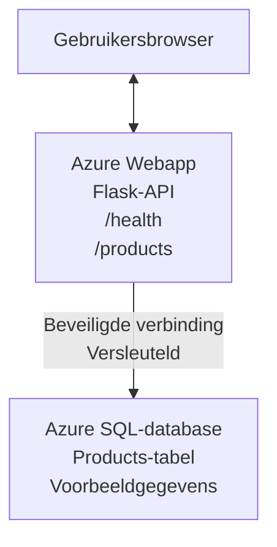

# Implementeren van een Microsoft SQL-database en webapp met AZD

⏱️ **Geschatte tijd**: 20-30 minuten | 💰 **Geschatte kosten**: ~$15-25/maand | ⭐ **Complexiteit**: Gemiddeld

Dit **volledige, werkende voorbeeld** toont hoe je de [Azure Developer CLI (azd)](https://learn.microsoft.com/azure/developer/azure-developer-cli/) gebruikt om een Python Flask-webapplicatie met een Microsoft SQL-database naar Azure te implementeren. Alle code is inbegrepen en getest—geen externe afhankelijkheden vereist.

## Wat je zult leren

Door dit voorbeeld te voltooien, zul je:
- Een multi-tier applicatie (webapp + database) implementeren met infrastructure-as-code
- Veilige databaseverbindingen configureren zonder geheimen hard te coderen
- De gezondheid van de applicatie monitoren met Application Insights
- Azure-resources efficiënt beheren met de AZD CLI
- Azure-best practices volgen voor beveiliging, kostenoptimalisatie en observability

## Scenario-overzicht
- **Web App**: Python Flask REST API met databaseconnectiviteit
- **Database**: Azure SQL Database met voorbeeldgegevens
- **Infrastructuur**: Geporvioneerd met Bicep (modulair, herbruikbare templates)
- **Implementatie**: Volledig geautomatiseerd met `azd`-opdrachten
- **Monitoring**: Application Insights voor logs en telemetrie

## Vereisten

### Benodigde tools

Voordat je begint, controleer of je deze tools hebt geïnstalleerd:

1. **[Azure CLI](https://learn.microsoft.com/cli/azure/install-azure-cli)** (versie 2.50.0 of hoger)
   ```sh
   az --version
   # Verwachte uitvoer: azure-cli 2.50.0 of hoger
   ```

2. **[Azure Developer CLI (azd)](https://learn.microsoft.com/azure/developer/azure-developer-cli/install-azd)** (versie 1.0.0 of hoger)
   ```sh
   azd version
   # Verwachte uitvoer: azd versie 1.0.0 of hoger
   ```

3. **[Python 3.8+](https://www.python.org/downloads/)** (voor lokale ontwikkeling)
   ```sh
   python --version
   # Verwachte uitvoer: Python 3.8 of hoger
   ```

4. **[Docker](https://www.docker.com/get-started)** (optioneel, voor lokale containerontwikkeling)
   ```sh
   docker --version
   # Verwachte uitvoer: Docker-versie 20.10 of hoger
   ```

### Azure-vereisten

- Een actieve **Azure-abonnement** ([maak een gratis account aan](https://azure.microsoft.com/free/))
- Machtigingen om resources in je abonnement te maken
- **Eigenaar** of **Contributor** rol op het abonnement of resource group

### Kennisvereisten

Dit is een voorbeeld op **gemiddeld niveau**. Je zou vertrouwd moeten zijn met:
- Basis handelingen op de opdrachtregel
- Fundamentele cloudconcepten (resources, resource groups)
- Basisbegrip van webapplicaties en databases

**Nieuw met AZD?** Begin eerst met de [Getting Started guide](../../docs/chapter-01-foundation/azd-basics.md).

## Architectuur

Dit voorbeeld implementeert een tweelaagse architectuur met een webapplicatie en SQL-database:


**Resource-implementatie:**
- **Resource Group**: Container voor alle resources
- **App Service Plan**: Linux-gebaseerde hosting (B1-tier voor kostenefficiëntie)
- **Web App**: Python 3.11 runtime met Flask-applicatie
- **SQL Server**: Beheerde databaseserver met minimaal TLS 1.2
- **SQL Database**: Basic-tier (2GB, geschikt voor ontwikkeling/testen)
- **Application Insights**: Monitoring en logging
- **Log Analytics Workspace**: Gecentraliseerde logopslag

**Analogie**: Zie dit als een restaurant (webapp) met een koelcel (database). Klanten bestellen van het menu (API-eindpunten), en de keuken (Flask-app) haalt ingrediënten (gegevens) uit de koelcel. De restaurantmanager (Application Insights) houdt alles bij wat er gebeurt.

## Mappenstructuur

Alle bestanden zijn inbegrepen in dit voorbeeld—geen externe afhankelijkheden vereist:

```
examples/database-app/
│
├── README.md                    # This file
├── azure.yaml                   # AZD configuration file
├── .env.sample                  # Sample environment variables
├── .gitignore                   # Git ignore patterns
│
├── infra/                       # Infrastructure as Code (Bicep)
│   ├── main.bicep              # Main orchestration template
│   ├── abbreviations.json      # Azure naming conventions
│   └── resources/              # Modular resource templates
│       ├── sql-server.bicep    # SQL Server configuration
│       ├── sql-database.bicep  # Database configuration
│       ├── app-service-plan.bicep  # Hosting plan
│       ├── app-insights.bicep  # Monitoring setup
│       └── web-app.bicep       # Web application
│
└── src/
    └── web/                    # Application source code
        ├── app.py              # Flask REST API
        ├── requirements.txt    # Python dependencies
        └── Dockerfile          # Container definition
```

**Wat elk bestand doet:**
- **azure.yaml**: Vertelt AZD wat te implementeren en waar
- **infra/main.bicep**: Orkestreert alle Azure-resources
- **infra/resources/*.bicep**: Individuele resource-definities (modulair voor hergebruik)
- **src/web/app.py**: Flask-applicatie met databaselogica
- **requirements.txt**: Python-pakketafhankelijkheden
- **Dockerfile**: Containerisatie-instructies voor implementatie

## Quickstart (Stapsgewijs)

### Stap 1: Clone en navigeer

```sh
git clone https://github.com/microsoft/AZD-for-beginners.git
cd AZD-for-beginners/examples/database-app
```

**✓ Succescontrole**: Controleer of je `azure.yaml` en de map `infra/` ziet:
```sh
ls
# Verwacht: README.md, azure.yaml, infra/, src/
```

### Stap 2: Authenticeer bij Azure

```sh
azd auth login
```

Dit opent je browser voor Azure-authenticatie. Meld je aan met je Azure-gegevens.

**✓ Succescontrole**: Je zou het volgende moeten zien:
```
Logged in to Azure.
```

### Stap 3: Initialiseer de omgeving

```sh
azd init
```

**Wat er gebeurt**: AZD maakt een lokale configuratie voor je implementatie.

**Vragen die je zult zien**:
- **Environment name**: Voer een korte naam in (bijv. `dev`, `myapp`)
- **Azure subscription**: Selecteer je abonnement uit de lijst
- **Azure location**: Kies een regio (bijv. `eastus`, `westeurope`)

**✓ Succescontrole**: Je zou het volgende moeten zien:
```
SUCCESS: New project initialized!
```

### Stap 4: Voorzie Azure-resources

```sh
azd provision
```

**Wat er gebeurt**: AZD implementeert alle infrastructuur (duurt 5-8 minuten):
1. Maakt resource group aan
2. Maakt SQL Server en Database aan
3. Maakt App Service Plan aan
4. Maakt Web App aan
5. Maakt Application Insights aan
6. Configureert netwerken en beveiliging

**Je wordt gevraagd om**:
- **SQL admin username**: Voer een gebruikersnaam in (bijv. `sqladmin`)
- **SQL admin password**: Voer een sterk wachtwoord in (bewaar dit!)

**✓ Succescontrole**: Je zou het volgende moeten zien:
```
SUCCESS: Your application was provisioned in Azure in X minutes Y seconds.
You can view the resources created under the resource group rg-<env-name> in Azure Portal:
https://portal.azure.com/#@/resource/subscriptions/.../resourceGroups/rg-<env-name>
```

**⏱️ Tijd**: 5-8 minuten

### Stap 5: Implementeer de applicatie

```sh
azd deploy
```

**Wat er gebeurt**: AZD bouwt en implementeert je Flask-applicatie:
1. Pakt de Python-applicatie in
2. Bouwt de Docker-container
3. Pusht naar Azure Web App
4. Initialiseren van de database met voorbeeldgegevens
5. Start de applicatie

**✓ Succescontrole**: Je zou het volgende moeten zien:
```
SUCCESS: Your application was deployed to Azure in X minutes Y seconds.
You can view the resources created under the resource group rg-<env-name> in Azure Portal:
https://portal.azure.com/#@/resource/subscriptions/.../resourceGroups/rg-<env-name>
```

**⏱️ Tijd**: 3-5 minuten

### Stap 6: Bekijk de applicatie in de browser

```sh
azd browse
```

Dit opent je geïmplementeerde webapp in de browser op `https://app-<unique-id>.azurewebsites.net`

**✓ Succescontrole**: Je zou JSON-uitvoer moeten zien:
```json
{
  "message": "Welcome to the Database App API",
  "endpoints": {
    "/": "This help message",
    "/health": "Health check endpoint",
    "/products": "List all products",
    "/products/<id>": "Get product by ID"
  }
}
```

### Stap 7: Test de API-eindpunten

**Healthcheck** (verifieer databaseverbinding):
```sh
curl https://app-<your-id>.azurewebsites.net/health
```

**Verwacht antwoord**:
```json
{
  "status": "healthy",
  "database": "connected"
}
```

**Productenlijst** (voorbeeldgegevens):
```sh
curl https://app-<your-id>.azurewebsites.net/products
```

**Verwacht antwoord**:
```json
[
  {
    "id": 1,
    "name": "Laptop",
    "description": "High-performance laptop",
    "price": 1299.99,
    "created_at": "2025-11-19T10:30:00"
  },
  ...
]
```

**Haal één product op**:
```sh
curl https://app-<your-id>.azurewebsites.net/products/1
```

**✓ Succescontrole**: Alle eindpunten retourneren JSON-gegevens zonder fouten.

---

**🎉 Gefeliciteerd!** Je hebt met succes een webapplicatie met een database naar Azure uitgerold met behulp van AZD.

## Diepgaande configuratie

### Omgevingsvariabelen

Geheimen worden veilig beheerd via de configuratie van Azure App Service—**nooit hardcoded in de broncode**.

**Automatisch geconfigureerd door AZD**:
- `SQL_CONNECTION_STRING`: Databaseverbinding met versleutelde referenties
- `APPLICATIONINSIGHTS_CONNECTION_STRING`: Telemetrie-eindpunt voor monitoring
- `SCM_DO_BUILD_DURING_DEPLOYMENT`: Schakelt automatische installatie van afhankelijkheden in

**Waar geheimen worden opgeslagen**:
1. Tijdens `azd provision` geef je SQL-referenties via veilige prompts op
2. AZD slaat deze lokaal op in je `.azure/<env-name>/.env` bestand (git-ignored)
3. AZD injecteert ze in de configuratie van Azure App Service (versleuteld in rust)
4. De applicatie leest ze op via `os.getenv()` tijdens runtime

### Lokale ontwikkeling

Voor lokaal testen, maak een `.env`-bestand aan vanaf het voorbeeld:

```sh
cp .env.sample .env
# Bewerk .env met je lokale databaseverbinding
```

**Lokale ontwikkelworkflow**:
```sh
# Installeer afhankelijkheden
cd src/web
pip install -r requirements.txt

# Stel omgevingsvariabelen in
export SQL_CONNECTION_STRING="your-local-connection-string"

# Start de applicatie
python app.py
```

**Test lokaal**:
```sh
curl http://localhost:8000/health
# Verwacht: {"status": "gezond", "database": "verbonden"}
```

### Infrastructuur als code

Alle Azure-resources zijn gedefinieerd in **Bicep-templates** (`infra/` map):

- **Modulair ontwerp**: Elk resourcetype heeft zijn eigen bestand voor herbruikbaarheid
- **Geparameteriseerd**: Pas SKUs, regio's en naamgevingsconventies aan
- **Best Practices**: Volgt Azure-naamgevingsstandaarden en beveiligingsdefaults
- **Versiecontrole**: Infrastructuurwijzigingen worden gevolgd in Git

**Aanpassingsvoorbeeld**:
Om de database-tier te wijzigen, bewerk `infra/resources/sql-database.bicep`:
```bicep
sku: {
  name: 'Standard'  // Changed from 'Basic'
  tier: 'Standard'
  capacity: 10
}
```

## Beveiligingsbest practices

Dit voorbeeld volgt Azure beveiligingsbest practices:

### 1. **Geen geheimen in broncode**
- ✅ Referenties opgeslagen in Azure App Service-configuratie (versleuteld)
- ✅ `.env`-bestanden uitgesloten van Git via `.gitignore`
- ✅ Geheimen doorgegeven via veilige parameters tijdens provisioning

### 2. **Versleutelde verbindingen**
- ✅ TLS 1.2 minimaal voor SQL Server
- ✅ Alleen HTTPS afgedwongen voor Web App
- ✅ Databaseverbindingen gebruiken versleutelde kanalen

### 3. **Netwerkbeveiliging**
- ✅ SQL Server-firewall geconfigureerd om alleen Azure-services toe te staan
- ✅ Publieke netwerktoegang beperkt (kan verder worden afgeschermd met Private Endpoints)
- ✅ FTPS uitgeschakeld op Web App

### 4. **Authenticatie & Autorisatie**
- ⚠️ **Huidig**: SQL-authenticatie (gebruikersnaam/wachtwoord)
- ✅ **Aanbeveling voor productie**: Gebruik Azure Managed Identity voor wachtwoordloze authenticatie

**Om te upgraden naar Managed Identity** (voor productie):
1. Schakel managed identity in op de Web App
2. Verleen de identiteit SQL-rechten
3. Werk de connection string bij om managed identity te gebruiken
4. Verwijder wachtwoordgebaseerde authenticatie

### 5. **Auditing & Compliance**
- ✅ Application Insights logt alle verzoeken en fouten
- ✅ SQL Database-auditing ingeschakeld (kan worden geconfigureerd voor compliance)
- ✅ Alle resources zijn getagd voor governance

**Beveiligingschecklist vóór productie**:
- [ ] Schakel Azure Defender voor SQL in
- [ ] Configureer Private Endpoints voor SQL Database
- [ ] Schakel Web Application Firewall (WAF) in
- [ ] Implementeer Azure Key Vault voor secret-rotatie
- [ ] Configureer Azure AD-authenticatie
- [ ] Schakel diagnostische logging in voor alle resources

## Kostenoptimalisatie

**Geschatte maandelijkse kosten** (per november 2025):

| Resource | SKU/Tier | Geschatte kosten |
|----------|----------|------------------|
| App Service Plan | B1 (Basic) | ~$13/maand |
| SQL Database | Basic (2GB) | ~$5/maand |
| Application Insights | Pay-as-you-go | ~$2/maand (laag verkeer) |
| **Total** | | **~$20/maand** |

**💡 Tips om kosten te besparen**:

1. **Gebruik de gratis laag voor leren**:
   - App Service: F1-tier (gratis, beperkte uren)
   - SQL Database: Gebruik Azure SQL Database serverless
   - Application Insights: 5GB/maand gratis ingestie

2. **Stop resources wanneer je ze niet gebruikt**:
   ```sh
   # Stop de webapp (database brengt nog steeds kosten in rekening)
   az webapp stop --name <app-name> --resource-group <rg-name>
   
   # Herstart wanneer nodig
   az webapp start --name <app-name> --resource-group <rg-name>
   ```

3. **Verwijder alles na het testen**:
   ```sh
   azd down
   ```
   Dit verwijdert ALLE resources en stopt kosten.

4. **Development vs. Production SKUs**:
   - **Development**: Basic-tier (gebruikt in dit voorbeeld)
   - **Production**: Standard/Premium-tier met redundantie

**Kostenmonitoring**:
- Bekijk kosten in [Azure Cost Management](https://portal.azure.com/#view/Microsoft_Azure_CostManagement)
- Stel kostwaarschuwingen in om verrassingen te voorkomen
- Tag alle resources met `azd-env-name` voor tracking

**Gratis laag alternatief**:
Voor leerdoeleinden kun je `infra/resources/app-service-plan.bicep` wijzigen:
```bicep
sku: {
  name: 'F1'  // Free tier
  tier: 'Free'
}
```
**Opmerking**: De gratis laag heeft beperkingen (60 min/dag CPU, geen always-on).

## Monitoring & Observability

### Integratie met Application Insights

Dit voorbeeld bevat **Application Insights** voor uitgebreide monitoring:

**Wat wordt bewaakt**:
- ✅ HTTP-verzoeken (latentie, statuscodes, eindpunten)
- ✅ Applicatiefouten en uitzonderingen
- ✅ Aangepaste logging vanuit de Flask-app
- ✅ Database-verbindinggezondheid
- ✅ Prestatiemetrics (CPU, geheugen)

**Toegang tot Application Insights**:
1. Open [Azure Portal](https://portal.azure.com)
2. Navigeer naar je resource group (`rg-<env-name>`)
3. Klik op de Application Insights-resource (`appi-<unique-id>`)

**Nuttige query's** (Application Insights → Logs):

**Bekijk alle verzoeken**:
```kusto
requests
| where timestamp > ago(1h)
| order by timestamp desc
| project timestamp, name, url, resultCode, duration
```

**Vind fouten**:
```kusto
exceptions
| where timestamp > ago(24h)
| order by timestamp desc
| project timestamp, type, outerMessage, operation_Name
```

**Controleer health-endpoint**:
```kusto
requests
| where name contains "health"
| summarize count() by resultCode, bin(timestamp, 1h)
```

### SQL Database-auditing

**SQL Database-auditing is ingeschakeld** om het volgende bij te houden:
- Toegangs-patronen tot de database
- Mislukte aanmeldpogingen
- Schemawijzigingen
- Gegevensaccess (voor compliance)

**Toegang tot auditlogs**:
1. Azure Portal → SQL Database → Auditing
2. Bekijk logs in de Log Analytics-workspace

### Realtime monitoring

**Bekijk live statistieken**:
1. Application Insights → Live Metrics
2. Zie verzoeken, fouten en prestaties in realtime

**Stel waarschuwingen in**:
Maak waarschuwingen voor kritieke gebeurtenissen:
- HTTP 500-fouten > 5 in 5 minuten
- Database-verbinding-failures
- Hoge responsetijden (>2 seconden)

**Voorbeeld van het aanmaken van een waarschuwing**:
```sh
az monitor metrics alert create \
  --name "High-Response-Time" \
  --resource-group <rg-name> \
  --scopes <app-insights-resource-id> \
  --condition "avg requests/duration > 2000" \
  --description "Alert when response time exceeds 2 seconds"
```

## Probleemoplossing
### Veelvoorkomende Problemen en Oplossingen

#### 1. `azd provision` fails with "Location not available"

**Symptom**:
```
Error: The subscription is not registered for the resource type 'components' in the location 'centralus'.
```

**Solution**:
Kies een andere Azure-regio of registreer de resource provider:
```sh
az provider register --namespace Microsoft.Insights
```

#### 2. SQL Connection Fails During Deployment

**Symptom**:
```
pyodbc.OperationalError: ('08001', '[08001] [Microsoft][ODBC Driver 18 for SQL Server]TCP Provider...')
```

**Solution**:
- Controleer of de firewall van de SQL Server Azure-services toestaat (automatisch geconfigureerd)
- Controleer of het SQL-adminwachtwoord tijdens `azd provision` correct is ingevoerd
- Zorg dat SQL Server volledig is geprovisioneerd (kan 2-3 minuten duren)

**Controleer verbinding**:
```sh
# Ga in de Azure-portal naar SQL-database → Query-editor
# Probeer verbinding te maken met uw inloggegevens.
```

#### 3. Web App Shows "Application Error"

**Symptom**:
Browser toont een generieke foutpagina.

**Solution**:
Controleer applicatielogs:
```sh
# Bekijk recente logs
az webapp log tail --name <app-name> --resource-group <rg-name>
```

**Veelvoorkomende oorzaken**:
- Ontbrekende omgevingsvariabelen (controleer App Service → Configuratie)
- Installatie van Python-pakketten is mislukt (controleer implementatielogs)
- Fout bij database-initialisatie (controleer SQL-connectiviteit)

#### 4. `azd deploy` Fails with "Build Error"

**Symptom**:
```
Error: Failed to build project
```

**Solution**:
- Zorg dat `requirements.txt` geen syntaxfouten bevat
- Controleer dat Python 3.11 is opgegeven in `infra/resources/web-app.bicep`
- Controleer of Dockerfile het juiste basisimage heeft

**Lokaal debuggen**:
```sh
cd src/web
docker build -t test-app .
docker run -p 8000:8000 test-app
```

#### 5. "Unauthorized" When Running AZD Commands

**Symptom**:
```
ERROR: (Unauthorized) The client '<id>' with object id '<id>' does not have authorization
```

**Solution**:
Log opnieuw in bij Azure:
```sh
# Vereist voor AZD-workflows
azd auth login

# Optioneel als u ook rechtstreeks Azure CLI-commando's gebruikt
az login
```

Controleer of je de juiste machtigingen hebt (rol Contributor) op het abonnement.

#### 6. High Database Costs

**Symptom**:
Onverwachte Azure-factuur.

**Solution**:
- Controleer of je vergeten bent `azd down` uit te voeren na het testen
- Controleer of de SQL Database de Basic-tier gebruikt (niet Premium)
- Bekijk kosten in Azure Cost Management
- Stel kostenwaarschuwingen in

### Getting Help

**View All AZD Environment Variables**:
```sh
azd env get-values
```

**Check Deployment Status**:
```sh
az webapp show --name <app-name> --resource-group <rg-name> --query state
```

**Access Application Logs**:
```sh
az webapp log download --name <app-name> --resource-group <rg-name> --log-file app-logs.zip
```

**Need More Help?**
- [AZD - Probleemoplossingshandleiding](../../docs/chapter-07-troubleshooting/common-issues.md)
- [Azure App Service Troubleshooting](https://learn.microsoft.com/azure/app-service/troubleshoot-diagnostic-logs)
- [Azure SQL Troubleshooting](https://learn.microsoft.com/azure/azure-sql/database/troubleshoot-common-errors-issues)

## Practical Exercises

### Exercise 1: Verify Your Deployment (Beginner)

**Goal**: Bevestig dat alle resources zijn uitgerold en dat de applicatie werkt.

**Steps**:
1. List all resources in your resource group:
   ```sh
   az resource list --resource-group rg-<env-name> --output table
   ```
   **Expected**: 6-7 resources (Web App, SQL Server, SQL Database, App Service Plan, Application Insights, Log Analytics)

2. Test all API endpoints:
   ```sh
   curl https://app-<your-id>.azurewebsites.net/
   curl https://app-<your-id>.azurewebsites.net/health
   curl https://app-<your-id>.azurewebsites.net/products
   curl https://app-<your-id>.azurewebsites.net/products/1
   ```
   **Expected**: All return valid JSON without errors

3. Check Application Insights:
   - Navigeer naar Application Insights in de Azure Portal
   - Ga naar "Live Metrics"
   - Vernieuw je browser op de webapp
   **Expected**: Zie requests verschijnen in realtime

**Succescriteria**: Alle 6-7 resources bestaan, alle endpoints geven gegevens terug, Live Metrics toont activiteit.

---

### Exercise 2: Add a New API Endpoint (Intermediate)

**Goal**: Breid de Flask-applicatie uit met een nieuw endpoint.

**Starter Code**: Huidige endpoints in `src/web/app.py`

**Steps**:
1. Bewerk `src/web/app.py` en voeg een nieuw endpoint toe na de `get_product()` functie:
   ```python
   @app.route('/products/search/<keyword>')
   def search_products(keyword):
       """Search products by name or description."""
       try:
           conn = get_db_connection()
           cursor = conn.cursor()
           cursor.execute(
               "SELECT id, name, description, price, created_at FROM products WHERE name LIKE ? OR description LIKE ?",
               (f'%{keyword}%', f'%{keyword}%')
           )
           
           products = []
           for row in cursor.fetchall():
               products.append({
                   'id': row[0],
                   'name': row[1],
                   'description': row[2],
                   'price': float(row[3]) if row[3] else None,
                   'created_at': row[4].isoformat() if row[4] else None
               })
           
           cursor.close()
           conn.close()
           
           logger.info(f"Search for '{keyword}' returned {len(products)} results")
           return jsonify(products), 200
           
       except Exception as e:
           logger.error(f"Error searching products: {str(e)}")
           return jsonify({'error': str(e)}), 500
   ```

2. Deploy de bijgewerkte applicatie:
   ```sh
   azd deploy
   ```

3. Test het nieuwe endpoint:
   ```sh
   curl https://app-<your-id>.azurewebsites.net/products/search/laptop
   ```
   **Expected**: Returns products matching "laptop"

**Succescriteria**: Het nieuwe endpoint werkt, retourneert gefilterde resultaten, verschijnt in de Application Insights-logs.

---

### Exercise 3: Add Monitoring and Alerts (Advanced)

**Goal**: Stel proactieve monitoring met waarschuwingen in.

**Steps**:
1. Maak een waarschuwing voor HTTP 500-fouten:
   ```sh
   # Haal Application Insights resource-id op
   AI_ID=$(az monitor app-insights component show \
     --app appi-<your-id> \
     --resource-group rg-<env-name> \
     --query id -o tsv)
   
   # Maak waarschuwing aan
   az monitor metrics alert create \
     --name "High-Error-Rate" \
     --resource-group rg-<env-name> \
     --scopes $AI_ID \
     --condition "count requests/failed > 5" \
     --window-size 5m \
     --evaluation-frequency 1m \
     --description "Alert when >5 failed requests in 5 minutes"
   ```

2. Trigger de waarschuwing door fouten te veroorzaken:
   ```sh
   # Vraag een niet-bestaand product aan
   for i in {1..10}; do curl https://app-<your-id>.azurewebsites.net/products/999; done
   ```

3. Controleer of de waarschuwing is afgevuurd:
   - Azure Portal → Alerts → Alert Rules
   - Controleer je e-mail (indien geconfigureerd)

**Succescriteria**: Waarschuwingsregel is aangemaakt, wordt geactiveerd bij fouten, notificaties worden ontvangen.

---

### Exercise 4: Database Schema Changes (Advanced)

**Goal**: Voeg een nieuwe tabel toe en wijzig de applicatie om deze te gebruiken.

**Steps**:
1. Maak verbinding met de SQL Database via de Query Editor in de Azure Portal

2. Maak een nieuwe `categories`-tabel:
   ```sql
   CREATE TABLE categories (
       id INT PRIMARY KEY IDENTITY(1,1),
       name NVARCHAR(50) NOT NULL,
       description NVARCHAR(200)
   );
   
   INSERT INTO categories (name, description) VALUES
   ('Electronics', 'Electronic devices and accessories'),
   ('Office Supplies', 'Office equipment and supplies');
   
   -- Add category to products table
   ALTER TABLE products ADD category_id INT;
   UPDATE products SET category_id = 1; -- Set all to Electronics
   ```

3. Werk `src/web/app.py` bij om categorie-informatie in responses op te nemen

4. Deploy en test

**Succescriteria**: Nieuwe tabel bestaat, producten tonen categorie-informatie, applicatie werkt nog steeds.

---

### Exercise 5: Implement Caching (Expert)

**Goal**: Voeg Azure Redis Cache toe om de prestaties te verbeteren.

**Steps**:
1. Voeg Redis Cache toe aan `infra/main.bicep`
2. Werk `src/web/app.py` bij om productqueries te cachen
3. Meet prestatieverbetering met Application Insights
4. Vergelijk responstijden voor/na caching

**Succescriteria**: Redis is uitgerold, caching werkt, responstijden verbeteren met >50%.

**Hint**: Begin met [Azure Cache for Redis documentation](https://learn.microsoft.com/azure/azure-cache-for-redis/).

---

## Cleanup

Om doorlopende kosten te voorkomen, verwijder alle resources wanneer je klaar bent:

```sh
azd down
```

**Confirmation prompt**:
```
? Total resources to delete: 7, are you sure you want to continue? (y/N)
```

Typ `y` om te bevestigen.

**✓ Succescontrole**: 
- Alle resources zijn verwijderd uit de Azure Portal
- Geen doorlopende kosten
- Lokale `.azure/<env-name>` map kan worden verwijderd

**Alternatief** (infrastructuur behouden, data verwijderen):
```sh
# Verwijder alleen de resourcegroep (bewaar de AZD-configuratie)
az group delete --name rg-<env-name> --yes
```
## Learn More

### Related Documentation
- [Azure Developer CLI Documentation](https://learn.microsoft.com/azure/developer/azure-developer-cli/)
- [Azure SQL Database Documentation](https://learn.microsoft.com/azure/azure-sql/database/)
- [Azure App Service Documentation](https://learn.microsoft.com/azure/app-service/)
- [Application Insights Documentation](https://learn.microsoft.com/azure/azure-monitor/app/app-insights-overview)
- [Bicep Language Reference](https://learn.microsoft.com/azure/azure-resource-manager/bicep/)

### Next Steps in This Course
- **[Container Apps Example](../../../../examples/container-app)**: Deploy microservices with Azure Container Apps
- **[AI Integration Guide](../../../../docs/ai-foundry)**: Add AI capabilities to your app
- **[Deployment Best Practices](../../docs/chapter-04-infrastructure/deployment-guide.md)**: Production deployment patterns

### Advanced Topics
- **Managed Identity**: Remove passwords and use Azure AD authentication
- **Private Endpoints**: Secure database connections within a virtual network
- **CI/CD Integration**: Automate deployments with GitHub Actions or Azure DevOps
- **Multi-Environment**: Set up dev, staging, and production environments
- **Database Migrations**: Use Alembic or Entity Framework for schema versioning

### Comparison to Other Approaches

**AZD vs. ARM Templates**:
- ✅ AZD: Higher-level abstraction, simpler commands
- ⚠️ ARM: More verbose, granular control

**AZD vs. Terraform**:
- ✅ AZD: Azure-native, integrated with Azure services
- ⚠️ Terraform: Multi-cloud support, larger ecosystem

**AZD vs. Azure Portal**:
- ✅ AZD: Repeatable, version-controlled, automatable
- ⚠️ Portal: Manual clicks, difficult to reproduce

**Think of AZD as**: Docker Compose for Azure—simplified configuration for complex deployments.

---

## Frequently Asked Questions

**Q: Can I use a different programming language?**  
A: Yes! Replace `src/web/` with Node.js, C#, Go, or any language. Update `azure.yaml` and Bicep accordingly.

**Q: How do I add more databases?**  
A: Add another SQL Database module in `infra/main.bicep` or use PostgreSQL/MySQL from Azure Database services.

**Q: Can I use this for production?**  
A: This is a starting point. For production, add: managed identity, private endpoints, redundancy, backup strategy, WAF, and enhanced monitoring.

**Q: What if I want to use containers instead of code deployment?**  
A: Check out the [Container Apps Example](../../../../examples/container-app) which uses Docker containers throughout.

**Q: How do I connect to the database from my local machine?**  
A: Voeg je IP toe aan de firewall van de SQL Server:
```sh
az sql server firewall-rule create \
  --resource-group rg-<env-name> \
  --server sql-<unique-id> \
  --name AllowMyIP \
  --start-ip-address <your-ip> \
  --end-ip-address <your-ip>
```

**Q: Can I use an existing database instead of creating a new one?**  
A: Yes, modify `infra/main.bicep` to reference an existing SQL Server and update the connection string parameters.

---

> **Opmerking:** Dit voorbeeld toont best practices voor het uitrollen van een webapp met een database met behulp van AZD. Het bevat werkende code, uitgebreide documentatie en praktische oefeningen ter versterking van het leerproces. Voor productie-implementaties, bekijk beveiliging, schaling, compliance en kostenvereisten die specifiek zijn voor jouw organisatie.

**📚 Cursusnavigatie:**
- ← Vorige: [Container Apps Example](../../../../examples/container-app)
- → Volgende: [AI Integration Guide](../../../../docs/ai-foundry)
- 🏠 [Course Home](../../README.md)

---

<!-- CO-OP TRANSLATOR DISCLAIMER START -->
**Disclaimer**:
Dit document is vertaald met behulp van de AI-vertalingsdienst [Co-op Translator](https://github.com/Azure/co-op-translator). Hoewel we streven naar nauwkeurigheid, houd er rekening mee dat geautomatiseerde vertalingen fouten of onjuistheden kunnen bevatten. Het oorspronkelijke document in de oorspronkelijke taal moet als de gezaghebbende bron worden beschouwd. Voor kritieke informatie wordt een professionele menselijke vertaling aanbevolen. Wij zijn niet aansprakelijk voor misverstanden of verkeerde interpretaties die voortvloeien uit het gebruik van deze vertaling.
<!-- CO-OP TRANSLATOR DISCLAIMER END -->