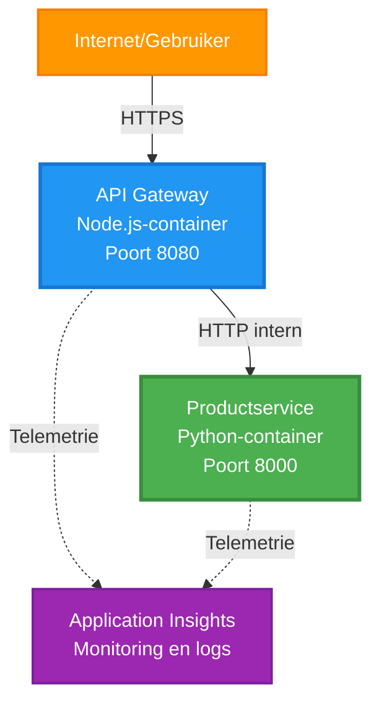
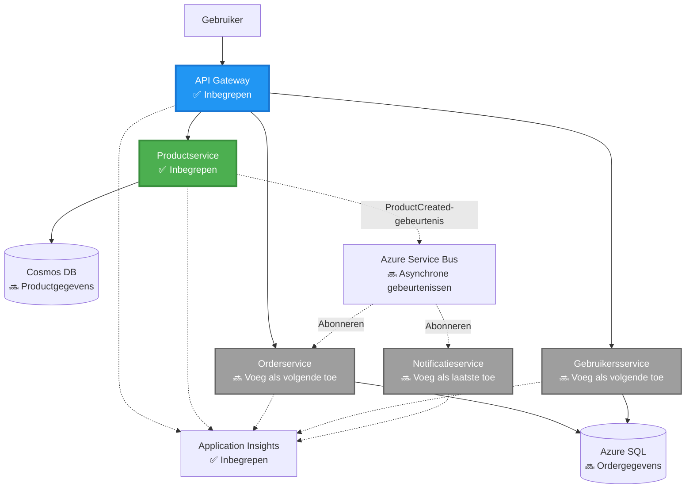
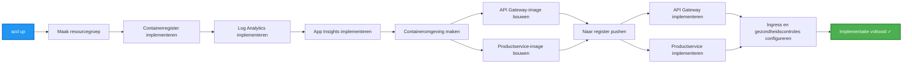
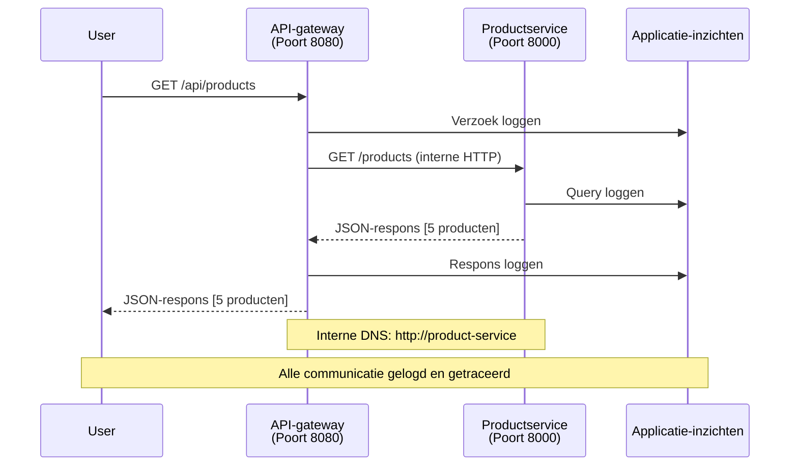

# Microservices Architectuur - Container App Voorbeeld

⏱️ **Geschatte Tijd**: 25-35 minuten | 💰 **Geschatte Kosten**: ~$50-100/maand | ⭐ **Complexiteit**: Geavanceerd

**📚 Leerpad:**
- ← Vorige: [Simple Flask API](../../../../examples/container-app/simple-flask-api) - Basisprincipes van een enkele container
- 🎯 **Je bevindt je hier**: Microservices-architectuur (basis met 2 services)
- → Volgende: [AI Integration](../../../../docs/ai-foundry) - Voeg intelligentie toe aan je services
- 🏠 [Course Home](../../README.md)

---

Een **vereenvoudigde maar functionele** microservices-architectuur gedeployed naar Azure Container Apps met behulp van de AZD CLI. Dit voorbeeld demonstreert service-naar-service communicatie, containerorchestratie en monitoring met een praktisch opzet van 2 services.

> **📚 Leerbenadering**: Dit voorbeeld begint met een minimale 2-service architectuur (API Gateway + Backend Service) die je daadwerkelijk kunt deployen en van kunt leren. Nadat je deze basis beheerst, geven we aanwijzingen voor uitbreiding naar een volledig microservices-ecosysteem.

## Wat je leert

Door dit voorbeeld te voltooien, zul je:
- Meerdere containers deployen naar Azure Container Apps
- Service-naar-service communicatie implementeren met interne netwerken
- Omgevingsgebaseerde schaling en health checks configureren
- Gedistribueerde applicaties monitoren met Application Insights
- Deploy-patronen en best practices voor microservices begrijpen
- Stapsgewijze uitbreiding van eenvoudige naar complexe architecturen leren

## Architectuur

### Fase 1: Wat we bouwen (opgenomen in dit voorbeeld)


```mermaid
graph TB
    Internet[Internet/Gebruiker]
    Gateway[API Gateway<br/>Node.js-container<br/>Poort 8080]
    Product[Productservice<br/>Python-container<br/>Poort 8000]
    AppInsights[Application Insights<br/>Monitoring en logs]
    
    Internet -->|HTTPS| Gateway
    Gateway -->|HTTP intern| Product
    Gateway -.->|Telemetrie| AppInsights
    Product -.->|Telemetrie| AppInsights
    
    style Gateway fill:#2196F3,stroke:#1976D2,stroke-width:3px,color:#fff
    style Product fill:#4CAF50,stroke:#388E3C,stroke-width:3px,color:#fff
    style Internet fill:#FF9800,stroke:#F57C00,stroke-width:2px,color:#fff
    style AppInsights fill:#9C27B0,stroke:#7B1FA2,stroke-width:2px,color:#fff
```
**Componentdetails:**

| Component | Doel | Toegang | Middelen |
|-----------|---------|--------|-----------|
| **API Gateway** | Leidt externe verzoeken naar backend-services | Openbaar (HTTPS) | 1 vCPU, 2GB RAM, 2-20 replica's |
| **Product Service** | Beheert productcatalogus met gegevens in het geheugen | Alleen intern | 0.5 vCPU, 1GB RAM, 1-10 replica's |
| **Application Insights** | Gecentraliseerde logging en gedistribueerde tracing | Azure Portal | 1-2 GB/maand gegevensinname |

**Waarom eenvoudig beginnen?**
- ✅ Snel implementeren en begrijpen (25-35 minuten)
- ✅ Leer kernpatronen van microservices zonder complexiteit
- ✅ Werkende code die je kunt aanpassen en mee experimenteren
- ✅ Lagere kosten voor leren (~$50-100/maand vs $300-1400/maand)
- ✅ Bouw vertrouwen op voordat je databases en berichtwachtrijen toevoegt

**Analogie**: Zie het als leren autorijden. Je begint op een leeg parkeerterrein (2 services), beheerst de basis, en gaat dan naar stadsverkeer (5+ services met databases).

### Fase 2: Toekomstige uitbreiding (referentiearchitectuur)

Zodra je de 2-service architectuur beheerst, kun je uitbreiden naar:


```mermaid
graph TB
    User[Gebruiker]
    Gateway[API Gateway<br/>✅ Inbegrepen]
    Product[Productservice<br/>✅ Inbegrepen]
    Order[Orderservice<br/>🔜 Voeg als volgende toe]
    UserSvc[Gebruikersservice<br/>🔜 Voeg als volgende toe]
    Notify[Notificatieservice<br/>🔜 Voeg als laatste toe]
    
    CosmosDB[(Cosmos DB<br/>🔜 Productgegevens)]
    AzureSQL[(Azure SQL<br/>🔜 Ordergegevens)]
    ServiceBus[Azure Service Bus<br/>🔜 Asynchrone gebeurtenissen]
    AppInsights[Application Insights<br/>✅ Inbegrepen]
    
    User --> Gateway
    Gateway --> Product
    Gateway --> Order
    Gateway --> UserSvc
    
    Product --> CosmosDB
    Order --> AzureSQL
    UserSvc --> AzureSQL
    
    Product -.->|ProductCreated-gebeurtenis| ServiceBus
    ServiceBus -.->|Abonneren| Notify
    ServiceBus -.->|Abonneren| Order
    
    Gateway -.-> AppInsights
    Product -.-> AppInsights
    Order -.-> AppInsights
    UserSvc -.-> AppInsights
    Notify -.-> AppInsights
    
    style Product fill:#4CAF50,stroke:#388E3C,stroke-width:3px,color:#fff
    style Gateway fill:#2196F3,stroke:#1976D2,stroke-width:3px,color:#fff
    style Order fill:#9E9E9E,stroke:#616161,stroke-width:2px,color:#fff
    style UserSvc fill:#9E9E9E,stroke:#616161,stroke-width:2px,color:#fff
    style Notify fill:#9E9E9E,stroke:#616161,stroke-width:2px,color:#fff
```
Zie de sectie "Uitbreidingsgids" aan het einde voor stapsgewijze instructies.

## Inbegrepen functies

✅ **Service Discovery**: Automatische DNS-gebaseerde ontdekking tussen containers  
✅ **Load Balancing**: Ingebouwde load balancing over replicas  
✅ **Auto-scaling**: Onafhankelijke schaling per service op basis van HTTP-verzoeken  
✅ **Health Monitoring**: Liveness- en readiness-probes voor beide services  
✅ **Distributed Logging**: Gecentraliseerde logging met Application Insights  
✅ **Internal Networking**: Veilige service-naar-service communicatie  
✅ **Container Orchestration**: Automatische deployment en scaling  
✅ **Zero-Downtime Updates**: Rolling updates met revisiebeheer  

## Vereisten

### Vereiste tools

Controleer vóór je begint of je deze tools hebt geïnstalleerd:

1. **[Azure Developer CLI (azd)](https://learn.microsoft.com/azure/developer/azure-developer-cli/install-azd)** (versie 1.0.0 of hoger)
   ```bash
   azd version
   # Verwachte uitvoer: azd versie 1.0.0 of hoger
   ```

2. **[Azure CLI](https://learn.microsoft.com/cli/azure/install-azure-cli)** (versie 2.50.0 of hoger)
   ```bash
   az --version
   # Verwachte uitvoer: azure-cli 2.50.0 of hoger
   ```

3. **[Docker](https://www.docker.com/get-started)** (voor lokale ontwikkeling/testen - optioneel)
   ```bash
   docker --version
   # Verwachte uitvoer: Docker-versie 20.10 of hoger
   ```

### Controleer je setup

Voer deze opdrachten uit om te bevestigen dat je klaar bent:

```bash
# Controleer de Azure Developer CLI
azd version
# ✅ Verwacht: azd-versie 1.0.0 of hoger

# Controleer de Azure CLI
az --version
# ✅ Verwacht: azure-cli 2.50.0 of hoger

# Controleer Docker (optioneel)
docker --version
# ✅ Verwacht: Docker-versie 20.10 of hoger
```

**Succescriteria**: Alle opdrachten geven versienummers terug die gelijk zijn aan of hoger zijn dan de minimale vereisten.

### Azure-vereisten

- Een actief **Azure-abonnement** ([maak een gratis account aan](https://azure.microsoft.com/free/))
- Machtigingen om resources te maken in je abonnement
- **Contributor** rol op de subscription of resourcegroep

### Vereiste kennis

Dit is een voorbeeld op **gevorderd niveau**. Je zou moeten hebben:
- Het [Simple Flask API-voorbeeld](../../../../examples/container-app/simple-flask-api) voltooid
- Basiskennis van microservices-architectuur
- Bekendheid met REST-API's en HTTP
- Inzicht in containerconcepten

**Nieuw met Container Apps?** Begin eerst met het [Simple Flask API-voorbeeld](../../../../examples/container-app/simple-flask-api) om de basis te leren.

## Snel aan de slag (stap-voor-stap)

### Stap 1: Klonen en navigeren

```bash
git clone https://github.com/microsoft/AZD-for-beginners.git
cd AZD-for-beginners/examples/microservices
```

**✓ Succescontrole**: Controleer of je `azure.yaml` ziet:
```bash
ls
# Verwacht: README.md, azure.yaml, infra/, src/
```

### Stap 2: Authenticeren bij Azure

```bash
azd auth login
```

Dit opent je browser voor Azure-authenticatie. Meld je aan met je Azure-referenties.

**✓ Succescontrole**: Je zou het volgende moeten zien:
```
Logged in to Azure.
```

### Stap 3: Initialiseer de omgeving

```bash
azd init
```

**Prompts die je zult zien**:
- **Environment name**: Voer een korte naam in (bijv. `microservices-dev`)
- **Azure subscription**: Selecteer je abonnement
- **Azure location**: Kies een regio (bijv. `eastus`, `westeurope`)

**✓ Succescontrole**: Je zou het volgende moeten zien:
```
SUCCESS: New project initialized!
```

### Stap 4: Implementeer infrastructuur en services

```bash
azd up
```

**Wat er gebeurt** (duurt 8-12 minuten):


```mermaid
graph LR
    A[azd up] --> B[Maak resourcegroep]
    B --> C[Containerregister implementeren]
    C --> D[Log Analytics implementeren]
    D --> E[App Insights implementeren]
    E --> F[Containeromgeving maken]
    F --> G[API Gateway-image bouwen]
    F --> H[Productservice-image bouwen]
    G --> I[Naar register pushen]
    H --> I
    I --> J[API Gateway implementeren]
    I --> K[Productservice implementeren]
    J --> L[Ingress en gezondheidscontroles configureren]
    K --> L
    L --> M[Implementatie voltooid ✓]
    
    style A fill:#2196F3,stroke:#1976D2,stroke-width:3px,color:#fff
    style M fill:#4CAF50,stroke:#388E3C,stroke-width:3px,color:#fff
```
**✓ Succescontrole**: Je zou het volgende moeten zien:
```
SUCCESS: Your application was deployed to Azure in X minutes Y seconds.
Endpoint: https://api-gateway-<unique-id>.azurecontainerapps.io
```

**⏱️ Tijd**: 8-12 minuten

### Stap 5: Test de implementatie

```bash
# Haal het gateway-eindpunt op
GATEWAY_URL=$(azd env get-values | grep API_GATEWAY_URL | cut -d '=' -f2 | tr -d '"')

# Test de gezondheid van de API Gateway
curl $GATEWAY_URL/health
```

**✅ Verwachte output:**
```json
{
  "status": "healthy",
  "service": "api-gateway",
  "timestamp": "2025-11-19T10:30:00Z"
}
```

**Test de productservice via de gateway**:
```bash
# Producten weergeven
curl $GATEWAY_URL/api/products
```

**✅ Verwachte output:**
```json
[
  {"id":1,"name":"Laptop","price":999.99,"stock":50},
  {"id":2,"name":"Mouse","price":29.99,"stock":200},
  {"id":3,"name":"Keyboard","price":79.99,"stock":150}
]
```

**✓ Succescontrole**: Beide endpoints geven JSON-gegevens terug zonder fouten.

---

**🎉 Gefeliciteerd!** Je hebt een microservices-architectuur naar Azure geïmplementeerd!

## Projectstructuur

Alle implementatiebestanden zijn inbegrepen—dit is een compleet, werkend voorbeeld:

```
microservices/
│
├── README.md                         # This file
├── azure.yaml                        # AZD configuration
├── .gitignore                        # Git ignore patterns
│
├── infra/                           # Infrastructure as Code (Bicep)
│   ├── main.bicep                   # Main orchestration
│   ├── abbreviations.json           # Naming conventions
│   ├── core/                        # Shared infrastructure
│   │   ├── container-apps-environment.bicep  # Container environment + registry
│   │   └── monitor.bicep            # Application Insights + Log Analytics
│   └── app/                         # Service definitions
│       ├── api-gateway.bicep        # API Gateway container app
│       └── product-service.bicep    # Product Service container app
│
└── src/                             # Application source code
    ├── api-gateway/                 # Node.js API Gateway
    │   ├── app.js                   # Express server with routing
    │   ├── package.json             # Node dependencies
    │   └── Dockerfile               # Container definition
    └── product-service/             # Python Product Service
        ├── main.py                  # Flask API with product data
        ├── requirements.txt         # Python dependencies
        └── Dockerfile               # Container definition
```

**Wat elk component doet:**

**Infrastructuur (infra/)**:
- `main.bicep`: Orkestreert alle Azure-resources en hun afhankelijkheden
- `core/container-apps-environment.bicep`: Maakt de Container Apps-omgeving en Azure Container Registry aan
- `core/monitor.bicep`: Zet Application Insights op voor gedistribueerde logging
- `app/*.bicep`: Individuele container app-definities met schaling en health checks

**API Gateway (src/api-gateway/)**:
- Publiek toegankelijke service die verzoeken naar backend-services routeert
- Implementeert logging, foutafhandeling en verzoekdoorsturing
- Demonstreert service-naar-service HTTP-communicatie

**Product Service (src/product-service/)**:
- Interne service met productcatalogus (in-memory voor eenvoud)
- REST-API met health checks
- Voorbeeld van een backend-microservicepatroon

## Overzicht van services

### API Gateway (Node.js/Express)

**Poort**: 8080  
**Toegang**: Openbaar (externe ingress)  
**Doel**: Leid inkomende verzoeken naar geschikte backend-services  

**Endpoints**:
- `GET /` - Service-informatie
- `GET /health` - Health-check endpoint
- `GET /api/products` - Doorsturen naar productservice (lijst alle)
- `GET /api/products/:id` - Doorsturen naar productservice (haal op op ID)

**Belangrijkste kenmerken**:
- Verzoekroutering met axios
- Gecentraliseerde logging
- Foutafhandeling en time-outbeheer
- Serviceontdekking via omgevingsvariabelen
- Integratie met Application Insights

**Codevoorbeeld** (`src/api-gateway/app.js`):
```javascript
// Interne servicecommunicatie
app.get('/api/products', async (req, res) => {
  const response = await axios.get(`${PRODUCT_SERVICE_URL}/products`, {
    timeout: 5000
  });
  res.json(response.data);
});
```

### Product Service (Python/Flask)

**Poort**: 8000  
**Toegang**: Alleen intern (geen externe ingress)  
**Doel**: Beheert productcatalogus met gegevens in het geheugen  

**Endpoints**:
- `GET /` - Service-informatie
- `GET /health` - Health-check endpoint
- `GET /products` - Toon alle producten
- `GET /products/<id>` - Haal product op op ID

**Belangrijkste kenmerken**:
- RESTful API met Flask
- In-memory productstore (simpel, geen database nodig)
- Health-monitoring met probes
- Gestructureerde logging
- Integratie met Application Insights

**Datamodel**:
```python
{
  "id": 1,
  "name": "Laptop",
  "description": "High-performance laptop",
  "price": 999.99,
  "stock": 50
}
```

**Waarom alleen intern?**
De productservice is niet publiekelijk blootgesteld. Alle verzoeken moeten via de API Gateway gaan, die zorgt voor:
- Beveiliging: Gecontroleerd toegangspunt
- Flexibiliteit: Kan de backend wijzigen zonder dat dit clients beïnvloedt
- Monitoring: Gecentraliseerde verzoeklogging

## Begrijpen van servicecommunicatie

### Hoe services met elkaar communiceren


```mermaid
sequenceDiagram
    participant User
    participant Gateway as API-gateway<br/>(Poort 8080)
    participant Product as Productservice<br/>(Poort 8000)
    participant AI as Applicatie-inzichten
    
    User->>Gateway: GET /api/products
    Gateway->>AI: Verzoek loggen
    Gateway->>Product: GET /products (interne HTTP)
    Product->>AI: Query loggen
    Product-->>Gateway: JSON-respons [5 producten]
    Gateway->>AI: Respons loggen
    Gateway-->>User: JSON-respons [5 producten]
    
    Note over Gateway,Product: Interne DNS: http://product-service
    Note over User,AI: Alle communicatie gelogd en getraceerd
```
In dit voorbeeld communiceert de API Gateway met de Product Service met **interne HTTP-aanroepen**:

```javascript
// API-gateway (src/api-gateway/app.js)
const PRODUCT_SERVICE_URL = process.env.PRODUCT_SERVICE_URL;

// Maak een interne HTTP-aanvraag
const response = await axios.get(`${PRODUCT_SERVICE_URL}/products`);
```

**Belangrijke punten**:

1. **DNS-gebaseerde ontdekking**: Container Apps biedt automatisch DNS voor interne services
   - Product Service FQDN: `product-service.internal.<environment>.azurecontainerapps.io`
   - Vereenvoudigd als: `http://product-service` (Container Apps lost dit op)

2. **Geen publieke blootstelling**: Product Service heeft `external: false` in Bicep
   - Alleen toegankelijk binnen de Container Apps-omgeving
   - Kan niet vanaf het internet bereikt worden

3. **Omgevingsvariabelen**: Service-URL's worden geïnjecteerd tijdens deployment
   - Bicep geeft de interne FQDN door aan de gateway
   - Geen hardcoded URL's in applicatiecode

**Analogie**: Zie het als kantoorruimtes. De API Gateway is de receptie (publiek), en de Product Service is een kantoorruimte (alleen intern). Bezoekers moeten via de receptie naar een kantoor.

## Implementatie-opties

### Volledige implementatie (aanbevolen)

```bash
# Implementeer de infrastructuur en beide diensten
azd up
```

Dit implementeert:
1. Container Apps-omgeving
2. Application Insights
3. Container Registry
4. API Gateway-container
5. Product Service-container

**Tijd**: 8-12 minuten

### Implementeer individuele service

```bash
# Implementeer slechts één service (na de eerste azd up)
azd deploy api-gateway

# Of implementeer de productservice
azd deploy product-service
```

**Use Case**: Wanneer je code in één service hebt bijgewerkt en alleen die service opnieuw wilt deployen.

### Configuratie bijwerken

```bash
# Wijzig de schaalparameters
azd env set GATEWAY_MAX_REPLICAS 30

# Rol opnieuw uit met de nieuwe configuratie
azd up
```

## Configuratie

### Schaalconfiguratie

Beide services zijn geconfigureerd met op HTTP gebaseerde autoscaling in hun Bicep-bestanden:

**API Gateway**:
- Min replica's: 2 (altijd minstens 2 voor beschikbaarheid)
- Max replica's: 20
- Schaaltrigger: 50 gelijktijdige verzoeken per replica

**Product Service**:
- Min replica's: 1 (kan indien nodig naar nul schalen)
- Max replica's: 10
- Schaaltrigger: 100 gelijktijdige verzoeken per replica

**Pas schaling aan** (in `infra/app/*.bicep`):
```bicep
scale: {
  minReplicas: 1
  maxReplicas: 10
  rules: [
    {
      name: 'http-scale-rule'
      http: {
        metadata: {
          concurrentRequests: '100'  // Adjust this
        }
      }
    }
  ]
}
```

### Resource-toewijzing

**API Gateway**:
- CPU: 1.0 vCPU
- Geheugen: 2 GiB
- Reden: Verwerkt al het externe verkeer

**Product Service**:
- CPU: 0.5 vCPU
- Geheugen: 1 GiB
- Reden: Lichtgewicht in-memory operaties

### Health checks

Beide services bevatten liveness- en readiness-probes:

```bicep
probes: [
  {
    type: 'Liveness'
    httpGet: {
      path: '/health'
      port: 8080
    }
    initialDelaySeconds: 10
    periodSeconds: 30
  }
  {
    type: 'Readiness'
    httpGet: {
      path: '/health'
      port: 8080
    }
    initialDelaySeconds: 5
    periodSeconds: 10
  }
]
```

**Wat dit betekent**:
- **Liveness**: Als de health-check faalt, herstart Container Apps de container
- **Readiness**: Als niet klaar, stopt Container Apps met het routeren van verkeer naar die replica

## Monitoring & Observeerbaarheid

### Bekijk servicelogboeken

```bash
# Bekijk logs met azd monitor
azd monitor --logs

# Of gebruik de Azure CLI voor specifieke Container Apps:
# Stream logs van API Gateway
az containerapp logs show --name api-gateway --resource-group $RG_NAME --follow

# Bekijk recente logs van de productservice
az containerapp logs show --name product-service --resource-group $RG_NAME --tail 100
```

**Verwachte output**:
```
[api-gateway] API Gateway listening on port 8080
[api-gateway] Product Service URL: http://product-service
[api-gateway] GET /api/products 200 - 45ms
[product-service] Retrieved 5 products
```

### Application Insights-queries

Open Application Insights in de Azure Portal en voer dan deze query's uit:

**Vind trage verzoeken**:
```kusto
requests
| where timestamp > ago(1h)
| where duration > 1000  // Requests taking >1 second
| summarize count() by name, cloud_RoleName
| order by count_ desc
```

**Volg service-naar-service calls**:
```kusto
dependencies
| where timestamp > ago(1h)
| where type == "Http"
| project timestamp, name, target, duration, success
| order by timestamp desc
```

**Foutpercentage per service**:
```kusto
exceptions
| where timestamp > ago(24h)
| summarize errorCount = count() by cloud_RoleName, type
| order by errorCount desc
```

**Verzoekvolume in de tijd**:
```kusto
requests
| where timestamp > ago(1h)
| summarize requestCount = count() by bin(timestamp, 5m), cloud_RoleName
| render timechart
```

### Toegang tot monitoringdashboard

```bash
# Application Insights-details ophalen
azd env get-values | grep APPLICATIONINSIGHTS

# Open monitoring in de Azure Portal
az monitor app-insights component show \
  --app $(azd env get-values | grep APPLICATIONINSIGHTS_CONNECTION_STRING | cut -d '=' -f2) \
  --resource-group $(azd env get-values | grep AZURE_RESOURCE_GROUP | cut -d '=' -f2) \
  --query "appId" -o tsv
```

### Live-metrics

1. Navigeer naar Application Insights in de Azure Portal
2. Klik op "Live Metrics"
3. Zie realtime verzoeken, fouten en prestaties
4. Test door het uitvoeren van: `curl $(azd env get-values | grep API_GATEWAY_URL | cut -d '=' -f2 | tr -d '"')/api/products`

## Praktische oefeningen

### Oefening 1: Voeg een nieuw product-eindpunt toe ⭐ (Eenvoudig)

**Doel**: Voeg een POST-eindpunt toe om nieuwe producten aan te maken

**Startpunt**: `src/product-service/main.py`

**Stappen**:

1. Voeg dit eindpunt toe na de `get_product` functie in `main.py`:

```python
@app.route('/products', methods=['POST'])
def create_product():
    """Create a new product"""
    data = request.get_json()
    
    # Valideer verplichte velden
    if not data or 'name' not in data or 'price' not in data:
        return jsonify({'error': 'Missing required fields: name, price'}), 400
    
    new_id = max(p['id'] for p in products) + 1
    new_product = {
        'id': new_id,
        'name': data['name'],
        'description': data.get('description', ''),
        'price': float(data['price']),
        'stock': int(data.get('stock', 0))
    }
    products.append(new_product)
    logger.info(f"Created product {new_id}")
    return jsonify(new_product), 201
```

2. Voeg POST-route toe aan API Gateway (`src/api-gateway/app.js`):

```javascript
// Voeg dit toe na de GET /api/products-route
app.post('/api/products', async (req, res) => {
  try {
    console.log(`Forwarding POST request to ${PRODUCT_SERVICE_URL}/products`);
    const response = await axios.post(`${PRODUCT_SERVICE_URL}/products`, req.body, {
      timeout: 5000
    });
    res.status(201).json(response.data);
  } catch (error) {
    console.error('Error calling product service:', error.message);
    res.status(503).json({
      error: 'Product service unavailable',
      message: error.message
    });
  }
});
```

3. Beide services opnieuw implementeren:

```bash
azd deploy product-service
azd deploy api-gateway
```

4. Test het nieuwe endpoint:

```bash
GATEWAY_URL=$(azd env get-values | grep API_GATEWAY_URL | cut -d '=' -f2 | tr -d '"')

# Maak een nieuw product aan
curl -X POST $GATEWAY_URL/api/products \
  -H "Content-Type: application/json" \
  -d '{"name":"USB Cable","price":9.99,"stock":500}'
```

**✅ Verwachte uitvoer:**
```json
{"id":6,"name":"USB Cable","description":"","price":9.99,"stock":500}
```

5. Controleer of het in de lijst verschijnt:

```bash
curl $GATEWAY_URL/api/products
# Moet nu 6 producten weergeven, inclusief de nieuwe USB-kabel
```

**Succescriteria**:
- ✅ POST-verzoek retourneert HTTP 201
- ✅ Nieuw product verschijnt in de GET /api/products-lijst
- ✅ Product heeft automatisch opgehoogd ID

**Tijd**: 10-15 minuten

---

### Oefening 2: Autoschaalregels wijzigen ⭐⭐ (Gemiddeld)

**Doel**: Product Service instellen om agressiever te schalen

**Startpunt**: `infra/app/product-service.bicep`

**Stappen**:

1. Open `infra/app/product-service.bicep` en zoek het `scale` blok (ongeveer regel 95)

2. Wijzig van:
```bicep
scale: {
  minReplicas: 1
  maxReplicas: 10
  rules: [
    {
      name: 'http-scale-rule'
      http: {
        metadata: {
          concurrentRequests: '100'  // OLD
        }
      }
    }
  ]
}
```

Naar:
```bicep
scale: {
  minReplicas: 2  // Always have 2 running
  maxReplicas: 20  // Allow more scaling
  rules: [
    {
      name: 'http-scale-rule'
      http: {
        metadata: {
          concurrentRequests: '20'  // Scale at lower threshold
        }
      }
    }
  ]
}
```

3. Implementeer de infrastructuur opnieuw:

```bash
azd up
```

4. Controleer de nieuwe schaalconfiguratie:

```bash
az containerapp show \
  --name $(azd env get-values | grep PRODUCT_SERVICE | head -1 | cut -d '/' -f5) \
  --resource-group $(azd env get-values | grep AZURE_RESOURCE_GROUP | cut -d '=' -f2 | tr -d '"') \
  --query "properties.template.scale" -o json
```

**✅ Verwachte uitvoer:**
```json
{
  "minReplicas": 2,
  "maxReplicas": 20,
  "rules": [...]
}
```

5. Test autoschaling onder belasting:

```bash
# Genereer gelijktijdige verzoeken
for i in {1..500}; do curl $GATEWAY_URL/api/products & done

# Bekijk hoe schaling plaatsvindt met de Azure CLI
az containerapp logs show --name product-service --resource-group $RG_NAME --follow
# Zoek naar: schaalgebeurtenissen van Container Apps
```

**Succescriteria**:
- ✅ Product Service draait altijd minstens 2 replica's
- ✅ Bij belasting schaalt het naar meer dan 2 replica's
- ✅ Azure Portal toont de nieuwe schaalregels

**Tijd**: 15-20 minuten

---

### Oefening 3: Aangepaste monitoringquery toevoegen ⭐⭐ (Gemiddeld)

**Doel**: Maak een aangepaste Application Insights-query om de prestaties van de product-API te volgen

**Stappen**:

1. Navigeer naar Application Insights in de Azure Portal:
   - Ga naar Azure Portal
   - Zoek uw resourcegroep (rg-microservices-*)
   - Klik op de Application Insights-resource

2. Klik op "Logs" in het linkermenu

3. Maak deze query aan:

```kusto
requests
| where timestamp > ago(1h)
| where name contains "products"
| summarize 
    RequestCount = count(),
    AvgDuration = avg(duration),
    P95Duration = percentile(duration, 95),
    SuccessRate = 100.0 * countif(success == true) / count()
  by bin(timestamp, 5m)
| render timechart
```

4. Klik op "Run" om de query uit te voeren

5. Sla de query op:
   - Klik op "Save"
   - Naam: "Product API Performance"
   - Categorie: "Performance"

6. Genereer testverkeer:

```bash
for i in {1..100}; do curl $GATEWAY_URL/api/products; sleep 1; done
```

7. Vernieuw de query om data te zien

**✅ Verwachte uitvoer:**
- Grafiek die het aantal verzoeken in de loop van de tijd toont
- Gemiddelde duur < 500ms
- Succespercentage = 100%
- Tijdsegmenten van 5 minuten

**Succescriteria**:
- ✅ Query toont meer dan 100 verzoeken
- ✅ Succespercentage is 100%
- ✅ Gemiddelde duur < 500ms
- ✅ Grafiek toont tijdsegmenten van 5 minuten

**Leerresultaat**: Begrijpen hoe je serviceprestaties kunt monitoren met aangepaste queries

**Tijd**: 10-15 minuten

---

### Oefening 4: Retry-logica implementeren ⭐⭐⭐ (Geavanceerd)

**Doel**: Voeg retry-logica toe aan de API Gateway voor het geval de Product Service tijdelijk onbeschikbaar is

**Startpunt**: `src/api-gateway/app.js`

**Stappen**:

1. Installeer de retry-bibliotheek:

```bash
cd src/api-gateway
npm install axios-retry --save
cd ../..
```

2. Werk `src/api-gateway/app.js` bij (plaats na de axios-import):

```javascript
const axiosRetry = require('axios-retry');

// Configureer de retry-logica
axiosRetry(axios, {
  retries: 3,
  retryDelay: (retryCount) => {
    return retryCount * 1000; // 1s, 2s, 3s
  },
  retryCondition: (error) => {
    // Opnieuw proberen bij netwerkfouten of 5xx-statuscodes
    return axiosRetry.isNetworkOrIdempotentRequestError(error) ||
           (error.response && error.response.status >= 500);
  }
});

console.log('Retry logic configured: 3 retries with exponential backoff');
```

3. Implementeer de API Gateway opnieuw:

```bash
azd deploy api-gateway
```

4. Test het retry-gedrag door een dienststoring te simuleren:

```bash
# Schaal de productservice naar 0 (fout simuleren)
az containerapp update \
  --name $(azd env get-values | grep PRODUCT_SERVICE | head -1 | cut -d '/' -f5) \
  --resource-group $(azd env get-values | grep AZURE_RESOURCE_GROUP | cut -d '=' -f2 | tr -d '"') \
  --min-replicas 0 \
  --max-replicas 0

# Probeer toegang te krijgen tot producten (zal 3 keer opnieuw proberen)
time curl -v $GATEWAY_URL/api/products
# Opmerking: reactie duurt ~6 seconden (1s + 2s + 3s herhalingspogingen)

# Herstel de productservice
az containerapp update \
  --name $(azd env get-values | grep PRODUCT_SERVICE | head -1 | cut -d '/' -f5) \
  --resource-group $(azd env get-values | grep AZURE_RESOURCE_GROUP | cut -d '=' -f2 | tr -d '"') \
  --min-replicas 1 \
  --max-replicas 10
```

5. Bekijk retry-logs:

```bash
az containerapp logs show --name api-gateway --resource-group $RG_NAME --tail 50
# Zoek naar: berichten over herhaalde pogingen
```

**✅ Verwacht gedrag:**
- Verzoeken worden 3 keer opnieuw geprobeerd voordat ze falen
- Elke retry wacht langer (1s, 2s, 3s)
- Succesvolle verzoeken nadat de dienst is herstart
- Logs tonen retry-pogingen

**Succescriteria**:
- ✅ Verzoeken worden 3 keer opnieuw geprobeerd voordat ze falen
- ✅ Elke retry wacht langer (exponential backoff)
- ✅ Succesvolle verzoeken nadat de dienst is herstart
- ✅ Logs tonen retry-pogingen

**Leerresultaat**: Begrijp veerkrachtpatronen in microservices (circuit breakers, retries, timeouts)

**Tijd**: 20-25 minuten

---

## Kennischeckpoint

Controleer na het voltooien van dit voorbeeld je begrip:

### 1. Servicecommunicatie ✓

Test je kennis:
- [ ] Kun je uitleggen hoe de API Gateway de Product Service ontdekt? (DNS-gebaseerde serviceontdekking)
- [ ] Wat gebeurt er als de Product Service uitvalt? (Gateway retourneert fout 503)
- [ ] Hoe voeg je een derde service toe? (Maak een nieuw Bicep-bestand, voeg het toe aan main.bicep, maak een src-map)

**Hands-On verificatie:**
```bash
# Simuleer serviceuitval
az containerapp update --name <product-service-name> --min-replicas 0 --max-replicas 0
curl $GATEWAY_URL/api/products
# ✅ Verwacht: 503 Service niet beschikbaar

# Herstel service
az containerapp update --name <product-service-name> --min-replicas 1 --max-replicas 10
```

### 2. Monitoring & Observeerbaarheid ✓

Test je kennis:
- [ ] Waar zie je gedistribueerde logs? (Application Insights in de Azure Portal)
- [ ] Hoe traceer je trage verzoeken? (Kusto-query: `requests | where duration > 1000`)
- [ ] Kun je identificeren welke service een fout veroorzaakte? (Controleer het veld `cloud_RoleName` in de logs)

**Hands-On verificatie:**
```bash
# Genereer een simulatie van een trage aanvraag
curl "$GATEWAY_URL/api/products?delay=2000"

# Voer een query uit in Application Insights voor trage aanvragen
# Ga naar Azure Portal → Application Insights → Logs
# Voer uit: requests | where duration > 1000 | project timestamp, name, duration, cloud_RoleName
```

### 3. Schalen & Prestaties ✓

Test je kennis:
- [ ] Wat activeert autoscaling? (HTTP-concurrentieverzoekenregels: 50 voor gateway, 100 voor product)
- [ ] Hoeveel replica's draaien er nu? (Controleer met `az containerapp revision list`)
- [ ] Hoe schaal je de Product Service naar 5 replica's? (Werk minReplicas bij in Bicep)

**Hands-On verificatie:**
```bash
# Genereer belasting om autoscaling te testen
for i in {1..1000}; do curl $GATEWAY_URL/api/products & done

# Bekijk dat replica's toenemen met de Azure CLI
az containerapp logs show --name api-gateway --resource-group $RG_NAME --follow
# ✅ Verwacht: schaalgebeurtenissen in de logs te zien
```

**Succescriteria**: Je kunt alle vragen beantwoorden en verifiëren met hands-on commando's.

---

## Kostenanalyse

### Geschatte maandelijkse kosten (voor dit 2-servicevoorbeeld)

| Resource | Configuratie | Geschatte kosten |
|----------|--------------|------------------|
| API Gateway | 2-20 replica's, 1 vCPU, 2GB RAM | $30-150 |
| Product Service | 1-10 replica's, 0.5 vCPU, 1GB RAM | $15-75 |
| Container Registry | Basic-tier | $5 |
| Application Insights | 1-2 GB/maand | $5-10 |
| Log Analytics | 1 GB/maand | $3 |
| **Totaal** | | **$58-243/maand** |

### Kostenopdeling per gebruik

**Licht verkeer** (testen/leren): ~$60/maand
- API Gateway: 2 replica's × 24/7 = $30
- Product Service: 1 replica × 24/7 = $15
- Monitoring + Registry = $13

**Gemiddeld verkeer** (kleine productie): ~$120/maand
- API Gateway: 5 gemiddelde replica's = $75
- Product Service: 3 gemiddelde replica's = $45
- Monitoring + Registry = $13

**Druk verkeer** (drukke periodes): ~$240/maand
- API Gateway: 15 gemiddelde replica's = $225
- Product Service: 8 gemiddelde replica's = $120
- Monitoring + Registry = $13

### Tips voor kostenoptimalisatie

1. **Schaal naar nul voor ontwikkeling**:
   ```bicep
   scale: {
     minReplicas: 0  // Save $30-40/month when not in use
     maxReplicas: 10
   }
   ```

2. **Gebruik het Consumption-plan voor Cosmos DB** (wanneer je het toevoegt):
   - Betaal alleen voor wat je gebruikt
   - Geen minimale kosten

3. **Stel sampling in voor Application Insights**:
   ```javascript
   appInsights.defaultClient.config.samplingPercentage = 50; // Neem een steekproef van 50% van de verzoeken
   ```

4. **Ruim op wanneer niet nodig**:
   ```bash
   azd down --force --purge
   ```

### Gratis tier-opties

Voor leren/testen, overweeg:
- ✅ Gebruik Azure gratis credits ($200 voor de eerste 30 dagen bij nieuwe accounts)
- ✅ Houd het bij minimale replica's (bespaart ~50% kosten)
- ✅ Verwijder na testen (geen doorlopende kosten)
- ✅ Schaal tussen leersessies naar nul

**Voorbeeld**: Dit voorbeeld draaien 2 uur/dag × 30 dagen = ~$5/maand in plaats van $60/maand

---

## Snelreferentie voor probleemoplossing

### Probleem: `azd up` faalt met "Subscription not found"

**Oplossing**:
```bash
# Log opnieuw in met een expliciet abonnement
az account set --subscription <your-subscription-id>
azd env set AZURE_SUBSCRIPTION_ID <your-subscription-id>
azd up
```

### Probleem: API Gateway retourneert 503 "Product service unavailable"

**Diagnose**:
```bash
# Controleer de logbestanden van de productservice met behulp van de Azure CLI
az containerapp logs show --name product-service --resource-group $RG_NAME --tail 50

# Controleer de gezondheid van de productservice
az containerapp show \
  --name $(azd env get-values | grep PRODUCT_SERVICE | head -1 | cut -d '/' -f5) \
  --resource-group $(azd env get-values | grep AZURE_RESOURCE_GROUP | cut -d '=' -f2 | tr -d '"') \
  --query "properties.runningStatus"
```

**Veelvoorkomende oorzaken**:
1. Product service is niet gestart (controleer logs op Python-fouten)
2. Health check faalt (controleer of de `/health` endpoint werkt)
3. Container image build is mislukt (controleer registry op image)

### Probleem: Autoscaling werkt niet

**Diagnose**:
```bash
# Controleer het huidige aantal replica's
az containerapp revision list \
  --name $(azd env get-values | grep API_GATEWAY | head -1 | cut -d '/' -f5) \
  --resource-group $(azd env get-values | grep AZURE_RESOURCE_GROUP | cut -d '=' -f2 | tr -d '"') \
  --query "[].properties.replicas"

# Genereer belasting om te testen
for i in {1..1000}; do curl $GATEWAY_URL/api/products & done

# Bekijk schaalgebeurtenissen met de Azure CLI
az containerapp logs show --name api-gateway --resource-group $RG_NAME --follow | grep -i scale
```

**Veelvoorkomende oorzaken**:
1. De load is niet hoog genoeg om de schaalregel te activeren (vereist >50 gelijktijdige verzoeken)
2. Maximaal aantal replica's al bereikt (controleer Bicep-configuratie)
3. Schaalregel verkeerd geconfigureerd in Bicep (controleer de waarde van concurrentRequests)

### Probleem: Application Insights toont geen logs

**Diagnose**:
```bash
# Controleer of de verbindingsreeks is ingesteld
azd env get-values | grep APPLICATIONINSIGHTS

# Controleer of de services telemetrie verzenden
az monitor app-insights component show \
  --app $(azd env get-values | grep APPLICATIONINSIGHTS_NAME | cut -d '=' -f2 | tr -d '"') \
  --resource-group $(azd env get-values | grep AZURE_RESOURCE_GROUP | cut -d '=' -f2 | tr -d '"') \
  --query "properties.InstrumentationKey"
```

**Veelvoorkomende oorzaken**:
1. Connection string niet doorgegeven aan de container (controleer omgevingsvariabelen)
2. Application Insights SDK niet geconfigureerd (controleer imports in de code)
3. Firewall blokkeert telemetrie (zeldzaam, controleer netwerkregels)

### Probleem: Docker-build faalt lokaal

**Diagnose**:
```bash
# Testen van de API Gateway-build
cd src/api-gateway
docker build -t test-gateway .

# Testen van de Product Service-build
cd ../product-service
docker build -t test-product .
```

**Veelvoorkomende oorzaken**:
1. Ontbrekende dependencies in package.json/requirements.txt
2. Dockerfile-syntaxisfouten
3. Netwerkproblemen bij het downloaden van dependencies

**Nog steeds vast?** Zie [Gids voor veelvoorkomende problemen](../../docs/chapter-07-troubleshooting/common-issues.md) of [Probleemoplossing voor Azure Container Apps](https://learn.microsoft.com/azure/container-apps/troubleshooting)

---

## Opruimen

Om doorlopende kosten te voorkomen, verwijder alle resources:

```bash
azd down --force --purge
```

**Bevestigingsprompt**:
```
? Total resources to delete: 6, are you sure you want to continue? (y/N)
```

Typ `y` om te bevestigen.

**Wat wordt verwijderd**:
- Container Apps-omgeving
- Beide Container Apps (gateway & product service)
- Container Registry
- Application Insights
- Log Analytics Workspace
- Resourcegroep

**✓ Verifieer opruiming**:
```bash
az group list --query "[?starts_with(name,'rg-microservices')]" --output table
```

Moet leeg teruggeven.

---

## Uitbreidingsgids: Van 2 naar 5+ services

Zodra je deze 2-servicearchitectuur beheerst, zo breid je uit:

### Fase 1: Databasepersistentie toevoegen (volgende stap)

**Voeg Cosmos DB toe voor Product Service**:

1. Maak `infra/core/cosmos.bicep` aan:
   ```bicep
   resource cosmosAccount 'Microsoft.DocumentDB/databaseAccounts@2023-04-15' = {
     name: name
     location: location
     kind: 'GlobalDocumentDB'
     properties: {
       databaseAccountOfferType: 'Standard'
       consistencyPolicy: { defaultConsistencyLevel: 'Session' }
       locations: [{ locationName: location, failoverPriority: 0 }]
     }
   }
   ```

2. Werk de product service bij om de Azure Cosmos DB Python SDK te gebruiken in plaats van in-memory data

3. Geschatte extra kosten: ~$25/maand (serverless)

### Fase 2: Derde service toevoegen (Order Management)

**Maak de Order Service**:

1. Nieuwe map: `src/order-service/` (Python/Node.js/C#)
2. Nieuwe Bicep: `infra/app/order-service.bicep`
3. Update API Gateway om te routeren naar `/api/orders`
4. Voeg Azure SQL Database toe voor orderpersistentie

**Architectuur wordt**:
```
API Gateway → Product Service (Cosmos DB)
           → Order Service (Azure SQL)
```

### Fase 3: Asynchrone communicatie toevoegen (Service Bus)

**Implementeer een event-driven architectuur**:

1. Voeg Azure Service Bus toe: `infra/core/servicebus.bicep`
2. Product Service publiceert "ProductCreated"-events
3. Order Service abonneert zich op productevents
4. Voeg een Notification Service toe om events te verwerken

**Patroon**: Request/Response (HTTP) + Event-Driven (Service Bus)

### Fase 4: Gebruikersauthenticatie toevoegen

**Implementeer User Service**:

1. Maak `src/user-service/` aan (Go/Node.js)
2. Voeg Azure AD B2C of aangepaste JWT-authenticatie toe
3. API Gateway valideert tokens voordat er gerouteerd wordt
4. Services controleren gebruikersrechten

### Fase 5: Productieklaar maken

**Voeg deze componenten toe**:
- ✅ Azure Front Door (globale load balancing)
- ✅ Azure Key Vault (geheimbeheer)
- ✅ Azure Monitor Workbooks (aangepaste dashboards)
- ✅ CI/CD-pijplijn (GitHub Actions)
- ✅ Blue-Green-deployments
- ✅ Managed Identity voor alle services

**Kosten volledige productiearchitectuur**: ~$300-1.400/maand

---

## Meer leren

### Gerelateerde documentatie
- [Documentatie Azure Container Apps](https://learn.microsoft.com/azure/container-apps/)
- [Microservices-architectuurgids](https://learn.microsoft.com/azure/architecture/guide/architecture-styles/microservices)
- [Application Insights voor gedistribueerde tracing](https://learn.microsoft.com/azure/azure-monitor/app/distributed-tracing)
- [Documentatie Azure Developer CLI](https://learn.microsoft.com/azure/developer/azure-developer-cli/)

### Volgende stappen in deze cursus
- ← Vorige: [Simple Flask API](../../../../examples/container-app/simple-flask-api) - Beginnersvoorbeeld met een enkele container
- → Volgende: [AI-integratiegids](../../../../docs/ai-foundry) - Voeg AI-functionaliteit toe
- 🏠 [Cursus Home](../../README.md)

### Vergelijking: Wanneer wat te gebruiken

| Functie | Enkele container | Microservices (dit) | Kubernetes (AKS) |
|---------|-----------------|---------------------|------------------|
| **Use case** | Eenvoudige apps | Complexe apps | Enterprise-apps |
| **Schaalbaarheid** | Enkele service | Schalen per service | Maximale flexibiliteit |
| **Complexiteit** | Laag | Gemiddeld | Hoog |
| **Teamgrootte** | 1-3 ontwikkelaars | 3-10 ontwikkelaars | 10+ ontwikkelaars |
| **Kosten** | ~$15-50/maand | ~$60-250/maand | ~$150-500/maand |
| **Implementatietijd** | 5-10 minuten | 8-12 minuten | 15-30 minuten |
| **Beste voor** | MVP's, prototypes | Productie-apps | Multi-cloud, geavanceerde netwerken |

**Aanbeveling**: Begin met Container Apps (dit voorbeeld), stap alleen over naar AKS als je Kubernetes-specifieke functies nodig hebt.

---

## Veelgestelde vragen

**V: Waarom slechts 2 services in plaats van 5+?**  
A: Educatieve opbouw. Beheers de basisprincipes (servicecommunicatie, monitoring, schaling) met een eenvoudig voorbeeld voordat je complexiteit toevoegt. De patronen die je hier leert zijn toepasbaar op architecturen met 100 services.

**V: Kan ik zelf meer services toevoegen?**  
A: Absoluut! Volg de uitbreidingsgids hierboven. Elke nieuwe service volgt hetzelfde patroon: maak de map src aan, maak een Bicep-bestand, werk azure.yaml bij, en deployen.

**V: Is dit productieklaar?**  
A: Het is een solide basis. Voor productie voeg toe: Managed Identity, Key Vault, persistente databases, een CI/CD-pijplijn, monitoringmeldingen en een back-upstrategie.

**V: Waarom geen Dapr of een andere service mesh gebruiken?**  
A: Houd het eenvoudig om te leren. Zodra je de native Container Apps-netwerking begrijpt, kun je Dapr toevoegen voor geavanceerde scenario's (state management, pub/sub, bindings).

**V: Hoe debug ik lokaal?**  
A: Voer services lokaal uit met Docker:  
```bash
cd src/api-gateway
docker build -t local-gateway .
docker run -p 8080:8080 -e PRODUCT_SERVICE_URL=http://localhost:8000 local-gateway
```

**V: Kan ik verschillende programmeertalen gebruiken?**  
A: Ja! Dit voorbeeld toont Node.js (gateway) + Python (productservice). Je kunt elke taal mixen die in containers draait: C#, Go, Java, Ruby, PHP, enz.

**V: Wat als ik geen Azure-credits heb?**  
A: Gebruik de gratis laag van Azure (de eerste 30 dagen krijgen nieuwe accounts $200 aan credits) of implementeer voor korte testperiodes en verwijder direct. Dit voorbeeld kost ongeveer $2/dag.

**V: Hoe verschilt dit van Azure Kubernetes Service (AKS)?**  
A: Container Apps is eenvoudiger (geen Kubernetes-kennis vereist) maar minder flexibel. AKS geeft je volledige Kubernetes-controle maar vereist meer expertise. Begin met Container Apps en stap over naar AKS als dat nodig is.

**V: Kan ik dit gebruiken met bestaande Azure-services?**  
A: Ja! Je kunt verbinding maken met bestaande databases, opslagaccounts, Service Bus, enz. Werk de Bicep-bestanden bij om naar bestaande resources te verwijzen in plaats van nieuwe te maken.

---

> **🎓 Samenvatting van het leerpad**: Je hebt geleerd een multi-service-architectuur te implementeren met automatisch schalen, interne netwerken, gecentraliseerde monitoring en productieklare patronen. Deze basis bereidt je voor op complexe gedistribueerde systemen en enterprise microservices-architecturen.

**📚 Cursusnavigatie:**
- ← Vorige: [Eenvoudige Flask-API](../../../../examples/container-app/simple-flask-api)
- → Volgende: [Database-integratievoorbeeld](../../../../database-app)
- 🏠 [Cursus Startpagina](../../README.md)
- 📖 [Beste praktijken voor Container Apps](../../docs/chapter-04-infrastructure/deployment-guide.md)

---

**✨ Gefeliciteerd!** Je hebt het microservicesvoorbeeld voltooid. Je begrijpt nu hoe je gedistribueerde applicaties kunt bouwen, implementeren en monitoren op Azure Container Apps. Klaar om AI-mogelijkheden toe te voegen? Bekijk de [AI-integratiehandleiding](../../../../docs/ai-foundry)!

---

<!-- CO-OP TRANSLATOR DISCLAIMER START -->
Vrijwaring:
Dit document is vertaald met behulp van de AI-vertalingsdienst [Co-op Translator](https://github.com/Azure/co-op-translator). Hoewel we naar nauwkeurigheid streven, moet u er rekening mee houden dat geautomatiseerde vertalingen fouten of onjuistheden kunnen bevatten. Het oorspronkelijke document in de originele taal moet als de gezaghebbende bron worden beschouwd. Voor essentiële informatie wordt een professionele menselijke vertaling aanbevolen. Wij zijn niet aansprakelijk voor eventuele misverstanden of verkeerde interpretaties die voortvloeien uit het gebruik van deze vertaling.
<!-- CO-OP TRANSLATOR DISCLAIMER END -->