# Microservices Architectuur - Container App Voorbeeld

⏱️ **Geschatte Tijd**: 25-35 minuten | 💰 **Geschatte Kosten**: ~$50-100/maand | ⭐ **Complexiteit**: Geavanceerd

**📚 Leerpad:**
- ← Vorige: [Eenvoudige Flask API](../../../../examples/container-app/simple-flask-api) - Basisprincipes van een enkele container
- 🎯 **Je Bent Hier**: Microservices Architectuur (2-services basis)
- → Volgende: [AI Integratie](../../../../docs/ai-foundry) - Voeg intelligentie toe aan je services
- 🏠 [Cursus Home](../../README.md)

---

Een **vereenvoudigde maar functionele** microservices architectuur geïmplementeerd in Azure Container Apps met behulp van de AZD CLI. Dit voorbeeld demonstreert service-naar-service communicatie, container orkestratie en monitoring met een praktische 2-services opzet.

> **📚 Leerbenadering**: Dit voorbeeld begint met een minimale 2-services architectuur (API Gateway + Backend Service) die je daadwerkelijk kunt implementeren en van kunt leren. Na het beheersen van deze basis bieden we richtlijnen voor uitbreiding naar een volledig microservices ecosysteem.

## Wat Je Leert

Door dit voorbeeld te voltooien, leer je:
- Meerdere containers implementeren in Azure Container Apps
- Service-naar-service communicatie implementeren met intern netwerk
- Omgevingsgebaseerde schaalvergroting en gezondheidscontroles configureren
- Gedistribueerde applicaties monitoren met Application Insights
- Microservices implementatiepatronen en best practices begrijpen
- Progressieve uitbreiding van eenvoudige naar complexe architecturen leren

## Architectuur

### Fase 1: Wat We Bouwen (Inbegrepen in Dit Voorbeeld)


**Componentdetails:**

| Component | Doel | Toegang | Resources |
|-----------|------|---------|-----------|
| **API Gateway** | Routeert externe verzoeken naar backend services | Publiek (HTTPS) | 1 vCPU, 2GB RAM, 2-20 replicas |
| **Product Service** | Beheert productcatalogus met in-memory data | Alleen intern | 0.5 vCPU, 1GB RAM, 1-10 replicas |
| **Application Insights** | Gecentraliseerde logging en gedistribueerde tracing | Azure Portal | 1-2 GB/maand data-inname |

**Waarom Eenvoudig Beginnen?**
- ✅ Snel implementeren en begrijpen (25-35 minuten)
- ✅ Leer de kernpatronen van microservices zonder complexiteit
- ✅ Werkende code die je kunt aanpassen en mee kunt experimenteren
- ✅ Lagere kosten voor leren (~$50-100/maand vs $300-1400/maand)
- ✅ Vertrouwen opbouwen voordat je databases en message queues toevoegt

**Vergelijking**: Zie het als leren autorijden. Je begint op een lege parkeerplaats (2 services), beheerst de basis, en gaat dan verder naar stadsverkeer (5+ services met databases).

### Fase 2: Toekomstige Uitbreiding (Referentie Architectuur)

Zodra je de 2-services architectuur beheerst, kun je uitbreiden naar:

```mermaid
graph TB
    User[Gebruiker]
    Gateway[API Gateway<br/>✅ Inbegrepen]
    Product[Product Service<br/>✅ Inbegrepen]
    Order[Order Service<br/>🔜 Voeg Volgende Toe]
    UserSvc[Gebruikersservice<br/>🔜 Voeg Volgende Toe]
    Notify[Notificatieservice<br/>🔜 Voeg Laatste Toe]
    
    CosmosDB[(Cosmos DB<br/>🔜 Productgegevens)]
    AzureSQL[(Azure SQL<br/>🔜 Ordergegevens)]
    ServiceBus[Azure Service Bus<br/>🔜 Asynchrone Gebeurtenissen]
    AppInsights[Application Insights<br/>✅ Inbegrepen]
    
    User --> Gateway
    Gateway --> Product
    Gateway --> Order
    Gateway --> UserSvc
    
    Product --> CosmosDB
    Order --> AzureSQL
    UserSvc --> AzureSQL
    
    Product -.->|ProductAangemaakt Gebeurtenis| ServiceBus
    ServiceBus -.->|Abonneren| Notify
    ServiceBus -.->|Abonneren| Order
    
    Gateway -.-> AppInsights
    Product -.-> AppInsights
    Order -.-> AppInsights
    UserSvc -.-> AppInsights
    Notify -.-> AppInsights
    
    style Product fill:#4CAF50,stroke:#388E3C,stroke-width:3px,color:#fff
    style Gateway fill:#2196F3,stroke:#1976D2,stroke-width:3px,color:#fff
    style Order fill:#9E9E9E,stroke:#616161,stroke-width:2px,color:#fff
    style UserSvc fill:#9E9E9E,stroke:#616161,stroke-width:2px,color:#fff
    style Notify fill:#9E9E9E,stroke:#616161,stroke-width:2px,color:#fff
```


Zie de sectie "Uitbreidingsgids" aan het einde voor stapsgewijze instructies.

## Inbegrepen Functionaliteiten

✅ **Service Discovery**: Automatische DNS-gebaseerde ontdekking tussen containers  
✅ **Load Balancing**: Ingebouwde load balancing over replicas  
✅ **Auto-scaling**: Onafhankelijke schaalvergroting per service op basis van HTTP-verzoeken  
✅ **Gezondheidsmonitoring**: Liveness- en readiness-probes voor beide services  
✅ **Gedistribueerde Logging**: Gecentraliseerde logging met Application Insights  
✅ **Intern Netwerk**: Veilige service-naar-service communicatie  
✅ **Container Orkestratie**: Automatische implementatie en schaalvergroting  
✅ **Zero-Downtime Updates**: Rolling updates met revisiebeheer  

## Vereisten

### Vereiste Tools

Controleer voordat je begint of je deze tools hebt geïnstalleerd:

1. **[Azure Developer CLI (azd)](https://learn.microsoft.com/azure/developer/azure-developer-cli/install-azd)** (versie 1.0.0 of hoger)
   ```bash
   azd version
   # Verwachte output: azd versie 1.0.0 of hoger
   ```

2. **[Azure CLI](https://learn.microsoft.com/cli/azure/install-azure-cli)** (versie 2.50.0 of hoger)
   ```bash
   az --version
   # Verwachte output: azure-cli 2.50.0 of hoger
   ```

3. **[Docker](https://www.docker.com/get-started)** (voor lokale ontwikkeling/testen - optioneel)
   ```bash
   docker --version
   # Verwachte output: Docker versie 20.10 of hoger
   ```

### Controleer Je Setup

Voer deze commando's uit om te bevestigen dat je klaar bent:

```bash
# Controleer Azure Developer CLI
azd version
# ✅ Verwacht: azd versie 1.0.0 of hoger

# Controleer Azure CLI
az --version
# ✅ Verwacht: azure-cli 2.50.0 of hoger

# Controleer Docker (optioneel)
docker --version
# ✅ Verwacht: Docker versie 20.10 of hoger
```

**Succescriteria**: Alle commando's geven versienummers terug die voldoen aan of hoger zijn dan de minimumvereisten.

### Azure Vereisten

- Een actieve **Azure-abonnement** ([maak een gratis account aan](https://azure.microsoft.com/free/))
- Machtigingen om resources te maken in je abonnement
- **Contributor** rol op het abonnement of resourcegroep

### Kennisvereisten

Dit is een **geavanceerd niveau** voorbeeld. Je zou moeten:
- Het [Eenvoudige Flask API voorbeeld](../../../../examples/container-app/simple-flask-api) hebben voltooid
- Basiskennis hebben van microservices architectuur
- Bekend zijn met REST API's en HTTP
- Begrip hebben van containerconcepten

**Nieuw met Container Apps?** Begin eerst met het [Eenvoudige Flask API voorbeeld](../../../../examples/container-app/simple-flask-api) om de basis te leren.

## Snelstart (Stapsgewijs)

### Stap 1: Clone en Navigeer

```bash
git clone https://github.com/microsoft/AZD-for-beginners.git
cd AZD-for-beginners/examples/microservices
```

**✓ Succescontrole**: Controleer of je `azure.yaml` ziet:
```bash
ls
# Verwacht: README.md, azure.yaml, infra/, src/
```

### Stap 2: Authenticeer met Azure

```bash
azd auth login
```

Dit opent je browser voor Azure-authenticatie. Log in met je Azure-gegevens.

**✓ Succescontrole**: Je zou moeten zien:
```
Logged in to Azure.
```

### Stap 3: Initialiseer de Omgeving

```bash
azd init
```

**Prompts die je ziet**:
- **Omgevingsnaam**: Voer een korte naam in (bijv. `microservices-dev`)
- **Azure-abonnement**: Selecteer je abonnement
- **Azure-locatie**: Kies een regio (bijv. `eastus`, `westeurope`)

**✓ Succescontrole**: Je zou moeten zien:
```
SUCCESS: New project initialized!
```

### Stap 4: Implementeer Infrastructuur en Services

```bash
azd up
```

**Wat er gebeurt** (duurt 8-12 minuten):

```mermaid
graph LR
    A[azd up] --> B[Maak Resource Group]
    B --> C[Implementeer Container Registry]
    C --> D[Implementeer Log Analytics]
    D --> E[Implementeer App Insights]
    E --> F[Maak Containeromgeving]
    F --> G[Bouw API Gateway Image]
    F --> H[Bouw Product Service Image]
    G --> I[Push naar Registry]
    H --> I
    I --> J[Implementeer API Gateway]
    I --> K[Implementeer Product Service]
    J --> L[Configureer Ingress & Gezondheidscontroles]
    K --> L
    L --> M[Implementatie Voltooid ✓]
    
    style A fill:#2196F3,stroke:#1976D2,stroke-width:3px,color:#fff
    style M fill:#4CAF50,stroke:#388E3C,stroke-width:3px,color:#fff
```


**✓ Succescontrole**: Je zou moeten zien:
```
SUCCESS: Your application was deployed to Azure in X minutes Y seconds.
Endpoint: https://api-gateway-<unique-id>.azurecontainerapps.io
```

**⏱️ Tijd**: 8-12 minuten

### Stap 5: Test de Implementatie

```bash
# Haal het gateway-eindpunt op
GATEWAY_URL=$(azd env get-values | grep API_GATEWAY_URL | cut -d '=' -f2 | tr -d '"')

# Test de gezondheid van de API Gateway
curl $GATEWAY_URL/health
```

**✅ Verwachte output:**
```json
{
  "status": "healthy",
  "service": "api-gateway",
  "timestamp": "2025-11-19T10:30:00Z"
}
```

**Test productservice via gateway**:
```bash
# Lijst producten
curl $GATEWAY_URL/api/products
```

**✅ Verwachte output:**
```json
[
  {"id":1,"name":"Laptop","price":999.99,"stock":50},
  {"id":2,"name":"Mouse","price":29.99,"stock":200},
  {"id":3,"name":"Keyboard","price":79.99,"stock":150}
]
```

**✓ Succescontrole**: Beide eindpunten geven JSON-data terug zonder fouten.

---

**🎉 Gefeliciteerd!** Je hebt een microservices architectuur geïmplementeerd in Azure!

## Projectstructuur

Alle implementatiebestanden zijn inbegrepen—dit is een compleet, werkend voorbeeld:

```
microservices/
│
├── README.md                         # This file
├── azure.yaml                        # AZD configuration
├── .gitignore                        # Git ignore patterns
│
├── infra/                           # Infrastructure as Code (Bicep)
│   ├── main.bicep                   # Main orchestration
│   ├── abbreviations.json           # Naming conventions
│   ├── core/                        # Shared infrastructure
│   │   ├── container-apps-environment.bicep  # Container environment + registry
│   │   └── monitor.bicep            # Application Insights + Log Analytics
│   └── app/                         # Service definitions
│       ├── api-gateway.bicep        # API Gateway container app
│       └── product-service.bicep    # Product Service container app
│
└── src/                             # Application source code
    ├── api-gateway/                 # Node.js API Gateway
    │   ├── app.js                   # Express server with routing
    │   ├── package.json             # Node dependencies
    │   └── Dockerfile               # Container definition
    └── product-service/             # Python Product Service
        ├── main.py                  # Flask API with product data
        ├── requirements.txt         # Python dependencies
        └── Dockerfile               # Container definition
```

**Wat Elke Component Doet:**

**Infrastructuur (infra/)**:
- `main.bicep`: Orkestreert alle Azure-resources en hun afhankelijkheden
- `core/container-apps-environment.bicep`: Creëert de Container Apps omgeving en Azure Container Registry
- `core/monitor.bicep`: Stelt Application Insights in voor gedistribueerde logging
- `app/*.bicep`: Individuele container app-definities met schaalvergroting en gezondheidscontroles

**API Gateway (src/api-gateway/)**:
- Publiek toegankelijke service die verzoeken doorstuurt naar backend services
- Implementeert logging, foutafhandeling en verzoekdoorschakeling
- Demonstreert service-naar-service HTTP-communicatie

**Product Service (src/product-service/)**:
- Interne service met productcatalogus (in-memory voor eenvoud)
- REST API met gezondheidscontroles
- Voorbeeld van backend microservice patroon

## Services Overzicht

### API Gateway (Node.js/Express)

**Poort**: 8080  
**Toegang**: Publiek (externe ingress)  
**Doel**: Routeert inkomende verzoeken naar de juiste backend services  

**Eindpunten**:
- `GET /` - Service-informatie
- `GET /health` - Gezondheidscontrole eindpunt
- `GET /api/products` - Doorsturen naar productservice (lijst alles)
- `GET /api/products/:id` - Doorsturen naar productservice (op ID ophalen)

**Belangrijkste Kenmerken**:
- Verzoekdoorschakeling met axios
- Gecentraliseerde logging
- Foutafhandeling en time-outbeheer
- Service discovery via omgevingsvariabelen
- Integratie met Application Insights

**Code Hoogtepunt** (`src/api-gateway/app.js`):
```javascript
// Interne servicecommunicatie
app.get('/api/products', async (req, res) => {
  const response = await axios.get(`${PRODUCT_SERVICE_URL}/products`, {
    timeout: 5000
  });
  res.json(response.data);
});
```

### Product Service (Python/Flask)

**Poort**: 8000  
**Toegang**: Alleen intern (geen externe ingress)  
**Doel**: Beheert productcatalogus met in-memory data  

**Eindpunten**:
- `GET /` - Service-informatie
- `GET /health` - Gezondheidscontrole eindpunt
- `GET /products` - Lijst alle producten
- `GET /products/<id>` - Haal product op ID op

**Belangrijkste Kenmerken**:
- RESTful API met Flask
- In-memory productopslag (eenvoudig, geen database nodig)
- Gezondheidsmonitoring met probes
- Gestructureerde logging
- Integratie met Application Insights

**Datamodel**:
```python
{
  "id": 1,
  "name": "Laptop",
  "description": "High-performance laptop",
  "price": 999.99,
  "stock": 50
}
```

**Waarom Alleen Intern?**
De productservice is niet publiek toegankelijk. Alle verzoeken moeten via de API Gateway gaan, die biedt:
- Beveiliging: Gecontroleerd toegangspunt
- Flexibiliteit: Backend kan worden gewijzigd zonder impact op clients
- Monitoring: Gecentraliseerde verzoeklogging

## Begrip van Service Communicatie

### Hoe Services Met Elkaar Praten


In dit voorbeeld communiceert de API Gateway met de Product Service via **interne HTTP-aanroepen**:

```javascript
// API Gateway (src/api-gateway/app.js)
const PRODUCT_SERVICE_URL = process.env.PRODUCT_SERVICE_URL;

// Maak interne HTTP-verzoek
const response = await axios.get(`${PRODUCT_SERVICE_URL}/products`);
```

**Belangrijke Punten**:

1. **DNS-gebaseerde Ontdekking**: Container Apps biedt automatisch DNS voor interne services
   - Product Service FQDN: `product-service.internal.<environment>.azurecontainerapps.io`
   - Vereenvoudigd als: `http://product-service` (Container Apps lost dit op)

2. **Geen Publieke Blootstelling**: Product Service heeft `external: false` in Bicep
   - Alleen toegankelijk binnen de Container Apps omgeving
   - Niet bereikbaar vanaf het internet

3. **Omgevingsvariabelen**: Service-URL's worden geïnjecteerd tijdens implementatie
   - Bicep geeft de interne FQDN door aan de gateway
   - Geen hardgecodeerde URL's in applicatiecode

**Vergelijking**: Zie dit als kantoorruimtes. De API Gateway is de receptie (publiek toegankelijk), en de Product Service is een kantoorruimte (alleen intern). Bezoekers moeten via de receptie om een kantoor te bereiken.
3. Beide services opnieuw implementeren:

```bash
azd deploy product-service
azd deploy api-gateway
```

4. Test het nieuwe eindpunt:

```bash
GATEWAY_URL=$(azd env get-values | grep API_GATEWAY_URL | cut -d '=' -f2 | tr -d '"')

# Maak een nieuw product
curl -X POST $GATEWAY_URL/api/products \
  -H "Content-Type: application/json" \
  -d '{"name":"USB Cable","price":9.99,"stock":500}'
```

**✅ Verwachte output:**
```json
{"id":6,"name":"USB Cable","description":"","price":9.99,"stock":500}
```

5. Controleer of het in de lijst verschijnt:

```bash
curl $GATEWAY_URL/api/products
# Moet nu 6 producten tonen, inclusief de nieuwe USB-kabel
```

**Succescriteria**:
- ✅ POST-verzoek retourneert HTTP 201
- ✅ Nieuw product verschijnt in de lijst van GET /api/products
- ✅ Product heeft een automatisch gegenereerde ID

**Tijd**: 10-15 minuten

---

### Oefening 2: Wijzig Autoscaling Regels ⭐⭐ (Gemiddeld)

**Doel**: Laat de Product Service agressiever schalen

**Startpunt**: `infra/app/product-service.bicep`

**Stappen**:

1. Open `infra/app/product-service.bicep` en zoek het `scale` blok (rond regel 95)

2. Wijzig van:
```bicep
scale: {
  minReplicas: 1
  maxReplicas: 10
  rules: [
    {
      name: 'http-scale-rule'
      http: {
        metadata: {
          concurrentRequests: '100'  // OLD
        }
      }
    }
  ]
}
```

Naar:
```bicep
scale: {
  minReplicas: 2  // Always have 2 running
  maxReplicas: 20  // Allow more scaling
  rules: [
    {
      name: 'http-scale-rule'
      http: {
        metadata: {
          concurrentRequests: '20'  // Scale at lower threshold
        }
      }
    }
  ]
}
```

3. Implementeer de infrastructuur opnieuw:

```bash
azd up
```

4. Controleer de nieuwe schaalconfiguratie:

```bash
az containerapp show \
  --name $(azd env get-values | grep PRODUCT_SERVICE | head -1 | cut -d '/' -f5) \
  --resource-group $(azd env get-values | grep AZURE_RESOURCE_GROUP | cut -d '=' -f2 | tr -d '"') \
  --query "properties.template.scale" -o json
```

**✅ Verwachte output:**
```json
{
  "minReplicas": 2,
  "maxReplicas": 20,
  "rules": [...]
}
```

5. Test autoscaling met belasting:

```bash
# Genereer gelijktijdige verzoeken
for i in {1..500}; do curl $GATEWAY_URL/api/products & done

# Bekijk schaalvergroting gebeuren
azd logs product-service --follow
# Zoek naar: Container Apps schaalgebeurtenissen
```

**Succescriteria**:
- ✅ Product Service draait altijd minimaal 2 replicas
- ✅ Onder belasting schaalt het naar meer dan 2 replicas
- ✅ Azure Portal toont de nieuwe schaalregels

**Tijd**: 15-20 minuten

---

### Oefening 3: Voeg Aangepaste Monitoring Query Toe ⭐⭐ (Gemiddeld)

**Doel**: Maak een aangepaste Application Insights-query om de prestaties van de product-API te volgen

**Stappen**:

1. Navigeer naar Application Insights in Azure Portal:
   - Ga naar Azure Portal
   - Zoek je resourcegroep (rg-microservices-*)
   - Klik op de Application Insights-resource

2. Klik op "Logs" in het linkermenu

3. Maak deze query:

```kusto
requests
| where timestamp > ago(1h)
| where name contains "products"
| summarize 
    RequestCount = count(),
    AvgDuration = avg(duration),
    P95Duration = percentile(duration, 95),
    SuccessRate = 100.0 * countif(success == true) / count()
  by bin(timestamp, 5m)
| render timechart
```

4. Klik op "Run" om de query uit te voeren

5. Sla de query op:
   - Klik op "Save"
   - Naam: "Product API Performance"
   - Categorie: "Performance"

6. Genereer testverkeer:

```bash
for i in {1..100}; do curl $GATEWAY_URL/api/products; sleep 1; done
```

7. Vernieuw de query om gegevens te zien

**✅ Verwachte output:**
- Grafiek met verzoekaantallen in de tijd
- Gemiddelde duur < 500ms
- Succespercentage = 100%
- Tijdvakken van 5 minuten

**Succescriteria**:
- ✅ Query toont 100+ verzoeken
- ✅ Succespercentage is 100%
- ✅ Gemiddelde duur < 500ms
- ✅ Grafiek toont tijdvakken van 5 minuten

**Leerresultaat**: Begrijp hoe je de prestaties van een service kunt monitoren met aangepaste queries

**Tijd**: 10-15 minuten

---

### Oefening 4: Implementeer Retry Logica ⭐⭐⭐ (Geavanceerd)

**Doel**: Voeg retry logica toe aan de API Gateway wanneer de Product Service tijdelijk niet beschikbaar is

**Startpunt**: `src/api-gateway/app.js`

**Stappen**:

1. Installeer de retry-bibliotheek:

```bash
cd src/api-gateway
npm install axios-retry --save
cd ../..
```

2. Werk `src/api-gateway/app.js` bij (voeg toe na de axios-import):

```javascript
const axiosRetry = require('axios-retry');

// Stel opnieuw probeerlogica in
axiosRetry(axios, {
  retries: 3,
  retryDelay: (retryCount) => {
    return retryCount * 1000; // 1s, 2s, 3s
  },
  retryCondition: (error) => {
    // Opnieuw proberen bij netwerkfouten of 5xx-antwoorden
    return axiosRetry.isNetworkOrIdempotentRequestError(error) ||
           (error.response && error.response.status >= 500);
  }
});

console.log('Retry logic configured: 3 retries with exponential backoff');
```

3. Implementeer de API Gateway opnieuw:

```bash
azd deploy api-gateway
```

4. Test het retry-gedrag door een servicefout te simuleren:

```bash
# Schaal productservice naar 0 (simuleer storing)
az containerapp update \
  --name $(azd env get-values | grep PRODUCT_SERVICE | head -1 | cut -d '/' -f5) \
  --resource-group $(azd env get-values | grep AZURE_RESOURCE_GROUP | cut -d '=' -f2 | tr -d '"') \
  --min-replicas 0 \
  --max-replicas 0

# Probeer toegang te krijgen tot producten (zal 3 keer opnieuw proberen)
time curl -v $GATEWAY_URL/api/products
# Observeer: Reactie duurt ~6 seconden (1s + 2s + 3s herhalingen)

# Herstel productservice
az containerapp update \
  --name $(azd env get-values | grep PRODUCT_SERVICE | head -1 | cut -d '/' -f5) \
  --resource-group $(azd env get-values | grep AZURE_RESOURCE_GROUP | cut -d '=' -f2 | tr -d '"') \
  --min-replicas 1 \
  --max-replicas 10
```

5. Bekijk de retry-logs:

```bash
azd logs api-gateway --tail 50
# Zoek naar: Pogingen tot opnieuw proberen berichten
```

**✅ Verwacht gedrag:**
- Verzoeken proberen 3 keer opnieuw voordat ze falen
- Elke retry wacht langer (1s, 2s, 3s)
- Succesvolle verzoeken nadat de service opnieuw is gestart
- Logs tonen retry-pogingen

**Succescriteria**:
- ✅ Verzoeken proberen 3 keer opnieuw voordat ze falen
- ✅ Elke retry wacht langer (exponentiële backoff)
- ✅ Succesvolle verzoeken nadat de service opnieuw is gestart
- ✅ Logs tonen retry-pogingen

**Leerresultaat**: Begrijp veerkrachtpatronen in microservices (circuit breakers, retries, timeouts)

**Tijd**: 20-25 minuten

---

## Kenniscontrole

Na het voltooien van dit voorbeeld, controleer je begrip:

### 1. Servicecommunicatie ✓

Test je kennis:
- [ ] Kun je uitleggen hoe de API Gateway de Product Service ontdekt? (DNS-gebaseerde service discovery)
- [ ] Wat gebeurt er als de Product Service niet beschikbaar is? (Gateway retourneert 503-fout)
- [ ] Hoe zou je een derde service toevoegen? (Maak een nieuw Bicep-bestand, voeg toe aan main.bicep, maak een src-map)

**Praktische verificatie:**
```bash
# Simuleer servicefout
az containerapp update --name <product-service-name> --min-replicas 0 --max-replicas 0
curl $GATEWAY_URL/api/products
# ✅ Verwacht: 503 Service Niet Beschikbaar

# Herstel service
az containerapp update --name <product-service-name> --min-replicas 1 --max-replicas 10
```

### 2. Monitoring & Observability ✓

Test je kennis:
- [ ] Waar zie je gedistribueerde logs? (Application Insights in Azure Portal)
- [ ] Hoe volg je trage verzoeken? (Kusto-query: `requests | where duration > 1000`)
- [ ] Kun je identificeren welke service een fout veroorzaakte? (Controleer het `cloud_RoleName` veld in logs)

**Praktische verificatie:**
```bash
# Genereer een simulatie van een trage aanvraag
curl "$GATEWAY_URL/api/products?delay=2000"

# Vraag Application Insights op voor trage aanvragen
# Navigeer naar Azure Portal → Application Insights → Logs
# Voer uit: requests | where duration > 1000 | project timestamp, name, duration, cloud_RoleName
```

### 3. Schalen & Prestaties ✓

Test je kennis:
- [ ] Wat triggert autoscaling? (HTTP gelijktijdige verzoekregels: 50 voor gateway, 100 voor product)
- [ ] Hoeveel replicas draaien er nu? (Controleer met `az containerapp revision list`)
- [ ] Hoe zou je de Product Service schalen naar 5 replicas? (Werk minReplicas bij in Bicep)

**Praktische verificatie:**
```bash
# Genereer belasting om autoscaling te testen
for i in {1..1000}; do curl $GATEWAY_URL/api/products & done

# Bekijk het aantal replica's toenemen
azd logs api-gateway --follow
# ✅ Verwacht: Zie schaalgebeurtenissen in logs
```

**Succescriteria**: Je kunt alle vragen beantwoorden en verifiëren met praktische opdrachten.

---

## Kostenanalyse

### Geschatte Maandelijkse Kosten (Voor Dit 2-Service Voorbeeld)

| Resource | Configuratie | Geschatte Kosten |
|----------|--------------|------------------|
| API Gateway | 2-20 replicas, 1 vCPU, 2GB RAM | $30-150 |
| Product Service | 1-10 replicas, 0.5 vCPU, 1GB RAM | $15-75 |
| Container Registry | Basic tier | $5 |
| Application Insights | 1-2 GB/maand | $5-10 |
| Log Analytics | 1 GB/maand | $3 |
| **Totaal** | | **$58-243/maand** |

### Kostenverdeling op Basis van Gebruik

**Lichte belasting** (testen/leren): ~$60/maand
- API Gateway: 2 replicas × 24/7 = $30
- Product Service: 1 replica × 24/7 = $15
- Monitoring + Registry = $13

**Gemiddelde belasting** (kleine productie): ~$120/maand
- API Gateway: 5 gemiddelde replicas = $75
- Product Service: 3 gemiddelde replicas = $45
- Monitoring + Registry = $13

**Hoge belasting** (drukke periodes): ~$240/maand
- API Gateway: 15 gemiddelde replicas = $225
- Product Service: 8 gemiddelde replicas = $120
- Monitoring + Registry = $13

### Kostenoptimalisatietips

1. **Schaal naar nul voor ontwikkeling**:
   ```bicep
   scale: {
     minReplicas: 0  // Save $30-40/month when not in use
     maxReplicas: 10
   }
   ```

2. **Gebruik Consumption Plan voor Cosmos DB** (wanneer je het toevoegt):
   - Betaal alleen voor wat je gebruikt
   - Geen minimale kosten

3. **Stel Application Insights Sampling in**:
   ```javascript
   appInsights.defaultClient.config.samplingPercentage = 50; // Neem 50% van de verzoeken
   ```

4. **Ruim op wanneer niet nodig**:
   ```bash
   azd down --force --purge
   ```

### Gratis Tier Opties

Voor leren/testen, overweeg:
- ✅ Gebruik Azure gratis tegoed ($200 voor de eerste 30 dagen met nieuwe accounts)
- ✅ Beperk tot minimale replicas (bespaart ~50% kosten)
- ✅ Verwijder na het testen (geen doorlopende kosten)
- ✅ Schaal naar nul tussen leersessies

**Voorbeeld**: Dit voorbeeld draaien voor 2 uur/dag × 30 dagen = ~$5/maand in plaats van $60/maand

---

## Snelle Probleemoplossing

### Probleem: `azd up` mislukt met "Abonnement niet gevonden"

**Oplossing**:
```bash
# Opnieuw inloggen met expliciete abonnement
az account set --subscription <your-subscription-id>
azd env set AZURE_SUBSCRIPTION_ID <your-subscription-id>
azd up
```

### Probleem: API Gateway retourneert 503 "Product service niet beschikbaar"

**Diagnose**:
```bash
# Controleer productservicelogboeken
azd logs product-service --tail 50

# Controleer de gezondheid van de productservice
az containerapp show \
  --name $(azd env get-values | grep PRODUCT_SERVICE | head -1 | cut -d '/' -f5) \
  --resource-group $(azd env get-values | grep AZURE_RESOURCE_GROUP | cut -d '=' -f2 | tr -d '"') \
  --query "properties.runningStatus"
```

**Veelvoorkomende Oorzaken**:
1. Product service is niet gestart (controleer logs op Python-fouten)
2. Gezondheidscontrole mislukt (controleer of `/health` endpoint werkt)
3. Container image build mislukt (controleer registry op image)

### Probleem: Autoscaling werkt niet

**Diagnose**:
```bash
# Controleer het huidige aantal replica's
az containerapp revision list \
  --name $(azd env get-values | grep API_GATEWAY | head -1 | cut -d '/' -f5) \
  --resource-group $(azd env get-values | grep AZURE_RESOURCE_GROUP | cut -d '=' -f2 | tr -d '"') \
  --query "[].properties.replicas"

# Genereer belasting om te testen
for i in {1..1000}; do curl $GATEWAY_URL/api/products & done

# Bekijk schaalgebeurtenissen
azd logs api-gateway --follow | grep -i scale
```

**Veelvoorkomende Oorzaken**:
1. Belasting niet hoog genoeg om schaalregel te activeren (nodig >50 gelijktijdige verzoeken)
2. Maximaal aantal replicas al bereikt (controleer Bicep-configuratie)
3. Schaalregel verkeerd geconfigureerd in Bicep (controleer concurrentRequests waarde)

### Probleem: Application Insights toont geen logs

**Diagnose**:
```bash
# Verifieer of de verbindingsreeks is ingesteld
azd env get-values | grep APPLICATIONINSIGHTS

# Controleer of services telemetrie verzenden
az monitor app-insights component show \
  --app $(azd env get-values | grep APPLICATIONINSIGHTS_NAME | cut -d '=' -f2 | tr -d '"') \
  --resource-group $(azd env get-values | grep AZURE_RESOURCE_GROUP | cut -d '=' -f2 | tr -d '"') \
  --query "properties.InstrumentationKey"
```

**Veelvoorkomende Oorzaken**:
1. Verbindingsstring niet doorgegeven aan container (controleer omgevingsvariabelen)
2. Application Insights SDK niet geconfigureerd (controleer imports in code)
3. Firewall blokkeert telemetrie (zeldzaam, controleer netwerkregels)

### Probleem: Docker build mislukt lokaal

**Diagnose**:
```bash
# Test API Gateway bouwen
cd src/api-gateway
docker build -t test-gateway .

# Test Product Service bouwen
cd ../product-service
docker build -t test-product .
```

**Veelvoorkomende Oorzaken**:
1. Ontbrekende afhankelijkheden in package.json/requirements.txt
2. Dockerfile syntaxisfouten
3. Netwerkproblemen bij het downloaden van afhankelijkheden

**Nog steeds vast?** Zie [Veelvoorkomende Problemen Gids](../../docs/troubleshooting/common-issues.md) of [Azure Container Apps Troubleshooting](https://learn.microsoft.com/azure/container-apps/troubleshooting)

---

## Opruimen

Om doorlopende kosten te vermijden, verwijder alle resources:

```bash
azd down --force --purge
```

**Bevestigingsprompt**:
```
? Total resources to delete: 6, are you sure you want to continue? (y/N)
```

Typ `y` om te bevestigen.

**Wat Wordt Verwijderd**:
- Container Apps Environment
- Beide Container Apps (gateway & product service)
- Container Registry
- Application Insights
- Log Analytics Workspace
- Resource Group

**✓ Verifieer Opruiming**:
```bash
az group list --query "[?starts_with(name,'rg-microservices')]" --output table
```

Moet leeg retourneren.

---

## Uitbreidingsgids: Van 2 naar 5+ Services

Zodra je deze 2-service architectuur beheerst, kun je uitbreiden:

### Fase 1: Voeg Database Persistentie Toe (Volgende Stap)

**Voeg Cosmos DB toe voor Product Service**:

1. Maak `infra/core/cosmos.bicep`:
   ```bicep
   resource cosmosAccount 'Microsoft.DocumentDB/databaseAccounts@2023-04-15' = {
     name: name
     location: location
     kind: 'GlobalDocumentDB'
     properties: {
       databaseAccountOfferType: 'Standard'
       consistencyPolicy: { defaultConsistencyLevel: 'Session' }
       locations: [{ locationName: location, failoverPriority: 0 }]
     }
   }
   ```

2. Werk de product service bij om Azure Cosmos DB Python SDK te gebruiken in plaats van in-memory data

3. Geschatte extra kosten: ~$25/maand (serverless)

### Fase 2: Voeg Derde Service Toe (Orderbeheer)

**Maak Order Service**:

1. Nieuwe map: `src/order-service/` (Python/Node.js/C#)
2. Nieuwe Bicep: `infra/app/order-service.bicep`
3. Werk API Gateway bij om `/api/orders` te routeren
4. Voeg Azure SQL Database toe voor order persistentie

**Architectuur wordt**:
```
API Gateway → Product Service (Cosmos DB)
           → Order Service (Azure SQL)
```

### Fase 3: Voeg Asynchrone Communicatie Toe (Service Bus)

**Implementeer Event-Driven Architectuur**:

1. Voeg Azure Service Bus toe: `infra/core/servicebus.bicep`
2. Product Service publiceert "ProductCreated" events
3. Order Service abonneert zich op product events
4. Voeg Notification Service toe om events te verwerken

**Patroon**: Request/Response (HTTP) + Event-Driven (Service Bus)

### Fase 4: Voeg Gebruikersauthenticatie Toe

**Implementeer User Service**:

1. Maak `src/user-service/` (Go/Node.js)
2. Voeg Azure AD B2C of aangepaste JWT-authenticatie toe
3. API Gateway valideert tokens voordat het routeert
4. Services controleren gebruikersrechten

### Fase 5: Productiegereedheid

**Voeg Deze Componenten Toe**:
- ✅ Azure Front Door (globale load balancing)
- ✅ Azure Key Vault (geheimenbeheer)
- ✅ Azure Monitor Workbooks (aangepaste dashboards)
- ✅ CI/CD Pipeline (GitHub Actions)
- ✅ Blue-Green Deployments
- ✅ Managed Identity voor alle services

**Volledige Productie Architectuur Kosten**: ~$300-1,400/maand

---

## Meer Leren

### Gerelateerde Documentatie
- [Azure Container Apps Documentatie](https://learn.microsoft.com/azure/container-apps/)
- [Microservices Architectuur Gids](https://learn.microsoft.com/azure/architecture/guide/architecture-styles/microservices)
- [Application Insights voor Gedistribueerde Tracing](https://learn.microsoft.com/azure/azure-monitor/app/distributed-tracing)
- [Azure Developer CLI Documentatie](https://learn.microsoft.com/azure/developer/azure-developer-cli/)

### Volgende Stappen in Deze Cursus
- ← Vorige: [Eenvoudige Flask API](../../../../examples/container-app/simple-flask-api) - Beginnersvoorbeeld met één container
- → Volgende: [AI Integratie Gids](../../../../docs/ai-foundry) - Voeg AI-mogelijkheden toe
- 🏠 [Cursus Home](../../README.md)

### Vergelijking: Wanneer Gebruik Je Wat

| Kenmerk | Eén Container | Microservices (Dit) | Kubernetes (AKS) |
|---------|---------------|---------------------|------------------|
| **Gebruiksscenario** | Eenvoudige apps | Complexe apps | Enterprise apps |
| **Schaalbaarheid** | Eén service | Per-service schalen | Maximale flexibiliteit |
| **Complexiteit** | Laag | Gemiddeld | Hoog |
| **Teamgrootte** | 1-3 ontwikkelaars | 3-10 ontwikkelaars | 10+ ontwikkelaars |
| **Kosten** | ~$15-50/maand | ~$60-250/maand | ~$150-500/maand |
| **Implementatietijd** | 5-10 minuten | 8-12 minuten | 15-30 minuten |
| **Beste Voor** | MVP's, prototypes | Productie-apps | Multi-cloud, geavanceerde netwerken |

**Aanbeveling**: Begin met Container Apps (dit voorbeeld), schakel over naar AKS alleen als je Kubernetes-specifieke functies nodig hebt.

---

## Veelgestelde Vragen

**V: Waarom slechts 2 services in plaats van 5+?**  
A: Educatieve opbouw. Beheers de basisprincipes (servicecommunicatie, monitoring, schaalbaarheid) met een eenvoudig voorbeeld voordat je complexiteit toevoegt. De patronen die je hier leert, zijn toepasbaar op architecturen met 100 services.

**V: Kan ik zelf meer services toevoegen?**  
A: Absoluut! Volg de uitbreidingsgids hierboven. Elke nieuwe service volgt hetzelfde patroon: maak een src-map, maak een Bicep-bestand, werk azure.yaml bij, en implementeer.

**V: Is dit klaar voor productie?**  
A: Het is een solide basis. Voor productie, voeg toe: managed identity, Key Vault, persistente databases, CI/CD-pijplijn, monitoringwaarschuwingen en een back-upstrategie.

**V: Waarom geen Dapr of andere service mesh gebruiken?**  
A: Houd het eenvoudig om te leren. Zodra je de native Container Apps-netwerken begrijpt, kun je Dapr toevoegen voor geavanceerde scenario's (toestandbeheer, pub/sub, bindings).

**V: Hoe debug ik lokaal?**  
A: Voer services lokaal uit met Docker:  
```bash
cd src/api-gateway
docker build -t local-gateway .
docker run -p 8080:8080 -e PRODUCT_SERVICE_URL=http://localhost:8000 local-gateway
```
  
**V: Kan ik verschillende programmeertalen gebruiken?**  
A: Ja! Dit voorbeeld toont Node.js (gateway) + Python (productservice). Je kunt elke taal mixen die in containers draait: C#, Go, Java, Ruby, PHP, enz.

**V: Wat als ik geen Azure-tegoed heb?**  
A: Gebruik de gratis Azure-laag (de eerste 30 dagen met nieuwe accounts krijg je $200 tegoed) of implementeer voor korte testperiodes en verwijder direct. Dit voorbeeld kost ongeveer $2/dag.

**V: Hoe verschilt dit van Azure Kubernetes Service (AKS)?**  
A: Container Apps is eenvoudiger (geen Kubernetes-kennis nodig) maar minder flexibel. AKS geeft je volledige Kubernetes-controle, maar vereist meer expertise. Begin met Container Apps, stap over naar AKS indien nodig.

**V: Kan ik dit gebruiken met bestaande Azure-services?**  
A: Ja! Je kunt verbinding maken met bestaande databases, opslagaccounts, Service Bus, enz. Werk Bicep-bestanden bij om te verwijzen naar bestaande resources in plaats van nieuwe te maken.

---

> **🎓 Samenvatting Leerpad**: Je hebt geleerd hoe je een multi-service architectuur implementeert met automatische schaalbaarheid, interne netwerken, gecentraliseerde monitoring en productieklare patronen. Deze basis bereidt je voor op complexe gedistribueerde systemen en enterprise microservices-architecturen.

**📚 Cursusnavigatie:**
- ← Vorige: [Eenvoudige Flask API](../../../../examples/container-app/simple-flask-api)
- → Volgende: [Voorbeeld Database-integratie](../../../../database-app)
- 🏠 [Cursus Home](../../README.md)
- 📖 [Container Apps Best Practices](../../docs/deployment/deployment-guide.md)

---

**✨ Gefeliciteerd!** Je hebt het microservices-voorbeeld voltooid. Je begrijpt nu hoe je gedistribueerde applicaties bouwt, implementeert en monitort op Azure Container Apps. Klaar om AI-mogelijkheden toe te voegen? Bekijk de [AI-integratiegids](../../../../docs/ai-foundry)!

---

<!-- CO-OP TRANSLATOR DISCLAIMER START -->
**Disclaimer**:  
Dit document is vertaald met behulp van de AI-vertalingsservice [Co-op Translator](https://github.com/Azure/co-op-translator). Hoewel we streven naar nauwkeurigheid, dient u zich ervan bewust te zijn dat geautomatiseerde vertalingen fouten of onnauwkeurigheden kunnen bevatten. Het originele document in de oorspronkelijke taal moet worden beschouwd als de gezaghebbende bron. Voor kritieke informatie wordt professionele menselijke vertaling aanbevolen. Wij zijn niet aansprakelijk voor eventuele misverstanden of verkeerde interpretaties die voortvloeien uit het gebruik van deze vertaling.
<!-- CO-OP TRANSLATOR DISCLAIMER END -->