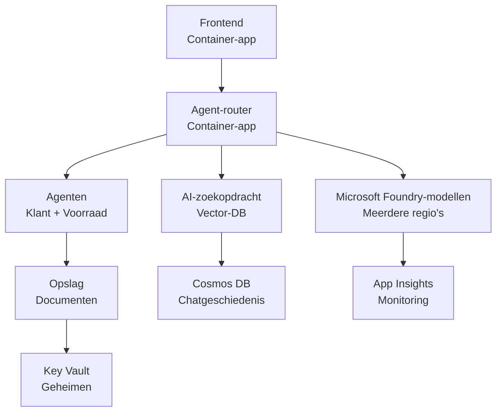

# Retail Multi-Agent-oplossing - Infrastructuursjabloon

**Hoofdstuk 5: Productie-implementatiepakket**
- **📚 Cursus Startpagina**: [AZD Voor Beginners](../../README.md)
- **📖 Gerelateerd Hoofdstuk**: [Hoofdstuk 5: Multi-Agent AI-oplossingen](../../README.md#-chapter-5-multi-agent-ai-solutions-advanced)
- **📝 Scenariogids**: [Volledige Architectuur](../retail-scenario.md)
- **🎯 Snel Implementeren**: [Implementatie met één klik](#-quick-deployment)

> **⚠️ ALLEEN INFRASTRUCTUURSJABLOON**  
> Deze ARM-sjabloon implementeert **Azure-resources** voor een multi-agent systeem.  
>  
> **Wat wordt geïmplementeerd (15-25 minuten):**
> - ✅ Microsoft Foundry Models (gpt-4.1, gpt-4.1-mini, embeddings in 3 regio's)
> - ✅ AI Search-service (leeg, klaar voor indexcreatie)
> - ✅ Container Apps (voorbeeldafbeeldingen, klaar voor uw code)
> - ✅ Storage, Cosmos DB, Key Vault, Application Insights
>  
> **Wat NIET is opgenomen (vereist ontwikkeling):**
> - ❌ Agent-implementatiecode (Customer Agent, Inventory Agent)
> - ❌ Routeringslogica en API-eindpunten
> - ❌ Frontend chat-UI
> - ❌ Zoekindexschema's en datapijplijnen
> - ❌ **Geschatte ontwikkeltijd: 80-120 uur**
>  
> **Gebruik dit sjabloon als:**
> - ✅ U Azure-infrastructuur wilt provisionen voor een multi-agent project
> - ✅ U van plan bent agentimplementatie afzonderlijk te ontwikkelen
> - ✅ U een productie-klaar infrastructuur-baseline nodig heeft
>  
> **Gebruik niet als:**
> - ❌ U direct een werkende multi-agent demo verwacht
> - ❌ U op zoek bent naar complete toepassingscodevoorbeelden

## Overzicht

Deze map bevat een uitgebreid Azure Resource Manager (ARM) sjabloon voor het implementeren van de **infrastructuurbasis** van een multi-agent klantenondersteuningssysteem. Het sjabloon provisioneert alle benodigde Azure-services, correct geconfigureerd en onderling verbonden, klaar voor uw applicatieontwikkeling.

**Na implementatie heeft u:** Productieklare Azure-infrastructuur  
**Om het systeem te voltooien, heeft u nodig:** Agentcode, frontend-UI en dataconfiguratie (zie [Architectuurgids](../retail-scenario.md))

## 🎯 Wat wordt geïmplementeerd

### Kerninfrastructuur (status na implementatie)

✅ **Microsoft Foundry Models Services** (Klaar voor API-aanroepen)
  - Primaire regio: gpt-4.1 deployment (20K TPM capacity)
  - Secundaire regio: gpt-4.1-mini deployment (10K TPM capacity)
  - Tertiaire regio: Text embeddings model (30K TPM capacity)
  - Evaluatieregio: gpt-4.1 grader model (15K TPM capacity)
  - **Status:** Volledig functioneel - kan onmiddellijk API-aanroepen doen

✅ **Azure AI Search** (Leeg - klaar voor configuratie)
  - Vector-zoekmogelijkheden ingeschakeld
  - Standaard tier met 1 partition, 1 replica
  - **Status:** Service draait, maar vereist indexcreatie
  - **Vereiste actie:** Maak een zoekindex met uw schema

✅ **Azure Storage Account** (Leeg - klaar voor uploads)
  - Blob containers: `documents`, `uploads`
  - Veilige configuratie (alleen HTTPS, geen openbare toegang)
  - **Status:** Klaar om bestanden te ontvangen
  - **Vereiste actie:** Upload uw productgegevens en documenten

⚠️ **Container Apps-omgeving** (Voorbeeldafbeeldingen geïmplementeerd)
  - Agent router-app (nginx standaardafbeelding)
  - Frontend-app (nginx standaardafbeelding)
  - Autoscaling geconfigureerd (0-10 instanties)
  - **Status:** Voorbeeldcontainers draaien
  - **Vereiste actie:** Bouw en implementeer uw agenttoepassingen

✅ **Azure Cosmos DB** (Leeg - klaar voor data)
  - Database en container vooraf geconfigureerd
  - Geoptimaliseerd voor laag-latentie bewerkingen
  - TTL ingeschakeld voor automatische opschoning
  - **Status:** Klaar om chatgeschiedenis op te slaan

✅ **Azure Key Vault** (Optioneel - klaar voor geheimen)
  - Soft delete ingeschakeld
  - RBAC geconfigureerd voor beheerde identiteiten
  - **Status:** Klaar om API-sleutels en verbindingstrings op te slaan

✅ **Application Insights** (Optioneel - monitoring actief)
  - Verbonden met Log Analytics-workspace
  - Aangepaste metrics en waarschuwingen geconfigureerd
  - **Status:** Klaar om telemetrie van uw apps te ontvangen

✅ **Document Intelligence** (Klaar voor API-aanroepen)
  - S0-tier voor productieworkloads
  - **Status:** Klaar om geüploade documenten te verwerken

✅ **Bing Search API** (Klaar voor API-aanroepen)
  - S1-tier voor realtime zoekopdrachten
  - **Status:** Klaar voor webzoekopdrachten

### Implementatiemodi

| Modus | OpenAI-capaciteit | Containerinstanties | Zoeklaag | Opslagredundantie | Het beste voor |
|------|-------------------|---------------------|-------------|-------------------|----------|
| **Minimal** | 10K-20K TPM | 0-2 replicas | Basic | LRS (Local) | Dev/test, leren, proof-of-concept |
| **Standard** | 30K-60K TPM | 2-5 replicas | Standard | ZRS (Zone) | Productie, matig verkeer (<10K users) |
| **Premium** | 80K-150K TPM | 5-10 replicas, zone-redundant | Premium | GRS (Geo) | Enterprise, hoog verkeer (>10K users), 99.99% SLA |

**Kostenimpact:**
- **Minimal → Standard:** ~4x kostenstijging ($100-370/mo → $420-1,450/mo)
- **Standard → Premium:** ~3x kostenstijging ($420-1,450/mo → $1,150-3,500/mo)
- **Kies op basis van:** Verwachte load, SLA-vereisten, budgetbeperkingen

**Capaciteitsplanning:**
- **TPM (Tokens Per Minute):** Totaal over alle modelimplementaties
- **Container Instances:** Autoscaling-bereik (min-max replicas)
- **Search Tier:** Beïnvloedt queryprestaties en limieten voor indexgrootte

## 📋 Vereisten

### Vereiste tools
1. **Azure CLI** (versie 2.50.0 of hoger)
   ```bash
   az --version  # Controleer versie
   az login      # Authenticeer
   ```

2. **Actief Azure-abonnement** met Owner- of Contributor-toegang
   ```bash
   az account show  # Abonnement verifiëren
   ```

### Vereiste Azure-quota's

Controleer voor implementatie of er voldoende quota's zijn in uw doelregio's:

```bash
# Controleer de beschikbaarheid van Microsoft Foundry-modellen in uw regio
az cognitiveservices account list-skus \
  --kind OpenAI \
  --location eastus2

# Controleer OpenAI-quota (voorbeeld voor gpt-4.1)
az cognitiveservices usage list \
  --location eastus2 \
  --query "[?name.value=='OpenAI.Standard.gpt-4.1']"

# Controleer Container Apps-quota
az provider show \
  --namespace Microsoft.App \
  --query "resourceTypes[?resourceType=='managedEnvironments'].locations"
```

**Minimaal vereiste quota's:**
- **Microsoft Foundry Models:** 3-4 modelimplementaties verspreid over regio's
  - gpt-4.1: 20K TPM (Tokens Per Minute)
  - gpt-4.1-mini: 10K TPM
  - text-embedding-ada-002: 30K TPM
  - **Opmerking:** gpt-4.1 kan op sommige regio's een wachtlijst hebben - controleer de [beschikbaarheid van modellen](https://learn.microsoft.com/azure/ai-services/openai/concepts/models)
- **Container Apps:** Managed environment + 2-10 containerinstanties
- **AI Search:** Standaard tier (Basic onvoldoende voor vector search)
- **Cosmos DB:** Standaard provisioned throughput

**Als quota onvoldoende zijn:**
1. Ga naar Azure Portal → Quota's → Verzoek om verhoging
2. Of gebruik Azure CLI:
   ```bash
   az support tickets create \
     --ticket-name "OpenAI-Quota-Increase" \
     --severity "minimal" \
     --description "Request quota increase for Microsoft Foundry Models gpt-4.1 in eastus2"
   ```
3. Overweeg alternatieve regio's met beschikbaarheid

## 🚀 Snelle implementatie

### Optie 1: Met Azure CLI

```bash
# Kloon of download de sjabloonbestanden
git clone <repository-url>
cd examples/retail-multiagent-arm-template

# Maak het deployment-script uitvoerbaar
chmod +x deploy.sh

# Implementeer met standaardinstellingen
./deploy.sh -g myResourceGroup

# Implementeer voor productie met premiumfuncties
./deploy.sh -g myProdRG -e prod -m premium -l eastus2
```

### Optie 2: Met Azure Portal

[](https://portal.azure.com/#create/Microsoft.Template/uri/https%3A%2F%2Fraw.githubusercontent.com%2Fmicrosoft%2Fazd-for-beginners%2Fmain%2Fexamples%2Fretail-multiagent-arm-template%2Fazuredeploy.json)

### Optie 3: Direct met Azure CLI

```bash
# Resourcegroep aanmaken
az group create --name myResourceGroup --location eastus2

# Sjabloon implementeren
az deployment group create \
  --resource-group myResourceGroup \
  --template-file azuredeploy.json \
  --parameters azuredeploy.parameters.json
```

## ⏱️ Implementatietijdlijn

### Wat te verwachten

| Fase | Duur | Wat gebeurt er |
|-------|----------|--------------||
| **Sjabloonvalidatie** | 30-60 seconden | Azure valideert ARM-sjabloon-syntaxis en parameters |
| **Resourcegroepinstelling** | 10-20 seconden | Maakt resourcegroep aan (indien nodig) |
| **OpenAI-provisioning** | 5-8 minuten | Maakt 3-4 OpenAI-accounts aan en implementeert modellen |
| **Container Apps** | 3-5 minuten | Maakt omgeving en implementeert voorbeeldcontainers |
| **Search & Storage** | 2-4 minuten | Provisioneert AI Search-service en storage-accounts |
| **Cosmos DB** | 2-3 minuten | Maakt database en configureert containers |
| **Monitoring Setup** | 2-3 minuten | Stelt Application Insights en Log Analytics in |
| **RBAC Configuration** | 1-2 minuten | Configureert beheerde identiteiten en machtigingen |
| **Totale implementatie** | **15-25 minuten** | Volledige infrastructuur klaar |

**Na implementatie:**
- ✅ **Infrastructuur Klaar:** Alle Azure-services provisioned en draaiend
- ⏱️ **Applicatieontwikkeling:** 80-120 uur (uw verantwoordelijkheid)
- ⏱️ **Indexconfiguratie:** 15-30 minuten (vereist uw schema)
- ⏱️ **Data-upload:** Afhankelijk van datasetgrootte
- ⏱️ **Testen & validatie:** 2-4 uur

---

## ✅ Verifieer implementatiesucces

### Stap 1: Controleer resource-voorziening (2 minuten)

```bash
# Controleer of alle resources succesvol zijn uitgerold
az resource list \
  --resource-group myResourceGroup \
  --query "[?provisioningState!='Succeeded'].{Name:name, Status:provisioningState, Type:type}" \
  --output table
```

**Verwacht:** Lege tabel (alle resources tonen de status "Succeeded")

### Stap 2: Controleer Microsoft Foundry Models-implementaties (3 minuten)

```bash
# Lijst alle OpenAI-accounts
az cognitiveservices account list \
  --resource-group myResourceGroup \
  --query "[?kind=='OpenAI'].{Name:name, Location:location, Status:properties.provisioningState}" \
  --output table

# Controleer modelimplementaties voor de primaire regio
OPENAI_NAME=$(az cognitiveservices account list \
  --resource-group myResourceGroup \
  --query "[?kind=='OpenAI'] | [0].name" -o tsv)

az cognitiveservices account deployment list \
  --name $OPENAI_NAME \
  --resource-group myResourceGroup \
  --output table
```

**Verwacht:** 
- 3-4 OpenAI-accounts (primaire, secundaire, tertiaire, evaluatieregio's)
- 1-2 modelimplementaties per account (gpt-4.1, gpt-4.1-mini, text-embedding-ada-002)

### Stap 3: Test infrastructuur-eindpunten (5 minuten)

```bash
# Container-app-URL's ophalen
az containerapp list \
  --resource-group myResourceGroup \
  --query "[].{Name:name, URL:properties.configuration.ingress.fqdn, Status:properties.runningStatus}" \
  --output table

# Router-endpoint testen (voorbeeldafbeelding zal antwoorden)
ROUTER_URL=$(az containerapp show \
  --name retail-router \
  --resource-group myResourceGroup \
  --query "properties.configuration.ingress.fqdn" -o tsv)

echo "Testing: https://$ROUTER_URL"
curl -I https://$ROUTER_URL || echo "Container running (placeholder image - expected)"
```

**Verwacht:** 
- Container Apps tonen "Running" status
- Voorbeeld nginx reageert met HTTP 200 of 404 (nog geen applicatiecode)

### Stap 4: Controleer Microsoft Foundry Models API-toegang (3 minuten)

```bash
# Haal OpenAI-endpoint en sleutel op
OPENAI_ENDPOINT=$(az cognitiveservices account show \
  --name $OPENAI_NAME \
  --resource-group myResourceGroup \
  --query "properties.endpoint" -o tsv)

OPENAI_KEY=$(az cognitiveservices account keys list \
  --name $OPENAI_NAME \
  --resource-group myResourceGroup \
  --query "key1" -o tsv)

# Test gpt-4.1-implementatie
curl "${OPENAI_ENDPOINT}openai/deployments/gpt-4.1/chat/completions?api-version=2024-08-01-preview" \
  -H "Content-Type: application/json" \
  -H "api-key: $OPENAI_KEY" \
  -d '{
    "messages": [{"role": "user", "content": "Say hello"}],
    "max_tokens": 10
  }'
```

**Verwacht:** JSON-antwoord met chat completion (bevestigt dat OpenAI functioneel is)

### Wat werkt vs. wat niet werkt

**✅ Werkt na implementatie:**
- Microsoft Foundry Models zijn geïmplementeerd en accepteren API-aanroepen
- AI Search-service draait (leeg, nog geen indexen)
- Container Apps draaien (voorbeeld nginx-afbeeldingen)
- Storage-accounts toegankelijk en klaar voor uploads
- Cosmos DB klaar voor data-operaties
- Application Insights verzamelt infrastructuurtelemetrie
- Key Vault klaar voor geheimopslag

**❌ Werkt nog niet (vereist ontwikkeling):**
- Agent-eindpunten (geen applicatiecode gedeployed)
- Chatfunctionaliteit (vereist frontend + backend-implementatie)
- Zoekopdrachten (geen zoekindex aangemaakt)
- Documentverwerkingspijplijn (geen data geüpload)
- Aangepaste telemetrie (vereist applicatie-instrumentatie)

**Volgende stappen:** Zie [Post-implementatieconfiguratie](#-post-deployment-next-steps) om uw applicatie te ontwikkelen en implementeren

---

## ⚙️ Configuratie-opties

### Sjabloonparameters

| Parameter | Type | Standaard | Beschrijving |
|-----------|------|---------|-------------|
| `projectName` | string | "retail" | Voorvoegsel voor alle resource-namen |
| `location` | string | Locatie van resourcegroep | Primaire implementatieregio |
| `secondaryLocation` | string | "westus2" | Secundaire regio voor multi-regio implementatie |
| `tertiaryLocation` | string | "francecentral" | Regio voor embeddings-model |
| `environmentName` | string | "dev" | Omgevingsaanduiding (dev/staging/prod) |
| `deploymentMode` | string | "standard" | Implementatieconfiguratie (minimal/standard/premium) |
| `enableMultiRegion` | bool | true | Schakel multi-regio implementatie in |
| `enableMonitoring` | bool | true | Schakel Application Insights en logging in |
| `enableSecurity` | bool | true | Schakel Key Vault en verbeterde beveiliging in |

### Parameters aanpassen

Bewerk `azuredeploy.parameters.json`:

```json
{
  "$schema": "https://schema.management.azure.com/schemas/2019-04-01/deploymentParameters.json#",
  "contentVersion": "1.0.0.0",
  "parameters": {
    "projectName": {
      "value": "mycompany"
    },
    "environmentName": {
      "value": "prod"
    },
    "deploymentMode": {
      "value": "premium"
    },
    "location": {
      "value": "eastus2"
    }
  }
}
```

## 🏗️ Architectuuroverzicht


## 📖 Gebruik van implementatiescript

Het `deploy.sh`-script biedt een interactieve implementatie-ervaring:

```bash
# Toon hulp
./deploy.sh --help

# Basisimplementatie
./deploy.sh -g myResourceGroup

# Geavanceerde implementatie met aangepaste instellingen
./deploy.sh \
  -g myProductionRG \
  -p companyname \
  -e prod \
  -m premium \
  -l eastus2

# Ontwikkelingsimplementatie zonder multi-regio
./deploy.sh \
  -g myDevRG \
  -e dev \
  -m minimal \
  --no-multi-region \
  --no-security
```

### Scriptfuncties

- ✅ **Voorwaardenvalidatie** (Azure CLI, loginstatus, sjabloonbestanden)
- ✅ **Resourcegroepbeheer** (maakt aan als deze nog niet bestaat)
- ✅ **Sjabloonvalidatie** vóór implementatie
- ✅ **Voortgangsbewaking** met gekleurde uitvoer
- ✅ **Implementatie-uitvoer** weergeven
- ✅ **Post-implementatie begeleiding**

## 📊 Monitoring van implementatie

### Controleer implementatiestatus

```bash
# Implementaties weergeven
az deployment group list --resource-group myResourceGroup --output table

# Haal details van de implementatie op
az deployment group show \
  --resource-group myResourceGroup \
  --name retail-deployment-YYYYMMDD-HHMMSS

# Volg de voortgang van de implementatie
az deployment group create \
  --resource-group myResourceGroup \
  --template-file azuredeploy.json \
  --parameters azuredeploy.parameters.json \
  --verbose
```

### Implementatie-uitvoer

Na succesvolle implementatie zijn de volgende outputs beschikbaar:

- **Frontend-URL**: Publiek eindpunt voor de webinterface
- **Router-URL**: API-eindpunt voor de agent-router
- **OpenAI-eindpunten**: Primaire en secundaire OpenAI-service-eindpunten
- **Search-service**: Azure AI Search-service-eindpunt
- **Storage Account**: Naam van het storage-account voor documenten
- **Key Vault**: Naam van de Key Vault (indien ingeschakeld)
- **Application Insights**: Naam van de monitoringservice (indien ingeschakeld)

## 🔧 Post-implementatie: Volgende stappen
> **📝 Belangrijk:** Infrastructuur is geïmplementeerd, maar u moet applicatiecode ontwikkelen en implementeren.

### Fase 1: Ontwikkel agentapplicaties (Uw verantwoordelijkheid)

De ARM-sjabloon maakt **lege Container Apps** met tijdelijke nginx-afbeeldingen. U moet:

**Vereiste ontwikkeling:**
1. **Agentimplementatie** (30-40 uur)
   - Klantenservice-agent met gpt-4.1 integratie
   - Inventory-agent met gpt-4.1-mini integratie
   - Agent-routeringslogica

2. **Frontendontwikkeling** (20-30 uur)
   - Chatinterface UI (React/Vue/Angular)
   - Bestandsuploadfunctionaliteit
   - Weergave en opmaak van reacties

3. **Backendservices** (12-16 uur)
   - FastAPI of Express-router
   - Authenticatiemiddleware
   - Telemetrie-integratie

**Zie:** [Architectuurgids](../retail-scenario.md) voor gedetailleerde implementatiepatronen en codevoorbeelden

### Fase 2: Configureer AI-zoekindex (15-30 minuten)

Maak een zoekindex die overeenkomt met uw datamodel:

```bash
# Zoekservicegegevens ophalen
SEARCH_NAME=$(az search service list \
  --resource-group myResourceGroup \
  --query "[0].name" -o tsv)

SEARCH_KEY=$(az search admin-key show \
  --service-name $SEARCH_NAME \
  --resource-group myResourceGroup \
  --query "primaryKey" -o tsv)

# Maak een index met uw schema (voorbeeld)
curl -X POST "https://${SEARCH_NAME}.search.windows.net/indexes?api-version=2023-11-01" \
  -H "Content-Type: application/json" \
  -H "api-key: ${SEARCH_KEY}" \
  -d '{
    "name": "products",
    "fields": [
      {"name": "id", "type": "Edm.String", "key": true},
      {"name": "title", "type": "Edm.String", "searchable": true},
      {"name": "content", "type": "Edm.String", "searchable": true},
      {"name": "category", "type": "Edm.String", "filterable": true},
      {"name": "content_vector", "type": "Collection(Edm.Single)", 
       "searchable": true, "dimensions": 1536, "vectorSearchProfile": "default"}
    ],
    "vectorSearch": {
      "algorithms": [{"name": "default", "kind": "hnsw"}],
      "profiles": [{"name": "default", "algorithm": "default"}]
    }
  }'
```

**Bronnen:**
- [Ontwerp van AI-zoekindexschema](https://learn.microsoft.com/azure/search/search-what-is-an-index)
- [Vectorzoekconfiguratie](https://learn.microsoft.com/azure/search/vector-search-how-to-create-index)

### Fase 3: Upload uw gegevens (tijd varieert)

Zodra u productgegevens en documenten heeft:

```bash
# Haal opslagaccountgegevens op
STORAGE_NAME=$(az storage account list \
  --resource-group myResourceGroup \
  --query "[0].name" -o tsv)

STORAGE_KEY=$(az storage account keys list \
  --account-name $STORAGE_NAME \
  --resource-group myResourceGroup \
  --query "[0].value" -o tsv)

# Upload uw documenten
az storage blob upload-batch \
  --destination documents \
  --source /path/to/your/product/docs \
  --account-name $STORAGE_NAME \
  --account-key $STORAGE_KEY

# Voorbeeld: één bestand uploaden
az storage blob upload \
  --container-name documents \
  --name "product-manual.pdf" \
  --file /path/to/product-manual.pdf \
  --account-name $STORAGE_NAME \
  --account-key $STORAGE_KEY
```

### Fase 4: Bouw en implementeer uw applicaties (8-12 uur)

Zodra u uw agentcode heeft ontwikkeld:

```bash
# 1. Maak een Azure Container Registry aan (indien nodig)
az acr create \
  --name myregistry \
  --resource-group myResourceGroup \
  --sku Basic

# 2. Bouw en push de agent-router-afbeelding
docker build -t myregistry.azurecr.io/agent-router:v1 /path/to/your/router/code
az acr login --name myregistry
docker push myregistry.azurecr.io/agent-router:v1

# 3. Bouw en push de frontend-afbeelding
docker build -t myregistry.azurecr.io/frontend:v1 /path/to/your/frontend/code
docker push myregistry.azurecr.io/frontend:v1

# 4. Werk Container Apps bij met uw afbeeldingen
az containerapp update \
  --name retail-router \
  --resource-group myResourceGroup \
  --image myregistry.azurecr.io/agent-router:v1

az containerapp update \
  --name retail-frontend \
  --resource-group myResourceGroup \
  --image myregistry.azurecr.io/frontend:v1

# 5. Configureer omgevingsvariabelen
az containerapp update \
  --name retail-router \
  --resource-group myResourceGroup \
  --set-env-vars \
    OPENAI_ENDPOINT=secretref:openai-endpoint \
    OPENAI_KEY=secretref:openai-key \
    SEARCH_ENDPOINT=secretref:search-endpoint \
    SEARCH_KEY=secretref:search-key
```

### Fase 5: Test uw applicatie (2-4 uur)

```bash
# Haal je applicatie-URL op
ROUTER_URL=$(az containerapp show \
  --name retail-router \
  --resource-group myResourceGroup \
  --query "properties.configuration.ingress.fqdn" -o tsv)

# Test het agent-eindpunt (zodra je code is ingezet)
curl -X POST "https://${ROUTER_URL}/chat" \
  -H "Content-Type: application/json" \
  -d '{
    "message": "Hello, I need help with my order",
    "agent": "customer"
  }'

# Controleer de applicatielogs
az containerapp logs show \
  --name retail-router \
  --resource-group myResourceGroup \
  --follow
```

### Implementatiebronnen

**Architectuur & Ontwerp:**
- 📖 [Volledige architectuurgids](../retail-scenario.md) - Gedetailleerde implementatiepatronen
- 📖 [Ontwerppatronen voor multi-agenten](https://learn.microsoft.com/azure/architecture/ai-ml/guide/multi-agent-systems)

**Codevoorbeelden:**
- 🔗 [Microsoft Foundry Models Chat-voorbeeld](https://github.com/Azure-Samples/azure-search-openai-demo) - RAG-patroon
- 🔗 [Semantic Kernel](https://github.com/microsoft/semantic-kernel) - Agent-framework (C#)
- 🔗 [LangChain Azure](https://github.com/langchain-ai/langchain) - Agentorkestratie (Python)
- 🔗 [AutoGen](https://github.com/microsoft/autogen) - Gesprekken tussen meerdere agenten

**Geschatte totale inspanning:**
- Infrastructuurimplementatie: 15-25 minuten (✅ Voltooid)
- Applicatieontwikkeling: 80-120 uur (🔨 Uw werk)
- Testen en optimalisatie: 15-25 uur (🔨 Uw werk)

## 🛠️ Problemen oplossen

### Veelvoorkomende problemen

#### 1. Quota voor Microsoft Foundry-modellen overschreden

```bash
# Controleer het huidige quotagebruik
az cognitiveservices usage list --location eastus2

# Vraag om een verhoging van de quota
az support tickets create \
  --ticket-name "OpenAI-Quota-Increase" \
  --severity "minimal" \
  --description "Request quota increase for Microsoft Foundry Models in region X"
```

#### 2. Implementatie van Container Apps mislukt

```bash
# Controleer de logs van de container-app
az containerapp logs show \
  --name retail-router \
  --resource-group myResourceGroup \
  --follow

# Herstart de container-app
az containerapp revision restart \
  --name retail-router \
  --resource-group myResourceGroup
```

#### 3. Initialisatie van de zoekservice

```bash
# Controleer de status van de zoekservice
az search service show \
  --name <search-service-name> \
  --resource-group myResourceGroup

# Test de connectiviteit van de zoekservice
curl -X GET "https://<search-service-name>.search.windows.net/indexes?api-version=2023-11-01" \
  -H "api-key: <search-admin-key>"
```

### Implementatievalidatie

```bash
# Valideer dat alle bronnen zijn aangemaakt
az resource list \
  --resource-group myResourceGroup \
  --output table

# Controleer de gezondheid van de bron
az resource list \
  --resource-group myResourceGroup \
  --query "[?provisioningState!='Succeeded'].{Name:name, Status:provisioningState, Type:type}" \
  --output table
```

## 🔐 Beveiligingsoverwegingen

### Sleutelbeheer
- Alle geheimen worden opgeslagen in Azure Key Vault (indien ingeschakeld)
- Container-apps gebruiken een beheerde identiteit voor authenticatie
- Opslagaccounts hebben veilige standaardinstellingen (alleen HTTPS, geen openbare blobtoegang)

### Netwerkbeveiliging
- Container-apps gebruiken waar mogelijk interne netwerken
- Zoekservice geconfigureerd met optie voor privé-eindpunten
- Cosmos DB geconfigureerd met minimale noodzakelijke machtigingen

### RBAC-configuratie
```bash
# Ken de benodigde rollen toe aan de beheerde identiteit.
az role assignment create \
  --assignee <container-app-managed-identity> \
  --role "Cognitive Services OpenAI User" \
  --scope <openai-resource-id>
```

## 💰 Kostenoptimalisatie

### Kostenraming (maandelijks, USD)

| Modus | OpenAI | Container-apps | Zoekservice | Opslag | Totaal geschat |
|------|--------|----------------|--------|---------|------------|
| Minimaal | $50-200 | $20-50 | $25-100 | $5-20 | $100-370 |
| Standaard | $200-800 | $100-300 | $100-300 | $20-50 | $420-1450 |
| Premium | $500-2000 | $300-800 | $300-600 | $50-100 | $1150-3500 |

### Kostenmonitoring

```bash
# Stel budgetwaarschuwingen in
az consumption budget create \
  --account-name <subscription-id> \
  --budget-name "retail-budget" \
  --amount 500 \
  --time-grain Monthly \
  --start-date 2024-01-01 \
  --end-date 2024-12-31
```

## 🔄 Updates en onderhoud

### Sjabloonupdates
- Beheer ARM-sjabloonbestanden met versiebeheer
- Test wijzigingen eerst in de ontwikkelomgeving
- Gebruik incrementele implementatiemodus voor updates

### Resource-updates
```bash
# Bijwerken met nieuwe parameters
az deployment group create \
  --resource-group myResourceGroup \
  --template-file azuredeploy.json \
  --parameters azuredeploy.parameters.json \
  --mode Incremental
```

### Back-up en herstel
- Automatische back-up van Cosmos DB ingeschakeld
- Soft delete voor Key Vault ingeschakeld
- Container-apprevisies behouden voor rollback

## 📞 Ondersteuning

- **Sjabloonproblemen**: [GitHub Issues](https://github.com/microsoft/azd-for-beginners/issues)
- **Azure-ondersteuning**: [Azure Support Portal](https://portal.azure.com/#blade/Microsoft_Azure_Support/HelpAndSupportBlade)
- **Community**: [Azure AI Discord](https://discord.gg/microsoft-azure)

---

**⚡ Klaar om uw multi-agentoplossing te implementeren?**

Begin met: `./deploy.sh -g myResourceGroup`

---

<!-- CO-OP TRANSLATOR DISCLAIMER START -->
**Vrijwaring**:
Dit document is vertaald met behulp van de AI-vertalingsdienst [Co-op Translator](https://github.com/Azure/co-op-translator). Hoewel we naar nauwkeurigheid streven, houd er rekening mee dat geautomatiseerde vertalingen fouten of onnauwkeurigheden kunnen bevatten. Het oorspronkelijke document in de originele taal moet als de gezaghebbende bron worden beschouwd. Voor cruciale informatie wordt een professionele menselijke vertaling aanbevolen. Wij zijn niet aansprakelijk voor enige misverstanden of verkeerde interpretaties die voortvloeien uit het gebruik van deze vertaling.
<!-- CO-OP TRANSLATOR DISCLAIMER END -->