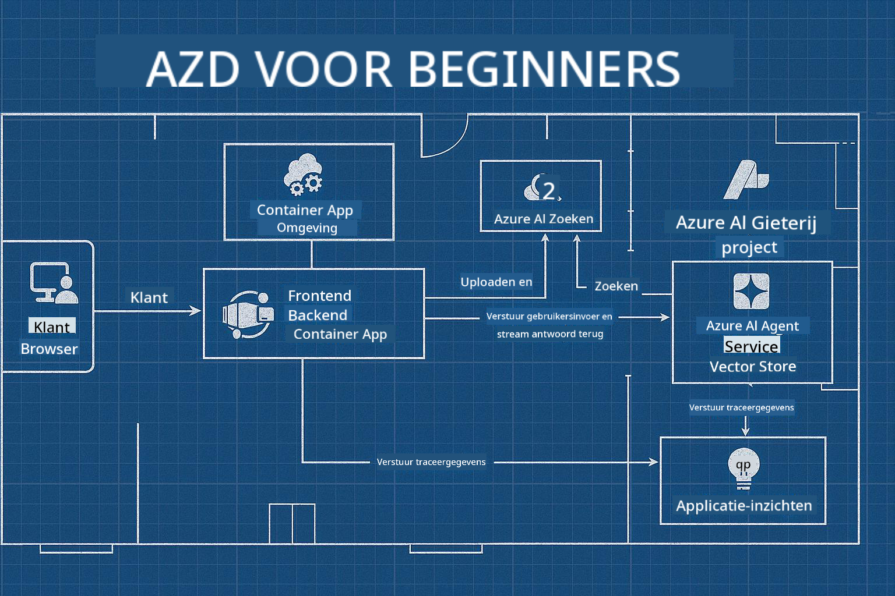

<!--
CO_OP_TRANSLATOR_METADATA:
{
  "original_hash": "245d24997bbcf2bae93bb2a503845d37",
  "translation_date": "2025-09-23T11:58:51+00:00",
  "source_file": "workshop/README.md",
  "language_code": "nl"
}
-->
# AZD voor AI-ontwikkelaars Workshop

## AZD Templates

Het bouwen van een AI-oplossing van ondernemingsniveau voor jouw specifieke scenario is vergelijkbaar met het bouwen van je eigen huis. Je kunt het zelf ontwerpen, steen voor steen bouwen en de verantwoordelijkheid nemen om ervoor te zorgen dat het voldoet aan alle richtlijnen voor governance en ontwikkeling.

**OF ....**

Je kunt samenwerken met een architect die je een _blauwdruk_ kan geven voor een starterswoning, en vervolgens met je kan samenwerken om deze te _personaliseren_ zodat het aan jouw behoeften voldoet. Dit stelt je in staat om je te concentreren op wat **jouw huis** speciaal maakt, terwijl de onderliggende bedrading, leidingen en andere afhankelijkheden door experts voor je worden verzorgd.

**Dit is de aanpak achter [AI App Templates](https://ai.azure.com/templates)** - een reeks blauwdrukken voor het bouwen van verschillende soorten AI-applicatie "huizen", afhankelijk van wat jouw kernbehoeften en afhankelijkheden zijn.

## Template Aanpassing

De templates zijn ontworpen om te werken met [Azure AI Foundry](https://ai.azure.com). Zie dit platform als jouw "bouwcontractor" met toegang tot alle middelen, tools en expertise die je nodig hebt om de klus te klaren!

Alles wat je hoeft te doen is [jouw startertemplates](https://learn.microsoft.com/en-us/azure/ai-foundry/how-to/develop/ai-template-get-started) kiezen. Bijvoorbeeld, we richten ons op de _Get Started with AI Agents_ template om een "Agentic AI Home" te bouwen die is uitgerust met functies zoals AI Search, Red Teaming, Evaluaties, Tracing, Monitoring en meer!



Het enige wat je nodig hebt is tijd boeken met de architect, die je door het aanpassingsproces begeleidt. [GitHub Copilot for Azure](https://learn.microsoft.com/en-us/azure/developer/github-copilot-azure/get-started) kan die gids zijn. Chat gewoon met het om:

- Meer te leren over de Azure-functies in jouw template
- Azure-resources te implementeren
- Informatie te krijgen over jouw implementatie
- Problemen te diagnosticeren en op te lossen!

In deze workshop leren we hoe we de bestaande template kunnen _deconstrueren_ (om te begrijpen wat het biedt), en vervolgens _aanpassen_ (om aan onze vereisten te voldoen) - stap voor stap.

AI Templates **maken het werkend** - door de workshop te voltooien leer je hoe je het **eigen maakt**.

----

**Workshop Navigatie**
- **📚 Cursus Home**: [AZD Voor Beginners](../README.md)
- **📖 Gerelateerde Hoofdstukken**: Behandelt [Hoofdstuk 1](../README.md#-chapter-1-foundation--quick-start), [Hoofdstuk 2](../README.md#-chapter-2-ai-first-development-recommended-for-ai-developers), en [Hoofdstuk 5](../README.md#-chapter-5-multi-agent-ai-solutions-advanced)
- **🛠️ Praktijklab**: [AI Workshop Lab](../docs/ai-foundry/ai-workshop-lab.md)
- **🚀 Volgende Stappen**: [Workshop Lab Modules](../../../workshop)

Welkom bij de hands-on workshop voor het leren van Azure Developer CLI (AZD) met een focus op AI-applicatie implementatie. Deze workshop is ontworpen om je van AZD-basisprincipes naar het implementeren van productieklare AI-oplossingen te brengen.

## Workshop Overzicht

**Duur:** 2-3 uur  
**Niveau:** Beginner tot Gemiddeld  
**Vereisten:** Basiskennis van Azure, commandoregeltools en AI-concepten

### Wat Je Leert

- **AZD Basisprincipes**: Begrip van Infrastructure as Code met AZD
- 🤖 **AI Service Integratie**: Implementeren van Azure OpenAI, AI Search en andere AI-services
- **Container Implementatie**: Gebruik van Azure Container Apps voor AI-applicaties
- **Beveiligingspraktijken**: Implementeren van Managed Identity en veilige configuraties
- **Monitoring & Observatie**: Instellen van Application Insights voor AI-werkbelastingen
- **Productiepatronen**: Strategieën voor implementatie op ondernemingsniveau

## Workshop Structuur

### Module 1: AZD Basisprincipes (30 minuten)
- AZD installeren en configureren
- Begrip van AZD-projectstructuur
- Jouw eerste AZD-implementatie
- **Lab**: Implementeer een eenvoudige webapplicatie

### Module 2: Azure OpenAI Integratie (45 minuten)
- Azure OpenAI-resources instellen
- Modelimplementatiestrategieën
- API-toegang en authenticatie configureren
- **Lab**: Implementeer een chatapplicatie met GPT-4

### Module 3: RAG Applicaties (45 minuten)
- Integratie van Azure AI Search
- Documentverwerking met Azure Document Intelligence
- Vector embeddings en semantische zoekopdrachten
- **Lab**: Bouw een document Q&A-systeem

### Module 4: Productie Implementatie (30 minuten)
- Configuratie van Container Apps
- Schaalbaarheid en prestatieoptimalisatie
- Monitoring en logging
- **Lab**: Implementeer naar productie met observatie

### Module 5: Geavanceerde Patronen (15 minuten)
- Implementaties in meerdere omgevingen
- CI/CD-integratie
- Kostenoptimalisatiestrategieën
- **Afsluiting**: Checklist voor productiegereedheid

## Vereisten

### Vereiste Tools

Installeer deze tools vóór de workshop:

```bash
# Azure Developer CLI
curl -fsSL https://aka.ms/install-azd.sh | bash

# Azure CLI
curl -sL https://aka.ms/InstallAzureCLIDeb | sudo bash

# Git
sudo apt-get install git

# Docker
curl -fsSL https://get.docker.com -o get-docker.sh
sudo sh get-docker.sh

# Python 3.10+
sudo apt-get install python3.10 python3.10-venv python3-pip
```

### Azure Account Instellen

1. **Azure Abonnement**: [Meld je gratis aan](https://azure.microsoft.com/free/)
2. **Azure OpenAI Toegang**: [Vraag toegang aan](https://aka.ms/oai/access)
3. **Vereiste Machtigingen**:
   - Contributor rol op abonnement of resourcegroep
   - User Access Administrator (voor RBAC-toewijzingen)

### Vereisten Verifiëren

Voer dit script uit om je setup te verifiëren:

```bash
#!/bin/bash
echo "Verifying workshop prerequisites..."

# Check AZD installation
if command -v azd &> /dev/null; then
    echo "✅ Azure Developer CLI: $(azd --version)"
else
    echo "❌ Azure Developer CLI not found"
fi

# Check Azure CLI
if command -v az &> /dev/null; then
    echo "✅ Azure CLI: $(az --version | head -n1)"
else
    echo "❌ Azure CLI not found"
fi

# Check Docker
if command -v docker &> /dev/null; then
    echo "✅ Docker: $(docker --version)"
else
    echo "❌ Docker not found"
fi

# Check Python
if command -v python3 &> /dev/null; then
    echo "✅ Python: $(python3 --version)"
else
    echo "❌ Python 3 not found"
fi

# Check Azure login
if az account show &> /dev/null; then
    echo "✅ Azure: Logged in as $(az account show --query user.name -o tsv)"
else
    echo "❌ Azure: Not logged in (run 'az login')"
fi

echo "Setup verification complete!"
```

## Workshop Materialen

### Lab Oefeningen

Elke module bevat hands-on labs met startcode en stapsgewijze instructies:

- **[lab-1-azd-basics/](../../../workshop/lab-1-azd-basics)** - Jouw eerste AZD-implementatie
- **[lab-2-openai-chat/](../../../workshop/lab-2-openai-chat)** - Chatapplicatie met Azure OpenAI
- **[lab-3-rag-search/](../../../workshop/lab-3-rag-search)** - RAG-applicatie met AI Search
- **[lab-4-production/](../../../workshop/lab-4-production)** - Productie implementatiepatronen
- **[lab-5-advanced/](../../../workshop/lab-5-advanced)** - Geavanceerde implementatiescenario's

### Referentiematerialen

- **[AI Foundry Integratiegids](../docs/ai-foundry/azure-ai-foundry-integration.md)** - Uitgebreide integratiepatronen
- **[AI Model Implementatiegids](../docs/ai-foundry/ai-model-deployment.md)** - Beste praktijken voor modelimplementatie
- **[Productie AI Praktijken](../docs/ai-foundry/production-ai-practices.md)** - Implementatiepatronen voor ondernemingen
- **[AI Probleemoplossingsgids](../docs/troubleshooting/ai-troubleshooting.md)** - Veelvoorkomende problemen en oplossingen

### Voorbeeld Templates

Quick-start templates voor veelvoorkomende AI-scenario's:

```
workshop/templates/
├── minimal-chat/          # Basic OpenAI chat app
├── rag-application/       # RAG with AI Search
├── multi-model/          # Multiple AI services
└── production-ready/     # Enterprise template
```

## Aan de Slag

### Optie 1: GitHub Codespaces (Aanbevolen)

De snelste manier om de workshop te starten:

[](https://github.com/codespaces/new?hide_repo_select=true&ref=main&repo=YOUR_REPO_ID)

### Optie 2: Lokale Ontwikkeling

1. **Clone de workshop repository:**
```bash
git clone https://github.com/YOUR_ORG/AZD-for-beginners.git
cd AZD-for-beginners/workshop
```

2. **Login bij Azure:**
```bash
az login
azd auth login
```

3. **Begin met Lab 1:**
```bash
cd lab-1-azd-basics
cat README.md  # Follow the instructions
```

### Optie 3: Workshop met Instructeur

Als je deelneemt aan een sessie met een instructeur:

- 🎥 **Workshop Opname**: [Beschikbaar op aanvraag](https://aka.ms/azd-ai-workshop)
- 💬 **Discord Community**: [Word lid voor live ondersteuning](https://aka.ms/foundry/discord)
- **Workshop Feedback**: [Deel je ervaring](https://aka.ms/azd-workshop-feedback)

## Workshop Tijdlijn

### Zelfstudie (3 uur)

```
⏰ 00:00 - 00:30  Module 1: AZD Foundations
⏰ 00:30 - 01:15  Module 2: Azure OpenAI Integration
⏰ 01:15 - 02:00  Module 3: RAG Applications
⏰ 02:00 - 02:30  Module 4: Production Deployment
⏰ 02:30 - 02:45  Module 5: Advanced Patterns
⏰ 02:45 - 03:00  Q&A and Next Steps
```

### Sessie met Instructeur (2,5 uur)

```
⏰ 00:00 - 00:15  Welcome & Prerequisites Check
⏰ 00:15 - 00:40  Module 1: Live Demo + Lab
⏰ 00:40 - 01:20  Module 2: OpenAI Integration
⏰ 01:20 - 01:30  Break
⏰ 01:30 - 02:10  Module 3: RAG Applications
⏰ 02:10 - 02:30  Module 4: Production Patterns
⏰ 02:30 - 02:45  Module 5: Advanced Topics
⏰ 02:45 - 03:00  Q&A and Resources
```

## Succescriteria

Aan het einde van deze workshop kun je:

✅ **AI-applicaties implementeren** met AZD templates  
✅ **Azure OpenAI configureren** met de juiste beveiliging  
✅ **RAG-applicaties bouwen** met Azure AI Search integratie  
✅ **Productiepatronen implementeren** voor AI-werkbelastingen op ondernemingsniveau  
✅ **AI-applicatie implementaties monitoren en oplossen**  
✅ **Kostenoptimalisatiestrategieën toepassen** voor AI-werkbelastingen  

## Community & Ondersteuning

### Tijdens de Workshop

- 🙋 **Vragen**: Gebruik de workshopchat of steek je hand op
- 🐛 **Problemen**: Bekijk de [probleemoplossingsgids](../docs/troubleshooting/ai-troubleshooting.md)
- **Tips**: Deel ontdekkingen met andere deelnemers

### Na de Workshop

- 💬 **Discord**: [Azure AI Foundry Community](https://aka.ms/foundry/discord)
- **GitHub Issues**: [Meld templateproblemen](https://github.com/YOUR_ORG/AZD-for-beginners/issues)
- 📧 **Feedback**: [Workshop evaluatieformulier](https://aka.ms/azd-workshop-feedback)

## Volgende Stappen

### Verder Leren

1. **Geavanceerde Scenario's**: Verken [multi-regio implementaties](../docs/ai-foundry/production-ai-practices.md#multi-region-deployment)
2. **CI/CD Integratie**: Stel [GitHub Actions workflows](../docs/deployment/github-actions.md) in
3. **Aangepaste Templates**: Maak je eigen [AZD templates](../docs/getting-started/custom-templates.md)

### Toepassen in Jouw Projecten

1. **Beoordeling**: Gebruik onze [gereedheidschecklist](./production-readiness-checklist.md)
2. **Templates**: Begin met onze [AI-specifieke templates](../../../workshop/templates)
3. **Ondersteuning**: Word lid van de [Azure AI Foundry Discord](https://aka.ms/foundry/discord)

### Deel Jouw Succes

- ⭐ **Geef een ster aan de repository** als deze workshop je heeft geholpen
- 🐦 **Deel op sociale media** met #AzureDeveloperCLI #AzureAI
- 📝 **Schrijf een blogpost** over jouw AI-implementatie reis

---

## Workshop Feedback

Jouw feedback helpt ons de workshopervaring te verbeteren:

| Aspect | Beoordeling (1-5) | Opmerkingen |
|--------|-------------------|-------------|
| Kwaliteit van de inhoud | ⭐⭐⭐⭐⭐ | |
| Hands-on Labs | ⭐⭐⭐⭐⭐ | |
| Documentatie | ⭐⭐⭐⭐⭐ | |
| Moeilijkheidsgraad | ⭐⭐⭐⭐⭐ | |
| Algemene Ervaring | ⭐⭐⭐⭐⭐ | |

**Feedback indienen**: [Workshop Evaluatieformulier](https://aka.ms/azd-workshop-feedback)

---

**Vorige:** [AI Probleemoplossingsgids](../docs/troubleshooting/ai-troubleshooting.md) | **Volgende:** Begin met [Lab 1: AZD Basisprincipes](../../../workshop/lab-1-azd-basics)

**Klaar om AI-applicaties te bouwen met AZD?**

[Begin Lab 1: AZD Basisprincipes →](./lab-1-azd-basics/README.md)

---

