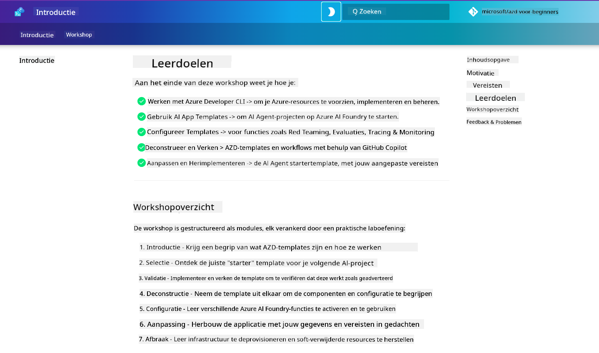

<!--
CO_OP_TRANSLATOR_METADATA:
{
  "original_hash": "9cc966416ab431c38b2ab863884b196c",
  "translation_date": "2025-09-24T22:37:48+00:00",
  "source_file": "workshop/README.md",
  "language_code": "nl"
}
-->
# AZD voor AI-ontwikkelaars Workshop

Welkom bij de praktische workshop om Azure Developer CLI (AZD) te leren, met een focus op het implementeren van AI-toepassingen. Deze workshop helpt je een praktische kennis op te doen van AZD-sjablonen in 3 stappen:

1. **Ontdekken** - vind het sjabloon dat bij jou past.
1. **Implementeren** - implementeer en controleer of het werkt.
1. **Aanpassen** - wijzig en verbeter om het eigen te maken!

Tijdens deze workshop maak je ook kennis met kernontwikkeltools en workflows, die je helpen je end-to-end ontwikkeltraject te stroomlijnen.

<br/>

## Browser-gebaseerde gids

De workshoplessen zijn in Markdown geschreven. Je kunt ze direct in GitHub bekijken - of een browser-gebaseerde preview starten zoals weergegeven in de onderstaande screenshot.



Om deze optie te gebruiken - fork de repository naar je profiel en start GitHub Codespaces. Zodra de VS Code-terminal actief is, typ je dit commando:

```bash title="" linenums="0"
mkdocs serve > /dev/null 2>&1 &
```

Na enkele seconden verschijnt er een pop-updialoog. Selecteer de optie `Open in browser`. De webgebaseerde gids opent nu in een nieuw browsertabblad. Enkele voordelen van deze preview:

1. **Ingebouwde zoekfunctie** - vind snel trefwoorden of lessen.
1. **Kopieer-icoon** - zweef over codeblokken om deze optie te zien.
1. **Thema wisselen** - schakel tussen donkere en lichte thema's.
1. **Hulp krijgen** - klik op het Discord-icoon in de footer om deel te nemen!

<br/>

## Workshopoverzicht

**Duur:** 3-4 uur  
**Niveau:** Beginner tot gemiddeld  
**Vereisten:** Basiskennis van Azure, AI-concepten, VS Code & command-line tools.

Dit is een praktische workshop waarin je leert door te doen. Nadat je de oefeningen hebt voltooid, raden we aan om de AZD Voor Beginners-cursus te bekijken om je leertraject voort te zetten met beveiliging en productiviteitsbest practices.

| Tijd | Module  | Doelstelling |
|:---|:---|:---|
| 15 min | [Introductie](docs/instructions/0-Introduction.md) | De doelen begrijpen en de basis leggen |
| 30 min | [Selecteer AI-sjabloon](docs/instructions/1-Select-AI-Template.md) | Opties verkennen en een starter kiezen | 
| 30 min | [Valideer AI-sjabloon](docs/instructions/2-Validate-AI-Template.md) | Implementeer de standaardoplossing op Azure |
| 30 min | [Ontleed AI-sjabloon](docs/instructions/3-Deconstruct-AI-Template.md) | Structuur en configuratie verkennen |
| 30 min | [Configureer AI-sjabloon](docs/instructions/4-Configure-AI-Template.md) | Functies activeren en uitproberen |
| 30 min | [Pas AI-sjabloon aan](docs/instructions/5-Customize-AI-Template.md) | Het sjabloon aanpassen aan jouw behoeften |
| 30 min | [Ruim infrastructuur op](docs/instructions/6-Teardown-Infrastructure.md) | Opruimen en middelen vrijmaken |
| 15 min | [Afronding & Volgende stappen](docs/instructions/7-Wrap-up.md) | Leermiddelen, workshopuitdaging |

<br/>

## Wat je zult leren

Zie het AZD-sjabloon als een leeromgeving om verschillende mogelijkheden en tools te verkennen voor end-to-end ontwikkeling op Azure AI Foundry. Aan het einde van deze workshop heb je een intuïtief begrip van verschillende tools en concepten in deze context.

| Concept  | Doelstelling |
|:---|:---|
| **Azure Developer CLI** | Begrijp toolcommando's en workflows |
| **AZD-sjablonen**| Begrijp projectstructuur en configuratie |
| **Azure AI Agent**| Voorzie en implementeer een Azure AI Foundry-project |
| **Azure AI Search**| Activeer context engineering met agents |
| **Observability**| Verken tracing, monitoring en evaluaties |
| **Red Teaming**| Verken adversarial testing en mitigaties |

<br/>

## Workshopstructuur

De workshop is gestructureerd om je mee te nemen op een reis van sjabloonontdekking, naar implementatie, ontleding en aanpassing - met het officiële [Getting Started with AI Agents](https://github.com/Azure-Samples/get-started-with-ai-agents) starter-sjabloon als basis.

### [Module 1: Selecteer AI-sjabloon](docs/instructions/1-Select-AI-Template.md) (30 min)

- Wat zijn AI-sjablonen?
- Waar kan ik AI-sjablonen vinden?
- Hoe kan ik beginnen met het bouwen van AI-agents?
- **Lab**: Snelle start met GitHub Codespaces

### [Module 2: Valideer AI-sjabloon](docs/instructions/2-Validate-AI-Template.md) (30 min)

- Wat is de architectuur van het AI-sjabloon?
- Wat is de AZD-ontwikkelworkflow?
- Hoe kan ik hulp krijgen bij AZD-ontwikkeling?
- **Lab**: Implementeer & valideer AI-agents-sjabloon

### [Module 3: Ontleed AI-sjabloon](docs/instructions/3-Deconstruct-AI-Template.md) (30 min)

- Verken je omgeving in `.azure/` 
- Verken je resource-instelling in `infra/` 
- Verken je AZD-configuratie in `azure.yaml`s
- **Lab**: Wijzig omgevingsvariabelen & herimplementeer

### [Module 4: Configureer AI-sjabloon](docs/instructions/4-Configure-AI-Template.md) (30 min)
- Verken: Retrieval Augmented Generation
- Verken: Agent Evaluatie & Red Teaming
- Verken: Tracing & Monitoring
- **Lab**: Verken AI-agent + Observability 

### [Module 5: Pas AI-sjabloon aan](docs/instructions/5-Customize-AI-Template.md) (30 min)
- Definieer: PRD met scenariovereisten
- Configureer: Omgevingsvariabelen voor AZD
- Implementeer: Lifecycle Hooks voor extra taken
- **Lab**: Pas sjabloon aan voor mijn scenario

### [Module 6: Ruim infrastructuur op](docs/instructions/6-Teardown-Infrastructure.md) (30 min)
- Samenvatting: Wat zijn AZD-sjablonen?
- Samenvatting: Waarom Azure Developer CLI gebruiken?
- Volgende stappen: Probeer een ander sjabloon!
- **Lab**: Deprovision infrastructuur & opruimen

<br/>

## Workshopuitdaging

Wil je jezelf uitdagen om meer te doen? Hier zijn enkele projectvoorstellen - of deel je ideeën met ons!!

| Project | Beschrijving |
|:---|:---|
|1. **Ontleed een complex AI-sjabloon** | Gebruik de workflow en tools die we hebben beschreven en kijk of je een ander AI-oplossingssjabloon kunt implementeren, valideren en aanpassen. _Wat heb je geleerd?_|
|2. **Pas aan met jouw scenario**  | Probeer een PRD (Product Requirements Document) te schrijven voor een ander scenario. Gebruik vervolgens GitHub Copilot in je sjabloonrepo in Agent Model - en vraag het om een aanpassingsworkflow voor je te genereren. _Wat heb je geleerd? Hoe kun je deze suggesties verbeteren?_|
| | |

## Feedback geven?

1. Plaats een issue op deze repo - tag het `Workshop` voor gemak.
1. Word lid van de Azure AI Foundry Discord - verbind met je peers!


| | | 
|:---|:---|
| **📚 Cursus Home**| [AZD Voor Beginners](../README.md)|
| **📖 Documentatie** | [Aan de slag met AI-sjablonen](https://learn.microsoft.com/en-us/azure/ai-foundry/how-to/develop/ai-template-get-started)|
| **🛠️AI-sjablonen** | [Azure AI Foundry Templates](https://ai.azure.com/templates) |
|**🚀 Volgende stappen** | [Neem de uitdaging aan](../../../workshop) |
| | |

<br/>

---

**Vorige:** [AI Probleemoplossingsgids](../docs/troubleshooting/ai-troubleshooting.md) | **Volgende:** Begin met [Lab 1: AZD Basisprincipes](../../../workshop/lab-1-azd-basics)

**Klaar om te beginnen met het bouwen van AI-toepassingen met AZD?**

[Begin Lab 1: AZD Foundations →](./lab-1-azd-basics/README.md)

---

