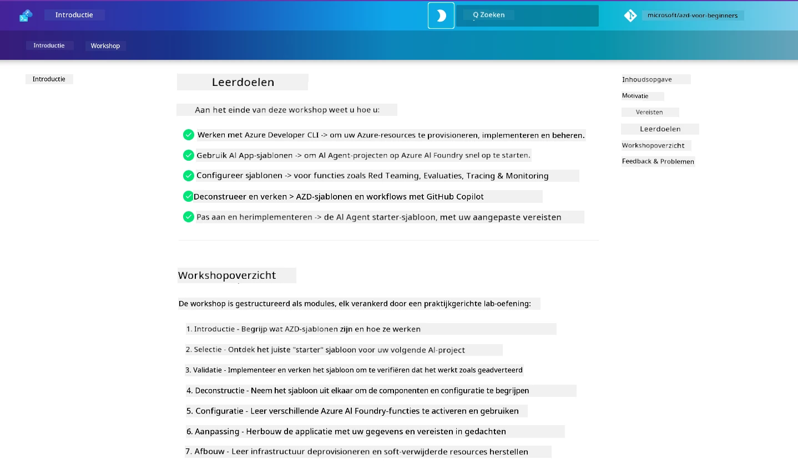

<div align="center">
  <div style="background: linear-gradient(135deg, #0078d4, #106ebe); border-radius: 10px; padding: 20px; margin: 20px 0; box-shadow: 0 4px 15px rgba(0, 120, 212, 0.3); border: 2px solid #005a9e;">
    <h2 style="color: white; margin: 0; font-size: 24px; text-shadow: 1px 1px 2px rgba(0,0,0,0.3);">
      🎯 AZD-workshop voor AI-ontwikkelaars
    </h2>
    <p style="color: white; margin: 10px 0 0 0; font-size: 16px; text-shadow: 1px 1px 2px rgba(0,0,0,0.3);">
      <strong>Een praktische workshop voor het bouwen van AI-toepassingen met de Azure Developer CLI.</strong><br>
      Voltooi 7 modules om AZD-sjablonen en AI-implementatieworkflows te beheersen.
    </p>
    <div style="margin-top: 15px;">
      <span style="background: rgba(255,255,255,0.2); padding: 5px 10px; border-radius: 15px; color: white; font-size: 14px;">
        📅 Laatst bijgewerkt: maart 2026
      </span>
    </div>
  </div>
</div>

# AZD-workshop voor AI-ontwikkelaars

Welkom bij de praktische workshop om de Azure Developer CLI (AZD) te leren met een focus op het implementeren van AI-toepassingen. Deze workshop helpt je een toegepaste kennis van AZD-sjablonen te krijgen in 3 stappen:

1. **Ontdekken** - vind het sjabloon dat bij jou past.
1. **Implementatie** - implementeer en valideer dat het werkt
1. **Personalisatie** - wijzig en iterateer om het van jou te maken!

In de loop van deze workshop leer je ook de belangrijkste ontwikkelaarstools en workflows kennen, om je end-to-end ontwikkeltraject te stroomlijnen.

<br/>

## Browser-Based Guide

De workshoplessen zijn in Markdown. Je kunt ze direct in GitHub doorlopen - of een browsergebaseerde preview starten zoals weergegeven in de screenshot hieronder.



Om deze optie te gebruiken - fork de repository naar je profiel en start GitHub Codespaces. Zodra de VS Code-terminal actief is, typ je dit commando:

This browser preview works in GitHub Codespaces, dev containers, or a local clone with Python and MkDocs installed.

```bash title="" linenums="0"
mkdocs serve > /dev/null 2>&1 &
```

In een paar seconden zie je een pop-updialoog. Selecteer de optie om `Openen in de browser`. De webgebaseerde gids opent nu in een nieuw browsertabblad. Enkele voordelen van deze preview:

1. **Ingebouwde zoekfunctie** - vind snel trefwoorden of lessen.
1. **Kopieer-pictogram** - beweeg de muis over codeblokken om deze optie te zien
1. **Thema-omschakeling** - wissel tussen donkere en lichte thema's
1. **Hulp krijgen** - klik op het Discord-pictogram in de voettekst om deel te nemen!

<br/>

## Workshop overzicht

**Duur:** 3-4 uur  
**Niveau:** Beginner tot Gevorderd  
**Vereisten:** Bekendheid met Azure, AI-concepten, VS Code & commandoregeltools.

Dit is een praktische workshop waarbij je leert door te doen. Zodra je de oefeningen hebt voltooid, raden we aan de AZD For Beginners-curriculum te bekijken om je leertraject voort te zetten naar beveiliging en productiviteitsbest practices.

| Tijd| Module  | Doel |
|:---|:---|:---|
| 15 min | [Introductie](docs/instructions/0-Introduction.md) | Stel het kader vast, begrijp de doelstellingen |
| 30 min | [Selecteer AI-sjabloon](docs/instructions/1-Select-AI-Template.md) | Verken opties en kies een starter | 
| 30 min | [Valideer AI-sjabloon](docs/instructions/2-Validate-AI-Template.md) | Implementeer de standaardoplossing naar Azure |
| 30 min | [Ontleed AI-sjabloon](docs/instructions/3-Deconstruct-AI-Template.md) | Verken structuur en configuratie |
| 30 min | [Configureer AI-sjabloon](docs/instructions/4-Configure-AI-Template.md) | Activeer en probeer beschikbare functies |
| 30 min | [Pas AI-sjabloon aan](docs/instructions/5-Customize-AI-Template.md) | Pas het sjabloon aan jouw behoeften aan |
| 30 min | [Infrastructuur afbreken](docs/instructions/6-Teardown-Infrastructure.md) | Opruimen en resources vrijgeven |
| 15 min | [Afronding & Volgende stappen](docs/instructions/7-Wrap-up.md) | Leermaterialen, workshop-uitdaging |

<br/>

## Wat je zult leren

Zie het AZD-sjabloon als een leersandbox om verschillende mogelijkheden en tools voor end-to-end ontwikkeling op Microsoft Foundry te verkennen. Aan het einde van deze workshop zou je een intuïtief gevoel moeten hebben voor verschillende tools en concepten in deze context.

| Concept  | Doel |
|:---|:---|
| **Azure Developer CLI** | Begrijp de commando's en workflows van de tool |
| **AZD-sjablonen**| Begrijp projectstructuur en configuratie |
| **Azure AI-agent**| Provisioneren & implementeren van Microsoft Foundry-project |
| **Azure AI Search**| Maak context-engineering met agents mogelijk |
| **Observeerbaarheid**| Verken tracing, monitoring en evaluaties |
| **Red Teaming**| Verken adversarial testen en mitigaties |

<br/>

## Workshopstructuur

De workshop is zo opgebouwd dat je een reis maakt van sjabloonontdekking, naar implementatie, ontleding en personalisatie - met het officiële [Aan de slag met AI-agents](https://github.com/Azure-Samples/get-started-with-ai-agents) starter-sjabloon als basis.

### [Module 1: Selecteer AI-sjabloon](docs/instructions/1-Select-AI-Template.md) (30 min)

- Wat zijn AI-sjablonen?
- Waar kan ik AI-sjablonen vinden?
- Hoe kan ik beginnen met het bouwen van AI-agents?
- **Lab**: Snelstart in Codespaces of een devcontainer

### [Module 2: Valideer AI-sjabloon](docs/instructions/2-Validate-AI-Template.md) (30 min)

- Wat is de AI-sjabloonarchitectuur?
- Wat is de AZD-ontwikkelworkflow?
- Hoe kan ik hulp krijgen bij AZD-ontwikkeling?
- **Lab**: Implementeer en valideer het AI-agentssjabloon

### [Module 3: Ontleed AI-sjabloon](docs/instructions/3-Deconstruct-AI-Template.md) (30 min)

- Verken je omgeving in `.azure/` 
- Verken je resourceconfiguratie in `infra/` 
- Verken je AZD-configuratie in `azure.yaml`s
- **Lab**: Wijzig omgevingsvariabelen & implementeer opnieuw

### [Module 4: Configureer AI-sjabloon](docs/instructions/4-Configure-AI-Template.md) (30 min)
- Verken: Retrieval Augmented Generation
- Verken: Agentbeoordeling & Red Teaming
- Verken: Tracing & Monitoring
- **Lab**: Verken AI-agent + observeerbaarheid 

### [Module 5: Pas AI-sjabloon aan](docs/instructions/5-Customize-AI-Template.md) (30 min)
- Definieer: PRD met scenariovereisten
- Configureer: Omgevingsvariabelen voor AZD
- Implementeer: Lifecycle-hooks voor extra taken
- **Lab**: Pas sjabloon aan voor mijn scenario

### [Module 6: Infrastructuur afbreken](docs/instructions/6-Teardown-Infrastructure.md) (30 min)
- Samenvatting: Wat zijn AZD-sjablonen?
- Samenvatting: Waarom Azure Developer CLI gebruiken?
- Volgende stappen: Probeer een ander sjabloon!
- **Lab**: Verwijder infrastructuur en ruim op

<br/>

## Workshop-uitdaging

Wil je jezelf uitdagen om meer te doen? Hier zijn enkele projectvoorstellen - of deel je ideeën met ons!!

| Project | Beschrijving |
|:---|:---|
|1. **Ontleed een complex AI-sjabloon** | Gebruik de workflow en tools die we hebben beschreven en kijk of je een ander AI-oplossingssjabloon kunt implementeren, valideren en aanpassen. _Wat heb je geleerd?_|
|2. **Pas aan met jouw scenario**  | Probeer een PRD (Product Requirements Document) te schrijven voor een ander scenario. Gebruik daarna GitHub Copilot in je sjabloonrepo in Agent Model - en vraag het om een aanpassingsworkflow voor je te genereren. _Wat heb je geleerd? Hoe kun je deze suggesties verbeteren?_|
| | |

## Heb je feedback?

1. Plaats een issue in deze repo - tag het met `Workshop` voor het gemak.
1. Word lid van de Microsoft Foundry Discord - maak contact met je collega's!


| | | 
|:---|:---|
| **📚 Cursusoverzicht**| [AZD For Beginners](../README.md)|
| **📖 Documentatie** | [Aan de slag met AI-sjablonen](https://learn.microsoft.com/en-us/azure/ai-foundry/how-to/develop/ai-template-get-started)|
| **🛠️AI-sjablonen** | [Microsoft Foundry Templates](https://ai.azure.com/templates) |
|**🚀 Volgende stappen** | [Begin workshop](#workshop-overzicht) |
| | |

<br/>

---

**Navigatie:** [Hoofdcursus](../README.md) | [Introductie](docs/instructions/0-Introduction.md) | [Module 1: Selecteer sjabloon](docs/instructions/1-Select-AI-Template.md)

**Klaar om AI-toepassingen te bouwen met AZD?**

[Begin workshop: Introductie →](docs/instructions/0-Introduction.md)

---

<!-- CO-OP TRANSLATOR DISCLAIMER START -->
**Vrijwaring**:
Dit document is vertaald met behulp van de AI-vertalingsservice [Co-op Translator](https://github.com/Azure/co-op-translator). Hoewel we streven naar nauwkeurigheid, houd er rekening mee dat geautomatiseerde vertalingen fouten of onnauwkeurigheden kunnen bevatten. Het oorspronkelijke document in de originele taal moet als de gezaghebbende bron worden beschouwd. Voor kritieke informatie wordt professionele menselijke vertaling aanbevolen. Wij zijn niet aansprakelijk voor eventuele misverstanden of verkeerde interpretaties die voortvloeien uit het gebruik van deze vertaling.
<!-- CO-OP TRANSLATOR DISCLAIMER END -->