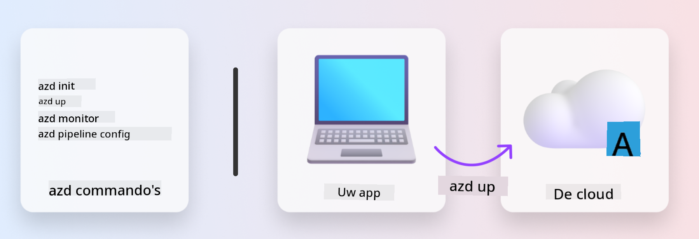
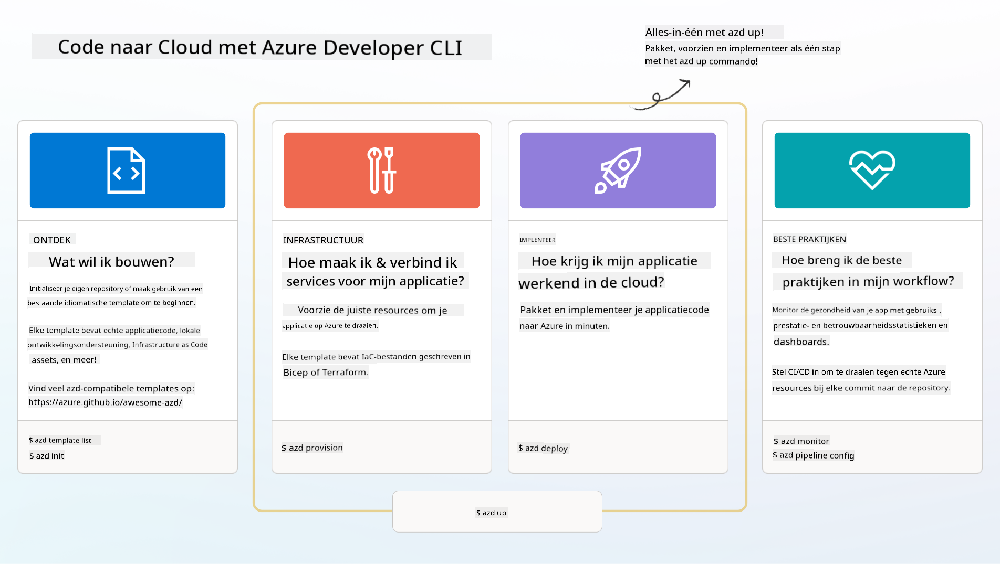

<!--
CO_OP_TRANSLATOR_METADATA:
{
  "original_hash": "06d6207eff634aefcaa41739490a5324",
  "translation_date": "2025-09-24T22:45:02+00:00",
  "source_file": "workshop/docs/instructions/1-Select-AI-Template.md",
  "language_code": "nl"
}
-->
# 1. Selecteer een Template

!!! tip "AAN HET EINDE VAN DEZE MODULE KUN JE"

    - [ ] Beschrijven wat AZD-templates zijn
    - [ ] AZD-templates voor AI ontdekken en gebruiken
    - [ ] Aan de slag gaan met de AI Agents-template
    - [ ] **Lab 1:** AZD Quickstart met GitHub Codespaces

---

## 1. Een Bouwersanalogie

Het bouwen van een moderne, bedrijfsgerichte AI-toepassing _vanaf nul_ kan overweldigend zijn. Het is een beetje alsof je je nieuwe huis helemaal zelf bouwt, steen voor steen. Ja, het kan! Maar het is niet de meest effectieve manier om het gewenste eindresultaat te bereiken!

In plaats daarvan beginnen we vaak met een bestaand _ontwerpplan_ en werken we samen met een architect om het aan te passen aan onze persoonlijke wensen. En dat is precies de aanpak die je moet volgen bij het bouwen van intelligente toepassingen. Eerst zoek je een goed ontwerp dat past bij jouw probleemgebied. Vervolgens werk je samen met een solution architect om de oplossing aan te passen en te ontwikkelen voor jouw specifieke scenario.

Maar waar vinden we deze ontwerpplannen? En hoe vinden we een architect die bereid is ons te leren hoe we deze plannen zelf kunnen aanpassen en implementeren? In deze workshop beantwoorden we die vragen door je kennis te laten maken met drie technologieën:

1. [Azure Developer CLI](https://aka.ms/azd) - een open-source tool die het ontwikkelproces versnelt, van lokale ontwikkeling (bouwen) tot cloudimplementatie (uitrollen).
1. [Azure AI Foundry Templates](https://ai.azure.com/templates) - gestandaardiseerde open-source repositories met voorbeeldcode, infrastructuur en configuratiebestanden voor het implementeren van een AI-oplossingsarchitectuur.
1. [GitHub Copilot Agent Mode](https://code.visualstudio.com/docs/copilot/chat/chat-agent-mode) - een code-assistent gebaseerd op Azure-kennis, die ons kan begeleiden bij het navigeren door de codebase en het aanbrengen van wijzigingen - met behulp van natuurlijke taal.

Met deze tools in handen kunnen we nu _de juiste template ontdekken_, _de template implementeren_ om te valideren dat het werkt, en _de template aanpassen_ aan onze specifieke scenario's. Laten we erin duiken en leren hoe dit werkt.

---

## 2. Azure Developer CLI

De [Azure Developer CLI](https://learn.microsoft.com/en-us/azure/developer/azure-developer-cli/) (of `azd`) is een open-source commandlinetool die je code-naar-cloud-reis kan versnellen met een set gebruiksvriendelijke commando's die consistent werken in je IDE (ontwikkeling) en CI/CD (devops) omgevingen.

Met `azd` kan je implementatieproces zo eenvoudig zijn als:

- `azd init` - Initialiseert een nieuw AI-project vanuit een bestaande AZD-template.
- `azd up` - Voorziet infrastructuur en implementeert je applicatie in één stap.
- `azd monitor` - Krijg realtime monitoring en diagnostiek voor je geïmplementeerde applicatie.
- `azd pipeline config` - Stel CI/CD-pipelines in om implementatie naar Azure te automatiseren.

**🎯 | OEFENING**: <br/> Verken de `azd` commandlinetool in je GitHub Codespaces-omgeving. Begin met het typen van dit commando om te zien wat de tool kan doen:

```bash title="" linenums="0"
azd help
```



---

## 3. De AZD Template

Om `azd` dit te laten bereiken, moet het weten welke infrastructuur moet worden voorzien, welke configuratie-instellingen moeten worden toegepast en welke applicatie moet worden geïmplementeerd. Hier komen [AZD-templates](https://learn.microsoft.com/en-us/azure/developer/azure-developer-cli/azd-templates?tabs=csharp) in beeld.

AZD-templates zijn open-source repositories die voorbeeldcode combineren met infrastructuur- en configuratiebestanden die nodig zijn voor het implementeren van de oplossingsarchitectuur. Door gebruik te maken van een _Infrastructure-as-Code_ (IaC)-benadering, maken ze het mogelijk om template-resource-definities en configuratie-instellingen versiebeheer te geven (net zoals de broncode van de app) - waardoor herbruikbare en consistente workflows worden gecreëerd voor gebruikers van dat project.

Bij het maken of hergebruiken van een AZD-template voor _jouw_ scenario, overweeg deze vragen:

1. Wat ben je aan het bouwen? → Is er een template die startcode heeft voor dat scenario?
1. Hoe is je oplossing geconfigureerd? → Is er een template die de benodigde resources bevat?
1. Hoe wordt je oplossing geïmplementeerd? → Denk aan `azd deploy` met pre/post-verwerkingshooks!
1. Hoe kun je het verder optimaliseren? → Denk aan ingebouwde monitoring en automatiseringspijplijnen!

**🎯 | OEFENING**: <br/> 
Bezoek de [Awesome AZD](https://azure.github.io/awesome-azd/) galerij en gebruik de filters om de 250+ templates te verkennen die momenteel beschikbaar zijn. Kijk of je er een kunt vinden die aansluit bij _jouw_ scenariovereisten.



---

## 4. AI App Templates

---

