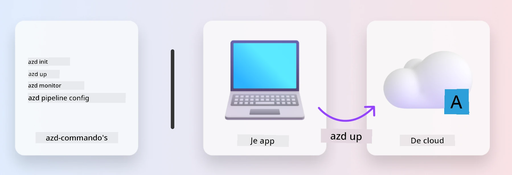
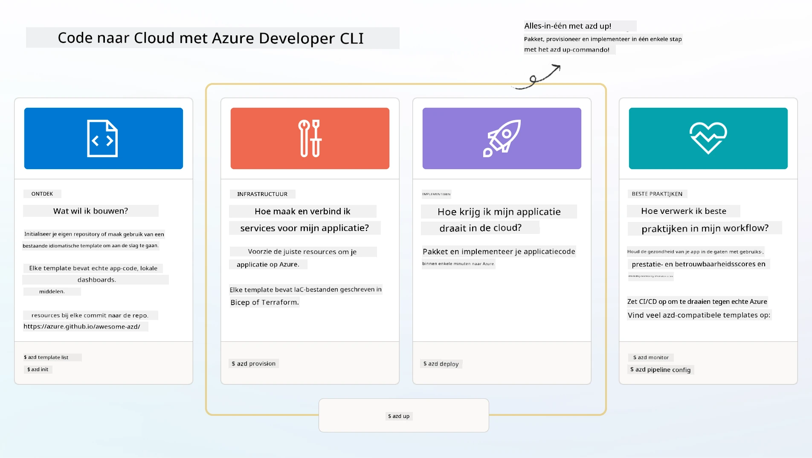

# 1. Selecteer een sjabloon

!!! tip "AAN HET EINDE VAN DEZE MODULE KUN JE"

    - [ ] Beschrijf wat AZD-sjablonen zijn
    - [ ] Ontdek en gebruik AZD-sjablonen voor AI
    - [ ] Aan de slag met het AI Agents-sjabloon
    - [ ] **Lab 1:** AZD Quickstart in Codespaces of een dev-container

---

## 1. Een bouwer-analogie

Het bouwen van een moderne, enterprise-klare AI-toepassing _from scratch_ kan ontmoedigend zijn. Het is een beetje alsof je je nieuw huis helemaal zelf baksteen voor baksteen bouwt. Ja, het kan gedaan worden! Maar het is niet de meest effectieve manier om het gewenste eindresultaat te bereiken!

In plaats daarvan beginnen we vaak met een bestaande _ontwerptekening_, en werken we samen met een architect om deze aan te passen aan onze persoonlijke eisen. En dat is precies de aanpak die je moet hanteren bij het bouwen van intelligente applicaties. Zoek eerst een goed ontwerparchitectuur die past bij je probleemgebied. Werk daarna met een solution architect samen om de oplossing aan te passen en te ontwikkelen voor jouw specifieke scenario.

Maar waar kunnen we deze ontwerptekeningen vinden? En hoe vinden we een architect die bereid is ons te leren hoe we deze blauwdrukken zelf kunnen aanpassen en implementeren? In deze workshop beantwoorden we die vragen door je kennis te laten maken met drie technologieën:

1. [Azure Developer CLI](https://aka.ms/azd) - een open-source tool die het ontwikkelaarsproces versnelt van lokale ontwikkeling (build) naar clouddeployments (ship).
1. [Microsoft Foundry Templates](https://ai.azure.com/templates) - gestandaardiseerde open-source repositories die voorbeeldcode, infrastructuur en configuratiebestanden bevatten voor het implementeren van een AI-oplossingsarchitectuur.
1. [GitHub Copilot Agent Mode](https://code.visualstudio.com/docs/copilot/chat/chat-agent-mode) - een codeeragent gebaseerd op Azure-kennis, die ons kan begeleiden bij het navigeren door de codebase en het aanbrengen van wijzigingen met natuurlijke taal.

Met deze tools in handen kunnen we nu het juiste sjabloon _ontdekken_, het _implementeren_ om te valideren dat het werkt, en het _aanpassen_ om aan onze specifieke scenario's te voldoen. Laten we erin duiken en leren hoe dit werkt.


---

## 2. Azure Developer CLI

De [Azure Developer CLI](https://learn.microsoft.com/en-us/azure/developer/azure-developer-cli/) (of `azd`) is een open-source opdrachtregeltool die je code-naar-cloud-reis kan versnellen met een set ontwikkelaarsvriendelijke commando's die consistent werken in je IDE (ontwikkeling) en CI/CD (devops) omgevingen.

Met `azd` kan je deployment-reis zo eenvoudig zijn als:

- `azd init` - Initialiseert een nieuw AI-project vanuit een bestaand AZD-sjabloon.
- `azd up` - Levert infrastructuur en implementeert je applicatie in één stap.
- `azd monitor` - Krijg realtime monitoring en diagnostiek voor je geïmplementeerde applicatie.
- `azd pipeline config` - Stel CI/CD-pipelines in om implementatie naar Azure te automatiseren.

**🎯 | OEFENING**: <br/> Verken de `azd` opdrachtregeltool in je huidige workshopomgeving nu. Dit kan GitHub Codespaces, een dev-container of een lokale clone met de vereiste dependencies zijn. Begin door dit commando te typen om te zien wat de tool kan doen:

```bash title="" linenums="0"
azd help
```



---

## 3. Het AZD-sjabloon

Om dit met `azd` mogelijk te maken, moet het weten welke infrastructuur het moet aanmaken, welke configuratie-instellingen gehandhaafd moeten worden en welke applicatie moet worden uitgerold. Dit is waar [AZD templates](https://learn.microsoft.com/en-us/azure/developer/azure-developer-cli/azd-templates?tabs=csharp) om de hoek komen.

AZD-sjablonen zijn open-source repositories die voorbeeldcode combineren met infrastructuur- en configuratiebestanden die nodig zijn om de oplossingsarchitectuur te implementeren.
Door een _Infrastructure-as-Code_ (IaC) benadering te gebruiken, stellen ze template resource-definities en configuratie-instellingen in staat om version-controlled te worden (net als de app-broncode) - waardoor herbruikbare en consistente workflows ontstaan voor gebruikers van dat project.

Wanneer je een AZD-sjabloon maakt of hergebruikt voor _jouw_ scenario, overweeg dan deze vragen:

1. Wat bouw je? → Is er een sjabloon dat startercode voor dat scenario bevat?
1. Hoe is je oplossing gearchitecteerd? → Is er een sjabloon met de benodigde resources?
1. Hoe wordt je oplossing uitgerold? → Denk aan `azd deploy` met pre/post-processing hooks!
1. Hoe kun je het verder optimaliseren? → Denk aan ingebouwde monitoring en automatiseringspijplijnen!

**🎯 | OEFENING**: <br/> 
Bezoek de [Awesome AZD](https://azure.github.io/awesome-azd/) galerij en gebruik de filters om de 250+ sjablonen te verkennen die momenteel beschikbaar zijn. Kijk of je er eentje kunt vinden die aansluit op _jouw_ scenario-eisen.



---

## 4. AI-appsjablonen

Voor AI-gestuurde applicaties biedt Microsoft gespecialiseerde sjablonen met **Microsoft Foundry** en **Foundry Agents**. Deze sjablonen versnellen je pad naar het bouwen van intelligente, productieklare applicaties.

### Microsoft Foundry & Foundry Agents-sjablonen

Selecteer een sjabloon hieronder om te implementeren. Elk sjabloon is beschikbaar op [Awesome AZD](https://azure.github.io/awesome-azd/) en kan worden geïnitieerd met één enkel commando.

| Template | Description | Deploy Command |
|----------|-------------|----------------|
| **[AI Chat with RAG](https://azure.github.io/awesome-azd/?tags=ai&tags=rag)** | Chattoepassing met Retrieval Augmented Generation met Microsoft Foundry | `azd init -t azure-samples/azure-search-openai-demo` |
| **[Foundry Agent Service Starter](https://azure.github.io/awesome-azd/?tags=ai&tags=agents)** | Bouw AI-agents met Foundry Agents voor autonome taakuitvoering | `azd init -t azure-samples/foundry-agent-service-starter` |
| **[Multi-Agent Orchestration](https://azure.github.io/awesome-azd/?tags=ai&tags=agents)** | Coördineer meerdere Foundry Agents voor complexe workflows | `azd init -t azure-samples/multi-agent-orchestration` |
| **[AI Document Intelligence](https://azure.github.io/awesome-azd/?tags=ai&tags=document)** | Extraheer en analyseer documenten met Microsoft Foundry-modellen | `azd init -t azure-samples/ai-document-processing` |
| **[Conversational AI Bot](https://azure.github.io/awesome-azd/?tags=ai&tags=bot)** | Bouw intelligente chatbots met Microsoft Foundry-integratie | `azd init -t azure-samples/ai-chat-protocol` |
| **[AI Image Generation](https://azure.github.io/awesome-azd/?tags=ai&tags=dalle)** | Genereer afbeeldingen met DALL-E via Microsoft Foundry | `azd init -t azure-samples/ai-image-generation` |
| **[Semantic Kernel Agent](https://azure.github.io/awesome-azd/?tags=ai&tags=semantic-kernel)** | AI-agents met Semantic Kernel en Foundry Agents | `azd init -t azure-samples/semantic-kernel-agent` |
| **[AutoGen Multi-Agent](https://azure.github.io/awesome-azd/?tags=ai&tags=autogen)** | Multi-agent systemen met het AutoGen-framework | `azd init -t azure-samples/autogen-multi-agent` |

### Snelstart

1. **Blader door sjablonen**: Bezoek [https://azure.github.io/awesome-azd/](https://azure.github.io/awesome-azd/) en filter op `AI`, `Agents`, of `Microsoft Foundry`
2. **Selecteer je sjabloon**: Kies er één die past bij je use case
3. **Initialiseer**: Voer het `azd init`-commando uit voor het gekozen sjabloon
4. **Implementeer**: Voer `azd up` uit om de infrastructuur te provisionen en te implementeren

**🎯 | OEFENING**: <br/>
Selecteer een van de bovenstaande sjablonen op basis van jouw scenario:

- **Een chatbot bouwen?** → Begin met **AI Chat with RAG** of **Conversational AI Bot**
- **Autonome agents nodig?** → Probeer **Foundry Agent Service Starter** of **Multi-Agent Orchestration**
- **Documenten verwerken?** → Gebruik **AI Document Intelligence**
- **Wil je AI-codeerhulp?** → Verken **Semantic Kernel Agent** of **AutoGen Multi-Agent**

```bash title="Example: Deploy the AI Chat with RAG template" linenums="0"
azd init -t azure-samples/azure-search-openai-demo
azd up
```

!!! info "Ontdek meer sjablonen"
    De [Awesome AZD Gallery](https://azure.github.io/awesome-azd/) bevat 250+ sjablonen. Gebruik de filters om sjablonen te vinden die overeenkomen met je specifieke vereisten voor taal, framework en Azure-diensten.

---

<!-- CO-OP TRANSLATOR DISCLAIMER START -->
**Disclaimer**:
Dit document is vertaald met behulp van de AI-vertalingsdienst [Co-op Translator](https://github.com/Azure/co-op-translator). Hoewel we streven naar nauwkeurigheid, houd er rekening mee dat geautomatiseerde vertalingen fouten of onnauwkeurigheden kunnen bevatten. Het originele document in de oorspronkelijke taal moet worden beschouwd als de gezaghebbende bron. Voor kritieke informatie wordt professionele menselijke vertaling aanbevolen. Wij zijn niet aansprakelijk voor enige misverstanden of verkeerde interpretaties die voortvloeien uit het gebruik van deze vertaling.
<!-- CO-OP TRANSLATOR DISCLAIMER END -->