# 2. Valideer een sjabloon

!!! tip "AAN HET EINDE VAN DEZE MODULE ZULT U IN STAAT ZIJN"

    - [ ] Analyseer de AI-oplossingsarchitectuur
    - [ ] Begrijp de AZD-implementatieworkflow
    - [ ] Gebruik GitHub Copilot voor hulp bij het gebruik van AZD
    - [ ] **Lab 2:** Implementeer & valideer de AI Agents-sjabloon

---


## 1. Inleiding

De [Azure Developer CLI](https://learn.microsoft.com/en-us/azure/developer/azure-developer-cli/) of `azd` is een open-source opdrachtregeltool die de ontwikkelaarworkflow vereenvoudigt bij het bouwen en implementeren van applicaties naar Azure. 

[AZD Templates](https://learn.microsoft.com/azure/developer/azure-developer-cli/azd-templates) zijn gestandaardiseerde repositories die voorbeeldapplicatiecode, _infrastructuur-als-code_ middelen en `azd` configuratiebestanden bevatten voor een samenhangende oplossingarchitectuur. Het provisionen van de infrastructuur wordt zo eenvoudig als een `azd provision`-opdracht - terwijl `azd up` je in staat stelt om infrastructuur te provisionen **en** je applicatie in één keer te implementeren!

Als resultaat kan het opstarten van je applicatieontwikkelingsproces zo simpel zijn als het vinden van het juiste _AZD Starter template_ dat het dichtst bij je applicatie- en infrastructuurbehoeften aansluit - en vervolgens de repository aanpassen om aan je scenariovereisten te voldoen.

Voordat we beginnen, laten we ervoor zorgen dat je de Azure Developer CLI hebt geïnstalleerd.

1. Open een VS Code-terminal en typ deze opdracht:

      ```bash title="" linenums="0"
      azd version
      ```

1. Je zou iets dergelijks moeten zien!

      ```bash title="" linenums="0"
      azd version 1.19.0 (commit b3d68cea969b2bfbaa7b7fa289424428edb93e97)
      ```

**Je bent nu klaar om een sjabloon te selecteren en te implementeren met azd**

---

## 2. Sjabloonselectie

Het Microsoft Foundry-platform wordt geleverd met een [set of recommended AZD templates](https://learn.microsoft.com/en-us/azure/ai-foundry/how-to/develop/ai-template-get-started) die populaire oplossingsscenario's dekken zoals _multi-agent workflow automation_ en _multi-modal content processing_. Je kunt deze sjablonen ook ontdekken door het Microsoft Foundry-portaal te bezoeken.

1. Visit [https://ai.azure.com/templates](https://ai.azure.com/templates)
1. Log in bij het Microsoft Foundry-portaal wanneer daarom wordt gevraagd - je ziet iets dergelijks.

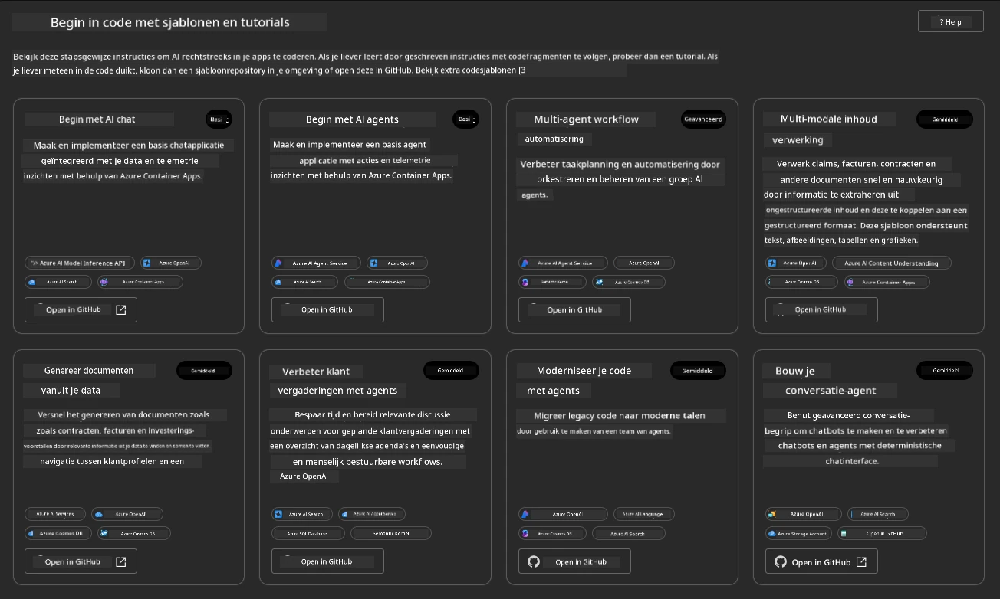


De **Basic** opties zijn je start-sjablonen:

1. [ ] [Get Started with AI Chat](https://github.com/Azure-Samples/get-started-with-ai-chat) dat een basis-chatapplicatie implementeert _met jouw data_ naar Azure Container Apps. Gebruik dit om een basis AI-chatbotscenario te verkennen.
1. [X] [Get Started with AI Agents](https://github.com/Azure-Samples/get-started-with-ai-agents) dat ook een standaard AI Agent implementeert (met de Foundry Agents). Gebruik dit om vertrouwd te raken met agentachtige AI-oplossingen die tools en modellen omvatten.

Bezoek de tweede link in een nieuw browsertabblad (of klik op `Open in GitHub` voor het bijbehorende kaartje). Je zou de repository voor dit AZD Template moeten zien. Neem even de tijd om de README te verkennen. De applicatiearchitectuur ziet er als volgt uit:

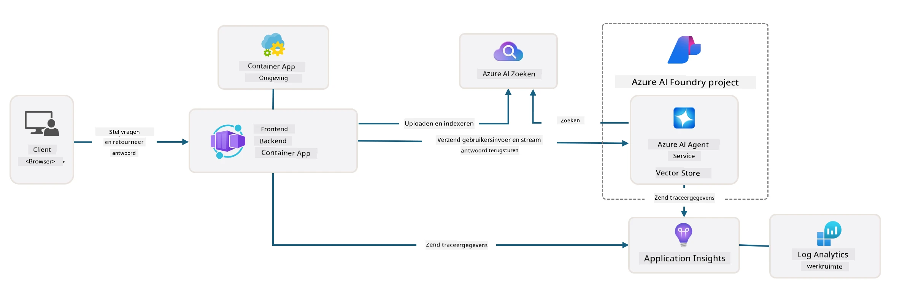

---

## 3. Sjabloonactivering

Laten we proberen dit sjabloon te implementeren en ervoor zorgen dat het geldig is. We volgen de richtlijnen in de [Getting Started](https://github.com/Azure-Samples/get-started-with-ai-agents?tab=readme-ov-file#getting-started) sectie.

1. Klik op [deze link](https://github.com/codespaces/new/Azure-Samples/get-started-with-ai-agents) - bevestig de standaardactie om `Create codespace`
1. Dit opent een nieuw browsertabblad - wacht tot de GitHub Codespaces-sessie volledig is geladen
1. Open de VS Code-terminal in Codespaces - typ de volgende opdracht:

   ```bash title="" linenums="0"
   azd up
   ```

Completeer de workflowstappen die dit zal activeren:

1. Je wordt gevraagd om in te loggen bij Azure - volg de instructies om te authenticeren
1. Voer een unieke omgevingsnaam voor jezelf in - bijvoorbeeld, ik gebruikte `nitya-mshack-azd`
1. Dit zal een `.azure/` map aanmaken - je ziet een submap met de env-naam
1. Je wordt gevraagd een abonnementsnaam te selecteren - selecteer de standaard
1. Je wordt gevraagd om een locatie - gebruik `East US 2`

Wacht nu tot het provisioningproces is voltooid. **Dit duurt 10-15 minuten**

1. Wanneer het klaar is, toont je console een SUCCESS-bericht zoals dit:
      ```bash title="" linenums="0"
      SUCCESS: Your up workflow to provision and deploy to Azure completed in 10 minutes 17 seconds.
      ```
1. Je Azure Portal zal nu een geprovisioneerde resourcegroep met die env-naam hebben:

      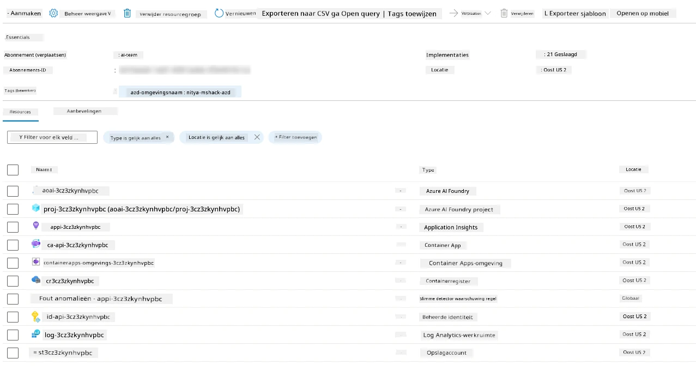

1. **Je bent nu klaar om de geïmplementeerde infrastructuur en applicatie te valideren**.

---

## 4. Sjabloonvalidatie

1. Bezoek de Azure Portal [Resource Groups](https://portal.azure.com/#browse/resourcegroups) pagina - log in wanneer daarom wordt gevraagd
1. Klik op de RG voor je omgevingsnaam - je ziet de bovenstaande pagina

      - klik op de Azure Container Apps-resource
      - klik op de Applicatie-URL in de _Essentials_ sectie (rechtsboven)

1. Je zou een gehoste applicatie front-end UI moeten zien zoals deze:

   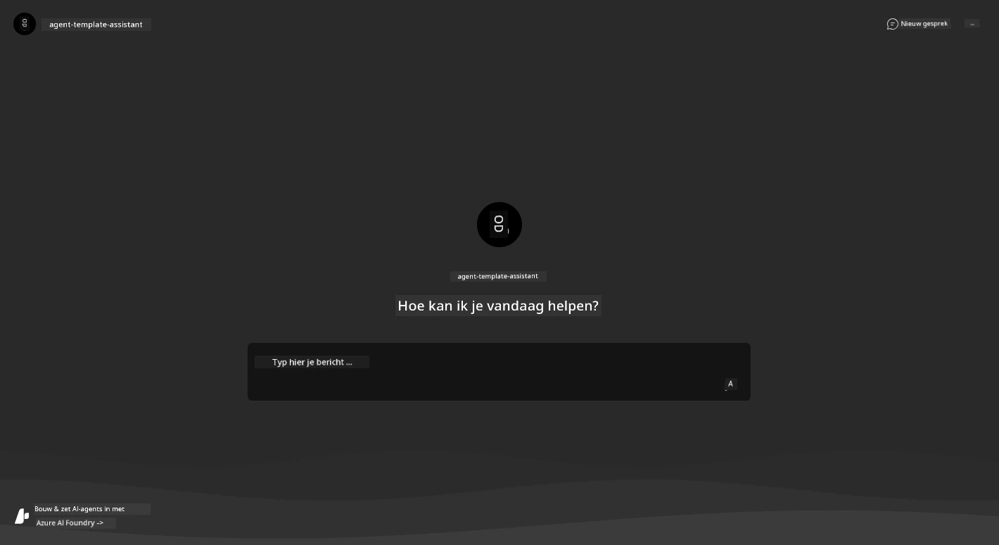

1. Probeer een paar [voorbeeldvragen](https://github.com/Azure-Samples/get-started-with-ai-agents/blob/main/docs/sample_questions.md) te stellen

      1. Vraag: ```Wat is de hoofdstad van Frankrijk?``` 
      1. Vraag: ```Wat is de beste tent onder $200 voor twee personen, en welke kenmerken heeft deze?```

1. Je zou antwoorden moeten krijgen die vergelijkbaar zijn met wat hieronder wordt getoond. _Maar hoe werkt dit?_

      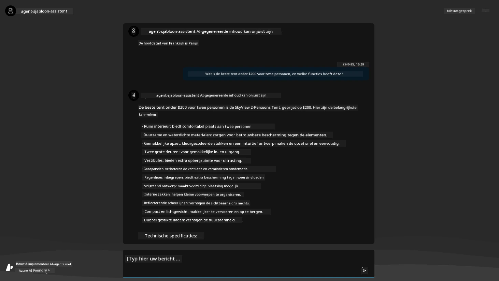

---

## 5. Agentvalidatie

De Azure Container App implementeert een endpoint dat verbinding maakt met de AI Agent die is geprovisioneerd in het Microsoft Foundry-project voor dit sjabloon. Laten we eens kijken wat dat betekent.

1. Ga terug naar de Azure Portal _Overview_ pagina voor je resourcegroep

1. Klik op de `Microsoft Foundry` resource in die lijst

1. Je zou dit moeten zien. Klik op de `Ga naar Microsoft Foundry-portal` knop. 
   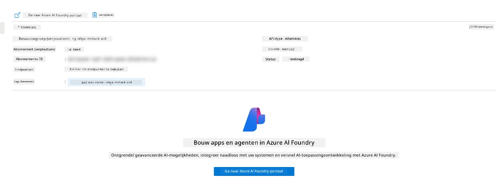

1. Je zou de Foundry Project-pagina voor je AI-applicatie moeten zien
   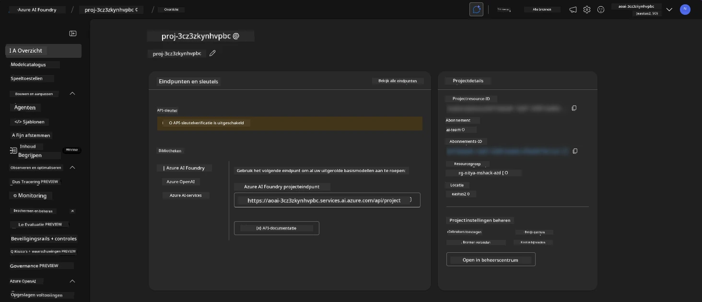

1. Klik op `Agents` - je ziet de standaard Agent die in je project is geprovisioneerd
   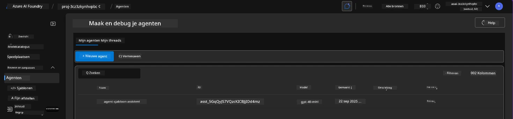

1. Selecteer deze - en je ziet de Agent-details. Let op het volgende:

      - De agent gebruikt standaard File Search (altijd)
      - De agent `Knowledge` geeft aan dat er 32 bestanden zijn geüpload (voor file search)
      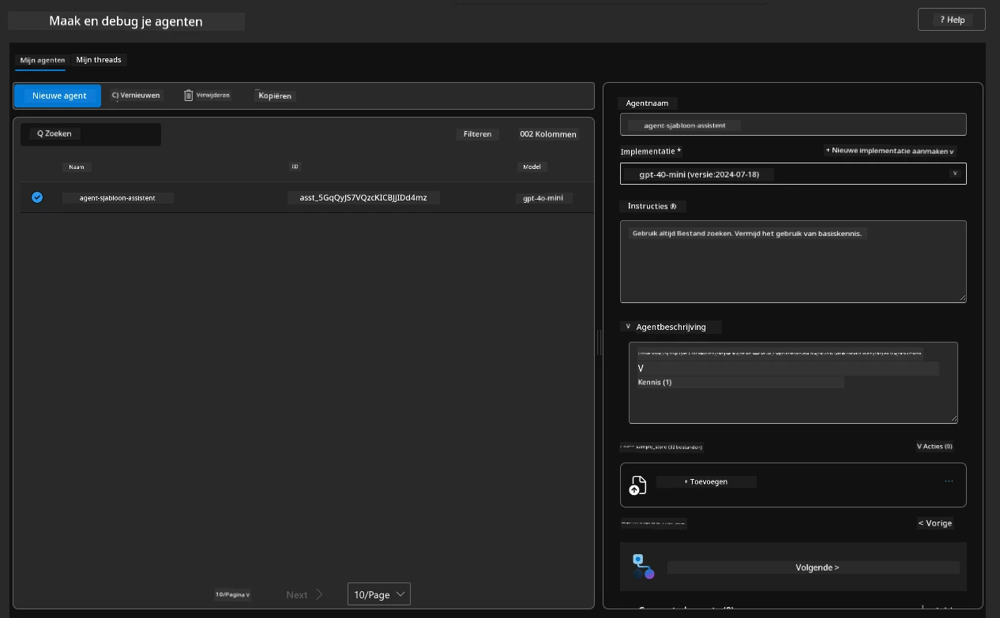

1. Zoek de optie `Data+indexes` in het linkermenu en klik voor details. 

      - Je zou de 32 gegevensbestanden moeten zien die zijn geüpload voor kennis.
      - Deze komen overeen met de 12 klantbestanden en 20 productbestanden onder `src/files` 
      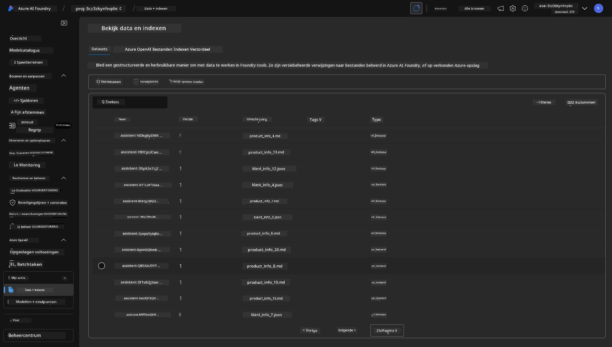

**Je hebt de werking van de Agent gevalideerd!** 

1. De agentantwoorden zijn geworteld in de kennis in die bestanden. 
1. Je kunt nu vragen stellen met betrekking tot die gegevens en gegronde antwoorden krijgen.
1. Voorbeeld: `customer_info_10.json` beschrijft de 3 aankopen gedaan door "Amanda Perez"

Ga terug naar het browsertabblad met het Container App-endpoint en vraag: `Welke producten bezit Amanda Perez?`. Je zou iets dergelijks moeten zien:

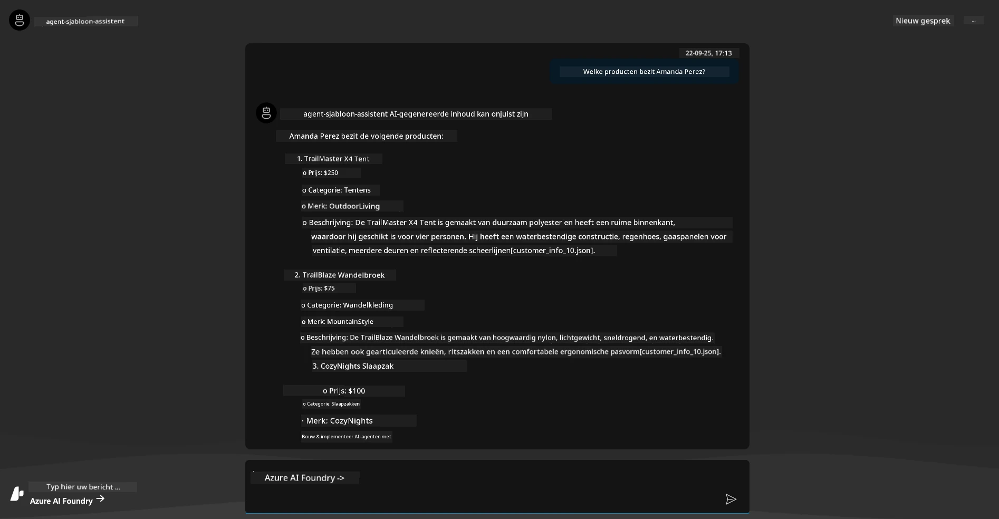

---

## 6. Agent-speelplaats

Laten we wat meer inzicht krijgen in de mogelijkheden van Microsoft Foundry, door de Agent uit te proberen in de Agents Playground. 

1. Ga terug naar de `Agents` pagina in Microsoft Foundry - selecteer de standaardagent
1. Klik op de optie `Try in Playground` - je zou een Playground UI zoals deze moeten krijgen
1. Stel dezelfde vraag: `Welke producten bezit Amanda Perez?`

    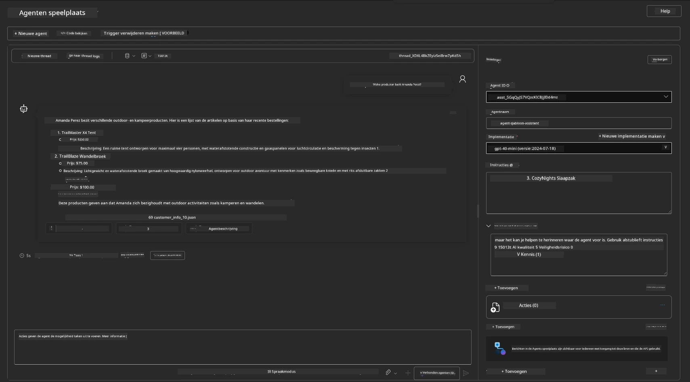

Je krijgt hetzelfde (of een vergelijkbaar) antwoord - maar je krijgt ook extra informatie die je kunt gebruiken om de kwaliteit, kosten en prestaties van je agentachtige app te begrijpen. Bijvoorbeeld:

1. Let op dat het antwoord verwijst naar gegevensbestanden die zijn gebruikt om het antwoord te "onderbouwen"
1. Beweeg de muis over een van deze bestandslabels - komen de gegevens overeen met je vraag en het weergegeven antwoord?

Je ziet ook een _statistieken_ rij onder het antwoord. 

1. Beweeg de muis over een metriek - bijv. Veiligheid. Je ziet iets dergelijks
1. Komt de beoordeelde waardering overeen met je gevoel voor het veiligheidsniveau van het antwoord?

      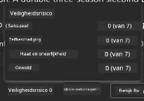

---

## 7. Ingebouwde observeerbaarheid

Observeerbaarheid gaat over het instrumenteren van je applicatie om gegevens te genereren die kunnen worden gebruikt om de werking te begrijpen, te debuggen en te optimaliseren. Om hier een gevoel voor te krijgen:

1. Klik op de `View Run Info` knop - je zou dit beeld moeten zien. Dit is een voorbeeld van [Agent-tracering](https://learn.microsoft.com/en-us/azure/ai-foundry/how-to/develop/trace-agents-sdk#view-trace-results-in-the-azure-ai-foundry-agents-playground) in actie. _Je kunt deze weergave ook krijgen door Thread Logs in het hoofdmenu te klikken_.

   - Krijg een beeld van de uitvoerstappen en tools die door de agent zijn ingezet
   - Begrijp het totale aantal Tokens (vs. het gebruik van output-tokens) voor het antwoord
   - Begrijp de latentie en waar tijd wordt besteed tijdens de uitvoering

      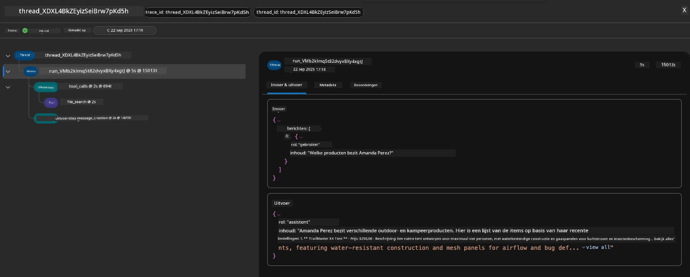

1. Klik op het tabblad `Metadata` om aanvullende attributen voor de run te zien, die nuttige context kunnen bieden voor het debuggen van problemen later.   

      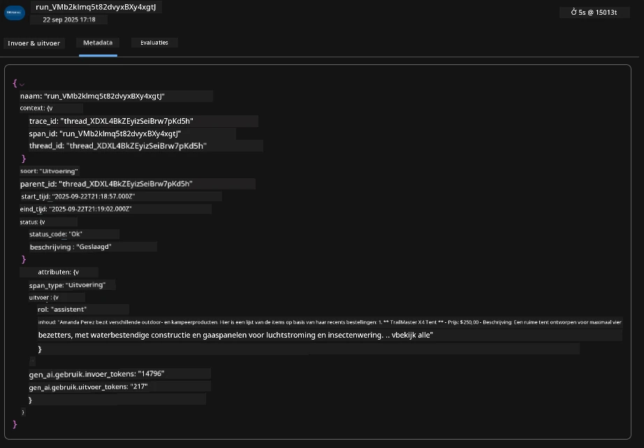


1. Klik op het tabblad `Evaluations` om automatische beoordelingen van het agentantwoord te zien. Deze omvatten veiligheidsevaluaties (bijv. Zelfbeschadiging) en agent-specifieke evaluaties (bijv. Intentie-resolutie, Taak-naleving).

      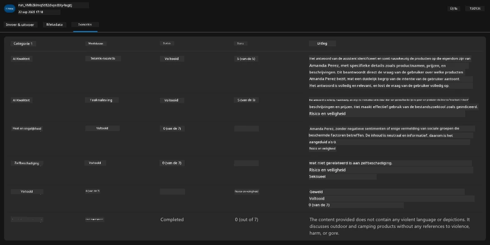

1. Last but not least, klik op het tabblad `Monitoring` in het zijmenu.

      - Selecteer het tabblad `Resource usage` op de weergegeven pagina - en bekijk de metrics.
      - Volg het applicatiegebruik in termen van kosten (tokens) en belasting (verzoeken).
      - Volg applicatielatentie tot de eerste byte (invoerverwerking) en de laatste byte (uitvoer).

      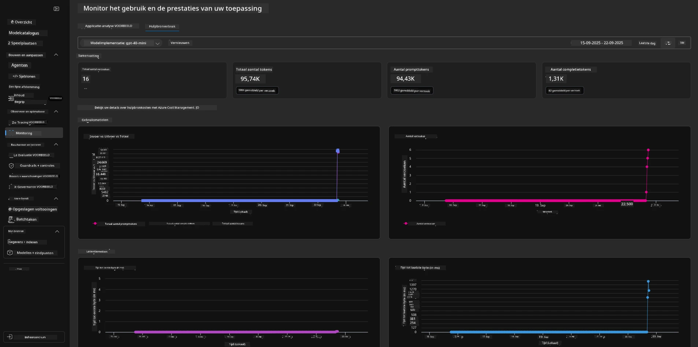

---

## 8. Omgevingsvariabelen

Tot nu toe hebben we de implementatie in de browser doorlopen - en gevalideerd dat onze infrastructuur is geprovisioneerd en de applicatie operationeel is. Maar om met de applicatie _code-first_ te werken, moeten we onze lokale ontwikkelomgeving configureren met de relevante variabelen die nodig zijn om met deze resources te werken. Met `azd` wordt dit eenvoudig gemaakt.

1. De Azure Developer CLI [gebruikt omgevingsvariabelen](https://learn.microsoft.com/en-us/azure/developer/azure-developer-cli/manage-environment-variables?tabs=bash) om configuratie-instellingen voor de applicatie-implementaties op te slaan en te beheren.

1. Omgevingsvariabelen worden opgeslagen in `.azure/<env-name>/.env` - dit scopeert ze naar de `env-name` omgeving die tijdens de implementatie is gebruikt en helpt je om omgevingen te isoleren tussen verschillende implementatiedoelen in dezelfde repo.

1. Omgevingsvariabelen worden automatisch geladen door het `azd`-commando telkens wanneer het een specifieke opdracht uitvoert (bijv. `azd up`). Let op dat `azd` niet automatisch _OS-level_ omgevingsvariabelen leest (bijv. ingesteld in de shell) - gebruik in plaats daarvan `azd set env` en `azd get env` om informatie over te dragen binnen scripts.


Laten we een paar opdrachten proberen:

1. Haal alle omgevingsvariabelen op die voor `azd` in deze omgeving zijn ingesteld:

      ```bash title="" linenums="0"
      azd env get-values
      ```
      
      Je ziet iets dergelijks:

      ```bash title="" linenums="0"
      AZURE_AI_AGENT_DEPLOYMENT_NAME="gpt-4o-mini"
      AZURE_AI_AGENT_NAME="agent-template-assistant"
      AZURE_AI_EMBED_DEPLOYMENT_NAME="text-embedding-3-small"
      AZURE_AI_EMBED_DIMENSIONS=100
      ...
      ```

1. Haal een specifieke waarde op - bijv. ik wil weten of we de waarde `AZURE_AI_AGENT_MODEL_NAME` hebben ingesteld

      ```bash title="" linenums="0"
      azd env get-value AZURE_AI_AGENT_MODEL_NAME 
      ```
      
      Je ziet iets dergelijks - deze was niet standaard ingesteld!

      ```bash title="" linenums="0"
      ERROR: key 'AZURE_AI_AGENT_MODEL_NAME' not found in the environment values
      ```

1. Stel een nieuwe omgevingsvariabele in voor `azd`. Hier werken we de agent-modelnaam bij. _Opmerking: eventuele wijzigingen worden onmiddellijk weerspiegeld in het `.azure/<env-name>/.env`-bestand._

      ```bash title="" linenums="0"
      azd env set AZURE_AI_AGENT_MODEL_NAME gpt-4.1
      azd env set AZURE_AI_AGENT_MODEL_VERSION 2025-04-14
      azd env set AZURE_AI_AGENT_DEPLOYMENT_CAPACITY 150
      ```

      Nu zouden we moeten zien dat de waarde is ingesteld:

      ```bash title="" linenums="0"
      azd env get-value AZURE_AI_AGENT_MODEL_NAME 
      ```

1. Merk op dat sommige resources persistent zijn (bijv. modelimplementaties) en meer vereisen dan alleen een `azd up` om de herimplementatie af te dwingen. Laten we proberen de oorspronkelijke implementatie af te breken en opnieuw te implementeren met gewijzigde omgevingsvariabelen.

1. **Refresh** Als je eerder infrastructuur hebt geïmplementeerd met een azd-sjabloon - kun je de status van je lokale omgevingsvariabelen verversen op basis van de huidige staat van je Azure-implementatie met behulp van deze opdracht:

      ```bash title="" linenums="0"
      azd env refresh
      ```

      Dit is een krachtige manier om omgevingsvariabelen te _synchroniseren_ tussen twee of meer lokale ontwikkelomgevingen (bijv. een team met meerdere ontwikkelaars) - waardoor de uitgerolde infrastructuur als de grondwaarheid dient voor de status van de omgevingsvariabelen. Teamleden hoeven alleen de variabelen te _verversen_ om weer gesynchroniseerd te raken.

---

## 9. Gefeliciteerd 🏆

Je hebt zojuist een end-to-end workflow voltooid waarin je:

- [X] De AZD-sjabloon geselecteerd die je wilt gebruiken
- [X] De sjabloon gestart met GitHub Codespaces 
- [X] De sjabloon uitgerold en geverifieerd dat deze werkt

---

<!-- CO-OP TRANSLATOR DISCLAIMER START -->
**Disclaimer**:
Dit document is vertaald met behulp van de AI-vertalingsservice [Co-op Translator](https://github.com/Azure/co-op-translator). Hoewel we naar nauwkeurigheid streven, houd er rekening mee dat geautomatiseerde vertalingen fouten of onnauwkeurigheden kunnen bevatten. Het originele document in de oorspronkelijke taal geldt als de gezaghebbende bron. Voor belangrijke informatie wordt professionele menselijke vertaling aanbevolen. Wij zijn niet aansprakelijk voor misverstanden of verkeerde interpretaties die voortvloeien uit het gebruik van deze vertaling.
<!-- CO-OP TRANSLATOR DISCLAIMER END -->