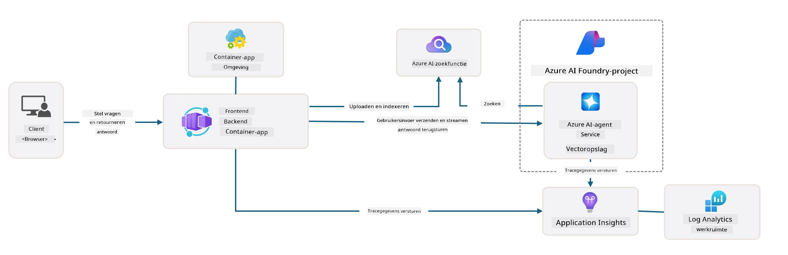

# 3. Een Template Ontleden

!!! tip "AAN HET EINDE VAN DEZE MODULE KUN JE"

    - [ ] Item
    - [ ] Item
    - [ ] Item
    - [ ] **Lab 3:** 

---

Met AZD-templates en de Azure Developer CLI (`azd`) kunnen we snel onze AI-ontwikkelingsreis starten met gestandaardiseerde repositories die voorbeeldcode, infrastructuur en configuratiebestanden bieden - in de vorm van een kant-en-klaar _starter_ project.

**Maar nu moeten we de projectstructuur en codebase begrijpen - en in staat zijn om de AZD-template aan te passen - zonder enige voorkennis of begrip van AZD!**

---

## 1. GitHub Copilot Activeren

### 1.1 Installeer GitHub Copilot Chat

Het is tijd om [GitHub Copilot met Agent Mode](https://code.visualstudio.com/docs/copilot/chat/chat-agent-mode) te verkennen. Nu kunnen we natuurlijke taal gebruiken om onze taak op hoog niveau te beschrijven en hulp te krijgen bij de uitvoering. Voor dit lab gebruiken we het [Copilot Free plan](https://github.com/github-copilot/signup), dat een maandelijkse limiet heeft voor voltooiingen en chatinteracties.

De extensie kan worden geïnstalleerd vanuit de marketplace, maar zou al beschikbaar moeten zijn in je Codespaces-omgeving. _Klik op `Open Chat` vanuit het Copilot-icoon dropdown-menu - en typ een prompt zoals `What can you do?`_ - je wordt mogelijk gevraagd om in te loggen. **GitHub Copilot Chat is klaar voor gebruik**.

### 1.2 Installeer MCP Servers

Om Agent Mode effectief te maken, heeft het toegang nodig tot de juiste tools om kennis op te halen of acties uit te voeren. Hier komen MCP-servers van pas. We configureren de volgende servers:

1. [Azure MCP Server](../../../../../workshop/docs/instructions)
1. [Microsoft Docs MCP Server](../../../../../workshop/docs/instructions)

Om deze te activeren:

1. Maak een bestand genaamd `.vscode/mcp.json` als het nog niet bestaat
1. Kopieer het volgende in dat bestand - en start de servers!
   ```json title=".vscode/mcp.json"
   {
      "servers": {
         "Azure MCP Server": {
            "command": "npx",
            "args": [
            "-y",
            "@azure/mcp@latest",
            "server",
            "start"
            ]
         },
         "microsoft.docs.mcp": {
            "type": "http",
            "url": "https://learn.microsoft.com/api/mcp"
         }
      }
   }
   ```

??? warning "Je kunt een foutmelding krijgen dat `npx` niet is geïnstalleerd (klik om de oplossing te bekijken)"

      Om dit op te lossen, open je het bestand `.devcontainer/devcontainer.json` en voeg je deze regel toe aan de features-sectie. Bouw vervolgens de container opnieuw. Je zou nu `npx` geïnstalleerd moeten hebben.

      ```title="" linenums="0"
         "features": {
            "ghcr.io/devcontainers/features/node:1": {},
            ...
         },
      ```

---

### 1.3 Test GitHub Copilot Chat

**Gebruik eerst `az login` om te authenticeren met Azure vanuit de VS Code command line.**

Je zou nu de status van je Azure-abonnement moeten kunnen opvragen en vragen kunnen stellen over geïmplementeerde resources of configuratie. Probeer deze prompts:

1. `List my Azure resource groups`
1. `#foundry list my current deployments`

Je kunt ook vragen stellen over Azure-documentatie en antwoorden krijgen die gebaseerd zijn op de Microsoft Docs MCP-server. Probeer deze prompts:

1. `#microsoft_docs_search What is Azure Developer CLI?`
1. `#microsoft_docs_search Show me a Python tutorial to chat with deployed model`

Of je kunt vragen om codefragmenten om een taak te voltooien. Probeer deze prompt:

1. `Give me a Python code example that uses AAD for an interactive chat client`

In `Ask` mode krijg je code die je kunt kopiëren en plakken om uit te proberen. In `Agent` mode kan het een stap verder gaan en de relevante resources voor je creëren - inclusief setup-scripts en documentatie - om je te helpen die taak uit te voeren.

**Je bent nu klaar om de template repository te verkennen**

---

## 2. Architectuur Ontleden

??? prompt "ASK: Leg de applicatiearchitectuur uit in docs/images/architecture.png in 1 alinea"

      Deze applicatie is een AI-gestuurde chatapplicatie gebouwd op Azure die een moderne agent-gebaseerde architectuur demonstreert. De oplossing draait om een Azure Container App die de hoofdapplicatiecode host, die gebruikersinvoer verwerkt en intelligente antwoorden genereert via een AI-agent. 
      
      De architectuur maakt gebruik van het Azure AI Foundry Project als basis voor AI-mogelijkheden, met verbindingen naar Azure AI Services die de onderliggende taalmodellen (zoals GPT-4o-mini) en agentfunctionaliteit bieden. Gebruikersinteracties verlopen via een React-gebaseerde frontend naar een FastAPI-backend die communiceert met de AI-agentservice voor het genereren van contextuele antwoorden. 
      
      Het systeem bevat kennisophaalcapaciteiten via bestandzoekopdrachten of de Azure AI Search-service, waardoor de agent informatie uit geüploade documenten kan ophalen en citeren. Voor operationele uitmuntendheid bevat de architectuur uitgebreide monitoring via Application Insights en Log Analytics Workspace voor tracing, logging en prestatieoptimalisatie. 
      
      Azure Storage biedt blobopslag voor applicatiegegevens en bestandsuploads, terwijl Managed Identity zorgt voor veilige toegang tussen Azure-resources zonder inloggegevens op te slaan. De hele oplossing is ontworpen voor schaalbaarheid en onderhoudbaarheid, waarbij de container-applicatie automatisch schaalt op basis van de vraag en ingebouwde beveiliging, monitoring en CI/CD-mogelijkheden biedt via het beheerde dienstenecosysteem van Azure.



---

## 3. Repository Structuur

!!! prompt "ASK: Leg de template mapstructuur uit. Begin met een visueel hiërarchisch diagram."

??? info "ANTWOORD: Visueel Hiërarchisch Diagram"

      ```bash title="" 
      get-started-with-ai-agents/
      ├── 📋 Configuratie & Setup
      │   ├── azure.yaml                    # Azure Developer CLI configuratie
      │   ├── docker-compose.yaml           # Lokale ontwikkelingscontainers
      │   ├── pyproject.toml                # Python projectconfiguratie
      │   ├── requirements-dev.txt          # Ontwikkelingsafhankelijkheden
      │   └── .devcontainer/                # VS Code dev container setup
      │
      ├── 🏗️ Infrastructuur (infra/)
      │   ├── main.bicep                    # Hoofd infrastructuurtemplate
      │   ├── api.bicep                     # API-specifieke resources
      │   ├── main.parameters.json          # Infrastructuurparameters
      │   └── core/                         # Modulaire infrastructuurcomponenten
      │       ├── ai/                       # AI-serviceconfiguraties
      │       ├── host/                     # Hostinginfrastructuur
      │       ├── monitor/                  # Monitoring en logging
      │       ├── search/                   # Azure AI Search setup
      │       ├── security/                 # Beveiliging en identiteit
      │       └── storage/                  # Opslagaccountconfiguraties
      │
      ├── 💻 Applicatiebron (src/)
      │   ├── api/                          # Backend API
      │   │   ├── main.py                   # FastAPI applicatie-entry
      │   │   ├── routes.py                 # API route-definities
      │   │   ├── search_index_manager.py   # Zoekfunctionaliteit
      │   │   ├── data/                     # API data handling
      │   │   ├── static/                   # Statische webassets
      │   │   └── templates/                # HTML templates
      │   ├── frontend/                     # React/TypeScript frontend
      │   │   ├── package.json              # Node.js afhankelijkheden
      │   │   ├── vite.config.ts            # Vite build configuratie
      │   │   └── src/                      # Frontend broncode
      │   ├── data/                         # Voorbeeld databestanden
      │   │   └── embeddings.csv            # Vooraf berekende embeddings
      │   ├── files/                        # Kennisbankbestanden
      │   │   ├── customer_info_*.json      # Voorbeeld klantgegevens
      │   │   └── product_info_*.md         # Productdocumentatie
      │   ├── Dockerfile                    # Containerconfiguratie
      │   └── requirements.txt              # Python afhankelijkheden
      │
      ├── 🔧 Automatisering & Scripts (scripts/)
      │   ├── postdeploy.sh/.ps1           # Post-deployment setup
      │   ├── setup_credential.sh/.ps1     # Credential configuratie
      │   ├── validate_env_vars.sh/.ps1    # Omgevingsvalidatie
      │   └── resolve_model_quota.sh/.ps1  # Modelquotabeheer
      │
      ├── 🧪 Testen & Evaluatie
      │   ├── tests/                        # Unit- en integratietests
      │   │   └── test_search_index_manager.py
      │   ├── evals/                        # Agent evaluatiekader
      │   │   ├── evaluate.py               # Evaluatie runner
      │   │   ├── eval-queries.json         # Testqueries
      │   │   └── eval-action-data-path.json
      │   ├── sandbox/                      # Ontwikkelingsspeelplaats
      │   │   ├── 1-quickstart.py           # Voorbeelden om te starten
      │   │   └── aad-interactive-chat.py   # Authenticatievoorbeelden
      │   └── airedteaming/                 # AI veiligheidsevaluatie
      │       └── ai_redteaming.py          # Red team testen
      │
      ├── 📚 Documentatie (docs/)
      │   ├── deployment.md                 # Deployment gids
      │   ├── local_development.md          # Lokale setup instructies
      │   ├── troubleshooting.md            # Veelvoorkomende problemen & oplossingen
      │   ├── azure_account_setup.md        # Azure vereisten
      │   └── images/                       # Documentatie assets
      │
      └── 📄 Project Metadata
         ├── README.md                     # Projectoverzicht
         ├── CODE_OF_CONDUCT.md           # Gemeenschapsrichtlijnen
         ├── CONTRIBUTING.md              # Bijdragegids
         ├── LICENSE                      # Licentievoorwaarden
         └── next-steps.md                # Post-deployment begeleiding
      ```

### 3.1 Kernapplicatie Architectuur

Deze template volgt een **full-stack webapplicatie** patroon met:

- **Backend**: Python FastAPI met Azure AI-integratie
- **Frontend**: TypeScript/React met Vite build systeem
- **Infrastructuur**: Azure Bicep templates voor cloud resources
- **Containerisatie**: Docker voor consistente implementatie

### 3.2 Infra As Code (bicep)

De infrastructuurlaag gebruikt **Azure Bicep** templates die modulair zijn georganiseerd:

   - **`main.bicep`**: Orkestreert alle Azure-resources
   - **`core/` modules**: Herbruikbare componenten voor verschillende services
      - AI-services (Azure OpenAI, AI Search)
      - Containerhosting (Azure Container Apps)
      - Monitoring (Application Insights, Log Analytics)
      - Beveiliging (Key Vault, Managed Identity)

### 3.3 Applicatiebron (`src/`)

**Backend API (`src/api/`)**:

- REST API gebaseerd op FastAPI
- Integratie met Azure AI Agent-service
- Beheer van zoekindexen voor kennisophaling
- Mogelijkheden voor bestandupload en -verwerking

**Frontend (`src/frontend/`)**:

- Moderne React/TypeScript SPA
- Vite voor snelle ontwikkeling en geoptimaliseerde builds
- Chatinterface voor agentinteracties

**Kennisbank (`src/files/`)**:

- Voorbeeld klant- en productgegevens
- Demonstreert bestand-gebaseerde kennisophaling
- JSON- en Markdown-formaatvoorbeelden

### 3.4 DevOps & Automatisering

**Scripts (`scripts/`)**:

- Cross-platform PowerShell- en Bash-scripts
- Validatie en setup van de omgeving
- Post-deployment configuratie
- Beheer van modelquota

**Azure Developer CLI Integratie**:

- `azure.yaml` configuratie voor `azd` workflows
- Geautomatiseerde provisioning en implementatie
- Beheer van omgevingsvariabelen

### 3.5 Testen & Kwaliteitsborging

**Evaluatiekader (`evals/`)**:

- Evaluatie van agentprestaties
- Testen van query-responskwaliteit
- Geautomatiseerde beoordelingspipeline

**AI Veiligheid (`airedteaming/`)**:

- Red team testen voor AI veiligheid
- Scannen op beveiligingskwetsbaarheden
- Verantwoordelijke AI-praktijken

---

## 4. Gefeliciteerd 🏆

Je hebt succesvol GitHub Copilot Chat met MCP-servers gebruikt om de repository te verkennen.

- [X] GitHub Copilot voor Azure geactiveerd
- [X] De applicatiearchitectuur begrepen
- [X] De AZD-template structuur verkend

Dit geeft je een idee van de _infrastructure as code_ assets voor deze template. Vervolgens gaan we kijken naar het configuratiebestand voor AZD.

---

