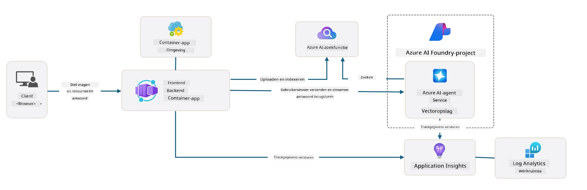

# 3. Sjabloon ontleden

!!! tip "AAN HET EINDE VAN DEZE MODULE ZUL JE IN STAAT ZIJN OM"

    - [ ] GitHub Copilot activeren met MCP-servers voor Azure-ondersteuning
    - [ ] De mapstructuur en componenten van het AZD-sjabloon begrijpen
    - [ ] Infrastructuur-als-code (Bicep) organisatiepatronen verkennen
    - [ ] **Lab 3:** Gebruik GitHub Copilot om de repository-architectuur te verkennen en te begrijpen 

---


Met AZD-templates en de Azure Developer CLI (`azd`) kunnen we snel onze AI-ontwikkelreis starten met gestandaardiseerde repositories die voorbeeldcode, infrastructuur en configuratiebestanden bieden - in de vorm van een kant-en-klaar inzetbaar _starter_ project.

**Maar nu moeten we de projectstructuur en codebasis begrijpen - en in staat zijn het AZD-sjabloon aan te passen - zonder enige voorkennis of begrip van AZD!**

---

## 1. GitHub Copilot activeren

### 1.1 Installeer GitHub Copilot Chat

Het is tijd om [GitHub Copilot with Agent Mode](https://code.visualstudio.com/docs/copilot/chat/chat-agent-mode) te verkennen. Nu kunnen we natuurlijke taal gebruiken om onze taak op hoog niveau te beschrijven en hulp te krijgen bij de uitvoering. Voor dit lab gebruiken we het [Copilot Free plan](https://github.com/github-copilot/signup) dat een maandelijkse limiet heeft voor completions en chatinteracties.

De extensie kan vanaf de marketplace worden geïnstalleerd, maar zou al beschikbaar moeten zijn in je Codespaces-omgeving. _Klik op `Open Chat` in het Copilot-pictogram (drop-down) en typ een prompt zoals `What can you do?`_ - je kunt worden gevraagd om in te loggen. **GitHub Copilot Chat is klaar voor gebruik**.

### 1.2. MCP-servers installeren

Om Agent-modus effectief te laten zijn, heeft het toegang nodig tot de juiste tools om kennis op te halen of acties uit te voeren. Hierbij kunnen MCP-servers helpen. We configureren de volgende servers:

1. [Azure MCP Server](../../../../../workshop/docs/instructions)
1. [Microsoft Docs MCP Server](../../../../../workshop/docs/instructions)

Om deze te activeren:

1. Maak een bestand genaamd `.vscode/mcp.json` als dit nog niet bestaat
1. Kopieer het volgende in dat bestand - en start de servers!
   ```json title=".vscode/mcp.json"
   {
      "servers": {
         "Azure MCP Server": {
            "command": "npx",
            "args": [
            "-y",
            "@azure/mcp@latest",
            "server",
            "start"
            ]
         },
         "microsoft.docs.mcp": {
            "type": "http",
            "url": "https://learn.microsoft.com/api/mcp"
         }
      }
   }
   ```

??? warning "U krijgt mogelijk een foutmelding dat `npx` niet is geïnstalleerd (klik om de oplossing uit te klappen)"

      Om dit te verhelpen, open het bestand `.devcontainer/devcontainer.json` en voeg deze regel toe aan de features-sectie. Bouw vervolgens de container opnieuw. Je zou nu `npx` geïnstalleerd moeten hebben.

      ```title="" linenums="0"
         "features": {
            "ghcr.io/devcontainers/features/node:1": {},
            ...
         },
      ```

---

### 1.3. GitHub Copilot Chat testen

**Gebruik eerst `az login` om je bij Azure te authenticeren via de VS Code-opdrachtregel.**

Je zou nu je Azure-subscriptiestatus moeten kunnen opvragen en vragen kunnen stellen over gedeployde resources of configuratie. Probeer deze prompts:

1. `List my Azure resource groups`
1. `#foundry list my current deployments`

Je kunt ook vragen stellen over Azure-documentatie en antwoorden krijgen die zijn gebaseerd op de Microsoft Docs MCP-server. Probeer deze prompts:

1. `#microsoft_docs_search What is Azure Developer CLI?`
1. `#microsoft_docs_search Show me a Python tutorial to chat with deployed model`

Of je kunt om codefragmenten vragen om een taak te voltooien. Probeer deze prompt.

1. `Give me a Python code example that uses AAD for an interactive chat client`

In `Ask`-modus levert dit code die je kunt kopiëren en plakken en uitproberen. In `Agent`-modus kan dit een stap verder gaan en de relevante resources voor je aanmaken - inclusief setup-scripts en documentatie - om je te helpen die taak uit te voeren.

**Je bent nu uitgerust om het sjabloonrepository te verkennen**

---

## 2. Architectuur ontleden

??? prompt "VRAAG: Leg de applicatiearchitectuur in docs/images/architecture.png uit in 1 alinea"

      Deze applicatie is een door AI aangedreven chatapplicatie gebouwd op Azure die een moderne agentgebaseerde architectuur demonstreert. De oplossing is gecentreerd rond een Azure Container App die de hoofdapplicatiecode host, welke gebruikersinvoer verwerkt en intelligente antwoorden genereert via een AI-agent. 
      
      De architectuur maakt gebruik van Microsoft Foundry Project als basis voor AI-mogelijkheden en koppelt aan Azure AI Services die de onderliggende taalmodellen (zoals GPT-4o-mini) en agentfunctionaliteit leveren. Gebruikersinteracties lopen via een op React gebaseerde frontend naar een FastAPI-backend die communiceert met de AI-agentservice om contextuele antwoorden te genereren. 
      
      Het systeem bevat kennisopvragingsmogelijkheden via zowel bestandszoekfunctionaliteit als de Azure AI Search-service, waardoor de agent toegang heeft tot en informatie uit geüploade documenten kan citeren. Voor operationele uitmuntendheid omvat de architectuur uitgebreide monitoring via Application Insights en een Log Analytics Workspace voor tracing, logging en prestatieoptimalisatie. 
      
      Azure Storage biedt blobopslag voor applicatiegegevens en bestanduploads, terwijl Managed Identity zorgt voor veilige toegang tussen Azure-resources zonder dat er referenties hoeven te worden opgeslagen. De gehele oplossing is ontworpen voor schaalbaarheid en onderhoudbaarheid, waarbij de gecontaineriseerde applicatie automatisch schaalt op basis van de vraag en tegelijkertijd ingebouwde beveiligings-, monitoring- en CI/CD-mogelijkheden biedt via het beheerde dienstenecosysteem van Azure.



---

## 3. Repositorystructuur

!!! prompt "VRAAG: Leg de mapstructuur van het sjabloon uit. Begin met een visueel hiërarchisch diagram."

??? info "ANTWOORD: Visueel hiërarchisch diagram"

      ```bash title="" 
      get-started-with-ai-agents/
      ├── 📋 Configuratie & Installatie
      │   ├── azure.yaml                    # Azure Developer CLI-configuratie
      │   ├── docker-compose.yaml           # Lokale ontwikkelcontainers
      │   ├── pyproject.toml                # Python-projectconfiguratie
      │   ├── requirements-dev.txt          # Ontwikkelafhankelijkheden
      │   └── .devcontainer/                # VS Code dev container configuratie
      │
      ├── 🏗️ Infrastructuur (infra/)
      │   ├── main.bicep                    # Hoofd infrastructuursjabloon
      │   ├── api.bicep                     # API-specifieke resources
      │   ├── main.parameters.json          # Infrastructuurparameters
      │   └── core/                         # Modulaire infrastructuurcomponenten
      │       ├── ai/                       # AI-serviceconfiguraties
      │       ├── host/                     # Hosting-infrastructuur
      │       ├── monitor/                  # Monitoring en logging
      │       ├── search/                   # Azure AI Search-configuratie
      │       ├── security/                 # Beveiliging en identiteit
      │       └── storage/                  # Opslagaccountconfiguraties
      │
      ├── 💻 Applicatiebron (src/)
      │   ├── api/                          # Backend-API
      │   │   ├── main.py                   # FastAPI applicatie-entrypunt
      │   │   ├── routes.py                 # API-route-definities
      │   │   ├── search_index_manager.py   # Zoekfunctionaliteit
      │   │   ├── data/                     # API-gegevensverwerking
      │   │   ├── static/                   # Statische web-assets
      │   │   └── templates/                # HTML-templates
      │   ├── frontend/                     # React/TypeScript-frontend
      │   │   ├── package.json              # Node.js-afhankelijkheden
      │   │   ├── vite.config.ts            # Vite-buildconfiguratie
      │   │   └── src/                      # Frontend-broncode
      │   ├── data/                         # Voorbeeldgegevensbestanden
      │   │   └── embeddings.csv            # Vooraf berekende embeddings
      │   ├── files/                        # Kennisbankbestanden
      │   │   ├── customer_info_*.json      # Voorbeelden van klantgegevens
      │   │   └── product_info_*.md         # Productdocumentatie
      │   ├── Dockerfile                    # Containerconfiguratie
      │   └── requirements.txt              # Python-afhankelijkheden
      │
      ├── 🔧 Automatisering & Scripts (scripts/)
      │   ├── postdeploy.sh/.ps1           # Post-deploy configuratie
      │   ├── setup_credential.sh/.ps1     # Aanmeldgegevensconfiguratie
      │   ├── validate_env_vars.sh/.ps1    # Omgevingsvalidatie
      │   └── resolve_model_quota.sh/.ps1  # Modelquota-beheer
      │
      ├── 🧪 Testen & Evaluatie
      │   ├── tests/                        # Unit- en integratietests
      │   │   └── test_search_index_manager.py
      │   ├── evals/                        # Agent-evaluatiekader
      │   │   ├── evaluate.py               # Evaluatierunner
      │   │   ├── eval-queries.json         # Testqueries
      │   │   └── eval-action-data-path.json
      │   ├── sandbox/                      # Ontwikkelingsspeeltuin
      │   │   ├── 1-quickstart.py           # Voorbeelden om aan de slag te gaan
      │   │   └── aad-interactive-chat.py   # Authenticatievoorbeelden
      │   └── airedteaming/                 # AI-veiligheidsbeoordeling
      │       └── ai_redteaming.py          # Red team-testen
      │
      ├── 📚 Documentatie (docs/)
      │   ├── deployment.md                 # Implementatiehandleiding
      │   ├── local_development.md          # Instructies voor lokale ontwikkeling
      │   ├── troubleshooting.md            # Veelvoorkomende problemen & oplossingen
      │   ├── azure_account_setup.md        # Azure-vereisten
      │   └── images/                       # Documentatie-assets
      │
      └── 📄 Projectmetadata
         ├── README.md                     # Projectoverzicht
         ├── CODE_OF_CONDUCT.md           # Gemeenschapsrichtlijnen
         ├── CONTRIBUTING.md              # Bijdragehandleiding
         ├── LICENSE                      # Licentievoorwaarden
         └── next-steps.md                # Richtlijnen na implementatie
      ```

### 3.1. Kernarchitectuur van de app

Dit sjabloon volgt een **full-stack webapplicatie**-patroon met:

- **Backend**: Python FastAPI met Azure AI-integratie
- **Frontend**: TypeScript/React met Vite-buildsysteem
- **Infrastructuur**: Azure Bicep-sjablonen voor cloudresources
- **Containerisatie**: Docker voor consistente deployment

### 3.2 Infrastructuur als code (Bicep)

De infrastructuurlaag gebruikt **Azure Bicep**-sjablonen die modulair zijn georganiseerd:

   - **`main.bicep`**: Orkestreert alle Azure-resources
   - **`core/` modules**: Herbruikbare componenten voor verschillende services
      - AI-services (Azure OpenAI, AI Search)
      - Containerhosting (Azure Container Apps)
      - Monitoring (Application Insights, Log Analytics)
      - Beveiliging (Key Vault, Managed Identity)

### 3.3 Applicatiebron (`src/`)

**Backend-API (`src/api/`)**:

- FastAPI-gebaseerde REST-API
- Foundry Agents-integratie
- Beheer van zoekindexen voor kennisopvraging
- Mogelijkheden voor bestanduploads en -verwerking

**Frontend (`src/frontend/`)**:

- Moderne React/TypeScript SPA
- Vite voor snel ontwikkelen en geoptimaliseerde builds
- Chatinterface voor agent-interacties

**Kennisbank (`src/files/`)**:

- Voorbeelddatasets voor klanten en producten
- Demonstreert kennisopvraging op basis van bestanden
- Voorbeelden in JSON- en Markdown-formaat


### 3.4 DevOps & Automatisering

**Scripts (`scripts/`)**:

- Cross-platform PowerShell- en Bash-scripts
- Omgevingsvalidatie en -instelling
- Configuratie na deployment
- Beheer van modelquota

**Azure Developer CLI-integratie**:

- `azure.yaml` configuratie voor `azd`-workflows
- Geautomatiseerde provisioning en deployment
- Beheer van omgevingsvariabelen

### 3.5 Testen & Kwaliteitswaarborging

**Evaluatiekader (`evals/`)**:

- Evaluatie van agentprestaties
- Kwaliteitstests voor query-antwoorden
- Geautomatiseerde beoordelingspipeline

**AI-veiligheid (`airedteaming/`)**:

- Red team-tests voor AI-veiligheid
- Scannen op beveiligingskwetsbaarheden
- Verantwoorde AI-praktijken

---

## 4. Gefeliciteerd 🏆

Je hebt GitHub Copilot Chat met MCP-servers succesvol gebruikt om de repository te verkennen.

- [X] GitHub Copilot voor Azure geactiveerd
- [X] De applicatiearchitectuur begrepen
- [X] De AZD-sjabloonstructuur verkend

Dit geeft je een beeld van de _infrastructure as code_ assets voor dit sjabloon. Vervolgens bekijken we het configuratiebestand voor AZD.

---

<!-- CO-OP TRANSLATOR DISCLAIMER START -->
Disclaimer:
Dit document is vertaald met behulp van de AI-vertalingsservice [Co-op Translator](https://github.com/Azure/co-op-translator). Hoewel we ons inspannen voor nauwkeurigheid, dient u er rekening mee te houden dat geautomatiseerde vertalingen fouten of onnauwkeurigheden kunnen bevatten. Het oorspronkelijke document in de oorspronkelijke taal moet worden beschouwd als de gezaghebbende bron. Voor cruciale informatie wordt een professionele menselijke vertaling aanbevolen. Wij zijn niet aansprakelijk voor misverstanden of verkeerde interpretaties die voortvloeien uit het gebruik van deze vertaling.
<!-- CO-OP TRANSLATOR DISCLAIMER END -->