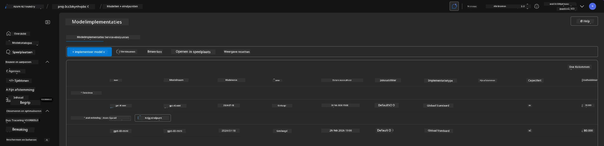
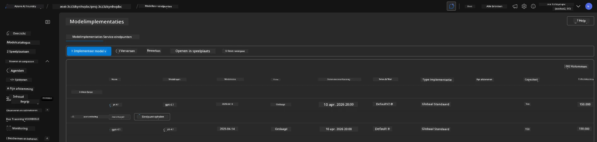

# 6. Infrastructuur verwijderen

!!! tip "AAN HET EINDE VAN DIT MODULE KUN JE"

    - [ ] Begrijp het belang van het opruimen van resources en kostenbeheer
    - [ ] Gebruik `azd down` om infrastructuur veilig te verwijderen
    - [ ] Herstel soft-verwijderde Cognitive Services indien nodig
    - [ ] **Lab 6:** Ruim Azure-resources op en verifieer de verwijdering

---

## Bonusopdrachten

Voordat we het project verwijderen, neem een paar minuten de tijd voor wat open verkenning.

!!! info "Probeer deze verkenningsprompts"

    **Experimenteer met GitHub Copilot:**
    
    1. Ask: `What other AZD templates could I try for multi-agent scenarios?`
    2. Ask: `How can I customize the agent instructions for a healthcare use case?`
    3. Ask: `What environment variables control cost optimization?`
    
    **Verken de Azure Portal:**
    
    1. Bekijk Application Insights-metrieken voor je implementatie
    2. Controleer de kostenanalyse voor de aangemaakte resources
    3. Verken nogmaals de agent-playground van het Microsoft Foundry-portal

---

## Infrastructuur verwijderen

1. Het verwijderen van de infrastructuur is zo eenvoudig als:
      
      ```bash title="" linenums="0"
      azd down --purge
      ```
1. De `--purge`-vlag zorgt ervoor dat het ook soft-verwijderde Cognitive Service-resources verwijdert, waardoor quota die door deze resources worden vastgehouden vrijkomt. Zodra dit voltooid is, zie je iets als dit:
      
      ```bash title="" linenums="0"
      ? Total resources to delete: 11, are you sure you want to continue? Yes
      Deleting your resources can take some time.
      (✓) Done: Deleted resource group rg-nitya-mshack-azd
      (✓) Done: Purging Cognitive Account: aoai-3cz3zkynhvpbc

      SUCCESS: Your application was removed from Azure in 11 minutes 4 seconds.
      ```

1. (Optioneel) Als je nu `azd up` opnieuw uitvoert, zul je merken dat het gpt-4.1-model wordt uitgerold, omdat de omgevingsvariabele is gewijzigd (en opgeslagen) in de lokale `.azure`-map. 

      Hier zijn de modelimplementaties **vóór**:

      

      En hier is het **daarna**:
      

---

<!-- CO-OP TRANSLATOR DISCLAIMER START -->
**Disclaimer**:
Dit document is vertaald met behulp van de AI-vertalingsservice [Co-op Translator](https://github.com/Azure/co-op-translator). Hoewel we naar nauwkeurigheid streven, dient u er rekening mee te houden dat geautomatiseerde vertalingen fouten of onnauwkeurigheden kunnen bevatten. Het originele document in de oorspronkelijke taal moet als gezaghebbende bron worden beschouwd. Voor cruciale informatie wordt een professionele menselijke vertaling aanbevolen. Wij zijn niet aansprakelijk voor eventuele misverstanden of verkeerde interpretaties die voortvloeien uit het gebruik van deze vertaling.
<!-- CO-OP TRANSLATOR DISCLAIMER END -->