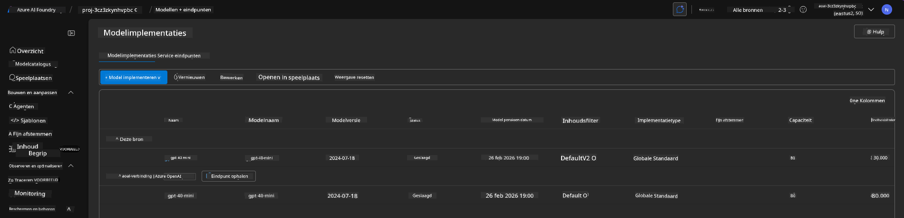
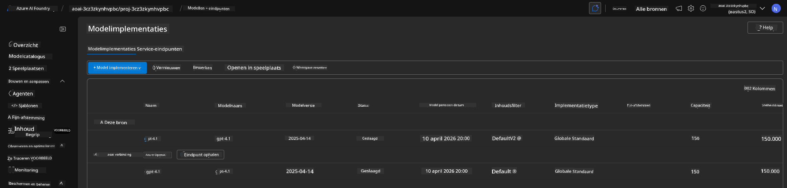

<!--
CO_OP_TRANSLATOR_METADATA:
{
  "original_hash": "6539a34c770f3ceff282370d72ee74dc",
  "translation_date": "2025-09-24T22:45:38+00:00",
  "source_file": "workshop/docs/instructions/6-Teardown-Infrastructure.md",
  "language_code": "nl"
}
-->
# 6. Infrastructuur Afbreken

!!! tip "AAN HET EINDE VAN DEZE MODULE KUN JE"

    - [ ] Item
    - [ ] Item
    - [ ] Item

---

## Bonusoefeningen

Voordat we het project afbreken, neem een paar minuten de tijd voor wat open verkenning.

!!! danger "NITYA-TODO: Stel enkele suggesties op om te proberen"

---

## Infra Deprovisioneren

1. Het afbreken van infrastructuur is zo eenvoudig als:
      
      ```bash title="" linenums="0"
      azd down --purge
      ```
1. De `--purge` vlag zorgt ervoor dat ook zacht-verwijderde Cognitive Service resources worden verwijderd, waardoor de quota die door deze resources wordt vastgehouden, wordt vrijgegeven. Zodra dit is voltooid, zie je iets zoals dit:
      
      ```bash title="" linenums="0"
      ? Total resources to delete: 11, are you sure you want to continue? Yes
      Deleting your resources can take some time.
      (✓) Done: Deleted resource group rg-nitya-mshack-azd
      (✓) Done: Purging Cognitive Account: aoai-3cz3zkynhvpbc

      SUCCESS: Your application was removed from Azure in 11 minutes 4 seconds.
      ```

1. (Optioneel) Als je nu opnieuw `azd up` uitvoert, zul je merken dat het gpt-4.1 model wordt geïmplementeerd omdat de omgevingsvariabele is gewijzigd (en opgeslagen) in de lokale `.azure` map. 

      Hier zijn de modelimplementaties **vooraf**:

      

      En hier zijn ze **achteraf**:
      

---

