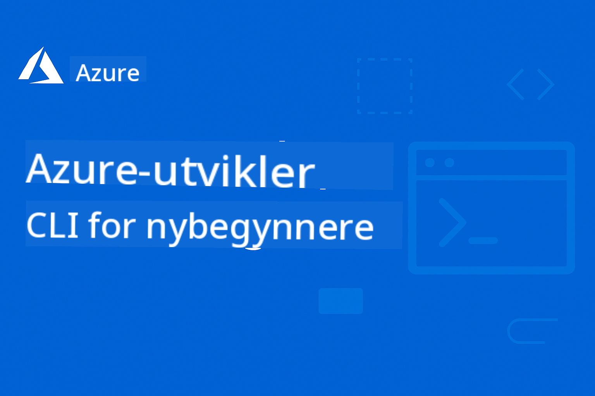

<!--
CO_OP_TRANSLATOR_METADATA:
{
  "original_hash": "3df05e83c2307e92452bd7c3307ae849",
  "translation_date": "2025-09-24T22:22:23+00:00",
  "source_file": "README.md",
  "language_code": "no"
}
-->
# AZD For Nybegynnere: En Strukturert Læringsreise

 

[](https://GitHub.com/microsoft/azd-for-beginners/watchers/)
[](https://GitHub.com/microsoft/azd-for-beginners/network/)
[](https://GitHub.com/microsoft/azd-for-beginners/stargazers/)

[](https://discord.gg/microsoft-azure)
[](https://discord.gg/kzRShWzttr)

## Kom i Gang med Dette Kurset

Følg disse stegene for å starte din AZD-læringsreise:

1. **Fork Repository**: Klikk [](https://GitHub.com/microsoft/azd-for-beginners/fork)
2. **Klon Repository**: `git clone https://github.com/microsoft/azd-for-beginners.git`
3. **Bli Med i Fellesskapet**: [Azure Discord Communities](https://discord.com/invite/ByRwuEEgH4) for eksperthjelp
4. **Velg Din Læringssti**: Velg et kapittel nedenfor som passer ditt erfaringsnivå

### Støtte for Flere Språk

#### Automatiserte Oversettelser (Alltid Oppdatert)

[French](../fr/README.md) | [Spanish](../es/README.md) | [German](../de/README.md) | [Russian](../ru/README.md) | [Arabic](../ar/README.md) | [Persian (Farsi)](../fa/README.md) | [Urdu](../ur/README.md) | [Chinese (Simplified)](../zh/README.md) | [Chinese (Traditional, Macau)](../mo/README.md) | [Chinese (Traditional, Hong Kong)](../hk/README.md) | [Chinese (Traditional, Taiwan)](../tw/README.md) | [Japanese](../ja/README.md) | [Korean](../ko/README.md) | [Hindi](../hi/README.md) | [Bengali](../bn/README.md) | [Marathi](../mr/README.md) | [Nepali](../ne/README.md) | [Punjabi (Gurmukhi)](../pa/README.md) | [Portuguese (Portugal)](../pt/README.md) | [Portuguese (Brazil)](../br/README.md) | [Italian](../it/README.md) | [Polish](../pl/README.md) | [Turkish](../tr/README.md) | [Greek](../el/README.md) | [Thai](../th/README.md) | [Swedish](../sv/README.md) | [Danish](../da/README.md) | [Norwegian](./README.md) | [Finnish](../fi/README.md) | [Dutch](../nl/README.md) | [Hebrew](../he/README.md) | [Vietnamese](../vi/README.md) | [Indonesian](../id/README.md) | [Malay](../ms/README.md) | [Tagalog (Filipino)](../tl/README.md) | [Swahili](../sw/README.md) | [Hungarian](../hu/README.md) | [Czech](../cs/README.md) | [Slovak](../sk/README.md) | [Romanian](../ro/README.md) | [Bulgarian](../bg/README.md) | [Serbian (Cyrillic)](../sr/README.md) | [Croatian](../hr/README.md) | [Slovenian](../sl/README.md) | [Ukrainian](../uk/README.md) | [Burmese (Myanmar)](../my/README.md)

## Kursoversikt

Bli ekspert på Azure Developer CLI (azd) gjennom strukturerte kapitler som er designet for progressiv læring. **Spesiell fokus på AI-applikasjonsutplassering med Azure AI Foundry-integrasjon.**

### Hvorfor Dette Kurset er Viktig for Moderne Utviklere

Basert på innsikt fra Azure AI Foundry Discord-fellesskapet, **ønsker 45% av utviklere å bruke AZD for AI-arbeidsoppgaver**, men møter utfordringer med:
- Komplekse AI-arkitekturer med flere tjenester
- Beste praksis for produksjonsutplassering av AI
- Integrasjon og konfigurasjon av Azure AI-tjenester
- Kostnadsoptimalisering for AI-arbeidsoppgaver
- Feilsøking av AI-spesifikke utplasseringsproblemer

### Læringsmål

Ved å fullføre dette strukturerte kurset vil du:
- **Beherske AZD Grunnleggende**: Kjernekonsepter, installasjon og konfigurasjon
- **Utplassere AI-applikasjoner**: Bruke AZD med Azure AI Foundry-tjenester
- **Implementere Infrastruktur som Kode**: Administrere Azure-ressurser med Bicep-maler
- **Feilsøke Utplasseringer**: Løse vanlige problemer og debugge utfordringer
- **Optimalisere for Produksjon**: Sikkerhet, skalering, overvåking og kostnadsstyring
- **Bygge Multi-Agent Løsninger**: Utplassere komplekse AI-arkitekturer

## 📚 Læringskapitler

*Velg din læringssti basert på erfaringsnivå og mål*

### 🚀 Kapittel 1: Grunnlag & Hurtigstart
**Forutsetninger**: Azure-abonnement, grunnleggende kunnskap om kommandolinjen  
**Varighet**: 30-45 minutter  
**Kompleksitet**: ⭐

#### Hva Du Vil Lære
- Forstå grunnleggende om Azure Developer CLI
- Installere AZD på din plattform
- Din første vellykkede utplassering

#### Læringsressurser
- **🎯 Start Her**: [Hva er Azure Developer CLI?](../..)
- **📖 Teori**: [AZD Grunnleggende](docs/getting-started/azd-basics.md) - Kjernekonsepter og terminologi
- **⚙️ Oppsett**: [Installasjon & Oppsett](docs/getting-started/installation.md) - Plattformspesifikke guider
- **🛠️ Praktisk**: [Ditt Første Prosjekt](docs/getting-started/first-project.md) - Steg-for-steg veiledning
- **📋 Hurtigreferanse**: [Kommandosnarveier](resources/cheat-sheet.md)

#### Praktiske Øvelser
```bash
# Quick installation check
azd version

# Deploy your first application
azd init --template todo-nodejs-mongo
azd up
```

**💡 Kapittelresultat**: Vellykket utplassering av en enkel webapplikasjon til Azure ved bruk av AZD

---

### 🤖 Kapittel 2: AI-Fokusert Utvikling (Anbefalt for AI-utviklere)
**Forutsetninger**: Kapittel 1 fullført  
**Varighet**: 1-2 timer  
**Kompleksitet**: ⭐⭐

#### Hva Du Vil Lære
- Integrasjon av Azure AI Foundry med AZD
- Utplassering av AI-drevne applikasjoner
- Forståelse av AI-tjenestekonfigurasjoner

#### Læringsressurser
- **🎯 Start Her**: [Azure AI Foundry Integrasjon](docs/ai-foundry/azure-ai-foundry-integration.md)
- **📖 Mønstre**: [AI Modellutplassering](docs/ai-foundry/ai-model-deployment.md) - Utplassere og administrere AI-modeller
- **🛠️ Workshop**: [AI Workshop Lab](docs/ai-foundry/ai-workshop-lab.md) - Gjør dine AI-løsninger AZD-klare
- **🎥 Interaktiv Veiledning**: [Workshop Materialer](workshop/README.md) - Nettleserbasert læring med MkDocs * DevContainer Environment
- **📋 Maler**: [Azure AI Foundry Maler](../..)

#### Praktiske Øvelser
```bash
# Deploy your first AI application
azd init --template azure-search-openai-demo
azd up

# Try additional AI templates
azd init --template openai-chat-app-quickstart
azd init --template agent-openai-python-prompty
```

**💡 Kapittelresultat**: Utplassere og konfigurere en AI-drevet chatapplikasjon med RAG-funksjonalitet

---

### ⚙️ Kapittel 3: Konfigurasjon & Autentisering
**Forutsetninger**: Kapittel 1 fullført  
**Varighet**: 45-60 minutter  
**Kompleksitet**: ⭐⭐

#### Hva Du Vil Lære
- Miljøkonfigurasjon og administrasjon
- Beste praksis for autentisering og sikkerhet
- Ressursnavngivning og organisering

#### Læringsressurser
- **📖 Konfigurasjon**: [Konfigurasjonsveiledning](docs/getting-started/configuration.md) - Miljøoppsett
- **🔐 Sikkerhet**: Autentiseringsmønstre og administrert identitet
- **📝 Eksempler**: [Database App Eksempel](../../examples/database-app) - Konfigurasjonsmønstre

#### Praktiske Øvelser
- Konfigurere flere miljøer (dev, staging, prod)
- Sette opp administrert identitetsautentisering
- Implementere miljøspesifikke konfigurasjoner

**💡 Kapittelresultat**: Administrere flere miljøer med riktig autentisering og sikkerhet

---

### 🏗️ Kapittel 4: Infrastruktur som Kode & Utplassering
**Forutsetninger**: Kapitler 1-3 fullført  
**Varighet**: 1-1.5 timer  
**Kompleksitet**: ⭐⭐⭐

#### Hva Du Vil Lære
- Avanserte utplasseringsmønstre
- Infrastruktur som kode med Bicep
- Strategier for ressursprovisjonering

#### Læringsressurser
- **📖 Utplassering**: [Utplasseringsveiledning](docs/deployment/deployment-guide.md) - Fullstendige arbeidsflyter
- **🏗️ Provisjonering**: [Provisjonering av Ressurser](docs/deployment/provisioning.md) - Administrasjon av Azure-ressurser
- **📝 Eksempler**: [Container App Eksempel](../../examples/container-app) - Containerbaserte utplasseringer

#### Praktiske Øvelser
- Lage tilpassede Bicep-maler
- Utplassere applikasjoner med flere tjenester
- Implementere blå-grønn utplasseringsstrategi

**💡 Kapittelresultat**: Utplassere komplekse applikasjoner med flere tjenester ved bruk av tilpassede infrastrukturmaler

---

### 🎯 Kapittel 5: Multi-Agent AI Løsninger (Avansert)
**Forutsetninger**: Kapitler 1-2 fullført  
**Varighet**: 2-3 timer  
**Kompleksitet**: ⭐⭐⭐⭐

#### Hva Du Vil Lære
- Mønstre for multi-agent arkitektur
- Orkestrering og koordinering av agenter
- Produksjonsklare AI-utplasseringer

#### Læringsressurser
- **🤖 Utvalgt Prosjekt**: [Retail Multi-Agent Løsning](examples/retail-scenario.md) - Fullstendig implementering
- **🛠️ ARM Maler**: [ARM Malpakke](../../examples/retail-multiagent-arm-template) - Ett-klikk utplassering
- **📖 Arkitektur**: Koordineringsmønstre for multi-agent

#### Praktiske Øvelser
```bash
# Deploy the complete retail multi-agent solution
cd examples/retail-multiagent-arm-template
./deploy.sh

# Explore agent configurations
az deployment group show --resource-group <rg-name> --name <deployment-name>
```

**💡 Kapittelresultat**: Utplassere og administrere en produksjonsklar multi-agent AI-løsning med Kunde- og Lageragenter

---

### 🔍 Kapittel 6: Validering & Planlegging før Utplassering
**Forutsetninger**: Kapittel 4 fullført  
**Varighet**: 1 time  
**Kompleksitet**: ⭐⭐

#### Hva Du Vil Lære
- Kapasitetsplanlegging og ressursvalidering
- Strategier for valg av SKU
- Forhåndssjekker og automatisering

#### Læringsressurser
- **📊 Planlegging**: [Kapasitetsplanlegging](docs/pre-deployment/capacity-planning.md) - Ressursvalidering
- **💰 Valg**: [SKU Valg](docs/pre-deployment/sku-selection.md) - Kostnadseffektive valg
- **✅ Validering**: [Forhåndssjekker](docs/pre-deployment/preflight-checks.md) - Automatiserte skript

#### Praktiske Øvelser
- Kjøre valideringsskript for kapasitet
- Optimalisere SKU-valg for kostnader
- Implementere automatiserte forhåndssjekker

**💡 Kapittelresultat**: Validere og optimalisere utplasseringer før utførelse

---

### 🚨 Kapittel 7: Feilsøking & Debugging
**Forutsetninger**: Ethvert utplasseringskapittel fullført  
**Varighet**: 1-1.5 timer  
**Kompleksitet**: ⭐⭐

#### Hva Du Vil Lære
- Systematiske tilnærminger til debugging
- Vanlige problemer og løsninger
- AI-spesifikk feilsøking

#### Læringsressurser
- **🔧 Vanlige Problemer**: [Vanlige Problemer](docs/troubleshooting/common-issues.md) - FAQ og løsninger
- **🕵️ Debugging**: [Debugging Veiledning](docs/troubleshooting/debugging.md) - Steg-for-steg strategier
- **🤖 AI Problemer**: [AI-Spesifikk Feilsøking](docs/troubleshooting/ai-troubleshooting.md) - Problemer med AI-tjenester

#### Praktiske Øvelser
- Diagnostisere utplasseringsfeil
- Løse autentiseringsproblemer
- Debugge AI-tjenestetilkobling

**💡 Kapittelresultat**: Selvstendig diagnostisere og løse vanlige utplasseringsproblemer

---

### 🏢 Kapittel 8: Produksjon & Enterprise Mønstre
**Forutsetninger**: Kapitler 1-4 fullført  
**Varighet**: 2-3 timer  
**Kompleksitet**: ⭐⭐⭐⭐

#### Hva Du Vil Lære
- Strategier for produksjonsutplassering
- Enterprise sikkerhetsmønstre
- Overvåking og kostnadsoptimalisering

#### Læringsressurser
- **🏭 Produksjon**: [Beste Praksis for Produksjons-AI](docs/ai-foundry/production-ai-practices.md) - Enterprise mønstre
- **📝 Eksempler**: [Microservices Eksempel](../../examples/microservices) - Komplekse arkitekturer  
- **📊 Overvåking**: Integrasjon med Application Insights  

#### Praktiske Øvelser  
- Implementere sikkerhetsmønstre for bedrifter  
- Sette opp omfattende overvåking  
- Rulle ut til produksjon med riktig styring  

**💡 Kapittelresultat**: Rull ut applikasjoner klare for bedrifter med full produksjonskapasitet  

---

## 🎓 Workshopoversikt: Praktisk Læring  

### Interaktive Workshopmaterialer  
**Omfattende praktisk læring med nettleserbaserte verktøy og veiledede øvelser**  

Våre workshopmaterialer gir en strukturert, interaktiv læringsopplevelse som utfyller kapittelbasert pensum ovenfor. Workshopen er designet for både selvstyrt læring og instruktørledede sesjoner.  

#### 🛠️ Workshopfunksjoner  
- **Nettleserbasert grensesnitt**: Komplett workshop drevet av MkDocs med søk, kopiering og temafunksjoner  
- **GitHub Codespaces-integrasjon**: Ett-klikk oppsett av utviklingsmiljø  
- **Strukturert læringssti**: 7-trinns veiledede øvelser (totalt 3,5 timer)  
- **Oppdagelse → Utrulling → Tilpasning**: Progressiv metodikk  
- **Interaktiv DevContainer-miljø**: Forhåndskonfigurerte verktøy og avhengigheter  

#### 📚 Workshopstruktur  
Workshopen følger en **Oppdagelse → Utrulling → Tilpasning**-metodikk:  

1. **Oppdagelsesfase** (45 min)  
   - Utforsk Azure AI Foundry-maler og tjenester  
   - Forstå mønstre for multi-agent arkitektur  
   - Gjennomgå krav og forutsetninger for utrulling  

2. **Utrullingsfase** (2 timer)  
   - Praktisk utrulling av AI-applikasjoner med AZD  
   - Konfigurer Azure AI-tjenester og endepunkter  
   - Implementer sikkerhets- og autentiseringsmønstre  

3. **Tilpasningsfase** (45 min)  
   - Modifiser applikasjoner for spesifikke bruksområder  
   - Optimaliser for produksjonsutrulling  
   - Implementer overvåking og kostnadsstyring  

#### 🚀 Kom i gang med workshopen  
```bash
# Option 1: GitHub Codespaces (Recommended)
# Click "Code" → "Create codespace on main" in the repository

# Option 2: Local Development
git clone https://github.com/microsoft/azd-for-beginners.git
cd azd-for-beginners/workshop
# Follow the setup instructions in workshop/README.md
```
  
#### 🎯 Workshop læringsutbytte  
Ved å fullføre workshopen vil deltakerne:  
- **Rulle ut AI-applikasjoner for produksjon**: Bruke AZD med Azure AI Foundry-tjenester  
- **Beherske multi-agent arkitekturer**: Implementere koordinerte AI-agentløsninger  
- **Implementere sikkerhetspraksis**: Konfigurere autentisering og tilgangskontroll  
- **Optimalisere for skala**: Designe kostnadseffektive, ytelsessterke utrullinger  
- **Feilsøke utrullinger**: Løse vanlige problemer selvstendig  

#### 📖 Workshopressurser  
- **🎥 Interaktiv veiledning**: [Workshopmaterialer](workshop/README.md) - Nettleserbasert læringsmiljø  
- **📋 Trinn-for-trinn instruksjoner**: [Veiledede øvelser](../../workshop/docs/instructions) - Detaljerte gjennomganger  
- **🛠️ AI Workshop Lab**: [AI Workshop Lab](docs/ai-foundry/ai-workshop-lab.md) - AI-fokuserte øvelser  
- **💡 Hurtigstart**: [Workshopoppsettveiledning](workshop/README.md#quick-start) - Miljøkonfigurasjon  

**Perfekt for**: Bedriftstrening, universitetskurs, selvstyrt læring og utviklerbootcamps.  

---

## 📖 Hva er Azure Developer CLI?  

Azure Developer CLI (azd) er et utviklerfokusert kommandolinjeverktøy som akselererer prosessen med å bygge og rulle ut applikasjoner til Azure. Det tilbyr:  

- **Malerbaserte utrullinger** - Bruk forhåndsbygde maler for vanlige applikasjonsmønstre  
- **Infrastruktur som kode** - Administrer Azure-ressurser med Bicep eller Terraform  
- **Integrerte arbeidsflyter** - Sømløst klargjøre, rulle ut og overvåke applikasjoner  
- **Utviklervennlig** - Optimalisert for utviklerproduktivitet og opplevelse  

### **AZD + Azure AI Foundry: Perfekt for AI-utrullinger**  

**Hvorfor AZD for AI-løsninger?** AZD adresserer de største utfordringene AI-utviklere står overfor:  

- **AI-klare maler** - Forhåndskonfigurerte maler for Azure OpenAI, Cognitive Services og ML-arbeidsbelastninger  
- **Sikre AI-utrullinger** - Innebygde sikkerhetsmønstre for AI-tjenester, API-nøkler og modellendepunkter  
- **Produksjonsklare AI-mønstre** - Beste praksis for skalerbare, kostnadseffektive AI-applikasjonsutrullinger  
- **End-to-End AI-arbeidsflyter** - Fra modellutvikling til produksjonsutrulling med riktig overvåking  
- **Kostnadsoptimalisering** - Smarte ressursallokerings- og skaleringsstrategier for AI-arbeidsbelastninger  
- **Azure AI Foundry-integrasjon** - Sømløs tilkobling til AI Foundry-modellkatalog og endepunkter  

---

## 🎯 Maler & Eksempelbibliotek  

### Utvalgt: Azure AI Foundry-maler  
**Start her hvis du skal rulle ut AI-applikasjoner!**  

| Mal | Kapittel | Kompleksitet | Tjenester |  
|----------|---------|------------|----------|  
| [**Kom i gang med AI-chat**](https://github.com/Azure-Samples/get-started-with-ai-chat) | Kapittel 2 | ⭐⭐ | AzureOpenAI + Azure AI Model Inference API + Azure AI Search + Azure Container Apps + Application Insights |  
| [**Kom i gang med AI-agenter**](https://github.com/Azure-Samples/get-started-with-ai-agents) | Kapittel 2 | ⭐⭐ | Azure AI Agent Service + AzureOpenAI + Azure AI Search + Azure Container Apps + Application Insights|  
| [**Multi-agent arbeidsflytautomatisering**](https://github.com/Azure-Samples/get-started-with-ai-chat) | Kapittel 5 | ⭐⭐⭐ | AzureOpenAI + Azure AI Agent Service + Semantic Kernel + Azure CosmosDB + Azure Container Apps|  
| [**Generer dokumenter fra dine data**](https://github.com/Azure-Samples/get-started-with-ai-chat) | Kapittel 4 | ⭐⭐⭐ | AzureOpenAI + Azure AI Search + Azure AI Services + Azure CosmosDB|  
| [**Forbedre kundemøter med agenter**](https://github.com/Azure-Samples/get-started-with-ai-chat) | Kapittel 5 | ⭐⭐⭐| AzureOpenAI + Azure AI Search + Azure CosmosDB + Azure SQL Database |  
| [**Moderniser koden din med agenter**](https://github.com/Azure-Samples/get-started-with-ai-chat) | Kapittel 5 | ⭐⭐⭐ | AzureOpenAI + Azure Agent Service + Semantic Kernel + Azure CosmosDB + Azure Container Apps|  
| [**Bygg din samtaleagent**](https://github.com/Azure-Samples/get-started-with-ai-chat) | Kapittel 4 | ⭐⭐⭐ | AI Language + AzureOpenAI + AI Search + Azure Storage + Azure Container Registry|  
| [**Lås opp innsikt fra samtaledata**](https://github.com/Azure-Samples/get-started-with-ai-chat) | Kapittel 8 | ⭐⭐⭐ | AzureOpenAI + AI Search + Semantic Kernel + Azure Agent Service + AI AI Content Understanding|  
| [**Multi-modal innholdsbehandling**](https://github.com/Azure-Samples/get-started-with-ai-chat) | Kapittel 8 | ⭐⭐⭐⭐ | AzureOpenAI + Azure Content Understanding + Azure CosmosDB + Azure Container Apps|  

### Utvalgt: Komplette læringsscenarier  
**Produksjonsklare applikasjonsmaler knyttet til læringskapitler**  

| Mal | Læringskapittel | Kompleksitet | Nøkkellæring |  
|----------|------------------|------------|--------------|  
| [**openai-chat-app-quickstart**](https://github.com/Azure-Samples/openai-chat-app-quickstart) | Kapittel 2 | ⭐ | Grunnleggende AI-utrullingsmønstre |  
| [**azure-search-openai-demo**](https://github.com/Azure-Samples/azure-search-openai-demo) | Kapittel 2 | ⭐⭐ | RAG-implementering med Azure AI Search |  
| [**ai-document-processing**](https://github.com/Azure-Samples/ai-document-processing) | Kapittel 4 | ⭐⭐ | Dokumentintelligensintegrasjon |  
| [**agent-openai-python-prompty**](https://github.com/Azure-Samples/agent-openai-python-prompty) | Kapittel 5 | ⭐⭐⭐ | Agentrammeverk og funksjonskalling |  
| [**contoso-chat**](https://github.com/Azure-Samples/contoso-chat) | Kapittel 8 | ⭐⭐⭐ | Bedrifts-AI-orkestrering |  
| [**retail-multi-agent-solution**](examples/retail-scenario.md) | Kapittel 5 | ⭐⭐⭐⭐ | Multi-agent arkitektur med kunde- og lageragenter |  

### Læring etter eksemplertype  

#### Enkle applikasjoner (Kapittel 1-2)  
- [Enkel webapplikasjon](../../examples/simple-web-app) - Grunnleggende utrullingsmønstre  
- [Statisk nettsted](../../examples/static-site) - Utrulling av statisk innhold  
- [Grunnleggende API](../../examples/basic-api) - Utrulling av REST API  

#### Databaseintegrasjon (Kapittel 3-4)  
- [Databaseapplikasjon](../../examples/database-app) - Mønstre for databasekobling  
- [Databehandling](../../examples/data-processing) - ETL-arbeidsflytutrulling  

#### Avanserte mønstre (Kapittel 4-8)  
- [Containerapplikasjoner](../../examples/container-app) - Containeriserte utrullinger  
- [Microservices](../../examples/microservices) - Multi-service arkitekturer  
- [Bedriftsløsninger](../../examples/enterprise) - Produksjonsklare mønstre  

### Eksterne malekolleksjoner  
- [**Azure-Samples AZD-maler**](https://github.com/Azure-Samples/azd-templates) - Offisielle Microsoft-eksempler  
- [**Awesome AZD Gallery**](https://azure.github.io/awesome-azd/) - Maler bidratt av fellesskapet  
- [**Eksempeldirectory**](examples/README.md) - Lokale læringseksempler med detaljerte forklaringer  

---

## 📚 Læringsressurser & Referanser  

### Hurtigreferanser  
- [**Kommandosnarveiark**](resources/cheat-sheet.md) - Essensielle azd-kommandoer organisert etter kapittel  
- [**Ordliste**](resources/glossary.md) - Terminologi for Azure og azd  
- [**FAQ**](resources/faq.md) - Vanlige spørsmål organisert etter læringskapittel  
- [**Studieveiledning**](resources/study-guide.md) - Omfattende praksisøvelser  

### Praktiske Workshops  
- [**AI Workshop Lab**](docs/ai-foundry/ai-workshop-lab.md) - Gjør AI-løsningene dine AZD-klare (2-3 timer)  
- [**Interaktiv Workshopveiledning**](workshop/README.md) - Nettleserbasert workshop med MkDocs og DevContainer-miljø  
- [**Strukturert læringssti**](../../workshop/docs/instructions) - 7-trinns veiledede øvelser (Oppdagelse → Utrulling → Tilpasning)  
- [**AZD For Nybegynnere Workshop**](workshop/README.md) - Komplette praktiske workshopmaterialer med GitHub Codespaces-integrasjon  

### Eksterne læringsressurser  
- [Azure Developer CLI Dokumentasjon](https://learn.microsoft.com/en-us/azure/developer/azure-developer-cli/)  
- [Azure Arkitektursenter](https://learn.microsoft.com/en-us/azure/architecture/)  
- [Azure Priskalkulator](https://azure.microsoft.com/pricing/calculator/)  
- [Azure Status](https://status.azure.com/)  

---

## 🎓 Kursfullføring & Sertifisering  

### Fremdriftssporing  
Spor læringsfremdriften din gjennom hvert kapittel:  

- [ ] **Kapittel 1**: Grunnlag & Hurtigstart ✅  
- [ ] **Kapittel 2**: AI-først utvikling ✅  
- [ ] **Kapittel 3**: Konfigurasjon & Autentisering ✅  
- [ ] **Kapittel 4**: Infrastruktur som kode & Utrulling ✅  
- [ ] **Kapittel 5**: Multi-agent AI-løsninger ✅  
- [ ] **Kapittel 6**: Validering & Planlegging før utrulling ✅  
- [ ] **Kapittel 7**: Feilsøking & Debugging ✅  
- [ ] **Kapittel 8**: Produksjon & Bedriftsmønstre ✅  

### Læringsverifisering  
Etter å ha fullført hvert kapittel, verifiser kunnskapen din ved:  
1. **Praktisk øvelse**: Fullfør kapittelets praktiske utrulling  
2. **Kunnskapssjekk**: Gjennomgå FAQ-seksjonen for kapittelet ditt  
3. **Fellesskapsdiskusjon**: Del erfaringene dine i Azure Discord  
4. **Neste kapittel**: Gå videre til neste kompleksitetsnivå  

### Fordeler ved kursfullføring  
Ved å fullføre alle kapitler vil du ha:  
- **Produksjonserfaring**: Rullet ut ekte AI-applikasjoner til Azure  
- **Profesjonelle ferdigheter**: Kapasitet til bedriftsklar utrulling  
- **Fellesskapsanerkjennelse**: Aktivt medlem av Azure utviklerfellesskap  
- **Karrierefremgang**: Ettertraktet AZD- og AI-utrullingsekspertise  

---

## 🤝 Fellesskap & Støtte  

### Få hjelp & støtte  
- **Tekniske problemer**: [Rapporter feil og foreslå funksjoner](https://github.com/microsoft/azd-for-beginners/issues)  
- **Læringsspørsmål**: [Microsoft Azure Discord-fellesskap](https://discord.gg/microsoft-azure)  
- **AI-spesifikk hjelp**: Bli med i [#Azure-kanalen](https://discord.gg/microsoft-azure) for AZD + AI Foundry-diskusjoner  
- **Dokumentasjon**: [Offisiell Azure Developer CLI-dokumentasjon](https://learn.microsoft.com/en-us/azure/developer/azure-developer-cli/)  

### Fellesskapsinnsikt fra Azure AI Foundry Discord  

**Nylige avstemningsresultater fra #Azure-kanalen:**  
- **45%** av utviklere ønsker å bruke AZD for AI-arbeidsbelastninger  
- **Topp utfordringer**: Multi-service utrullinger, håndtering av legitimasjon, produksjonsklarhet  
- **Mest etterspurt**: AI-spesifikke maler, feilsøkingsveiledninger, beste praksis  

**Bli med i fellesskapet for å:**  
- Dele dine AZD + AI-erfaringer og få hjelp  
- Få tidlig tilgang til nye AI-maler  
- Bidra til beste praksis for AI-utrulling  
- Påvirke fremtidig utvikling av AI + AZD-funksjoner  

### Bidra til kurset  
Vi ønsker bidrag velkommen! Les vår [Bidragsveiledning](CONTRIBUTING.md) for detaljer om:  
- **Forbedring av innhold**: Forbedre eksisterende kapitler og eksempler  
- **Nye eksempler**: Legge til virkelige scenarier og maler  
- **Oversettelse**: Hjelpe med å opprettholde flerspråklig støtte  
- **Feilrapporter**: Forbedre nøyaktighet og klarhet  
- **Fellesskapsstandarder**: Følge våre inkluderende fellesskapsretningslinjer  

---

## 📄 Kursinformasjon  

### Lisens  
Dette prosjektet er lisensiert under MIT-lisensen - se [LICENSE](../../LICENSE)-filen for detaljer.  
### Relaterte Microsoft-læringsressurser

Teamet vårt produserer andre omfattende læringskurs:

- [Model Context Protocol (MCP) For Nybegynnere](https://github.com/microsoft/mcp-for-beginners?WT.mc_id=academic-105485-koreyst)
- [AI-agenter for Nybegynnere](https://github.com/microsoft/ai-agents-for-beginners?WT.mc_id=academic-105485-koreyst)  
- [Generativ AI for Nybegynnere med .NET](https://github.com/microsoft/Generative-AI-for-beginners-dotnet?WT.mc_id=academic-105485-koreyst)
- [Generativ AI for Nybegynnere](https://github.com/microsoft/generative-ai-for-beginners?WT.mc_id=academic-105485-koreyst)
- [Generativ AI for Nybegynnere med Java](https://github.com/microsoft/generative-ai-for-beginners-java?WT.mc_id=academic-105485-koreyst)
- [ML for Nybegynnere](https://aka.ms/ml-beginners?WT.mc_id=academic-105485-koreyst)
- [Data Science for Nybegynnere](https://aka.ms/datascience-beginners?WT.mc_id=academic-105485-koreyst)
- [AI for Nybegynnere](https://aka.ms/ai-beginners?WT.mc_id=academic-105485-koreyst)
- [Cybersikkerhet for Nybegynnere](https://github.com/microsoft/Security-101??WT.mc_id=academic-96948-sayoung)
- [Webutvikling for Nybegynnere](https://aka.ms/webdev-beginners?WT.mc_id=academic-105485-koreyst)
- [IoT for Nybegynnere](https://aka.ms/iot-beginners?WT.mc_id=academic-105485-koreyst)
- [XR-utvikling for Nybegynnere](https://github.com/microsoft/xr-development-for-beginners?WT.mc_id=academic-105485-koreyst)
- [Mestre GitHub Copilot for AI-parprogrammering](https://aka.ms/GitHubCopilotAI?WT.mc_id=academic-105485-koreyst)
- [Mestre GitHub Copilot for C#/.NET-utviklere](https://github.com/microsoft/mastering-github-copilot-for-dotnet-csharp-developers?WT.mc_id=academic-105485-koreyst)
- [Velg Din Egen Copilot-eventyr](https://github.com/microsoft/CopilotAdventures?WT.mc_id=academic-105485-koreyst)

---

## 🗺️ Kursnavigasjon

**🚀 Klar til å begynne å lære?**

**Nybegynnere**: Start med [Kapittel 1: Grunnlag & Hurtigstart](../..)  
**AI-utviklere**: Hopp til [Kapittel 2: AI-First Utvikling](../..)  
**Erfarne utviklere**: Begynn med [Kapittel 3: Konfigurasjon & Autentisering](../..)

**Neste steg**: [Begynn Kapittel 1 - AZD Grunnleggende](docs/getting-started/azd-basics.md) →

---

