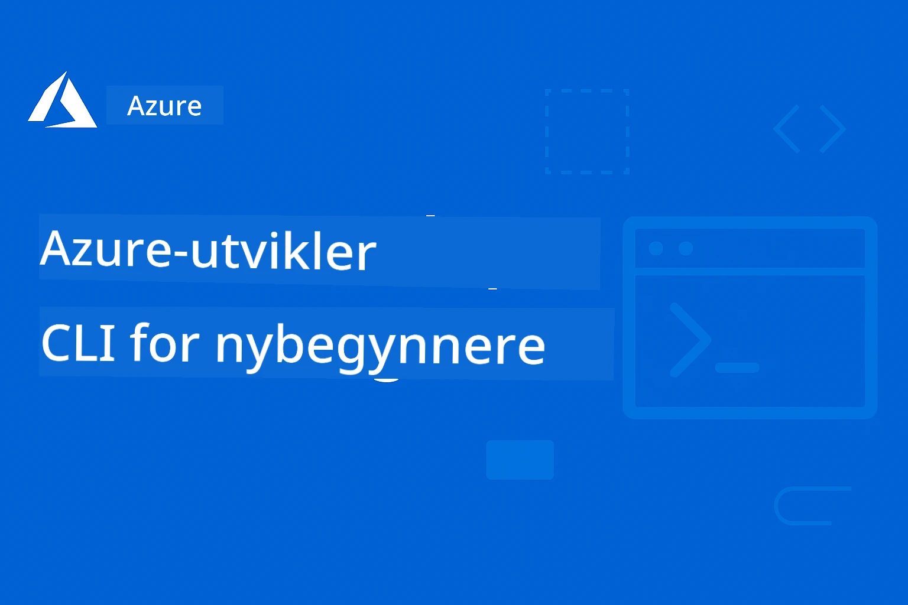

# AZD for nybegynnere: En strukturert læringsreise

 

[](https://GitHub.com/microsoft/azd-for-beginners/watchers/)
[](https://GitHub.com/microsoft/azd-for-beginners/network/)
[](https://GitHub.com/microsoft/azd-for-beginners/stargazers/)

[](https://discord.gg/microsoft-azure)
[](https://discord.gg/nTYy5BXMWG)

## Kom i gang med dette kurset

Følg disse stegene for å starte din AZD-læringsreise:

1. **Fork depoter**: Klikk [](https://GitHub.com/microsoft/azd-for-beginners/fork)
2. **Klon depository**: `git clone https://github.com/microsoft/azd-for-beginners.git`
3. **Bli med i fellesskapet**: [Azure Discord Communities](https://discord.com/invite/ByRwuEEgH4) for ekspertstøtte
4. **Velg din læringsvei**: Velg et kapittel nedenfor som matcher ditt erfaringsnivå

### Støtte for flere språk

#### Automatiserte oversettelser (alltid oppdatert)

<!-- CO-OP TRANSLATOR LANGUAGES TABLE START -->
[Arabic](../ar/README.md) | [Bengali](../bn/README.md) | [Bulgarian](../bg/README.md) | [Burmese (Myanmar)](../my/README.md) | [Chinese (Simplified)](../zh-CN/README.md) | [Chinese (Traditional, Hong Kong)](../zh-HK/README.md) | [Chinese (Traditional, Macau)](../zh-MO/README.md) | [Chinese (Traditional, Taiwan)](../zh-TW/README.md) | [Croatian](../hr/README.md) | [Czech](../cs/README.md) | [Danish](../da/README.md) | [Dutch](../nl/README.md) | [Estonian](../et/README.md) | [Finnish](../fi/README.md) | [French](../fr/README.md) | [German](../de/README.md) | [Greek](../el/README.md) | [Hebrew](../he/README.md) | [Hindi](../hi/README.md) | [Hungarian](../hu/README.md) | [Indonesian](../id/README.md) | [Italian](../it/README.md) | [Japanese](../ja/README.md) | [Kannada](../kn/README.md) | [Korean](../ko/README.md) | [Lithuanian](../lt/README.md) | [Malay](../ms/README.md) | [Malayalam](../ml/README.md) | [Marathi](../mr/README.md) | [Nepali](../ne/README.md) | [Nigerian Pidgin](../pcm/README.md) | [Norwegian](./README.md) | [Persian (Farsi)](../fa/README.md) | [Polish](../pl/README.md) | [Portuguese (Brazil)](../pt-BR/README.md) | [Portuguese (Portugal)](../pt-PT/README.md) | [Punjabi (Gurmukhi)](../pa/README.md) | [Romanian](../ro/README.md) | [Russian](../ru/README.md) | [Serbian (Cyrillic)](../sr/README.md) | [Slovak](../sk/README.md) | [Slovenian](../sl/README.md) | [Spanish](../es/README.md) | [Swahili](../sw/README.md) | [Swedish](../sv/README.md) | [Tagalog (Filipino)](../tl/README.md) | [Tamil](../ta/README.md) | [Telugu](../te/README.md) | [Thai](../th/README.md) | [Turkish](../tr/README.md) | [Ukrainian](../uk/README.md) | [Urdu](../ur/README.md) | [Vietnamese](../vi/README.md)

> **Foretrekker du å klone lokalt?**

> Dette depotet inkluderer over 50 språkoversettelser, noe som øker nedlastingsstørrelsen betydelig. For å klone uten oversettelser, bruk sparse checkout:
> ```bash
> git clone --filter=blob:none --sparse https://github.com/microsoft/AZD-for-beginners.git
> cd AZD-for-beginners
> git sparse-checkout set --no-cone '/*' '!translations' '!translated_images'
> ```
> Dette gir deg alt du trenger for å fullføre kurset med en mye raskere nedlasting.
<!-- CO-OP TRANSLATOR LANGUAGES TABLE END -->

## Kursoversikt

Mestre Azure Developer CLI (azd) gjennom strukturerte kapitler designet for progressiv læring. **Spesiell fokus på AI-applikasjonsdistribusjon med Microsoft Foundry-integrasjon.**

### Hvorfor dette kurset er essensielt for moderne utviklere

Basert på innsikt fra Microsoft Foundry Discord-fellesskapet, ønsker **45 % av utviklere å bruke AZD for AI-arbeidsbelastninger** men møter utfordringer med:
- Komplekse fler-tjeneste AI-arkitekturer
- Beste praksis for AI-produksjonsdistribusjon
- Azure AI-tjenesteintegrasjon og konfigurasjon
- Kostnadsoptimalisering for AI-arbeidsbelastninger
- Feilsøking av AI-spesifikke distribusjonsproblemer

### Læringsmål

Ved å fullføre dette strukturerte kurset vil du:
- **Mestre AZD-grunnleggende**: Kjernkonsepter, installasjon og konfigurering
- **Distribuere AI-applikasjoner**: Bruke AZD med Microsoft Foundry-tjenester
- **Implementere infrastruktur som kode**: Administrere Azure-ressurser med Bicep-maler
- **Feilsøke distribusjoner**: Løse vanlige problemer og feilsøke
- **Optimalisere for produksjon**: Sikkerhet, skalering, overvåking og kostnadsstyring
- **Bygge multi-agent løsninger**: Distribuere komplekse AI-arkitekturer

## 📚 Læringskapitler

*Velg din læringsvei basert på erfaring og mål*

### 🚀 Kapittel 1: Grunnlag & Rask start
**Forutsetninger**: Azure-abonnement, grunnleggende kommandolinjekunnskap  
**Varighet**: 30-45 minutter  
**Vanskelighetsgrad**: ⭐

#### Hva du vil lære
- Forstå Azure Developer CLI-grunnleggende
- Installere AZD på din plattform
- Din første vellykkede distribusjon

#### Læringsressurser
- **🎯 Start her**: [Hva er Azure Developer CLI?](../..)
- **📖 Teori**: [AZD Grunnleggende](docs/getting-started/azd-basics.md) - Kjernkonsepter og terminologi
- **⚙️ Oppsett**: [Installasjon & Oppsett](docs/getting-started/installation.md) - Plattformspesifikke guider
- **🛠️ Praktisk**: [Ditt første prosjekt](docs/getting-started/first-project.md) - Trinnvis veiledning
- **📋 Hurtigreferanse**: [Kommandoliste](resources/cheat-sheet.md)

#### Praktiske øvelser
```bash
# Rask installasjonssjekk
azd version

# Distribuer din første applikasjon
azd init --template todo-nodejs-mongo
azd up
```

**💡 Kapittelresultat**: Lykkes med å distribuere en enkel webapplikasjon til Azure ved bruk av AZD

**✅ Validering av suksess:**
```bash
# Etter å ha fullført kapittel 1, bør du kunne:
azd version              # Viser installert versjon
azd init --template todo-nodejs-mongo  # Initialiserer prosjekt
azd up                  # Distribuerer til Azure
azd show                # Viser URL for kjørende app
# Applikasjonen åpnes i nettleser og fungerer
azd down --force --purge  # Rydder opp ressurser
```

**📊 Tidsbruk:** 30-45 minutter  
**📈 Ferdighetsnivå etter:** Kan distribuere grunnleggende applikasjoner selvstendig

**✅ Validering av suksess:**
```bash
# Etter å ha fullført kapittel 1, bør du kunne:
azd version              # Viser installert versjon
azd init --template todo-nodejs-mongo  # Initialiserer prosjekt
azd up                  # Distribuerer til Azure
azd show                # Viser URL for kjørende app
# Applikasjonen åpnes i nettleseren og fungerer
azd down --force --purge  # Rydder opp ressurser
```

**📊 Tidsbruk:** 30-45 minutter  
**📈 Ferdighetsnivå etter:** Kan distribuere grunnleggende applikasjoner selvstendig

---

### 🤖 Kapittel 2: AI-Først Utvikling (Anbefalt for AI-utviklere)
**Forutsetninger**: Kapittel 1 fullført  
**Varighet**: 1-2 timer  
**Vanskelighetsgrad**: ⭐⭐

#### Hva du vil lære
- Microsoft Foundry-integrasjon med AZD
- Distribuere AI-drevne applikasjoner
- Forstå AI-tjenestekonfigurasjoner

#### Læringsressurser
- **🎯 Start her**: [Microsoft Foundry-integrasjon](docs/microsoft-foundry/microsoft-foundry-integration.md)
- **📖 Mønstre**: [AI-modell distribusjon](docs/microsoft-foundry/ai-model-deployment.md) - Distribuer og administrer AI-modeller
- **🛠️ Workshop**: [AI Workshop Lab](docs/microsoft-foundry/ai-workshop-lab.md) - Gjør AI-løsningene dine klare for AZD
- **🎥 Interaktiv guide**: [Workshop-materiale](workshop/README.md) - Nettleserbasert læring med MkDocs * DevContainer Miljø
- **📋 Maler**: [Microsoft Foundry-maler](../..)
- **📝 Eksempler**: [AZD-distribusjonseksempler](examples/README.md)

#### Praktiske øvelser
```bash
# Distribuer din første AI-applikasjon
azd init --template azure-search-openai-demo
azd up

# Prøv flere AI-maler
azd init --template openai-chat-app-quickstart
azd init --template agent-openai-python-prompty
```

**💡 Kapittelresultat**: Distribuer og konfigurer en AI-drevet chat-applikasjon med RAG-funksjonalitet

**✅ Validering av suksess:**
```bash
# Etter kapittel 2 bør du kunne:
azd init --template azure-search-openai-demo
azd up
# Teste AI-chatgrensesnittet
# Stille spørsmål og få AI-drevne svar med kilder
# Verifisere at søkeintegrasjonen fungerer
azd monitor  # Sjekke at Application Insights viser telemetri
azd down --force --purge
```

**📊 Tidsbruk:** 1-2 timer  
**📈 Ferdighetsnivå etter:** Kan distribuere og konfigurere produksjonsklare AI-applikasjoner  
**💰 Kostnadsbevissthet:** Forstå utviklingskostnader på $80-150/mnd, produksjonskostnader $300-3500/mnd

#### 💰 Kostnadshensyn for AI-distribusjoner

**Utviklingsmiljø (Ansalg $80-150/mnd):**
- Azure OpenAI (betal etter bruk): $0-50/mnd (basert på tokenbruk)
- AI Search (Basisnivå): $75/mnd
- Container Apps (Konsum): $0-20/mnd
- Lagring (Standard): $1-5/mnd

**Produksjonsmiljø (Ansalg $300-3,500+/mnd):**
- Azure OpenAI (PTU for konsistent ytelse): $3,000+/mnd ELLER betal etter bruk med høyt volum
- AI Search (Standardnivå): $250/mnd
- Container Apps (Dedikert): $50-100/mnd
- Application Insights: $5-50/mnd
- Lagring (Premium): $10-50/mnd

**💡 Kostnadsoptimaliseringstips:**
- Bruk **Gratisnivå** Azure OpenAI for læring (50 000 tokens/måned inkludert)
- Kjør `azd down` for å frigjøre ressurser når du ikke aktivt utvikler
- Start med forbruksbasert fakturering, oppgrader til PTU kun for produksjon
- Bruk `azd provision --preview` for å estimere kostnader før distribusjon
- Aktiver autoskalering: betal kun for faktisk bruk

**Kostnadsovervåkning:**
```bash
# Sjekk estimerte månedlige kostnader
azd provision --preview

# Overvåk faktiske kostnader i Azure-portalen
az consumption budget list --resource-group <your-rg>
```

---

### ⚙️ Kapittel 3: Konfigurasjon og autentisering
**Forutsetninger**: Kapittel 1 fullført  
**Varighet**: 45-60 minutter  
**Vanskelighetsgrad**: ⭐⭐

#### Hva du vil lære
- Miljøkonfigurasjon og administrasjon
- Autentisering og sikkerhetsbest practices
- Navngivning og organisering av ressurser

#### Læringsressurser
- **📖 Konfigurasjon**: [Konfigurasjonsveiledning](docs/getting-started/configuration.md) - Miljøoppsett
- **🔐 Sikkerhet**: [Autentiseringsmønstre og administrert identitet](docs/getting-started/authsecurity.md) - Autentiseringsmønstre
- **📝 Eksempler**: [Databaseapp-eksempel](examples/database-app/README.md) - AZD databaseeksempler

#### Praktiske øvelser
- Konfigurer flere miljøer (dev, staging, prod)
- Sett opp administrert identitetsautentisering
- Implementer miljøspesifikke konfigurasjoner

**💡 Kapittelresultat**: Administrere flere miljøer med korrekt autentisering og sikkerhet

---

### 🏗️ Kapittel 4: Infrastruktur som kode og distribusjon
**Forutsetninger**: Kapitler 1-3 fullført  
**Varighet**: 1-1,5 timer  
**Vanskelighetsgrad**: ⭐⭐⭐

#### Hva du vil lære
- Avanserte distribusjonsmønstre
- Infrastruktur som kode med Bicep
- Strategier for ressursprovisjonering

#### Læringsressurser
- **📖 Distribusjon**: [Distribusjonsveiledning](docs/deployment/deployment-guide.md) - Fullstendige arbeidsflyter
- **🏗️ Provisjonering**: [Provisjonere ressurser](docs/deployment/provisioning.md) - Azure ressursadministrasjon
- **📝 Eksempler**: [Container App-eksempel](../../examples/container-app) - Kontaineriserte distribusjoner

#### Praktiske øvelser
- Lag egendefinerte Bicep-maler
- Distribuer fler-tjeneste applikasjoner
- Implementer blue-green distribusjonsstrategier

**💡 Kapittelresultat**: Distribuere komplekse fler-tjeneste applikasjoner ved bruk av egendefinerte infrastrukturenmaler

---

### 🎯 Kapittel 5: Multi-Agent AI-løsninger (Avansert)
**Forutsetninger**: Kapitler 1-2 fullført  
**Varighet**: 2-3 timer  
**Vanskelighetsgrad**: ⭐⭐⭐⭐
#### Hva du vil lære
- Mønstre for multi-agent arkitektur
- Agentorkestrering og koordinering
- Produksjonsklare AI-utplasseringer

#### Læringsressurser
- **🤖 Utvalgt prosjekt**: [Retail Multi-Agent Solution](examples/retail-scenario.md) - Komplett implementasjon
- **🛠️ ARM-maler**: [ARM Template Package](../../examples/retail-multiagent-arm-template) - Én-klikk-utplassering
- **📖 Arkitektur**: [Multi-agent koordinasjonsmønstre](/docs/pre-deployment/coordination-patterns.md) - Mønstre

#### Praktiske øvelser
```bash
# Distribuer den komplette detaljhandels multi-agent løsningen
cd examples/retail-multiagent-arm-template
./deploy.sh

# Utforsk agentkonfigurasjoner
az deployment group show --resource-group <rg-name> --name <deployment-name>
```

**💡 Kapitelresultat**: Utplasser og administrer en produksjonsklar multi-agent AI-løsning med kunde- og lageragenter

---

### 🔍 Kapittel 6: Validering og planlegging før utrulling
**Forutsetninger**: Kapittel 4 fullført  
**Varighet**: 1 time  
**Kompleksitet**: ⭐⭐

#### Hva du vil lære
- Kapasitetsplanlegging og ressursvalidering
- Strategier for valg av SKU
- Preflight-sjekker og automatisering

#### Læringsressurser
- **📊 Planlegging**: [Kapasitetsplanlegging](docs/pre-deployment/capacity-planning.md) - Ressursvalidering
- **💰 Valg**: [SKU-valg](docs/pre-deployment/sku-selection.md) - Kostnadseffektive valg
- **✅ Validering**: [Preflight-sjekker](docs/pre-deployment/preflight-checks.md) - Automatiserte skript

#### Praktiske øvelser
- Kjør skript for kapasitetsvalidering
- Optimaliser SKU-valg for kostnad
- Implementer automatiserte predeploy-sjekker

**💡 Kapitelresultat**: Validér og optimaliser utrullinger før gjennomføring

---

### 🚨 Kapittel 7: Feilsøking og debugging
**Forutsetninger**: Valgfritt deployeringskapittel fullført  
**Varighet**: 1-1,5 timer  
**Kompleksitet**: ⭐⭐

#### Hva du vil lære
- Systematiske tilnærminger til debugging
- Vanlige problemer og løsninger
- AI-spesifikk feilsøking

#### Læringsressurser
- **🔧 Vanlige problemer**: [Vanlige problemer](docs/troubleshooting/common-issues.md) - FAQ og løsninger
- **🕵️ Debugging**: [Debugging-guide](docs/troubleshooting/debugging.md) - Steg-for-steg strategier
- **🤖 AI-problemer**: [AI-spesifikk feilsøking](docs/troubleshooting/ai-troubleshooting.md) - Problemer med AI-tjenester

#### Praktiske øvelser
- Diagnostiser feil ved utrulling
- Løs autentiseringsproblemer
- Debugg AI-tjenestetilkoblinger

**💡 Kapitelresultat**: Selvstendig diagnostisere og løse vanlige deployeringsproblemer

---

### 🏢 Kapittel 8: Produksjons- og enterprise-mønstre
**Forutsetninger**: Kapitler 1-4 fullført  
**Varighet**: 2-3 timer  
**Kompleksitet**: ⭐⭐⭐⭐

#### Hva du vil lære
- Strategier for produksjonsutrulling
- Enterprise sikkerhetsmønstre
- Overvåking og kostnadsoptimalisering

#### Læringsressurser
- **🏭 Produksjon**: [Beste praksis for produksjons-AI](docs/microsoft-foundry/production-ai-practices.md) - Enterprise-mønstre
- **📝 Eksempler**: [Mikrotjenester-eksempel](../../examples/microservices) - Komplekse arkitekturer
- **📊 Overvåking**: [Integrasjon med Application Insights](docs/pre-deployment/application-insights.md) - Overvåking

#### Praktiske øvelser
- Implementer enterprise-sikkerhetsmønstre
- Sett opp omfattende overvåking
- Distribuer til produksjon med riktig styring

**💡 Kapitelresultat**: Utplasser enterprise-klare applikasjoner med full produksjonskapasitet

---

## 🎓 Workshopoversikt: Praktisk læring

> **⚠️ WORKSHOP STATUS: Aktiv utvikling**  
> Workshopmaterialene er under utvikling og forbedring. Kjernemoduler fungerer, men noen avanserte deler er ikke ferdige. Vi jobber aktivt med å fullføre alt innhold. [Følg fremdrift →](workshop/README.md)

### Interaktive workshopmaterialer
**Omfattende praktisk læring med nettleserbaserte verktøy og guidede øvelser**

Våre workshopmaterialer gir en strukturert, interaktiv læringsopplevelse som utfyller kapitlene ovenfor. Workshopen er designet for både selvstyrt læring og instruktørledede økter.

#### 🛠️ Workshop-funksjoner
- **Nettleserbasert grensesnitt**: Fullført MkDocs-drevet workshop med søk, kopiering og tema-funksjoner
- **GitHub Codespaces-integrasjon**: Én-klikk oppsett av utviklingsmiljø
- **Strukturert læringsløype**: 7-trinns guidede øvelser (totalt 3,5 timer)
- **Oppdagelse → Utrulling → Tilpasning**: Progressiv metodikk
- **Interaktivt DevContainer-miljø**: Ferdigkonfigurerte verktøy og avhengigheter

#### 📚 Workshop-struktur
Workshopen følger metodikken **Oppdagelse → Utrulling → Tilpasning**:

1. **Oppdagelsesfase** (45 min)
   - Utforsk Microsoft Foundry-maler og tjenester
   - Forstå multi-agent arkitekturmønstre
   - Gå gjennom krav og forutsetninger for utrulling

2. **Utrullingsfase** (2 timer)
   - Praktisk utrulling av AI-applikasjoner med AZD
   - Konfigurer Azure AI-tjenester og endepunkter
   - Implementer sikkerhets- og autentiseringsmønstre

3. **Tilpasningsfase** (45 min)
   - Endre applikasjoner for spesifikke bruksområder
   - Optimaliser for produksjonsutrulling
   - Implementer overvåking og kostnadskontroll

#### 🚀 Kom i gang med workshopen
```bash
# Alternativ 1: GitHub Codespaces (Anbefalt)
# Klikk "Code" → "Create codespace on main" i depotet

# Alternativ 2: Lokal utvikling
git clone https://github.com/microsoft/azd-for-beginners.git
cd azd-for-beginners/workshop
# Følg oppsettsinstruksjonene i workshop/README.md
```

#### 🎯 Workshop læringsmål
Ved å fullføre workshopen vil deltakerne:
- **Utplassere produksjons-AI-applikasjoner**: Bruke AZD med Microsoft Foundry-tjenester
- **Beherske multi-agent arkitekturer**: Implementere koordinerte AI-agentløsninger
- **Implementere sikkerhetsbeste praksis**: Konfigurere autentisering og tilgangskontroll
- **Optimalisere for skalerbarhet**: Designe kostnadseffektive, ytelsessterke utrullinger
- **Feilsøke utrullinger**: Løse vanlige problemer selvstendig

#### 📖 Workshopressurser
- **🎥 Interaktiv guide**: [Workshopmaterialer](workshop/README.md) - Nettleserbasert læringsmiljø
- **📋 Steg-for-steg instruksjoner**: [Guidede øvelser](../../workshop/docs/instructions) - Detaljerte veiledninger
- **🛠️ AI Workshop Lab**: [AI Workshop Lab](docs/microsoft-foundry/ai-workshop-lab.md) - AI-fokuserte øvelser
- **💡 Rask start**: [Workshop oppsettguide](workshop/README.md#quick-start) - Miljøkonfigurasjon

**Perfekt for**: Bedriftstrening, universitetskurs, selvstyrt læring og utviklerbootcamps.

---

## 📖 Hva er Azure Developer CLI?

Azure Developer CLI (azd) er en utviklervennlig kommandolinjegrensesnitt som akselererer prosessen med å bygge og utplassere applikasjoner til Azure. Den tilbyr:

- **Malbaserte utrullinger** - Bruk forhåndsbygde maler for vanlige applikasjonsmønstre
- **Infrastructure as Code** - Håndter Azure-ressurser med Bicep eller Terraform  
- **Integrerte arbeidsflyter** - Problemfri provisjonering, utrulling og overvåking av applikasjoner
- **Utviklervennlig** - Optimalisert for utviklerproduktivitet og -opplevelse

### **AZD + Microsoft Foundry: Perfekt for AI-utplasseringer**

**Hvorfor AZD for AI-løsninger?** AZD adresserer de største utfordringene AI-utviklere møter:

- **AI-klare maler** - Forhåndskonfigurert for Azure OpenAI, Cognitive Services og ML-arbeidsmengder
- **Sikre AI-utplasseringer** - Innebygde sikkerhetsmønstre for AI-tjenester, API-nøkler og modelendepunkter  
- **Produksjons-AI-mønstre** - Beste praksis for skalerbare, kostnadseffektive AI-applikasjonsutrullinger
- **Helhetlige AI-arbeidsflyter** - Fra modellutvikling til produksjonsutrulling med riktig overvåking
- **Kostnadsoptimalisering** - Smarte ressursallokerings- og skaleringsstrategier for AI-arbeidsmengder
- **Microsoft Foundry-integrasjon** - Sømløs tilkobling til Microsoft Foundry-modellkatalog og endepunkter

---

## 🎯 Maler og eksempelsamling

### Utvalgt: Microsoft Foundry-maler
**Start her hvis du utruller AI-applikasjoner!**

> **Merk:** Disse malene demonstrerer ulike AI-mønstre. Noen er eksterne Azure Samples, andre er lokale implementasjoner.

| Mal | Kapittel | Kompleksitet | Tjenester | Type |
|----------|---------|------------|----------|------|
| [**Kom i gang med AI-chat**](https://github.com/Azure-Samples/get-started-with-ai-chat) | Kapittel 2 | ⭐⭐ | AzureOpenAI + Azure AI Model Inference API + Azure AI Search + Azure Container Apps + Application Insights | Ekstern |
| [**Kom i gang med AI-agenter**](https://github.com/Azure-Samples/get-started-with-ai-agents) | Kapittel 2 | ⭐⭐ | Azure AI Agent Service + AzureOpenAI + Azure AI Search + Azure Container Apps + Application Insights| Ekstern |
| [**Azure Search + OpenAI Demo**](https://github.com/Azure-Samples/azure-search-openai-demo) | Kapittel 2 | ⭐⭐ | AzureOpenAI + Azure AI Search + App Service + Storage | Ekstern |
| [**OpenAI Chat App Quickstart**](https://github.com/Azure-Samples/openai-chat-app-quickstart) | Kapittel 2 | ⭐ | AzureOpenAI + Container Apps + Application Insights | Ekstern |
| [**Agent OpenAI Python Prompty**](https://github.com/Azure-Samples/agent-openai-python-prompty) | Kapittel 5 | ⭐⭐⭐ | AzureOpenAI + Azure Functions + Prompty | Ekstern |
| [**Contoso Chat RAG**](https://github.com/Azure-Samples/contoso-chat) | Kapittel 8 | ⭐⭐⭐⭐ | AzureOpenAI + AI Search + Cosmos DB + Container Apps | Ekstern |
| [**Retail Multi-Agent Solution**](examples/retail-scenario.md) | Kapittel 5 | ⭐⭐⭐⭐ | AzureOpenAI + AI Search + Storage + Container Apps + Cosmos DB | **Lokal** |

### Utvalgt: Fullstendige læringsscenarier
**Produksjonsklare applikasjonsmaler kartlagt til læringskapitler**

| Mal | Læringskapittel | Kompleksitet | Nøkkellæring |
|----------|------------------|------------|--------------|
| [**openai-chat-app-quickstart**](https://github.com/Azure-Samples/openai-chat-app-quickstart) | Kapittel 2 | ⭐ | Grunnleggende AI-utplasseringsmønstre |
| [**azure-search-openai-demo**](https://github.com/Azure-Samples/azure-search-openai-demo) | Kapittel 2 | ⭐⭐ | RAG-implementasjon med Azure AI Search |
| [**ai-document-processing**](https://github.com/Azure-Samples/ai-document-processing) | Kapittel 4 | ⭐⭐ | Integrasjon av dokumentintelligens |
| [**agent-openai-python-prompty**](https://github.com/Azure-Samples/agent-openai-python-prompty) | Kapittel 5 | ⭐⭐⭐ | Agentrammeverk og funksjonskall |
| [**contoso-chat**](https://github.com/Azure-Samples/contoso-chat) | Kapittel 8 | ⭐⭐⭐ | Enterprise AI-orkestrering |
| [**retail-multi-agent-solution**](examples/retail-scenario.md) | Kapittel 5 | ⭐⭐⭐⭐ | Multi-agent arkitektur med kunde- og lageragenter |

### Læringstype etter eksempel

> **📌 Lokale vs. eksterne eksempler:**  
> **Lokale eksempler** (i dette repoet) = Klare til bruk umiddelbart  
> **Eksterne eksempler** (Azure Samples) = Klon fra refererte repositorier

#### Lokale eksempler (klare til bruk)
- [**Retail Multi-Agent Solution**](examples/retail-scenario.md) - Komplett produksjonsklar implementasjon med ARM-maler
  - Multi-agent arkitektur (kunde + lager-agenter)
  - Omfattende overvåking og evaluering
  - Én-klikk utrulling via ARM-mal

#### Lokale eksempler - Containerapplikasjoner (Kapitler 2-5)
**Omfattende containerutrullings-eksempler i dette repoet:**
- [**Container App-eksempler**](examples/container-app/README.md) - Komplett veiledning for containerutrulling
  - [Enkel Flask-API](../../examples/container-app/simple-flask-api) - Grunnleggende REST API med scale-to-zero
  - [Mikrotjenestearkitektur](../../examples/container-app/microservices) - Produksjonsklar multi-service utrulling
  - Rask start, produksjon og avanserte utrullingsmønstre
  - Veiledning om overvåking, sikkerhet og kostnadsoptimalisering

#### Eksterne eksempler - Enkle applikasjoner (Kapitler 1-2)
**Klon disse Azure Samples repositoriene for å komme i gang:**
- [Enkel webapp - Node.js + MongoDB](https://github.com/Azure-Samples/todo-nodejs-mongo) - Grunnleggende deployeringsmønstre
- [Statisk nettsted - React SPA](https://github.com/Azure-Samples/todo-csharp-sql-swa-func) - Statisk innholdsutrulling
- [Container App - Python Flask](https://github.com/Azure-Samples/container-apps-store-api-microservice) - REST API utrulling

#### Eksterne eksempler - Databaseintegrasjon (Kapitler 3-4)  
- [Databaseapp - C# + SQL](https://github.com/Azure-Samples/todo-csharp-sql) - Database-tilkoblingsmønstre
- [Functions + Cosmos DB](https://github.com/Azure-Samples/todo-python-mongo-swa-func) - Serverløs databehandling

#### Eksterne eksempler - Avanserte mønstre (Kapitler 4-8)
- [Java mikrotjenester](https://github.com/Azure-Samples/java-microservices-aca-lab) - Multi-tjenestearkitekturer
- [Container Apps Jobs](https://github.com/Azure-Samples/container-apps-jobs) - Bakgrunnsprosessering  
- [Enterprise ML Pipeline](https://github.com/Azure-Samples/mlops-v2) - Produksjonsklare ML-mønstre

### Eksterne mal-samlinger
- [**Offisielt AZD malgalleri**](https://azure.github.io/awesome-azd/) - Kuratert samling av offisielle og community-maler
- [**Azure Developer CLI-mal**](https://learn.microsoft.com/en-us/azure/developer/azure-developer-cli/azd-templates) - Microsoft Learn-mal dokumentasjon
- [**Eksempelkatalog**](examples/README.md) - Lokale læringseksempler med detaljerte forklaringer

---

## 📚 Læringsressurser og referanser

### Raskereferanser
- [**Kommando jukselapp**](resources/cheat-sheet.md) - Viktige azd-kommandoer organisert etter kapittel
- [**Ordlista**](resources/glossary.md) - Azure- og azd-terminologi  
- [**FAQ**](resources/faq.md) - Vanlige spørsmål organisert etter læringskapittel
- [**Studieveiledning**](resources/study-guide.md) - Omfattende øvelser

### Praktiske workshops
- [**AI Workshop Lab**](docs/microsoft-foundry/ai-workshop-lab.md) - Gjør AI-løsningene dine AZD-distribuerbare (2-3 timer)
- [**Interaktiv workshop-veiledning**](workshop/README.md) - Nettleserbasert workshop med MkDocs og DevContainer-miljø
- [**Strukturert læringssti**](../../workshop/docs/instructions) - 7-trinns veiledede øvelser (Oppdagelse → Distribusjon → Tilpasning)
- [**AZD for nybegynnere workshop**](workshop/README.md) - Komplette praktiske workshopmaterialer med GitHub Codespaces-integrasjon

### Eksterne læringsressurser
- [Azure Developer CLI-dokumentasjon](https://learn.microsoft.com/en-us/azure/developer/azure-developer-cli/)
- [Azure Architecture Center](https://learn.microsoft.com/en-us/azure/architecture/)
- [Azure Pricing Calculator](https://azure.microsoft.com/pricing/calculator/)
- [Azure Status](https://status.azure.com/)

---

## 🔧 Rask feilsøkingsveiledning

**Vanlige problemer nybegynnere møter og umiddelbare løsninger:**

### ❌ "azd: command not found"

```bash
# Installer AZD først
# Windows (PowerShell):
winget install microsoft.azd

# macOS:
brew tap azure/azd && brew install azd

# Linux:
curl -fsSL https://aka.ms/install-azd.sh | bash

# Bekreft installasjon
azd version
```

### ❌ "No subscription found" eller "Subscription not set"

```bash
# List opp tilgjengelige abonnementer
az account list --output table

# Sett standardabonnement
az account set --subscription "<subscription-id-or-name>"

# Sett for AZD-miljø
azd env set AZURE_SUBSCRIPTION_ID "<subscription-id>"

# Verifiser
az account show
```

### ❌ "InsufficientQuota" eller "Quota exceeded"

```bash
# Prøv en annen Azure-region
azd env set AZURE_LOCATION "westus2"
azd up

# Eller bruk mindre SKUer i utvikling
# Rediger infra/main.parameters.json:
{
  "sku": "B1"  // Instead of "P1V2"
}
```

### ❌ "azd up" feiler halvveis

```bash
# Alternativ 1: Rengjør og prøv igjen
azd down --force --purge
azd up

# Alternativ 2: Bare fiks infrastrukturen
azd provision

# Alternativ 3: Sjekk detaljerte logger
azd show
azd logs
```

### ❌ "Authentication failed" eller "Token expired"

```bash
# Re-autentiser
az logout
az login

azd auth logout
azd auth login

# Verifiser autentisering
az account show
```

### ❌ "Resource already exists" eller navnekonflikter

```bash
# AZD genererer unike navn, men hvis det oppstår konflikt:
azd down --force --purge

# Prøv igjen med et nytt miljø
azd env new dev-v2
azd up
```

### ❌ Maldistribusjon tar for lang tid

**Normale ventetider:**
- Enkel nettapp: 5-10 minutter
- App med database: 10-15 minutter
- AI-applikasjoner: 15-25 minutter (OpenAI-provisjonering er treg)

```bash
# Sjekk fremdrift
azd show

# Hvis fastlåst >30 minutter, sjekk Azure-portalen:
azd monitor
# Se etter mislykkede distribusjoner
```

### ❌ "Permission denied" eller "Forbidden"

```bash
# Sjekk din Azure-rolle
az role assignment list --assignee $(az account show --query user.name -o tsv)

# Du trenger minst rollen "Bidragsyter"
# Be din Azure-administrator om å gi:
# - Bidragsyter (for ressurser)
# - Bruker-tilgangsadministrator (for rolleoppgaver)
```

### ❌ Kan ikke finne URL til distribuert applikasjon

```bash
# Vis alle tjenestepunkter
azd show

# Eller åpne Azure-portalen
azd monitor

# Sjekk spesifikk tjeneste
azd env get-values
# Se etter *_URL variabler
```

### 📚 Fullstendige feilsøkingsressurser

- **Vanlige problemer veiledning:** [Detaljerte løsninger](docs/troubleshooting/common-issues.md)
- **AI-spesifikke problemer:** [AI feilsøking](docs/troubleshooting/ai-troubleshooting.md)
- **Feilsøkingsveiledning:** [Steg-for-steg feilsøking](docs/troubleshooting/debugging.md)
- **Få hjelp:** [Azure Discord](https://discord.gg/microsoft-azure) #azure-developer-cli

---

## 🔧 Rask feilsøkingsveiledning

**Vanlige problemer nybegynnere møter og umiddelbare løsninger:**

<details>
<summary><strong>❌ "azd: command not found"</strong></summary>

```bash
# Installer AZD først
# Windows (PowerShell):
winget install microsoft.azd

# macOS:
brew tap azure/azd && brew install azd

# Linux:
curl -fsSL https://aka.ms/install-azd.sh | bash

# Bekreft installasjonen
azd version
```
</details>

<details>
<summary><strong>❌ "No subscription found" eller "Subscription not set"</strong></summary>

```bash
# List tilgjengelige abonnementer
az account list --output table

# Angi standardabonnement
az account set --subscription "<subscription-id-or-name>"

# Sett for AZD-miljø
azd env set AZURE_SUBSCRIPTION_ID "<subscription-id>"

# Verifiser
az account show
```
</details>

<details>
<summary><strong>❌ "InsufficientQuota" eller "Quota exceeded"</strong></summary>

```bash
# Prøv en annen Azure-region
azd env set AZURE_LOCATION "westus2"
azd up

# Eller bruk mindre SKUer i utvikling
# Rediger infra/main.parameters.json:
{
  "sku": "B1"  // Instead of "P1V2"
}
```
</details>

<details>
<summary><strong>❌ "azd up" feiler halvveis</strong></summary>

```bash
# Alternativ 1: Rydd opp og prøv igjen
azd down --force --purge
azd up

# Alternativ 2: Bare fiks infrastrukturen
azd provision

# Alternativ 3: Sjekk detaljerte logger
azd show
azd logs
```
</details>

<details>
<summary><strong>❌ "Authentication failed" eller "Token expired"</strong></summary>

```bash
# Autentiser på nytt
az logout
az login

azd auth logout
azd auth login

# Bekreft autentisering
az account show
```
</details>

<details>
<summary><strong>❌ "Resource already exists" eller navnekonflikter</strong></summary>

```bash
# AZD genererer unike navn, men ved konflikt:
azd down --force --purge

# Prøv igjen med nytt miljø
azd env new dev-v2
azd up
```
</details>

<details>
<summary><strong>❌ Maldistribusjon tar for lang tid</strong></summary>

**Normale ventetider:**
- Enkel nettapp: 5-10 minutter
- App med database: 10-15 minutter
- AI-applikasjoner: 15-25 minutter (OpenAI-provisjonering er treg)

```bash
# Sjekk fremdrift
azd show

# Hvis fast >30 minutter, sjekk Azure-portalen:
azd monitor
# Se etter mislykkede distribusjoner
```
</details>

<details>
<summary><strong>❌ "Permission denied" eller "Forbidden"</strong></summary>

```bash
# Sjekk din Azure-rolle
az role assignment list --assignee $(az account show --query user.name -o tsv)

# Du trenger minst rollen "Bidragsyter"
# Be din Azure-administrator om å gi:
# - Bidragsyter (for ressurser)
# - Brukeradministrasjon for tilgang (for rolleoppgaver)
```
</details>

<details>
<summary><strong>❌ Kan ikke finne URL til distribuert applikasjon</strong></summary>

```bash
# Vis alle tjenendepunkter
azd show

# Eller åpne Azure-portalen
azd monitor

# Sjekk spesifikk tjeneste
azd env get-values
# Se etter *_URL variabler
```
</details>

### 📚 Fullstendige feilsøkingsressurser

- **Vanlige problemer veiledning:** [Detaljerte løsninger](docs/troubleshooting/common-issues.md)
- **AI-spesifikke problemer:** [AI feilsøking](docs/troubleshooting/ai-troubleshooting.md)
- **Feilsøkingsveiledning:** [Steg-for-steg feilsøking](docs/troubleshooting/debugging.md)
- **Få hjelp:** [Azure Discord](https://discord.gg/microsoft-azure) #azure-developer-cli

---

## 🎓 Fullføring av kurs og sertifisering

### Fremdriftssporing
Spor læringsprogresjonen din gjennom hvert kapittel:

- [ ] **Kapittel 1**: Grunnlag og rask start ✅  
- [ ] **Kapittel 2**: AI-Først Utvikling ✅  
- [ ] **Kapittel 3**: Konfigurasjon og autentisering ✅  
- [ ] **Kapittel 4**: Infrastruktur som kode og distribusjon ✅  
- [ ] **Kapittel 5**: Agent-baserte AI-løsninger ✅  
- [ ] **Kapittel 6**: Validering og planlegging før distribusjon ✅  
- [ ] **Kapittel 7**: Feilsøking og debugging ✅  
- [ ] **Kapittel 8**: Produksjon og bedriftsmønstre ✅  

### Verifisering av læring
Etter å ha fullført hvert kapittel, verifiser kunnskapen din ved å:
1. **Praktisk øvelse**: Fullfør kapittelets praktiske distribusjon
2. **Kunnskapskontroll**: Gå gjennom FAQ-seksjonen for kapittelet ditt
3. **Fellesskapsdiskusjon**: Del erfaringene dine i Azure Discord
4. **Neste kapittel**: Gå videre til neste kompleksitetsnivå

### Fordeler ved fullført kurs
Etter å ha fullført alle kapitlene vil du ha:
- **Produksjonserfaring**: Distribuert ekte AI-applikasjoner til Azure
- **Profesjonelle ferdigheter**: Bedriftsklare distribusjonsmuligheter  
- **Fellesskapsanerkjennelse**: Aktiv medlem av Azure-utviklerfellesskapet
- **Karrierefremgang**: Etterspurt AZD og AI distribusjonsekspertise

---

## 🤝 Fellesskap & støtte

### Få hjelp og støtte
- **Tekniske problemer**: [Rapporter feil og foreslå funksjoner](https://github.com/microsoft/azd-for-beginners/issues)
- **Læringsspørsmål**: [Microsoft Azure Discord Community](https://discord.gg/microsoft-azure) og [](https://discord.gg/nTYy5BXMWG)
- **AI-spesifikk hjelp**: Bli med i [](https://discord.gg/nTYy5BXMWG)
- **Dokumentasjon**: [Offisiell Azure Developer CLI dokumentasjon](https://learn.microsoft.com/en-us/azure/developer/azure-developer-cli/)

### Fellesskapsinnsikt fra Microsoft Foundry Discord

**Nylige avstemningsresultater fra #Azure-kanalen:**
- **45 %** av utviklere ønsker å bruke AZD for AI-arbeidsoppgaver
- **Topp utfordringer**: Distributering til flere tjenester, legitimasjonshåndtering, produksjonsklarhet  
- **Mest etterspurt**: AI-spesifikke maler, feilsøkingsguider, beste praksis

**Bli med i vårt fellesskap for å:**
- Dele dine erfaringer med AZD + AI og få hjelp
- Få tilgang til tidlige forhåndsversjoner av nye AI-maler
- Bidra til beste praksis for AI-distribusjon
- Påvirke fremtidig AI + AZD funksjonsutvikling

### Bidra til kurset
Vi ønsker bidrag velkommen! Les vår [Bidragsveiledning](CONTRIBUTING.md) for detaljer om:
- **Innholdsforbedringer**: Forbedre eksisterende kapitler og eksempler
- **Nye eksempler**: Legg til virkelige scenarioer og maler  
- **Oversettelse**: Hjelp til å opprettholde flerspråklig støtte
- **Feilrapporter**: Forbedre nøyaktighet og klarhet
- **Fellesskapsstandarder**: Følg våre inkluderende retningslinjer for fellesskapet

---

## 📄 Kursinformasjon

### Lisens
Dette prosjektet er lisensiert under MIT-lisensen - se [LICENSE](../../LICENSE)-filen for detaljer.

### Relaterte Microsoft-læringsressurser

Vårt team produserer andre omfattende læringskurs:

<!-- CO-OP TRANSLATOR OTHER COURSES START -->
### LangChain
[](https://aka.ms/langchain4j-for-beginners)
[](https://aka.ms/langchainjs-for-beginners?WT.mc_id=m365-94501-dwahlin)
[](https://github.com/microsoft/langchain-for-beginners?WT.mc_id=m365-94501-dwahlin)
---

### Azure / Edge / MCP / Agenter
[](https://github.com/microsoft/AZD-for-beginners?WT.mc_id=academic-105485-koreyst)
[](https://github.com/microsoft/edgeai-for-beginners?WT.mc_id=academic-105485-koreyst)
[](https://github.com/microsoft/mcp-for-beginners?WT.mc_id=academic-105485-koreyst)
[](https://github.com/microsoft/ai-agents-for-beginners?WT.mc_id=academic-105485-koreyst)

---
 
### Generativ AI-serie
[](https://github.com/microsoft/generative-ai-for-beginners?WT.mc_id=academic-105485-koreyst)
[-9333EA?style=for-the-badge&labelColor=E5E7EB&color=9333EA)](https://github.com/microsoft/Generative-AI-for-beginners-dotnet?WT.mc_id=academic-105485-koreyst)
[-C084FC?style=for-the-badge&labelColor=E5E7EB&color=C084FC)](https://github.com/microsoft/generative-ai-for-beginners-java?WT.mc_id=academic-105485-koreyst)
[-E879F9?style=for-the-badge&labelColor=E5E7EB&color=E879F9)](https://github.com/microsoft/generative-ai-with-javascript?WT.mc_id=academic-105485-koreyst)

---
 
### Kjerneopplæring
[](https://aka.ms/ml-beginners?WT.mc_id=academic-105485-koreyst)
[](https://aka.ms/datascience-beginners?WT.mc_id=academic-105485-koreyst)
[](https://aka.ms/ai-beginners?WT.mc_id=academic-105485-koreyst)
[](https://github.com/microsoft/Security-101?WT.mc_id=academic-96948-sayoung)
[](https://aka.ms/webdev-beginners?WT.mc_id=academic-105485-koreyst)
[](https://aka.ms/iot-beginners?WT.mc_id=academic-105485-koreyst)
[](https://github.com/microsoft/xr-development-for-beginners?WT.mc_id=academic-105485-koreyst)

---
 
### Copilot-serien
[](https://aka.ms/GitHubCopilotAI?WT.mc_id=academic-105485-koreyst)
[](https://github.com/microsoft/mastering-github-copilot-for-dotnet-csharp-developers?WT.mc_id=academic-105485-koreyst)
[](https://github.com/microsoft/CopilotAdventures?WT.mc_id=academic-105485-koreyst)
<!-- CO-OP TRANSLATOR OTHER COURSES END -->

---

## 🗺️ Kursnavigasjon

**🚀 Klar til å begynne å lære?**

**Nybegynnere**: Start med [Kapittel 1: Grunnlag og rask start](../..)  
**AI-utviklere**: Hopp til [Kapittel 2: AI-først utvikling](../..)  
**Erfarne utviklere**: Begynn med [Kapittel 3: Konfigurasjon og autentisering](../..)

**Neste steg**: [Begynn Kapittel 1 - AZD Grunnleggende](docs/getting-started/azd-basics.md) →

---

<!-- CO-OP TRANSLATOR DISCLAIMER START -->
**Ansvarsfraskrivelse**:
Dette dokumentet er oversatt ved hjelp av AI-oversettelsestjenesten [Co-op Translator](https://github.com/Azure/co-op-translator). Selv om vi streber etter nøyaktighet, vennligst vær oppmerksom på at automatiserte oversettelser kan inneholde feil eller unøyaktigheter. Det originale dokumentet på sitt opprinnelige språk skal anses som den autoritative kilden. For kritisk informasjon anbefales profesjonell menneskelig oversettelse. Vi er ikke ansvarlige for eventuelle misforståelser eller feiltolkninger som oppstår som følge av bruk av denne oversettelsen.
<!-- CO-OP TRANSLATOR DISCLAIMER END -->