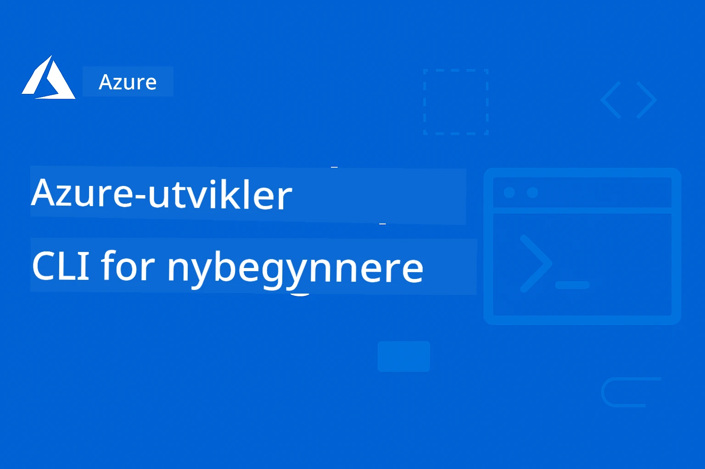

# AZD for nybegynnere: En strukturert læringsreise

 

[](https://GitHub.com/microsoft/azd-for-beginners/watchers/)
[](https://GitHub.com/microsoft/azd-for-beginners/network/)
[](https://GitHub.com/microsoft/azd-for-beginners/stargazers/)

[](https://discord.com/invite/nkVh3dp)
[](https://discord.gg/nTYy5BXMWG)

---

### Automatiske oversettelser (alltid oppdatert)

<!-- CO-OP TRANSLATOR LANGUAGES TABLE START -->
[Arabisk](../ar/README.md) | [Bengali](../bn/README.md) | [Bulgarsk](../bg/README.md) | [Burmesisk (Myanmar)](../my/README.md) | [Kinesisk (forenklet)](../zh-CN/README.md) | [Kinesisk (tradisjonell, Hong Kong)](../zh-HK/README.md) | [Kinesisk (tradisjonell, Macau)](../zh-MO/README.md) | [Kinesisk (tradisjonell, Taiwan)](../zh-TW/README.md) | [Kroatisk](../hr/README.md) | [Tsjekkisk](../cs/README.md) | [Dansk](../da/README.md) | [Nederlandsk](../nl/README.md) | [Estisk](../et/README.md) | [Finsk](../fi/README.md) | [Fransk](../fr/README.md) | [Tysk](../de/README.md) | [Gresk](../el/README.md) | [Hebraisk](../he/README.md) | [Hindi](../hi/README.md) | [Ungarsk](../hu/README.md) | [Indonesisk](../id/README.md) | [Italiensk](../it/README.md) | [Japansk](../ja/README.md) | [Kannada](../kn/README.md) | [Khmer](../km/README.md) | [Koreansk](../ko/README.md) | [Litauisk](../lt/README.md) | [Malaysisk](../ms/README.md) | [Malayalam](../ml/README.md) | [Marathi](../mr/README.md) | [Nepalsk](../ne/README.md) | [Nigeriansk pidgin](../pcm/README.md) | [Norsk](./README.md) | [Persisk (Farsi)](../fa/README.md) | [Polsk](../pl/README.md) | [Portugisisk (Brasil)](../pt-BR/README.md) | [Portugisisk (Portugal)](../pt-PT/README.md) | [Punjabi (Gurmukhi)](../pa/README.md) | [Rumensk](../ro/README.md) | [Russisk](../ru/README.md) | [Serbisk (kyrillisk)](../sr/README.md) | [Slovakisk](../sk/README.md) | [Slovensk](../sl/README.md) | [Spansk](../es/README.md) | [Swahili](../sw/README.md) | [Svensk](../sv/README.md) | [Tagalog (Filippinsk)](../tl/README.md) | [Tamil](../ta/README.md) | [Telugu](../te/README.md) | [Thai](../th/README.md) | [Tyrkisk](../tr/README.md) | [Ukrainsk](../uk/README.md) | [Urdu](../ur/README.md) | [Vietnamesisk](../vi/README.md)

> **Foretrekker du å klone lokalt?**
>
> Dette depotet inkluderer 50+ språkoversettelser som betydelig øker nedlastingsstørrelsen. For å klone uten oversettelser, bruk sparsommelig utsjekking:
>
> **Bash / macOS / Linux:**
> ```bash
> git clone --filter=blob:none --sparse https://github.com/microsoft/AZD-for-beginners.git
> cd AZD-for-beginners
> git sparse-checkout set --no-cone '/*' '!translations' '!translated_images'
> ```
>
> **CMD (Windows):**
> ```cmd
> git clone --filter=blob:none --sparse https://github.com/microsoft/AZD-for-beginners.git
> cd AZD-for-beginners
> git sparse-checkout set --no-cone "/*" "!translations" "!translated_images"
> ```
>
> Dette gir deg alt du trenger for å fullføre kurset med mye raskere nedlasting.
<!-- CO-OP TRANSLATOR LANGUAGES TABLE END -->

## 🆕 Hva er nytt i azd i dag

Azure Developer CLI har vokst utover tradisjonelle nettapper og API-er. I dag er azd det eneste verktøyet for å distribuere **enhver** applikasjon til Azure – inkludert AI-drevne applikasjoner og intelligente agenter.

Dette betyr for deg:

- **AI-agenter er nå førsteklasses azd arbeidsbelastninger.** Du kan initialisere, distribuere og administrere AI-agentprosjekter med samme `azd init` → `azd up` arbeidsflyt du allerede kjenner.
- **Microsoft Foundry-integrasjon** bringer modellutplassering, agenthosting og AI-tjenestekonfigurasjon direkte inn i azd-maløkosystemet.
- **Kjernearbeidsflyten er uendret.** Enten du distribuerer en todo-app, en mikrotjeneste eller en multi-agent AI-løsning, er kommandoene de samme.

Hvis du har brukt azd tidligere, er AI-støtte en naturlig utvidelse – ikke et eget verktøy eller et avansert spor. Hvis du begynner ferskt, lærer du én arbeidsflyt som fungerer for alt.

---

## 🚀 Hva er Azure Developer CLI (azd)?

**Azure Developer CLI (azd)** er et utviklervennlig kommandolinjeverktøy som gjør det enkelt å distribuere applikasjoner til Azure. I stedet for å manuelt opprette og koble sammen dusinvis av Azure-ressurser, kan du distribuere hele applikasjoner med én enkelt kommando.

### Magien med `azd up`

```bash
# Denne ene kommandoen gjør alt:
# ✅ Oppretter alle Azure-ressursene
# ✅ Konfigurerer nettverk og sikkerhet
# ✅ Bygger applikasjonskoden din
# ✅ Distribuerer til Azure
# ✅ Gir deg en fungerende URL
azd up
```

**Det er alt!** Ingen klikk i Azure-portalen, ingen komplekse ARM-maler å lære først, ingen manuell konfigurasjon – bare fungerende applikasjoner på Azure.

---

## ❓ Azure Developer CLI vs Azure CLI: Hva er forskjellen?

Dette er det vanligste spørsmålet nybegynnere stiller. Her er det enkle svaret:

| Funksjon | **Azure CLI (`az`)** | **Azure Developer CLI (`azd`)** |
|---------|---------------------|--------------------------------|
| **Formål** | Administrere individuelle Azure-ressurser | Distribuere komplette applikasjoner |
| **Tankesett** | Infrastruktur-fokusert | Applikasjons-fokusert |
| **Eksempel** | `az webapp create --name myapp...` | `azd up` |
| **Læringskurve** | Må kjenne Azure-tjenester | Bare kjenne appen din |
| **Best for** | DevOps, Infrastruktur | Utviklere, Prototyping |

### Enkel analogi

- **Azure CLI** er som å ha alle verktøyene til å bygge et hus – hammere, sager, spiker. Du kan bygge hva som helst, men du må kunne konstruksjon.
- **Azure Developer CLI** er som å leie en entreprenør – du beskriver hva du vil ha, og de tar seg av byggingen.

### Når bruke hver

| Situasjon | Bruk dette |
|----------|------------|
| "Jeg vil raskt distribuere webappen min" | `azd up` |
| "Jeg trenger bare å opprette en lagringskonto" | `az storage account create` |
| "Jeg bygger en full AI-applikasjon" | `azd init --template azure-search-openai-demo` |
| "Jeg må feilsøke en spesifikk Azure-ressurs" | `az resource show` |
| "Jeg vil ha produksjonsklar distribusjon på minutter" | `azd up --environment production` |

### De fungerer sammen!

AZD bruker Azure CLI under panseret. Du kan bruke begge:
```bash
# Distribuer appen din med AZD
azd up

# Deretter finjuster spesifikke ressurser med Azure CLI
az webapp config set --name myapp --always-on true
```

---

## 🌟 Finn maler i Awesome AZD

Ikke start fra bunnen! **Awesome AZD** er fellesskapets samling av maler klare til distribusjon:

| Ressurs | Beskrivelse |
|----------|-------------|
| 🔗 [**Awesome AZD Gallery**](https://azure.github.io/awesome-azd/) | Bla gjennom 200+ maler med ett-klikk-distribusjon |
| 🔗 [**Send inn en mal**](https://github.com/Azure/awesome-azd/issues) | Bidra med din egen mal til fellesskapet |
| 🔗 [**GitHub-lager**](https://github.com/Azure/awesome-azd) | Gi stjerne og utforsk koden |

### Populære AI-maler fra Awesome AZD

```bash
# RAG-chat med Microsoft Foundry-modeller + AI-søk
azd init --template azure-search-openai-demo

# Rask AI-chatapplikasjon
azd init --template openai-chat-app-quickstart

# AI-agenter med Foundry-agenter
azd init --template get-started-with-ai-agents
```

---

## 🎯 Kom i gang i 3 steg

Før du begynner, sørg for at maskinen din er klar for malen du vil distribuere:

**Windows:**
```powershell
.\validate-setup.ps1
```

**macOS / Linux:**
```bash
bash ./validate-setup.sh
```

Hvis noen nødvendige sjekker feiler, fiks det først og fortsett deretter med kjapp start.

### Steg 1: Installer AZD (2 minutter)

**Windows:**
```powershell
winget install microsoft.azd
```

**macOS:**
```bash
brew tap azure/azd && brew install azd
```

**Linux:**
```bash
curl -fsSL https://aka.ms/install-azd.sh | bash
```


### Steg 2: Autentiser for AZD

```bash
# Valgfritt hvis du planlegger å bruke Azure CLI-kommandoer direkte i dette kurset
az login

# Påkrevd for AZD-arbeidsflyter
azd auth login
```

Hvis du er usikker på hvilken du trenger, følg hele oppsettflyten i [Installasjon & Oppsett](docs/chapter-01-foundation/installation.md#authentication-setup).

### Steg 3: Distribuer din første app

```bash
# Initialiser fra en mal
azd init --template todo-nodejs-mongo

# Distribuer til Azure (oppretter alt!)
azd up
```

**🎉 Ferdig!** Appen din er nå live på Azure.

### Rydd opp (ikke glem!)

```bash
# Remove all resources when done experimenting
azd down --force --purge
```

---

## 📚 Hvordan bruke dette kurset

Dette kurset er utformet for **progressiv læring** – start der du er komfortabel og jobb deg oppover:

| Din erfaring | Start her |
|--------------|-----------|
| **Helt ny på Azure** | [Kapittel 1: Grunnlag](#-chapter-1-foundation--quick-start) |
| **Kan Azure, ny på AZD** | [Kapittel 1: Grunnlag](#-chapter-1-foundation--quick-start) |
| **Vil distribuere AI-apper** | [Kapittel 2: AI-første utvikling](#-chapter-2-ai-first-development-recommended-for-ai-developers) |
| **Vil ha praktisk trening** | [🎓 Interaktivt verksted](workshop/README.md) – 3-4 timers guidet lab |
| **Trenger produksjonsmønstre** | [Kapittel 8: Produksjon & Enterprise](#-chapter-8-production--enterprise-patterns) |

### Raskt oppsett

1. **Fork dette depotet**: [](https://GitHub.com/microsoft/azd-for-beginners/fork)
2. **Klon det**: `git clone https://github.com/YOUR-USERNAME/azd-for-beginners.git`
3. **Få hjelp**: [Azure Discord Community](https://discord.com/invite/ByRwuEEgH4)

> **Foretrekker du å klone lokalt?**

> Dette depotet inkluderer 50+ språkoversettelser som betydelig øker nedlastingsstørrelsen. For å klone uten oversettelser, bruk sparsommelig utsjekking:
> ```bash
> git clone --filter=blob:none --sparse https://github.com/microsoft/AZD-for-beginners.git
> cd AZD-for-beginners
> git sparse-checkout set --no-cone '/*' '!translations' '!translated_images'
> ```
> Dette gir deg alt du trenger for å fullføre kurset med mye raskere nedlasting.


## Kursoversikt

Mestre Azure Developer CLI (azd) gjennom strukturerte kapitler designet for progressiv læring. **Spesiell fokus på AI-applikasjonsdistribusjon med Microsoft Foundry-integrasjon.**

### Hvorfor dette kurset er viktig for moderne utviklere

Basert på innsikter fra Microsoft Foundry Discord-fellesskapet, ønsker **45% av utviklere å bruke AZD for AI-arbeidsbelastninger**, men møter utfordringer med:
- Komplekse AI-arkitekturer med mange tjenester
- Beste praksis for produksjonsdistribusjon av AI  
- Azure AI-tjenesteintegrasjon og konfigurasjon
- Kostnadsoptimalisering for AI-arbeidsbelastninger
- Feilsøking av AI-spesifikke distribusjonsproblemer

### Læringsmål

Ved å fullføre dette strukturerte kurset vil du:
- **Mestre AZD-grunnleggende**: Kjernebegreper, installasjon og konfigurasjon
- **Distribuere AI-applikasjoner**: Bruke AZD med Microsoft Foundry-tjenester
- **Implementere Infrastruktur som kode**: Administrere Azure-ressurser med Bicep-mal
- **Feilsøke distribusjoner**: Løse vanlige problemer og debugge feil
- **Optimalisere for produksjon**: Sikkerhet, skalering, overvåking og kostnadsstyring
- **Bygge multi-agent løsninger**: Distribuere komplekse AI-arkitekturer

## Før du begynner: Kontoer, tilgang og forutsetninger

Før du starter Kapittel 1, sørg for at du har følgende på plass. Installasjonstrinnene senere i denne guiden forutsetter at disse grunnleggende tingene allerede er håndtert.
- **Et Azure-abonnement**: Du kan bruke et eksisterende abonnement fra jobb eller din egen konto, eller opprette en [gratis prøveperiode](https://aka.ms/azurefreetrial) for å komme i gang.
- **Tillatelse til å opprette Azure-ressurser**: For de fleste øvelser bør du ha minst **Bidragsyter**-tilgang på målabonnementet eller ressursgruppen. Noen kapitler antar også at du kan opprette ressursgrupper, administrerte identiteter og RBAC-tildelinger.
- [**En GitHub-konto**](https://github.com): Dette er nyttig for å forke repositoriet, følge dine egne endringer og bruke GitHub Codespaces for workshoppen.
- **Forutsetninger for malens kjøringstid**: Noen maler krever lokale verktøy som Node.js, Python, Java eller Docker. Kjør oppsettvalidatoren før du begynner, slik at du oppdager manglende verktøy tidlig.
- **Grunnleggende terminalkunnskap**: Du trenger ikke å være ekspert, men du bør være komfortabel med å kjøre kommandoer som `git clone`, `azd auth login`, og `azd up`.

> **Jobber du i et bedriftsabonnement?**
> Hvis Azure-miljøet ditt styres av en administrator, bekreft på forhånd at du kan distribuere ressurser i abonnementet eller ressursgruppen du planlegger å bruke. Hvis ikke, be om et sandkasseabonnement eller Bidragsyter-tilgang før du starter.

> **Ny til Azure?**
> Start med ditt eget Azure-prøveabonnement eller betal-som-du-går-abonnement på https://aka.ms/azurefreetrial slik at du kan fullføre øvelsene fra start til slutt uten å vente på godkjenninger på leietakernivå.

## 🗺️ Kurskart: Rask navigering etter kapittel

Hvert kapittel har en dedikert README med læringsmål, raske startere og øvelser:

| Kapittel | Emne | Leksjoner | Varighet | Vanskelighetsgrad |
|---------|-------|---------|----------|------------|
| **[Kap 1: Grunnlag](docs/chapter-01-foundation/README.md)** | Komme i gang | [AZD Basics](docs/chapter-01-foundation/azd-basics.md) &#124; [Installasjon](docs/chapter-01-foundation/installation.md) &#124; [Første prosjekt](docs/chapter-01-foundation/first-project.md) | 30-45 min | ⭐ |
| **[Kap 2: AI-utvikling](docs/chapter-02-ai-development/README.md)** | AI-første apper | [Foundry-integrasjon](docs/chapter-02-ai-development/microsoft-foundry-integration.md) &#124; [AI-agenter](docs/chapter-02-ai-development/agents.md) &#124; [Modell distribusjon](docs/chapter-02-ai-development/ai-model-deployment.md) &#124; [Workshop](docs/chapter-02-ai-development/ai-workshop-lab.md) | 1-2 t | ⭐⭐ |
| **[Kap 3: Konfigurasjon](docs/chapter-03-configuration/README.md)** | Autentisering og sikkerhet | [Konfigurasjon](docs/chapter-03-configuration/configuration.md) &#124; [Autentisering & sikkerhet](docs/chapter-03-configuration/authsecurity.md) | 45-60 min | ⭐⭐ |
| **[Kap 4: Infrastruktur](docs/chapter-04-infrastructure/README.md)** | IaC & distribusjon | [Distribusjonsveiledning](docs/chapter-04-infrastructure/deployment-guide.md) &#124; [Provisionering](docs/chapter-04-infrastructure/provisioning.md) | 1-1.5 t | ⭐⭐⭐ |
| **[Kap 5: Multi-agent](docs/chapter-05-multi-agent/README.md)** | AI-agentløsninger | [Detaljhandelsscenario](examples/retail-scenario.md) &#124; [Koordineringsmønstre](docs/chapter-06-pre-deployment/coordination-patterns.md) | 2-3 t | ⭐⭐⭐⭐ |
| **[Kap 6: Forhåndsdistribusjon](docs/chapter-06-pre-deployment/README.md)** | Planlegging og validering | [Forundersøkelser](docs/chapter-06-pre-deployment/preflight-checks.md) &#124; [Kapasitetsplanlegging](docs/chapter-06-pre-deployment/capacity-planning.md) &#124; [SKU-valg](docs/chapter-06-pre-deployment/sku-selection.md) &#124; [App Insights](docs/chapter-06-pre-deployment/application-insights.md) | 1 t | ⭐⭐ |
| **[Kap 7: Feilsøking](docs/chapter-07-troubleshooting/README.md)** | Debugging og feilretting | [Vanlige problemer](docs/chapter-07-troubleshooting/common-issues.md) &#124; [Feilsøking](docs/chapter-07-troubleshooting/debugging.md) &#124; [AI-problemer](docs/chapter-07-troubleshooting/ai-troubleshooting.md) | 1-1.5 t | ⭐⭐ |
| **[Kap 8: Produksjon](docs/chapter-08-production/README.md)** | Bedriftsmønstre | [Produksjonspraksis](docs/chapter-08-production/production-ai-practices.md) | 2-3 t | ⭐⭐⭐⭐ |
| **[🎓 Workshop](workshop/README.md)** | Praktisk lab | [Introduksjon](workshop/docs/instructions/0-Introduction.md) &#124; [Valg](workshop/docs/instructions/1-Select-AI-Template.md) &#124; [Validering](workshop/docs/instructions/2-Validate-AI-Template.md) &#124; [Nedbryting](workshop/docs/instructions/3-Deconstruct-AI-Template.md) &#124; [Konfigurasjon](workshop/docs/instructions/4-Configure-AI-Template.md) &#124; [Tilpasning](workshop/docs/instructions/5-Customize-AI-Template.md) &#124; [Nedrigging](workshop/docs/instructions/6-Teardown-Infrastructure.md) &#124; [Oppsummering](workshop/docs/instructions/7-Wrap-up.md) | 3-4 t | ⭐⭐ |

**Total kursvarighet:** ~10-14 timer | **Ferdighetsutvikling:** Nybegynner → Klart for produksjon

---

## 📚 Læringskapitler

*Velg din læringsvei basert på erfaringsnivå og mål*

### 🚀 Kapittel 1: Grunnlag & rask start
**Forutsetninger**: Azure-abonnement, grunnleggende kjennskap til kommandolinje  
**Varighet**: 30-45 minutter  
**Vanskelighet**: ⭐

#### Hva du vil lære
- Forstå grunnleggende om Azure Developer CLI
- Installere AZD på din plattform
- Din første vellykkede distribusjon

#### Læringsressurser
- **🎯 Start her**: [Hva er Azure Developer CLI?](#what-is-azure-developer-cli)
- **📖 Teori**: [AZD Basics](docs/chapter-01-foundation/azd-basics.md) - Grunnleggende konsepter og terminologi
- **⚙️ Oppsett**: [Installasjon og oppsett](docs/chapter-01-foundation/installation.md) - Plattformspesifikke guider
- **🛠️ Praktisk**: [Ditt første prosjekt](docs/chapter-01-foundation/first-project.md) - Trinnvis veiledning
- **📋 Rask referanse**: [Kommandooversikt](resources/cheat-sheet.md)

#### Praktiske øvelser
```bash
# Rask installasjonskontroll
azd version

# Distribuer din første applikasjon
azd init --template todo-nodejs-mongo
azd up
```

**💡 Kapittelresultat**: Distribuere en enkel webapplikasjon til Azure ved å bruke AZD

**✅ Suksessvalidering:**
```bash
# Etter å ha fullført kapittel 1, bør du kunne:
azd version              # Viser installert versjon
azd init --template todo-nodejs-mongo  # Initialiserer prosjekt
azd up                  # Distribuerer til Azure
azd show                # Viser URL for kjørende app
# Applikasjonen åpnes i nettleser og fungerer
azd down --force --purge  # Rydder opp ressurser
```

**📊 Tidsbruk:** 30-45 minutter  
**📈 Ferdighetsnivå etter:** Kan distribuere grunnleggende applikasjoner på egen hånd  
**📈 Ferdighetsnivå etter:** Kan distribuere grunnleggende applikasjoner på egen hånd

---

### 🤖 Kapittel 2: AI-første utvikling (Anbefalt for AI-utviklere)
**Forutsetninger**: Kapittel 1 fullført  
**Varighet**: 1-2 timer  
**Vanskelighet**: ⭐⭐

#### Hva du vil lære
- Microsoft Foundry-integrasjon med AZD
- Distribusjon av AI-drevne applikasjoner
- Forståelse av AI-tjenestekonfigurasjoner

#### Læringsressurser
- **🎯 Start her**: [Microsoft Foundry-integrasjon](docs/chapter-02-ai-development/microsoft-foundry-integration.md)
- **🤖 AI-agenter**: [AI-agenter veiledning](docs/chapter-02-ai-development/agents.md) - Distribuer intelligente agenter med AZD
- **📖 Mønstre**: [AI-modell distribusjon](docs/chapter-02-ai-development/ai-model-deployment.md) - Distribuer og administrer AI-modeller
- **🛠️ Workshop**: [AI Workshop Lab](docs/chapter-02-ai-development/ai-workshop-lab.md) - Gjør AI-løsningene dine klar for AZD
- **🎥 Interaktiv guide**: [Workshop-materialer](workshop/README.md) - Nettleserbasert læring med MkDocs * DevContainer-miljø
- **📋 Maler**: [Microsoft Foundry-maler](#workshop-ressurser)
- **📝 Eksempler**: [AZD distribusjonseksempler](examples/README.md)

#### Praktiske øvelser
```bash
# Distribuer din første AI-applikasjon
azd init --template azure-search-openai-demo
azd up

# Prøv flere AI-maler
azd init --template openai-chat-app-quickstart
azd init --template agent-openai-python-prompty
```

**💡 Kapittelresultat**: Distribuere og konfigurere en AI-drevet chatapplikasjon med RAG-funksjonalitet

**✅ Suksessvalidering:**
```bash
# Etter kapittel 2 skal du kunne:
azd init --template azure-search-openai-demo
azd up
# Teste AI-chatgrensesnittet
# Stille spørsmål og få AI-drevne svar med kilder
# Verifisere at søkeintegrasjonen fungerer
azd monitor  # Sjekke at Application Insights viser telemetri
azd down --force --purge
```

**📊 Tidsbruk:** 1-2 timer  
**📈 Ferdighetsnivå etter:** Kan distribuere og konfigurere produksjonsklare AI-applikasjoner  
**💰 Kostnadsbevissthet:** Forstå utviklingskostnader på $80-150/mnd, produksjonskostnader $300-3500/mnd

#### 💰 Kostnadshensyn for AI-distribusjoner

**Utviklingsmiljø (Estimert $80-150/mnd):**
- Microsoft Foundry-modeller (betal-som-du-går): $0-50/mnd (avhengig av token-bruk)
- AI Search (grunnleggende nivå): $75/mnd
- Container Apps (forbruk): $0-20/mnd
- Lagring (standard): $1-5/mnd

**Produksjonsmiljø (Estimert $300-3 500+/mnd):**
- Microsoft Foundry-modeller (PTU for stabil ytelse): $3 000+/mnd ELLER Betal-som-du-går med høyt volum
- AI Search (standard nivå): $250/mnd
- Container Apps (dedikert): $50-100/mnd
- Application Insights: $5-50/mnd
- Lagring (premium): $10-50/mnd

**💡 Kostnadsoptimaliseringstips:**
- Bruk **gratisnivå** Microsoft Foundry-modeller for læring (Azure OpenAI 50 000 tokens/mnd inkludert)
- Kjør `azd down` for å fjerne ressurser når du ikke aktivt utvikler
- Start med forbruksbasert fakturering, oppgrader til PTU bare i produksjon
- Bruk `azd provision --preview` for å estimere kostnader før distribusjon
- Aktiver autoskalering: betal kun for faktisk bruk

**Kostnadsmonitorering:**
```bash
# Sjekk estimerte månedlige kostnader
azd provision --preview

# Overvåk faktiske kostnader i Azure-portalen
az consumption budget list --resource-group <your-rg>
```

---

### ⚙️ Kapittel 3: Konfigurasjon og autentisering
**Forutsetninger**: Kapittel 1 fullført  
**Varighet**: 45-60 minutter  
**Vanskelighet**: ⭐⭐

#### Hva du vil lære
- Miljøkonfigurasjon og administrasjon
- Autentisering og beste praksis for sikkerhet
- Navngivning og organisering av ressurser

#### Læringsressurser
- **📖 Konfigurasjon**: [Konfigurasjonsveiledning](docs/chapter-03-configuration/configuration.md) - Miljøoppsett
- **🔐 Sikkerhet**: [Autentiseringsmønstre og administrert identitet](docs/chapter-03-configuration/authsecurity.md) - Autentiseringsmønstre
- **📝 Eksempler**: [Databaseapp-eksempel](examples/database-app/README.md) - AZD databaseeksempler

#### Praktiske øvelser
- Konfigurer flere miljøer (utvikling, staging, produksjon)
- Sett opp autentisering med administrert identitet
- Implementer miljøspesifikke konfigurasjoner

**💡 Kapittelresultat**: Administrer flere miljøer med riktig autentisering og sikkerhet

---

### 🏗️ Kapittel 4: Infrastruktur som kode og distribusjon
**Forutsetninger**: Kapitler 1-3 fullført  
**Varighet**: 1-1.5 timer  
**Vanskelighet**: ⭐⭐⭐

#### Hva du vil lære
- Avanserte distribusjonsmønstre
- Infrastruktur som kode med Bicep
- Strategier for ressursprovisjonering

#### Læringsressurser
- **📖 Distribusjon**: [Distribusjonsveiledning](docs/chapter-04-infrastructure/deployment-guide.md) - Fullstendige arbeidsflyter
- **🏗️ Provisionering**: [Provisionering av ressurser](docs/chapter-04-infrastructure/provisioning.md) - Azure ressursadministrasjon
- **📝 Eksempler**: [Container App-eksempel](../../examples/container-app) - Containeriserte distribusjoner

#### Praktiske øvelser
- Lag egendefinerte Bicep-maler
- Distribuer multi-tjenesteapplikasjoner
- Implementer blue-green distribusjonsstrategier

**💡 Kapittelresultat**: Distribuer komplekse multi-tjenesteapplikasjoner ved hjelp av egendefinerte infrastrukturen-maler

---

### 🎯 Kapittel 5: Multi-agent AI-løsninger (Avansert)
**Forutsetninger**: Kapitler 1-2 fullført  
**Varighet**: 2-3 timer  
**Vanskelighet**: ⭐⭐⭐⭐

#### Hva du vil lære
- Arkitekturmønstre for multi-agent
- Agent-orkestrering og koordinasjon
- Produksjonsklare AI-distribusjoner

#### Læringsressurser
- **🤖 Utvalgt prosjekt**: [Detaljhandel Multi-Agent-løsning](examples/retail-scenario.md) - Full implementering
- **🛠️ ARM-maler**: [ARM-malpakke](../../examples/retail-multiagent-arm-template) - Ett-klikk distribusjon
- **📖 Arkitektur**: [Koordineringsmønstre for multi-agent](docs/chapter-06-pre-deployment/coordination-patterns.md) - Mønstre

#### Praktiske øvelser
```bash
# Distribuer den komplette detaljhandelsløsningen med flere agenter
cd examples/retail-multiagent-arm-template
./deploy.sh

# Utforsk agentkonfigurasjoner
az deployment group show --resource-group <rg-name> --name <deployment-name>
```

**💡 Kapittelresultat**: Distribuer og administrer en produksjonsklar multi-agent AI-løsning med Kunde- og Lager-agenter

---

### 🔍 Kapittel 6: Forhåndsdistribusjonsvalidering og planlegging
**Forutsetninger**: Kapittel 4 fullført  
**Varighet**: 1 time  
**Vanskelighet**: ⭐⭐
#### Hva du vil lære
- Kapasitetsplanlegging og ressursvalidering
- Strategier for SKU-valg
- Forhåndssjekker og automatisering

#### Læringsressurser
- **📊 Planlegging**: [Capacity Planning](docs/chapter-06-pre-deployment/capacity-planning.md) - Ressursvalidering
- **💰 Valg**: [SKU Selection](docs/chapter-06-pre-deployment/sku-selection.md) - Kostnadseffektive valg
- **✅ Validering**: [Pre-flight Checks](docs/chapter-06-pre-deployment/preflight-checks.md) - Automatiserte skript

#### Praktiske øvelser
- Kjør valideringsskript for kapasitet
- Optimaliser SKU-valg for kostnad
- Implementer automatiserte forhåndssjekker før distribusjon

**💡 Kapittelresultat**: Valider og optimaliser distribusjoner før utførelse

---

### 🚨 Kapittel 7: Feilsøking og debugging
**Forutsetninger**: Fullført et distribusjonskapittel  
**Varighet**: 1-1,5 timer  
**Kompleksitet**: ⭐⭐

#### Hva du vil lære
- Systematiske tilnærminger til debugging
- Vanlige problemer og løsninger
- AI-spesifikk feilsøking

#### Læringsressurser
- **🔧 Vanlige problemer**: [Common Issues](docs/chapter-07-troubleshooting/common-issues.md) - FAQ og løsninger
- **🕵️ Debugging**: [Debugging Guide](docs/chapter-07-troubleshooting/debugging.md) - Trinnvise strategier
- **🤖 AI-problemer**: [AI-Specific Troubleshooting](docs/chapter-07-troubleshooting/ai-troubleshooting.md) - AI-tjenesteproblemer

#### Praktiske øvelser
- Diagnostiser distribusjonsfeil
- Løs autentiseringsproblemer
- Debugg tilkoblingsproblemer til AI-tjenester

**💡 Kapittelresultat**: Selvstendig diagnostisere og løse vanlige distribusjonsproblemer

---

### 🏢 Kapittel 8: Produksjon og bedriftsmønstre
**Forutsetninger**: Kapitlene 1-4 fullført  
**Varighet**: 2-3 timer  
**Kompleksitet**: ⭐⭐⭐⭐

#### Hva du vil lære
- Strategier for produksjonsdistribusjon
- Sikkerhetsmønstre for bedriftsbruk
- Overvåking og kostnadsoptimalisering

#### Læringsressurser
- **🏭 Produksjon**: [Production AI Best Practices](docs/chapter-08-production/production-ai-practices.md) - Bedriftsmønstre
- **📝 Eksempler**: [Microservices Example](../../examples/microservices) - Komplekse arkitekturer
- **📊 Overvåking**: [Application Insights integration](docs/chapter-06-pre-deployment/application-insights.md) - Overvåking

#### Praktiske øvelser
- Implementer bedrifts-sikkerhetsmønstre
- Sett opp omfattende overvåking
- Distribuer til produksjon med riktig styring

**💡 Kapittelresultat**: Distribuer bedriftsklare applikasjoner med full produksjonskapasitet

---

## 🎓 Workshop Oversikt: Praktisk læringserfaring

> **⚠️ WORKSHOP STATUS: Aktiv utvikling**  
> Workshop-materialet utvikles og forbedres for øyeblikket. Kjerne-moduler fungerer, men noen avanserte seksjoner er uferdige. Vi jobber aktivt med å fullføre alt innhold. [Følg fremdriften →](workshop/README.md)

### Interaktive workshop-materialer
**Omfattende praktisk læring med nettleserbaserte verktøy og guidede øvelser**

Våre workshop-materialer gir en strukturert, interaktiv læringsopplevelse som utfyller det kapittelbaserte pensumet ovenfor. Workshoppen er designet for både selvstyrt læring og instruktørledede økter.

#### 🛠️ Workshop-funksjoner
- **Nettleserbasert grensesnitt**: Fullstendig MkDocs-basert workshop med søk, kopi og tema-funksjoner
- **GitHub Codespaces-integrasjon**: Ett-klikks oppsett av utviklingsmiljø
- **Strukturert læringssti**: 8-moduls guidede øvelser (totalt 3-4 timer)
- **Progressiv metodikk**: Introduksjon → Valg → Validering → Nedbrytning → Konfigurasjon → Tilpasning → Nedrigging → Oppsummering
- **Interaktiv DevContainer-miljø**: Forhåndskonfigurerte verktøy og avhengigheter

#### 📚 Workshop modulstruktur
Workshoppen følger en **8-moduls progressiv metodikk** som tar deg fra oppdagelse til mestring av distribusjon:

| Modul | Tema | Hva du gjør | Varighet |
|--------|-------|----------------|----------|
| **0. Introduksjon** | Workshop oversikt | Forstå læringsmål, forutsetninger og workshop struktur | 15 min |
| **1. Valg** | Malutforsking | Utforsk AZD-maler og velg riktig AI-mal for ditt scenario | 20 min |
| **2. Validering** | Distribuer og verifiser | Distribuer malen med `azd up` og valider infrastruktur fungerer | 30 min |
| **3. Nedbrytning** | Forstå struktur | Bruk GitHub Copilot til å utforske malarkitektur, Bicep-filer og kodeorganisering | 30 min |
| **4. Konfigurasjon** | Azure.yaml i dybden | Mestre `azure.yaml` konfigurasjon, livssyklus-kroker og miljøvariabler | 30 min |
| **5. Tilpasning** | Gjør det ditt | Aktiver AI Search, sporing, evaluering, og tilpass for ditt scenario | 45 min |
| **6. Nedrigging** | Rydd opp | Trygt avvikle ressurser med `azd down --purge` | 15 min |
| **7. Oppsummering** | Neste steg | Gå gjennom resultater, nøkkelkonsepter, og fortsett læringsreisen | 15 min |

**Workshopflyt:**  
```
Introduction → Selection → Validation → Deconstruction → Configuration → Customization → Teardown → Wrap-up
     ↓            ↓           ↓              ↓               ↓              ↓            ↓           ↓
  Overview    Find the     Deploy &      Explore        Master         Customize     Clean up    Review &
             right        verify        code &        azure.yaml      for your      resources   next steps
             template                   structure                     scenario
```
  
#### 🚀 Komme i gang med workshoppen  
```bash
# Alternativ 1: GitHub Codespaces (Anbefalt)
# Klikk "Code" → "Create codespace on main" i depotet

# Alternativ 2: Lokal utvikling
git clone https://github.com/microsoft/azd-for-beginners.git
cd azd-for-beginners/workshop
# Følg oppsettsinstruksjonene i workshop/README.md
```
  
#### 🎯 Workshop læringsmål  
Ved å fullføre workshoppen vil deltakerne:  
- **Distribuere produksjonsklare AI-applikasjoner**: Bruke AZD med Microsoft Foundry-tjenester  
- **Mestre multi-agent arkitekturer**: Implementere koordinerte AI-agentløsninger  
- **Implementere sikkerhetsbest practices**: Konfigurere autentisering og tilgangskontroll  
- **Optimalisere for skala**: Designe kostnadseffektive og høyytelses distribusjoner  
- **Feilsøke distribusjoner**: Løse vanlige problemer selvstendig

#### 📖 Workshop-ressurser
- **🎥 Interaktiv guide**: [Workshop Materials](workshop/README.md) - Nettleserbasert læringsmiljø  
- **📋 Modul-for-modul instruksjoner**:  
  - [0. Introduksjon](workshop/docs/instructions/0-Introduction.md) - Workshop oversikt og mål  
  - [1. Valg](workshop/docs/instructions/1-Select-AI-Template.md) - Finn og velg AI-maler  
  - [2. Validering](workshop/docs/instructions/2-Validate-AI-Template.md) - Distribuer og verifiser maler  
  - [3. Nedbrytning](workshop/docs/instructions/3-Deconstruct-AI-Template.md) - Utforsk malarkitektur  
  - [4. Konfigurasjon](workshop/docs/instructions/4-Configure-AI-Template.md) - Mestre azure.yaml  
  - [5. Tilpasning](workshop/docs/instructions/5-Customize-AI-Template.md) - Tilpass for ditt scenario  
  - [6. Nedrigging](workshop/docs/instructions/6-Teardown-Infrastructure.md) - Rydd opp ressurser  
  - [7. Oppsummering](workshop/docs/instructions/7-Wrap-up.md) - Oppsummering og neste steg  
- **🛠️ AI Workshop Lab**: [AI Workshop Lab](docs/chapter-02-ai-development/ai-workshop-lab.md) - AI-fokuserte øvelser  
- **💡 Rask start**: [Workshop Setup Guide](workshop/README.md#quick-start) - Miljøkonfigurasjon

**Perfekt for**: Bedriftstrening, universitetskurs, selvstyrt læring og utviklerbootcamps.

---

## 📖 Grundig gjennomgang: AZD-funksjonalitet

Utover det grunnleggende gir AZD kraftige funksjoner for produksjonsdistribusjoner:

- **Malbaserte distribusjoner** – Bruk forhåndsbygde maler for vanlige applikasjonsmønstre  
- **Infrastruktur som kode** – Administrer Azure-ressurser med Bicep eller Terraform  
- **Integrerte arbeidsflyter** – Søk, distribuer og overvåk applikasjoner sømløst  
- **Utviklervennlig** – Optimalisert for utviklerproduktivitet og brukeropplevelse

### **AZD + Microsoft Foundry: Perfekt for AI-distribusjoner**

**Hvorfor AZD for AI-løsninger?** AZD adresserer de største utfordringene AI-utviklere møter:

- **AI-klare maler** – Forhåndskonfigurerte maler for Microsoft Foundry-modeller, Cognitive Services og ML-arbeidsbelastninger  
- **Sikre AI-distribusjoner** – Innebygde sikkerhetsmønstre for AI-tjenester, API-nøkler og modelendepunkter  
- **Produksjonsmønstre for AI** – Beste praksis for skalerbare, kostnadseffektive AI-applikasjoner  
- **Ende-til-ende AI-arbeidsflyter** – Fra modellutvikling til produksjonsdistribusjon med riktig overvåking  
- **Kostnadsoptimalisering** – Smarte ressursallokering og skalering for AI-arbeidsbelastninger  
- **Microsoft Foundry-integrasjon** – Sømløs kobling til Microsoft Foundry-modellkatalog og endepunkter

---

## 🎯 Maler og eksempelbibliotek

### Fremhevet: Microsoft Foundry-maler
**Start her hvis du distribuerer AI-applikasjoner!**

> **Merk:** Disse malene viser forskjellige AI-mønstre. Noen er eksterne Azure Samples, andre er lokale implementasjoner.

| Mal | Kapittel | Kompleksitet | Tjenester | Type |
|----------|---------|------------|----------|------|
| [**Get started with AI chat**](https://github.com/Azure-Samples/get-started-with-ai-chat) | Kapittel 2 | ⭐⭐ | AzureOpenAI + Azure AI Model Inference API + Azure AI Search + Azure Container Apps + Application Insights | Ekstern |
| [**Get started with AI agents**](https://github.com/Azure-Samples/get-started-with-ai-agents) | Kapittel 2 | ⭐⭐ | Foundry Agents + AzureOpenAI + Azure AI Search + Azure Container Apps + Application Insights| Ekstern |
| [**Azure Search + OpenAI Demo**](https://github.com/Azure-Samples/azure-search-openai-demo) | Kapittel 2 | ⭐⭐ | AzureOpenAI + Azure AI Search + App Service + Storage | Ekstern |
| [**OpenAI Chat App Quickstart**](https://github.com/Azure-Samples/openai-chat-app-quickstart) | Kapittel 2 | ⭐ | AzureOpenAI + Container Apps + Application Insights | Ekstern |
| [**Agent OpenAI Python Prompty**](https://github.com/Azure-Samples/agent-openai-python-prompty) | Kapittel 5 | ⭐⭐⭐ | AzureOpenAI + Azure Functions + Prompty | Ekstern |
| [**Contoso Chat RAG**](https://github.com/Azure-Samples/contoso-chat) | Kapittel 8 | ⭐⭐⭐⭐ | AzureOpenAI + AI Search + Cosmos DB + Container Apps | Ekstern |
| [**Retail Multi-Agent Solution**](examples/retail-scenario.md) | Kapittel 5 | ⭐⭐⭐⭐ | AzureOpenAI + AI Search + Storage + Container Apps + Cosmos DB | **Lokal** |

### Fremhevet: Fullstendige læringsscenarioer
**Produksjonsklare applikasjonsmaler kartlagt til læringskapitler**

| Mal | Læringskapittel | Kompleksitet | Nøkkellæring |
|----------|------------------|------------|--------------|
| [**openai-chat-app-quickstart**](https://github.com/Azure-Samples/openai-chat-app-quickstart) | Kapittel 2 | ⭐ | Grunnleggende AI distribusjonsmønstre |
| [**azure-search-openai-demo**](https://github.com/Azure-Samples/azure-search-openai-demo) | Kapittel 2 | ⭐⭐ | RAG-implementering med Azure AI Search |
| [**ai-document-processing**](https://github.com/Azure-Samples/ai-document-processing) | Kapittel 4 | ⭐⭐ | Dokumentintelligens-integrasjon |
| [**agent-openai-python-prompty**](https://github.com/Azure-Samples/agent-openai-python-prompty) | Kapittel 5 | ⭐⭐⭐ | Agentrammeverk og funksjonskall |
| [**contoso-chat**](https://github.com/Azure-Samples/contoso-chat) | Kapittel 8 | ⭐⭐⭐ | Enterprise AI-orchestration |
| [**retail-multi-agent-solution**](examples/retail-scenario.md) | Kapittel 5 | ⭐⭐⭐⭐ | Multi-agent arkitektur med Customer og Inventory agenter |

### Læring etter eksempeltype

> **📌 Lokale vs. eksterne eksempler:**  
> **Lokale eksempler** (i dette repoet) = Klare til bruk umiddelbart  
> **Eksterne eksempler** (Azure Samples) = Klon fra lenkede repositorier

#### Lokale eksempler (Klare til bruk)
- [**Retail Multi-Agent Solution**](examples/retail-scenario.md) - Fullstendig produksjonsklar implementasjon med ARM-maler  
  - Multi-agent arkitektur (Customer + Inventory agenter)  
  - Omfattende overvåking og evaluering  
  - Ett-klikk distribusjon via ARM-mal

#### Lokale eksempler - Containerapplikasjoner (Kapitler 2-5)
**Omfattende containerdistribusjonseksempler i dette repoet:**  
- [**Container App Examples**](examples/container-app/README.md) - Fullstendig guide til containeriserte distribusjoner  
  - [Simple Flask API](../../examples/container-app/simple-flask-api) - Enkel REST API med scale-to-zero  
  - [Microservices Architecture](../../examples/container-app/microservices) - Produksjonsklar multi-service distribusjon  
  - Rask start, produksjon og avanserte distribusjonsmønstre  
  - Veiledning for overvåking, sikkerhet og kostnadsoptimalisering

#### Eksterne eksempler - Enkle applikasjoner (Kapitler 1-2)
**Klon disse Azure Samples repositoriene for å komme i gang:**  
- [Simple Web App - Node.js + MongoDB](https://github.com/Azure-Samples/todo-nodejs-mongo) - Grunnleggende distribusjonsmønstre  
- [Static Website - React SPA](https://github.com/Azure-Samples/todo-csharp-sql-swa-func) - Statisk innhold distribusjon  
- [Container App - Python Flask](https://github.com/Azure-Samples/container-apps-store-api-microservice) - REST API distribusjon

#### Eksterne eksempler - Databaseintegrasjon (Kapittel 3-4)  

- [Database App - C# + SQL](https://github.com/Azure-Samples/todo-csharp-sql) - Databasetilkoblingsmønstre
- [Functions + Cosmos DB](https://github.com/Azure-Samples/todo-python-mongo-swa-func) - Serverløs dataflyt

#### Eksterne eksempler - Avanserte mønstre (Kapittel 4-8)
- [Java Microservices](https://github.com/Azure-Samples/java-microservices-aca-lab) - Arkitekturer med flere tjenester
- [Container Apps Jobs](https://github.com/Azure-Samples/container-apps-jobs) - Bakgrunnsbehandling  
- [Enterprise ML Pipeline](https://github.com/Azure-Samples/mlops-v2) - Produksjonsklare ML-mønstre

### Eksterne mal-samlinger
- [**Offisiell AZD mal-galleri**](https://azure.github.io/awesome-azd/) - Kuratert samling av offisielle og fellesskapsmaler
- [**Azure Developer CLI Maler**](https://learn.microsoft.com/en-us/azure/developer/azure-developer-cli/azd-templates) - Microsoft Learn maldokumentasjon
- [**Eksempelkatalog**](examples/README.md) - Lokale læringseksempler med detaljerte forklaringer

---

## 📚 Læringsressurser & Referanser

### Rask referanse
- [**Kommandoliste**](resources/cheat-sheet.md) - Viktige azd-kommandoer organisert etter kapittel
- [**Ordlisten**](resources/glossary.md) - Azure- og azd-terminologi  
- [**FAQ**](resources/faq.md) - Vanlige spørsmål organisert etter lærekapittel
- [**Studieveiledning**](resources/study-guide.md) - Omfattende øvelser

### Praktiske workshops
- [**AI Workshop Lab**](docs/chapter-02-ai-development/ai-workshop-lab.md) - Gjør AI-løsningene dine klar for AZD-distribusjon (2-3 timer)
- [**Interaktiv workshop**](workshop/README.md) - 8-modulers guidede øvelser med MkDocs og GitHub Codespaces
  - Følger: Introduksjon → Utvalg → Validering → Dekonstruksjon → Konfigurasjon → Tilpasning → Nedrigging → Oppsummering

### Eksterne læringsressurser
- [Azure Developer CLI Dokumentasjon](https://learn.microsoft.com/en-us/azure/developer/azure-developer-cli/)
- [Azure Architecture Center](https://learn.microsoft.com/en-us/azure/architecture/)
- [Azure Priskalkulator](https://azure.microsoft.com/pricing/calculator/)
- [Azure Status](https://status.azure.com/)

### AI-agentferdigheter for din redaktør
- [**Microsoft Azure-ferdigheter på skills.sh**](https://skills.sh/microsoft/github-copilot-for-azure) - 37 åpne agent-ferdigheter for Azure AI, Foundry, distribusjon, feilsøking, kostnadsoptimalisering og mer. Installer dem i GitHub Copilot, Cursor, Claude Code eller hvilken som helst støttet agent:
  ```bash
  npx skills add microsoft/github-copilot-for-azure
  ```

---

## 🔧 Rask feilsøkingsguide

**Vanlige problemer nybegynnere møter og umiddelbare løsninger:**

<details>
<summary><strong>❌ "azd: command not found"</strong></summary>

```bash
# Installer AZD først
# Windows (PowerShell):
winget install microsoft.azd

# macOS:
brew tap azure/azd && brew install azd

# Linux:
curl -fsSL https://aka.ms/install-azd.sh | bash

# Bekreft installasjonen
azd version
```
</details>

<details>
<summary><strong>❌ "Ingen abonnement funnet" eller "Abonnement ikke satt"</strong></summary>

```bash
# List tilgjengelige abonnementer
az account list --output table

# Sett standardabonnement
az account set --subscription "<subscription-id-or-name>"

# Sett for AZD-miljø
azd env set AZURE_SUBSCRIPTION_ID "<subscription-id>"

# Verifiser
az account show
```
</details>

<details>
<summary><strong>❌ "InsufficientQuota" eller "Kvote overskredet"</strong></summary>

```bash
# Prøv en annen Azure-region
azd env set AZURE_LOCATION "westus2"
azd up

# Eller bruk mindre SKUer i utvikling
# Rediger infra/main.parameters.json:
{
  "sku": "B1"  // Instead of "P1V2"
}
```
</details>

<details>
<summary><strong>❌ "azd up" feiler halvveis</strong></summary>

```bash
# Alternativ 1: Rengjør og prøv på nytt
azd down --force --purge
azd up

# Alternativ 2: Bare fiks infrastruktur
azd provision

# Alternativ 3: Sjekk detaljert status
azd show

# Alternativ 4: Sjekk logger i Azure Monitor
azd monitor --logs
```
</details>

<details>
<summary><strong>❌ "Autentisering feilet" eller "Token utløpt"</strong></summary>

```bash
# Autentiser på nytt for AZD
azd auth logout
azd auth login

# Valgfritt: oppdater også Azure CLI hvis du kjører az-kommandoer
az logout
az login

# Verifiser autentisering
az account show
```
</details>

<details>
<summary><strong>❌ "Ressurs finnes allerede" eller navnekonflikter</strong></summary>

```bash
# AZD genererer unike navn, men ved konflikt:
azd down --force --purge

# Prøv igjen med et nytt miljø
azd env new dev-v2
azd up
```
</details>

<details>
<summary><strong>❌ Mal-distribusjon tar for lang tid</strong></summary>

**Normale ventetider:**
- Enkel webapp: 5-10 minutter
- App med database: 10-15 minutter
- AI-applikasjoner: 15-25 minutter (OpenAI-provisionering er treg)

```bash
# Sjekk fremdriften
azd show

# Hvis fast >30 minutter, sjekk Azure-portalen:
azd monitor --overview
# Se etter mislykkede distribusjoner
```
</details>

<details>
<summary><strong>❌ "Tillatelse nektet" eller "Forbudt"</strong></summary>

```bash
# Sjekk din Azure-rolle
az role assignment list --assignee $(az account show --query user.name -o tsv)

# Du trenger minst rollen "Bidragsyter"
# Be din Azure-administrator om å gi:
# - Bidragsyter (for ressurser)
# - Brukertilgangsadministrator (for rolleoppgaver)
```
</details>

<details>
<summary><strong>❌ Kan ikke finne URL for distribuert applikasjon</strong></summary>

```bash
# Vis alle tjenestepunkter
azd show

# Eller åpne Azure Portal
azd monitor

# Sjekk spesifikk tjeneste
azd env get-values
# Se etter *_URL variabler
```
</details>

### 📚 Fullstendige feilsøkingsressurser

- **Vanlige problemer-guide:** [Detaljerte løsninger](docs/chapter-07-troubleshooting/common-issues.md)
- **AI-spesifikke problemer:** [AI feilsøking](docs/chapter-07-troubleshooting/ai-troubleshooting.md)
- **Fremgangsmåte for feilsøking:** [Trinnvis feilsøking](docs/chapter-07-troubleshooting/debugging.md)
- **Få hjelp:** [Azure Discord](https://discord.gg/microsoft-azure) #azure-developer-cli

---

## 🎓 Kursfullføring & Sertifisering

### Fremdriftssporing
Spor din læringsfremdrift gjennom hvert kapittel:

- [ ] **Kapittel 1**: Grunnlag & Rask start ✅
- [ ] **Kapittel 2**: AI-første utvikling ✅  
- [ ] **Kapittel 3**: Konfigurasjon & Autentisering ✅
- [ ] **Kapittel 4**: Infrastruktur som kode & distribusjon ✅
- [ ] **Kapittel 5**: Multi-agent AI-løsninger ✅
- [ ] **Kapittel 6**: Validering før distribusjon & planlegging ✅
- [ ] **Kapittel 7**: Feilsøking & debugging ✅
- [ ] **Kapittel 8**: Produksjons- & bedriftsmønstre ✅

### Læringsverifisering
Etter hvert kapittel, verifiser kunnskapen din ved å:
1. **Praktisk øvelse**: Fullfør kapittelens hands-on distribusjon
2. **Kunnskapstjekk**: Gå gjennom FAQ-seksjonen for ditt kapittel
3. **Fellesskapsdiskusjon**: Del erfaringer i Azure Discord
4. **Neste kapittel**: Gå videre til neste kompleksitetsnivå

### Fordeler ved kursfullføring
Etter fullført kurs vil du ha:
- **Produksjonserfaring**: Distribuert ekte AI-applikasjoner til Azure
- **Profesjonelle ferdigheter**: Bedriftsklare distribusjonsmuligheter  
- **Fellesskapsanerkjennelse**: Aktiv medlem i Azure-utviklerfellesskapet
- **Karrierefremgang**: Etterspurt AZD- og AI-distribusjonskompetanse

---

## 🤝 Fellesskap & Støtte

### Få hjelp & støtte
- **Tekniske problemer**: [Rapporter feil og foreslå funksjoner](https://github.com/microsoft/azd-for-beginners/issues)
- **Læringsspørsmål**: [Microsoft Azure Discord-fellesskap](https://discord.gg/microsoft-azure) og [](https://discord.gg/nTYy5BXMWG)
- **AI-spesifikk hjelp**: Bli med i [](https://discord.gg/nTYy5BXMWG)
- **Dokumentasjon**: [Offisiell Azure Developer CLI dokumentasjon](https://learn.microsoft.com/en-us/azure/developer/azure-developer-cli/)

### Fellesskapsinnsikt fra Microsoft Foundry Discord

**Siste meningsmåling fra #Azure-kanalen:**
- **45%** av utviklere ønsker å bruke AZD for AI-arbeidsbelastninger
- **Topp utfordringer**: Distribusjoner med flere tjenester, håndtering av legitimasjon, produksjonsklarhet  
- **Mest etterspurt**: AI-spesifikke maler, feilsøkingsguider, beste praksis

**Bli med i vårt fellesskap for å:**
- Dele erfaringer med AZD + AI og få hjelp
- Få tilgang til tidlige forhåndsvisninger av nye AI-maler
- Bidra til beste praksis for AI-distribusjon
- Påvirke fremtidig AI + AZD funksjonsutvikling

### Bidra til kurset
Vi ønsker bidrag velkommen! Les vår [Bidragsguide](CONTRIBUTING.md) for detaljer om:
- **Forbedring av innhold**: Forbedre eksisterende kapitler og eksempler
- **Nye eksempler**: Legg til virkelige scenarier og maler  
- **Oversettelse**: Hjelp til å vedlikeholde støtte for flere språk
- **Feilrapporter**: Forbedre nøyaktighet og klarhet
- **Fellesskapsstandarder**: Følg våre inkluderende retningslinjer

---

## 📄 Kursinformasjon

### Lisens
Dette prosjektet er lisensiert under MIT-lisensen - se [LICENSE](../../LICENSE) filen for detaljer.

### Relaterte Microsoft læringsressurser

Vårt team produserer andre omfattende læringskurs:

<!-- CO-OP TRANSLATOR OTHER COURSES START -->
### LangChain
[](https://aka.ms/langchain4j-for-beginners)
[](https://aka.ms/langchainjs-for-beginners?WT.mc_id=m365-94501-dwahlin)
[](https://github.com/microsoft/langchain-for-beginners?WT.mc_id=m365-94501-dwahlin)
---

### Azure / Edge / MCP / Agenter
[](https://github.com/microsoft/AZD-for-beginners?WT.mc_id=academic-105485-koreyst)
[](https://github.com/microsoft/edgeai-for-beginners?WT.mc_id=academic-105485-koreyst)
[](https://github.com/microsoft/mcp-for-beginners?WT.mc_id=academic-105485-koreyst)
[](https://github.com/microsoft/ai-agents-for-beginners?WT.mc_id=academic-105485-koreyst)

---
 
### Generativ AI-serie
[](https://github.com/microsoft/generative-ai-for-beginners?WT.mc_id=academic-105485-koreyst)
[-9333EA?style=for-the-badge&labelColor=E5E7EB&color=9333EA)](https://github.com/microsoft/Generative-AI-for-beginners-dotnet?WT.mc_id=academic-105485-koreyst)
[-C084FC?style=for-the-badge&labelColor=E5E7EB&color=C084FC)](https://github.com/microsoft/generative-ai-for-beginners-java?WT.mc_id=academic-105485-koreyst)
[-E879F9?style=for-the-badge&labelColor=E5E7EB&color=E879F9)](https://github.com/microsoft/generative-ai-with-javascript?WT.mc_id=academic-105485-koreyst)

---
 
### Kjerneopplæring
[](https://aka.ms/ml-beginners?WT.mc_id=academic-105485-koreyst)
[](https://aka.ms/datascience-beginners?WT.mc_id=academic-105485-koreyst)
[](https://aka.ms/ai-beginners?WT.mc_id=academic-105485-koreyst)
[](https://github.com/microsoft/Security-101?WT.mc_id=academic-96948-sayoung)
[](https://aka.ms/webdev-beginners?WT.mc_id=academic-105485-koreyst)
[](https://aka.ms/iot-beginners?WT.mc_id=academic-105485-koreyst)
[](https://github.com/microsoft/xr-development-for-beginners?WT.mc_id=academic-105485-koreyst)

---

### Copilot-serien
[](https://aka.ms/GitHubCopilotAI?WT.mc_id=academic-105485-koreyst)
[](https://github.com/microsoft/mastering-github-copilot-for-dotnet-csharp-developers?WT.mc_id=academic-105485-koreyst)
[](https://github.com/microsoft/CopilotAdventures?WT.mc_id=academic-105485-koreyst)
<!-- CO-OP TRANSLATOR OTHER COURSES END -->

---

## 🗺️ Kursnavigasjon

**🚀 Klar til å begynne å lære?**

**Begynnere**: Start med [Kapittel 1: Grunnlag & Rask start](#-chapter-1-foundation--quick-start)  
**AI-utviklere**: Hopp til [Kapittel 2: AI-Først Utvikling](#-chapter-2-ai-first-development-recommended-for-ai-developers)  
**Erfarne utviklere**: Begynn med [Kapittel 3: Konfigurasjon & Autentisering](#️-chapter-3-configuration--authentication)

**Neste steg**: [Begynn Kapittel 1 - AZD Grunnleggende](docs/chapter-01-foundation/azd-basics.md) →

---

<!-- CO-OP TRANSLATOR DISCLAIMER START -->
**Ansvarsfraskrivelse**:  
Dette dokumentet er oversatt ved hjelp av AI-oversettingstjenesten [Co-op Translator](https://github.com/Azure/co-op-translator). Selv om vi streber etter nøyaktighet, vennligst vær oppmerksom på at automatiske oversettelser kan inneholde feil eller unøyaktigheter. Det opprinnelige dokumentet på originalspråket bør betraktes som den autoritative kilden. For kritisk informasjon anbefales profesjonell menneskelig oversettelse. Vi fraskriver oss ansvar for eventuelle misforståelser eller feiltolkninger som måtte oppstå ved bruk av denne oversettelsen.
<!-- CO-OP TRANSLATOR DISCLAIMER END -->