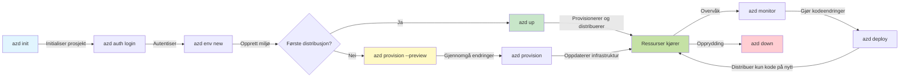
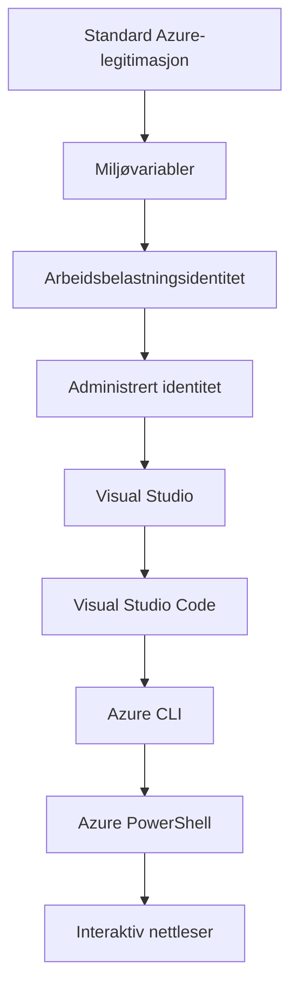

# AZD Basics - Understanding Azure Developer CLI

# AZD Basics - Core Concepts and Fundamentals

**Chapter Navigation:**
- **📚 Course Home**: [AZD For Beginners](../../README.md)
- **📖 Current Chapter**: Chapter 1 - Foundation & Quick Start
- **⬅️ Previous**: [Course Overview](../../README.md#-chapter-1-foundation--quick-start)
- **➡️ Next**: [Installation & Setup](installation.md)
- **🚀 Next Chapter**: [Chapter 2: AI-First Development](../chapter-02-ai-development/microsoft-foundry-integration.md)

## Introduction

Denne leksjonen introduserer deg for Azure Developer CLI (azd), et kraftig kommandolinjeverktøy som akselererer reisen din fra lokal utvikling til distribusjon på Azure. Du vil lære de grunnleggende konseptene, kjernefunksjonene, og forstå hvordan azd forenkler distribusjon av cloud-native applikasjoner.

## Learning Goals

Ved slutten av denne leksjonen vil du:
- Forstå hva Azure Developer CLI er og dets primære formål
- Lære kjernebegrepene rundt maler, miljøer og tjenester
- Utforske nøkkelfunksjoner inkludert maldrevet utvikling og Infrastruktur som kode
- Forstå azd-prosjektstrukturen og arbeidsflyten
- Være forberedt på å installere og konfigurere azd for ditt utviklingsmiljø

## Learning Outcomes

Etter å ha fullført denne leksjonen vil du kunne:
- Forklare rollen til azd i moderne skyutviklingsarbeidsflyter
- Identifisere komponentene i en azd-prosjektstruktur
- Beskrive hvordan maler, miljøer og tjenester fungerer sammen
- Forstå fordelene med Infrastruktur som kode med azd
- Gjenkjenne ulike azd-kommandoer og deres formål

## What is Azure Developer CLI (azd)?

Azure Developer CLI (azd) er et kommandolinjeverktøy designet for å akselerere reisen din fra lokal utvikling til distribusjon på Azure. Det forenkler prosessen med å bygge, distribuere og administrere cloud-native applikasjoner på Azure.

### 🎯 Why Use AZD? A Real-World Comparison

La oss sammenligne distribusjon av en enkel webapp med database:

#### ❌ WITHOUT AZD: Manual Azure Deployment (30+ minutes)

```bash
# Trinn 1: Opprett ressursgruppe
az group create --name myapp-rg --location eastus

# Trinn 2: Opprett App Service-plan
az appservice plan create --name myapp-plan \
  --resource-group myapp-rg \
  --sku B1 --is-linux

# Trinn 3: Opprett Web-app
az webapp create --name myapp-web-unique123 \
  --resource-group myapp-rg \
  --plan myapp-plan \
  --runtime "NODE:18-lts"

# Trinn 4: Opprett Cosmos DB-konto (10-15 minutter)
az cosmosdb create --name myapp-cosmos-unique123 \
  --resource-group myapp-rg \
  --kind MongoDB

# Trinn 5: Opprett database
az cosmosdb mongodb database create \
  --account-name myapp-cosmos-unique123 \
  --resource-group myapp-rg \
  --name tododb

# Trinn 6: Opprett samling
az cosmosdb mongodb collection create \
  --account-name myapp-cosmos-unique123 \
  --resource-group myapp-rg \
  --database-name tododb \
  --name todos

# Trinn 7: Hent tilkoblingsstreng
CONN_STR=$(az cosmosdb keys list \
  --name myapp-cosmos-unique123 \
  --resource-group myapp-rg \
  --type connection-strings \
  --query "connectionStrings[0].connectionString" -o tsv)

# Trinn 8: Konfigurer appinnstillinger
az webapp config appsettings set \
  --name myapp-web-unique123 \
  --resource-group myapp-rg \
  --settings MONGODB_URI="$CONN_STR"

# Trinn 9: Aktiver logging
az webapp log config --name myapp-web-unique123 \
  --resource-group myapp-rg \
  --application-logging filesystem \
  --detailed-error-messages true

# Trinn 10: Sett opp Application Insights
az monitor app-insights component create \
  --app myapp-insights \
  --location eastus \
  --resource-group myapp-rg

# Trinn 11: Koble App Insights til Web-appen
INSTRUMENTATION_KEY=$(az monitor app-insights component show \
  --app myapp-insights \
  --resource-group myapp-rg \
  --query "instrumentationKey" -o tsv)

az webapp config appsettings set \
  --name myapp-web-unique123 \
  --resource-group myapp-rg \
  --settings APPINSIGHTS_INSTRUMENTATIONKEY="$INSTRUMENTATION_KEY"

# Trinn 12: Bygg applikasjonen lokalt
npm install
npm run build

# Trinn 13: Opprett distribusjonspakke
zip -r app.zip . -x "*.git*" "node_modules/*"

# Trinn 14: Distribuer applikasjonen
az webapp deployment source config-zip \
  --resource-group myapp-rg \
  --name myapp-web-unique123 \
  --src app.zip

# Trinn 15: Vent og håp at det fungerer 🙏
# (Ingen automatisk validering, manuell testing kreves)
```

**Problems:**
- ❌ 15+ commands to remember and execute in order
- ❌ 30-45 minutes of manual work
- ❌ Easy to make mistakes (typos, wrong parameters)
- ❌ Connection strings exposed in terminal history
- ❌ No automated rollback if something fails
- ❌ Hard to replicate for team members
- ❌ Different every time (not reproducible)

#### ✅ WITH AZD: Automated Deployment (5 commands, 10-15 minutes)

```bash
# Trinn 1: Initialiser fra mal
azd init --template todo-nodejs-mongo

# Trinn 2: Autentiser
azd auth login

# Trinn 3: Opprett miljø
azd env new dev

# Trinn 4: Forhåndsvis endringer (valgfritt, men anbefalt)
azd provision --preview

# Trinn 5: Distribuer alt
azd up

# ✨ Ferdig! Alt er distribuert, konfigurert og overvåket
```

**Benefits:**
- ✅ **5 commands** vs. 15+ manual steps
- ✅ **10-15 minutes** total time (mostly waiting for Azure)
- ✅ **Zero errors** - automated and tested
- ✅ **Secrets managed securely** via Key Vault
- ✅ **Automatic rollback** on failures
- ✅ **Fully reproducible** - same result every time
- ✅ **Team-ready** - anyone can deploy with same commands
- ✅ **Infrastructure as Code** - version controlled Bicep templates
- ✅ **Built-in monitoring** - Application Insights configured automatically

### 📊 Time & Error Reduction

| Metric | Manual Deployment | AZD Deployment | Improvement |
|:-------|:------------------|:---------------|:------------|
| **Commands** | 15+ | 5 | 67% fewer |
| **Time** | 30-45 min | 10-15 min | 60% faster |
| **Error Rate** | ~40% | <5% | 88% reduction |
| **Consistency** | Low (manual) | 100% (automated) | Perfect |
| **Team Onboarding** | 2-4 hours | 30 minutes | 75% faster |
| **Rollback Time** | 30+ min (manual) | 2 min (automated) | 93% faster |

## Core Concepts

### Templates
Maler er grunnlaget for azd. De inneholder:
- **Application code** - Din kildekode og avhengigheter
- **Infrastructure definitions** - Azure-ressurser definert i Bicep eller Terraform
- **Configuration files** - Innstillinger og miljøvariabler
- **Deployment scripts** - Automatiserte distribusjonsarbeidsflyter

### Environments
Miljøer representerer forskjellige distribusjonsmål:
- **Development** - For testing og utvikling
- **Staging** - Pre-produksjonmiljø
- **Production** - Live produksjonsmiljø

Hvert miljø opprettholder sitt eget:
- Azure resource group
- Konfigurasjonsinnstillinger
- Distribusjonstilstand

### Services
Tjenester er byggesteinene i applikasjonen din:
- **Frontend** - Webapplikasjoner, SPAs
- **Backend** - API-er, mikrotjenester
- **Database** - Løsninger for datalagring
- **Storage** - Fil- og blob-lagring

## Key Features

### 1. Template-Driven Development
```bash
# Bla gjennom tilgjengelige maler
azd template list

# Initialiser fra en mal
azd init --template <template-name>
```

### 2. Infrastructure as Code
- **Bicep** - Azures domene-spesifikke språk
- **Terraform** - Multi-cloud infrastrukturverktøy
- **ARM Templates** - Azure Resource Manager-maler

### 3. Integrated Workflows
```bash
# Fullstendig distribusjonsflyt
azd up            # Provision + Deploy — dette er håndfritt for førstegangsoppsett

# 🧪 NYTT: Forhåndsvis infrastrukturendringer før distribusjon (TRYGT)
azd provision --preview    # Simuler distribusjon av infrastruktur uten å gjøre endringer

azd provision     # Opprett Azure-ressurser — hvis du oppdaterer infrastrukturen, bruk dette
azd deploy        # Distribuer applikasjonskode eller distribuer applikasjonskoden på nytt etter oppdatering
azd down          # Rydd opp i ressurser
```

#### 🛡️ Safe Infrastructure Planning with Preview
Kommandoen `azd provision --preview` er en spillveksler for sikre distribusjoner:
- **Dry-run analysis** - Viser hva som vil bli opprettet, endret eller slettet
- **Zero risk** - Ingen faktiske endringer gjøres i ditt Azure-miljø
- **Team collaboration** - Del forhåndsvisningsresultater før distribusjon
- **Cost estimation** - Forstå ressurskostnader før forpliktelse

```bash
# Eksempel på forhåndsvisningsarbeidsflyt
azd provision --preview           # Se hva som vil endres
# Gå gjennom resultatet, diskuter med teamet
azd provision                     # Bruk endringene med trygghet
```

### 📊 Visual: AZD Development Workflow


**Workflow Explanation:**
1. **Init** - Start with template or new project
2. **Auth** - Authenticate with Azure
3. **Environment** - Create isolated deployment environment
4. **Preview** - 🆕 Always preview infrastructure changes first (safe practice)
5. **Provision** - Create/update Azure resources
6. **Deploy** - Push your application code
7. **Monitor** - Observe application performance
8. **Iterate** - Make changes and redeploy code
9. **Cleanup** - Remove resources when done

### 4. Environment Management
```bash
# Opprett og administrer miljøer
azd env new <environment-name>
azd env select <environment-name>
azd env list
```

## 📁 Project Structure

A typical azd project structure:
```
my-app/
├── .azd/                    # azd configuration
│   └── config.json
├── .azure/                  # Azure deployment artifacts
├── .devcontainer/          # Development container config
├── .github/workflows/      # GitHub Actions
├── .vscode/               # VS Code settings
├── infra/                 # Infrastructure code
│   ├── main.bicep        # Main infrastructure template
│   ├── main.parameters.json
│   └── modules/          # Reusable modules
├── src/                  # Application source code
│   ├── api/             # Backend services
│   └── web/             # Frontend application
├── azure.yaml           # azd project configuration
└── README.md
```

## 🔧 Configuration Files

### azure.yaml
The main project configuration file:
```yaml
name: my-awesome-app
metadata:
  template: my-template@1.0.0

services:
  web:
    project: ./src/web
    language: js
    host: appservice
  api:
    project: ./src/api
    language: js
    host: appservice

hooks:
  preprovision:
    shell: pwsh
    run: echo "Preparing to provision..."
```

### .azure/config.json
Environment-specific configuration:
```json
{
  "version": 1,
  "defaultEnvironment": "dev",
  "environments": {
    "dev": {
      "subscriptionId": "your-subscription-id",
      "location": "eastus"
    }
  }
}
```

## 🎪 Common Workflows with Hands-On Exercises

> **💡 Learning Tip:** Følg disse øvelsene i rekkefølge for å bygge dine AZD-ferdigheter gradvis.

### 🎯 Exercise 1: Initialize Your First Project

**Goal:** Create an AZD project and explore its structure

**Steps:**
```bash
# Bruk en gjennomprøvd mal
azd init --template todo-nodejs-mongo

# Utforsk de genererte filene
ls -la  # Vis alle filer, inkludert skjulte

# Viktige filer opprettet:
# - azure.yaml (hovedkonfigurasjon)
# - infra/ (infrastrukturkode)
# - src/ (applikasjonskode)
```

**✅ Success:** You have azure.yaml, infra/, and src/ directories

---

### 🎯 Exercise 2: Deploy to Azure

**Goal:** Complete end-to-end deployment

**Steps:**
```bash
# 1. Autentiser
az login && azd auth login

# 2. Opprett miljø
azd env new dev
azd env set AZURE_LOCATION eastus

# 3. Forhåndsvis endringer (ANBEFALT)
azd provision --preview

# 4. Distribuer alt
azd up

# 5. Verifiser distribusjon
azd show    # 6. Se appens URL
```

**Expected Time:** 10-15 minutes  
**✅ Success:** Application URL opens in browser

---

### 🎯 Exercise 3: Multiple Environments

**Goal:** Deploy to dev and staging

**Steps:**
```bash
# Har allerede dev, opprett staging
azd env new staging
azd env set AZURE_LOCATION westus2
azd up

# Bytt mellom dem
azd env list
azd env select dev
```

**✅ Success:** Two separate resource groups in Azure Portal

---

### 🛡️ Clean Slate: `azd down --force --purge`

When you need to completely reset:

```bash
azd down --force --purge
```

**What it does:**
- `--force`: No confirmation prompts
- `--purge`: Deletes all local state and Azure resources

**Use when:**
- Deployment failed mid-way
- Switching projects
- Need fresh start

---

## 🎪 Original Workflow Reference

### Starting a New Project
```bash
# Metode 1: Bruk eksisterende mal
azd init --template todo-nodejs-mongo

# Metode 2: Start fra bunnen av
azd init

# Metode 3: Bruk gjeldende katalog
azd init .
```

### Development Cycle
```bash
# Sett opp utviklingsmiljøet
azd auth login
azd env new dev
azd env select dev

# Distribuer alt
azd up

# Gjør endringer og distribuer på nytt
azd deploy

# Rydd opp når du er ferdig
azd down --force --purge # kommandoen i Azure Developer CLI er en **full tilbakestilling** for miljøet ditt—spesielt nyttig når du feilsøker mislykkede distribusjoner, rydder opp foreldreløse ressurser eller forbereder en ny utrulling.
```

## Understanding `azd down --force --purge`
The `azd down --force --purge` command is a powerful way to completely tear down your azd environment and all associated resources. Here's a breakdown of what each flag does:
```
--force
```
- Hopper over bekreftelsesprompt.
- Nyttig for automatisering eller skripting der manuelt input ikke er mulig.
- Sikrer at nedtakningen fortsetter uten avbrudd, selv om CLI oppdager inkonsistenser.

```
--purge
```
Sletter **alle tilknyttede metadata**, inkludert:
- Miljøtilstand
- Lokal `.azure`-mappe
- Bufret distribusjonsinformasjon
Forhindrer at azd "husker" tidligere distribusjoner, noe som kan forårsake problemer som mispassende resource groups eller utdaterte referanser til registre.


### Why use both?
Når du har kommet til et punkt der `azd up` feiler på grunn av vedvarende tilstand eller delvis distribusjoner, sikrer denne kombinasjonen en **ren start**.

Det er spesielt nyttig etter manuelle ressurs-slettinger i Azure-portalen eller når du bytter maler, miljøer eller navnekonvensjoner for resource groups.


### Managing Multiple Environments
```bash
# Opprett stagingmiljø
azd env new staging
azd env select staging
azd up

# Bytt tilbake til dev
azd env select dev

# Sammenlign miljøer
azd env list
```

## 🔐 Authentication and Credentials

Å forstå autentisering er avgjørende for vellykkede azd-distribusjoner. Azure bruker flere autentiseringsmetoder, og azd benytter samme legitimasjonskjede som andre Azure-verktøy.

### Azure CLI Authentication (`az login`)

Før du bruker azd, må du autentisere med Azure. Den mest vanlige metoden er å bruke Azure CLI:

```bash
# Interaktiv pålogging (åpner nettleser)
az login

# Logg inn med en spesifikk leietaker
az login --tenant <tenant-id>

# Logg inn med en tjenesteprinsipal
az login --service-principal -u <app-id> -p <password> --tenant <tenant-id>

# Sjekk gjeldende påloggingsstatus
az account show

# List opp tilgjengelige abonnementer
az account list --output table

# Angi standardabonnement
az account set --subscription <subscription-id>
```

### Authentication Flow
1. **Interactive Login**: Åpner din standard nettleser for autentisering
2. **Device Code Flow**: For miljøer uten nettlesertilgang
3. **Service Principal**: For automatisering og CI/CD-scenarier
4. **Managed Identity**: For applikasjoner som kjører på Azure

### DefaultAzureCredential Chain

`DefaultAzureCredential` er en credential-type som gir en forenklet autentiseringsopplevelse ved automatisk å prøve flere credential-kilder i en bestemt rekkefølge:

#### Credential Chain Order

#### 1. Environment Variables
```bash
# Angi miljøvariabler for tjenesteprinsipp
export AZURE_CLIENT_ID="<app-id>"
export AZURE_CLIENT_SECRET="<password>"
export AZURE_TENANT_ID="<tenant-id>"
```

#### 2. Workload Identity (Kubernetes/GitHub Actions)
Brukes automatisk i:
- Azure Kubernetes Service (AKS) med Workload Identity
- GitHub Actions med OIDC-føderasjon
- Andre fødererte identitetsscenarier

#### 3. Managed Identity
For Azure-ressurser som:
- Virtual Machines
- App Service
- Azure Functions
- Container Instances

```bash
# Sjekk om det kjører på en Azure-ressurs med administrert identitet
az account show --query "user.type" --output tsv
# Returnerer: "servicePrincipal" hvis en administrert identitet brukes
```

#### 4. Developer Tools Integration
- **Visual Studio**: Bruker automatisk innlogget konto
- **VS Code**: Bruker legitimasjon fra Azure Account-utvidelsen
- **Azure CLI**: Bruker `az login`-legitimasjon (mest vanlig for lokal utvikling)

### AZD Authentication Setup

```bash
# Metode 1: Bruk Azure CLI (Anbefalt for utvikling)
az login
azd auth login  # Bruker eksisterende Azure CLI-legitimasjon

# Metode 2: Direkte azd-autentisering
azd auth login --use-device-code  # For headless-miljøer

# Metode 3: Sjekk autentiseringsstatus
azd auth login --check-status

# Metode 4: Logg ut og autentiser på nytt
azd auth logout
azd auth login
```

### Authentication Best Practices

#### For Local Development
```bash
# 1. Logg inn med Azure CLI
az login

# 2. Bekreft riktig abonnement
az account show
az account set --subscription "Your Subscription Name"

# 3. Bruk azd med eksisterende legitimasjon
azd auth login
```

#### For CI/CD Pipelines
```yaml
# GitHub Actions example
- name: Azure Login
  uses: azure/login@v1
  with:
    creds: ${{ secrets.AZURE_CREDENTIALS }}

- name: Deploy with azd
  run: |
    azd auth login --client-id ${{ secrets.AZURE_CLIENT_ID }} \
                    --client-secret ${{ secrets.AZURE_CLIENT_SECRET }} \
                    --tenant-id ${{ secrets.AZURE_TENANT_ID }}
    azd up --no-prompt
```

#### For Production Environments
- Use **Managed Identity** when running on Azure resources
- Use **Service Principal** for automation scenarios
- Avoid storing credentials in code or configuration files
- Use **Azure Key Vault** for sensitive configuration

### Common Authentication Issues and Solutions

#### Issue: "No subscription found"
```bash
# Løsning: Angi standardabonnement
az account list --output table
az account set --subscription "<subscription-id>"
azd env set AZURE_SUBSCRIPTION_ID "<subscription-id>"
```

#### Issue: "Insufficient permissions"
```bash
# Løsning: Sjekk og tilordne nødvendige roller
az role assignment list --assignee $(az account show --query user.name --output tsv)

# Vanlige påkrevde roller:
# - Contributor (for ressursadministrasjon)
# - User Access Administrator (for tildeling av roller)
```

#### Issue: "Token expired"
```bash
# Løsning: Autentiser på nytt
az logout
az login
azd auth logout
azd auth login
```

### Authentication in Different Scenarios

#### Local Development
```bash
# Personlig utviklingskonto
az login
azd auth login
```

#### Team Development
```bash
# Bruk en spesifikk leietaker for organisasjonen
az login --tenant contoso.onmicrosoft.com
azd auth login
```

#### Multi-tenant Scenarios
```bash
# Bytt mellom leietakere
az login --tenant tenant1.onmicrosoft.com
# Distribuer til leietaker 1
azd up

az login --tenant tenant2.onmicrosoft.com  
# Distribuer til leietaker 2
azd up
```

### Security Considerations

1. **Credential Storage**: Never store credentials in source code
2. **Scope Limitation**: Use least-privilege principle for service principals
3. **Token Rotation**: Regularly rotate service principal secrets
4. **Audit Trail**: Monitor authentication and deployment activities
5. **Network Security**: Use private endpoints when possible

### Troubleshooting Authentication

```bash
# Feilsøk autentiseringsproblemer
azd auth login --check-status
az account show
az account get-access-token

# Vanlige diagnostiske kommandoer
whoami                          # Gjeldende brukerkontekst
az ad signed-in-user show      # Azure AD-brukerdetaljer
az group list                  # Test tilgang til ressurs
```

## Understanding `azd down --force --purge`

### Discovery
```bash
azd template list              # Bla gjennom maler
azd template show <template>   # Detaljer for malen
azd init --help               # Initialiseringsalternativer
```

### Project Management
```bash
azd show                     # Prosjektoversikt
azd env show                 # Gjeldende miljø
azd config list             # Konfigurasjonsinnstillinger
```

### Monitoring
```bash
azd monitor                  # Åpne overvåking i Azure-portalen
azd monitor --logs           # Vis applikasjonslogger
azd monitor --live           # Vis sanntidsmålinger
azd pipeline config          # Sett opp CI/CD
```

## Best Practices

### 1. Use Meaningful Names
```bash
# God
azd env new production-east
azd init --template web-app-secure

# Unngå
azd env new env1
azd init --template template1
```

### 2. Leverage Templates
- Start with existing templates
- Customize for your needs
- Create reusable templates for your organization

### 3. Environment Isolation
- Use separate environments for dev/staging/prod
- Never deploy directly to production from local machine
- Use CI/CD pipelines for production deployments

### 4. Configuration Management
- Use environment variables for sensitive data
- Keep configuration in version control
- Document environment-specific settings

## Learning Progression

### Beginner (Week 1-2)
1. Install azd and authenticate
2. Deploy a simple template
3. Understand project structure
4. Learn basic commands (up, down, deploy)

### Intermediate (Week 3-4)
1. Customize templates
2. Manage multiple environments
3. Understand infrastructure code
4. Set up CI/CD pipelines

### Advanced (Week 5+)
1. Create custom templates
2. Advanced infrastructure patterns
3. Multi-region deployments
4. Enterprise-grade configurations

## Next Steps

**📖 Continue Chapter 1 Learning:**
- [Installasjon & Oppsett](installation.md) - Få azd installert og konfigurert
- [Ditt første prosjekt](first-project.md) - Komplett praktisk veiledning
- [Konfigurasjonsguide](configuration.md) - Avanserte konfigurasjonsalternativer

**🎯 Klar for neste kapittel?**
- [Kapittel 2: AI-fokusert utvikling](../chapter-02-ai-development/microsoft-foundry-integration.md) - Begynn å bygge AI-applikasjoner

## Ytterligere ressurser

- [Oversikt over Azure Developer CLI](https://learn.microsoft.com/en-us/azure/developer/azure-developer-cli/)
- [Malgalleri](https://azure.github.io/awesome-azd/)
- [Eksempler fra fellesskapet](https://github.com/Azure-Samples)

---

## 🙋 Ofte stilte spørsmål

### Generelle spørsmål

**Q: Hva er forskjellen mellom AZD og Azure CLI?**

A: Azure CLI (`az`) brukes til å administrere individuelle Azure-ressurser. AZD (`azd`) brukes til å administrere hele applikasjoner:

```bash
# Azure CLI - Lavnivå ressursadministrasjon
az webapp create --name myapp --resource-group rg
az sql server create --name myserver --resource-group rg
# ...mange flere kommandoer trengs

# AZD - Administrasjon på applikasjonsnivå
azd up  # Distribuerer hele appen med alle ressurser
```

**Tenk på det slik:**
- `az` = Arbeider på individuelle Lego-klosser
- `azd` = Arbeider med komplette Lego-sett

---

**Q: Må jeg kunne Bicep eller Terraform for å bruke AZD?**

A: Nei! Start med maler:
```bash
# Bruk eksisterende mal - ingen IaC-kunnskap nødvendig
azd init --template todo-nodejs-mongo
azd up
```

Du kan lære Bicep senere for å tilpasse infrastrukturen. Maler gir fungerende eksempler du kan lære av.

---

**Q: Hvor mye koster det å kjøre AZD-maler?**

A: Kostnadene varierer etter mal. De fleste utviklingsmaler koster $50-150/month:

```bash
# Forhåndsvis kostnader før utrulling
azd provision --preview

# Rydd alltid opp når du ikke bruker det
azd down --force --purge  # Fjerner alle ressurser
```

**Pro tips:** Bruk gratisnivåer der de er tilgjengelige:
- App Service: F1 (Gratis)-nivå
- Azure OpenAI: 50,000 tokens/month gratis
- Cosmos DB: 1000 RU/s gratisnivå

---

**Q: Kan jeg bruke AZD med eksisterende Azure-ressurser?**

A: Ja, men det er enklere å starte på nytt. AZD fungerer best når det håndterer hele livssyklusen. For eksisterende ressurser:

```bash
# Alternativ 1: Importer eksisterende ressurser (avansert)
azd init
# Endre deretter infra/ for å referere til eksisterende ressurser

# Alternativ 2: Start på nytt (anbefalt)
azd init --template matching-your-stack
azd up  # Oppretter nytt miljø
```

---

**Q: Hvordan deler jeg prosjektet mitt med teammedlemmer?**

A: Commit det AZD-prosjektet til Git (men IKKE .azure-mappen):

```bash
# Allerede i .gitignore som standard
.azure/        # Inneholder hemmeligheter og miljødata
*.env          # Miljøvariabler

# Teammedlemmer deretter:
git clone <your-repo>
azd auth login
azd env new <their-name>-dev
azd up
```

Alle får identisk infrastruktur fra de samme malene.

---

### Feilsøkingsspørsmål

**Q: "azd up" feilet halvveis. Hva gjør jeg?**

A: Sjekk feilen, rett den, og prøv igjen:

```bash
# Vis detaljerte logger
azd show

# Vanlige løsninger:

# 1. Hvis kvoten er overskredet:
azd env set AZURE_LOCATION "westus2"  # Prøv en annen region

# 2. Hvis det er konflikt med ressursnavnet:
azd down --force --purge  # Start på nytt
azd up  # Prøv på nytt

# 3. Hvis autentiseringen er utløpt:
az login
azd auth login
azd up
```

**Mest vanlig problem:** Feil Azure-abonnement valgt
```bash
az account list --output table
az account set --subscription "<correct-subscription>"
```

---

**Q: Hvordan distribuerer jeg bare kodeendringer uten å reprovisjonere?**

A: Bruk `azd deploy` i stedet for `azd up`:

```bash
azd up          # Første gang: provisjonering + utrulling (langsomt)

# Gjør endringer i koden...

azd deploy      # Påfølgende ganger: kun utrulling (raskt)
```

Hastighetssammenligning:
- `azd up`: 10-15 minutter (setter opp infrastruktur)
- `azd deploy`: 2-5 minutter (kun kode)

---

**Q: Kan jeg tilpasse infrastrukturmalene?**

A: Ja! Rediger Bicep-filene i `infra/`:

```bash
# Etter azd init
cd infra/
code main.bicep  # Rediger i VS Code

# Forhåndsvis endringer
azd provision --preview

# Bruk endringene
azd provision
```

**Tips:** Start i det små - endre SKUs først:
```bicep
// infra/main.bicep
sku: {
  name: 'B1'  // Change to 'P1V2' for production
}
```

---

**Q: Hvordan sletter jeg alt AZD opprettet?**

A: Én kommando fjerner alle ressurser:

```bash
azd down --force --purge

# Dette sletter:
# - Alle Azure-ressurser
# - Ressursgruppe
# - Lokal miljøtilstand
# - Bufret distribusjonsdata
```

**Kjør alltid dette når:**
- Ferdig med å teste en mal
- Bytter til et annet prosjekt
- Vil starte på nytt

**Kostnadsbesparelser:** Sletting av ubrukte ressurser = $0 kostnader

---

**Q: Hva om jeg ved et uhell slettet ressurser i Azure-portalen?**

A: AZD-tilstanden kan komme ut av synkronisering. Tilnærming med ren tavle:

```bash
# 1. Slett lokal tilstand
azd down --force --purge

# 2. Start på nytt
azd up

# Alternativ: La AZD oppdage og rette
azd provision  # Vil opprette manglende ressurser
```

---

### Avanserte spørsmål

**Q: Kan jeg bruke AZD i CI/CD-pipelines?**

A: Ja! Eksempel for GitHub Actions:

```yaml
# .github/workflows/deploy.yml
name: Deploy with AZD

on:
  push:
    branches: [main]

jobs:
  deploy:
    runs-on: ubuntu-latest
    steps:
      - uses: actions/checkout@v2
      
      - name: Install azd
        run: curl -fsSL https://aka.ms/install-azd.sh | bash
      
      - name: Azure Login
        run: |
          azd auth login \
            --client-id ${{ secrets.AZURE_CLIENT_ID }} \
            --client-secret ${{ secrets.AZURE_CLIENT_SECRET }} \
            --tenant-id ${{ secrets.AZURE_TENANT_ID }}
      
      - name: Deploy
        run: azd up --no-prompt
```

---

**Q: Hvordan håndterer jeg hemmeligheter og sensitive opplysninger?**

A: AZD integreres automatisk med Azure Key Vault:

```bash
# Hemmeligheter lagres i Key Vault, ikke i kode
azd env set DATABASE_PASSWORD "$(openssl rand -base64 32)"

# AZD gjør følgende automatisk:
# 1. Oppretter Key Vault
# 2. Lagrer hemmelighet
# 3. Gir appen tilgang via administrert identitet
# 4. Injiserer ved kjøretid
```

**Aldri commit:**
- `.azure/` mappe (inneholder miljødata)
- `.env` filer (lokale hemmeligheter)
- Tilkoblingsstrenger

---

**Q: Kan jeg distribuere til flere regioner?**

A: Ja, opprett et miljø per region:

```bash
# Miljø i Øst-USA
azd env new prod-eastus
azd env set AZURE_LOCATION eastus
azd up

# Miljø i Vest-Europa
azd env new prod-westeurope
azd env set AZURE_LOCATION westeurope
azd up

# Hvert miljø er uavhengig
azd env list
```

For ekte multi-region apper, tilpass Bicep-malene for å distribuere til flere regioner samtidig.

---

**Q: Hvor kan jeg få hjelp hvis jeg står fast?**

1. **AZD-dokumentasjon:** https://learn.microsoft.com/azure/developer/azure-developer-cli/
2. **GitHub Issues:** https://github.com/Azure/azure-dev/issues
3. **Discord:** [Azure Discord](https://discord.gg/microsoft-azure) - #azure-developer-cli-kanal
4. **Stack Overflow:** Tagg `azure-developer-cli`
5. **Dette kurset:** [Feilsøkingsguide](../chapter-07-troubleshooting/common-issues.md)

**Pro tips:** Før du spør, kjør:
```bash
azd show       # Viser gjeldende tilstand
azd version    # Viser din versjon
```
Inkluder denne informasjonen i spørsmålet ditt for raskere hjelp.

---

## 🎓 Hva nå?

Du forstår nå AZD-grunnprinsippene. Velg din vei:

### 🎯 For nybegynnere:
1. **Neste:** [Installasjon & Oppsett](installation.md) - Installer AZD på maskinen din
2. **Deretter:** [Ditt første prosjekt](first-project.md) - Distribuer din første app
3. **Øv:** Fullfør alle 3 øvelsene i denne leksjonen

### 🚀 For AI-utviklere:
1. **Hopp til:** [Kapittel 2: AI-fokusert utvikling](../chapter-02-ai-development/microsoft-foundry-integration.md)
2. **Distribuer:** Start med `azd init --template get-started-with-ai-chat`
3. **Lær:** Bygg mens du distribuerer

### 🏗️ For erfarne utviklere:
1. **Gå gjennom:** [Konfigurasjonsguide](configuration.md) - Avanserte innstillinger
2. **Utforsk:** [Infrastruktur som kode](../chapter-04-infrastructure/provisioning.md) - Dypdykk i Bicep
3. **Bygg:** Lag egendefinerte maler for stakken din

---

**Kapittel-navigasjon:**
- **📚 Kursforside**: [AZD for nybegynnere](../../README.md)
- **📖 Gjeldende kapittel**: Kapittel 1 - Grunnlag & Rask start  
- **⬅️ Forrige**: [Kursoversikt](../../README.md#-chapter-1-foundation--quick-start)
- **➡️ Neste**: [Installasjon & Oppsett](installation.md)
- **🚀 Neste kapittel**: [Kapittel 2: AI-fokusert utvikling](../chapter-02-ai-development/microsoft-foundry-integration.md)

---

<!-- CO-OP TRANSLATOR DISCLAIMER START -->
Ansvarsfraskrivelse:
Dette dokumentet er oversatt ved hjelp av AI-oversettelsestjenesten [Co-op Translator](https://github.com/Azure/co-op-translator). Selv om vi gjør vårt beste for å være nøyaktige, vennligst vær oppmerksom på at automatiske oversettelser kan inneholde feil eller unøyaktigheter. Det opprinnelige dokumentet på originalspråket bør betraktes som den autoritative kilden. For kritisk informasjon anbefales profesjonell menneskelig oversettelse. Vi er ikke ansvarlige for eventuelle misforståelser eller feiltolkninger som oppstår ved bruk av denne oversettelsen.
<!-- CO-OP TRANSLATOR DISCLAIMER END -->