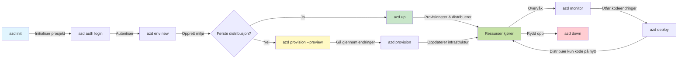
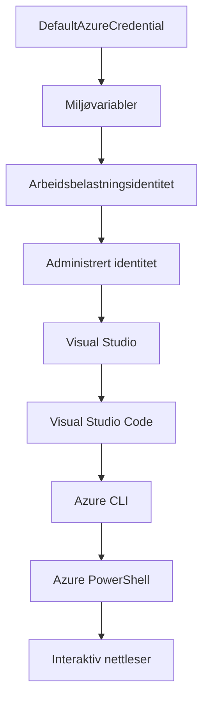

# AZD Grunnleggende - Forstå Azure Developer CLI

# AZD Grunnleggende - Kjernebegreper og Grunnleggende

**Kapittelnavigasjon:**
- **📚 Kursstart**: [AZD For Nybegynnere](../../README.md)
- **📖 Nåværende Kapittel**: Kapittel 1 - Grunnlag & Rask Start
- **⬅️ Forrige**: [Kursoversikt](../../README.md#-chapter-1-foundation--quick-start)
- **➡️ Neste**: [Installasjon & Oppsett](installation.md)
- **🚀 Neste Kapittel**: [Kapittel 2: AI-første utvikling](../chapter-02-ai-development/microsoft-foundry-integration.md)

## Introduksjon

Denne leksjonen introduserer deg for Azure Developer CLI (azd), et kraftig kommandolinjeverktøy som akselererer reisen din fra lokal utvikling til Azure-distribusjon. Du vil lære grunnleggende konsepter, kjernefunksjoner, og forstå hvordan azd forenkler sky-nativ applikasjonsdistribusjon.

## Læringsmål

Når denne leksjonen er ferdig, vil du:
- Forstå hva Azure Developer CLI er og dets hovedformål
- Lære kjernebegrepene maler, miljøer og tjenester
- Utforske nøkkelfunksjoner inkludert malstyrt utvikling og Infrastruktur som kode
- Forstå azd-prosjektstruktur og arbeidsflyt
- Være klar til å installere og konfigurere azd for ditt utviklingsmiljø

## Læringsutbytte

Etter å ha fullført denne leksjonen skal du kunne:
- Forklare rollen til azd i moderne skyutviklingsarbeidsflyter
- Identifisere komponentene i en azd-prosjektstruktur
- Beskrive hvordan maler, miljøer og tjenester samarbeider
- Forstå fordelene med Infrastruktur som kode med azd
- Gjenkjenne ulike azd-kommandoer og deres formål

## Hva er Azure Developer CLI (azd)?

Azure Developer CLI (azd) er et kommandolinjeverktøy designet for å akselerere reisen din fra lokal utvikling til Azure-distribusjon. Det forenkler prosessen med å bygge, distribuere og administrere sky-native applikasjoner på Azure.

### Hva kan du distribuere med azd?

azd støtter et bredt spekter av arbeidsbelastninger — og listen vokser stadig. I dag kan du bruke azd til å distribuere:

| Arbeidsbelastningstype | Eksempler | Samme arbeidsflyt? |
|------------------------|-----------|-------------------|
| **Tradisjonelle applikasjoner** | Webapper, REST-APIer, statiske nettsteder | ✅ `azd up` |
| **Tjenester og mikrotjenester** | Container Apps, Function Apps, multitenverte bakender | ✅ `azd up` |
| **AI-drevne applikasjoner** | Chatapper med Microsoft Foundry-modeller, RAG-løsninger med AI Search | ✅ `azd up` |
| **Intelligente agenter** | Agenter hostet i Foundry, fleragentorkestreringer | ✅ `azd up` |

Nøkkelinnsikten er at **azd-livssyklusen forblir den samme uansett hva du distribuerer**. Du initialiserer et prosjekt, provisjonerer infrastruktur, distribuerer koden din, overvåker appen, og rydder opp — enten det er et enkelt nettsted eller en sofistikert AI-agent.

Denne kontinuiteten er et bevisst valg. azd behandler AI-funksjonalitet som en annen type tjeneste applikasjonen din kan bruke, ikke som noe fundamentalt annerledes. Et chatteendepunkt støttet av Microsoft Foundry-modeller er, fra azds perspektiv, bare en annen tjeneste som skal konfigureres og distribueres.

### 🎯 Hvorfor bruke AZD? En virkelighetsnær sammenligning

La oss sammenligne distribusjon av en enkel webapp med database:

#### ❌ Uten AZD: Manuell Azure-distribusjon (30+ minutter)

```bash
# Trinn 1: Opprett ressursgruppe
az group create --name myapp-rg --location eastus

# Trinn 2: Opprett App Service-plan
az appservice plan create --name myapp-plan \
  --resource-group myapp-rg \
  --sku B1 --is-linux

# Trinn 3: Opprett Web App
az webapp create --name myapp-web-unique123 \
  --resource-group myapp-rg \
  --plan myapp-plan \
  --runtime "NODE:18-lts"

# Trinn 4: Opprett Cosmos DB-konto (10-15 minutter)
az cosmosdb create --name myapp-cosmos-unique123 \
  --resource-group myapp-rg \
  --kind MongoDB

# Trinn 5: Opprett database
az cosmosdb mongodb database create \
  --account-name myapp-cosmos-unique123 \
  --resource-group myapp-rg \
  --name tododb

# Trinn 6: Opprett samling
az cosmosdb mongodb collection create \
  --account-name myapp-cosmos-unique123 \
  --resource-group myapp-rg \
  --database-name tododb \
  --name todos

# Trinn 7: Hent tilkoblingsstreng
CONN_STR=$(az cosmosdb keys list \
  --name myapp-cosmos-unique123 \
  --resource-group myapp-rg \
  --type connection-strings \
  --query "connectionStrings[0].connectionString" -o tsv)

# Trinn 8: Konfigurer app-innstillinger
az webapp config appsettings set \
  --name myapp-web-unique123 \
  --resource-group myapp-rg \
  --settings MONGODB_URI="$CONN_STR"

# Trinn 9: Aktiver logging
az webapp log config --name myapp-web-unique123 \
  --resource-group myapp-rg \
  --application-logging filesystem \
  --detailed-error-messages true

# Trinn 10: Sett opp Application Insights
az monitor app-insights component create \
  --app myapp-insights \
  --location eastus \
  --resource-group myapp-rg

# Trinn 11: Koble App Insights til Web App
INSTRUMENTATION_KEY=$(az monitor app-insights component show \
  --app myapp-insights \
  --resource-group myapp-rg \
  --query "instrumentationKey" -o tsv)

az webapp config appsettings set \
  --name myapp-web-unique123 \
  --resource-group myapp-rg \
  --settings APPINSIGHTS_INSTRUMENTATIONKEY="$INSTRUMENTATION_KEY"

# Trinn 12: Bygg applikasjon lokalt
npm install
npm run build

# Trinn 13: Opprett distribusjonspakke
zip -r app.zip . -x "*.git*" "node_modules/*"

# Trinn 14: Distribuer applikasjon
az webapp deployment source config-zip \
  --resource-group myapp-rg \
  --name myapp-web-unique123 \
  --src app.zip

# Trinn 15: Vent og håp det fungerer 🙏
# (Ingen automatisk validering, manuell testing kreves)
```

**Problemer:**
- ❌ 15+ kommandoer å huske og utføre i riktig rekkefølge
- ❌ 30-45 minutters manuelt arbeid
- ❌ Lett å gjøre feil (typos, feil parametere)
- ❌ Tilkoblingsstrenger eksponert i terminalhistorikk
- ❌ Ingen automatisert rollback om noe feiler
- ❌ Vanskelig å replikere for teammedlemmer
- ❌ Ulikt hver gang (ikke reproduserbart)

#### ✅ Med AZD: Automatisert distribusjon (5 kommandoer, 10-15 minutter)

```bash
# Trinn 1: Initialiser fra mal
azd init --template todo-nodejs-mongo

# Trinn 2: Autentiser
azd auth login

# Trinn 3: Opprett miljø
azd env new dev

# Trinn 4: Forhåndsvis endringer (valgfritt men anbefalt)
azd provision --preview

# Trinn 5: Distribuer alt
azd up

# ✨ Ferdig! Alt er distribuert, konfigurert og overvåket
```

**Fordeler:**
- ✅ **5 kommandoer** vs. 15+ manuelle steg
- ✅ **10-15 minutter** total tid (mest venting på Azure)
- ✅ **Færre manuelle feil** — konsistent, malstyrt arbeidsflyt
- ✅ **Sikker hemmelighåndtering** — mange maler bruker Azure-administrert hemmelig lagring
- ✅ **Reproduserbare distribusjoner** — samme arbeidsflyt hver gang
- ✅ **Fullt reproduserbart** — samme resultat hver gang
- ✅ **Team-vennlig** — alle kan distribuere med samme kommandoer
- ✅ **Infrastruktur som kode** — versjonskontrollerte Bicep-maler
- ✅ **Innebygd overvåkning** — Application Insights konfigurert automatisk

### 📊 Tids- og feilreduksjon

| Metrikk | Manuell distribusjon | AZD-distribusjon | Forbedring |
|:---------|:---------------------|:-----------------|:-----------|
| **Kommandoer** | 15+ | 5 | 67 % færre |
| **Tid** | 30-45 min | 10-15 min | 60 % raskere |
| **Feilrate** | ~40 % | <5 % | 88 % reduksjon |
| **Konsistens** | Lav (manuell) | 100 % (automatisert) | Perfekt |
| **Team onboarding** | 2-4 timer | 30 minutter | 75 % raskere |
| **Rollback-tid** | 30+ min (manuell) | 2 min (automatisert) | 93 % raskere |

## Kjernebegreper

### Maler
Maler er grunnlaget for azd. De inneholder:
- **Applikasjonskode** — Kildekode og avhengigheter
- **Infrastrukturbeskrivelser** — Azure-ressurser definert i Bicep eller Terraform
- **Konfigurasjonsfiler** — Innstillinger og miljøvariabler
- **Distribusjonsskript** — Automatiserte distribusjonsarbeidsflyter

### Miljøer
Miljøer representerer ulike distribusjonsmål:
- **Utvikling** — For testing og utvikling
- **Staging** — Pre-produksjonsmiljø
- **Produksjon** — Live produksjonsmiljø

Hvert miljø opprettholder sin egen:
- Azure-ressursgruppe
- Konfigurasjonsinnstillinger
- Distribusjonsstatus

### Tjenester
Tjenester er byggeklossene i applikasjonen din:
- **Frontend** — Webapplikasjoner, Single Page Applications (SPA)
- **Backend** — APIer, mikrotjenester
- **Database** — Databaseløsninger
- **Lagring** — Fil- og blob-lagring

## Nøkkelfunksjoner

### 1. Malstyrt utvikling
```bash
# Bla gjennom tilgjengelige maler
azd template list

# Initialiser fra en mal
azd init --template <template-name>
```

### 2. Infrastruktur som kode
- **Bicep** — Azures domene-spesifikke språk
- **Terraform** — Multi-skyinfrastrukturverktøy
- **ARM-maler** — Azure Resource Manager-maler

### 3. Integrerte arbeidsflyter
```bash
# Komplett utplasseringsarbeidsflyt
azd up            # Provision + Distribuer, dette er håndfri for første gangs oppsett

# 🧪 NYTT: Forhåndsvis infrastruktuendringer før distribusjon (SIKRET)
azd provision --preview    # Simuler infrastruktuutplassering uten å gjøre endringer

azd provision     # Opprett Azure-ressurser hvis du oppdaterer infrastrukturen, bruk dette
azd deploy        # Distribuer applikasjonskode eller distribuer på nytt applikasjonskode etter oppdatering
azd down          # Rydd opp ressurser
```

#### 🛡️ Sikker infrastrukturplanlegging med forhåndsvisning
`azd provision --preview`-kommandoen er en revolusjon for sikre distribusjoner:
- **"Dry-run" analyse** — Viser hva som vil bli opprettet, endret eller slettet
- **Null risiko** — Ingen faktiske endringer på Azure-miljøet
- **Team samarbeid** — Del forhåndsvisningsresultater før distribusjon
- **Kostnadsestimering** — Forstå ressurskostnader før forpliktelse

```bash
# Eksempel forhåndsvisning av arbeidsflyt
azd provision --preview           # Se hva som vil endres
# Gå gjennom utdata, diskuter med teamet
azd provision                     # Bruk endringer med tillit
```

### 📊 Visualisering: AZD Utviklingsarbeidsflyt



**Forklaring på arbeidsflyt:**
1. **Init** — Start med mal eller nytt prosjekt
2. **Auth** — Autentiser med Azure
3. **Environment** — Opprett isolert distribusjonsmiljø
4. **Preview** — 🆕 Forhåndsvis alltid infrastrukturendringer først (sikker praksis)
5. **Provision** — Opprett/oppdater Azure-ressurser
6. **Deploy** — Push applikasjonskode
7. **Monitor** — Overvåk applikasjonsytelse
8. **Iterate** — Gjør endringer og distribuer på nytt
9. **Cleanup** — Fjern ressurser når du er ferdig

### 4. Miljøhåndtering
```bash
# Opprett og administrer miljøer
azd env new <environment-name>
azd env select <environment-name>
azd env list
```

### 5. Utvidelser og AI-kommandoer

azd bruker et utvidelsessystem for å legge til funksjoner utover kjernen i CLI. Dette er spesielt nyttig for AI-arbeidsmengder:

```bash
# Liste tilgjengelige utvidelser
azd extension list

# Installer Foundry-agenter utvidelsen
azd extension install azure.ai.agents

# Initialiser et AI-agentprosjekt fra en manifest
azd ai agent init -m agent-manifest.yaml

# Test en distribuert agent (viser ventetid og tid-til-første-byte)
azd ai agent invoke

# Start MCP-serveren for AI-assistert utvikling (Alfa)
azd mcp start
```

**Agentens livssyklus, ende til ende.** Når du har installert `azure.ai.agents`, tar en enkelt arbeidsflyt deg fra idé til en kjørende, overvåket agent. Du trenger ikke alle disse første dagen — bare vit at de finnes:

| Fase | Kommando | Hva den gjør |
|-------|----------|--------------|
| **Scaffold** | `azd ai agent init -m <manifest>` | Genererer et agentprosjekt fra en manifestfil |
| **Test** | `azd ai agent invoke` | Kaller agenten og viser responstid |
| **Measure** | `azd ai agent eval generate` | Lager et evalueringsdatasett for agenten |
| **Improve** | `azd ai agent optimize` | Optimaliserer agentinstruksjoner mot dine data |
| **Inspect** | `azd ai agent endpoint show` | Viser live endepunktkonfigurasjon |
| **Clean up** | `azd ai agent delete` | Sletter hostet agent og alle versjoner |

> Utvidelser dekkes detaljert i [Kapittel 2: AI-første utvikling](../chapter-02-ai-development/agents.md) og referansen [AZD AI CLI Commands](../chapter-08-production/production-ai-practices.md#azd-ai-cli-commands-and-extensions).

## 📁 Prosjektstruktur

En typisk azd-prosjektstruktur:
```
my-app/
├── .azd/                    # azd configuration
│   └── config.json
├── .azure/                  # Azure deployment artifacts
├── .devcontainer/          # Development container config
├── .github/workflows/      # GitHub Actions
├── .vscode/               # VS Code settings
├── infra/                 # Infrastructure code
│   ├── main.bicep        # Main infrastructure template
│   ├── main.parameters.json
│   └── modules/          # Reusable modules
├── src/                  # Application source code
│   ├── api/             # Backend services
│   └── web/             # Frontend application
├── azure.yaml           # azd project configuration
└── README.md
```

## 🔧 Konfigurasjonsfiler

### azure.yaml
Hovedkonfigurasjonsfil for prosjektet:
```yaml
name: my-awesome-app
metadata:
  template: my-template@1.0.0

services:
  web:
    project: ./src/web
    language: js
    host: appservice
  api:
    project: ./src/api
    language: js
    host: appservice

hooks:
  preprovision:
    shell: pwsh
    run: echo "Preparing to provision..."
```

### .azure/config.json
Miljøspesifikk konfigurasjon:
```json
{
  "version": 1,
  "defaultEnvironment": "dev",
  "environments": {
    "dev": {
      "subscriptionId": "your-subscription-id",
      "location": "eastus"
    }
  }
}
```

## 🎪 Vanlige arbeidsflyter med praktiske øvelser

> **💡 Læringstips:** Følg disse øvelsene i rekkefølge for å bygge dine AZD-ferdigheter gradvis.

### 🎯 Øvelse 1: Initialiser ditt første prosjekt

**Mål:** Lag et AZD-prosjekt og utforsk dets struktur

**Steg:**
```bash
# Bruk en bevist mal
azd init --template todo-nodejs-mongo

# Utforsk de genererte filene
ls -la  # Vis alle filer inkludert skjulte

# Viktige filer opprettet:
# - azure.yaml (hovedkonfigurasjon)
# - infra/ (infrastrukturkode)
# - src/ (applikasjonskode)
```

**✅ Suksess:** Du har azure.yaml, infra/ og src/ mapper

---

### 🎯 Øvelse 2: Distribuer til Azure

**Mål:** Fullfør ende-til-ende distribusjon

**Steg:**
```bash
# 1. Autentiser
az login && azd auth login

# 2. Opprett miljø
azd env new dev
azd env set AZURE_LOCATION eastus

# 3. Forhåndsvis endringer (ANBEFALES)
azd provision --preview

# 4. Distribuer alt
azd up

# 5. Verifiser distribusjon
azd show    # Se din app-URL
```

**Forventet tid:** 10-15 minutter  
**✅ Suksess:** Applikasjons-URL åpnes i nettleser

---

### 🎯 Øvelse 3: Flere miljøer

**Mål:** Distribuer til dev og staging

**Steg:**
```bash
# Har allerede dev, opprett staging
azd env new staging
azd env set AZURE_LOCATION westus2
azd up

# Bytt mellom dem
azd env list
azd env select dev
```

**✅ Suksess:** To separate ressursgrupper i Azure-portalen

---

### 🛡️ Ren start: `azd down --force --purge`

Når du trenger fullstendig tilbakestilling:

```bash
azd down --force --purge
```

**Hva det gjør:**
- `--force`: Ingen bekreftelsesspørsmål
- `--purge`: Sletter all lokal tilstand og Azure-ressurser

**Bruk når:**
- Distribusjon mislyktes underveis
- Bytter prosjekter
- Trenger en fersk start

---

## 🎪 Opprinnelig arbeidsflytreferanse

### Starte et nytt prosjekt
```bash
# Metode 1: Bruk eksisterende mal
azd init --template todo-nodejs-mongo

# Metode 2: Start fra bunnen av
azd init

# Metode 3: Bruk gjeldende katalog
azd init .
```

### Utviklingssyklus
```bash
# Sett opp utviklingsmiljø
azd auth login
azd env new dev
azd env select dev

# Distribuer alt
azd up

# Gjør endringer og distribuer på nytt
azd deploy

# Rydd opp når du er ferdig
azd down --force --purge # kommandoen i Azure Developer CLI er en **hard tilbakestilling** av miljøet ditt—spesielt nyttig når du feilsøker mislykkede distribusjoner, rydder opp foreldreløse ressurser, eller forbereder en ny distribusjon.
```

## Forstå `azd down --force --purge`
`azd down --force --purge`-kommandoen er en kraftfull måte å rive ned ditt azd-miljø og alle tilknyttede ressurser fullstendig. Her er en oversikt over hva hver flagg gjør:
```
--force
```
- Hopper over bekreftelsesspørsmål.  
- Nyttig for automatisering eller skripting der manuell input ikke er mulig.  
- Sikrer at oppryddingen fortsetter uten avbrudd, selv om CLI oppdager uoverensstemmelser.

```
--purge
```
Sletter **all tilknyttet metadata**, inkludert:  
Miljøstatus  
Lokal `.azure`-mappe  
Bufrede distribusjonsdata  
Forhindrer at azd "husker" tidligere distribusjoner, noe som kan føre til problemer som feil matcher ressursgrupper eller utdaterte registerreferanser.

### Hvorfor bruke begge?
Når du har truffet en vegg med `azd up` på grunn av hengende tilstand eller delvise distribusjoner, sikrer denne kombinasjonen en **ren start**.

Den er spesielt nyttig etter manuelle ressurs-slettinger i Azure-portalen eller når du bytter maler, miljøer eller navngivningskonvensjoner for ressursgrupper.

### Håndtering av flere miljøer
```bash
# Opprett staging-miljø
azd env new staging
azd env select staging
azd up

# Bytt tilbake til utvikling
azd env select dev

# Sammenlign miljøer
azd env list
```

## 🔐 Autentisering og legitimasjon

Å forstå autentisering er essensielt for vellykkede azd-distribusjoner. Azure bruker flere autentiseringsmetoder, og azd benytter samme legitimasjonskjede som andre Azure-verktøy.

### Azure CLI-autentisering (`az login`)

Før du bruker azd, må du autentisere mot Azure. Den vanligste metoden er å bruke Azure CLI:

```bash
# Interaktiv pålogging (åpner nettleser)
az login

# Logg inn med spesifikk leietaker
az login --tenant <tenant-id>

# Logg inn med tjenesteprinsipp
az login --service-principal -u <app-id> -p <password> --tenant <tenant-id>

# Sjekk gjeldende påloggingsstatus
az account show

# List tilgjengelige abonnementer
az account list --output table

# Sett standardabonnement
az account set --subscription <subscription-id>
```

### Autentiseringsflyt
1. **Interaktiv pålogging:** Åpner standard nettleser for autentisering
2. **Device Code Flow:** For miljøer uten nettlesertilgang
3. **Service Principal:** For automatisering og CI/CD-scenarier
4. **Managed Identity:** For Azure-hostede applikasjoner

### DefaultAzureCredential-kjede

`DefaultAzureCredential` er en legitimasjonstype som gir en forenklet autentiseringsopplevelse ved automatisk å prøve flere legitimasjonskilder i en bestemt rekkefølge:

#### Rekkevidde for legitimasjonskjede


#### 1. Miljøvariabler
```bash
# Sett miljøvariabler for tjenesteprinsipp
export AZURE_CLIENT_ID="<app-id>"
export AZURE_CLIENT_SECRET="<password>"
export AZURE_TENANT_ID="<tenant-id>"
```

#### 2. Workload Identity (Kubernetes/GitHub Actions)
Brukes automatisk i:  
- Azure Kubernetes Service (AKS) med Workload Identity  
- GitHub Actions med OIDC-føderasjon  
- Andre fødererte identitetsscenarier

#### 3. Managed Identity
For Azure-ressurser som:  
- Virtuelle maskiner  
- App Service  
- Azure Functions  
- Container Instances

```bash
# Sjekk om kjøring på Azure-ressurs med administrert identitet
az account show --query "user.type" --output tsv
# Returnerer: "servicePrincipal" hvis administrert identitet brukes
```

#### 4. Utviklerverktøyintegrasjon
- **Visual Studio:** Bruker automatisk pålogget konto
- **VS Code:** Bruker legitimasjon fra Azure Account-utvidelsen
- **Azure CLI:** Bruker `az login`-legitimasjon (mest vanlig for lokal utvikling)

### AZD Autentiseringsoppsett

```bash
# Metode 1: Bruk Azure CLI (Anbefalt for utvikling)
az login
azd auth login  # Bruker eksisterende Azure CLI-legitimasjon

# Metode 2: Direkte azd-autentisering
azd auth login --use-device-code  # For hodetelefonfrie miljøer

# Metode 3: Sjekk autentiseringsstatus
azd auth login --check-status

# Metode 4: Logg ut og autentiser på nytt
azd auth logout
azd auth login
```

### Beste praksis for autentisering

#### For lokal utvikling
```bash
# 1. Logg inn med Azure CLI
az login

# 2. Bekreft riktig abonnement
az account show
az account set --subscription "Your Subscription Name"

# 3. Bruk azd med eksisterende legitimasjon
azd auth login
```

#### For CI/CD-pipelines
```yaml
# GitHub Actions example
- name: Azure Login
  uses: azure/login@v1
  with:
    creds: ${{ secrets.AZURE_CREDENTIALS }}

- name: Deploy with azd
  run: |
    azd auth login --client-id ${{ secrets.AZURE_CLIENT_ID }} \
                    --client-secret ${{ secrets.AZURE_CLIENT_SECRET }} \
                    --tenant-id ${{ secrets.AZURE_TENANT_ID }}
    azd up --no-prompt
```

#### For produksjonsmiljøer
- Bruk **Managed Identity** når du kjører på Azure-ressurser
- Bruk **Service Principal** for automatiseringsscenarier
- Unngå å lagre legitimasjon i kode eller konfigurasjonsfiler
- Bruk **Azure Key Vault** for sensitiv konfigurasjon

### Vanlige autentiseringsproblemer og løsninger

#### Problem: "Ingen abonnement funnet"
```bash
# Løsning: Sett standard abonnement
az account list --output table
az account set --subscription "<subscription-id>"
azd env set AZURE_SUBSCRIPTION_ID "<subscription-id>"
```

#### Problem: "Utilstrekkelige tillatelser"
```bash
# Løsning: Sjekk og tilordne nødvendige roller
az role assignment list --assignee $(az account show --query user.name --output tsv)

# Vanlige nødvendige roller:
# - Bidragsyter (for ressursadministrasjon)
# - Brukertilgangsadministrator (for rollefordelinger)
```

#### Problem: "Token utløpt"
```bash
# Løsning: Re-autentiser
az logout
az login
azd auth logout
azd auth login
```

### Autentisering i forskjellige scenarier

#### Lokal utvikling
```bash
# Personlig utviklingskonto
az login
azd auth login
```

#### Teamutvikling
```bash
# Bruk spesifikk leietaker for organisasjon
az login --tenant contoso.onmicrosoft.com
azd auth login
```

#### Multi-tenant scenarier
```bash
# Bytt mellom leietakere
az login --tenant tenant1.onmicrosoft.com
# Distribuer til leietaker 1
azd up

az login --tenant tenant2.onmicrosoft.com  
# Distribuer til leietaker 2
azd up
```

### Sikkerhetshensyn

1. **Lagring av legitimasjon**: Aldri lagre legitimasjon i kildekoden
2. **Begrensning av omfang**: Bruk minst-privilegium prinsippet for service principals
3. **Token-rotasjon**: Roter service principal secrets jevnlig
4. **Revisjonsspor**: Overvåk autentisering og distribusjonsaktiviteter
5. **Nettverkssikkerhet**: Bruk private endepunkter når det er mulig

### Feilsøking av autentisering

```bash
# Feilsøk autentiseringsproblemer
azd auth login --check-status
az account show
az account get-access-token

# Vanlige diagnostiske kommandoer
whoami                          # Gjeldende brukerkontekst
az ad signed-in-user show      # Microsoft Entra ID brukerdetaljer
az group list                  # Test tilgang til ressurs
```

## Forstå `azd down --force --purge`

### Oppdagelse
```bash
azd template list              # Bla gjennom maler
azd template show <template>   # Maldetaljer
azd init --help               # Initialiseringsalternativer
```

### Prosjektadministrasjon
```bash
azd show                     # Prosjektoversikt
azd env list                # Tilgjengelige miljøer og valgt standard
azd config show            # Konfigurasjonsinnstillinger
```

### Overvåking
```bash
azd monitor                  # Åpne Azure-portalen for overvåking
azd monitor --logs           # Se applikasjonslogger
azd monitor --live           # Vis sanntidsmålinger
azd pipeline config          # Sett opp CI/CD
```

## Beste praksis

### 1. Bruk meningsfulle navn
```bash
# Bra
azd env new production-east
azd init --template web-app-secure

# Unngå
azd env new env1
azd init --template template1
```

### 2. Utnytt maler
- Start med eksisterende maler
- Tilpass etter behov
- Lag gjenbrukbare maler for organisasjonen din

### 3. Miljøisolasjon
- Bruk separate miljøer for dev/staging/prod
- Distribuer aldri direkte til produksjon fra lokal maskin
- Bruk CI/CD-pipelines for produksjonsdistribusjoner

### 4. Konfigurasjonsstyring
- Bruk miljøvariabler for sensitiv data
- Hold konfigurasjon i versjonskontroll
- Dokumenter miljøspesifikke innstillinger

## Læringsprogresjon

### Nybegynner (Uke 1-2)
1. Installer azd og autentiser
2. Distribuer en enkel mal
3. Forstå prosjektstruktur
4. Lær grunnleggende kommandoer (up, down, deploy)

### Middels (Uke 3-4)
1. Tilpass maler
2. Administrer flere miljøer
3. Forstå infrastrukturkode
4. Sett opp CI/CD-pipelines

### Avansert (Uke 5+)
1. Lag egendefinerte maler
2. Avanserte infrastrukturmønstre
3. Distribusjoner til flere regioner
4. Enterprise-grad konfigurasjoner

## Neste steg

**📖 Fortsett kapittel 1 læring:**
- [Installasjon og oppsett](installation.md) - Få azd installert og konfigurert
- [Ditt første prosjekt](first-project.md) - Fullfør praksistutorial
- [Konfigurasjonsguide](configuration.md) - Avanserte konfigurasjonsalternativer

**🎯 Klar for neste kapittel?**
- [Kapittel 2: AI-First utvikling](../chapter-02-ai-development/microsoft-foundry-integration.md) - Begynn å bygge AI-applikasjoner

## Ekstra ressurser

- [Azure Developer CLI Oversikt](https://learn.microsoft.com/en-us/azure/developer/azure-developer-cli/)
- [Mal-galleri](https://azure.github.io/awesome-azd/)
- [Community-eksempler](https://github.com/Azure-Samples)

---

## 🙋 Ofte stilte spørsmål

### Generelle spørsmål

**Q: Hva er forskjellen mellom AZD og Azure CLI?**

A: Azure CLI (`az`) brukes til å administrere individuelle Azure-ressurser. AZD (`azd`) brukes til å administrere hele applikasjoner:

```bash
# Azure CLI - Lavnivå ressursstyring
az webapp create --name myapp --resource-group rg
az sql server create --name myserver --resource-group rg
# ...mange flere kommandoer nødvendig

# AZD - Applikasjonsnivå styring
azd up  # Distribuerer hele appen med alle ressurser
```

**Tenk på det slik:**
- `az` = Opererer på individuelle Legoklosser
- `azd` = Arbeider med komplette Lego-sett

---

**Q: Må jeg kunne Bicep eller Terraform for å bruke AZD?**

A: Nei! Start med maler:
```bash
# Bruk eksisterende mal - ingen IaC-kunnskap nødvendig
azd init --template todo-nodejs-mongo
azd up
```

Du kan lære Bicep senere for å tilpasse infrastrukturen. Maler gir fungerende eksempler å lære av.

---

**Q: Hvor mye koster det å kjøre AZD-maler?**

A: Kostnader varierer per mal. De fleste utviklingsmaler koster $50-150/måned:

```bash
# Forhåndsvis kostnader før distribusjon
azd provision --preview

# Rydd alltid opp når det ikke er i bruk
azd down --force --purge  # Fjerner alle ressurser
```

**Profftips:** Bruk gratisnivåer når tilgjengelig:
- App Service: F1 (gratis) nivå
- Microsoft Foundry Models: Azure OpenAI 50 000 tokens/måned gratis
- Cosmos DB: 1000 RU/s gratisnivå

---

**Q: Kan jeg bruke AZD med eksisterende Azure-ressurser?**

A: Ja, men det er enklere å starte på nytt. AZD fungerer best når det administrerer hele livssyklusen. For eksisterende ressurser:

```bash
# Alternativ 1: Importer eksisterende ressurser (avansert)
azd init
# Endre deretter infra/ for å referere til eksisterende ressurser

# Alternativ 2: Start på nytt (anbefalt)
azd init --template matching-your-stack
azd up  # Oppretter nytt miljø
```

---

**Q: Hvordan deler jeg prosjektet mitt med lagkamerater?**

A: Sjekk inn AZD-prosjektet til Git (men IKKE `.azure`-mappen):

```bash
# Allerede i .gitignore som standard
.azure/        # Inneholder hemmeligheter og miljødata
*.env          # Miljøvariabler

# Teammedlemmer da:
git clone <your-repo>
azd auth login
azd env new <their-name>-dev
azd up
```

Alle får identisk infrastruktur fra de samme malene.

---

### Feilsøkingsspørsmål

**Q: "azd up" feilet halvveis. Hva gjør jeg?**

A: Sjekk feilen, rett den og prøv igjen:

```bash
# Vis detaljerte logger
azd show

# Vanlige løsninger:

# 1. Hvis kvoten er overskredet:
azd env set AZURE_LOCATION "westus2"  # Prøv en annen region

# 2. Hvis ressursnavnkonflikt:
azd down --force --purge  # Rent bord
azd up  # Prøv igjen

# 3. Hvis autentisering er utløpt:
az login
azd auth login
azd up
```

**Vanligste problem:** Feil Azure-abonnement valgt
```bash
az account list --output table
az account set --subscription "<correct-subscription>"
```

---

**Q: Hvordan distribuerer jeg bare kodeendringer uten reprovisjonering?**

A: Bruk `azd deploy` i stedet for `azd up`:

```bash
azd up          # Første gang: opprettelse + distribusjon (langsom)

# Gjør kodeendringer...

azd deploy      # Påfølgende ganger: kun distribusjon (rask)
```

Hastighetssammenligning:
- `azd up`: 10-15 minutter (provisjonerer infrastruktur)
- `azd deploy`: 2-5 minutter (kun kode)

---

**Q: Kan jeg tilpasse infrastruktursmalene?**

A: Ja! Rediger Bicep-filene i `infra/`:

```bash
# Etter azd init
cd infra/
code main.bicep  # Rediger i VS Code

# Forhåndsvis endringer
azd provision --preview

# Bruk endringer
azd provision
```

**Tips:** Start i det små - endre SKU-er først:
```bicep
// infra/main.bicep
sku: {
  name: 'B1'  // Change to 'P1V2' for production
}
```

---

**Q: Hvordan sletter jeg alt AZD har opprettet?**

A: Én kommando fjerner alle ressurser:

```bash
azd down --force --purge

# Dette sletter:
# - Alle Azure-ressurser
# - Ressursgruppe
# - Lokal miljøtilstand
# - Bufret distribusjonsdata
```

**Kjør alltid dette når:**
- Ferdig med å teste en mal
- Bytter til et annet prosjekt
- Vil starte på nytt

**Kostnadsbesparelse:** Slette ubrukte ressurser = $0 kostnader

---

**Q: Hva hvis jeg ved et uhell slettet ressurser i Azure-portalen?**

A: AZD-tilstanden kan bli ute av synk. Rydd opp og start på nytt:

```bash
# 1. Fjern lokal tilstand
azd down --force --purge

# 2. Start på nytt
azd up

# Alternativ: La AZD oppdage og fikse
azd provision  # Vil opprette manglende ressurser
```

---

### Avanserte spørsmål

**Q: Kan jeg bruke AZD i CI/CD-pipelines?**

A: Ja! GitHub Actions eksempel:

```yaml
# .github/workflows/deploy.yml
name: Deploy with AZD

on:
  push:
    branches: [main]

jobs:
  deploy:
    runs-on: ubuntu-latest
    steps:
      - uses: actions/checkout@v2
      
      - name: Install azd
        run: curl -fsSL https://aka.ms/install-azd.sh | bash
      
      - name: Azure Login
        run: |
          azd auth login \
            --client-id ${{ secrets.AZURE_CLIENT_ID }} \
            --client-secret ${{ secrets.AZURE_CLIENT_SECRET }} \
            --tenant-id ${{ secrets.AZURE_TENANT_ID }}
      
      - name: Deploy
        run: azd up --no-prompt
```

---

**Q: Hvordan håndterer jeg hemmeligheter og sensitiv data?**

A: AZD integrerer automatisk med Azure Key Vault:

```bash
# Hemmeligheter lagres i Key Vault, ikke i koden
azd env set DATABASE_PASSWORD "$(openssl rand -base64 32)"

# AZD gjør automatisk:
# 1. Oppretter Key Vault
# 2. Lagrer hemmelighet
# 3. Gir appen tilgang via Managed Identity
# 4. Injiserer ved kjøretid
```

**Sjekk aldri inn:**
- `.azure/`-mappen (inneholder miljødata)
- `.env`-filer (lokale hemmeligheter)
- Tilkoblingsstrenger

---

**Q: Kan jeg distribuere til flere regioner?**

A: Ja, lag miljø per region:

```bash
# Øst-USA miljø
azd env new prod-eastus
azd env set AZURE_LOCATION eastus
azd up

# Vest-Europa miljø
azd env new prod-westeurope
azd env set AZURE_LOCATION westeurope
azd up

# Hvert miljø er uavhengig
azd env list
```

For ekte multi-region apper, tilpass Bicep-maler for samtidig distribusjon til flere regioner.

---

**Q: Hvor kan jeg få hjelp hvis jeg sitter fast?**

1. **AZD-dokumentasjon:** https://learn.microsoft.com/azure/developer/azure-developer-cli/
2. **GitHub Issues:** https://github.com/Azure/azure-dev/issues
3. **Discord:** [Azure Discord](https://discord.gg/microsoft-azure) - #azure-developer-cli kanal
4. **Stack Overflow:** Tag `azure-developer-cli`
5. **Dette kurset:** [Feilsøkingsguide](../chapter-07-troubleshooting/common-issues.md)

**Profftips:** Før du spør, kjør:
```bash
azd show       # Viser gjeldende tilstand
azd version    # Viser din versjon
```
Inkluder denne infoen i spørsmålet ditt for raskere hjelp.

---

## 🎓 Hva nå?

Du forstår nå AZD grunnleggende. Velg din vei:

### 🎯 For nybegynnere:
1. **Neste:** [Installasjon og oppsett](installation.md) - Installer AZD på maskinen din
2. **Deretter:** [Ditt første prosjekt](first-project.md) - Distribuer din første app
3. **Øv:** Fullfør alle 3 øvelser i denne leksjonen

### 🚀 For AI-utviklere:
1. **Hopp til:** [Kapittel 2: AI-First utvikling](../chapter-02-ai-development/microsoft-foundry-integration.md)
2. **Distribuer:** Start med `azd init --template get-started-with-ai-chat`
3. **Lær:** Bygg mens du distribuerer

### 🏗️ For erfarne utviklere:
1. **Gå gjennom:** [Konfigurasjonsguide](configuration.md) - Avanserte innstillinger
2. **Utforsk:** [Infrastruktur som kode](../chapter-04-infrastructure/provisioning.md) - Dypdykk i Bicep
3. **Bygg:** Lag egendefinerte maler for stacken din

---

**Kapittel navigasjon:**
- **📚 Kursoversikt**: [AZD for nybegynnere](../../README.md)
- **📖 Nåværende kapittel**: Kapittel 1 - Grunnlag & rask start  
- **⬅️ Forrige**: [Kursoversikt](../../README.md#-chapter-1-foundation--quick-start)
- **➡️ Neste**: [Installasjon og oppsett](installation.md)
- **🚀 Neste kapittel**: [Kapittel 2: AI-First utvikling](../chapter-02-ai-development/microsoft-foundry-integration.md)

---

<!-- CO-OP TRANSLATOR DISCLAIMER START -->
**Ansvarsfraskrivelse**:
Dette dokumentet er oversatt ved hjelp av AI-oversettelsestjenesten [Co-op Translator](https://github.com/Azure/co-op-translator). Selv om vi streber etter nøyaktighet, vær oppmerksom på at automatiske oversettelser kan inneholde feil eller unøyaktigheter. Det opprinnelige dokumentet på originalspråket skal betraktes som den autoritative kilden. For kritisk informasjon anbefales profesjonell menneskelig oversettelse. Vi er ikke ansvarlige for eventuelle misforståelser eller feiltolkninger som oppstår ved bruk av denne oversettelsen.
<!-- CO-OP TRANSLATOR DISCLAIMER END -->