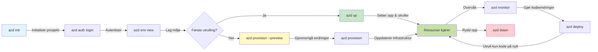
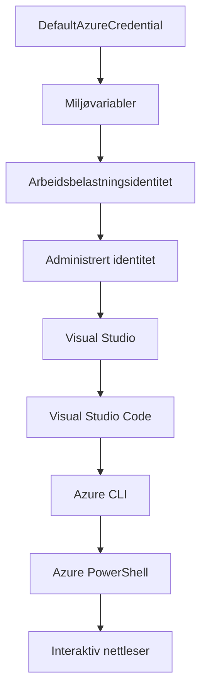

# AZD Grunnleggende - Forstå Azure Developer CLI

# AZD Grunnleggende - Kjernebegreper og Grunnleggende Prinsipper

**Kapittelnavigasjon:**
- **📚 Kurs Hjem**: [AZD For Nybegynnere](../../README.md)
- **📖 Nåværende Kapittel**: Kapittel 1 - Grunnlag & Rask Start
- **⬅️ Forrige**: [Kursoverblikk](../../README.md#-chapter-1-foundation--quick-start)
- **➡️ Neste**: [Installasjon & Oppsett](installation.md)
- **🚀 Neste Kapittel**: [Kapittel 2: AI-Først Utvikling](../chapter-02-ai-development/microsoft-foundry-integration.md)

## Introduksjon

Denne leksjonen introduserer deg for Azure Developer CLI (azd), et kraftig kommandolinjeverktøy som akselererer reisen din fra lokal utvikling til Azure-distribusjon. Du vil lære grunnleggende konsepter, kjernefunksjoner, og forstå hvordan azd forenkler distribusjon av sky-native applikasjoner.

## Læringsmål

Når du er ferdig med denne leksjonen, vil du:
- Forstå hva Azure Developer CLI er og dets primære formål
- Lære kjernebegrepene maler, miljøer og tjenester
- Utforske nøkkelfunksjoner inkludert malbasert utvikling og Infrastructure as Code
- Forstå azd prosjektstruktur og arbeidsflyt
- Være forberedt på å installere og konfigurere azd for ditt utviklingsmiljø

## Læringsutbytte

Etter å ha fullført denne leksjonen, vil du kunne:
- Forklare rollen til azd i moderne skyutviklingsarbeidsflyter
- Identifisere komponentene i en azd prosjektstruktur
- Beskrive hvordan maler, miljøer og tjenester fungerer sammen
- Forstå fordelene med Infrastructure as Code med azd
- Gjenkjenne ulike azd-kommandoer og deres formål

## Hva er Azure Developer CLI (azd)?

Azure Developer CLI (azd) er et kommandolinjeverktøy designet for å akselerere reisen din fra lokal utvikling til Azure-distribusjon. Det forenkler prosessen med å bygge, distribuere og administrere sky-native applikasjoner på Azure.

### Hva kan du distribuere med azd?

azd støtter et bredt spekter av arbeidsbelastninger – og listen vokser stadig. I dag kan du bruke azd til å distribuere:

| Arbeidsbelastningstype | Eksempler | Samme arbeidsflyt? |
|------------------------|-----------|-------------------|
| **Tradisjonelle applikasjoner** | Webapper, REST-APIer, statiske nettsteder | ✅ `azd up` |
| **Tjenester og mikrotjenester** | Container-apper, Funksjonsapper, flertjenestebackender | ✅ `azd up` |
| **AI-drevne applikasjoner** | Chat-apper med Microsoft Foundry-modeller, RAG-løsninger med AI Search | ✅ `azd up` |
| **Intelligente agenter** | Foundry-vertskapte agenter, multi-agent orkestreringer | ✅ `azd up` |

Nøkkelinnsikten er at **azd livssyklus forblir den samme uansett hva du distribuerer**. Du initialiserer et prosjekt, provisjonererer infrastruktur, distribuerer koden din, overvåker appen din og rydder opp – enten det er et enkelt nettsted eller en sofistikert AI-agent.

Denne kontinuiteten er designet slik. azd behandler AI-kapasiteter som en annen type tjeneste applikasjonen din kan bruke, ikke som noe fundamentalt forskjellig. Et chatteendepunkt støttet av Microsoft Foundry-modeller er, fra azds perspektiv, bare en annen tjeneste å konfigurere og distribuere.

### 🎯 Hvorfor bruke AZD? En virkelighetsnær sammenligning

La oss sammenligne distribusjon av en enkel webapp med database:

#### ❌ UTEN AZD: Manuell Azure-distribusjon (30+ minutter)

```bash
# Trinn 1: Opprett ressursgruppe
az group create --name myapp-rg --location eastus

# Trinn 2: Opprett App Service Plan
az appservice plan create --name myapp-plan \
  --resource-group myapp-rg \
  --sku B1 --is-linux

# Trinn 3: Opprett nettapp
az webapp create --name myapp-web-unique123 \
  --resource-group myapp-rg \
  --plan myapp-plan \
  --runtime "NODE:18-lts"

# Trinn 4: Opprett Cosmos DB-konto (10-15 minutter)
az cosmosdb create --name myapp-cosmos-unique123 \
  --resource-group myapp-rg \
  --kind MongoDB

# Trinn 5: Opprett database
az cosmosdb mongodb database create \
  --account-name myapp-cosmos-unique123 \
  --resource-group myapp-rg \
  --name tododb

# Trinn 6: Opprett samling
az cosmosdb mongodb collection create \
  --account-name myapp-cosmos-unique123 \
  --resource-group myapp-rg \
  --database-name tododb \
  --name todos

# Trinn 7: Hent tilkoblingsstreng
CONN_STR=$(az cosmosdb keys list \
  --name myapp-cosmos-unique123 \
  --resource-group myapp-rg \
  --type connection-strings \
  --query "connectionStrings[0].connectionString" -o tsv)

# Trinn 8: Konfigurer app-innstillinger
az webapp config appsettings set \
  --name myapp-web-unique123 \
  --resource-group myapp-rg \
  --settings MONGODB_URI="$CONN_STR"

# Trinn 9: Aktiver logging
az webapp log config --name myapp-web-unique123 \
  --resource-group myapp-rg \
  --application-logging filesystem \
  --detailed-error-messages true

# Trinn 10: Sett opp Application Insights
az monitor app-insights component create \
  --app myapp-insights \
  --location eastus \
  --resource-group myapp-rg

# Trinn 11: Koble App Insights til nettappen
INSTRUMENTATION_KEY=$(az monitor app-insights component show \
  --app myapp-insights \
  --resource-group myapp-rg \
  --query "instrumentationKey" -o tsv)

az webapp config appsettings set \
  --name myapp-web-unique123 \
  --resource-group myapp-rg \
  --settings APPINSIGHTS_INSTRUMENTATIONKEY="$INSTRUMENTATION_KEY"

# Trinn 12: Bygg applikasjonen lokalt
npm install
npm run build

# Trinn 13: Opprett distribusjonspakke
zip -r app.zip . -x "*.git*" "node_modules/*"

# Trinn 14: Distribuer applikasjonen
az webapp deployment source config-zip \
  --resource-group myapp-rg \
  --name myapp-web-unique123 \
  --src app.zip

# Trinn 15: Vent og håp at det fungerer 🙏
# (Ingen automatisk validering, manuell testing kreves)
```

**Problemer:**
- ❌ 15+ kommandoer å huske og kjøre i rekkefølge
- ❌ 30-45 minutter manuelt arbeid
- ❌ Lett å gjøre feil (slurvefeil, feil parametere)
- ❌ Tilkoblingsstrenger eksponert i terminalhistorikk
- ❌ Ingen automatisk rollback hvis noe feiler
- ❌ Vanskelig å replikere for teammedlemmer
- ❌ Ulikt hver gang (ikke reproduserbart)

#### ✅ MED AZD: Automatisert distribusjon (5 kommandoer, 10-15 minutter)

```bash
# Trinn 1: Initialiser fra mal
azd init --template todo-nodejs-mongo

# Trinn 2: Autentiser
azd auth login

# Trinn 3: Opprett miljø
azd env new dev

# Trinn 4: Forhåndsvis endringer (valgfritt men anbefalt)
azd provision --preview

# Trinn 5: Distribuer alt
azd up

# ✨ Ferdig! Alt er distribuert, konfigurert og overvåket
```

**Fordeler:**
- ✅ **5 kommandoer** vs. 15+ manuelt steg
- ✅ **10-15 minutter** totalt (mye ventetid på Azure)
- ✅ **Færre manuelle feil** - konsistent, malbasert arbeidsflyt
- ✅ **Sikker hemmelighetshåndtering** - mange maler bruker Azure-administrert hemmelighetslagring
- ✅ **Reproduserbare distribusjoner** - samme arbeidsflyt hver gang
- ✅ **Fullt reproduserbart** - samme resultat hver gang
- ✅ **Team-klar** - alle kan distribuere med samme kommandoer
- ✅ **Infrastructure as Code** - versjonskontrollerte Bicep-maler
- ✅ **Innebygd overvåking** - Application Insights konfigurert automatisk

### 📊 Tid og feilreduksjon

| Måleparameter | Manuell distribusjon | AZD distribusjon | Forbedring |
|:--------------|:---------------------|:-----------------|:-----------|
| **Kommandoer** | 15+ | 5 | 67 % færre |
| **Tid** | 30-45 min | 10-15 min | 60 % raskere |
| **Feilrate** | ~40 % | <5 % | 88 % reduksjon |
| **Konsistens** | Lav (manuell) | 100 % (automatisert) | Perfekt |
| **Team onboarding** | 2-4 timer | 30 minutter | 75 % raskere |
| **Rollback tid** | 30+ min (manuell) | 2 min (automatisert) | 93 % raskere |

## Kjernebegreper

### Maler
Maler er grunnlaget for azd. De inneholder:
- **Applikasjonskode** - Din kildekode og avhengigheter
- **Infrastrukturbeskrivelser** - Azure-ressurser definert i Bicep eller Terraform
- **Konfigurasjonsfiler** - Innstillinger og miljøvariabler
- **Distribusjonsskript** - Automatiserte distribusjonsarbeidsflyter

### Miljøer
Miljøer representerer ulike distribusjonsmål:
- **Utvikling** - For testing og utvikling
- **Testing (Staging)** - Forproduksjonsmiljø
- **Produksjon** - Live produksjonsmiljø

Hvert miljø opprettholder sin egen:
- Azure ressursgruppe
- Konfigurasjonsinnstillinger
- Distribusjonstilstand

### Tjenester
Tjenester er byggesteinene i applikasjonen din:
- **Frontend** - Webapplikasjoner, SPAs
- **Backend** - APIer, mikrotjenester
- **Database** - Databaseløsninger
- **Lagring** - Fil- og blob-lagring

## Nøkkelfunksjoner

### 1. Malstyrt utvikling
```bash
# Bla gjennom tilgjengelige maler
azd template list

# Initialiser fra en mal
azd init --template <template-name>
```

### 2. Infrastructure as Code
- **Bicep** - Azures domene-spesifikke språk
- **Terraform** - Infrastrukturverktøy for flere skyer
- **ARM-maler** - Azure Resource Manager-maler

### 3. Integrerte arbeidsflyter
```bash
# Fullfør distribusjonsarbeidsflyt
azd up            # Provision + distribuer, dette er hands off for første gangs oppsett

# 🧪 NYTT: Forhåndsvis infrastrukturendringer før distribusjon (TRYGT)
azd provision --preview    # Simuler infrastrukturdistribusjon uten å gjøre endringer

azd provision     # Opprett Azure-ressurser hvis du oppdaterer infrastrukturen, bruk dette
azd deploy        # Distribuer applikasjonskode eller distribuer applikasjonskode på nytt etter oppdatering
azd down          # Rydd opp i ressurser
```

#### 🛡️ Sikker infrastrukturplanlegging med forhåndsvisning
Kommandoen `azd provision --preview` er en revolusjonerende funksjon for sikre distribusjoner:
- **Tørrekjøringsanalyse** - Viser hva som vil bli opprettet, endret eller slettet
- **Null risiko** - Ingen faktiske endringer gjøres i Azure-miljøet ditt
- **Team-samarbeid** - Del forhåndsvisningsresultater før distribusjon
- **Kostnadsestimering** - Forstå ressurskostnader før du forplikter deg

```bash
# Eksempel forhåndsvisning arbeidsflyt
azd provision --preview           # Se hva som vil endres
# Gå gjennom resultatet, diskuter med teamet
azd provision                     # Bruk endringene med selvtillit
```

### 📊 Visualisering: AZD utviklingsarbeidsflyt


**Forklaring på arbeidsflyt:**
1. **Init** - Start med mal eller nytt prosjekt
2. **Auth** - Autentiser mot Azure
3. **Miljø** - Opprett isolert distribusjonsmiljø
4. **Preview** - 🆕 Forhåndsvis alltid infrastrukturendringer først (sikker praksis)
5. **Provision** - Opprett/oppdater Azure-resurser
6. **Deploy** - Pushe applikasjonskode
7. **Moniter** - Observer applikasjonsytelse
8. **Iterer** - Gjør endringer og distribuer kode på nytt
9. **Cleanup** - Fjern ressurser når ferdig

### 4. Miljøhåndtering
```bash
# Opprett og administrer miljøer
azd env new <environment-name>
azd env select <environment-name>
azd env list
```

### 5. Utvidelser og AI-kommandoer

azd bruker et utvidelsessystem for å legge til funksjonalitet utover kjernen CLI. Dette er spesielt nyttig for AI-arbeidsbelastninger:

```bash
# List tilgjengelige utvidelser
azd extension list

# Installer Foundry-agentutvidelsen
azd extension install azure.ai.agents

# Initialiser et AI-agentprosjekt fra en manifest
azd ai agent init -m agent-manifest.yaml

# Start MCP-serveren for AI-assistert utvikling (Alfa)
azd mcp start
```

> Utvidelser dekkes i detalj i [Kapittel 2: AI-Først Utvikling](../chapter-02-ai-development/agents.md) og referansen [AZD AI CLI-kommandoer](../chapter-08-production/production-ai-practices.md#azd-ai-cli-commands-and-extensions).

## 📁 Prosjektstruktur

En typisk azd prosjektstruktur:
```
my-app/
├── .azd/                    # azd configuration
│   └── config.json
├── .azure/                  # Azure deployment artifacts
├── .devcontainer/          # Development container config
├── .github/workflows/      # GitHub Actions
├── .vscode/               # VS Code settings
├── infra/                 # Infrastructure code
│   ├── main.bicep        # Main infrastructure template
│   ├── main.parameters.json
│   └── modules/          # Reusable modules
├── src/                  # Application source code
│   ├── api/             # Backend services
│   └── web/             # Frontend application
├── azure.yaml           # azd project configuration
└── README.md
```

## 🔧 Konfigurasjonsfiler

### azure.yaml
Hovedprosjektets konfigurasjonsfil:
```yaml
name: my-awesome-app
metadata:
  template: my-template@1.0.0

services:
  web:
    project: ./src/web
    language: js
    host: appservice
  api:
    project: ./src/api
    language: js
    host: appservice

hooks:
  preprovision:
    shell: pwsh
    run: echo "Preparing to provision..."
```

### .azure/config.json
Miljøspesifikk konfigurasjon:
```json
{
  "version": 1,
  "defaultEnvironment": "dev",
  "environments": {
    "dev": {
      "subscriptionId": "your-subscription-id",
      "location": "eastus"
    }
  }
}
```

## 🎪 Vanlige Arbeidsflyter med Praktiske Øvelser

> **💡 Læringstips:** Følg disse øvelsene i rekkefølge for å bygge AZD-ferdighetene dine trinnvis.

### 🎯 Øvelse 1: Initialiser ditt første prosjekt

**Mål:** Opprett et AZD-prosjekt og utforsk strukturen

**Steg:**
```bash
# Bruk en bevist mal
azd init --template todo-nodejs-mongo

# Utforsk de genererte filene
ls -la  # Vis alle filer inkludert skjulte

# Nøkkelfiler opprettet:
# - azure.yaml (hovedkonfigurasjon)
# - infra/ (infrastrukturkode)
# - src/ (applikasjonskode)
```

**✅ Fullført:** Du har azure.yaml, infra/, og src/ kataloger

---

### 🎯 Øvelse 2: Distribuer til Azure

**Mål:** Fullfør ende-til-ende distribusjon

**Steg:**
```bash
# 1. Autentiser
az login && azd auth login

# 2. Opprett miljø
azd env new dev
azd env set AZURE_LOCATION eastus

# 3. Forhåndsvis endringer (ANBEFALT)
azd provision --preview

# 4. Distribuer alt
azd up

# 5. Verifiser distribusjon
azd show    # Se din app-URL
```

**Forventet tid:** 10-15 minutter  
**✅ Fullført:** Applikasjons-URL åpnes i nettleser

---

### 🎯 Øvelse 3: Flere miljøer

**Mål:** Distribuer til dev og staging

**Steg:**
```bash
# Har allerede dev, opprett staging
azd env new staging
azd env set AZURE_LOCATION westus2
azd up

# Bytt mellom dem
azd env list
azd env select dev
```

**✅ Fullført:** To separate ressursgrupper i Azure-portalen

---

### 🛡️ Ren start: `azd down --force --purge`

Når du trenger å nullstille fullstendig:

```bash
azd down --force --purge
```

**Hva det gjør:**
- `--force`: Ingen bekreftelsesprompter
- `--purge`: Sletter all lokal tilstand og Azure-ressurser

**Bruk når:**
- Distribusjon feilet midtveis
- Bytter prosjekt
- Trenger frisk start

---

## 🎪 Original arbeidsflytreferanse

### Starte et nytt prosjekt
```bash
# Metode 1: Bruk eksisterende mal
azd init --template todo-nodejs-mongo

# Metode 2: Start fra bunnen av
azd init

# Metode 3: Bruk gjeldende katalog
azd init .
```

### Utviklingssyklus
```bash
# Sett opp utviklingsmiljø
azd auth login
azd env new dev
azd env select dev

# Distribuer alt
azd up

# Gjør endringer og distribuer på nytt
azd deploy

# Rydd opp når du er ferdig
azd down --force --purge # kommandoen i Azure Developer CLI er en **hard reset** for miljøet ditt—spesielt nyttig når du feilsøker mislykkede distribusjoner, rydder opp etterlatte ressurser, eller forbereder en ny distribusjon.
```

## Forstå `azd down --force --purge`
Kommandoen `azd down --force --purge` er en kraftfull måte å fullstendig rive ned ditt azd-miljø og alle tilknyttede ressurser. Her er en oversikt over hva hver flagg gjør:
```
--force
```
- Hopper over bekreftelsesprompter.
- Nyttig for automatisering eller skripting hvor manuell input ikke er mulig.
- Sikrer at nedrivningen fortsetter uten avbrudd, selv om CLI oppdager inkonsistenser.

```
--purge
```
Sletter **all assosiert metadata**, inkludert:
Miljøtilstand
Lokal `.azure`-mappe
Bufret distribusjonsinfo
Forhindrer at azd "husker" tidligere distribusjoner, noe som kan forårsake problemer som feil samsvar i ressursgrupper eller utdaterte registerreferanser.

### Hvorfor bruke begge?
Når du har kjørt deg fast med `azd up` på grunn av gjenstridig tilstand eller delvise distribusjoner, sørger denne kombinasjonen for en **ren start**.

Det er spesielt nyttig etter manuelle fjernelser av ressurser i Azure-portalen eller når du bytter maler, miljøer eller navnekonvensjoner for ressursgrupper.

### Håndtering av flere miljøer
```bash
# Opprett staging-miljø
azd env new staging
azd env select staging
azd up

# Bytt tilbake til dev
azd env select dev

# Sammenlign miljøer
azd env list
```

## 🔐 Autentisering og legitimasjon

Å forstå autentisering er avgjørende for vellykkede azd-distribusjoner. Azure bruker flere autentiseringsmetoder, og azd benytter samme legitimasjonskjede som andre Azure-verktøy.

### Azure CLI Autentisering (`az login`)

Før du bruker azd, må du autentisere deg mot Azure. Den vanligste metoden er å bruke Azure CLI:

```bash
# Interaktiv pålogging (åpner nettleser)
az login

# Logg inn med spesifikk leietaker
az login --tenant <tenant-id>

# Logg inn med tjenesteprinsipal
az login --service-principal -u <app-id> -p <password> --tenant <tenant-id>

# Sjekk gjeldende påloggingsstatus
az account show

# List opp tilgjengelige abonnementer
az account list --output table

# Angi standardabonnement
az account set --subscription <subscription-id>
```

### Autentiseringsflyt
1. **Interaktiv innlogging**: Åpner din standard nettleser for autentisering
2. **Device Code Flow**: For miljøer uten nettlesertilgang
3. **Service Principal**: For automatisering og CI/CD-scenarier
4. **Managed Identity**: For Azure-vertskapte applikasjoner

### DefaultAzureCredential-kjede

`DefaultAzureCredential` er en legitimasjonstype som gir en forenklet autentiseringsopplevelse ved å automatisk prøve flere legitimasjonskilder i en bestemt rekkefølge:

#### Legitimasjonskjede rekkefølge

#### 1. Miljøvariabler
```bash
# Sett miljøvariabler for tjenesteprinsipp
export AZURE_CLIENT_ID="<app-id>"
export AZURE_CLIENT_SECRET="<password>"
export AZURE_TENANT_ID="<tenant-id>"
```

#### 2. Workload Identity (Kubernetes/GitHub Actions)
Brukes automatisk i:
- Azure Kubernetes Service (AKS) med Workload Identity
- GitHub Actions med OIDC-federering
- Andre federerte identitetsscenarier

#### 3. Managed Identity
For Azure-ressurser som:
- Virtuelle maskiner
- App Service
- Azure Functions
- Container Instances

```bash
# Sjekk om kjører på Azure-ressurs med administrert identitet
az account show --query "user.type" --output tsv
# Returnerer: "servicePrincipal" hvis administrert identitet brukes
```

#### 4. Integrasjon med utviklerverktøy
- **Visual Studio**: Bruker automatisk pålogget konto
- **VS Code**: Bruker legitimasjon fra Azure Account-utvidelsen
- **Azure CLI**: Bruker `az login` legitimasjon (mest vanlig for lokal utvikling)

### AZD Autentiseringsoppsett

```bash
# Metode 1: Bruk Azure CLI (Anbefalt for utvikling)
az login
azd auth login  # Bruker eksisterende Azure CLI-legitimasjon

# Metode 2: Direkte azd-autentisering
azd auth login --use-device-code  # For hodetelefonløse miljøer

# Metode 3: Sjekk autentiseringsstatus
azd auth login --check-status

# Metode 4: Logg ut og autentiser på nytt
azd auth logout
azd auth login
```

### Beste praksis for autentisering

#### For lokal utvikling
```bash
# 1. Logg inn med Azure CLI
az login

# 2. Bekreft riktig abonnement
az account show
az account set --subscription "Your Subscription Name"

# 3. Bruk azd med eksisterende legitimasjon
azd auth login
```

#### For CI/CD-pipelines
```yaml
# GitHub Actions example
- name: Azure Login
  uses: azure/login@v1
  with:
    creds: ${{ secrets.AZURE_CREDENTIALS }}

- name: Deploy with azd
  run: |
    azd auth login --client-id ${{ secrets.AZURE_CLIENT_ID }} \
                    --client-secret ${{ secrets.AZURE_CLIENT_SECRET }} \
                    --tenant-id ${{ secrets.AZURE_TENANT_ID }}
    azd up --no-prompt
```

#### For produksjonsmiljøer
- Bruk **Managed Identity** når du kjører på Azure-ressurser
- Bruk **Service Principal** for automatiseringsscenarier
- Unngå å lagre legitimasjon i kode eller konfigurasjonsfiler
- Bruk **Azure Key Vault** for sensitiv konfigurasjon

### Vanlige autentiseringsproblemer og løsninger

#### Problem: "Ingen abonnement funnet"
```bash
# Løsning: Sett standard abonnement
az account list --output table
az account set --subscription "<subscription-id>"
azd env set AZURE_SUBSCRIPTION_ID "<subscription-id>"
```

#### Problem: "Utilstrekkelige tillatelser"
```bash
# Løsning: Sjekk og tildel nødvendige roller
az role assignment list --assignee $(az account show --query user.name --output tsv)

# Vanlige nødvendige roller:
# - Bidragsyter (for ressursadministrasjon)
# - Brukeradministrasjon (for rolleoppdragelser)
```

#### Problem: "Token utløpt"
```bash
# Løsning: Autentiser på nytt
az logout
az login
azd auth logout
azd auth login
```

### Autentisering i ulike scenarier

#### Lokal utvikling
```bash
# Personlig utviklingskonto
az login
azd auth login
```

#### Teamutvikling
```bash
# Bruk spesifikk leietaker for organisasjonen
az login --tenant contoso.onmicrosoft.com
azd auth login
```

#### Multi-leietaker scenarier
```bash
# Bytt mellom leietakere
az login --tenant tenant1.onmicrosoft.com
# Distribuer til leietaker 1
azd up

az login --tenant tenant2.onmicrosoft.com  
# Distribuer til leietaker 2
azd up
```

### Sikkerhetshensyn
1. **Lagring av legitimasjon**: Aldri lagre legitimasjon i kildekoden  
2. **Begrensning av omfang**: Bruk prinsippet om minst privilegium for tjenesteprinsipper  
3. **Tokenrotasjon**: Roter hemmeligheter for tjenesteprinsipper regelmessig  
4. **Revisjonsspor**: Overvåk autentisering og distribusjonsaktiviteter  
5. **Nettverkssikkerhet**: Bruk private endepunkter når mulig  

### Feilsøking av autentisering  

```bash
# Feilsøk autentiseringsproblemer
azd auth login --check-status
az account show
az account get-access-token

# Vanlige diagnostiske kommandoer
whoami                          # Nåværende brukerkontekst
az ad signed-in-user show      # Azure AD-brukerdetaljer
az group list                  # Test ressurs tilgang
```
  
## Forstå `azd down --force --purge`  

### Oppdagelse  
```bash
azd template list              # Bla gjennom maler
azd template show <template>   # Maldetaljer
azd init --help               # Initialiseringsvalg
```
  
### Prosjektledelse  
```bash
azd show                     # Prosjektoversikt
azd env list                # Tilgjengelige miljøer og valgt standard
azd config show            # Konfigurasjonsinnstillinger
```
  
### Overvåkning  
```bash
azd monitor                  # Åpne Azure-portalen for overvåking
azd monitor --logs           # Se applikasjonslogger
azd monitor --live           # Se sanntidsmetrikk
azd pipeline config          # Konfigurer CI/CD
```
  
## Beste praksis  

### 1. Bruk meningsfulle navn  
```bash
# God
azd env new production-east
azd init --template web-app-secure

# Unngå
azd env new env1
azd init --template template1
```
  
### 2. Utnytt maler  
- Start med eksisterende maler  
- Tilpass for dine behov  
- Lag gjenbrukbare maler for organisasjonen din  

### 3. Miljøisolasjon  
- Bruk separate miljøer for utvikling/test/produksjon  
- Distribuer aldri direkte til produksjon fra lokal maskin  
- Bruk CI/CD-pipelines for produksjonsdistribusjoner  

### 4. Konfigurasjonsstyring  
- Bruk miljøvariabler for sensitiv data  
- Hold konfigurasjon i versjonskontroll  
- Dokumenter miljøspesifikke innstillinger  

## Læringsprogresjon  

### Nybegynner (Uke 1-2)  
1. Installer azd og autentiser  
2. Distribuer en enkel mal  
3. Forstå prosjektstruktur  
4. Lær grunnleggende kommandoer (up, down, deploy)  

### Mellomnivå (Uke 3-4)  
1. Tilpass maler  
2. Administrer flere miljøer  
3. Forstå infrastrukturkode  
4. Sett opp CI/CD-pipelines  

### Avansert (Uke 5+)  
1. Lag egne maler  
2. Avanserte infrastrukturmønstre  
3. Distribusjoner til flere regioner  
4. Konfigurasjoner for bedriftsnivå  

## Neste steg  

**📖 Fortsett kapittel 1 læring:**  
- [Installasjon & Oppsett](installation.md) - Få azd installert og konfigurert  
- [Ditt første prosjekt](first-project.md) - Fullfør praktisk veiledning  
- [Konfigurasjonsguide](configuration.md) - Avanserte konfigurasjonsalternativer  

**🎯 Klar for neste kapittel?**  
- [Kapittel 2: AI-fokusert utvikling](../chapter-02-ai-development/microsoft-foundry-integration.md) - Start bygging av AI-applikasjoner  

## Ytterligere ressurser  

- [Azure Developer CLI Oversikt](https://learn.microsoft.com/en-us/azure/developer/azure-developer-cli/)  
- [Mal-galleri](https://azure.github.io/awesome-azd/)  
- [Community eksempler](https://github.com/Azure-Samples)  

---  

## 🙋 Ofte stilte spørsmål  

### Generelle spørsmål  

**Q: Hva er forskjellen mellom AZD og Azure CLI?**  

A: Azure CLI (`az`) brukes til å administrere individuelle Azure-ressurser. AZD (`azd`) brukes til å administrere hele applikasjoner:  

```bash
# Azure CLI - Ressursadministrasjon på lavt nivå
az webapp create --name myapp --resource-group rg
az sql server create --name myserver --resource-group rg
# ...mange flere kommandoer nødvendig

# AZD - Applikasjonsnivå administrasjon
azd up  # Distribuerer hele appen med alle ressurser
```
  
**Tenk på det slik:**  
- `az` = Operere på individuelle Lego-biter  
- `azd` = Jobbe med komplette Legosett  

---  

**Q: Må jeg kunne Bicep eller Terraform for å bruke AZD?**  

A: Nei! Start med maler:  
```bash
# Bruk eksisterende mal - ingen IaC-kunnskap nødvendig
azd init --template todo-nodejs-mongo
azd up
```
  
Du kan lære Bicep senere for å tilpasse infrastrukturen. Malene gir fungerende eksempler å lære av.  

---  

**Q: Hvor mye koster det å kjøre AZD-maler?**  

A: Kostnaden varierer med malene. De fleste utviklingsmaler koster 50-150 dollar per måned:  

```bash
# Forhåndsvis kostnader før distribusjon
azd provision --preview

# Rydd alltid opp når du ikke bruker
azd down --force --purge  # Fjerner alle ressurser
```
  
**Profftips:** Bruk gratisnivåer der det er tilgjengelig:  
- App Service: F1 (gratis) nivå  
- Microsoft Foundry-modeller: Azure OpenAI 50 000 tokens/måned gratis  
- Cosmos DB: 1000 RU/s gratisnivå  

---  

**Q: Kan jeg bruke AZD med eksisterende Azure-ressurser?**  

A: Ja, men det er enklere å starte på nytt. AZD fungerer best når det styrer hele livssyklusen. For eksisterende ressurser:  

```bash
# Valg 1: Importer eksisterende ressurser (avansert)
azd init
# Deretter endre infra/ for å referere til eksisterende ressurser

# Valg 2: Start på nytt (anbefalt)
azd init --template matching-your-stack
azd up  # Oppretter nytt miljø
```
  
---  

**Q: Hvordan deler jeg prosjektet mitt med kolleger?**  

A: Sjekk inn AZD-prosjektet til Git (men IKKE `.azure` mappen):  

```bash
# Allerede i .gitignore som standard
.azure/        # Inneholder hemmeligheter og miljødata
*.env          # Miljøvariabler

# Teammedlemmer da:
git clone <your-repo>
azd auth login
azd env new <their-name>-dev
azd up
```
  
Alle får identisk infrastruktur fra de samme malene.  

---  

### Feilsøkingsspørsmål  

**Q: "azd up" feilet halvveis. Hva gjør jeg?**  

A: Sjekk feilen, fiks den, og prøv igjen:  

```bash
# Se detaljerte logger
azd show

# Vanlige løsninger:

# 1. Hvis kvoten er overskredet:
azd env set AZURE_LOCATION "westus2"  # Prøv en annen region

# 2. Hvis ressursnavn er i konflikt:
azd down --force --purge  # Ny start
azd up  # Prøv igjen

# 3. Hvis autentisering er utløpt:
az login
azd auth login
azd up
```
  
**Vanligste problem:** Feil Azure-abonnement valgt  
```bash
az account list --output table
az account set --subscription "<correct-subscription>"
```
  
---  

**Q: Hvordan distribuerer jeg bare kodeendringer uten reprovisjonering?**  

A: Bruk `azd deploy` i stedet for `azd up`:  

```bash
azd up          # Første gang: opprettelse + distribusjon (langsom)

# Gjør kodeendringer...

azd deploy      # Påfølgende ganger: bare distribusjon (rask)
```
  
Hastighet sammenligning:  
- `azd up`: 10-15 minutter (provisjonerer infrastruktur)  
- `azd deploy`: 2-5 minutter (kun kode)  

---  

**Q: Kan jeg tilpasse infrastrukturmaler?**  

A: Ja! Rediger Bicep-filene i `infra/`:  

```bash
# Etter azd init
cd infra/
code main.bicep  # Rediger i VS Code

# Forhåndsvis endringer
azd provision --preview

# Bruk endringer
azd provision
```
  
**Tips:** Start i det små - endre SKUer først:  
```bicep
// infra/main.bicep
sku: {
  name: 'B1'  // Change to 'P1V2' for production
}
```
  
---  

**Q: Hvordan sletter jeg alt AZD opprettet?**  

A: En kommando fjerner alle ressurser:  

```bash
azd down --force --purge

# Dette sletter:
# - Alle Azure-ressurser
# - Ressursgruppe
# - Lokal miljøtilstand
# - Bufret distribusjonsdata
```
  
**Kjør alltid dette når:**  
- Du er ferdig med å teste en mal  
- Bytter til et annet prosjekt  
- Vil starte på nytt  

**Kostnadsbesparelse:** Slette ubrukte ressurser = $0 i kostnader  

---  

**Q: Hva om jeg ved et uhell slettet ressurser i Azure Portal?**  

A: AZD-tilstanden kan komme ut av synk. Start med blankt ark:  

```bash
# 1. Fjern lokal tilstand
azd down --force --purge

# 2. Start på nytt
azd up

# Alternativ: La AZD oppdage og fikse
azd provision  # Vil opprette manglende ressurser
```
  
---  

### Avanserte spørsmål  

**Q: Kan jeg bruke AZD i CI/CD-pipelines?**  

A: Ja! Her er et GitHub Actions-eksempel:  

```yaml
# .github/workflows/deploy.yml
name: Deploy with AZD

on:
  push:
    branches: [main]

jobs:
  deploy:
    runs-on: ubuntu-latest
    steps:
      - uses: actions/checkout@v2
      
      - name: Install azd
        run: curl -fsSL https://aka.ms/install-azd.sh | bash
      
      - name: Azure Login
        run: |
          azd auth login \
            --client-id ${{ secrets.AZURE_CLIENT_ID }} \
            --client-secret ${{ secrets.AZURE_CLIENT_SECRET }} \
            --tenant-id ${{ secrets.AZURE_TENANT_ID }}
      
      - name: Deploy
        run: azd up --no-prompt
```
  
---  

**Q: Hvordan håndterer jeg hemmeligheter og sensitiv data?**  

A: AZD integreres automatisk med Azure Key Vault:  

```bash
# Hemmeligheter lagres i Key Vault, ikke i kode
azd env set DATABASE_PASSWORD "$(openssl rand -base64 32)"

# AZD gjør automatisk:
# 1. Oppretter Key Vault
# 2. Lagrer hemmelighet
# 3. Gir app tilgang via administrert identitet
# 4. Injiserer ved kjøring
```
  
**Aldri sjekk inn:**  
- `.azure/` mappen (inneholder miljødata)  
- `.env` filer (lokale hemmeligheter)  
- Tilkoblingsstrenger  

---  

**Q: Kan jeg distribuere til flere regioner?**  

A: Ja, lag miljø per region:  

```bash
# Øst-US-miljø
azd env new prod-eastus
azd env set AZURE_LOCATION eastus
azd up

# Vest-Europa-miljø
azd env new prod-westeurope
azd env set AZURE_LOCATION westeurope
azd up

# Hvert miljø er uavhengig
azd env list
```
  
For ekte multi-region apper, tilpass Bicep-maler for å distribuere til flere regioner samtidig.  

---  

**Q: Hvor kan jeg få hjelp hvis jeg står fast?**  

1. **AZD Dokumentasjon:** https://learn.microsoft.com/azure/developer/azure-developer-cli/  
2. **GitHub Issues:** https://github.com/Azure/azure-dev/issues  
3. **Discord:** [Azure Discord](https://discord.gg/microsoft-azure) - #azure-developer-cli kanal  
4. **Stack Overflow:** Tag `azure-developer-cli`  
5. **Dette kurset:** [Feilsøkingsguide](../chapter-07-troubleshooting/common-issues.md)  

**Profftips:** Før du spør, kjør:  
```bash
azd show       # Viser nåværende tilstand
azd version    # Viser din versjon
```
  
Inkluder denne informasjonen i spørsmålet ditt for raskere hjelp.  

---  

## 🎓 Hva nå?  

Du forstår nå AZD-grunnleggende. Velg din vei:  

### 🎯 For nybegynnere:  
1. **Neste:** [Installasjon & Oppsett](installation.md) - Installer AZD på maskinen din  
2. **Deretter:** [Ditt første prosjekt](first-project.md) - Distribuer din første app  
3. **Øv:** Fullfør alle 3 oppgaver i denne leksjonen  

### 🚀 For AI-utviklere:  
1. **Hopp til:** [Kapittel 2: AI-fokusert utvikling](../chapter-02-ai-development/microsoft-foundry-integration.md)  
2. **Distribuer:** Start med `azd init --template get-started-with-ai-chat`  
3. **Lær:** Bygg mens du distribuerer  

### 🏗️ For erfarne utviklere:  
1. **Gjennomgå:** [Konfigurasjonsguide](configuration.md) - Avanserte innstillinger  
2. **Utforsk:** [Infrastructure as Code](../chapter-04-infrastructure/provisioning.md) - Dypdykk i Bicep  
3. **Bygg:** Lag tilpassede maler for ditt miljø  

---  

**Kapittelnavigasjon:**  
- **📚 Kursstart**: [AZD for nybegynnere](../../README.md)  
- **📖 Nåværende kapittel**: Kapittel 1 - Grunnlag & Rask start  
- **⬅️ Forrige**: [Kursoversikt](../../README.md#-chapter-1-foundation--quick-start)  
- **➡️ Neste**: [Installasjon & Oppsett](installation.md)  
- **🚀 Neste kapittel**: [Kapittel 2: AI-fokusert utvikling](../chapter-02-ai-development/microsoft-foundry-integration.md)

---

<!-- CO-OP TRANSLATOR DISCLAIMER START -->
**Ansvarsfraskrivelse**:  
Dette dokumentet er oversatt ved hjelp av AI-oversettingstjenesten [Co-op Translator](https://github.com/Azure/co-op-translator). Selv om vi etterstreber nøyaktighet, vennligst vær oppmerksom på at automatiske oversettelser kan inneholde feil eller unøyaktigheter. Det originale dokumentet på sitt opprinnelige språk skal anses som den autoritative kilden. For kritisk informasjon anbefales profesjonell menneskelig oversettelse. Vi påtar oss ikke ansvar for misforståelser eller feiltolkninger som oppstår ved bruk av denne oversettelsen.
<!-- CO-OP TRANSLATOR DISCLAIMER END -->