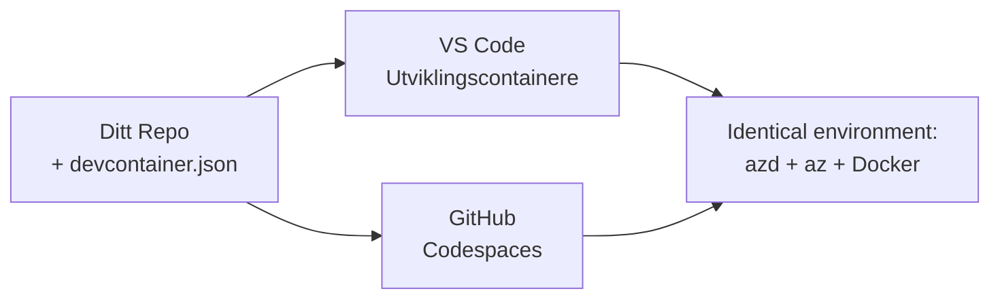

# Dev Containers & GitHub Codespaces for azd

**Kapittelnavigasjon:**
- **📚 Kurs Hjem**: [AZD For Nybegynnere](../../README.md)
- **📖 Nåværende Kapittel**: Kapittel 1 - Grunnlag & Rask Start
- **⬅️ Forrige**: [Bring Your Own App](bring-your-own-app.md)
- **🚀 Neste Kapittel**: [Kapittel 2: AI-Først Utvikling](../chapter-02-ai-development/README.md)

> Validert mot `azd 1.27.1` i juli 2026.

## Introduksjon

Å installere azd, riktig språk-runtime, Docker og Azure CLI på hver maskin er en krevende oppgave – og det er hovedårsaken til at en veiledning som «fungerer på min maskin» feiler for noen andre. En **dev container** løser dette ved å beskrive hele verktøykjeden din i en fil. Alle som åpner prosjektet i VS Code eller GitHub Codespaces får nøyaktig samme miljø, med azd allerede installert. Denne leksjonen viser deg hvordan du legger til en.

## Læringsmål

Innen slutten av denne leksjonen vil du:
- Forstå hva en dev container er og hvorfor det hjelper med azd
- Legge til en minimal `.devcontainer/devcontainer.json` til et prosjekt
- Inkludere azd, Azure CLI og Docker via Dev Container *features*
- Åpne prosjektet i GitHub Codespaces eller VS Code

## Læringsutbytte

Etter å ha fullført denne leksjonen vil du kunne:
- Lage en `devcontainer.json` for et azd-prosjekt
- Legge til azd og Azure-verktøy uten manuelle installasjoner
- Kjøre `azd up` fra innsiden av en container eller Codespace

---

## Hva er en Dev Container?

En dev container er et Docker-basert utviklingsmiljø definert av en `.devcontainer/devcontainer.json` fil i depotet ditt. Når du åpner prosjektet:

- **VS Code** (med Dev Containers-utvidelsen) bygger containeren og kobler til den.
- **GitHub Codespaces** bygger samme container i skyen og gir deg en nettleserbasert editor.

Uansett får hver bidragsyter identiske verktøy – ingen «har du installert azd?» feilsøking.



---

## Steg 1: Lag devcontainer-filen

Lag `.devcontainer/devcontainer.json` i roten av prosjektet ditt:

```json
{
  "name": "azd-project",
  "image": "mcr.microsoft.com/devcontainers/base:bookworm",
  "features": {
    "ghcr.io/devcontainers/features/azure-cli:1": {},
    "ghcr.io/azure/azure-dev/azd:latest": {},
    "ghcr.io/devcontainers/features/docker-in-docker:2": {},
    "ghcr.io/devcontainers/features/node:1": {}
  },
  "customizations": {
    "vscode": {
      "extensions": [
        "ms-azuretools.azure-dev",
        "ms-azuretools.vscode-bicep"
      ]
    }
  },
  "forwardPorts": [3000],
  "postCreateCommand": "azd version"
}
```

Hva hver del gjør:

| Nøkkel | Formål |
|-----|---------|
| `image` | Basissystemet for containeren |
| `features` | Ferdigbygde installatører – her: Azure CLI, **azd**, Docker og Node.js |
| `customizations.vscode.extensions` | Installerer automatisk azd og Bicep-utvidelsene for VS Code |
| `forwardPorts` | Eksponerer appens port til nettleseren din |
| `postCreateCommand` | Kjøres én gang etter at containeren er bygd (her, en enkel sjekk) |

> `ghcr.io/azure/azure-dev/azd:latest` feature er den offisielle måten å få azd i en container. Fest en spesifikk versjon (for eksempel `azd:1.27.1`) om du trenger reproduserbarhet.

---

## Steg 2: Tilpass feature til språk for appen din

Bytt ut `node`-feature med det som passer til appen din:

```jsonc
// Python project
"ghcr.io/devcontainers/features/python:1": {},

// .NET project
"ghcr.io/devcontainers/features/dotnet:2": {},

// Java project
"ghcr.io/devcontainers/features/java:1": {},

// Go project
"ghcr.io/devcontainers/features/go:1": {}
```

Behold `docker-in-docker` hvis `host` er `containerapp`, `aks` eller noe som bygger et containerbilde — azd trenger Docker for å bygge og pushe bilder.

---

## Steg 3: Åpne det

**I VS Code:**
1. Installer **Dev Containers** utvidelsen.
2. Åpne prosjektmappen.
3. Klikk **Reopen in Container** når du blir bedt om det (eller kjør *Dev Containers: Reopen in Container*).

**I GitHub Codespaces:**
1. Push repoet til GitHub.
2. Klikk **Code → Codespaces → Create codespace on main**.
3. Vent på at containeren bygges – azd er klart i terminalen.

---

## Steg 4: Deploy fra innsiden av containeren

Containeren har azd ferdig installert, så normal arbeidsflyt fungerer:

```bash
azd auth login --use-device-code   # enhetskode er praktisk inne i Codespaces
azd up
```

> **Hvorfor `--use-device-code`?** I en fjerncontainer eller Codespace finnes det ikke en lokal nettleser å omdirigere til, så device-code login er den pålitelige metoden. Du limer inn en kode i en nettleserfane for å fullføre pålogging.

---

## Vanlige fallgruver

| Fallgruve | Løsning |
|---------|-----|
| `azd up` kan ikke bygge et bilde | Legg til `docker-in-docker`-feature |
| Nettleserpålogging henger i Codespaces | Bruk `azd auth login --use-device-code` |
| Verktøy varierer mellom teammedlemmer | Fest feature-versjoner (f.eks. `azd:1.27.1`) |
| Appen er ikke tilgjengelig i nettleser | Legg porten til `forwardPorts` |

---

## Oppsummering

- En dev container gjør azd-verktøykjeden din reproduserbar for alle.
- Legg til azd, Azure CLI og Docker gjennom Dev Container *features*.
- Tilpass språkfeature til appen din og behold `docker-in-docker` for container-hosts.
- Bruk device-code login når du kjører inne i Codespaces.

---

## 🔗 Navigasjon

| Retning | Ressurs |
|-----------|----------|
| **Forrige** | [Bring Your Own App](bring-your-own-app.md) |
| **Kapittel Hjem** | [Kapittel 1: Grunnlag & Rask Start](README.md) |
| **Neste Kapittel** | [Kapittel 2: AI-Først Utvikling](../chapter-02-ai-development/README.md) |

## 📖 Relaterte ressurser

- [Installasjon & Setup](installation.md)
- [Kommando Hurtigreferanse](../../resources/cheat-sheet.md)
- [Offisiell Dev Containers-spesifikasjon](https://containers.dev/)
- [azd Dev Container feature](https://github.com/Azure/azure-dev/tree/main/ext/devcontainer)

---

<!-- CO-OP TRANSLATOR DISCLAIMER START -->
**Ansvarsfraskrivelse**:
Dette dokumentet er oversatt ved hjelp av AI-oversettelsestjenesten [Co-op Translator](https://github.com/Azure/co-op-translator). Selv om vi streber etter nøyaktighet, vær oppmerksom på at automatiske oversettelser kan inneholde feil eller unøyaktigheter. Det opprinnelige dokumentet på originalspråket skal betraktes som den autoritative kilden. For kritisk informasjon anbefales profesjonell menneskelig oversettelse. Vi er ikke ansvarlige for eventuelle misforståelser eller feiltolkninger som oppstår ved bruk av denne oversettelsen.
<!-- CO-OP TRANSLATOR DISCLAIMER END -->