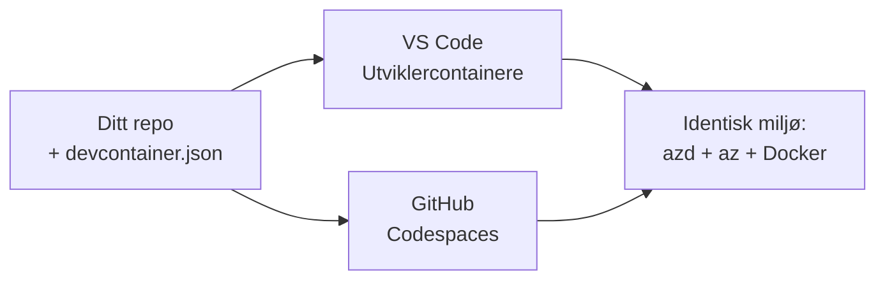

# Dev Containers & GitHub Codespaces for azd

**Chapter Navigation:**
- **📚 Kursoversikt**: [AZD For Beginners](../../README.md)
- **📖 Gjeldende kapittel**: Kapittel 1 - Grunnlag og Rask start
- **⬅️ Forrige**: [Bruk din egen app](bring-your-own-app.md)
- **🚀 Neste kapittel**: [Kapittel 2: AI-fokusert utvikling](../chapter-02-ai-development/README.md)

> Validert mot `azd 1.25.6` i juni 2026.

## Innledning

Å installere azd, riktig kjøretidsmiljø for språk, Docker og Azure CLI på hver maskin er en pliktoppgave—og det er den viktigste grunnen til at en veiledning som "fungerer på min maskin" feiler for noen andre. En **dev container** løser dette ved å beskrive hele verktøykjeden i en fil. Hvem som helst som åpner prosjektet i VS Code eller GitHub Codespaces får nøyaktig samme miljø, med azd allerede installert. Denne leksjonen viser deg hvordan du legger til en.

## Læringsmål

By the end of this lesson, you will:
- Forstå hva en dev container er og hvorfor det hjelper med azd
- Legg til en minimal `.devcontainer/devcontainer.json` i et prosjekt
- Inkluder azd, Azure CLI og Docker via Dev Container *features*
- Åpne prosjektet i GitHub Codespaces eller VS Code

## Læringsutbytte

After completing this lesson, you will be able to:
- Skrive en `devcontainer.json` for et azd-prosjekt
- Legg til azd og Azure-verktøy uten manuelle installasjoner
- Kjør `azd up` fra innsiden av en container eller Codespace

---

## Hva er en dev container?

En dev container er et Docker-basert utviklingsmiljø definert av en `.devcontainer/devcontainer.json`-fil i repositoryet ditt. Når du åpner prosjektet:

- **VS Code** (med Dev Containers-utvidelsen) bygger containeren og kobler seg til den.
- **GitHub Codespaces** bygger den samme containeren i skyen og gir deg en nettleserbasert editor.

Uansett får alle bidragsytere identiske verktøy—ingen "har du installert azd?"-feilsøking.



---

## Trinn 1: Opprett devcontainer-filen

Opprett `.devcontainer/devcontainer.json` i roten av prosjektet ditt:

```json
{
  "name": "azd-project",
  "image": "mcr.microsoft.com/devcontainers/base:bookworm",
  "features": {
    "ghcr.io/devcontainers/features/azure-cli:1": {},
    "ghcr.io/azure/azure-dev/azd:latest": {},
    "ghcr.io/devcontainers/features/docker-in-docker:2": {},
    "ghcr.io/devcontainers/features/node:1": {}
  },
  "customizations": {
    "vscode": {
      "extensions": [
        "ms-azuretools.azure-dev",
        "ms-azuretools.vscode-bicep"
      ]
    }
  },
  "forwardPorts": [3000],
  "postCreateCommand": "azd version"
}
```

Hva hver del gjør:

| Key | Purpose |
|-----|---------|
| `image` | Grunnleggende OS for containeren |
| `features` | Forhåndsbygde installatører—her: Azure CLI, **azd**, Docker og Node.js |
| `customizations.vscode.extensions` | Installerer automatisk azd- og Bicep-utvidelsene for VS Code |
| `forwardPorts` | Eksponerer appens port til nettleseren din |
| `postCreateCommand` | Kjører en gang etter at containeren er bygget (her: en kontrollsjekk) |

> The `ghcr.io/azure/azure-dev/azd:latest` feature is the official way to get azd in a container. Pin a specific version (for example `azd:1.25.6`) if you need reproducibility.

---

## Trinn 2: Tilpass funksjonen til appens språk

Bytt ut `node`-featureen med det appen din bruker:

```jsonc
// Python project
"ghcr.io/devcontainers/features/python:1": {},

// .NET project
"ghcr.io/devcontainers/features/dotnet:2": {},

// Java project
"ghcr.io/devcontainers/features/java:1": {},

// Go project
"ghcr.io/devcontainers/features/go:1": {}
```

La `docker-in-docker` være med hvis din `host` er `containerapp`, `aks` eller noe som bygger et containerbilde—azd trenger Docker for å bygge og pushe bilder.

---

## Trinn 3: Åpne den

**I VS Code:**
1. Installer **Dev Containers**-utvidelsen.
2. Åpne prosjektmappen.
3. Klikk **Reopen in Container** når du blir bedt om det (eller kjør *Dev Containers: Reopen in Container*).

**I GitHub Codespaces:**
1. Push repoet til GitHub.
2. Klikk **Code → Codespaces → Create codespace on main**.
3. Vent på at containeren bygges—azd er klar i terminalen.

---

## Trinn 4: Distribuer fra innsiden av containeren

Containeren har azd forhåndsinstallert, så normal arbeidsflyt fungerer rett ut av boksen:

```bash
azd auth login --use-device-code   # enhetskode er praktisk inne i Codespaces
azd up
```

> **Hvorfor `--use-device-code`?** I en fjern container eller Codespace finnes det ingen lokal nettleser å omdirigere til, så device-code-pålogging er den pålitelige metoden. Du limer inn en kode i en nettleserfane for å fullføre påloggingen.

---

## Vanlige fallgruver

| Fallgruve | Løsning |
|---------|-----|
| `azd up` kan ikke bygge et image | Legg til `docker-in-docker`-featureen |
| Nettleserinnlogging henger i Codespaces | Bruk `azd auth login --use-device-code` |
| Verktøy varierer mellom teammedlemmer | Lås feature-versjoner (f.eks. `azd:1.25.6`) |
| Appen er ikke tilgjengelig i nettleseren | Legg til porten i `forwardPorts` |

---

## Oppsummering

- En dev container gjør azd-verktøykjeden din reproduserbar for alle.
- Legg til azd, Azure CLI og Docker via Dev Container *features*.
- Match språkfunksjonen til appen din og behold `docker-in-docker` for container-verter.
- Bruk device-code-pålogging når du kjører inne i Codespaces.

---

## 🔗 Navigasjon

| Direction | Resource |
|-----------|----------|
| **Forrige** | [Bruk din egen app](bring-your-own-app.md) |
| **Kapitteloversikt** | [Kapittel 1: Grunnlag og Rask start](README.md) |
| **Neste kapittel** | [Kapittel 2: AI-fokusert utvikling](../chapter-02-ai-development/README.md) |

## 📖 Relaterte ressurser

- [Installasjon og oppsett](installation.md)
- [Kommando-hurtigreferanse](../../resources/cheat-sheet.md)
- [Offisiell Dev Containers-spesifikasjon](https://containers.dev/)
- [azd Dev Container-funksjon](https://github.com/Azure/azure-dev/tree/main/ext/devcontainer)

---

<!-- CO-OP TRANSLATOR DISCLAIMER START -->
**Ansvarsfraskrivelse**:
Dette dokumentet er oversatt ved hjelp av AI-oversettelsestjenesten [Co-op Translator](https://github.com/Azure/co-op-translator). Selv om vi streber etter nøyaktighet, vær oppmerksom på at automatiske oversettelser kan inneholde feil eller unøyaktigheter. Det opprinnelige dokumentet på originalspråket skal betraktes som den autoritative kilden. For kritisk informasjon anbefales profesjonell menneskelig oversettelse. Vi er ikke ansvarlige for eventuelle misforståelser eller feiltolkninger som oppstår ved bruk av denne oversettelsen.
<!-- CO-OP TRANSLATOR DISCLAIMER END -->