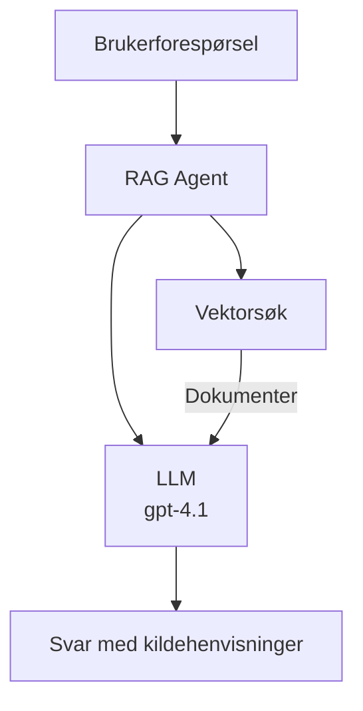
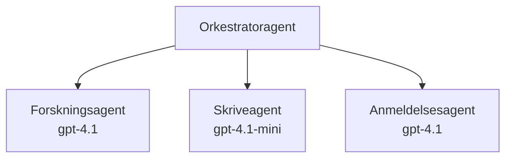

# AI-agenter med Azure Developer CLI

**Kapittelnavigasjon:**
- **📚 Kursstart**: [AZD For Beginners](../../README.md)
- **📖 Nåværende kapittel**: Kapittel 2 - AI-Først Utvikling
- **⬅️ Forrige**: [Microsoft Foundry-integrasjon](microsoft-foundry-integration.md)
- **➡️ Neste**: [AI-modellutrulling](ai-model-deployment.md)
- **🚀 Avansert**: [Multi-agent løsninger](../../examples/retail-scenario.md)

---

## Introduksjon

AI-agenter er autonome programmer som kan oppfatte omgivelsene sine, ta beslutninger og utføre handlinger for å nå spesifikke mål. I motsetning til enkle chatboter som svarer på forespørsler, kan agenter:

- **Bruke verktøy** - Kalle APIer, søke i databaser, kjøre kode
- **Planlegge og resonnere** - Dele opp komplekse oppgaver i trinn
- **Lære av kontekst** - Beholde minne og tilpasse oppførsel
- **Samarbeide** - Jobbe med andre agenter (multi-agent systemer)

Denne guiden viser hvordan du distribuerer AI-agenter til Azure ved hjelp av Azure Developer CLI (azd).

> **Valideringsmerknad (2026-03-25):** Denne guiden ble gjennomgått mot `azd` `1.23.12` og `azure.ai.agents` `0.1.18-preview`. `azd ai`-opplevelsen er fortsatt preview-basert, så sjekk hjelp for utvidelsen hvis installerte flagg avviker.

## Læringsmål

Ved å fullføre denne guiden vil du:
- Forstå hva AI-agenter er og hvordan de skiller seg fra chatboter
- Distribuere ferdigbygde AI-agentmaler med AZD
- Konfigurere Foundry-agenter for egendefinerte agenter
- Implementere grunnleggende agentmønstre (verktøybruk, RAG, multi-agent)
- Overvåke og feilsøke distribuerte agenter

## Læringsutbytte

Etter fullføring vil du kunne:
- Distribuere AI-agentapplikasjoner til Azure med én enkelt kommando
- Konfigurere agentverktøy og funksjoner
- Implementere hentingsforsterket generering (RAG) med agenter
- Designe multi-agent-arkitekturer for komplekse arbeidsflyter
- Feilsøke vanlige distribusjonsproblemer for agenter

---

## 🤖 Hva skiller en agent fra en chatbot?

| Egenskap | Chatbot | AI-agent |
|---------|---------|----------|
| **Oppførsel** | Svarer på forespørsler | Utfører autonome handlinger |
| **Verktøy** | Ingen | Kan kalle APIer, søke, kjøre kode |
| **Minne** | Kun sesjonsbasert | Vedvarende minne på tvers av økter |
| **Planlegging** | Én enkelt respons | Flertrinns resonnement |
| **Samarbeid** | Enkelt entitet | Kan samarbeide med andre agenter |

### Enkel analogi

- **Chatbot** = En hjelpsom person som svarer på spørsmål ved et informasjonsskranke
- **AI-agent** = En personlig assistent som kan ringe, booke avtaler og fullføre oppgaver for deg

---

## 🚀 Kom i gang raskt: Distribuer din første agent

### Valg 1: Foundry Agents-mal (anbefalt)

```bash
# Initialiser AI-agentmalen
azd init --template get-started-with-ai-agents

# Distribuer til Azure
azd up
```

**Hva som blir distribuert:**
- ✅ Foundry Agents
- ✅ Microsoft Foundry-modeller (gpt-4.1)
- ✅ Azure AI Search (for RAG)
- ✅ Azure Container Apps (webgrensesnitt)
- ✅ Application Insights (overvåking)

**Tid:** ~15-20 minutter
**Kostnad:** ~$100-150/måned (utvikling)

### Valg 2: OpenAI-agent med Prompty

```bash
# Initialiser Prompty-baserte agentmalen
azd init --template agent-openai-python-prompty

# Distribuer til Azure
azd up
```

**Hva som blir distribuert:**
- ✅ Azure Functions (serverløs agentkjøring)
- ✅ Microsoft Foundry-modeller
- ✅ Prompty-konfigurasjonsfiler
- ✅ Eksempelimplementering av agent

**Tid:** ~10-15 minutter
**Kostnad:** ~$50-100/måned (utvikling)

### Valg 3: RAG Chat-agent

```bash
# Initialiser RAG chat-mal
azd init --template azure-search-openai-demo

# Distribuer til Azure
azd up
```

**Hva som blir distribuert:**
- ✅ Microsoft Foundry-modeller
- ✅ Azure AI Search med eksempeldata
- ✅ Dokumentbehandlingspipeline
- ✅ Chatgrensesnitt med kildehenvisninger

**Tid:** ~15-25 minutter
**Kostnad:** ~$80-150/måned (utvikling)

### Valg 4: AZD AI Agent Init (Manifest- eller malbasert forhåndsvisning)

Hvis du har en agent-manifestfil, kan du bruke kommandoen `azd ai` for å opprette et Foundry Agent Service-prosjekt direkte. Nyere forhåndsvisningsversjoner har også lagt til malbasert initieringsstøtte, så det eksakte promptløpet kan variere litt avhengig av hvilken utgave av utvidelsen du har installert.

```bash
# Installer AI-agentutvidelsen
azd extension install azure.ai.agents

# Valgfritt: verifiser den installerte forhåndsvisningsversjonen
azd extension show azure.ai.agents

# Initialiser fra en agentmanifest
azd ai agent init -m agent-manifest.yaml

# Distribuer til Azure
azd up
```

**Når bruke `azd ai agent init` vs `azd init --template`:**

| Tilnærming | Best for | Hvordan det fungerer |
|------------|----------|---------------------|
| `azd init --template` | Starte med en fungerende eksempelapp | Kloner et fullstendig mal-depot med kode + infrastruktur |
| `azd ai agent init -m` | Bygge ut fra eget agentmanifest | Genererer prosjektstruktur basert på agentdefinisjonen din |

> **Tips:** Bruk `azd init --template` under læring (valg 1-3 ovenfor). Bruk `azd ai agent init` ved produksjonsbygging med egne manifest. Se [AZD AI CLI-kommandoer](../chapter-08-production/production-ai-practices.md#azd-ai-cli-commands-and-extensions) for full referanse.

---

## 🏗️ Agentarkitektur-mønstre

### Mønster 1: Enkel agent med verktøy

Det enkleste agentmønsteret - én agent som kan bruke flere verktøy.


**Best for:**
- Kundestøtte-boter
- Forskningsassistenter
- Dataanalyse-agenter

**AZD-mal:** `azure-search-openai-demo`

### Mønster 2: RAG-agent (hentingsforsterket generering)

En agent som henter relevante dokumenter før den genererer svar.


**Best for:**
- Bedriftskunnskapsbaser
- Spørsmål & svar-systemer for dokumenter
- Overholdelse og juridisk forskning

**AZD-mal:** `azure-search-openai-demo`

### Mønster 3: Multi-agent system

Flere spesialiserte agenter som jobber sammen på komplekse oppgaver.


**Best for:**
- Kompleks innholdsgenerering
- Flertrinns arbeidsflyter
- Oppgaver som krever ulik kompetanse

**Lær mer:** [Multi-agent koordinasjonsmønstre](../chapter-06-pre-deployment/coordination-patterns.md)

---

## ⚙️ Konfigurere agentverktøy

Agenter blir kraftige når de kan bruke verktøy. Slik konfigurerer du vanlige verktøy:

### Verktøykonfigurasjon i Foundry Agents

```python
# agent_config.py
from azure.ai.projects import AIProjectClient
from azure.ai.projects.models import FunctionTool, CodeInterpreterTool

# Definer tilpassede verktøy
search_tool = FunctionTool(
    name="search_knowledge_base",
    description="Search the company knowledge base for relevant documents",
    parameters={
        "type": "object",
        "properties": {
            "query": {
                "type": "string",
                "description": "The search query"
            }
        },
        "required": ["query"]
    }
)

# Opprett agent med verktøy
agent = project_client.agents.create_agent(
    model="gpt-4.1",
    name="Support Agent",
    instructions="You are a helpful support agent. Use the search tool to find relevant information.",
    tools=[search_tool, CodeInterpreterTool()]
)
```

### Miljøkonfigurasjon

```bash
# Sett opp agent-spesifikke miljøvariabler
azd env set AZURE_OPENAI_MODEL "gpt-4.1"
azd env set AGENT_INSTRUCTIONS "You are a helpful assistant..."
azd env set ENABLE_CODE_INTERPRETER "true"
azd env set ENABLE_FILE_SEARCH "true"

# Distribuer med oppdatert konfigurasjon
azd deploy
```

---

## 📊 Overvåke agenter

### Application Insights-integrasjon

Alle AZD-agentmaler inkluderer Application Insights for overvåking:

```bash
# Åpne overvåkingsdashbord
azd monitor --overview

# Se direkte logger
azd monitor --logs

# Se direkte målinger
azd monitor --live
```

### Viktige måleparametere å følge med på

| Måleparameter | Beskrivelse | Mål |
|---------------|-------------|-----|
| Responstid | Tid for å generere svar | < 5 sekunder |
| Tokenbruk | Tokens per forespørsel | Overvåk for kostnad |
| Verktøykall vellykket | % av vellykkede verktøykjøringer | > 95 % |
| Feilrate | Feilede agentforespørsler | < 1 % |
| Brukertilfredshet | Tilbakemeldingsscore | > 4.0/5.0 |

### Egendefinert logging for agenter

```python
import os
from azure.monitor.opentelemetry import configure_azure_monitor
from opentelemetry import trace

# Konfigurer Azure Monitor med OpenTelemetry
configure_azure_monitor(
    connection_string=os.environ["APPLICATIONINSIGHTS_CONNECTION_STRING"]
)

tracer = trace.get_tracer(__name__)

def log_agent_interaction(user_query, agent_response, tools_used, latency_ms):
    with tracer.start_as_current_span("agent_interaction") as span:
        span.set_attributes({
            "user_query": user_query,
            "response_length": len(agent_response),
            "tools_used": tools_used,
            "latency_ms": latency_ms
        })
```

> **Merk:** Installer nødvendige pakker: `pip install azure-monitor-opentelemetry opentelemetry`

---

## 💰 Kostnadsvurderinger

### Estimerte månedlige kostnader etter mønster

| Mønster | Utviklingsmiljø | Produksjon |
|---------|-----------------|------------|
| Enkel agent | $50-100 | $200-500 |
| RAG-agent | $80-150 | $300-800 |
| Multi-agent (2-3 agenter) | $150-300 | $500-1,500 |
| Enterprise multi-agent | $300-500 | $1,500-5,000+ |

### Kostnadsoptimaliseringstips

1. **Bruk gpt-4.1-mini for enkle oppgaver**
   ```bash
   azd env set AZURE_OPENAI_MODEL "gpt-4.1-mini"
   ```

2. **Implementer caching for gjentatte spørringer**
   ```python
   from functools import lru_cache
   
   @lru_cache(maxsize=1000)
   def get_cached_response(query_hash):
       return agent.run(query_hash)
   ```

3. **Sett tokengrenser per kjøring**
   ```python
   # Sett max_completion_tokens når du kjører agenten, ikke under opprettelse
   run = project_client.agents.create_run(
       thread_id=thread.id,
       agent_id=agent.id,
       max_completion_tokens=1000  # Begrens svarlengde
   )
   ```

4. **Skaler ned til null når agenten ikke er i bruk**
   ```bash
   # Containerapper skalerer automatisk ned til null
   azd env set MIN_REPLICAS "0"
   ```

---

## 🔧 Feilsøking av agenter

### Vanlige problemer og løsninger

<details>
<summary><strong>❌ Agent svarer ikke på verktøykall</strong></summary>

```bash
# Sjekk om verktøy er riktig registrert
azd show

# Verifiser OpenAI-distribusjon
az cognitiveservices account deployment list \
  --name $AZURE_OPENAI_NAME \
  --resource-group $RG_NAME

# Sjekk agentlogger
azd monitor --logs
```

**Vanlige årsaker:**
- Funksjonssignatur på verktøy ikke samsvarer
- Manglende nødvendige tillatelser
- API-endepunkt ikke tilgjengelig
</details>

<details>
<summary><strong>❌ Høy ventetid i agentsvar</strong></summary>

```bash
# Sjekk Application Insights for flaskehalser
azd monitor --live

# Vurder å bruke en raskere modell
azd env set AZURE_OPENAI_MODEL "gpt-4.1-mini"
azd deploy
```

**Optimaliseringstips:**
- Bruk streaming-responser
- Implementer responscaching
- Reduser kontekstvinduets størrelse
</details>

<details>
<summary><strong>❌ Agent gir feilaktig eller hallusinerende informasjon</strong></summary>

```python
# Forbedre med bedre systemoppfordringer
instructions = """
You are a helpful assistant. IMPORTANT:
- Only answer based on provided context
- If you don't know, say "I don't know"
- Always cite your sources
- Never make up information
"""

# Legg til innhenting for grunnlag
agent = project_client.agents.create_agent(
    model="gpt-4.1",
    instructions=instructions,
    tools=[FileSearchTool()]  # Forankre svar i dokumenter
)
```
</details>

<details>
<summary><strong>❌ Token-limit overskridelsesfeil</strong></summary>

```python
# Implementer kontekstvinduadministrasjon
def truncate_context(messages, max_tokens=8000, model="gpt-4.1"):
    """Keep only recent messages within token limit."""
    import tiktoken
    encoding = tiktoken.encoding_for_model(model)
    total_tokens = 0
    truncated = []
    
    for msg in reversed(messages):
        msg_tokens = len(encoding.encode(msg.content))
        if total_tokens + msg_tokens > max_tokens:
            break
        truncated.insert(0, msg)
        total_tokens += msg_tokens
    
    return truncated
```
</details>

---

## 🎓 Praktiske øvelser

### Øvelse 1: Distribuer en grunnleggende agent (20 minutter)

**Mål:** Distribuer din første AI-agent med AZD

```bash
# Trinn 1: Initialiser mal
azd init --template get-started-with-ai-agents

# Trinn 2: Logg inn på Azure
azd auth login
# Hvis du jobber på tvers av leietakere, legg til --tenant-id <tenant-id>

# Trinn 3: Distribuer
azd up

# Trinn 4: Test agenten
# Forventet resultat etter distribusjon:
#   Distribusjon fullført!
#   Endepunkt: https://<app-name>.<region>.azurecontainerapps.io
# Åpne URL-en som vises i utskriften og prøv å stille et spørsmål

# Trinn 5: Se overvåkning
azd monitor --overview

# Trinn 6: Rydd opp
azd down --force --purge
```

**Suksesskriterier:**
- [ ] Agent svarer på spørsmål
- [ ] Kan få tilgang til overvåkingsdashbord via `azd monitor`
- [ ] Ressurser ryddes opp uten feil

### Øvelse 2: Legg til et egendefinert verktøy (30 minutter)

**Mål:** Utvid en agent med et egendefinert verktøy

1. Distribuer agentmal:
   ```bash
   azd init --template get-started-with-ai-agents
   azd up
   ```
2. Lag en ny verktøyfunksjon i agentkoden din:
   ```python
   def get_weather(location: str) -> str:
       """Get current weather for a location."""
       # API-kall til værmeldingstjeneste
       return f"Weather in {location}: Sunny, 72°F"
   ```
3. Registrer verktøyet med agenten:
   ```python
   from azure.ai.projects.models import FunctionTool

   weather_tool = FunctionTool(
       name="get_weather",
       description="Get current weather for a location",
       parameters={
           "type": "object",
           "properties": {
               "location": {"type": "string", "description": "City name"}
           },
           "required": ["location"]
       }
   )

   agent = project_client.agents.create_agent(
       model="gpt-4.1",
       name="Weather Agent",
       tools=[weather_tool]
   )
   ```
4. Distribuer på nytt og test:
   ```bash
   azd deploy
   # Spør: "Hvordan er været i Seattle?"
   # Forventet: Agenten kaller get_weather("Seattle") og returnerer værinformasjon
   ```

**Suksesskriterier:**
- [ ] Agent gjenkjenner værrelaterte spørsmål
- [ ] Verktøy kalles korrekt
- [ ] Svar inneholder værinformasjon

### Øvelse 3: Lag en RAG-agent (45 minutter)

**Mål:** Lag en agent som svarer på spørsmål fra dokumentene dine

```bash
# Steg 1: Distribuer RAG-malen
azd init --template azure-search-openai-demo
azd up

# Steg 2: Last opp dokumentene dine
# Plasser PDF/TXT-filer i data/-katalogen, kjør deretter:
python scripts/prepdocs.py

# Steg 3: Test med domenespesifikke spørsmål
# Åpne nettappens URL fra azd up-utdataene
# Still spørsmål om de opplastede dokumentene dine
# Svarene bør inkludere siteringsreferanser som [doc.pdf]
```

**Suksesskriterier:**
- [ ] Agent svarer basert på opplastede dokumenter
- [ ] Svar inkluderer kildehenvisninger
- [ ] Ingen hallusinasjoner om utenfor-område spørsmål

---

## 📚 Neste steg

Nå som du forstår AI-agenter, kan du utforske disse avanserte temaene:

| Tema | Beskrivelse | Lenke |
|-------|-------------|-------|
| **Multi-agent systemer** | Bygg systemer med flere samarbeidende agenter | [Retail Multi-Agent Eksempel](../../examples/retail-scenario.md) |
| **Koordineringsmønstre** | Lær orkestrerings- og kommunikasjonsmønstre | [Koordineringsmønstre](../chapter-06-pre-deployment/coordination-patterns.md) |
| **Produksjonsutrulling** | Agentutrulling klar for bedrift | [Produksjons AI-praksis](../chapter-08-production/production-ai-practices.md) |
| **Agentevaluering** | Test og evaluer agentytelse | [AI Feilsøking](../chapter-07-troubleshooting/ai-troubleshooting.md) |
| **AI Workshop Lab** | Praktisk: Gjør AI-løsningen din AZD-klar | [AI Workshop Lab](ai-workshop-lab.md) |

---

## 📖 Ytterligere ressurser

### Offisiell dokumentasjon
- [Azure AI Agent Service](https://learn.microsoft.com/azure/ai-services/agents/)
- [Azure AI Foundry Agent Service Hurtigstart](https://learn.microsoft.com/azure/ai-services/agents/quickstart)
- [Semantic Kernel Agent Framework](https://learn.microsoft.com/semantic-kernel/)

### AZD-maler for agenter
- [Kom i gang med AI-agenter](https://github.com/Azure-Samples/get-started-with-ai-agents)
- [Agent OpenAI Python Prompty](https://github.com/Azure-Samples/agent-openai-python-prompty)
- [Azure Search OpenAI Demo](https://github.com/Azure-Samples/azure-search-openai-demo)

### Fellesskapsressurser
- [Awesome AZD - Agentmaler](https://azure.github.io/awesome-azd/?tags=ai-agents)
- [Azure AI Discord](https://discord.gg/microsoft-azure)
- [Microsoft Foundry Discord](https://discord.gg/nTYy5BXMWG)

### Agentferdigheter for redigereren din
- [**Microsoft Azure Agent Skills**](https://skills.sh/microsoft/github-copilot-for-azure) - Installer gjenbrukbare AI-agentferdigheter for Azure-utvikling i GitHub Copilot, Cursor eller andre støttede agenter. Inkluderer ferdigheter for [Azure AI](https://skills.sh/microsoft/github-copilot-for-azure/azure-ai), [Microsoft Foundry](https://skills.sh/microsoft/github-copilot-for-azure/microsoft-foundry), [utrulling](https://skills.sh/microsoft/github-copilot-for-azure/azure-deploy) og [diagnostikk](https://skills.sh/microsoft/github-copilot-for-azure/azure-diagnostics):
  ```bash
  npx skills add microsoft/github-copilot-for-azure
  ```

---

**Navigasjon**
- **Forrige leksjon**: [Microsoft Foundry-integrasjon](microsoft-foundry-integration.md)
- **Neste leksjon**: [AI-modellutrulling](ai-model-deployment.md)

---

<!-- CO-OP TRANSLATOR DISCLAIMER START -->
**Ansvarsfraskrivelse**:  
Dette dokumentet er oversatt ved bruk av AI-oversettelsestjenesten [Co-op Translator](https://github.com/Azure/co-op-translator). Selv om vi streber etter nøyaktighet, vennligst vær oppmerksom på at automatiserte oversettelser kan inneholde feil eller unøyaktigheter. Det originale dokumentet på det opprinnelige språket skal betraktes som den autoritative kilden. For kritisk informasjon anbefales profesjonell menneskelig oversettelse. Vi er ikke ansvarlige for misforståelser eller feiltolkninger som følge av bruk av denne oversettelsen.
<!-- CO-OP TRANSLATOR DISCLAIMER END -->