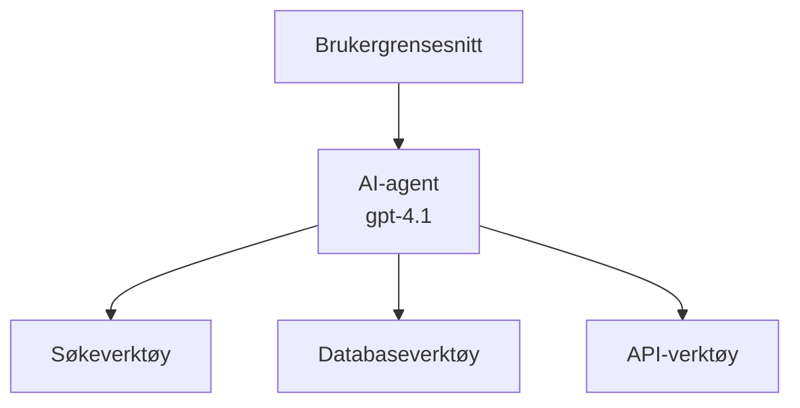
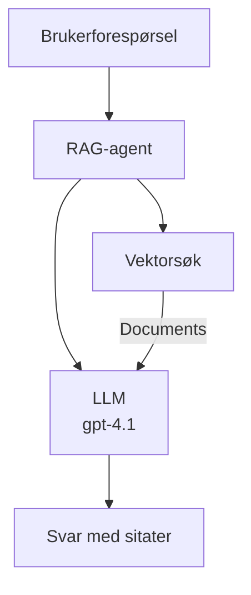
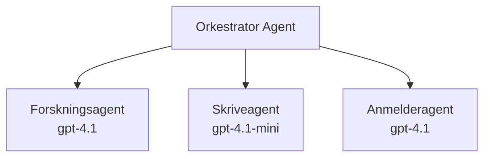

# AI-agenter med Azure Developer CLI

**Kapittelnavigasjon:**
- **📚 Kursstart**: [AZD for nybegynnere](../../README.md)
- **📖 Nåværende kapittel**: Kapittel 2 - AI-fokusert utvikling
- **⬅️ Forrige**: [Microsoft Foundry-integrasjon](microsoft-foundry-integration.md)
- **➡️ Neste**: [Distribusjon av AI-modeller](ai-model-deployment.md)
- **🚀 Avansert**: [Multi-agentløsninger](../../examples/retail-scenario.md)

---

## Introduksjon

AI-agenter er autonome programmer som kan oppfatte omgivelsene, ta beslutninger og utføre handlinger for å nå bestemte mål. I motsetning til enkle chatboter som svarer på forespørsler, kan agenter:

- **Bruke verktøy** - Kalle APIer, søke i databaser, kjøre kode
- **Planlegge og resonnere** - Dele opp komplekse oppgaver i steg
- **Lære fra kontekst** - Bevare hukommelse og tilpasse atferd
- **Samarbeide** - Arbeide med andre agenter (multi-agent-systemer)

Denne guiden viser hvordan du distribuerer AI-agenter til Azure ved hjelp av Azure Developer CLI (azd).

> **Valideringsmerknad (2026-07-13):** Denne guiden ble gjennomgått med `azd` `1.27.1` og `azure.ai.agents` `1.0.0-beta.5`. `azd ai`-opplevelsen er fortsatt preget av forhåndsvisninger, så sjekk hjelp for utvidelsen hvis flaggene dine er annerledes.

## Læringsmål

Ved å fullføre denne guiden vil du:
- Forstå hva AI-agenter er og hvordan de skiller seg fra chatboter
- Distribuere forhåndslagde maler for AI-agenter med AZD
- Konfigurere Foundry Agents for tilpassede agenter
- Implementere grunnleggende agentmønstre (verktøybruk, RAG, multi-agent)
- Overvåke og feilsøke distribuerte agenter

## Læringsutbytte

Etter fullføring vil du kunne:
- Distribuere AI-agentapplikasjoner til Azure med en enkelt kommando
- Konfigurere agentverktøy og funksjoner
- Implementere retrieval-augmented generation (RAG) med agenter
- Designe multi-agent-arkitekturer for komplekse arbeidsflyter
- Feilsøke vanlige problemer ved agentdistribusjon

---

## 🤖 Hva gjør en agent forskjellig fra en chatbot?

| Funksjon | Chatbot | AI-agent |
|---------|---------|----------|
| **Atferd** | Svarer på forespørsler | Tar autonome handlinger |
| **Verktøy** | Ingen | Kan kalle APIer, søke, kjøre kode |
| **Hukommelse** | Kun øktbasert | Vedvarende hukommelse over økter |
| **Planlegging** | Ett enkelt svar | Flertrinns resonnering |
| **Samarbeid** | Enkelt entitet | Kan arbeide med andre agenter |

### Enkel analogi

- **Chatbot** = En hjelpsom person som svarer på spørsmål ved informasjonsskranken
- **AI-agent** = En personlig assistent som kan ringe, booke avtaler og utføre oppgaver for deg

---

## 🚀 Rask start: Distribuer din første agent

### Alternativ 1: Foundry Agents-mal (Anbefalt)

```bash
# Initialiser AI-agentmalen
azd init --template get-started-with-ai-agents

# Distribuer til Azure
azd up
```

**Hva som distribueres:**
- ✅ Foundry Agents
- ✅ Microsoft Foundry-modeller (gpt-4.1)
- ✅ Azure AI Search (for RAG)
- ✅ Azure Container Apps (webgrensesnitt)
- ✅ Application Insights (overvåking)

**Tid:** ~15-20 minutter
**Kostnad:** ~$100-150/måned (utvikling)

### Alternativ 2: OpenAI-agent med Prompty

```bash
# Initialiser Prompty-basert agentmal
azd init --template agent-openai-python-prompty

# Distribuer til Azure
azd up
```

**Hva som distribueres:**
- ✅ Azure Functions (serverløs agentutførelse)
- ✅ Microsoft Foundry-modeller
- ✅ Prompty-konfigurasjonsfiler
- ✅ Eksempelimplementasjon av agent

**Tid:** ~10-15 minutter
**Kostnad:** ~$50-100/måned (utvikling)

### Alternativ 3: RAG Chat Agent

```bash
# Initialiser RAG chat-mal
azd init --template azure-search-openai-demo

# Distribuer til Azure
azd up
```

**Hva som distribueres:**
- ✅ Microsoft Foundry-modeller
- ✅ Azure AI Search med eksempeldata
- ✅ Dokumentbehandlingspipeline
- ✅ Chatgrensesnitt med sitater

**Tid:** ~15-25 minutter
**Kostnad:** ~$80-150/måned (utvikling)

### Alternativ 4: AZD AI Agent Init (Manifes- eller malbasert forhåndsvisning)

Hvis du har en agent-manifestfil, kan du bruke `azd ai`-kommandoen til å skaffe et Foundry Agent Service-prosjekt direkte. Nylige forhåndsvisningsutgivelser la også til støtte for malbasert initiering, så den eksakte ledetekstflyten kan variere noe avhengig av hvilken utvidelsesversjon du har installert.

```bash
# Installer AI-agentutvidelsen
azd extension install azure.ai.agents

# Valgfritt: verifiser den installerte forhåndsvisningsversjonen
azd extension show azure.ai.agents

# Initialiser fra en agentmanifest
azd ai agent init -m agent-manifest.yaml

# Distribuer til Azure
azd up

# Test den distribuerte agenten (viser ventetid + tid til første byte)
azd ai agent invoke
```

**Når du skal bruke `azd ai agent init` vs `azd init --template`:**

| Tilnærming | Best for | Hvordan det fungerer |
|----------|----------|------|
| `azd init --template` | Starte fra en fungerende eksempelapp | Kloner et fullt malrepo med kode + infrastruktur |
| `azd ai agent init -m` | Bygge ut fra egen agentmanifest | Lager prosjektstruktur basert på agentdefinisjonen |

> **Tips:** Bruk `azd init --template` ved læring (Alternativ 1-3 over). Bruk `azd ai agent init` ved bygging av produksjonsagenter med egne manifest.

Etter `azd up` følger samme utvidelse deg gjennom resten av agentlivssyklusen: `azd ai agent invoke` for testing, `azd ai agent eval generate` og `azd ai agent optimize` for å måle og forbedre kvalitet, og `azd ai agent delete` for å rydde opp. Se [AZD AI CLI Commands](../chapter-08-production/production-ai-practices.md#azd-ai-cli-commands-and-extensions) for full referanse.

---

## 🏗️ Agentarkitekturmønstre

### Mønster 1: Enkeltagent med verktøy

Det enkleste agentmønsteret - en agent som kan bruke flere verktøy.



**Best for:**
- Kundestøtteboter
- Forskningsassistenter
- Dataanalyseagenter

**AZD-mal:** `azure-search-openai-demo`

### Mønster 2: RAG-agent (Retrieval-Augmented Generation)

En agent som henter relevante dokumenter før den genererer svar.



**Best for:**
- Bedriftskunnskapsbaser
- Dokument-spørsmål & svar-systemer
- Samsvar og juridisk forskning

**AZD-mal:** `azure-search-openai-demo`

### Mønster 3: Multi-agent-system

Flere spesialiserte agenter som samarbeider om komplekse oppgaver.



**Best for:**
- Kompleks innholdsgenerering
- Flesteg arbeidsflyter
- Oppgaver som krever ulik ekspertise

**Les mer:** [Multi-agent koordinasjonsmønstre](../chapter-06-pre-deployment/coordination-patterns.md)

---

## ⚙️ Konfigurering av agentverktøy

Agenter blir kraftige når de kan bruke verktøy. Slik konfigureres vanlige verktøy:

### Verktøykonfigurasjon i Foundry Agents

```python
# agent_config.py
from azure.ai.projects import AIProjectClient
from azure.ai.projects.models import FunctionTool, CodeInterpreterTool

# Definer egendefinerte verktøy
search_tool = FunctionTool(
    name="search_knowledge_base",
    description="Search the company knowledge base for relevant documents",
    parameters={
        "type": "object",
        "properties": {
            "query": {
                "type": "string",
                "description": "The search query"
            }
        },
        "required": ["query"]
    }
)

# Opprett agent med verktøy
agent = project_client.agents.create_agent(
    model="gpt-4.1",
    name="Support Agent",
    instructions="You are a helpful support agent. Use the search tool to find relevant information.",
    tools=[search_tool, CodeInterpreterTool()]
)
```

### Miljøkonfigurasjon

```bash
# Sett opp agent-spesifikke miljøvariabler
azd env set AZURE_OPENAI_MODEL "gpt-4.1"
azd env set AGENT_INSTRUCTIONS "You are a helpful assistant..."
azd env set ENABLE_CODE_INTERPRETER "true"
azd env set ENABLE_FILE_SEARCH "true"

# Distribuer med oppdatert konfigurasjon
azd deploy
```

---

## 📊 Overvåking av agenter

### Integrasjon med Application Insights

Alle AZD-agentmaler inkluderer Application Insights for overvåking:

```bash
# Åpne overvåkingsdashbord
azd monitor --overview

# Se live logger
azd monitor --logs

# Se live målinger
azd monitor --live
```

### Viktige måleparametere å følge med på

| Måleparameter | Beskrivelse | Mål |
|-------------|-------------|-----|
| Svarforsinkelse | Tid for å generere svar | < 5 sekunder |
| Tokenbruk | Token per forespørsel | Overvåk kostnader |
| Verktøyløsningsrate | % vellykkede verktøykall | > 95 % |
| Feilrate | Mislykkede agentforespørsler | < 1 % |
| Brukertilfredshet | Tilbakemeldingsscore | > 4.0/5.0 |

### Egendefinert logging for agenter

```python
import os
from azure.monitor.opentelemetry import configure_azure_monitor
from opentelemetry import trace

# Konfigurer Azure Monitor med OpenTelemetry
configure_azure_monitor(
    connection_string=os.environ["APPLICATIONINSIGHTS_CONNECTION_STRING"]
)

tracer = trace.get_tracer(__name__)

def log_agent_interaction(user_query, agent_response, tools_used, latency_ms):
    with tracer.start_as_current_span("agent_interaction") as span:
        span.set_attributes({
            "user_query": user_query,
            "response_length": len(agent_response),
            "tools_used": tools_used,
            "latency_ms": latency_ms
        })
```

> **Merk:** Installer nødvendige pakker: `pip install azure-monitor-opentelemetry opentelemetry`

---

## 💰 Kostnadsvurderinger

### Estimerte månedlige kostnader per mønster

| Mønster | Utviklingsmiljø | Produksjon |
|---------|-----------------|------------|
| Enkeltagent | $50-100 | $200-500 |
| RAG-agent | $80-150 | $300-800 |
| Multi-agent (2-3 agenter) | $150-300 | $500-1,500 |
| Enterprise multi-agent | $300-500 | $1,500-5,000+ |

### Tips for kostnadsoptimalisering

1. **Bruk gpt-4.1-mini for enkle oppgaver**
   ```bash
   azd env set AZURE_OPENAI_MODEL "gpt-4.1-mini"
   ```

2. **Implementer hurtigbuffer for gjentatte forespørsler**
   ```python
   from functools import lru_cache
   
   @lru_cache(maxsize=1000)
   def get_cached_response(query_hash):
       return agent.run(query_hash)
   ```

3. **Sett tokenbegrensninger per kjøring**
   ```python
   # Sett max_completion_tokens når du kjører agenten, ikke under opprettelse
   run = project_client.agents.create_run(
       thread_id=thread.id,
       agent_id=agent.id,
       max_completion_tokens=1000  # Begrens svartlengde
   )
   ```

4. **Skaler til null når du ikke bruker**
   ```bash
   # Container Apps skalerer automatisk til null
   azd env set MIN_REPLICAS "0"
   ```

---

## 🔧 Feilsøking av agenter

### Vanlige problemer og løsninger

<details>
<summary><strong>❌ Agent svarer ikke på verktøykall</strong></summary>

```bash
# Sjekk om verktøy er riktig registrert
azd show

# Verifiser OpenAI-distribusjon
az cognitiveservices account deployment list \
  --name $AZURE_OPENAI_NAME \
  --resource-group $RG_NAME

# Sjekk agentlogger
azd monitor --logs
```

**Vanlige årsaker:**
- Funksjonssignatur for verktøy stemmer ikke
- Manglende nødvendige tillatelser
- API-endepunkt utilgjengelig
</details>

<details>
<summary><strong>❌ Høy ventetid i agentens svar</strong></summary>

```bash
# Sjekk Application Insights for flaskehalser
azd monitor --live

# Vurder å bruke en raskere modell
azd env set AZURE_OPENAI_MODEL "gpt-4.1-mini"
azd deploy
```

**Optimaliseringstips:**
- Bruk strømmet svar
- Implementer hurtigbuffer for svar
- Reduser kontekstvinduets størrelse
</details>

<details>
<summary><strong>❌ Agent returnerer feil eller halusinerende informasjon</strong></summary>

```python
# Forbedre med bedre systeminstruksjoner
instructions = """
You are a helpful assistant. IMPORTANT:
- Only answer based on provided context
- If you don't know, say "I don't know"
- Always cite your sources
- Never make up information
"""

# Legg til oppslag for forankring
agent = project_client.agents.create_agent(
    model="gpt-4.1",
    instructions=instructions,
    tools=[FileSearchTool()]  # Forankre svar i dokumenter
)
```
</details>

<details>
<summary><strong>❌ Feil for tokengrense overskredet</strong></summary>

```python
# Implementer håndtering av kontekstvinduet
def truncate_context(messages, max_tokens=8000, model="gpt-4.1"):
    """Keep only recent messages within token limit."""
    import tiktoken
    encoding = tiktoken.encoding_for_model(model)
    total_tokens = 0
    truncated = []
    
    for msg in reversed(messages):
        msg_tokens = len(encoding.encode(msg.content))
        if total_tokens + msg_tokens > max_tokens:
            break
        truncated.insert(0, msg)
        total_tokens += msg_tokens
    
    return truncated
```
</details>

---

## 🎓 Praktiske øvelser

### Øvelse 1: Distribuer en grunnleggende agent (20 minutter)

**Mål:** Distribuer din første AI-agent med AZD

```bash
# Trinn 1: Initialiser mal
azd init --template get-started-with-ai-agents

# Trinn 2: Logg inn på Azure
azd auth login
# Hvis du jobber på tvers av leietakere, legg til --tenant-id <tenant-id>

# Trinn 3: Distribuer
azd up

# Trinn 4: Test agenten
# Forventet resultat etter distribusjon:
#   Distribusjon fullført!
#   Endepunkt: https://<app-name>.<region>.azurecontainerapps.io
# Åpne URL-en som vises i output og prøv å stille et spørsmål

# Trinn 5: Se overvåking
azd monitor --overview

# Trinn 6: Rydd opp
azd down --force --purge
```

**Kriterier for suksess:**
- [ ] Agent svarer på spørsmål
- [ ] Har tilgang til overvåkingsdashbord via `azd monitor`
- [ ] Ressurser ryddet opp vellykket

### Øvelse 2: Legg til et tilpasset verktøy (30 minutter)

**Mål:** Utvid en agent med et tilpasset verktøy

1. Distribuer agentmalen:
   ```bash
   azd init --template get-started-with-ai-agents
   azd up
   ```
2. Lag en ny verktøyfunksjon i agentkoden din:
   ```python
   def get_weather(location: str) -> str:
       """Get current weather for a location."""
       # API-kall til værmeldingstjeneste
       return f"Weather in {location}: Sunny, 72°F"
   ```
3. Registrer verktøyet med agenten:
   ```python
   from azure.ai.projects.models import FunctionTool

   weather_tool = FunctionTool(
       name="get_weather",
       description="Get current weather for a location",
       parameters={
           "type": "object",
           "properties": {
               "location": {"type": "string", "description": "City name"}
           },
           "required": ["location"]
       }
   )

   agent = project_client.agents.create_agent(
       model="gpt-4.1",
       name="Weather Agent",
       tools=[weather_tool]
   )
   ```
4. Distribuer på nytt og test:
   ```bash
   azd deploy
   # Spør: "Hvordan er været i Seattle?"
   # Forventet: Agenten kaller get_weather("Seattle") og returnerer værinformasjon
   ```

**Kriterier for suksess:**
- [ ] Agent kjenner igjen værrelaterte spørsmål
- [ ] Verktøy blir kalt korrekt
- [ ] Svar inkluderer værinformasjon

### Øvelse 3: Bygg en RAG-agent (45 minutter)

**Mål:** Lag en agent som svarer på spørsmål basert på dine dokumenter

```bash
# Trinn 1: Distribuer RAG-mal
azd init --template azure-search-openai-demo
azd up

# Trinn 2: Last opp dokumentene dine
# Plasser PDF/TXT-filer i data/-katalogen, kjør deretter:
python scripts/prepdocs.py

# Trinn 3: Test med domenespesifikke spørsmål
# Åpne nettapp-URL-en fra azd up-utdataene
# Still spørsmål om de opplastede dokumentene dine
# Svar bør inkludere siteringsreferanser som [doc.pdf]
```

**Kriterier for suksess:**
- [ ] Agent svarer basert på opplastede dokumenter
- [ ] Svar inkluderer referanser
- [ ] Ingen hallusinasjon på spørsmål utenfor omfang

---

## 📚 Neste steg

Nå som du forstår AI-agenter, kan du utforske disse avanserte emnene:

| Emne | Beskrivelse | Lenke |
|-------|-------------|------|
| **Multi-agent-systemer** | Bygg systemer med flere samarbeidende agenter | [Retail Multi-Agent Eksempel](../../examples/retail-scenario.md) |
| **Koordineringsmønstre** | Lær orkestrering og kommunikasjonsmønstre | [Koordineringsmønstre](../chapter-06-pre-deployment/coordination-patterns.md) |
| **Produksjonsdistribusjon** | Agentdistribusjon for bedriftsbruk | [Produksjon AI-praksis](../chapter-08-production/production-ai-practices.md) |
| **Agentevaluering** | Test og evaluer agenters ytelse | [AI Feilsøking](../chapter-07-troubleshooting/ai-troubleshooting.md) |
| **AI Workshop Lab** | Praktisk: Gjør din AI-løsning klar for AZD | [AI Workshop Lab](ai-workshop-lab.md) |

---

## 📖 Ytterligere ressurser

### Offisiell dokumentasjon
- [Microsoft Foundry Agent Service](https://learn.microsoft.com/azure/ai-services/agents/)
- [Microsoft Foundry Agent Service Quickstart](https://learn.microsoft.com/azure/ai-services/agents/quickstart)
- [Semantic Kernel Agent Framework](https://learn.microsoft.com/semantic-kernel/)

### AZD-maler for agenter
- [Kom i gang med AI-agenter](https://github.com/Azure-Samples/get-started-with-ai-agents)
- [Agent OpenAI Python Prompty](https://github.com/Azure-Samples/agent-openai-python-prompty)
- [Azure Search OpenAI Demo](https://github.com/Azure-Samples/azure-search-openai-demo)

### Fellesskapsressurser
- [Awesome AZD - Agentmaler](https://azure.github.io/awesome-azd/?tags=ai-agents)
- [Azure AI Discord](https://discord.gg/microsoft-azure)
- [Microsoft Foundry Discord](https://discord.gg/nTYy5BXMWG)

### Agentferdigheter for redigeringsprogrammet ditt
- [**Microsoft Azure Agent Skills**](https://skills.sh/microsoft/github-copilot-for-azure) - Installer gjenbrukbare AI-agentferdigheter for Azure-utvikling i GitHub Copilot, Cursor eller hvilken som helst støttet agent. Inkluderer ferdigheter for [Azure AI](https://skills.sh/microsoft/github-copilot-for-azure/azure-ai), [Microsoft Foundry](https://skills.sh/microsoft/github-copilot-for-azure/microsoft-foundry), [distribusjon](https://skills.sh/microsoft/github-copilot-for-azure/azure-deploy) og [diagnostikk](https://skills.sh/microsoft/github-copilot-for-azure/azure-diagnostics):
  ```bash
  npx skills add microsoft/github-copilot-for-azure
  ```

---

**Navigasjon**
- **Forrige leksjon**: [Microsoft Foundry-integrasjon](microsoft-foundry-integration.md)
- **Neste leksjon**: [Distribusjon av AI-modeller](ai-model-deployment.md)

---

<!-- CO-OP TRANSLATOR DISCLAIMER START -->
**Ansvarsfraskrivelse**:
Dette dokumentet er oversatt ved hjelp av AI-oversettelsestjenesten [Co-op Translator](https://github.com/Azure/co-op-translator). Selv om vi streber etter nøyaktighet, vær oppmerksom på at automatiske oversettelser kan inneholde feil eller unøyaktigheter. Det opprinnelige dokumentet på originalspråket skal betraktes som den autoritative kilden. For kritisk informasjon anbefales profesjonell menneskelig oversettelse. Vi er ikke ansvarlige for eventuelle misforståelser eller feiltolkninger som oppstår ved bruk av denne oversettelsen.
<!-- CO-OP TRANSLATOR DISCLAIMER END -->