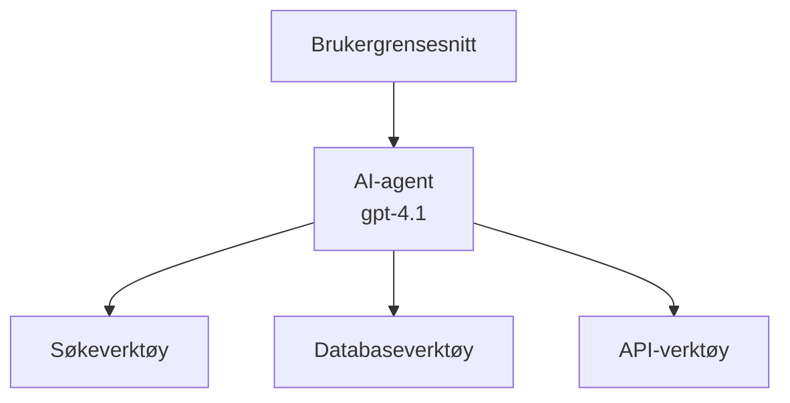
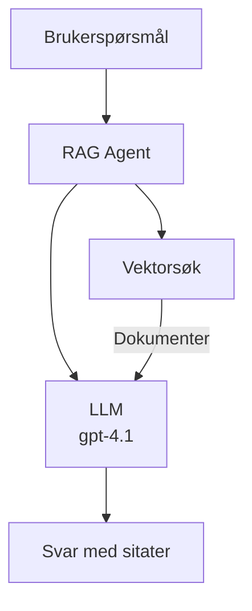
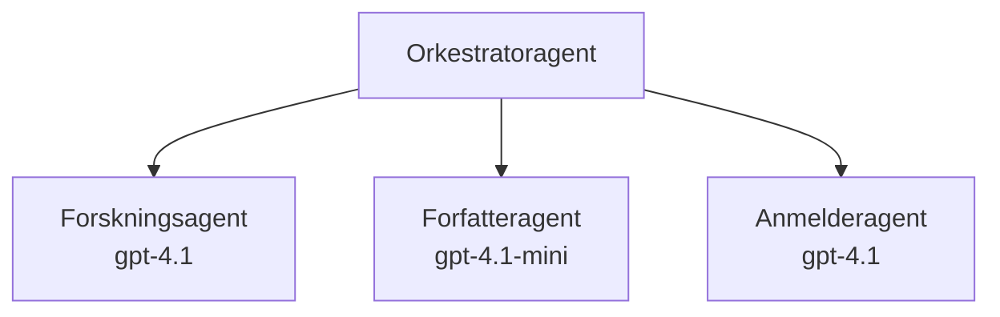

# AI-agenter med Azure Developer CLI

**Kapittelnavigasjon:**
- **📚 Kurs Hjem**: [AZD For Nybegynnere](../../README.md)
- **📖 Nåværende Kapittel**: Kapittel 2 - AI-First Utvikling
- **⬅️ Forrige**: [Microsoft Foundry Integrasjon](microsoft-foundry-integration.md)
- **➡️ Neste**: [Distribuering av AI-modell](ai-model-deployment.md)
- **🚀 Avansert**: [Multi-Agent Løsninger](../../examples/retail-scenario.md)

---

## Introduksjon

AI-agenter er autonome programmer som kan oppfatte omgivelsene sine, ta beslutninger og utføre handlinger for å oppnå bestemte mål. I motsetning til enkle chatboter som svarer på forespørsler, kan agenter:

- **Bruke verktøy** - Kalle APIer, søke i databaser, kjøre kode
- **Planlegge og resonnere** - Dele opp komplekse oppgaver i steg
- **Lære av kontekst** - Ha hukommelse og tilpasse atferd
- **Samarbeide** - Jobbe med andre agenter (multi-agent systemer)

Denne guiden viser deg hvordan du distribuerer AI-agenter til Azure ved hjelp av Azure Developer CLI (azd).

> **Valideringsmerknad (2026-03-25):** Denne guiden ble gjennomgått med `azd` `1.23.12` og `azure.ai.agents` `0.1.18-preview`. Opplevelsen med `azd ai` er fortsatt forhåndsvisningsbasert, så sjekk utvidelseshjelpen hvis flaggene dine er annerledes.

## Læringsmål

Ved å fullføre denne guiden vil du:
- Forstå hva AI-agenter er og hvordan de skiller seg fra chatboter
- Distribuere ferdige AI-agentmaler ved bruk av AZD
- Konfigurere Foundry-agenter for egendefinerte agenter
- Implementere grunnleggende agentmønstre (verktøybruk, RAG, multi-agent)
- Overvåke og feilsøke distribuerte agenter

## Læringsresultater

Etter fullføring vil du kunne:
- Distribuere AI-agentapplikasjoner til Azure med én enkelt kommando
- Konfigurere agentverktøy og funksjonaliteter
- Implementere retrieval-augmented generation (RAG) med agenter
- Designe multi-agent-arkitekturer for komplekse arbeidsflyter
- Feilsøke vanlige problemer ved agentdistribuering

---

## 🤖 Hva gjør en agent annerledes enn en chatbot?

| Egenskap | Chatbot | AI-Agent |
|---------|---------|----------|
| **Atferd** | Svarer på forespørsler | Tar autonome handlinger |
| **Verktøy** | Ingen | Kan kalle APIer, søke, kjøre kode |
| **Hukommelse** | Kun basert på økt | Vedvarende hukommelse på tvers av økter |
| **Planlegging** | Ett enkelt svar | Flerskritt resonnement |
| **Samarbeid** | Enkelt enhet | Kan samarbeide med andre agenter |

### Enkel analogi

- **Chatbot** = En hjelpsom person som svarer på spørsmål ved en informasjonsskranke
- **AI-agent** = En personlig assistent som kan ringe, booke avtaler og fullføre oppgaver for deg

---

## 🚀 Rask start: Distribuer din første agent

### Alternativ 1: Foundry Agents-mal (Anbefalt)

```bash
# Initialiser AI-agent malen
azd init --template get-started-with-ai-agents

# Distribuer til Azure
azd up
```
  
**Det som distribueres:**  
- ✅ Foundry Agents  
- ✅ Microsoft Foundry-modeller (gpt-4.1)  
- ✅ Azure AI Search (for RAG)  
- ✅ Azure Container Apps (webgrensesnitt)  
- ✅ Application Insights (overvåking)

**Tid:** ~15-20 minutter  
**Kostnad:** ~$100-150/måned (utvikling)

### Alternativ 2: OpenAI-agent med Prompty

```bash
# Initialiser Prompty-baserte agentmalen
azd init --template agent-openai-python-prompty

# Distribuer til Azure
azd up
```
  
**Det som distribueres:**  
- ✅ Azure Functions (serverløs agentkjøring)  
- ✅ Microsoft Foundry-modeller  
- ✅ Prompty-konfigurasjonsfiler  
- ✅ Eksempelkode for agentimplementasjon

**Tid:** ~10-15 minutter  
**Kostnad:** ~$50-100/måned (utvikling)

### Alternativ 3: RAG Chat-Agent

```bash
# Initialiser RAG chat-mal
azd init --template azure-search-openai-demo

# Distribuer til Azure
azd up
```
  
**Det som distribueres:**  
- ✅ Microsoft Foundry-modeller  
- ✅ Azure AI Search med eksempeldata  
- ✅ Dokumentprosessering-pipeline  
- ✅ Chatgrensesnitt med referanser

**Tid:** ~15-25 minutter  
**Kostnad:** ~$80-150/måned (utvikling)

### Alternativ 4: AZD AI Agent Init (Manifest- eller malbasert forhåndsvisning)

Hvis du har en agent-manifestfil kan du bruke `azd ai`-kommandoen til å bygge opp et Foundry Agent Service-prosjekt direkte. Nylige forhåndsvisningsversjoner har også lagt til støtte for malbasert initiering, så den nøyaktige dialogflyten kan variere litt avhengig av din versjon av utvidelsen.

```bash
# Installer AI-agentutvidelsen
azd extension install azure.ai.agents

# Valgfritt: verifiser den installerte forhåndsvisningsversjonen
azd extension show azure.ai.agents

# Initialiser fra en agentmanifest
azd ai agent init -m agent-manifest.yaml

# Distribuer til Azure
azd up

# Test den distribuerte agenten (viser forsinkelse + tid-til-første-byte)
azd ai agent invoke
```
  
**Når du skal bruke `azd ai agent init` vs `azd init --template`:**

| Tilnærming | Beste for | Hvordan det fungerer |
|------------|-----------|---------------------|
| `azd init --template` | Starte fra en fungerende eksempelapp | Kloner et komplett malrepo med kode + infrastruktur |
| `azd ai agent init -m` | Bygge fra eget agentmanifest | Bygger opp prosjekstruktur basert på agentdefinisjonen din |

> **Tips:** Bruk `azd init --template` når du lærer (Alternativ 1-3 over). Bruk `azd ai agent init` ved produksjonsbygg med egne manifest.

Etter `azd up`, vil samme utvidelse lede deg gjennom resten av agentens livssyklus: `azd ai agent invoke` for testing, `azd ai agent eval generate` og `azd ai agent optimize` for måling og forbedring, og `azd ai agent delete` for opprydding. Se [AZD AI CLI-kommandoer](../chapter-08-production/production-ai-practices.md#azd-ai-cli-commands-and-extensions) for full referanse.

---

## 🏗️ Agentarkitektur-mønstre

### Mønster 1: Enkel agent med verktøy

Det enkleste agentmønsteret - en agent som kan bruke flere verktøy.


  
**Passer for:**  
- Kundestøtteboter  
- Forskningsassistenter  
- Dataanalyse-agenter  

**AZD-mal:** `azure-search-openai-demo`

### Mønster 2: RAG-agent (Retrieval-Augmented Generation)

En agent som henter relevante dokumenter før den genererer svar.


  
**Passer for:**  
- Bedriftskunnskapsbaser  
- Dokument Q&A-systemer  
- Compliance og juridisk forskning  

**AZD-mal:** `azure-search-openai-demo`

### Mønster 3: Multi-agent system

Flere spesialiserte agenter som samarbeider om komplekse oppgaver.


  
**Passer for:**  
- Kompleks innholdsgenerering  
- Flerskritt-arbeidsflyter  
- Oppgaver som krever ulik ekspertise  

**Lær mer:** [Multi-Agent Koordineringsmønstre](../chapter-06-pre-deployment/coordination-patterns.md)

---

## ⚙️ Konfigurere agentverktøy

Agenter blir kraftigere når de kan bruke verktøy. Slik konfigurerer du vanlige verktøy:

### Verktøykonfigurasjon i Foundry-agenter

```python
# agent_config.py
from azure.ai.projects import AIProjectClient
from azure.ai.projects.models import FunctionTool, CodeInterpreterTool

# Definer egendefinerte verktøy
search_tool = FunctionTool(
    name="search_knowledge_base",
    description="Search the company knowledge base for relevant documents",
    parameters={
        "type": "object",
        "properties": {
            "query": {
                "type": "string",
                "description": "The search query"
            }
        },
        "required": ["query"]
    }
)

# Opprett agent med verktøy
agent = project_client.agents.create_agent(
    model="gpt-4.1",
    name="Support Agent",
    instructions="You are a helpful support agent. Use the search tool to find relevant information.",
    tools=[search_tool, CodeInterpreterTool()]
)
```
  
### Konfigurasjon av miljø

```bash
# Sett opp agent-spesifikke miljøvariabler
azd env set AZURE_OPENAI_MODEL "gpt-4.1"
azd env set AGENT_INSTRUCTIONS "You are a helpful assistant..."
azd env set ENABLE_CODE_INTERPRETER "true"
azd env set ENABLE_FILE_SEARCH "true"

# Distribuer med oppdatert konfigurasjon
azd deploy
```
  
---

## 📊 Overvåking av agenter

### Application Insights-integrasjon

Alle AZD-agentmaler inkluderer Application Insights for overvåking:

```bash
# Åpne overvåkingsdashbord
azd monitor --overview

# Se sanntidslogger
azd monitor --logs

# Se sanntidsmålinger
azd monitor --live
```
  
### Viktige måleparametere å følge med på

| Måleparameter | Beskrivelse | Mål |
|---------------|-------------|-----|
| Responstid | Tid for å generere svar | < 5 sekunder |
| Tokenforbruk | Tokens per forespørsel | Følg med på kostnad |
| Verktøysuksessrate | % vellykkede verktøysanrop | > 95% |
| Feilrate | Mislykkede agentforespørsler | < 1% |
| Brukertilfredshet | Tilbakemeldingsscore | > 4.0/5.0 |

### Egendefinert logging for agenter

```python
import os
from azure.monitor.opentelemetry import configure_azure_monitor
from opentelemetry import trace

# Konfigurer Azure Monitor med OpenTelemetry
configure_azure_monitor(
    connection_string=os.environ["APPLICATIONINSIGHTS_CONNECTION_STRING"]
)

tracer = trace.get_tracer(__name__)

def log_agent_interaction(user_query, agent_response, tools_used, latency_ms):
    with tracer.start_as_current_span("agent_interaction") as span:
        span.set_attributes({
            "user_query": user_query,
            "response_length": len(agent_response),
            "tools_used": tools_used,
            "latency_ms": latency_ms
        })
```
  
> **Merk:** Installer nødvendige pakker: `pip install azure-monitor-opentelemetry opentelemetry`

---

## 💰 Kostnadsbetraktninger

### Anslåtte månedskostnader per mønster

| Mønster | Utviklingsmiljø | Produksjon |
|----------|-----------------|------------|
| Enkel agent | $50-100 | $200-500 |
| RAG-agent | $80-150 | $300-800 |
| Multi-agent (2-3 agenter) | $150-300 | $500-1,500 |
| Bedrifts Multi-agent | $300-500 | $1,500-5,000+ |

### Kostnadsoptimaliseringstips

1. **Bruk gpt-4.1-mini for enkle oppgaver**  
   ```bash
   azd env set AZURE_OPENAI_MODEL "gpt-4.1-mini"
   ```
  
2. **Implementer caching for gjentatte spørringer**  
   ```python
   from functools import lru_cache
   
   @lru_cache(maxsize=1000)
   def get_cached_response(query_hash):
       return agent.run(query_hash)
   ```
  
3. **Sett begrensninger på tokens per kjøring**  
   ```python
   # Sett max_completion_tokens når agenten kjøres, ikke under opprettelsen
   run = project_client.agents.create_run(
       thread_id=thread.id,
       agent_id=agent.id,
       max_completion_tokens=1000  # Begrens svarlengde
   )
   ```
  
4. **Skaler til null når ikke i bruk**  
   ```bash
   # Container-apper skalerer automatisk ned til null
   azd env set MIN_REPLICAS "0"
   ```
  
---

## 🔧 Feilsøking av agenter

### Vanlige problemer og løsninger

<details>
<summary><strong>❌ Agent svarer ikke på verktøysanrop</strong></summary>

```bash
# Sjekk om verktøy er riktig registrert
azd show

# Verifiser OpenAI-distribusjon
az cognitiveservices account deployment list \
  --name $AZURE_OPENAI_NAME \
  --resource-group $RG_NAME

# Sjekk agentlogger
azd monitor --logs
```
  
**Vanlige årsaker:**  
- Uoverensstemmelse i verktøyfunksjonens signatur  
- Manglende nødvendige tillatelser  
- API-endepunkt utilgjengelig  
</details>

<details>
<summary><strong>❌ Høy responstid i agentrespons</strong></summary>

```bash
# Sjekk Application Insights for flaskehalser
azd monitor --live

# Vurder å bruke en raskere modell
azd env set AZURE_OPENAI_MODEL "gpt-4.1-mini"
azd deploy
```
  
**Optimaliseringstips:**  
- Bruk strømmede svar  
- Implementer caching av svar  
- Reduser størrelsen på kontekstvinduet  
</details>

<details>
<summary><strong>❌ Agent returnerer feilaktig eller hallusinerende informasjon</strong></summary>

```python
# Forbedre med bedre systemoppfordringer
instructions = """
You are a helpful assistant. IMPORTANT:
- Only answer based on provided context
- If you don't know, say "I don't know"
- Always cite your sources
- Never make up information
"""

# Legg til henting for grunnlag
agent = project_client.agents.create_agent(
    model="gpt-4.1",
    instructions=instructions,
    tools=[FileSearchTool()]  # Grunn svar i dokumenter
)
```
</details>

<details>
<summary><strong>❌ Token-begrensning overskredet feil</strong></summary>

```python
# Implementer kontekstvindu håndtering
def truncate_context(messages, max_tokens=8000, model="gpt-4.1"):
    """Keep only recent messages within token limit."""
    import tiktoken
    encoding = tiktoken.encoding_for_model(model)
    total_tokens = 0
    truncated = []
    
    for msg in reversed(messages):
        msg_tokens = len(encoding.encode(msg.content))
        if total_tokens + msg_tokens > max_tokens:
            break
        truncated.insert(0, msg)
        total_tokens += msg_tokens
    
    return truncated
```
</details>

---

## 🎓 Praktiske øvelser

### Øvelse 1: Distribuer en enkel agent (20 minutter)

**Mål:** Distribuer din første AI-agent ved hjelp av AZD

```bash
# Trinn 1: Initialiser mal
azd init --template get-started-with-ai-agents

# Trinn 2: Logg inn i Azure
azd auth login
# Hvis du jobber på tvers av leietakere, legg til --tenant-id <tenant-id>

# Trinn 3: Distribuer
azd up

# Trinn 4: Test agenten
# Forventet output etter distribusjon:
#   Distribusjon fullført!
#   Endepunkt: https://<app-name>.<region>.azurecontainerapps.io
# Åpne URL-en som vises i output og prøv å stille et spørsmål

# Trinn 5: Se overvåking
azd monitor --overview

# Trinn 6: Rydd opp
azd down --force --purge
```
  
**Suksesskriterier:**  
- [ ] Agent svarer på spørsmål  
- [ ] Kan få tilgang til overvåkingsdashboard via `azd monitor`  
- [ ] Ressurser ryddes opp vellykket

### Øvelse 2: Legg til et egendefinert verktøy (30 minutter)

**Mål:** Utvid en agent med et egendefinert verktøy

1. Distribuer agentmalen:  
   ```bash
   azd init --template get-started-with-ai-agents
   azd up
   ```
  
2. Lag en ny verktøyfunksjon i agentkoden:  
   ```python
   def get_weather(location: str) -> str:
       """Get current weather for a location."""
       # API-anrop til værmeldingstjeneste
       return f"Weather in {location}: Sunny, 72°F"
   ```
  
3. Registrer verktøyet med agenten:  
   ```python
   from azure.ai.projects.models import FunctionTool

   weather_tool = FunctionTool(
       name="get_weather",
       description="Get current weather for a location",
       parameters={
           "type": "object",
           "properties": {
               "location": {"type": "string", "description": "City name"}
           },
           "required": ["location"]
       }
   )

   agent = project_client.agents.create_agent(
       model="gpt-4.1",
       name="Weather Agent",
       tools=[weather_tool]
   )
   ```
  
4. Distribuer på nytt og test:  
   ```bash
   azd deploy
   # Spør: "Hvordan er været i Seattle?"
   # Forventet: Agenten kaller get_weather("Seattle") og returnerer værinformasjon
   ```
  
**Suksesskriterier:**  
- [ ] Agent gjenkjenner værrelaterte spørsmål  
- [ ] Verktøyet kalles korrekt  
- [ ] Responsen inkluderer værinformasjon

### Øvelse 3: Bygg en RAG-agent (45 minutter)

**Mål:** Lag en agent som svarer på spørsmål basert på dine dokumenter

```bash
# Trinn 1: Distribuer RAG-mal
azd init --template azure-search-openai-demo
azd up

# Trinn 2: Last opp dokumentene dine
# Plasser PDF/TXT-filer i data/-katalogen, kjør deretter:
python scripts/prepdocs.py

# Trinn 3: Test med domene-spesifikke spørsmål
# Åpne nettapp-URLen fra azd up-utdataene
# Still spørsmål om dine opplastede dokumenter
# Svarene bør inkludere henvisninger som [doc.pdf]
```
  
**Suksesskriterier:**  
- [ ] Agent svarer ut fra opplastede dokumenter  
- [ ] Svar inkluderer referanser  
- [ ] Ingen hallusinering på spørsmål utenfor omfang

---

## 📚 Neste steg

Nå som du forstår AI-agenter, utforsk disse avanserte emnene:

| Emne | Beskrivelse | Lenke |
|-------|-------------|-------|
| **Multi-Agent Systemer** | Bygg systemer med flere samarbeidende agenter | [Retail Multi-Agent Eksempel](../../examples/retail-scenario.md) |
| **Koordineringsmønstre** | Lær orkestrering og kommunikasjonsmønstre | [Koordineringsmønstre](../chapter-06-pre-deployment/coordination-patterns.md) |
| **Produksjonsdistribuering** | Agentdistribuering klar for bedrifter | [Produksjons AI-Praksiser](../chapter-08-production/production-ai-practices.md) |
| **Agent Evaluering** | Test og evaluer agentytelse | [AI Feilsøking](../chapter-07-troubleshooting/ai-troubleshooting.md) |
| **AI Workshop Lab** | Praktisk: Gjør AI-løsningen din AZD-klar | [AI Workshop Lab](ai-workshop-lab.md) |

---

## 📖 Ytterligere ressurser

### Offisiell dokumentasjon
- [Microsoft Foundry Agent Service](https://learn.microsoft.com/azure/ai-services/agents/)
- [Microsoft Foundry Agent Service Raskstart](https://learn.microsoft.com/azure/ai-services/agents/quickstart)
- [Semantic Kernel Agent Framework](https://learn.microsoft.com/semantic-kernel/)

### AZD-maler for agenter
- [Kom i gang med AI-agenter](https://github.com/Azure-Samples/get-started-with-ai-agents)
- [Agent OpenAI Python Prompty](https://github.com/Azure-Samples/agent-openai-python-prompty)
- [Azure Search OpenAI Demo](https://github.com/Azure-Samples/azure-search-openai-demo)

### Fellesskapsressurser
- [Awesome AZD - Agentmaler](https://azure.github.io/awesome-azd/?tags=ai-agents)
- [Azure AI Discord](https://discord.gg/microsoft-azure)
- [Microsoft Foundry Discord](https://discord.gg/nTYy5BXMWG)

### Agentferdigheter for din editor
- [**Microsoft Azure Agent Skills**](https://skills.sh/microsoft/github-copilot-for-azure) - Installer gjenbrukbare AI-agentferdigheter for Azure-utvikling i GitHub Copilot, Cursor eller andre støttede agenter. Inkluderer ferdigheter for [Azure AI](https://skills.sh/microsoft/github-copilot-for-azure/azure-ai), [Microsoft Foundry](https://skills.sh/microsoft/github-copilot-for-azure/microsoft-foundry), [distribuering](https://skills.sh/microsoft/github-copilot-for-azure/azure-deploy), og [diagnostikk](https://skills.sh/microsoft/github-copilot-for-azure/azure-diagnostics):  
  ```bash
  npx skills add microsoft/github-copilot-for-azure
  ```
  
---

**Navigasjon**
- **Forrige leksjon**: [Microsoft Foundry Integrasjon](microsoft-foundry-integration.md)
- **Neste leksjon**: [Distribuering av AI-modell](ai-model-deployment.md)

---

<!-- CO-OP TRANSLATOR DISCLAIMER START -->
**Ansvarsfraskrivelse**:
Dette dokumentet er oversatt ved hjelp av AI-oversettelsestjenesten [Co-op Translator](https://github.com/Azure/co-op-translator). Selv om vi streber etter nøyaktighet, vær oppmerksom på at automatiske oversettelser kan inneholde feil eller unøyaktigheter. Det opprinnelige dokumentet på originalspråket skal betraktes som den autoritative kilden. For kritisk informasjon anbefales profesjonell menneskelig oversettelse. Vi er ikke ansvarlige for eventuelle misforståelser eller feiltolkninger som oppstår ved bruk av denne oversettelsen.
<!-- CO-OP TRANSLATOR DISCLAIMER END -->