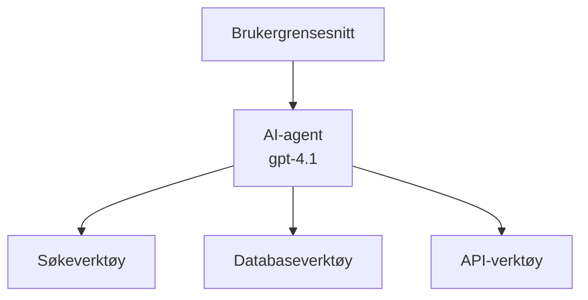
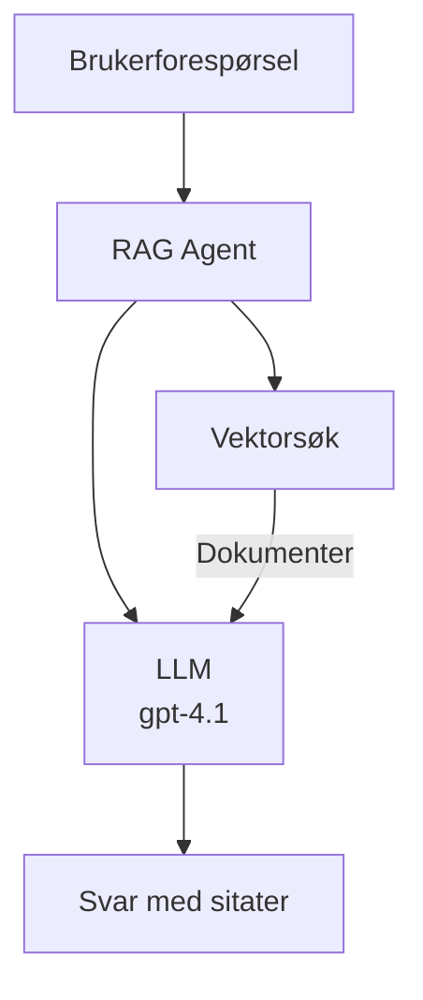
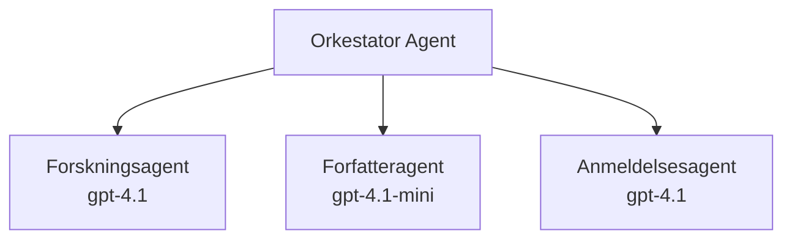

# AI-agenter med Azure Developer CLI

**Kapittelnavigasjon:**
- **📚 Kursstart**: [AZD For Beginners](../../README.md)
- **📖 Nåværende kapittel**: Kapittel 2 - AI-først utvikling
- **⬅️ Forrige**: [Microsoft Foundry Integration](microsoft-foundry-integration.md)
- **➡️ Neste**: [AI Model Deployment](ai-model-deployment.md)
- **🚀 Avansert**: [Multi-Agent Solutions](../../examples/retail-scenario.md)

---

## Introduksjon

AI-agenter er autonome programmer som kan oppfatte miljøet sitt, ta beslutninger og utføre handlinger for å oppnå spesifikke mål. I motsetning til enkle chatboter som svarer på forespørsler, kan agenter:

- **Bruke verktøy** - Kalle API-er, søke i databaser, kjøre kode
- **Planlegge og resonnere** - Dele opp komplekse oppgaver i trinn
- **Lære fra kontekst** - Beholde hukommelse og tilpasse atferd
- **Samarbeide** - Arbeide med andre agenter (multi-agent systemer)

Denne guiden viser deg hvordan du distribuerer AI-agenter til Azure ved hjelp av Azure Developer CLI (azd).

## Læringsmål

Ved å fullføre denne guiden vil du:
- Forstå hva AI-agenter er og hvordan de skiller seg fra chatboter
- Distribuere forhåndsbygde AI-agent-maler med AZD
- Konfigurere Foundry-agenter for tilpassede agenter
- Implementere grunnleggende agentmønstre (verktøybruk, RAG, multi-agent)
- Overvåke og feilsøke distribuerte agenter

## Læringsutbytte

Etter fullføring vil du kunne:
- Distribuere AI-agentapplikasjoner til Azure med en enkelt kommando
- Konfigurere agentverktøy og -muligheter
- Implementere retrieval-augmented generation (RAG) med agenter
- Designe multi-agent-arkitektur for komplekse arbeidsflyter
- Feilsøke vanlige problemer ved agentdistribusjon

---

## 🤖 Hva Skiller en Agent fra en Chatbot?

| Funksjon | Chatbot | AI-Agent |
|---------|---------|----------|
| **Atferd** | Svarer på forespørsler | Tar autonome handlinger |
| **Verktøy** | Ingen | Kan kalle API-er, søke, kjøre kode |
| **Hukommelse** | Kun sesjonsbasert | Vedvarende hukommelse over økter |
| **Planlegging** | Én enkelt respons | Flerstegs resonnement |
| **Samarbeid** | Enkelt entitet | Kan jobbe med andre agenter |

### Enkel analogi

- **Chatbot** = En hjelpsom person som svarer på spørsmål ved et informasjonsskranke
- **AI Agent** = En personlig assistent som kan ringe, bestille avtaler og fullføre oppgaver for deg

---

## 🚀 Rask start: Deploy Din Første Agent

### Alternativ 1: Foundry Agents-mal (anbefalt)

```bash
# Initialiser AI-agentmalen
azd init --template get-started-with-ai-agents

# Distribuer til Azure
azd up
```

**Hva som deployeres:**
- ✅ Foundry Agents
- ✅ Microsoft Foundry Models (gpt-4.1)
- ✅ Azure AI Search (for RAG)
- ✅ Azure Container Apps (webgrensesnitt)
- ✅ Application Insights (overvåking)

**Tid:** ~15-20 minutter  
**Kostnad:** ~$100-150/måned (utvikling)

### Alternativ 2: OpenAI Agent med Prompty

```bash
# Initialiser Prompty-baserte agentmalen
azd init --template agent-openai-python-prompty

# Distribuer til Azure
azd up
```

**Hva som deployeres:**
- ✅ Azure Functions (serverløs agentkjøring)
- ✅ Microsoft Foundry Models
- ✅ Prompty-konfigurasjonsfiler
- ✅ Eksempelkode for agentimplementasjon

**Tid:** ~10-15 minutter  
**Kostnad:** ~$50-100/måned (utvikling)

### Alternativ 3: RAG Chat Agent

```bash
# Initialiser RAG chat-mal
azd init --template azure-search-openai-demo

# Distribuer til Azure
azd up
```

**Hva som deployeres:**
- ✅ Microsoft Foundry Models
- ✅ Azure AI Search med eksempeldata
- ✅ Dokumentprosess-pipeline
- ✅ Chatgrensesnitt med kildehenvisninger

**Tid:** ~15-25 minutter  
**Kostnad:** ~$80-150/måned (utvikling)

### Alternativ 4: AZD AI Agent Init (Manifest-basert)

Hvis du har en agentmanifestfil, kan du bruke `azd ai`-kommandoen for å sette opp et Foundry Agent Service-prosjekt direkte:

```bash
# Installer AI-agenterutvidelsen
azd extension install azure.ai.agents

# Initialiser fra et agentmanifest
azd ai agent init -m agent-manifest.yaml

# Distribuer til Azure
azd up
```

**Når bruke `azd ai agent init` vs `azd init --template`:**

| Tilnærming | Passer for | Hvordan det fungerer |
|------------|------------|---------------------|
| `azd init --template` | Starte fra en fungerende eksempel-app | Kloner et komplett mal-repo med kode + infrastruktur |
| `azd ai agent init -m` | Lage fra ditt eget agentmanifest | Setter opp prosjektstruktur fra din agentdefinisjon |

> **Tips:** Bruk `azd init --template` når du lærer (Alternativ 1-3 ovenfor). Bruk `azd ai agent init` når du bygger produksjonsagenter med egne manifest. Se [AZD AI CLI Commands](../chapter-08-production/production-ai-practices.md#azd-ai-cli-commands-and-extensions) for full oversikt.

---

## 🏗️ Agentarkitekturmønstre

### Mønster 1: Enkelt agent med verktøy

Det enkleste agentmønsteret - én agent som kan bruke flere verktøy.


**Passer for:**
- Kundesupport-boter
- Forskningsassistenter
- Dataanalyse-agenter

**AZD-mal:** `azure-search-openai-demo`

### Mønster 2: RAG Agent (Retrieval-Augmented Generation)

En agent som henter relevante dokumenter før den genererer svar.


**Passer for:**
- Bedriftskunnskapsbaser
- Dokument Q&A-systemer
- Compliance og juridisk forskning

**AZD-mal:** `azure-search-openai-demo`

### Mønster 3: Multi-Agent System

Flere spesialiserte agenter som samarbeider om komplekse oppgaver.


**Passer for:**
- Kompleks innholdsgenerering
- Flestegs arbeidsflyter
- Oppgaver som krever ulik ekspertise

**Lær mer:** [Multi-Agent Coordination Patterns](../chapter-06-pre-deployment/coordination-patterns.md)

---

## ⚙️ Konfigurere Agentverktøy

Agenter blir kraftige når de kan bruke verktøy. Slik konfigurerer du vanlige verktøy:

### Verktøykonfigurasjon i Foundry Agents

```python
# agent_config.py
from azure.ai.projects import AIProjectClient
from azure.ai.projects.models import FunctionTool, CodeInterpreterTool

# Definer egendefinerte verktøy
search_tool = FunctionTool(
    name="search_knowledge_base",
    description="Search the company knowledge base for relevant documents",
    parameters={
        "type": "object",
        "properties": {
            "query": {
                "type": "string",
                "description": "The search query"
            }
        },
        "required": ["query"]
    }
)

# Opprett agent med verktøy
agent = project_client.agents.create_agent(
    model="gpt-4.1",
    name="Support Agent",
    instructions="You are a helpful support agent. Use the search tool to find relevant information.",
    tools=[search_tool, CodeInterpreterTool()]
)
```

### Miljøkonfigurasjon

```bash
# Sett opp agent-spesifikke miljøvariabler
azd env set AZURE_OPENAI_MODEL "gpt-4.1"
azd env set AGENT_INSTRUCTIONS "You are a helpful assistant..."
azd env set ENABLE_CODE_INTERPRETER "true"
azd env set ENABLE_FILE_SEARCH "true"

# Distribuer med oppdatert konfigurasjon
azd deploy
```

---

## 📊 Overvåkning av Agenter

### Application Insights-integrasjon

Alle AZD-agentmaler inkluderer Application Insights for overvåking:

```bash
# Åpne overvåkingsdashbord
azd monitor --overview

# Se på live logger
azd monitor --logs

# Se på live målinger
azd monitor --live
```

### Nøkkelindikatorer å følge med på

| Måleparameter | Beskrivelse | Mål |
|---------------|-------------|-----|
| Responsforsinkelse | Tid til å generere svar | < 5 sekunder |
| Tokenbruk | Tokens per forespørsel | Overvåk for kostnad |
| Verktøysjons-suksessrate | % vellykkede verktøyutførelser | > 95% |
| Feilrate | Feil på agentforespørsler | < 1% |
| Brukertilfredshet | Tilbakemeldingspoeng | > 4,0/5,0 |

### Egendefinert logging for agenter

```python
import os
from azure.monitor.opentelemetry import configure_azure_monitor
from opentelemetry import trace

# Konfigurer Azure Monitor med OpenTelemetry
configure_azure_monitor(
    connection_string=os.environ["APPLICATIONINSIGHTS_CONNECTION_STRING"]
)

tracer = trace.get_tracer(__name__)

def log_agent_interaction(user_query, agent_response, tools_used, latency_ms):
    with tracer.start_as_current_span("agent_interaction") as span:
        span.set_attributes({
            "user_query": user_query,
            "response_length": len(agent_response),
            "tools_used": tools_used,
            "latency_ms": latency_ms
        })
```

> **Merk:** Installer de nødvendige pakkene: `pip install azure-monitor-opentelemetry opentelemetry`

---

## 💰 Kostnadshensyn

### Estimerte månedlige kostnader per mønster

| Mønster | Utviklingsmiljø | Produksjon |
|---------|-----------------|------------|
| Enkel agent | $50-100 | $200-500 |
| RAG agent | $80-150 | $300-800 |
| Multi-Agent (2-3 agenter) | $150-300 | $500-1,500 |
| Enterprise Multi-Agent | $300-500 | $1,500-5,000+ |

### Tips for kostnadsoptimalisering

1. **Bruk gpt-4.1-mini for enkle oppgaver**  
   ```bash
   azd env set AZURE_OPENAI_MODEL "gpt-4.1-mini"
   ```
  
2. **Implementer caching for gjentatte spørringer**  
   ```python
   from functools import lru_cache
   
   @lru_cache(maxsize=1000)
   def get_cached_response(query_hash):
       return agent.run(query_hash)
   ```
  
3. **Sett tokengrenser per kjøring**  
   ```python
   # Sett max_completion_tokens når du kjører agenten, ikke under opprettelsen
   run = project_client.agents.create_run(
       thread_id=thread.id,
       agent_id=agent.id,
       max_completion_tokens=1000  # Begrens svarlengde
   )
   ```
  
4. **Skaler til null når ikke i bruk**  
   ```bash
   # Containerapper skaleres automatisk til null
   azd env set MIN_REPLICAS "0"
   ```
  
---

## 🔧 Feilsøking av Agenter

### Vanlige problemer og løsninger

<details>
<summary><strong>❌ Agent svarer ikke på verktøysanrop</strong></summary>

```bash
# Sjekk om verktøy er riktig registrert
azd show

# Bekreft OpenAI-distribusjon
az cognitiveservices account deployment list \
  --name $AZURE_OPENAI_NAME \
  --resource-group $RG_NAME

# Sjekk agentlogger
azd monitor --logs
```

**Vanlige årsaker:**
- Signatur på verktøyfunksjon matcher ikke
- Manglende nødvendige tillatelser
- API-endepunkt er ikke tilgjengelig
</details>

<details>
<summary><strong>❌ Høy ventetid på agentens svar</strong></summary>

```bash
# Sjekk Application Insights for flaskehalser
azd monitor --live

# Vurder å bruke en raskere modell
azd env set AZURE_OPENAI_MODEL "gpt-4.1-mini"
azd deploy
```

**Optimaliseringstips:**
- Bruk streaming-svar
- Implementer response caching
- Reduser kontekstvinduets størrelse
</details>

<details>
<summary><strong>❌ Agent returnerer feilaktig eller hallusinert informasjon</strong></summary>

```python
# Forbedre med bedre systemoppfordringer
instructions = """
You are a helpful assistant. IMPORTANT:
- Only answer based on provided context
- If you don't know, say "I don't know"
- Always cite your sources
- Never make up information
"""

# Legg til uthenting for forankring
agent = project_client.agents.create_agent(
    model="gpt-4.1",
    instructions=instructions,
    tools=[FileSearchTool()]  # Forankre svar i dokumenter
)
```
</details>

<details>
<summary><strong>❌ Tokens grense overskredet-feil</strong></summary>

```python
# Implementer administrasjon av kontekstvinduet
def truncate_context(messages, max_tokens=8000, model="gpt-4.1"):
    """Keep only recent messages within token limit."""
    import tiktoken
    encoding = tiktoken.encoding_for_model(model)
    total_tokens = 0
    truncated = []
    
    for msg in reversed(messages):
        msg_tokens = len(encoding.encode(msg.content))
        if total_tokens + msg_tokens > max_tokens:
            break
        truncated.insert(0, msg)
        total_tokens += msg_tokens
    
    return truncated
```
</details>

---

## 🎓 Praktiske Øvelser

### Øvelse 1: Deploy en enkel agent (20 minutter)

**Mål:** Distribuer din første AI-agent med AZD

```bash
# Trinn 1: Initialiser mal
azd init --template get-started-with-ai-agents

# Trinn 2: Logg inn på Azure
azd auth login

# Trinn 3: Distribuer
azd up

# Trinn 4: Test agenten
# Forventet resultat etter distribusjon:
#   Distribusjon fullført!
#   Endepunkt: https://<app-navn>.<region>.azurecontainerapps.io
# Åpne URL-en som vises i resultatet og prøv å stille et spørsmål

# Trinn 5: Se overvåking
azd monitor --overview

# Trinn 6: Rydd opp
azd down --force --purge
```

**Suksesskriterier:**
- [ ] Agent svarer på spørsmål
- [ ] Kan få tilgang til overvåkingsdashbord via `azd monitor`
- [ ] Ressurser ryddes opp riktig

### Øvelse 2: Legg til et tilpasset verktøy (30 minutter)

**Mål:** Utvid en agent med et egendefinert verktøy

1. Deploy agentmalen:  
   ```bash
   azd init --template get-started-with-ai-agents
   azd up
   ```
  
2. Lag en ny verktøyfunksjon i agentkoden din:  
   ```python
   def get_weather(location: str) -> str:
       """Get current weather for a location."""
       # API-kall til værmeldingstjeneste
       return f"Weather in {location}: Sunny, 72°F"
   ```
  
3. Registrer verktøyet med agenten:  
   ```python
   from azure.ai.projects.models import FunctionTool

   weather_tool = FunctionTool(
       name="get_weather",
       description="Get current weather for a location",
       parameters={
           "type": "object",
           "properties": {
               "location": {"type": "string", "description": "City name"}
           },
           "required": ["location"]
       }
   )

   agent = project_client.agents.create_agent(
       model="gpt-4.1",
       name="Weather Agent",
       tools=[weather_tool]
   )
   ```
  
4. Redeploy og test:  
   ```bash
   azd deploy
   # Spør: "Hvordan er været i Seattle?"
   # Forventet: Agenten kaller get_weather("Seattle") og returnerer værinformasjon
   ```
  
**Suksesskriterier:**
- [ ] Agent gjenkjenner værrelaterte spørsmål
- [ ] Verktøyet kalles riktig
- [ ] Svaret inkluderer værinformasjon

### Øvelse 3: Bygg en RAG-agent (45 minutter)

**Mål:** Lag en agent som svarer på spørsmål fra dine dokumenter

```bash
# Trinn 1: Distribuer RAG-mal
azd init --template azure-search-openai-demo
azd up

# Trinn 2: Last opp dokumentene dine
# Plasser PDF/TXT-filer i data/-katalogen, og kjør deretter:
python scripts/prepdocs.py

# Trinn 3: Test med domenespesifikke spørsmål
# Åpne nettapp-URLen fra azd up-utdata
# Still spørsmål om dine opplastede dokumenter
# Svarene bør inkludere henvisningsreferanser som [doc.pdf]
```

**Suksesskriterier:**
- [ ] Agent svarer ut fra opplastede dokumenter
- [ ] Svar inkluderer kildehenvisninger
- [ ] Ingen hallusinasjoner på spørsmål utenfor omfang

---

## 📚 Neste steg

Nå som du forstår AI-agenter, utforsk disse avanserte emnene:

| Emne | Beskrivelse | Lenke |
|-------|-------------|-------|
| **Multi-Agent Systems** | Bygg systemer med flere samarbeidende agenter | [Retail Multi-Agent Example](../../examples/retail-scenario.md) |
| **Coordination Patterns** | Lær orkestrerings- og kommunikasjonsmønstre | [Coordination Patterns](../chapter-06-pre-deployment/coordination-patterns.md) |
| **Produksjonsdistribusjon** | Agentdistribusjon klar for bedrifter | [Production AI Practices](../chapter-08-production/production-ai-practices.md) |
| **Agent Evaluering** | Test og vurder agentytelse | [AI Troubleshooting](../chapter-07-troubleshooting/ai-troubleshooting.md) |
| **AI Workshop Lab** | Praktisk: Gjør AI-løsningen din AZD-klar | [AI Workshop Lab](ai-workshop-lab.md) |

---

## 📖 Tilleggsressurser

### Offisiell dokumentasjon
- [Azure AI Agent Service](https://learn.microsoft.com/azure/ai-services/agents/)
- [Azure AI Foundry Agent Service Quickstart](https://learn.microsoft.com/azure/ai-services/agents/quickstart)
- [Semantic Kernel Agent Framework](https://learn.microsoft.com/semantic-kernel/)

### AZD-maler for agenter
- [Kom i gang med AI-agenter](https://github.com/Azure-Samples/get-started-with-ai-agents)
- [Agent OpenAI Python Prompty](https://github.com/Azure-Samples/agent-openai-python-prompty)
- [Azure Search OpenAI Demo](https://github.com/Azure-Samples/azure-search-openai-demo)

### Community-ressurser
- [Awesome AZD - Agent Templates](https://azure.github.io/awesome-azd/?tags=ai-agents)
- [Azure AI Discord](https://discord.gg/microsoft-azure)
- [Microsoft Foundry Discord](https://discord.gg/nTYy5BXMWG)

### Agentferdigheter for editoren din
- [**Microsoft Azure Agent Skills**](https://skills.sh/microsoft/github-copilot-for-azure) - Installer gjenbrukbare AI-agentferdigheter for Azure-utvikling i GitHub Copilot, Cursor, eller annen støttet agent. Inkluderer ferdigheter for [Azure AI](https://skills.sh/microsoft/github-copilot-for-azure/azure-ai), [Microsoft Foundry](https://skills.sh/microsoft/github-copilot-for-azure/microsoft-foundry), [distribusjon](https://skills.sh/microsoft/github-copilot-for-azure/azure-deploy), og [diagnostikk](https://skills.sh/microsoft/github-copilot-for-azure/azure-diagnostics):  
  ```bash
  npx skills add microsoft/github-copilot-for-azure
  ```

---

**Navigasjon**
- **Forrige leksjon**: [Microsoft Foundry Integration](microsoft-foundry-integration.md)
- **Neste leksjon**: [AI Model Deployment](ai-model-deployment.md)

---

<!-- CO-OP TRANSLATOR DISCLAIMER START -->
**Ansvarsfraskrivelse**:
Dette dokumentet er oversatt ved bruk av AI-oversettelsestjenesten [Co-op Translator](https://github.com/Azure/co-op-translator). Selv om vi streber etter nøyaktighet, vennligst vær oppmerksom på at automatiske oversettelser kan inneholde feil eller unøyaktigheter. Det opprinnelige dokumentet på sitt originale språk skal betraktes som den autoritative kilden. For kritisk informasjon anbefales profesjonell menneskelig oversettelse. Vi er ikke ansvarlige for eventuelle misforståelser eller feiltolkninger som oppstår ved bruk av denne oversettelsen.
<!-- CO-OP TRANSLATOR DISCLAIMER END -->