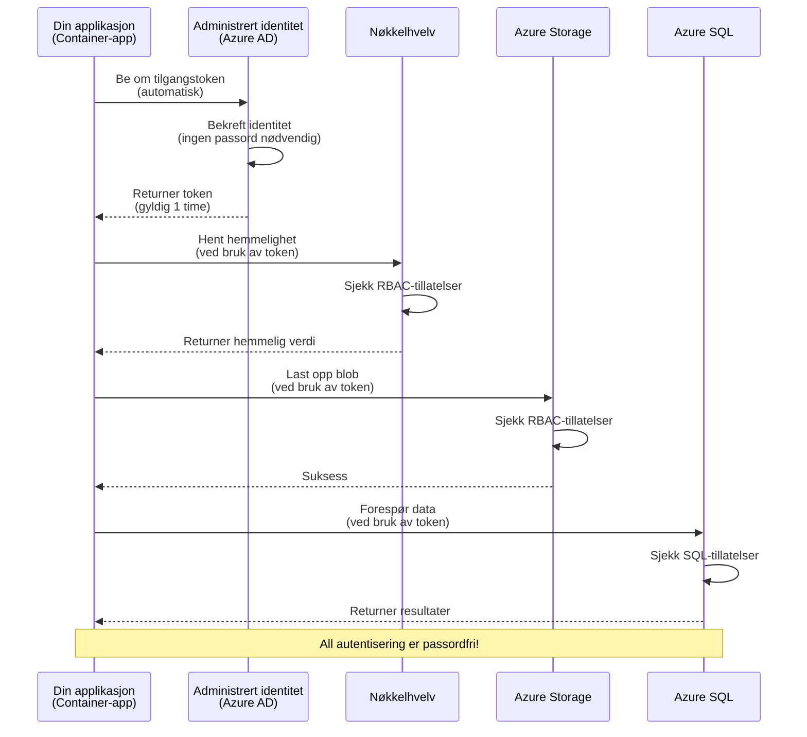
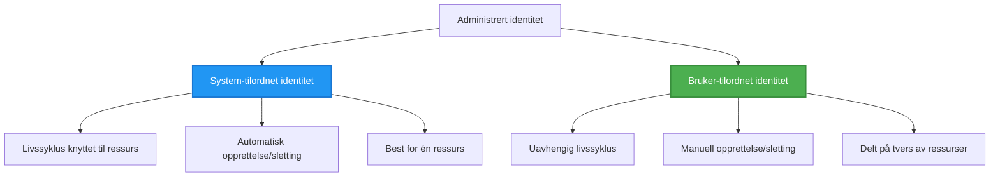

# Autentiseringsmønstre og administrert identitet

⏱️ **Estimated Time**: 45-60 minutes | 💰 **Cost Impact**: Free (no additional charges) | ⭐ **Complexity**: Intermediate

**📚 Læringsløp:**
- ← Forrige: [Konfigurasjonshåndtering](configuration.md) - Håndtering av miljøvariabler og hemmeligheter
- 🎯 **Du er her**: Autentisering & sikkerhet (administrert identitet, Key Vault, sikre mønstre)
- → Neste: [Første prosjekt](first-project.md) - Bygg din første AZD-applikasjon
- 🏠 [Kursoversikt](../../README.md)

---

## Hva du vil lære

By completing this lesson, you will:
- Forstå Azure-autentiseringsmønstre (nøkler, tilkoblingsstrenger, administrert identitet)
- Implementere **administrert identitet** for passordløs autentisering
- Sikre hemmeligheter med **Azure Key Vault**-integrasjon
- Konfigurere **rollebasert tilgangskontroll (RBAC)** for AZD-distribusjoner
- Bruke sikkerhetsbeste praksis i Container Apps og Azure-tjenester
- Migrere fra nøkkelbasert til identitetsbasert autentisering

## Hvorfor administrert identitet er viktig

### Problemet: Tradisjonell autentisering

**Før administrert identitet:**
```javascript
// ❌ SIKKERHETSRISIKO: Hardkodede hemmeligheter i koden
const connectionString = "Server=mydb.database.windows.net;User=admin;Password=P@ssw0rd123";
const storageKey = "xK7mN9pQ2wR5tY8uI0oP3aS6dF1gH4jK...";
const cosmosKey = "C2x7B9n4M1p8Q5w3E6r0T2y5U8i1O4p7...";
```

**Problemer:**
- 🔴 **Eksponerte hemmeligheter** i kode, konfigurasjonsfiler, miljøvariabler
- 🔴 **Rotasjon av legitimasjon** krever kodeendringer og ny distribusjon
- 🔴 **Revisjonsmareritt** - hvem fikk tilgang til hva, og når?
- 🔴 **Spredning** - hemmeligheter spredt over flere systemer
- 🔴 **Overholdelsesrisikoer** - kan feile sikkerhetsrevisjoner

### Løsningen: Administrert identitet

**Etter administrert identitet:**
```javascript
// ✅ SIKKER: Ingen hemmeligheter i koden
const credential = new DefaultAzureCredential();
const client = new BlobServiceClient(
  "https://mystorageaccount.blob.core.windows.net",
  credential  // Azure håndterer autentisering automatisk
);
```

**Fordeler:**
- ✅ **Ingen hemmeligheter** i kode eller konfigurasjon
- ✅ **Automatisk rotasjon** - Azure håndterer det
- ✅ **Full revisjonssporing** i Azure AD-logger
- ✅ **Sentralisert sikkerhet** - administrer i Azure-portalen
- ✅ **Klar for overholdelse** - oppfyller sikkerhetsstandarder

**Analog**: Tradisjonell autentisering er som å bære flere fysiske nøkler for forskjellige dører. Administrert identitet er som å ha et sikkerhetskort som automatisk gir tilgang basert på hvem du er—ingen nøkler å miste, kopiere eller rotere.

---

## Arkitekturoversikt

### Autentiseringsflyt med administrert identitet


### Typer av administrerte identiteter


| Funksjon | System-tilordnet | Bruker-tilordnet |
|---------|----------------|---------------|
| **Livssyklus** | Bundet til ressurs | Uavhengig |
| **Opprettelse** | Automatisk med ressurs | Manuell opprettelse |
| **Sletting** | Slettet med ressurs | Vedvarer etter sletting av ressurs |
| **Deling** | Kun én ressurs | Flere ressurser |
| **Brukstilfelle** | Enkle scenarier | Komplekse scenarier med flere ressurser |
| **AZD standard** | ✅ Anbefalt | Valgfri |

---

## Forutsetninger

### Nødvendige verktøy

Du bør allerede ha disse installert fra tidligere leksjoner:

```bash
# Bekreft Azure Developer CLI
azd version
# ✅ Forventet: azd versjon 1.0.0 eller nyere

# Bekreft Azure CLI
az --version
# ✅ Forventet: azure-cli 2.50.0 eller nyere
```

### Krav i Azure

- Aktivt Azure-abonnement
- Tillatelser til:
  - Opprette administrerte identiteter
  - Tilordne RBAC-roller
  - Opprette Key Vault-ressurser
  - Distribuere Container Apps

### Kunnskapsforutsetninger

Du bør ha fullført:
- [Installasjonsguide](installation.md) - AZD-oppsett
- [AZD-grunnleggende](azd-basics.md) - Kjernebegreper
- [Konfigurasjonshåndtering](configuration.md) - Miljøvariabler

---

## Leksjon 1: Forstå autentiseringsmønstre

### Mønster 1: Tilkoblingsstrenger (Eldre - Unngå)

**Hvordan det fungerer:**
```bash
# Tilkoblingsstreng inneholder legitimasjon
STORAGE_CONNECTION_STRING="DefaultEndpointsProtocol=https;AccountName=myaccount;AccountKey=xK7mN9pQ2wR5..."
COSMOS_CONNECTION_STRING="AccountEndpoint=https://myaccount.documents.azure.com:443/;AccountKey=C2x7..."
SQL_CONNECTION_STRING="Server=myserver.database.windows.net;User=admin;Password=P@ssw0rd..."
```

**Problemer:**
- ❌ Hemmeligheter synlige i miljøvariabler
- ❌ Logget i distribusjonssystemer
- ❌ Vanskelig å rotere
- ❌ Ingen revisjonsspor for tilgang

**Når du bør bruke det:** Kun for lokal utvikling, aldri i produksjon.

---

### Mønster 2: Key Vault-referanser (Bedre)

**Hvordan det fungerer:**
```bicep
// Store secret in Key Vault
resource keyVault 'Microsoft.KeyVault/vaults@2023-02-01' = {
  name: 'mykv'
  properties: {
    enableRbacAuthorization: true
  }
}

// Reference in Container App
env: [
  {
    name: 'STORAGE_KEY'
    secretRef: 'storage-key'  // References Key Vault
  }
]
```

**Fordeler:**
- ✅ Hemmeligheter lagres sikkert i Key Vault
- ✅ Sentralisert håndtering av hemmeligheter
- ✅ Rotasjon uten kodeendringer

**Begrensninger:**
- ⚠️ Bruker fortsatt nøkler/passord
- ⚠️ Må håndtere tilgang til Key Vault

**Når du bør bruke det:** Overgangstrinn fra tilkoblingsstrenger til administrert identitet.

---

### Mønster 3: Administrert identitet (Beste praksis)

**Hvordan det fungerer:**
```bicep
// Enable managed identity
resource containerApp 'Microsoft.App/containerApps@2023-05-01' = {
  name: 'myapp'
  identity: {
    type: 'SystemAssigned'  // Automatically creates identity
  }
}

// Grant permissions
resource roleAssignment 'Microsoft.Authorization/roleAssignments@2022-04-01' = {
  scope: storageAccount
  properties: {
    roleDefinitionId: storageBlobDataContributorRole
    principalId: containerApp.identity.principalId
  }
}
```

**Applikasjonskode:**
```javascript
// Ingen hemmeligheter nødvendig!
const { DefaultAzureCredential } = require('@azure/identity');
const { BlobServiceClient } = require('@azure/storage-blob');

const credential = new DefaultAzureCredential();
const blobServiceClient = new BlobServiceClient(
  'https://mystorageaccount.blob.core.windows.net',
  credential
);
```

**Fordeler:**
- ✅ Ingen hemmeligheter i kode/konfig
- ✅ Automatisk rotasjon av legitimasjon
- ✅ Full revisjonssporing
- ✅ RBAC-baserte tillatelser
- ✅ Klar for overholdelse

**Når du bør bruke det:** Alltid, for produksjonsapplikasjoner.

---

## Leksjon 2: Implementere administrert identitet med AZD

### Trinnvis implementering

La oss bygge en sikker Container App som bruker administrert identitet for å få tilgang til Azure Storage og Key Vault.

### Prosjektstruktur

```
secure-app/
├── azure.yaml                 # AZD configuration
├── infra/
│   ├── main.bicep            # Main infrastructure
│   ├── core/
│   │   ├── identity.bicep    # Managed identity setup
│   │   ├── keyvault.bicep    # Key Vault configuration
│   │   └── storage.bicep     # Storage with RBAC
│   └── app/
│       └── container-app.bicep
└── src/
    ├── app.js                # Application code
    ├── package.json
    └── Dockerfile
```

### 1. Konfigurer AZD (azure.yaml)

```yaml
name: secure-app
metadata:
  template: secure-app@1.0.0

services:
  api:
    project: ./src
    language: js
    host: containerapp

# Enable managed identity (AZD handles this automatically)
```

### 2. Infrastruktur: Aktiver administrert identitet

**Fil: `infra/main.bicep`**

```bicep
targetScope = 'subscription'

param environmentName string
param location string = 'eastus'

var tags = { 'azd-env-name': environmentName }

// Resource group
resource rg 'Microsoft.Resources/resourceGroups@2021-04-01' = {
  name: 'rg-${environmentName}'
  location: location
  tags: tags
}

// Storage Account
module storage './core/storage.bicep' = {
  name: 'storage'
  scope: rg
  params: {
    name: 'st${uniqueString(rg.id)}'
    location: location
    tags: tags
  }
}

// Key Vault
module keyVault './core/keyvault.bicep' = {
  name: 'keyvault'
  scope: rg
  params: {
    name: 'kv-${uniqueString(rg.id)}'
    location: location
    tags: tags
  }
}

// Container App with Managed Identity
module containerApp './app/container-app.bicep' = {
  name: 'container-app'
  scope: rg
  params: {
    name: 'ca-${environmentName}'
    location: location
    tags: tags
    storageAccountName: storage.outputs.name
    keyVaultName: keyVault.outputs.name
  }
}

// Grant Container App access to Storage
module storageRoleAssignment './core/role-assignment.bicep' = {
  name: 'storage-role'
  scope: rg
  params: {
    principalId: containerApp.outputs.identityPrincipalId
    roleDefinitionId: 'ba92f5b4-2d11-453d-a403-e96b0029c9fe'  // Storage Blob Data Contributor
    targetResourceId: storage.outputs.id
  }
}

// Grant Container App access to Key Vault
module kvRoleAssignment './core/role-assignment.bicep' = {
  name: 'kv-role'
  scope: rg
  params: {
    principalId: containerApp.outputs.identityPrincipalId
    roleDefinitionId: '4633458b-17de-408a-b874-0445c86b69e6'  // Key Vault Secrets User
    targetResourceId: keyVault.outputs.id
  }
}

// Outputs
output AZURE_STORAGE_ACCOUNT_NAME string = storage.outputs.name
output AZURE_KEY_VAULT_NAME string = keyVault.outputs.name
output APP_URL string = containerApp.outputs.url
```

### 3. Container App med system-tilordnet identitet

**Fil: `infra/app/container-app.bicep`**

```bicep
param name string
param location string
param tags object = {}
param storageAccountName string
param keyVaultName string

resource containerApp 'Microsoft.App/containerApps@2023-05-01' = {
  name: name
  location: location
  tags: tags
  identity: {
    type: 'SystemAssigned'  // 🔑 Enable managed identity
  }
  properties: {
    configuration: {
      ingress: {
        external: true
        targetPort: 3000
      }
    }
    template: {
      containers: [
        {
          name: 'api'
          image: 'myregistry.azurecr.io/api:latest'
          resources: {
            cpu: json('0.5')
            memory: '1Gi'
          }
          env: [
            {
              name: 'AZURE_STORAGE_ACCOUNT_NAME'
              value: storageAccountName
            }
            {
              name: 'AZURE_KEY_VAULT_NAME'
              value: keyVaultName
            }
            // 🔑 No secrets - managed identity handles authentication!
          ]
        }
      ]
    }
  }
}

// Output the identity for RBAC assignments
output identityPrincipalId string = containerApp.identity.principalId
output id string = containerApp.id
output url string = 'https://${containerApp.properties.configuration.ingress.fqdn}'
```

### 4. RBAC rolle-tilordningsmodul

**Fil: `infra/core/role-assignment.bicep`**

```bicep
param principalId string
param roleDefinitionId string  // Azure built-in role ID
param targetResourceId string

resource roleAssignment 'Microsoft.Authorization/roleAssignments@2022-04-01' = {
  name: guid(principalId, roleDefinitionId, targetResourceId)
  scope: resourceId('Microsoft.Resources/resourceGroups', resourceGroup().name)
  properties: {
    roleDefinitionId: subscriptionResourceId('Microsoft.Authorization/roleDefinitions', roleDefinitionId)
    principalId: principalId
    principalType: 'ServicePrincipal'
  }
}

output id string = roleAssignment.id
```

### 5. Applikasjonskode med administrert identitet

**Fil: `src/app.js`**

```javascript
const express = require('express');
const { DefaultAzureCredential } = require('@azure/identity');
const { BlobServiceClient } = require('@azure/storage-blob');
const { SecretClient } = require('@azure/keyvault-secrets');

const app = express();
const PORT = process.env.PORT || 3000;

// 🔑 Initialiser legitimasjon (fungerer automatisk med administrert identitet)
const credential = new DefaultAzureCredential();

// Oppsett for Azure Storage
const storageAccountName = process.env.AZURE_STORAGE_ACCOUNT_NAME;
const blobServiceClient = new BlobServiceClient(
  `https://${storageAccountName}.blob.core.windows.net`,
  credential  // Ingen nøkler nødvendig!
);

// Key Vault-oppsett
const keyVaultName = process.env.AZURE_KEY_VAULT_NAME;
const secretClient = new SecretClient(
  `https://${keyVaultName}.vault.azure.net`,
  credential  // Ingen nøkler nødvendig!
);

// Helsjekk
app.get('/health', (req, res) => {
  res.json({ status: 'healthy', authentication: 'managed-identity' });
});

// Last opp fil til blob-lagring
app.post('/upload', async (req, res) => {
  try {
    const containerClient = blobServiceClient.getContainerClient('uploads');
    await containerClient.createIfNotExists();
    
    const blobName = `file-${Date.now()}.txt`;
    const blockBlobClient = containerClient.getBlockBlobClient(blobName);
    
    await blockBlobClient.upload('Hello from managed identity!', 30);
    
    res.json({
      success: true,
      blobName: blobName,
      message: 'File uploaded using managed identity!'
    });
  } catch (error) {
    console.error('Upload error:', error);
    res.status(500).json({ error: error.message });
  }
});

// Hent hemmelighet fra Key Vault
app.get('/secret/:name', async (req, res) => {
  try {
    const secretName = req.params.name;
    const secret = await secretClient.getSecret(secretName);
    
    res.json({
      name: secretName,
      value: secret.value,
      message: 'Secret retrieved using managed identity!'
    });
  } catch (error) {
    console.error('Secret error:', error);
    res.status(500).json({ error: error.message });
  }
});

// List opp blob-containere (viser lesetilgang)
app.get('/containers', async (req, res) => {
  try {
    const containers = [];
    for await (const container of blobServiceClient.listContainers()) {
      containers.push(container.name);
    }
    
    res.json({
      containers: containers,
      count: containers.length,
      message: 'Containers listed using managed identity!'
    });
  } catch (error) {
    console.error('List error:', error);
    res.status(500).json({ error: error.message });
  }
});

app.listen(PORT, () => {
  console.log(`Secure API listening on port ${PORT}`);
  console.log('Authentication: Managed Identity (passwordless)');
});
```

**Fil: `src/package.json`**

```json
{
  "name": "secure-app",
  "version": "1.0.0",
  "dependencies": {
    "express": "^4.18.2",
    "@azure/identity": "^4.0.0",
    "@azure/storage-blob": "^12.17.0",
    "@azure/keyvault-secrets": "^4.7.0"
  },
  "scripts": {
    "start": "node app.js"
  }
}
```

### 6. Distribuer og test

```bash
# Initialiser AZD-miljøet
azd init

# Distribuer infrastruktur og applikasjon
azd up

# Hent appens URL
APP_URL=$(azd env get-values | grep APP_URL | cut -d '=' -f2 | tr -d '"')

# Test helsesjekk
curl $APP_URL/health
```

**✅ Forventet utdata:**
```json
{
  "status": "healthy",
  "authentication": "managed-identity"
}
```

**Test opplasting av blob:**
```bash
curl -X POST $APP_URL/upload
```

**✅ Forventet utdata:**
```json
{
  "success": true,
  "blobName": "file-1700404800000.txt",
  "message": "File uploaded using managed identity!"
}
```

**Test liste over containere:**
```bash
curl $APP_URL/containers
```

**✅ Forventet utdata:**
```json
{
  "containers": ["uploads"],
  "count": 1,
  "message": "Containers listed using managed identity!"
}
```

---

## Vanlige Azure RBAC-roller

### Innebygde rolle-IDer for administrert identitet

| Tjeneste | Rollenavn | Rolle-ID | Tillatelser |
|---------|-----------|---------|-------------|
| **Storage** | Storage Blob Data Reader | `2a2b9908-6b94-4a3d-8e5a-a7d8f8cc8a12` | Les blobs og containere |
| **Storage** | Storage Blob Data Contributor | `ba92f5b4-2d11-453d-a403-e96b0029c9fe` | Les, skriv, slett blobs |
| **Storage** | Storage Queue Data Contributor | `974c5e8b-45b9-4653-ba55-5f855dd0fb88` | Les, skriv, slett kømeldinger |
| **Key Vault** | Key Vault Secrets User | `4633458b-17de-408a-b874-0445c86b69e6` | Les hemmeligheter |
| **Key Vault** | Key Vault Secrets Officer | `b86a8fe4-44ce-4948-aee5-eccb2c155cd7` | Les, skriv, slett hemmeligheter |
| **Cosmos DB** | Cosmos DB Built-in Data Reader | `00000000-0000-0000-0000-000000000001` | Les Cosmos DB-data |
| **Cosmos DB** | Cosmos DB Built-in Data Contributor | `00000000-0000-0000-0000-000000000002` | Les, skriv Cosmos DB-data |
| **SQL Database** | SQL DB Contributor | `9b7fa17d-e63e-47b0-bb0a-15c516ac86ec` | Administrere SQL-databaser |
| **Service Bus** | Azure Service Bus Data Owner | `090c5cfd-751d-490a-894a-3ce6f1109419` | Sende, motta, administrere meldinger |

### Hvordan finne rolle-IDer

```bash
# List opp alle innebygde roller
az role definition list --query "[].{Name:roleName, ID:name}" --output table

# Søk etter en bestemt rolle
az role definition list --query "[?contains(roleName, 'Storage Blob')].{Name:roleName, ID:name}" --output table

# Hent detaljer om rollen
az role definition list --name "Storage Blob Data Contributor"
```

---

## Praktiske øvelser

### Øvelse 1: Aktiver administrert identitet for eksisterende app ⭐⭐ (Middels)

**Mål**: Legg til administrert identitet i en eksisterende Container App-distribusjon

**Scenario**: Du har en Container App som bruker tilkoblingsstrenger. Konverter den til administrert identitet.

**Startpunkt**: Container App med denne konfigurasjonen:

```bicep
// ❌ Current: Using connection string
env: [
  {
    name: 'STORAGE_CONNECTION_STRING'
    secretRef: 'storage-connection'
  }
]
```

**Trinn**:

1. **Aktiver administrert identitet i Bicep:**

```bicep
resource containerApp 'Microsoft.App/containerApps@2023-05-01' = {
  name: 'myapp'
  identity: {
    type: 'SystemAssigned'  // Add this
  }
  // ... rest of configuration
}
```

2. **Gi Storage-tilgang:**

```bicep
// Get storage account reference
resource storageAccount 'Microsoft.Storage/storageAccounts@2023-01-01' existing = {
  name: storageAccountName
}

// Assign role
resource roleAssignment 'Microsoft.Authorization/roleAssignments@2022-04-01' = {
  name: guid(containerApp.id, 'ba92f5b4-2d11-453d-a403-e96b0029c9fe', storageAccount.id)
  scope: storageAccount
  properties: {
    roleDefinitionId: subscriptionResourceId('Microsoft.Authorization/roleDefinitions', 'ba92f5b4-2d11-453d-a403-e96b0029c9fe')
    principalId: containerApp.identity.principalId
    principalType: 'ServicePrincipal'
  }
}
```

3. **Oppdater applikasjonskode:**

**Før (tilkoblingsstreng):**
```javascript
const { BlobServiceClient } = require('@azure/storage-blob');

const blobServiceClient = BlobServiceClient.fromConnectionString(
  process.env.STORAGE_CONNECTION_STRING
);
```

**Etter (administrert identitet):**
```javascript
const { DefaultAzureCredential } = require('@azure/identity');
const { BlobServiceClient } = require('@azure/storage-blob');

const credential = new DefaultAzureCredential();
const blobServiceClient = new BlobServiceClient(
  `https://${process.env.STORAGE_ACCOUNT_NAME}.blob.core.windows.net`,
  credential
);
```

4. **Oppdater miljøvariabler:**

```bicep
env: [
  {
    name: 'STORAGE_ACCOUNT_NAME'
    value: storageAccountName  // Just the name, no secrets!
  }
  // Remove STORAGE_CONNECTION_STRING
]
```

5. **Distribuer og test:**

```bash
# Distribuer på nytt
azd up

# Test at det fortsatt fungerer
curl https://myapp.azurecontainerapps.io/upload
```

**✅ Suksesskriterier:**
- ✅ Applikasjonen distribueres uten feil
- ✅ Storage-operasjoner fungerer (opplasting, liste, nedlasting)
- ✅ Ingen tilkoblingsstrenger i miljøvariabler
- ✅ Identitet synlig i Azure-portalen under "Identity" blade

**Verifisering:**

```bash
# Sjekk at administrert identitet er aktivert
az containerapp show \
  --name myapp \
  --resource-group rg-myapp \
  --query "identity.type"
# ✅ Forventet: "SystemAssigned"

# Sjekk rolletildeling
az role assignment list \
  --assignee $(az containerapp show --name myapp --resource-group rg-myapp --query "identity.principalId" -o tsv) \
  --scope /subscriptions/{sub-id}/resourceGroups/rg-myapp/providers/Microsoft.Storage/storageAccounts/mystorageaccount
# ✅ Forventet: Viser rollen "Storage Blob Data Contributor"
```

**Tid**: 20-30 minutes

---

### Øvelse 2: Fler-tjenestetilgang med bruker-tilordnet identitet ⭐⭐⭐ (Avansert)

**Mål**: Opprett en bruker-tilordnet identitet delt på tvers av flere Container Apps

**Scenario**: Du har 3 mikrotjenester som alle trenger tilgang til samme Storage-konto og Key Vault.

**Trinn**:

1. **Opprett bruker-tilordnet identitet:**

**Fil: `infra/core/identity.bicep`**

```bicep
param name string
param location string
param tags object = {}

resource userAssignedIdentity 'Microsoft.ManagedIdentity/userAssignedIdentities@2023-01-31' = {
  name: name
  location: location
  tags: tags
}

output id string = userAssignedIdentity.id
output principalId string = userAssignedIdentity.properties.principalId
output clientId string = userAssignedIdentity.properties.clientId
```

2. **Tildel roller til bruker-tilordnet identitet:**

```bicep
// In main.bicep
module userIdentity './core/identity.bicep' = {
  name: 'user-identity'
  scope: rg
  params: {
    name: 'id-${environmentName}'
    location: location
    tags: tags
  }
}

// Grant Storage access
resource storageRoleAssignment 'Microsoft.Authorization/roleAssignments@2022-04-01' = {
  name: guid(userIdentity.outputs.principalId, 'storage-contributor')
  scope: storageAccount
  properties: {
    roleDefinitionId: subscriptionResourceId('Microsoft.Authorization/roleDefinitions', 'ba92f5b4-2d11-453d-a403-e96b0029c9fe')
    principalId: userIdentity.outputs.principalId
    principalType: 'ServicePrincipal'
  }
}

// Grant Key Vault access
resource kvRoleAssignment 'Microsoft.Authorization/roleAssignments@2022-04-01' = {
  name: guid(userIdentity.outputs.principalId, 'kv-secrets-user')
  scope: keyVault
  properties: {
    roleDefinitionId: subscriptionResourceId('Microsoft.Authorization/roleDefinitions', '4633458b-17de-408a-b874-0445c86b69e6')
    principalId: userIdentity.outputs.principalId
    principalType: 'ServicePrincipal'
  }
}
```

3. **Tildel identitet til flere Container Apps:**

```bicep
resource apiGateway 'Microsoft.App/containerApps@2023-05-01' = {
  name: 'api-gateway'
  identity: {
    type: 'UserAssigned'
    userAssignedIdentities: {
      '${userIdentity.outputs.id}': {}
    }
  }
  // ... rest of config
}

resource productService 'Microsoft.App/containerApps@2023-05-01' = {
  name: 'product-service'
  identity: {
    type: 'UserAssigned'
    userAssignedIdentities: {
      '${userIdentity.outputs.id}': {}
    }
  }
  // ... rest of config
}

resource orderService 'Microsoft.App/containerApps@2023-05-01' = {
  name: 'order-service'
  identity: {
    type: 'UserAssigned'
    userAssignedIdentities: {
      '${userIdentity.outputs.id}': {}
    }
  }
  // ... rest of config
}
```

4. **Applikasjonskode (alle tjenester bruker samme mønster):**

```javascript
const { DefaultAzureCredential, ManagedIdentityCredential } = require('@azure/identity');

// For bruker-tilordnet identitet, angi klient-ID
const credential = new ManagedIdentityCredential(
  process.env.AZURE_CLIENT_ID  // Klient-ID for bruker-tilordnet identitet
);

// Eller bruk DefaultAzureCredential (oppdager automatisk)
const credential = new DefaultAzureCredential();

const blobServiceClient = new BlobServiceClient(
  `https://${process.env.STORAGE_ACCOUNT_NAME}.blob.core.windows.net`,
  credential
);
```

5. **Distribuer og verifiser:**

```bash
azd up

# Test at alle tjenester kan få tilgang til lagring
curl https://api-gateway.azurecontainerapps.io/upload
curl https://product-service.azurecontainerapps.io/upload
curl https://order-service.azurecontainerapps.io/upload
```

**✅ Suksesskriterier:**
- ✅ Én identitet delt mellom 3 tjenester
- ✅ Alle tjenester kan få tilgang til Storage og Key Vault
- ✅ Identiteten vedvarer hvis du sletter en tjeneste
- ✅ Sentralisert rettighetsstyring

**Fordeler med bruker-tilordnet identitet:**
- En enkelt identitet å administrere
- Konsistente tillatelser på tvers av tjenester
- Overlever sletting av tjenester
- Bedre for komplekse arkitekturer

**Tid**: 30-40 minutes

---

### Øvelse 3: Implementere rotasjon av Key Vault-hemmeligheter ⭐⭐⭐ (Avansert)

**Mål**: Lagre tredjeparts API-nøkler i Key Vault og få tilgang til dem ved hjelp av administrert identitet

**Scenario**: Appen din må kalle et eksternt API (OpenAI, Stripe, SendGrid) som krever API-nøkler.

**Trinn**:

1. **Opprett Key Vault med RBAC:**

**Fil: `infra/core/keyvault.bicep`**

```bicep
param name string
param location string
param tags object = {}

resource keyVault 'Microsoft.KeyVault/vaults@2023-02-01' = {
  name: name
  location: location
  tags: tags
  properties: {
    enableRbacAuthorization: true  // Use RBAC instead of access policies
    sku: {
      family: 'A'
      name: 'standard'
    }
    tenantId: subscription().tenantId
    enableSoftDelete: true
    softDeleteRetentionInDays: 90
  }
}

// Allow Container App to read secrets
output id string = keyVault.id
output name string = keyVault.name
output uri string = keyVault.properties.vaultUri
```

2. **Lagre hemmeligheter i Key Vault:**

```bash
# Hent navnet på Key Vault
KV_NAME=$(azd env get-values | grep AZURE_KEY_VAULT_NAME | cut -d '=' -f2 | tr -d '"')

# Lagre API-nøkler fra tredjepart
az keyvault secret set \
  --vault-name $KV_NAME \
  --name "OpenAI-ApiKey" \
  --value "sk-proj-xxxxxxxxxxxxx"

az keyvault secret set \
  --vault-name $KV_NAME \
  --name "Stripe-ApiKey" \
  --value "sk_live_xxxxxxxxxxxxx"

az keyvault secret set \
  --vault-name $KV_NAME \
  --name "SendGrid-ApiKey" \
  --value "SG.xxxxxxxxxxxxx"
```

3. **Applikasjonskode for å hente hemmeligheter:**

**Fil: `src/config.js`**

```javascript
const { DefaultAzureCredential } = require('@azure/identity');
const { SecretClient } = require('@azure/keyvault-secrets');

class Config {
  constructor() {
    this.credential = new DefaultAzureCredential();
    this.secretClient = new SecretClient(
      `https://${process.env.AZURE_KEY_VAULT_NAME}.vault.azure.net`,
      this.credential
    );
    this.cache = {};
  }

  async getSecret(secretName) {
    // Sjekk cache først
    if (this.cache[secretName]) {
      return this.cache[secretName];
    }

    try {
      const secret = await this.secretClient.getSecret(secretName);
      this.cache[secretName] = secret.value;
      console.log(`✅ Retrieved secret: ${secretName}`);
      return secret.value;
    } catch (error) {
      console.error(`❌ Failed to get secret ${secretName}:`, error.message);
      throw error;
    }
  }

  async getOpenAIKey() {
    return this.getSecret('OpenAI-ApiKey');
  }

  async getStripeKey() {
    return this.getSecret('Stripe-ApiKey');
  }

  async getSendGridKey() {
    return this.getSecret('SendGrid-ApiKey');
  }
}

module.exports = new Config();
```

4. **Bruk hemmeligheter i applikasjonen:**

**Fil: `src/app.js`**

```javascript
const express = require('express');
const config = require('./config');
const { OpenAI } = require('openai');

const app = express();

// Initialiser OpenAI med nøkkel fra Key Vault
let openaiClient;

async function initializeServices() {
  const openaiKey = await config.getOpenAIKey();
  openaiClient = new OpenAI({ apiKey: openaiKey });
  console.log('✅ Services initialized with secrets from Key Vault');
}

// Kall ved oppstart
initializeServices().catch(console.error);

app.post('/chat', async (req, res) => {
  try {
    const completion = await openaiClient.chat.completions.create({
      model: 'gpt-4',
      messages: [{ role: 'user', content: 'Hello!' }]
    });
    
    res.json({
      response: completion.choices[0].message.content,
      authentication: 'Key from Key Vault via Managed Identity'
    });
  } catch (error) {
    res.status(500).json({ error: error.message });
  }
});

app.listen(3000, () => {
  console.log('Secure API with Key Vault integration running');
});
```

5. **Distribuer og test:**

```bash
azd up

# Test at API-nøkler fungerer
curl -X POST https://myapp.azurecontainerapps.io/chat \
  -H "Content-Type: application/json" \
  -d '{"message":"Hello AI"}'
```

**✅ Suksesskriterier:**
- ✅ Ingen API-nøkler i kode eller miljøvariabler
- ✅ Applikasjonen henter nøkler fra Key Vault
- ✅ Tredjeparts-APIer fungerer korrekt
- ✅ Kan rotere nøkler uten kodeendringer

**Roter en hemmelighet:**

```bash
# Oppdater hemmelighet i Key Vault
az keyvault secret set \
  --vault-name $KV_NAME \
  --name "OpenAI-ApiKey" \
  --value "sk-proj-NEW_KEY_HERE"

# Start appen på nytt for å ta i bruk den nye nøkkelen
az containerapp revision restart \
  --name myapp \
  --resource-group rg-myapp
```

**Tid**: 25-35 minutes

---

## Kunnskapssjekk

### 1. Autentiseringsmønstre ✓

Test din forståelse:

- [ ] **Q1**: Hva er de tre viktigste autentiseringsmønstrene? 
  - **A**: Tilkoblingsstrenger (eldre), Key Vault-referanser (overgang), administrert identitet (beste)

- [ ] **Q2**: Hvorfor er administrert identitet bedre enn tilkoblingsstrenger?
  - **A**: Ingen hemmeligheter i kode, automatisk rotasjon, full revisjonssporing, RBAC-tillatelser

- [ ] **Q3**: Når vil du bruke bruker-tilordnet identitet i stedet for system-tilordnet?
  - **A**: Når identitet skal deles på tvers av flere ressurser eller når identitetens livssyklus er uavhengig av ressursens livssyklus

**Praktisk verifisering:**
```bash
# Sjekk hvilken type identitet appen din bruker
az containerapp show \
  --name myapp \
  --resource-group rg-myapp \
  --query "identity.type"

# List opp alle rolletilordninger for identiteten
az role assignment list \
  --assignee $(az containerapp show --name myapp --resource-group rg-myapp --query "identity.principalId" -o tsv)
```

---

### 2. RBAC og tillatelser ✓

Test din forståelse:

- [ ] **Q1**: Hva er rolle-IDen for "Storage Blob Data Contributor"?
  - **A**: `ba92f5b4-2d11-453d-a403-e96b0029c9fe`

- [ ] **Q2**: Hvilke tillatelser gir "Key Vault Secrets User"?
  - **A**: Lesetilgang til hemmeligheter (kan ikke opprette, oppdatere eller slette)

- [ ] **Q3**: Hvordan gir du en Container App tilgang til Azure SQL?
  - **A**: Tilordne rollen "SQL DB Contributor" eller konfigurere Azure AD-autentisering for SQL

**Praktisk verifisering:**
```bash
# Finn en spesifikk rolle
az role definition list --name "Storage Blob Data Contributor"

# Sjekk hvilke roller som er tildelt identiteten din
PRINCIPAL_ID=$(az containerapp show --name myapp --resource-group rg-myapp --query "identity.principalId" -o tsv)
az role assignment list --assignee $PRINCIPAL_ID --output table
```

---

### 3. Key Vault-integrasjon ✓

Test din forståelse:
- [ ] **Q1**: Hvordan aktiverer du RBAC for Key Vault i stedet for tilgangspolicyer?
  - **A**: Angi `enableRbacAuthorization: true` i Bicep

- [ ] **Q2**: Hvilket Azure SDK-bibliotek håndterer autentisering med administrert identitet?
  - **A**: `@azure/identity` med `DefaultAzureCredential`-klassen

- [ ] **Q3**: Hvor lenge forblir Key Vault-hemmeligheter i hurtigbuffer?
  - **A**: Avhengig av applikasjonen; implementer din egen hurtigbuffringsstrategi

**Praktisk verifisering:**
```bash
# Test tilgang til Key Vault
az keyvault secret show \
  --vault-name $KV_NAME \
  --name "OpenAI-ApiKey" \
  --query "value"

# Sjekk at RBAC er aktivert
az keyvault show \
  --name $KV_NAME \
  --query "properties.enableRbacAuthorization"
# ✅ Forventet: true
```

---

## Sikkerhetsanbefalinger

### ✅ GJØR:

1. **Bruk alltid administrert identitet i produksjon**
   ```bicep
   identity: {
     type: 'SystemAssigned'
   }
   ```

2. **Bruk RBAC-roller med minste nødvendige privilegier**
   - Bruk "Reader"-roller når mulig
   - Unngå "Owner" eller "Contributor" med mindre det er nødvendig

3. **Lagre tredjepartsnøkler i Key Vault**
   ```javascript
   const apiKey = await secretClient.getSecret('ThirdPartyApiKey');
   ```

4. **Aktiver revisjonslogging**
   ```bicep
   diagnosticSettings: {
     logs: [{ category: 'AuditEvent', enabled: true }]
   }
   ```

5. **Bruk forskjellige identiteter for dev/staging/produksjon**
   ```bash
   azd env new dev
   azd env new staging
   azd env new prod
   ```

6. **Roter hemmeligheter regelmessig**
   - Angi utløpsdatoer for Key Vault-hemmeligheter
   - Automatiser rotasjon med Azure Functions

### ❌ IKKE:

1. **Hardkod aldri hemmeligheter**
   ```javascript
   // ❌ DÅRLIG
   const apiKey = "sk-proj-xxxxxxxxxxxxx";
   ```

2. **Ikke bruk tilkoblingsstrenger i produksjon**
   ```javascript
   // ❌ DÅRLIG
   BlobServiceClient.fromConnectionString(process.env.STORAGE_CONNECTION_STRING)
   ```

3. **Ikke gi overdrevne tillatelser**
   ```bicep
   // ❌ BAD - too much access
   roleDefinitionId: 'Owner'
   
   // ✅ GOOD - least privilege
   roleDefinitionId: 'Storage Blob Data Reader'
   ```

4. **Ikke loggfør hemmeligheter**
   ```javascript
   // ❌ DÅRLIG
   console.log('API Key:', apiKey);
   
   // ✅ BRA
   console.log('API Key retrieved successfully');
   ```

5. **Ikke del produksjonsidentiteter på tvers av miljøer**
   ```bicep
   // ❌ BAD - same identity for dev and prod
   // ✅ GOOD - separate identities per environment
   ```

---

## Feilsøkingsguide

### Problem: "Unauthorized" ved tilgang til Azure Storage

**Symptomer:**
```
Error: Unauthorized (403)
AuthorizationPermissionMismatch: This request is not authorized to perform this operation
```

**Diagnose:**

```bash
# Sjekk om administrert identitet er aktivert
az containerapp show \
  --name myapp \
  --resource-group rg-myapp \
  --query "identity.type"
# ✅ Forventet: "SystemAssigned" eller "UserAssigned"

# Sjekk rolletildelinger
PRINCIPAL_ID=$(az containerapp show --name myapp --resource-group rg-myapp --query "identity.principalId" -o tsv)
az role assignment list --assignee $PRINCIPAL_ID

# Forventet: Bør se "Storage Blob Data Contributor" eller lignende rolle
```

**Løsninger:**

1. **Gi riktig RBAC-rolle:**
```bash
STORAGE_ID=$(az storage account show --name mystorageaccount --resource-group rg-myapp --query "id" -o tsv)
az role assignment create \
  --assignee $PRINCIPAL_ID \
  --role "Storage Blob Data Contributor" \
  --scope $STORAGE_ID
```

2. **Vent på propagasjon (kan ta 5-10 minutter):**
```bash
# Sjekk status for rolletildeling
az role assignment list --assignee $PRINCIPAL_ID --scope $STORAGE_ID
```

3. **Verifiser at applikasjonskoden bruker riktig legitimasjon:**
```javascript
// Sørg for at du bruker DefaultAzureCredential
const credential = new DefaultAzureCredential();
```

---

### Problem: Key Vault-tilgang nektet

**Symptomer:**
```
Error: Forbidden (403)
The user, group or application does not have secrets get permission
```

**Diagnose:**

```bash
# Kontroller at Key Vault RBAC er aktivert
az keyvault show \
  --name $KV_NAME \
  --query "properties.enableRbacAuthorization"
# ✅ Forventet: true

# Kontroller rolletildelinger
az role assignment list \
  --assignee $PRINCIPAL_ID \
  --scope /subscriptions/{sub-id}/resourceGroups/rg-myapp/providers/Microsoft.KeyVault/vaults/$KV_NAME
```

**Løsninger:**

1. **Aktiver RBAC på Key Vault:**
```bash
az keyvault update \
  --name $KV_NAME \
  --enable-rbac-authorization true
```

2. **Gi Key Vault Secrets User-rollen:**
```bash
KV_ID=$(az keyvault show --name $KV_NAME --query "id" -o tsv)
az role assignment create \
  --assignee $PRINCIPAL_ID \
  --role "Key Vault Secrets User" \
  --scope $KV_ID
```

---

### Problem: DefaultAzureCredential feiler lokalt

**Symptomer:**
```
Error: DefaultAzureCredential failed to retrieve a token
CredentialUnavailableError: No credential available
```

**Diagnose:**

```bash
# Sjekk om du er logget inn
az account show

# Sjekk at Azure CLI er autentisert
az ad signed-in-user show
```

**Løsninger:**

1. **Logg inn i Azure CLI:**
```bash
az login
```

2. **Angi Azure-abonnement:**
```bash
az account set --subscription "Your Subscription Name"
```

3. **For lokal utvikling, bruk miljøvariabler:**
```bash
export AZURE_TENANT_ID="your-tenant-id"
export AZURE_CLIENT_ID="your-client-id"
export AZURE_CLIENT_SECRET="your-client-secret"
```

4. **Eller bruk en annen legitimasjon lokalt:**
```javascript
const { DefaultAzureCredential, AzureCliCredential } = require('@azure/identity');

// Bruk AzureCliCredential for lokal utvikling
const credential = process.env.NODE_ENV === 'production' 
  ? new DefaultAzureCredential()
  : new AzureCliCredential();
```

---

### Problem: Rolle-tilordning tar for lang tid å propagere

**Symptomer:**
- Rolle tilordnet vellykket
- Får fortsatt 403-feil
- Intermitterende tilgang (noen ganger fungerer det, noen ganger ikke)

**Forklaring:**
Endringer i Azure RBAC kan ta 5–10 minutter å propagere globalt.

**Løsning:**

```bash
# Vent og prøv igjen
echo "Waiting for RBAC propagation..."
sleep 300  # Vent 5 minutter

# Test tilgang
curl https://myapp.azurecontainerapps.io/upload

# Hvis det fortsatt feiler, start appen på nytt
az containerapp revision restart \
  --name myapp \
  --resource-group rg-myapp
```

---

## Kostnadsbetraktninger

### Kostnader for administrert identitet

| Resource | Cost |
|----------|------|
| **Managed Identity** | 🆓 **GRATIS** - Ingen kostnad |
| **RBAC Role Assignments** | 🆓 **GRATIS** - Ingen kostnad |
| **Azure AD Token Requests** | 🆓 **GRATIS** - Inkludert |
| **Key Vault Operations** | $0.03 per 10,000 operations |
| **Key Vault Storage** | $0.024 per secret per month |

**Bruk av administrert identitet sparer penger ved å:**
- ✅ Eliminere Key Vault-operasjoner for tjeneste-til-tjeneste-autentisering
- ✅ Redusere sikkerhetshendelser (ingen lekkede legitimasjoner)
- ✅ Redusere driftsmessig overhead (ingen manuell rotasjon)

**Eksempel på kostnadssammenligning (månedlig):**

| Scenario | Connection Strings | Managed Identity | Savings |
|----------|-------------------|-----------------|---------|
| Liten app (1M forespørsler) | ~$50 (Key Vault + ops) | ~$0 | $50/måned |
| Middels app (10M forespørsler) | ~$200 | ~$0 | $200/måned |
| Stor app (100M forespørsler) | ~$1,500 | ~$0 | $1,500/måned |

---

## Lær mer

### Offisiell dokumentasjon
- [Azure Managed Identity](https://learn.microsoft.com/entra/identity/managed-identities-azure-resources/overview)
- [Azure RBAC](https://learn.microsoft.com/azure/role-based-access-control/overview)
- [Azure Key Vault](https://learn.microsoft.com/azure/key-vault/general/overview)
- [DefaultAzureCredential](https://learn.microsoft.com/dotnet/api/azure.identity.defaultazurecredential)

### SDK-dokumentasjon
- [@azure/identity (Node.js)](https://www.npmjs.com/package/@azure/identity)
- [Azure.Identity (C#)](https://www.nuget.org/packages/Azure.Identity/)
- [azure-identity (Python)](https://pypi.org/project/azure-identity/)

### Neste steg i dette kurset
- ← Forrige: [Konfigurasjonsstyring](configuration.md)
- → Neste: [Første prosjekt](first-project.md)
- 🏠 [Kursoversikt](../../README.md)

### Relaterte eksempler
- [Eksempel: Azure OpenAI Chat](../../../../examples/azure-openai-chat) - Bruker administrert identitet for Azure OpenAI
- [Eksempel: Mikrotjenester](../../../../examples/microservices) - Autentiseringsmønstre for flere tjenester

---

## Oppsummering

**Du har lært:**
- ✅ Tre autentiseringsmønstre (tilkoblingsstrenger, Key Vault, administrert identitet)
- ✅ Hvordan aktivere og konfigurere administrert identitet i AZD
- ✅ RBAC-rollefordelinger for Azure-tjenester
- ✅ Key Vault-integrasjon for tredjepartshemmeligheter
- ✅ Brukertildelte vs systemtildelte identiteter
- ✅ Sikkerhetsanbefalinger og feilsøking

**Viktige punkter:**
1. **Bruk alltid administrert identitet i produksjon** - Ingen hemmeligheter, automatisk rotasjon
2. **Bruk RBAC-roller med minste nødvendige privilegier** - Gi kun nødvendige tillatelser
3. **Lagre tredjepartsnøkler i Key Vault** - Sentralisert håndtering av hemmeligheter
4. **Separate identiteter per miljø** - utvikling, staging, produksjon isolasjon
5. **Aktiver revisjonslogging** - Spor hvem som fikk tilgang til hva

**Neste steg:**
1. Fullfør de praktiske øvelsene ovenfor
2. Migrer en eksisterende app fra tilkoblingsstrenger til administrert identitet
3. Bygg ditt første AZD-prosjekt med sikkerhet fra dag én: [Første prosjekt](first-project.md)

---

<!-- CO-OP TRANSLATOR DISCLAIMER START -->
**Ansvarsfraskrivelse**:
Dette dokumentet er oversatt ved hjelp av AI-oversettelsestjenesten [Co-op Translator](https://github.com/Azure/co-op-translator). Selv om vi streber etter nøyaktighet, vennligst vær klar over at automatiske oversettelser kan inneholde feil eller unøyaktigheter. Det originale dokumentet på sitt opprinnelige språk bør betraktes som den autoritative kilden. For kritisk informasjon anbefales profesjonell menneskelig oversettelse. Vi er ikke ansvarlige for eventuelle misforståelser eller feiltolkninger som oppstår ved bruk av denne oversettelsen.
<!-- CO-OP TRANSLATOR DISCLAIMER END -->