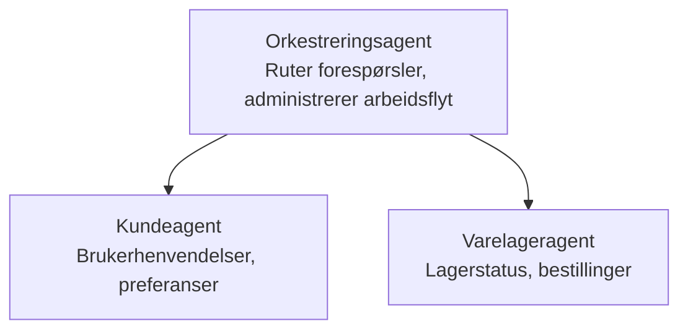

# Kapittel 5: Multi-Agent AI-løsninger

**📚 Kurs**: [AZD For Beginners](../../README.md) | **⏱️ Varighet**: 2-3 timer | **⭐ Kompleksitet**: Avansert

---

## Oversikt

Dette kapittelet dekker avanserte multi-agent arkitektur mønstre, agent orkestrering, og produksjonsklare AI-distribusjoner for komplekse scenarier.

> Validert mot `azd 1.27.1` i juli 2026.

## Læringsmål

Ved å fullføre dette kapittelet vil du:
- Forstå multi-agent arkitektur mønstre
- Distribuere koordinerte AI-agent systemer
- Implementere kommunikasjon mellom agenter
- Bygge produksjonsklare multi-agent løsninger

---

## 📚 Leksjoner

| # | Leksjon | Beskrivelse | Tid |
|---|--------|-------------|------|
| 1 | [Multi-Agent Grunnleggende](multi-agent-basics.md) | Praktisk: distribuer en fungerende multi-agent app med `azd up` | 45 min |
| 2 | [Koordineringsmønstre](../chapter-06-pre-deployment/coordination-patterns.md) | Agent orkestreringsstrategier (fortsetter i Kapittel 6) | 30 min |
| 3 | [Distribusjon av ARM-mal](../../examples/retail-multiagent-arm-template/README.md) | Ett-klikk distribusjonseksempel | 30 min |

> **Start med Leksjon 1.** Det er den eneste fullstendig praktiske, distribuerbare leksjonen i dette kapittelet. Leksjon 2 ligger i Kapittel 6 (den deles med planlegging før distribusjon), og [Retail Multi-Agent Solution](../../examples/retail-scenario.md) er en arkitektur mal—en designreferanse, ikke en ett-kommando mal.

---

## 🚀 Rask Start

```bash
# Alternativ 1: Distribuer fra en mal
azd init --template agent-openai-python-prompty
azd up

# Alternativ 2: Distribuer fra en agentmanifest (krever azure.ai.agents-utvidelse)
azd extension install azure.ai.agents
azd ai agent init -m agent-manifest.yaml
azd up
```

> **Hvilken tilnærming?** Bruk `azd init --template` for å starte med et fungerende eksempel. Bruk `azd ai agent init` når du har din egen agent manifest. Se [AZD AI CLI referanse](../chapter-08-production/production-ai-practices.md#azd-ai-cli-commands-and-extensions) for fullstendige detaljer.

---

## 🤖 Multi-Agent Arkitektur



---

## 🎯 Utvalgt Løsning: Retail Multi-Agent

[Retail Multi-Agent Solution](../../examples/retail-scenario.md) demonstrerer:

- **Kundeagent**: Håndterer brukerinteraksjoner og preferanser
- **Lageragent**: Administrerer lager og ordrebehandling
- **Orkestrator**: Koordinerer mellom agenter
- **Delt Hukommelse**: Tverr-agent kontekststyring

### Tjenester brukt

| Tjeneste | Formål |
|---------|---------|
| Microsoft Foundry Models | Språkforståelse |
| Azure AI Search | Produktkatalog |
| Cosmos DB | Agenttilstand og hukommelse |
| Container Apps | Agenthosting |
| Application Insights | Overvåking |

---

## 🔗 Navigasjon

| Retning | Kapittel |
|-----------|---------|
| **Forrige** | [Kapittel 4: Infrastruktur](../chapter-04-infrastructure/README.md) |
| **Neste** | [Kapittel 6: Forhåndsdistribusjon](../chapter-06-pre-deployment/README.md) |

---

## 📖 Relaterte ressurser

- [AI Agent Guide](../chapter-02-ai-development/agents.md)
- [Produksjons AI-praksis](../chapter-08-production/production-ai-practices.md)
- [AI Feilsøking](../chapter-07-troubleshooting/ai-troubleshooting.md)

---

<!-- CO-OP TRANSLATOR DISCLAIMER START -->
**Ansvarsfraskrivelse**:
Dette dokumentet er oversatt ved hjelp av AI-oversettelsestjenesten [Co-op Translator](https://github.com/Azure/co-op-translator). Selv om vi streber etter nøyaktighet, vær oppmerksom på at automatiske oversettelser kan inneholde feil eller unøyaktigheter. Det opprinnelige dokumentet på originalspråket skal betraktes som den autoritative kilden. For kritisk informasjon anbefales profesjonell menneskelig oversettelse. Vi er ikke ansvarlige for eventuelle misforståelser eller feiltolkninger som oppstår ved bruk av denne oversettelsen.
<!-- CO-OP TRANSLATOR DISCLAIMER END -->