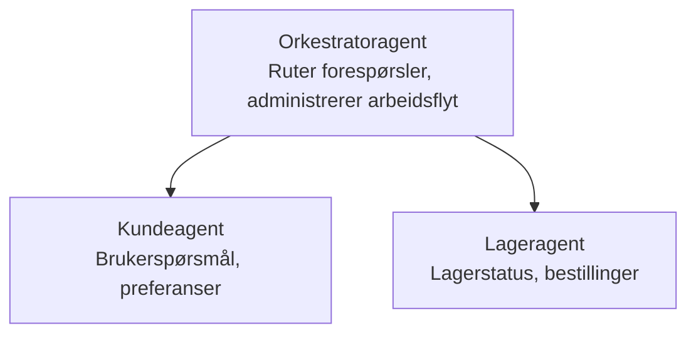

# Kapittel 5: Multi-Agent AI-løsninger

**📚 Kurs**: [AZD For Beginners](../../README.md) | **⏱️ Varighet**: 2-3 timer | **⭐ Vanskelighetsgrad**: Avansert

---

## Oversikt

Dette kapittelet dekker avanserte multi-agent arkitektur-mønstre, agentorkestrering og produksjonsklare AI-distribusjoner for komplekse scenarier.

> Validert mot `azd 1.25.6` i juni 2026.

## Læringsmål

Ved å fullføre dette kapittelet vil du:
- Forstå multi-agent arkitektur-mønstre
- Distribuere koordinerte AI-agent-systemer
- Implementere agent-til-agent kommunikasjon
- Bygge produksjonsklare multi-agent løsninger

---

## 📚 Leksjoner

| # | Leksjon | Beskrivelse | Tid |
|---|---------|-------------|-----|
| 1 | [Multi-Agent Basics](multi-agent-basics.md) | Praktisk: distribuer en fungerende multi-agent app med `azd up` | 45 min |
| 2 | [Coordination Patterns](../chapter-06-pre-deployment/coordination-patterns.md) | Agentorkestreringsstrategier (fortsetter i kapittel 6) | 30 min |
| 3 | [ARM Template Deployment](../../examples/retail-multiagent-arm-template/README.md) | Ett-klikks distribusjonseksempel | 30 min |

> **Start med leksjon 1.** Det er den eneste fullt praktiske, distribuerbare leksjonen i dette kapittelet. Leksjon 2 er i kapittel 6 (den deles med forhåndsdistribusjonsplanlegging), og [Retail Multi-Agent Solution](../../examples/retail-scenario.md) er en arkitekturmal—en designreferanse, ikke en ett-kommando-mal.

---

## 🚀 Kom i gang raskt

```bash
# Alternativ 1: Distribuer fra en mal
azd init --template agent-openai-python-prompty
azd up

# Alternativ 2: Distribuer fra en agent-manifest (krever azure.ai.agents-utvidelse)
azd extension install azure.ai.agents
azd ai agent init -m agent-manifest.yaml
azd up
```

> **Hvilken tilnærming?** Bruk `azd init --template` for å starte fra en fungerende prøve. Bruk `azd ai agent init` når du har ditt eget agentmanifest. Se [AZD AI CLI referanse](../chapter-08-production/production-ai-practices.md#azd-ai-cli-commands-and-extensions) for fullstendige detaljer.

---

## 🤖 Multi-Agent Arkitektur



---

## 🎯 Fokuserte løsning: Retail Multi-Agent

[Retail Multi-Agent Solution](../../examples/retail-scenario.md) demonstrerer:

- **Kundeagent**: Håndterer brukerinteraksjoner og preferanser
- **Lageragent**: Administrerer lager og ordrebehandling
- **Orkestrator**: Koordinerer mellom agenter
- **Delt Minne**: Tverragents kontekststyring

### Brukte tjenester

| Tjeneste | Formål |
|----------|---------|
| Microsoft Foundry Models | Språkforståelse |
| Azure AI Search | Produktkatalog |
| Cosmos DB | Agenttilstand og minne |
| Container Apps | Agenthosting |
| Application Insights | Overvåkning |

---

## 🔗 Navigasjon

| Retning | Kapittel |
|---------|----------|
| **Forrige** | [Kapittel 4: Infrastruktur](../chapter-04-infrastructure/README.md) |
| **Neste** | [Kapittel 6: Forhåndsdistribusjon](../chapter-06-pre-deployment/README.md) |

---

## 📖 Relaterte ressurser

- [AI Agents Guide](../chapter-02-ai-development/agents.md)
- [Production AI Practices](../chapter-08-production/production-ai-practices.md)
- [AI Troubleshooting](../chapter-07-troubleshooting/ai-troubleshooting.md)

---

<!-- CO-OP TRANSLATOR DISCLAIMER START -->
**Ansvarsfraskrivelse**:
Dette dokumentet er oversatt ved hjelp av AI-oversettelsestjenesten [Co-op Translator](https://github.com/Azure/co-op-translator). Selv om vi streber etter nøyaktighet, vær oppmerksom på at automatiske oversettelser kan inneholde feil eller unøyaktigheter. Det opprinnelige dokumentet på originalspråket skal betraktes som den autoritative kilden. For kritisk informasjon anbefales profesjonell menneskelig oversettelse. Vi er ikke ansvarlige for eventuelle misforståelser eller feiltolkninger som oppstår ved bruk av denne oversettelsen.
<!-- CO-OP TRANSLATOR DISCLAIMER END -->