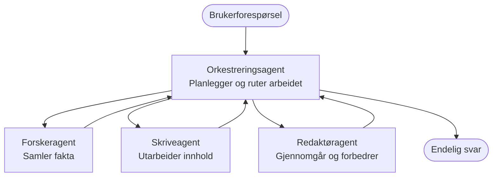

# Grunnleggende om multi-agent – distribuer ditt første koordinerte AI-system

**Kapittelnavigasjon:**
- **📚 Kursstart**: [AZD For Beginners](../../README.md)
- **📖 Nåværende kapittel**: Kapittel 5 - Multi-Agent AI-løsninger
- **⬅️ Forrige**: [Kapittel 4: Infrastruktur](../chapter-04-infrastructure/README.md)
- **➡️ Neste**: [Koordineringsmønstre](../chapter-06-pre-deployment/coordination-patterns.md)

> Verifisert mot `azd 1.27.1` i juli 2026.

## Introduksjon

I de tidligere kapitlene deployerte du en enkelt applikasjon – og i kapittel 2 deployerte du en enkelt AI-agent. Denne leksjonen tar neste steg: deployere et **multi-agent system**, hvor flere spesialiserte agenter samarbeider om å løse et problem som ingen enkeltagent alene kunne håndtere godt.

Den gode nyheten for nybegynnere: **du trenger ingen nye kommandoer.** En multi-agent løsning er fortsatt et azd-prosjekt. Du vil `azd init`, `azd up`, teste, og `azd down` — akkurat den arbeidsflyten du allerede kjenner. Det som endrer seg er *formen* til appen inni.

## Læringsmål

Etter denne leksjonen vil du:
- Forstå hva "multi-agent" betyr og når det er verdt den ekstra kompleksiteten
- Gjenkjenne de vanlige rollene i et multi-agent system (orkestrator + spesialister)
- Deployere en ekte, fungerende multi-agent mal med `azd up`
- Forstå Azure-ressursene som støtter en multi-agent app
- Vite hvordan du verifiserer, tilpasser og river ned løsningen trygt

## Læringsutbytte

Etter å ha fullført denne leksjonen vil du kunne:
- Forklare forskjellen mellom en enkeltagent og et multi-agent system
- Velge mellom en enkeltagent med verktøy og et ekte multi-agent design
- Deployere og teste en multi-agent mal ende-til-ende med azd
- Identifisere hvor hver agent kjører og hvordan de kommuniserer
- Rydde opp alle ressurser for å unngå løpende kostnader

---

## Hva er et multi-agent system?

En enkelt AI-agent er én modell med et sett av instruksjoner og (valgfritt) noen verktøy. Det fungerer godt for fokuserte oppgaver. Men etter hvert som oppgaven vokser – forskning, deretter skriving, deretter redigering, deretter faktasjekking – gjør alt i én prompt agenten tregere, mindre pålitelig og vanskeligere å feilsøke.

Et **multi-agent system** deler opp arbeidet i spesialister som hver gjør én oppgave godt, koordinert av en orkestrator:



### De to rollene du alltid vil se

| Rolle | Oppgave | Eksempel |
|------|---------|----------|
| **Orkestrator** | Bestemmer *hva som skjer videre* og ruter arbeid mellom agenter | "Først forskning, så skriving, så redigering" |
| **Spesialist** | Gjør én fokusert oppgave og returnerer et resultat | En "forsker" som bare samler fakta |

### Trenger du egentlig flere agenter?

Begynn enkelt. Bruk multi-agent **bare** når ett av disse er sant:

- ✅ Oppgaven har **distinkte faser** som drar nytte av forskjellige instruksjoner (forskning vs. skriving vs. gjennomgang)
- ✅ Du ønsker at spesialister kjører **parallelt** for å spare tid
- ✅ Ulike steg trenger **forskjellige verktøy eller datakilder**
- ✅ Du trenger at hvert steg er **uavhengig testbart og feilsøkbart**

Hvis oppgaven er et enkelt spørsmål-og-svar eller et enkelt verktøyskall, er en **enkel agent med verktøy** (Kapittel 2) enklere, billigere og lettere å operere.

> **Tips for nybegynnere:** "Flere agenter" er ikke nødvendigvis "bedre." Hver agent legger til forsinkelse, kostnad og noe nytt å overvåke. Legg til agenter kun når problemet tydelig kan deles opp.

---

## To måter å bygge multi-agent på Azure

| Tilnærming | Hva det er | Best for |
|------------|------------|---------|
| **Enkel agent + verktøy** | En Foundry-agent som kaller funksjoner/verktøy | Enkle arbeidsflyter, komme i gang |
| **Flere koordinerte agenter** | Flere agenter med en orkestrator | Distinkte faser, parallelt arbeid, spesialisering |

Denne leksjonen fokuserer på den andre tilnærmingen ved bruk av en **ferdiglage mal**, så du kan se et ekte multi-agent system kjøre før du bygger ditt eget.

---

## Praktisk: Deploy en fungerende multi-agent app

Vi skal deployere **Contoso Creative Writer**, et offisielt Azure-eksempel som bruker flere agenter (forsker, forfatter, redaktør) koordinert for å produsere en artikkel. Det er en flott første multi-agent app fordi rollene er lette å forstå.

### Steg 1: Initialiser malen

```bash
# Opprett en arbeidsmappe
mkdir creative-writer && cd creative-writer

# Initialiser fra den offisielle fleragent-malen
azd init --template contoso-creative-writer
```

> Bla gjennom flere multi-agent maler når som helst i [Awesome AZD AI-galleriet](https://azure.github.io/awesome-azd/?tags=ai). Andre nybegynnervennlige alternativer inkluderer `get-started-with-ai-agents` og `azure-ai-travel-agents`.

### Steg 2: Autentiser

```bash
# Påkrevd for azd arbeidsflyter
azd auth login
```

### Steg 3: Lag et miljø

```bash
azd env new dev
```

### Steg 4: Forhåndsvis, så deployer

```bash
# Se hva som vil bli opprettet før du bruker noe (anbefalt)
azd provision --preview

# Opprett infrastruktur og distribuer alle agenter i ett trinn
azd up
```

`azd up` vil spørre om abonnement og region, så provisjonere Azure-ressursene og deployere applikasjonen. AI-deployeringer kan ta lengre tid enn en enkel webapp — hvis du deployerer større modeller, kan du forlenge deploy-tidsavbruddet:

```bash
azd deploy --timeout 1800
```

> **Merk kostnad og kapasitet:** Multi-agent apper deployerer AI-modeller som bruker kvote og påløper kostnader. Hvis `azd up` feiler på modell-kvote, se [AI feilsøking](../chapter-07-troubleshooting/ai-troubleshooting.md) for region- og kvoteløsninger, og kapittel 6 [Kapasitetsplanlegging](../chapter-06-pre-deployment/capacity-planning.md).

---

## Forstå hva du har deployert

En typisk multi-agent app som denne provisjonerer et sett Azure-ressurser som direkte matcher ansvarsområdene i diagrammet over:

| Ressurs | Hvorfor den finnes |
|---------|------------------|
| **Microsoft Foundry / Modeller** | Huser språkmodellene hver agent bruker |
| **Azure AI Search** | Gir forsker-agenten grunnlag å søke i |
| **Container Apps** (eller App Service) | Huser orkestrator og agentkode |
| **Cosmos DB** (i noen eksempler) | Lagrer delt tilstand/minne delt mellom agenter |
| **Application Insights** | Sporer forespørsler *på tvers* av agenter så du kan feilsøke flyten |

### Hvordan agentene snakker med hverandre

I de fleste azd multi-agent eksempler kjører **orkestratoren i applikasjonskoden** din (for eksempel ved å bruke et rammeverk som Semantic Kernel eller Microsoft Agent Framework). Orkestratoren kaller hver spesialistagent etter tur, sender videre resultatene, og setter sammen det endelige svaret. Agentene deler kontekst gjennom:

- **Funksjons-/verktøykall** — orkestratoren anroper en spesialist og får et resultat tilbake
- **Delt minne** — en database (ofte Cosmos DB) holder tilstand som begge agenter kan lese
- **Meldinger/hendelser** — for løsere kobling kommuniserer agenter via en kø eller Service Bus

> **Hvorfor dette er viktig for feilsøking:** fordi hvert steg er separat, viser Application Insights deg *hvilken* agent som var treg eller feilet. Det er en hovedgrunn til å dele opp arbeid på agenter fra starten.

---

## Verifiser deployeringen

Bekreft at systemet faktisk fungerer før du går videre:

```bash
# Vis de distribuerte endepunktene
azd show

# Åpne appens overvåkingsdashboard
azd monitor

# Følg loggene hvis noe ser galt ut
azd monitor --logs
```

Så åpner du app-URL fra `azd show` og prøver en forespørsel som bruker alle agentene (for Creative Writer, be den skrive en kort artikkel om et emne). I Application Insights **transaction search** bør du se forespørselen spres over forsker-, forfatter- og redigeringsstegene.

**Suksesskriterier:**
- ✅ `azd show` viser en tilgjengelig endepunkt
- ✅ En forespørsel produserer et resultat som tydelig gikk gjennom flere faser
- ✅ Application Insights viser spor for mer enn ett agent-steg

---

## Tilpass: Legg til eller juster en agent

Siden hver agent bare er instruksjoner pluss verktøy, er tilpasning enkelt:

1. **Finn agentdefinisjonene** i malen (ofte et `prompts/`, `agents/` eller `*.prompty` sett med filer).
2. **Finjuster agentens instruksjoner** — for eksempel be redaktør-agenten håndheve en bestemt tone eller antall ord.
3. **Deploy bare koden på nytt** (infrastrukturen endres ikke):

   ```bash
   azd deploy
   ```

For å gå videre og bygge agenter fra ditt *egne* manifest, bruk agentutvidelsen og hele livssyklusen:

```bash
azd extension install azure.ai.agents
azd ai agent init -m agent-manifest.yaml
azd up
azd ai agent invoke      # test, med responstid
```

Se [Kapittel 2: Agenter](../chapter-02-ai-development/agents.md) og [AZD AI CLI-referansen](../chapter-08-production/production-ai-practices.md#azd-ai-cli-commands-and-extensions) for full agent livssyklus (`invoke`, `eval generate`, `optimize`, `delete`).

---

## Rydd opp

Multi-agent apper kjører flere fakturerbare tjenester. Riv ned alt når du er ferdig:

```bash
azd down --force --purge
```

`--purge` flagget fjerner også mykt slettede AI-ressurser (som Foundry/Azure AI Services kontoer) slik at de ikke blokkerer en fremtidig ny deploy eller påløper kostnader.

---

## En merknad om produksjons multi-agent systemer

[Retail Multi-Agent Solution](../../examples/retail-scenario.md) i dette repoet er en **arkitekturblåkopi**, ikke en én-kommando mal — den dokumenterer hvordan et produksjons retail-system *ville* blitt bygget (og påpeker at en full bygning er en betydelig innsats). Bruk den som referanse *etter* at du har deployert et fungerende eksempel her. For produksjonsbekymringer (resiliens, kostnad, overvåking, styring), fortsett til [Kapittel 8: Produksjons AI-praksis](../chapter-08-production/production-ai-practices.md).

---

## Oppsummering

- Et multi-agent system deler opp arbeid på spesialister koordinert av en orkestrator.
- Bruk det kun når oppgaven har distinkte faser, parallellitet, eller forskjellige verktøy per steg—ellers foretrekk en enkelt agent.
- Azd-arbeidsflyten er uendret: `azd init` → `azd up` → test → `azd down`.
- En ekte mal som `contoso-creative-writer` lar deg se og tilpasse en fungerende multi-agent app i dag.
- Application Insights sporing på tvers av agenter er en av de største praktiske fordelene med multi-agent design.

---

## 🔗 Navigasjon

| Retning | Leksjon |
|----------|---------|
| **Forrige** | [Kapittel 4: Infrastruktur](../chapter-04-infrastructure/README.md) |
| **Neste** | [Koordineringsmønstre](../chapter-06-pre-deployment/coordination-patterns.md) |

## 📖 Relaterte ressurser

- [AI Agent Guide](../chapter-02-ai-development/agents.md)
- [Koordineringsmønstre](../chapter-06-pre-deployment/coordination-patterns.md)
- [Produksjons AI-praksiser](../chapter-08-production/production-ai-practices.md)
- [AI feilsøking](../chapter-07-troubleshooting/ai-troubleshooting.md)

---

<!-- CO-OP TRANSLATOR DISCLAIMER START -->
**Ansvarsfraskrivelse**:
Dette dokumentet er oversatt ved hjelp av AI-oversettelsestjenesten [Co-op Translator](https://github.com/Azure/co-op-translator). Selv om vi streber etter nøyaktighet, vær oppmerksom på at automatiske oversettelser kan inneholde feil eller unøyaktigheter. Det opprinnelige dokumentet på originalspråket skal betraktes som den autoritative kilden. For kritisk informasjon anbefales profesjonell menneskelig oversettelse. Vi er ikke ansvarlige for eventuelle misforståelser eller feiltolkninger som oppstår ved bruk av denne oversettelsen.
<!-- CO-OP TRANSLATOR DISCLAIMER END -->