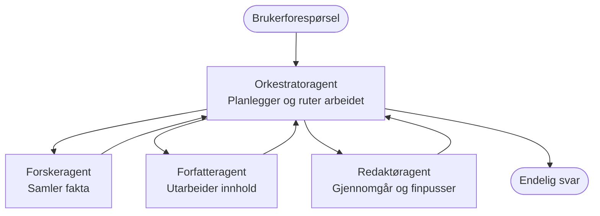

# Grunnleggende om multi-agent - Distribuer ditt første koordinerte AI-system

**Kapittelnavigasjon:**
- **📚 Kursoversikt**: [AZD For Beginners](../../README.md)
- **📖 Gjeldende kapittel**: Kapittel 5 - Multi-agent AI-løsninger
- **⬅️ Forrige**: [Kapittel 4: Infrastruktur](../chapter-04-infrastructure/README.md)
- **➡️ Neste**: [Koordineringsmønstre](../chapter-06-pre-deployment/coordination-patterns.md)

> Validert mot `azd 1.25.6` i juni 2026.

## Introduksjon

I de tidligere kapitlene distribuerte du én enkelt applikasjon—og i Kapittel 2 distribuerte du én enkelt AI-agent. Denne leksjonen tar neste steg: å distribuere et **multi-agent-system**, der flere spesialiserte agenter jobber sammen for å løse et problem ingen enkelt agent kan håndtere godt alene.

Den gode nyheten for nybegynnere: **du trenger ikke nye kommandoer.** En multi-agent-løsning er fortsatt et azd-prosjekt. Du vil kjøre `azd init`, `azd up`, teste, og `azd down`—nøyaktig den arbeidsflyten du allerede kan. Det som endrer seg er *formen* til appen innvendig.

## Læringsmål

Etter denne leksjonen vil du:
- Forstå hva «multi-agent» betyr og når det er verdt den ekstra kompleksiteten
- Gjenkjenne de vanlige rollene i et multi-agent-system (orkestrator + spesialister)
- Distribuere en ekte, fungerende multi-agent-mal med `azd up`
- Forstå Azure-ressursene som støtter en multi-agent-app
- Vite hvordan du verifiserer, tilpasser og trygt fjerner løsningen

## Læringsutbytte

Etter å ha fullført denne leksjonen vil du kunne:
- Forklare forskjellen mellom en enkelt agent og et multi-agent-system
- Velge mellom en enkelt agent med verktøy og et ekte multi-agent-design
- Distribuere og teste en multi-agent-mal ende-til-ende med azd
- Identifisere hvor hver agent kjører og hvordan de kommuniserer
- Rydde opp alle ressurser for å unngå løpende kostnader

---

## Hva er et multi-agent-system?

En enkelt AI-agent er én modell med et sett instruksjoner og (valgfritt) noen verktøy. Det fungerer godt for fokuserte oppgaver. Men når en oppgave vokser—forskning, så skriving, så redigering, så faktasjekk—blir det å putte alt i én prompt tregere, mindre pålitelig og vanskeligere å feilsøke.

Et **multi-agent-system** deler arbeidet opp i spesialister som hver gjør én oppgave godt, koordinert av en orkestrator:



### De to rollene du alltid vil se

| Rolle | Oppgave | Eksempel |
|------|-----|---------|
| **Orchestrator** | Bestemmer *hva som skjer videre* og ruter arbeid mellom agenter | "Først forskning, så skriving, så redigering" |
| **Spesialist** | Utfører én fokusert oppgave og returnerer et resultat | En "forsker" som kun samler fakta |

### Trenger du egentlig flere agenter?

Start enkelt. Gå for multi-agent **kun** når ett av disse gjelder:

- ✅ Oppgaven har **distinkte faser** som har nytte av forskjellige instruksjoner (forskning vs. skriving vs. gjennomgang)
- ✅ Du ønsker at spesialister skal kjøre **parallelt** for å spare tid
- ✅ Ulike trinn trenger **forskjellige verktøy eller datakilder**
- ✅ Du trenger at hvert trinn er **uavhengig testbart og feilsøkbart**

Hvis oppgaven din er ett enkelt spørsmål-og-svar eller et enkelt verktøysanrop, er en **en enkelt agent med verktøy** (Kapittel 2) enklere, rimeligere, og lettere å drifte.

> **Tips for nybegynnere:** "Flere agenter" er ikke "bedre." Hver agent legger til latenstid, kostnad, og en ny ting å overvåke. Legg til agenter kun når problemet klart deler seg i deler.

---

## To måter å bygge multi-agent på Azure

| Tilnærming | Hva det er | Best for |
|----------|-----------|----------|
| **En enkelt agent + verktøy** | Én Foundry-agent som kaller funksjoner/verktøy | Enkle arbeidsflyter, komme i gang |
| **Flere koordinerte agenter** | Flere agenter med en orkestrator | Distinkte faser, parallelt arbeid, spesialisering |

Denne leksjonen fokuserer på den andre tilnærmingen ved å bruke en **ferdiglaget mal**, slik at du kan se et ekte multi-agent-system kjørende før du bygger ditt eget.

---

## Praktisk: Distribuer en fungerende multi-agent-app

Vi skal distribuere **Contoso Creative Writer**, et offisielt Azure-eksempel som bruker flere agenter (forsker, forfatter, redaktør) koordinert for å produsere en artikkel. Det er en flott førstegangs multi-agent-app fordi rollene er lette å forstå.

### Steg 1: Initialiser malen

```bash
# Opprett en arbeidsmappe
mkdir creative-writer && cd creative-writer

# Initialiser fra den offisielle multi-agent-malen
azd init --template contoso-creative-writer
```

> Bla gjennom flere multi-agent-maler når som helst i [Awesome AZD AI-galleriet](https://azure.github.io/awesome-azd/?tags=ai). Andre nybegynnervennlige alternativer inkluderer `get-started-with-ai-agents` og `azure-ai-travel-agents`.

### Steg 2: Autentiser

```bash
# Påkrevd for azd-arbeidsflyter
azd auth login
```

### Steg 3: Opprett et miljø

```bash
azd env new dev
```

### Steg 4: Forhåndsvis, deretter distribuer

```bash
# Se hva som vil bli opprettet før du bruker noe (anbefalt)
azd provision --preview

# Opprett infrastruktur og distribuer alle agenter i ett trinn
azd up
```

`azd up` vil be om et abonnement og region, deretter opprette Azure-ressursene og distribuere applikasjonen. AI-distribusjoner kan ta lengre tid enn en enkel webapp—hvis du distribuerer større modeller, kan du utvide tidsavbruddet for distribusjonen:

```bash
azd deploy --timeout 1800
```

> **Advarsel om kostnader og kapasitet:** Multi-agent-apper distribuerer AI-modeller som bruker kvote og medfører kostnader. Hvis `azd up` feiler på modellkvote, se [AI Troubleshooting](../chapter-07-troubleshooting/ai-troubleshooting.md) for region- og kvotefikser, og Kapittel 6 [Kapasitetsplanlegging](../chapter-06-pre-deployment/capacity-planning.md).

---

## Forstå hva du distribuerte

En typisk multi-agent-app som denne oppretter et sett Azure-ressurser som kartlegger direkte til ansvarene i diagrammet ovenfor:

| Ressurs | Hvorfor den finnes |
|----------|----------------|
| **Microsoft Foundry / Models** | Huser språkmodellene som hver agent bruker |
| **Azure AI Search** | Gir forskeragenten grunnfestet data å søke i |
| **Container Apps** (eller App Service) | Huser orkestratoren og agentkoden |
| **Cosmos DB** (i noen eksempler) | Lagrer delt tilstand/minne som sendes mellom agenter |
| **Application Insights** | Sporer forespørsler *på tvers av* agenter slik at du kan feilsøke flyten |

### Hvordan agentene snakker med hverandre

I de fleste azd multi-agent-eksemplene kjører **orkestratoren i applikasjonskoden din** (for eksempel ved å bruke et rammeverk som Semantic Kernel eller Microsoft Agent Framework). Orkestratoren kaller hver spesialistagent etter tur, videresender resultatene, og setter sammen sluttresultatet. Agentene deler kontekst gjennom:

- **Funksjons-/verktøysanrop** — orkestratoren påkaller en spesialist og får et resultat tilbake
- **Delt minne** — en database (ofte Cosmos DB) holder tilstand som begge agenter kan lese
- **Meldinger/hendelser** — for løsere kobling kommuniserer agenter via en kø eller Service Bus

> **Hvorfor dette betyr noe for feilsøking:** fordi hvert trinn er separat, viser Application Insights deg *hvilken* agent som var treg eller feilet. Det er en viktig grunn til å dele arbeidet på tvers av agenter i første omgang.

---

## Verifiser distribusjonen

Bekreft at systemet faktisk fungerer før du går videre:

```bash
# Vis de distribuerte endepunktene
azd show

# Åpne appens overvåkingsdashbord
azd monitor

# Følg loggene hvis noe ser galt ut
azd monitor --logs
```

Deretter åpner du app-URL-en fra `azd show` og prøver en forespørsel som berører alle agentene (for Creative Writer, be den skrive en kort artikkel om et emne). I Application Insights **transaction search** bør du se at forespørselen spres over forsker-, forfatter- og redaktørtrinnene.

**Suksesskriterier:**
- ✅ `azd show` viser et tilgjengelig endepunkt
- ✅ En forespørsel gir et resultat som tydelig gikk gjennom flere faser
- ✅ Application Insights viser spor for mer enn ett agenttrinn

---

## Tilpass: Legg til eller juster en agent

Fordi hver agent bare er instruksjoner pluss verktøy, er tilpasning innen rekkevidde:

1. **Finn agentdefinisjonene** i malen (ofte en `prompts/`, `agents/`, eller `*.prompty` sett med filer).
2. **Juster en agents instruksjoner** — for eksempel be redaktøragenten håndheve en spesifikk tone eller ordtelling.
3. **Distribuer kun koden på nytt** (infrastrukturen er uendret):

   ```bash
   azd deploy
   ```

For å gå videre og bygge agenter fra din *egen* manifest, bruk agentforlengelsen og dens fulle livssyklus:

```bash
azd extension install azure.ai.agents
azd ai agent init -m agent-manifest.yaml
azd up
azd ai agent invoke      # test, med responstid
```

Se [Kapittel 2: Agenter](../chapter-02-ai-development/agents.md) og [AZD AI CLI-referansen](../chapter-08-production/production-ai-practices.md#azd-ai-cli-commands-and-extensions) for den komplette agentlivssyklusen (`invoke`, `eval generate`, `optimize`, `delete`).

---

## Rydd opp

Multi-agent-apper kjører flere avgiftsbelagte tjenester. Fjern alt når du er ferdig:

```bash
azd down --force --purge
```

Flagget `--purge` fjerner også soft-slettede AI-ressurser (som Foundry/Azure AI Services-kontoer) slik at de ikke blokkerer en fremtidig redeploy eller fortsetter å påløpe kostnader.

---

## En merknad om produksjonsmulti-agent-systemer

The [Retail Multi-Agent Solution](../../examples/retail-scenario.md) i dette repoet er en **arkitekturblåkopi**, ikke en én-kommando-mal—den dokumenterer hvordan et produksjons retail-system *ville* blitt bygget (og er eksplisitt på at en full bygging er en betydelig innsats). Bruk den som en designreferanse *etter* at du har distribuert et fungerende eksempel her. For produksjonshensyn (motstandskraft, kostnad, overvåking, styring), fortsett til [Kapittel 8: Produksjonspraksis for AI](../chapter-08-production/production-ai-practices.md).

---

## Sammendrag

- Et multi-agent-system deler arbeidet på tvers av spesialister koordinert av en orkestrator.
- Bruk det bare når oppgaven har distinkte faser, parallellitet, eller forskjellige verktøy per trinn—ellers foretrekk en enkelt agent.
- Azd-arbeidsflyten er uendret: `azd init` → `azd up` → test → `azd down`.
- En ekte mal som `contoso-creative-writer` lar deg se og tilpasse en fungerende multi-agent-app i dag.
- Application Insights-sporing på tvers av agenter er en av de største praktiske fordelene med multi-agent-designet.

---

## 🔗 Navigasjon

| Retning | Leksjon |
|-----------|--------|
| **Forrige** | [Kapittel 4: Infrastruktur](../chapter-04-infrastructure/README.md) |
| **Neste** | [Koordineringsmønstre](../chapter-06-pre-deployment/coordination-patterns.md) |

## 📖 Relaterte ressurser

- [AI-agentguiden](../chapter-02-ai-development/agents.md)
- [Koordineringsmønstre](../chapter-06-pre-deployment/coordination-patterns.md)
- [Produksjonspraksis for AI](../chapter-08-production/production-ai-practices.md)
- [AI-feilsøking](../chapter-07-troubleshooting/ai-troubleshooting.md)

---

<!-- CO-OP TRANSLATOR DISCLAIMER START -->
**Ansvarsfraskrivelse**:
Dette dokumentet er oversatt ved hjelp av AI-oversettelsestjenesten [Co-op Translator](https://github.com/Azure/co-op-translator). Selv om vi streber etter nøyaktighet, vær oppmerksom på at automatiske oversettelser kan inneholde feil eller unøyaktigheter. Det opprinnelige dokumentet på originalspråket skal betraktes som den autoritative kilden. For kritisk informasjon anbefales profesjonell menneskelig oversettelse. Vi er ikke ansvarlige for eventuelle misforståelser eller feiltolkninger som oppstår ved bruk av denne oversettelsen.
<!-- CO-OP TRANSLATOR DISCLAIMER END -->