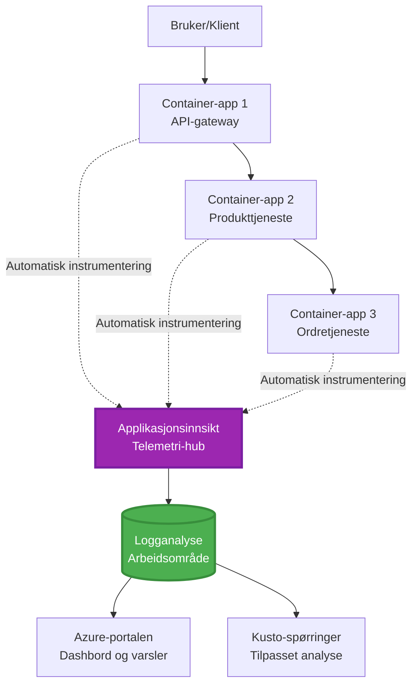
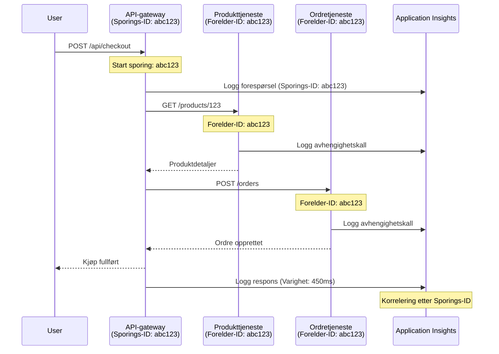

# Application Insights-integrasjon med AZD

⏱️ **Estimert tid**: 40-50 minutter | 💰 **Kostnadseffekt**: ~$5-15/month | ⭐ **Kompleksitet**: Middels

**📚 Læringssti:**
- ← Forrige: [Forhåndssjekker](preflight-checks.md) - Forhåndsvalidering før utrulling
- 🎯 **Du er her**: Application Insights-integrasjon (overvåking, telemetri, feilsøking)
- → Neste: [Distribusjonsguide](../chapter-04-infrastructure/deployment-guide.md) - Distribuer til Azure
- 🏠 [Kursoversikt](../../README.md)

---

## Hva du vil lære

By completing this lesson, you will:
- Integrere **Application Insights** i AZD-prosjekter automatisk
- Konfigurere **distribuert sporing** for mikrotjenester
- Implementere **egendefinert telemetri** (metrikker, hendelser, avhengigheter)
- Sett opp **live-metrikker** for sanntidsovervåking
- Opprette **varsler og dashbord** fra AZD-distribusjoner
- Feilsøke produksjonsproblemer med **telemetri-spørringer**
- Optimalisere **kostnader og sampling** strategier
- Overvåke **AI/LLM-applikasjoner** (tokens, latenstid, kostnader)

## Hvorfor Application Insights med AZD er viktig

### Utfordringen: Observabilitet i produksjon

**Uten Application Insights:**
```
❌ No visibility into production behavior
❌ Manual log aggregation across services
❌ Reactive debugging (wait for customer complaints)
❌ No performance metrics
❌ Cannot trace requests across services
❌ Unknown failure rates and bottlenecks
```

**Med Application Insights + AZD:**
```
✅ Automatic telemetry collection
✅ Centralized logs from all services
✅ Proactive issue detection
✅ End-to-end request tracing
✅ Performance metrics and insights
✅ Real-time dashboards
✅ AZD provisions everything automatically
```

**Analogien**: Application Insights er som å ha en "black box"-flyopptaker + cockpit-dashboard for applikasjonen din. Du ser alt som skjer i sanntid og kan gjenskape enhver hendelse.

---

## Arkitekturoversikt

### Application Insights i AZD-arkitekturen


### Hva som overvåkes automatisk

| Telemetritype | Hva den fanger | Bruksområde |
|----------------|------------------|----------|
| **Requests** | HTTP-forespørsler, statuskoder, varighet | Overvåking av API-ytelse |
| **Dependencies** | Eksterne kall (DB, API-er, lagring) | Identifisere flaskehalser |
| **Exceptions** | Ubehandlede feil med stack traces | Feilsøking av feil |
| **Custom Events** | Forretningshendelser (registrering, kjøp) | Analyse og konverteringstrakter |
| **Metrics** | Ytelsestellere, egendefinerte metrikker | Kapasitetsplanlegging |
| **Traces** | Loggmeldinger med alvorlighetsgrad | Feilsøking og revisjon |
| **Availability** | Oppetid og responstidstester | SLA-overvåking |

---

## Forutsetninger

### Nødvendige verktøy

```bash
# Kontroller Azure Developer CLI
azd version
# ✅ Forventet: azd versjon 1.0.0 eller høyere

# Kontroller Azure CLI
az --version
# ✅ Forventet: azure-cli 2.50.0 eller høyere
```

### Azure-krav

- Aktivt Azure-abonnement
- Tillatelser til å opprette:
  - Application Insights-ressurser
  - Log Analytics-arbeidsområder
  - Container Apps
  - Ressursgrupper

### Forkunnskaper

Du bør ha fullført:
- [AZD-grunnleggende](../chapter-01-foundation/azd-basics.md) - Grunnleggende AZD-konsepter
- [Konfigurasjon](../chapter-03-configuration/configuration.md) - Oppsett av miljø
- [Første prosjekt](../chapter-01-foundation/first-project.md) - Grunnleggende distribusjon

---

## Leksjon 1: Automatisk Application Insights med AZD

### Hvordan AZD oppretter Application Insights

AZD oppretter og konfigurerer automatisk Application Insights når du distribuerer. La oss se hvordan det fungerer.

### Prosjektstruktur

```
monitored-app/
├── azure.yaml                     # AZD configuration
├── infra/
│   ├── main.bicep                # Main infrastructure
│   ├── core/
│   │   └── monitoring.bicep      # Application Insights + Log Analytics
│   └── app/
│       └── api.bicep             # Container App with monitoring
└── src/
    ├── app.py                    # Application with telemetry
    ├── requirements.txt
    └── Dockerfile
```

---

### Trinn 1: Konfigurer AZD (azure.yaml)

**Fil: `azure.yaml`**

```yaml
name: monitored-app
metadata:
  template: monitored-app@1.0.0

services:
  api:
    project: ./src
    language: python
    host: containerapp

# AZD automatically provisions monitoring!
```

**Det er det!** AZD vil opprette Application Insights som standard. Ingen ekstra konfigurasjon nødvendig for grunnleggende overvåking.

---

### Trinn 2: Overvåkingsinfrastruktur (Bicep)

**Fil: `infra/core/monitoring.bicep`**

```bicep
param logAnalyticsName string
param applicationInsightsName string
param location string = resourceGroup().location
param tags object = {}

// Log Analytics Workspace (required for Application Insights)
resource logAnalytics 'Microsoft.OperationalInsights/workspaces@2022-10-01' = {
  name: logAnalyticsName
  location: location
  tags: tags
  properties: {
    sku: {
      name: 'PerGB2018'  // Pay-as-you-go pricing
    }
    retentionInDays: 30  // Keep logs for 30 days
    features: {
      enableLogAccessUsingOnlyResourcePermissions: true
    }
  }
}

// Application Insights
resource applicationInsights 'Microsoft.Insights/components@2020-02-02' = {
  name: applicationInsightsName
  location: location
  tags: tags
  kind: 'web'
  properties: {
    Application_Type: 'web'
    WorkspaceResourceId: logAnalytics.id
    IngestionMode: 'LogAnalytics'
    publicNetworkAccessForIngestion: 'Enabled'
    publicNetworkAccessForQuery: 'Enabled'
  }
}

// Outputs for Container Apps
output logAnalyticsWorkspaceId string = logAnalytics.id
output logAnalyticsWorkspaceName string = logAnalytics.name
output applicationInsightsConnectionString string = applicationInsights.properties.ConnectionString
output applicationInsightsInstrumentationKey string = applicationInsights.properties.InstrumentationKey
output applicationInsightsName string = applicationInsights.name
```

---

### Trinn 3: Koble Container App til Application Insights

**Fil: `infra/app/api.bicep`**

```bicep
param name string
param location string
param tags object = {}
param containerAppsEnvironmentName string
param applicationInsightsConnectionString string

resource containerApp 'Microsoft.App/containerApps@2023-05-01' = {
  name: name
  location: location
  tags: tags
  properties: {
    configuration: {
      ingress: {
        external: true
        targetPort: 8000
      }
      secrets: [
        {
          name: 'appinsights-connection-string'
          value: applicationInsightsConnectionString
        }
      ]
    }
    template: {
      containers: [
        {
          name: 'api'
          image: 'myregistry.azurecr.io/api:latest'
          resources: {
            cpu: json('0.5')
            memory: '1Gi'
          }
          env: [
            {
              name: 'APPLICATIONINSIGHTS_CONNECTION_STRING'
              secretRef: 'appinsights-connection-string'
            }
            {
              name: 'APPLICATIONINSIGHTS_ENABLED'
              value: 'true'
            }
          ]
        }
      ]
    }
  }
}

output uri string = 'https://${containerApp.properties.configuration.ingress.fqdn}'
```

---

### Trinn 4: Applikasjonskode med telemetri

**Fil: `src/app.py`**

```python
from flask import Flask, request, jsonify
from opencensus.ext.azure.log_exporter import AzureLogHandler
from opencensus.ext.azure.trace_exporter import AzureExporter
from opencensus.ext.flask.flask_middleware import FlaskMiddleware
from opencensus.trace.samplers import ProbabilitySampler
import logging
import os

app = Flask(__name__)

# Hent Application Insights-tilkoblingsstreng
connection_string = os.environ.get('APPLICATIONINSIGHTS_CONNECTION_STRING')

if connection_string:
    # Konfigurer distribuert sporing
    middleware = FlaskMiddleware(
        app,
        exporter=AzureExporter(connection_string=connection_string),
        sampler=ProbabilitySampler(rate=1.0)  # 100 % sampling for utvikling
    )
    
    # Konfigurer logging
    logger = logging.getLogger(__name__)
    logger.addHandler(AzureLogHandler(connection_string=connection_string))
    logger.setLevel(logging.INFO)
    
    print("✅ Application Insights enabled")
else:
    logger = logging.getLogger(__name__)
    logger.setLevel(logging.INFO)
    print("⚠️ Application Insights not configured")

@app.route('/health')
def health():
    logger.info('Health check endpoint called')
    return jsonify({'status': 'healthy', 'monitoring': 'enabled'})

@app.route('/api/products')
def get_products():
    logger.info('Fetching products')
    
    # Simuler databasekall (automatisk sporet som avhengighet)
    products = [
        {'id': 1, 'name': 'Laptop', 'price': 999.99},
        {'id': 2, 'name': 'Mouse', 'price': 29.99},
        {'id': 3, 'name': 'Keyboard', 'price': 79.99}
    ]
    
    logger.info(f'Returned {len(products)} products')
    return jsonify(products)

@app.route('/api/error-test')
def error_test():
    """Test error tracking"""
    logger.error('Testing error tracking')
    try:
        raise ValueError('This is a test exception')
    except Exception as e:
        logger.exception('Exception occurred in error-test endpoint')
        return jsonify({'error': str(e)}), 500

@app.route('/api/slow')
def slow_endpoint():
    """Test performance tracking"""
    import time
    logger.info('Slow endpoint called')
    time.sleep(3)  # Simuler langsom operasjon
    logger.warning('Endpoint took 3 seconds to respond')
    return jsonify({'message': 'Slow operation completed'})

if __name__ == '__main__':
    app.run(host='0.0.0.0', port=8000)
```

**Fil: `src/requirements.txt`**

```txt
Flask==3.0.0
opencensus-ext-azure==1.1.13
opencensus-ext-flask==0.8.1
gunicorn==21.2.0
```

---

### Trinn 5: Distribuer og verifiser

```bash
# Initialiser AZD
azd init

# Distribuer (setter opp Application Insights automatisk)
azd up

# Hent app-URL
APP_URL=$(azd env get-values | grep API_URL | cut -d '=' -f2 | tr -d '"')

# Generer telemetri
curl $APP_URL/health
curl $APP_URL/api/products
curl $APP_URL/api/error-test
curl $APP_URL/api/slow
```

**✅ Forventet output:**
```json
{
  "status": "healthy",
  "monitoring": "enabled"
}
```

---

### Trinn 6: Se telemetri i Azure-portalen

```bash
# Hent Application Insights-detaljer
azd env get-values | grep APPLICATIONINSIGHTS

# Åpne i Azure-portalen
az monitor app-insights component show \
  --app $(azd env get-values | grep APPLICATIONINSIGHTS_NAME | cut -d '=' -f2 | tr -d '"') \
  --resource-group $(azd env get-values | grep AZURE_RESOURCE_GROUP | cut -d '=' -f2 | tr -d '"') \
  --query "appId" -o tsv
```

**Naviger til Azure-portalen → Application Insights → Transaksjonssøk**

Du bør se:
- ✅ HTTP-forespørsler med statuskoder
- ✅ Forespørselsvarighet (3+ sekunder for `/api/slow`)
- ✅ Unntaksdetaljer fra `/api/error-test`
- ✅ Egendefinerte loggmeldinger

---

## Leksjon 2: Egendefinert telemetri og hendelser

### Spor forretningshendelser

La oss legge til egendefinert telemetri for forretningskritiske hendelser.

**Fil: `src/telemetry.py`**

```python
from opencensus.ext.azure import metrics_exporter
from opencensus.stats import aggregation as aggregation_module
from opencensus.stats import measure as measure_module
from opencensus.stats import stats as stats_module
from opencensus.stats import view as view_module
from opencensus.tags import tag_map as tag_map_module
from opencensus.ext.azure.log_exporter import AzureLogHandler
from opencensus.ext.azure.trace_exporter import AzureExporter
from opencensus.trace import tracer as tracer_module
import logging
import os

class TelemetryClient:
    """Custom telemetry client for Application Insights"""
    
    def __init__(self, connection_string=None):
        self.connection_string = connection_string or os.environ.get('APPLICATIONINSIGHTS_CONNECTION_STRING')
        
        if not self.connection_string:
            print("⚠️ Application Insights connection string not found")
            return
        
        # Sett opp logger
        self.logger = logging.getLogger(__name__)
        self.logger.addHandler(AzureLogHandler(connection_string=self.connection_string))
        self.logger.setLevel(logging.INFO)
        
        # Sett opp metrikkeksportør
        self.stats = stats_module.stats
        self.view_manager = self.stats.view_manager
        self.stats_recorder = self.stats.stats_recorder
        
        exporter = metrics_exporter.new_metrics_exporter(
            connection_string=self.connection_string
        )
        self.view_manager.register_exporter(exporter)
        
        # Sett opp sporingsverktøy
        self.tracer = tracer_module.Tracer(
            exporter=AzureExporter(connection_string=self.connection_string)
        )
        
        print("✅ Custom telemetry client initialized")
    
    def track_event(self, event_name: str, properties: dict = None):
        """Track custom business event"""
        properties = properties or {}
        self.logger.info(
            f"CustomEvent: {event_name}",
            extra={
                'custom_dimensions': {
                    'event_name': event_name,
                    **properties
                }
            }
        )
    
    def track_metric(self, metric_name: str, value: float, properties: dict = None):
        """Track custom metric"""
        properties = properties or {}
        self.logger.info(
            f"CustomMetric: {metric_name} = {value}",
            extra={
                'custom_dimensions': {
                    'metric_name': metric_name,
                    'value': value,
                    **properties
                }
            }
        )
    
    def track_dependency(self, name: str, dependency_type: str, duration: float, success: bool):
        """Track external dependency call"""
        with self.tracer.span(name=name) as span:
            span.add_attribute('dependency.type', dependency_type)
            span.add_attribute('duration', duration)
            span.add_attribute('success', success)

# Global telemetri-klient
telemetry = TelemetryClient()
```

### Oppdater applikasjonen med egendefinerte hendelser

**Fil: `src/app.py` (forbedret)**

```python
from flask import Flask, request, jsonify
from telemetry import telemetry
import time
import random

app = Flask(__name__)

@app.route('/api/purchase', methods=['POST'])
def purchase():
    """Track purchase event with custom telemetry"""
    data = request.json
    product_id = data.get('product_id')
    quantity = data.get('quantity', 1)
    price = data.get('price', 0)
    
    # Spor forretningshendelse
    telemetry.track_event('Purchase', {
        'product_id': product_id,
        'quantity': quantity,
        'total_amount': price * quantity,
        'user_id': request.headers.get('X-User-Id', 'anonymous')
    })
    
    # Spor inntektsmåling
    telemetry.track_metric('Revenue', price * quantity, {
        'product_id': product_id,
        'currency': 'USD'
    })
    
    return jsonify({
        'order_id': f'ORD-{random.randint(1000, 9999)}',
        'status': 'confirmed',
        'total': price * quantity
    })

@app.route('/api/search')
def search():
    """Track search queries"""
    query = request.args.get('q', '')
    
    start_time = time.time()
    
    # Simuler søk (ville vært en ekte databaseforespørsel)
    results = [{'id': 1, 'name': f'Result for {query}'}]
    
    duration = (time.time() - start_time) * 1000  # Konverter til ms
    
    # Spor søkehendelse
    telemetry.track_event('Search', {
        'query': query,
        'results_count': len(results),
        'duration_ms': duration
    })
    
    # Spor søkets ytelsesmåling
    telemetry.track_metric('SearchDuration', duration, {
        'query_length': len(query)
    })
    
    return jsonify({'results': results, 'count': len(results)})

@app.route('/api/external-call')
def external_call():
    """Track external API dependency"""
    import requests
    
    start_time = time.time()
    success = True
    
    try:
        # Simuler eksternt API-kall
        response = requests.get('https://api.example.com/data', timeout=5)
        result = response.json()
    except Exception as e:
        success = False
        result = {'error': str(e)}
    
    duration = (time.time() - start_time) * 1000
    
    # Spor avhengighet
    telemetry.track_dependency(
        name='ExternalAPI',
        dependency_type='HTTP',
        duration=duration,
        success=success
    )
    
    return jsonify(result)

if __name__ == '__main__':
    app.run(host='0.0.0.0', port=8000)
```

### Test egendefinert telemetri

```bash
# Spor kjøpshendelse
curl -X POST $APP_URL/api/purchase \
  -H "Content-Type: application/json" \
  -H "X-User-Id: user123" \
  -d '{"product_id": 1, "quantity": 2, "price": 29.99}'

# Spor søkehendelse
curl "$APP_URL/api/search?q=laptop"

# Spor ekstern avhengighet
curl $APP_URL/api/external-call
```

**Vis i Azure-portalen:**

Naviger til Application Insights → Logger, og kjør deretter:

```kusto
// View purchase events
traces
| where customDimensions.event_name == "Purchase"
| project 
    timestamp,
    product_id = tostring(customDimensions.product_id),
    total_amount = todouble(customDimensions.total_amount),
    user_id = tostring(customDimensions.user_id)
| order by timestamp desc

// View revenue metrics
traces
| where customDimensions.metric_name == "Revenue"
| summarize TotalRevenue = sum(todouble(customDimensions.value)) by bin(timestamp, 1h)
| render timechart

// View search performance
traces
| where customDimensions.event_name == "Search"
| summarize 
    AvgDuration = avg(todouble(customDimensions.duration_ms)),
    SearchCount = count()
  by bin(timestamp, 5m)
| render timechart
```

---

## Leksjon 3: Distribuert sporing for mikrotjenester

### Aktiver tverrtjenestesporing

For mikrotjenester korrelerer Application Insights automatisk forespørsler på tvers av tjenester.

**Fil: `infra/main.bicep`**

```bicep
targetScope = 'subscription'

param environmentName string
param location string = 'eastus'

var tags = { 'azd-env-name': environmentName }

resource rg 'Microsoft.Resources/resourceGroups@2021-04-01' = {
  name: 'rg-${environmentName}'
  location: location
  tags: tags
}

// Monitoring (shared by all services)
module monitoring './core/monitoring.bicep' = {
  name: 'monitoring'
  scope: rg
  params: {
    logAnalyticsName: 'log-${environmentName}'
    applicationInsightsName: 'appi-${environmentName}'
    location: location
    tags: tags
  }
}

// API Gateway
module apiGateway './app/api-gateway.bicep' = {
  name: 'api-gateway'
  scope: rg
  params: {
    name: 'ca-gateway-${environmentName}'
    location: location
    tags: union(tags, { 'azd-service-name': 'gateway' })
    applicationInsightsConnectionString: monitoring.outputs.applicationInsightsConnectionString
  }
}

// Product Service
module productService './app/product-service.bicep' = {
  name: 'product-service'
  scope: rg
  params: {
    name: 'ca-products-${environmentName}'
    location: location
    tags: union(tags, { 'azd-service-name': 'products' })
    applicationInsightsConnectionString: monitoring.outputs.applicationInsightsConnectionString
  }
}

// Order Service
module orderService './app/order-service.bicep' = {
  name: 'order-service'
  scope: rg
  params: {
    name: 'ca-orders-${environmentName}'
    location: location
    tags: union(tags, { 'azd-service-name': 'orders' })
    applicationInsightsConnectionString: monitoring.outputs.applicationInsightsConnectionString
  }
}

output APPLICATIONINSIGHTS_CONNECTION_STRING string = monitoring.outputs.applicationInsightsConnectionString
output GATEWAY_URL string = apiGateway.outputs.uri
```

### Se ende-til-ende-transaksjon


**Spørr ende-til-ende-spor:**

```kusto
// Find complete request flow
let traceId = "abc123...";  // Get from response header
dependencies
| union requests
| where operation_Id == traceId
| project 
    timestamp,
    type = itemType,
    name,
    duration,
    success,
    cloud_RoleName
| order by timestamp asc
```

---

## Leksjon 4: Live-metrikker og sanntidsovervåking

### Aktiver Live Metrics-strøm

Live Metrics gir sanntidstelemetri med <1 sekunds latenstid.

**Få tilgang til Live Metrics:**

```bash
# Hent Application Insights-ressurs
APPI_NAME=$(azd env get-values | grep APPLICATIONINSIGHTS_NAME | cut -d '=' -f2 | tr -d '"')

# Hent ressursgruppe
RG_NAME=$(azd env get-values | grep AZURE_RESOURCE_GROUP | cut -d '=' -f2 | tr -d '"')

echo "Navigate to: Azure Portal → Resource Groups → $RG_NAME → $APPI_NAME → Live Metrics"
```

**Hva du ser i sanntid:**
- ✅ Innkommende forespørselsrate (requests/sec)
- ✅ Utgående avhengighetskall
- ✅ Antall unntak
- ✅ CPU- og minnebruk
- ✅ Aktiv serverantall
- ✅ Sample telemetri

### Generer belastning for testing

```bash
# Generer belastning for å se sanntidsmålinger
for i in {1..100}; do
  curl $APP_URL/api/products &
  curl $APP_URL/api/search?q=test$i &
done

# Se sanntidsmålinger i Azure-portalen
# Du bør se forespørselsraten stige
```

---

## Praktiske øvelser

### Øvelse 1: Sett opp varsler ⭐⭐ (Middels)

**Mål**: Opprett varsler for høy feilsats og langsomme svar.

**Steg:**

1. **Opprett varsel for feilsats:**

```bash
# Hent Application Insights-ressurs-ID
APPI_ID=$(az monitor app-insights component show \
  --app $APPI_NAME \
  --resource-group $RG_NAME \
  --query "id" -o tsv)

# Opprett metrisk varsel for mislykkede forespørsler
az monitor metrics alert create \
  --name "High-Error-Rate" \
  --resource-group $RG_NAME \
  --scopes $APPI_ID \
  --condition "count requests/failed > 10" \
  --window-size 5m \
  --evaluation-frequency 1m \
  --description "Alert when error rate exceeds 10 per 5 minutes"
```

2. **Opprett varsel for langsomme responser:**

```bash
az monitor metrics alert create \
  --name "Slow-Responses" \
  --resource-group $RG_NAME \
  --scopes $APPI_ID \
  --condition "avg requests/duration > 3000" \
  --window-size 5m \
  --evaluation-frequency 1m \
  --description "Alert when average response time exceeds 3 seconds"
```

3. **Opprett varsel via Bicep (foretrukket for AZD):**

**Fil: `infra/core/alerts.bicep`**

```bicep
param applicationInsightsId string
param actionGroupId string = ''
param location string = resourceGroup().location

// High error rate alert
resource errorRateAlert 'Microsoft.Insights/metricAlerts@2018-03-01' = {
  name: 'high-error-rate'
  location: 'global'
  properties: {
    description: 'Alert when error rate exceeds threshold'
    severity: 2
    enabled: true
    scopes: [
      applicationInsightsId
    ]
    evaluationFrequency: 'PT1M'
    windowSize: 'PT5M'
    criteria: {
      'odata.type': 'Microsoft.Azure.Monitor.SingleResourceMultipleMetricCriteria'
      allOf: [
        {
          name: 'Error rate'
          metricName: 'requests/failed'
          operator: 'GreaterThan'
          threshold: 10
          timeAggregation: 'Count'
        }
      ]
    }
    actions: actionGroupId != '' ? [
      {
        actionGroupId: actionGroupId
      }
    ] : []
  }
}

// Slow response alert
resource slowResponseAlert 'Microsoft.Insights/metricAlerts@2018-03-01' = {
  name: 'slow-responses'
  location: 'global'
  properties: {
    description: 'Alert when response time is too high'
    severity: 3
    enabled: true
    scopes: [
      applicationInsightsId
    ]
    evaluationFrequency: 'PT1M'
    windowSize: 'PT5M'
    criteria: {
      'odata.type': 'Microsoft.Azure.Monitor.SingleResourceMultipleMetricCriteria'
      allOf: [
        {
          name: 'Response duration'
          metricName: 'requests/duration'
          operator: 'GreaterThan'
          threshold: 3000
          timeAggregation: 'Average'
        }
      ]
    }
  }
}

output errorAlertId string = errorRateAlert.id
output slowResponseAlertId string = slowResponseAlert.id
```

4. **Test varsler:**

```bash
# Generer feil
for i in {1..20}; do
  curl $APP_URL/api/error-test
done

# Generer trege responser
for i in {1..10}; do
  curl $APP_URL/api/slow
done

# Sjekk varslingsstatus (vent 5-10 minutter)
az monitor metrics alert list \
  --resource-group $RG_NAME \
  --query "[].{Name:name, Enabled:enabled, State:properties.enabled}" \
  --output table
```

**✅ Suksesskriterier:**
- ✅ Varsler opprettet vellykket
- ✅ Varsler utløses når terskler overskrides
- ✅ Kan se varselhistorikk i Azure-portalen
- ✅ Integrert med AZD-distribusjon

**Tid**: 20-25 minutter

---

### Øvelse 2: Opprett egendefinert dashbord ⭐⭐ (Middels)

**Mål**: Bygg et dashbord som viser nøkkelmetrikker for applikasjonen.

**Steg:**

1. **Opprett dashbord via Azure-portalen:**

Naviger til: Azure-portalen → Dashboards → Nytt dashbord

2. **Legg til fliser for nøkkelmetrikker:**

- Antall forespørsler (siste 24 timer)
- Gjennomsnittlig responstid
- Feilrate
- Topp 5 tregeste operasjoner
- Geografisk fordeling av brukere

3. **Opprett dashbord via Bicep:**

**Fil: `infra/core/dashboard.bicep`**

```bicep
param dashboardName string
param applicationInsightsId string
param location string = resourceGroup().location

resource dashboard 'Microsoft.Portal/dashboards@2020-09-01-preview' = {
  name: dashboardName
  location: location
  properties: {
    lenses: [
      {
        order: 0
        parts: [
          // Request count
          {
            position: { x: 0, y: 0, rowSpan: 4, colSpan: 6 }
            metadata: {
              type: 'Extension/Microsoft_OperationsManagementSuite_Workspace/PartType/LogsDashboardPart'
              inputs: [
                {
                  name: 'resourceId'
                  value: applicationInsightsId
                }
                {
                  name: 'query'
                  value: '''
                    requests
                    | summarize RequestCount = count() by bin(timestamp, 1h)
                    | render timechart
                  '''
                }
              ]
            }
          }
          // Error rate
          {
            position: { x: 6, y: 0, rowSpan: 4, colSpan: 6 }
            metadata: {
              type: 'Extension/Microsoft_OperationsManagementSuite_Workspace/PartType/LogsDashboardPart'
              inputs: [
                {
                  name: 'resourceId'
                  value: applicationInsightsId
                }
                {
                  name: 'query'
                  value: '''
                    requests
                    | summarize 
                        Total = count(),
                        Failed = countif(success == false)
                    | extend ErrorRate = (Failed * 100.0) / Total
                    | project ErrorRate
                  '''
                }
              ]
            }
          }
        ]
      }
    ]
  }
}

output dashboardId string = dashboard.id
```

4. **Distribuer dashbord:**

```bash
# Legg til i main.bicep
module dashboard './core/dashboard.bicep' = {
  name: 'dashboard'
  scope: rg
  params: {
    dashboardName: 'dashboard-${environmentName}'
    applicationInsightsId: monitoring.outputs.applicationInsightsId
    location: location
  }
}

# Distribuer
azd up
```

**✅ Suksesskriterier:**
- ✅ Dashbord viser nøkkelmetrikker
- ✅ Kan feste til Azure-portalen hjem
- ✅ Oppdateres i sanntid
- ✅ Distribuerbar via AZD

**Tid**: 25-30 minutter

---

### Øvelse 3: Overvåk AI/LLM-applikasjon ⭐⭐⭐ (Avansert)

**Mål**: Spore Azure OpenAI-bruk (tokens, kostnader, latenstid).

**Steg:**

1. **Lag AI-overvåkingswrapper:**

**Fil: `src/ai_telemetry.py`**

```python
from telemetry import telemetry
from openai import AzureOpenAI
import time

class MonitoredAzureOpenAI:
    """Azure OpenAI client with automatic telemetry"""
    
    def __init__(self, api_key, endpoint, api_version="2024-02-01"):
        self.client = AzureOpenAI(
            api_key=api_key,
            api_version=api_version,
            azure_endpoint=endpoint
        )
    
    def chat_completion(self, model: str, messages: list, **kwargs):
        """Track chat completion with telemetry"""
        start_time = time.time()
        
        try:
            # Kall Azure OpenAI
            response = self.client.chat.completions.create(
                model=model,
                messages=messages,
                **kwargs
            )
            
            duration = (time.time() - start_time) * 1000  # ms
            
            # Hent bruk
            usage = response.usage
            prompt_tokens = usage.prompt_tokens
            completion_tokens = usage.completion_tokens
            total_tokens = usage.total_tokens
            
            # Beregn kostnad (GPT-4-priser)
            prompt_cost = (prompt_tokens / 1000) * 0.03  # $0,03 per 1 000 tokens
            completion_cost = (completion_tokens / 1000) * 0.06  # $0,06 per 1 000 tokens
            total_cost = prompt_cost + completion_cost
            
            # Spor egendefinert hendelse
            telemetry.track_event('OpenAI_Request', {
                'model': model,
                'prompt_tokens': prompt_tokens,
                'completion_tokens': completion_tokens,
                'total_tokens': total_tokens,
                'duration_ms': duration,
                'cost_usd': total_cost,
                'success': True
            })
            
            # Spor metrikker
            telemetry.track_metric('OpenAI_Tokens', total_tokens, {
                'model': model,
                'type': 'total'
            })
            
            telemetry.track_metric('OpenAI_Cost', total_cost, {
                'model': model,
                'currency': 'USD'
            })
            
            telemetry.track_metric('OpenAI_Duration', duration, {
                'model': model
            })
            
            return response
            
        except Exception as e:
            duration = (time.time() - start_time) * 1000
            
            telemetry.track_event('OpenAI_Request', {
                'model': model,
                'duration_ms': duration,
                'success': False,
                'error': str(e)
            })
            
            raise
```

2. **Bruk overvåket klient:**

```python
from flask import Flask, request, jsonify
from ai_telemetry import MonitoredAzureOpenAI
import os

app = Flask(__name__)

# Initialiser overvåket OpenAI-klient
openai_client = MonitoredAzureOpenAI(
    api_key=os.environ['AZURE_OPENAI_API_KEY'],
    endpoint=os.environ['AZURE_OPENAI_ENDPOINT']
)

@app.route('/api/chat', methods=['POST'])
def chat():
    data = request.json
    user_message = data.get('message')
    
    # Kall med automatisk overvåkning
    response = openai_client.chat_completion(
        model='gpt-4',
        messages=[
            {'role': 'user', 'content': user_message}
        ]
    )
    
    return jsonify({
        'response': response.choices[0].message.content,
        'tokens': response.usage.total_tokens
    })
```

3. **Spørr AI-metrikker:**

```kusto
// Total AI spend over time
traces
| where customDimensions.event_name == "OpenAI_Request"
| where customDimensions.success == "True"
| summarize TotalCost = sum(todouble(customDimensions.cost_usd)) by bin(timestamp, 1h)
| render timechart

// Token usage by model
traces
| where customDimensions.event_name == "OpenAI_Request"
| summarize 
    TotalTokens = sum(toint(customDimensions.total_tokens)),
    RequestCount = count()
  by Model = tostring(customDimensions.model)

// Average latency
traces
| where customDimensions.event_name == "OpenAI_Request"
| summarize AvgDuration = avg(todouble(customDimensions.duration_ms))
| project AvgDurationSeconds = AvgDuration / 1000

// Cost per request
traces
| where customDimensions.event_name == "OpenAI_Request"
| extend Cost = todouble(customDimensions.cost_usd)
| summarize 
    TotalCost = sum(Cost),
    RequestCount = count(),
    AvgCostPerRequest = avg(Cost)
```

**✅ Suksesskriterier:**
- ✅ Hvert OpenAI-kall spores automatisk
- ✅ Tokenbruk og kostnader synlige
- ✅ Latenstid overvåkes
- ✅ Kan sette budsjettvarsler

**Tid**: 35-45 minutter

---

## Kostnadsoptimalisering

### Sampling-strategier

Reduser kostnader ved å bruke sampling på telemetri:

```python
from opencensus.trace.samplers import ProbabilitySampler

# Utvikling: 100% sampling
sampler = ProbabilitySampler(rate=1.0)

# Produksjon: 10% sampling (reduser kostnader med 90%)
sampler = ProbabilitySampler(rate=0.1)

# Adaptiv sampling (justerer seg automatisk)
from opencensus.trace.samplers import AdaptiveSampler
sampler = AdaptiveSampler()
```

**I Bicep:**

```bicep
resource applicationInsights 'Microsoft.Insights/components@2020-02-02' = {
  name: applicationInsightsName
  properties: {
    SamplingPercentage: 10  // 10% sampling
  }
}
```

### Databevaring

```bicep
resource logAnalytics 'Microsoft.OperationalInsights/workspaces@2022-10-01' = {
  name: logAnalyticsName
  properties: {
    retentionInDays: 30  // Minimum (cheapest)
    // Options: 30, 31, 60, 90, 120, 180, 270, 365, 550, 730
  }
}
```

### Månedlige kostnadsestimater

| Datavolum | Bevaring | Månedlig kostnad |
|-------------|-----------|--------------|
| 1 GB/måned | 30 dager | ~$2-5 |
| 5 GB/måned | 30 dager | ~$10-15 |
| 10 GB/måned | 90 dager | ~$25-40 |
| 50 GB/måned | 90 dager | ~$100-150 |

**Gratisnivå**: 5 GB/måned inkludert

---

## Kunnskapssjekk

### 1. Grunnleggende integrasjon ✓

Test din forståelse:

- [ ] **Q1**: Hvordan oppretter AZD Application Insights?
  - **A**: Automatisk via Bicep-malene i `infra/core/monitoring.bicep`

- [ ] **Q2**: Hvilken miljøvariabel aktiverer Application Insights?
  - **A**: `APPLICATIONINSIGHTS_CONNECTION_STRING`

- [ ] **Q3**: Hva er de tre viktigste telemetritypene?
  - **A**: Forespørsler (HTTP-kall), Avhengigheter (eksterne kall), Unntak (feil)

**Praktisk verifisering:**
```bash
# Sjekk om Application Insights er konfigurert
azd env get-values | grep APPLICATIONINSIGHTS

# Kontroller at telemetri blir sendt
az monitor app-insights metrics show \
  --app $APPI_NAME \
  --resource-group $RG_NAME \
  --metric "requests/count"
```

---

### 2. Egendefinert telemetri ✓

Test din forståelse:

- [ ] **Q1**: Hvordan sporer du egendefinerte forretningshendelser?
  - **A**: Bruk logger med `custom_dimensions` eller `TelemetryClient.track_event()`

- [ ] **Q2**: Hva er forskjellen mellom hendelser og metrikker?
  - **A**: Hendelser er enkelte forekomster, metrikker er numeriske målinger

- [ ] **Q3**: Hvordan korrelerer du telemetri på tvers av tjenester?
  - **A**: Application Insights bruker automatisk `operation_Id` for korrelasjon

**Praktisk verifisering:**
```kusto
// Verify custom events
traces
| where customDimensions.event_name != ""
| summarize count() by tostring(customDimensions.event_name)
```

---

### 3. Produksjonsovervåking ✓

Test din forståelse:

- [ ] **Q1**: Hva er sampling og hvorfor bruke det?
  - **A**: Sampling reduserer datamengde (og kostnad) ved kun å fange en prosentandel av telemetri

- [ ] **Q2**: Hvordan setter du opp varsler?
  - **A**: Bruk metrikkvarsler i Bicep eller Azure-portalen basert på Application Insights-metrikker

- [ ] **Q3**: Hva er forskjellen mellom Log Analytics og Application Insights?
  - **A**: Application Insights lagrer data i et Log Analytics-arbeidsområde; App Insights gir applikasjonsspesifikke visninger

**Praktisk verifisering:**
```bash
# Sjekk konfigurasjon for prøvetaking
az monitor app-insights component show \
  --app $APPI_NAME \
  --resource-group $RG_NAME \
  --query "properties.SamplingPercentage"
```

---

## Beste praksis

### ✅ GJØR:

1. **Bruk korrelasjons-IDer**
   ```python
   logger.info('Processing order', extra={
       'custom_dimensions': {
           'order_id': order_id,
           'user_id': user_id
       }
   })
   ```

2. **Sett opp varsler for kritiske metrikker**
   ```bicep
   // Error rate, slow responses, availability
   ```

3. **Bruk strukturert logging**
   ```python
   # ✅ GOD: Strukturert
   logger.info('User signup', extra={'custom_dimensions': {'user_id': 123}})
   
   # ❌ DÅRLIG: Ustrukturert
   logger.info(f'User 123 signed up')
   ```

4. **Overvåk avhengigheter**
   ```python
   # Spor automatisk databasekall, HTTP-forespørsler osv.
   ```

5. **Bruk Live Metrics under distribusjoner**

### ❌ IKKE:

1. **Ikke logg sensitiv data**
   ```python
   # ❌ DÅRLIG
   logger.info(f'Login: {username}:{password}')
   
   # ✅ BRA
   logger.info('Login attempt', extra={'custom_dimensions': {'username': username}})
   ```

2. **Ikke bruk 100% sampling i produksjon**
   ```python
   # ❌ Dyr
   sampler = ProbabilitySampler(rate=1.0)
   
   # ✅ Kostnadseffektiv
   sampler = ProbabilitySampler(rate=0.1)
   ```

3. **Ikke ignorer dead letter queues**

4. **Ikke glem å sette begrensninger for datalagring**

---

## Feilsøking

### Problem: Ingen telemetri vises

**Diagnose:**
```bash
# Kontroller at tilkoblingsstrengen er satt
azd env get-values | grep APPLICATIONINSIGHTS

# Sjekk applikasjonslogger via Azure Monitor
azd monitor --logs

# Eller bruk Azure CLI for Container Apps:
az containerapp logs show --name $APP_NAME --resource-group $RG_NAME --tail 50
```

**Løsning:**
```bash
# Kontroller tilkoblingsstrengen i Container App
az containerapp show \
  --name $APP_NAME \
  --resource-group $RG_NAME \
  --query "properties.template.containers[0].env" \
  | grep -i applicationinsights
```

---

### Problem: Høye kostnader

**Diagnose:**
```bash
# Sjekk datainnhenting
az monitor app-insights metrics show \
  --app $APPI_NAME \
  --resource-group $RG_NAME \
  --metric "availabilityResults/count"
```

**Løsning:**
- Reduser samplingfrekvensen
- Reduser lagringsperioden
- Fjern detaljert logging

---

## Lær mer

### Offisiell dokumentasjon
- [Oversikt over Application Insights](https://learn.microsoft.com/azure/azure-monitor/app/app-insights-overview)
- [Application Insights for Python](https://learn.microsoft.com/azure/azure-monitor/app/opencensus-python)
- [Kusto Query Language](https://learn.microsoft.com/azure/data-explorer/kusto/query/)
- [AZD-overvåking](https://learn.microsoft.com/azure/developer/azure-developer-cli/monitor-your-app)

### Neste steg i dette kurset
- ← Forrige: [Forhåndssjekker](preflight-checks.md)
- → Neste: [Distribusjonsguide](../chapter-04-infrastructure/deployment-guide.md)
- 🏠 [Kursoversikt](../../README.md)

### Relaterte eksempler
- [Azure OpenAI-eksempel](../../../../examples/azure-openai-chat) - AI-telemetri
- [Microservices Example](../../../../examples/microservices) - Distribuert sporing

---

## Sammendrag

**Du har lært:**
- ✅ Automatisk opprettelse av Application Insights med AZD
- ✅ Egendefinert telemetri (hendelser, metrikker, avhengigheter)
- ✅ Distribuert sporing på tvers av mikrotjenester
- ✅ Live-metrikker og sanntidsovervåking
- ✅ Varsler og dashbord
- ✅ Overvåking av AI/LLM-applikasjoner
- ✅ Strategier for kostnadsoptimalisering

**Viktige punkter:**
1. **AZD setter opp overvåking automatisk** - Ingen manuell oppsett
2. **Bruk strukturert logging** - Gjør spørringer enklere
3. **Spor forretningshendelser** - Ikke bare tekniske målinger
4. **Overvåk AI-kostnader** - Spor tokens og utgifter
5. **Konfigurer varsler** - Vær proaktiv, ikke reaktiv
6. **Optimaliser kostnader** - Bruk prøvetaking og oppbevaringsgrenser

**Neste steg:**
1. Fullfør de praktiske øvelsene
2. Legg til Application Insights i dine AZD-prosjekter
3. Lag tilpassede dashbord for teamet ditt
4. Les [Distribusjonsveiledning](../chapter-04-infrastructure/deployment-guide.md)

---

<!-- CO-OP TRANSLATOR DISCLAIMER START -->
Ansvarsfraskrivelse:
Dette dokumentet er oversatt ved hjelp av AI-oversettelsestjenesten Co-op Translator (https://github.com/Azure/co-op-translator). Selv om vi streber etter nøyaktighet, vær oppmerksom på at automatiske oversettelser kan inneholde feil eller unøyaktigheter. Det opprinnelige dokumentet på originalspråket bør anses som den autoritative kilden. For kritisk informasjon anbefales profesjonell menneskelig oversettelse. Vi er ikke ansvarlige for eventuelle misforståelser eller feiltolkninger som oppstår som følge av bruk av denne oversettelsen.
<!-- CO-OP TRANSLATOR DISCLAIMER END -->