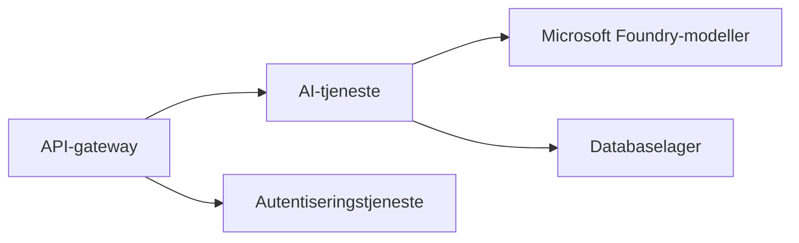
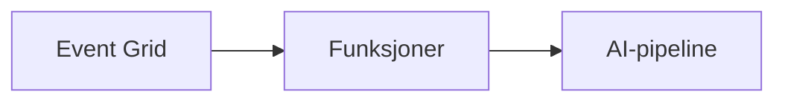

# Kapittel 8: Produksjon & Enterprise-mønstre

**📚 Kurs**: [AZD For Beginners](../../README.md) | **⏱️ Varighet**: 2-3 timer | **⭐ Vanskelighetsgrad**: Avansert

---

## Oversikt

Dette kapittelet dekker enterprise-klare distribusjonsmønstre, sikring, overvåking og kostnadsoptimalisering for produksjonsarbeidsbelastninger med AI.

> Validert mot `azd 1.23.12` i mars 2026.

## Læringsmål

Når du fullfører dette kapittelet, vil du:
- Distribuere flerregions applikasjoner med høy tilgjengelighet
- Implementere enterprise sikkerhetsmønstre
- Konfigurere omfattende overvåking
- Optimalisere kostnader i stor skala
- Sette opp CI/CD-pipelines med AZD

---

## 📚 Leksjoner

| # | Leksjon | Beskrivelse | Tid |
|---|--------|-------------|------|
| 1 | [Produksjonspraksiser for AI](production-ai-practices.md) | Enterprise distribusjonsmønstre | 90 min |

---

## 🚀 Produksjonsjekkliste

- [ ] Flerregions distribusjon for robusthet
- [ ] Administrert identitet for autentisering (ingen nøkler)
- [ ] Application Insights for overvåking
- [ ] Kostnadsbudsjetter og varsler konfigurert
- [ ] Sikkerhetsskanning aktivert
- [ ] Integrasjon med CI/CD-pipeline
- [ ] Katastrofeberedskapsplan

---

## 🏗️ Arkitekturmønstre

### Mønster 1: Mikrotjenester AI


### Mønster 2: Hendelsesdrevet AI


---

## 🔐 Sikkerhets beste praksis

```bicep
// Use managed identity
identity: {
  type: 'SystemAssigned'
}

// Private endpoints for AI services
properties: {
  publicNetworkAccess: 'Disabled'
  networkAcls: {
    defaultAction: 'Deny'
  }
}
```

---

## 💰 Kostnadsoptimalisering

| Strategi | Besparelser |
|----------|-------------|
| Skaler til null (Container Apps) | 60-80 % |
| Bruk forbruksnivåer for utvikling | 50-70 % |
| Planlagt skalering | 30-50 % |
| Reservert kapasitet | 20-40 % |

```bash
# Sett budsjettvarsler
az consumption budget create \
  --budget-name "AI-Budget" \
  --amount 500 \
  --category Cost \
  --time-grain Monthly
```

---

## 📊 Overvåkingsoppsett

```bash
# Strøm logger
azd monitor --logs

# Sjekk Application Insights
azd monitor --overview

# Se målinger
az monitor metrics list --resource <resource-id>
```

---

## 🔗 Navigasjon

| Retning | Kapittel |
|---------|----------|
| **Forrige** | [Kapittel 7: Feilsøking](../chapter-07-troubleshooting/README.md) |
| **Kurs Fullført** | [Kurs Hjem](../../README.md) |

---

## 📖 Relaterte ressurser

- [AI-agenter Veiledning](../chapter-02-ai-development/agents.md)
- [Application Insights](../chapter-06-pre-deployment/application-insights.md)
- [Multi-agent Løsninger](../chapter-05-multi-agent/README.md)
- [Mikrotjenester Eksempel](../../examples/microservices/README.md)

---

<!-- CO-OP TRANSLATOR DISCLAIMER START -->
**Ansvarsfraskrivelse**:  
Dette dokumentet er oversatt ved hjelp av AI-oversettelsestjenesten [Co-op Translator](https://github.com/Azure/co-op-translator). Selv om vi streber etter nøyaktighet, vennligst vær oppmerksom på at automatiserte oversettelser kan inneholde feil eller unøyaktigheter. Det originale dokumentet på sitt opprinnelige språk bør betraktes som den autoritative kilden. For kritisk informasjon anbefales profesjonell menneskelig oversettelse. Vi er ikke ansvarlige for eventuelle misforståelser eller feiltolkninger som oppstår fra bruk av denne oversettelsen.
<!-- CO-OP TRANSLATOR DISCLAIMER END -->