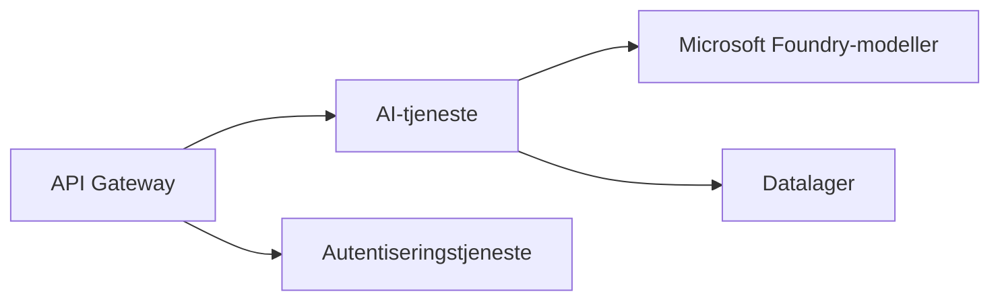

# Kapittel 8: Produksjon og bedriftsmønstre

**📚 Kurs**: [AZD For Beginners](../../README.md) | **⏱️ Varighet**: 2-3 timer | **⭐ Vanskelighetsgrad**: Avansert

---

## Oversikt

Dette kapittelet dekker bedriftsklare distribusjonsmønstre, sikkerhetsforsterkning, overvåking og kostnadsoptimalisering for produksjons-ALlaster.

## Læringsmål

Etter å ha fullført dette kapittelet vil du:
- Distribuere robuste applikasjoner på tvers av regioner
- Implementere sikkerhetsmønstre for bedriftsbruk
- Konfigurere omfattende overvåking
- Optimalisere kostnader i stor skala
- Sette opp CI/CD-pipelines med AZD

---

## 📚 Leksjoner

| # | Leksjon | Beskrivelse | Tid |
|---|--------|-------------|------|
| 1 | [Produksjonspraksis for AI](production-ai-practices.md) | Bedriftsdistribusjonsmønstre | 90 min |

---

## 🚀 Sjekkliste for produksjon

- [ ] Distribusjon i flere regioner for robusthet
- [ ] Administrert identitet for autentisering (ingen nøkler)
- [ ] Application Insights for overvåking
- [ ] Kostnadsbudsjetter og varsler konfigurert
- [ ] Sikkerhetsskanning aktivert
- [ ] Integrasjon med CI/CD-pipeline
- [ ] Katastrofegjenopprettingsplan

---

## 🏗️ Arkitekturmønstre

### Mønster 1: Mikrotjenester AI


### Mønster 2: Hendelsesdrevet AI


---

## 🔐 Beste sikkerhetspraksiser

```bicep
// Use managed identity
identity: {
  type: 'SystemAssigned'
}

// Private endpoints for AI services
properties: {
  publicNetworkAccess: 'Disabled'
  networkAcls: {
    defaultAction: 'Deny'
  }
}
```

---

## 💰 Kostnadsoptimalisering

| Strategi | Besparelse |
|----------|---------|
| Skaler til null (Container Apps) | 60-80 % |
| Bruk forbruksnivåer for dev | 50-70 % |
| Planlagt skalering | 30-50 % |
| Reservert kapasitet | 20-40 % |

```bash
# Sett budsjettvarsler
az consumption budget create \
  --budget-name "AI-Budget" \
  --amount 500 \
  --category Cost \
  --time-grain Monthly
```

---

## 📊 Oppsett for overvåking

```bash
# Strøm logger
azd monitor --logs

# Sjekk Application Insights
azd monitor

# Vis målinger
az monitor metrics list --resource <resource-id>
```

---

## 🔗 Navigasjon

| Retning | Kapittel |
|-----------|---------|
| **Forrige** | [Kapittel 7: Feilsøking](../chapter-07-troubleshooting/README.md) |
| **Kurs fullført** | [Kurs Hjem](../../README.md) |

---

## 📖 Relaterte ressurser

- [AI-agenter guide](../chapter-02-ai-development/agents.md)
- [Application Insights](../chapter-06-pre-deployment/application-insights.md)
- [Løsninger med flere agenter](../chapter-05-multi-agent/README.md)
- [Eksempel på mikrotjenester](../../examples/microservices/README.md)

---

<!-- CO-OP TRANSLATOR DISCLAIMER START -->
**Ansvarsfraskrivelse**:  
Dette dokumentet er oversatt ved hjelp av AI-oversettelsestjenesten [Co-op Translator](https://github.com/Azure/co-op-translator). Selv om vi streber etter nøyaktighet, vennligst vær oppmerksom på at automatiske oversettelser kan inneholde feil eller unøyaktigheter. Det originale dokumentet på det opprinnelige språket bør betraktes som den autoritative kilden. For kritisk informasjon anbefales profesjonell menneskelig oversettelse. Vi er ikke ansvarlige for eventuelle misforståelser eller feiltolkninger som oppstår fra bruk av denne oversettelsen.
<!-- CO-OP TRANSLATOR DISCLAIMER END -->