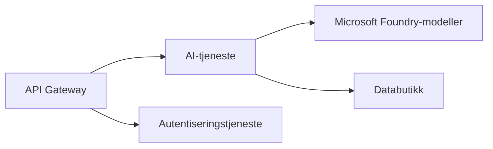

# Kapittel 8: Produksjon & Enterprise-mønstre

**📚 Kurs**: [AZD For Nybegynnere](../../README.md) | **⏱️ Varighet**: 2-3 timer | **⭐ Vanskelighetsgrad**: Avansert

---

## Oversikt

Dette kapitlet dekker enterprise-klare distribusjonsmønstre, sikkerhetsforsterking, overvåking og kostnadsoptimalisering for produksjons-AI arbeidsbelastninger.

> Validert mot `azd 1.27.1` i juli 2026.

## Læringsmål

Ved å fullføre dette kapitlet vil du:
- Distribuere fleregions robuste applikasjoner
- Implementere enterprise sikkerhetsmønstre
- Konfigurere omfattende overvåking
- Optimalisere kostnader i stor skala
- Sette opp CI/CD-pipelines med AZD

---

## 📚 Leksjoner

| # | Leksjon | Beskrivelse | Tid |
|---|--------|-------------|------|
| 1 | [Produksjons-AI praksis](production-ai-practices.md) | Enterprise distribusjonsmønstre | 90 min |

---

## 🚀 Produksjons-sjekkliste

- [ ] Fleregions distribusjon for robusthet
- [ ] Administrert identitet for autentisering (ingen nøkler)
- [ ] Application Insights for overvåking
- [ ] Kostnadsbudsjett og varsler konfigurert
- [ ] Sikkerhetsskanning aktivert
- [ ] CI/CD-pipeline integrasjon
- [ ] Katastrofegjenopprettingsplan

---

## 🏗️ Arkitekturmønstre

### Mønster 1: Mikrotjenester AI



### Mønster 2: Hendelsesdrevet AI


---

## 🔐 Beste praksis for sikkerhet

```bicep
// Use managed identity
identity: {
  type: 'SystemAssigned'
}

// Private endpoints for AI services
properties: {
  publicNetworkAccess: 'Disabled'
  networkAcls: {
    defaultAction: 'Deny'
  }
}
```

---

## 💰 Kostnadsoptimalisering

| Strategi | Besparelser |
|----------|-------------|
| Skaler til null (Container Apps) | 60-80% |
| Bruk konsum-nivåer for utvikling | 50-70% |
| Planlagt skalering | 30-50% |
| Reservert kapasitet | 20-40% |

```bash
# Sett budsjettvarsler
az consumption budget create \
  --budget-name "AI-Budget" \
  --amount 500 \
  --category Cost \
  --time-grain Monthly
```

---

## 📊 Oppsett av overvåking

```bash
# Strøm logger
azd monitor --logs

# Sjekk Application Insights
azd monitor --overview

# Se på målinger
az monitor metrics list --resource <resource-id>
```

---

## 🔗 Navigasjon

| Retning | Kapittel |
|-----------|---------|
| **Forrige** | [Kapittel 7: Feilsøking](../chapter-07-troubleshooting/README.md) |
| **Kurs fullført** | [Kurs Hjem](../../README.md) |

---

## 📖 Relaterte ressurser

- [AI-Agent Guide](../chapter-02-ai-development/agents.md)
- [Application Insights](../chapter-06-pre-deployment/application-insights.md)
- [Multi-Agent Løsninger](../chapter-05-multi-agent/README.md)
- [Mikrotjenester Eksempel](../../examples/microservices/README.md)

---

<!-- CO-OP TRANSLATOR DISCLAIMER START -->
**Ansvarsfraskrivelse**:
Dette dokumentet er oversatt ved hjelp av AI-oversettelsestjenesten [Co-op Translator](https://github.com/Azure/co-op-translator). Selv om vi streber etter nøyaktighet, vær oppmerksom på at automatiske oversettelser kan inneholde feil eller unøyaktigheter. Det opprinnelige dokumentet på originalspråket skal betraktes som den autoritative kilden. For kritisk informasjon anbefales profesjonell menneskelig oversettelse. Vi er ikke ansvarlige for eventuelle misforståelser eller feiltolkninger som oppstår ved bruk av denne oversettelsen.
<!-- CO-OP TRANSLATOR DISCLAIMER END -->