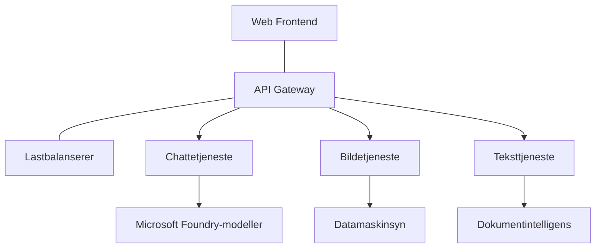

# Beste praksis for produksjons-AI-arbeidsbelastninger med AZD

**Kapittelnavigasjon:**
- **📚 Kurs Hjem**: [AZD For Beginners](../../README.md)
- **📖 Nåværende kapittel**: Kapittel 8 - Produksjon & Enterprise Mønstre
- **⬅️ Forrige kapittel**: [Kapittel 7: Feilsøking](../chapter-07-troubleshooting/debugging.md)
- **⬅️ Også relatert**: [AI Workshop Lab](ai-workshop-lab.md)
- **🎯 Kurs fullført**: [AZD For Beginners](../../README.md)

## Oversikt

Denne veiledningen gir omfattende beste praksis for distribusjon av produksjonsklare AI-arbeidsbelastninger med Azure Developer CLI (AZD). Basert på tilbakemeldinger fra Microsoft Foundry Discord-samfunnet og reelle kundedistribusjoner, adresserer disse praksisene de vanligste utfordringene i produksjons-AI-systemer.

## Nøkkelutfordringer som adresseres

Basert på resultatene fra vår community-avstemning, er dette de største utfordringene utviklere møter:

- **45 %** sliter med distribusjoner av AI med flere tjenester  
- **38 %** har problemer med legitimasjon og hemmelighetshåndtering  
- **35 %** synes produksjonsklarhet og skalerbarhet er vanskelig  
- **32 %** trenger bedre kostnadsoptimaliseringsstrategier  
- **29 %** krever forbedret overvåking og feilsøking  

## Arkitekturmønstre for produksjons-AI

### Mønster 1: Microservices AI-arkitektur

**Når å bruke**: Komplekse AI-applikasjoner med flere kapasiteter


**AZD-implementasjon**:

```yaml
# azure.yaml
name: enterprise-ai-platform
services:
  web:
    project: ./web
    host: staticwebapp
  api-gateway:
    project: ./api-gateway
    host: containerapp
  chat-service:
    project: ./services/chat
    host: containerapp
  vision-service:
    project: ./services/vision
    host: containerapp
  text-service:
    project: ./services/text
    host: containerapp
```

### Mønster 2: Hendelsesdrevet AI-behandling

**Når å bruke**: Batchbehandling, dokumentsanalyse, asynkrone arbeidsflyter

```bicep
// Event Hub for AI processing pipeline
resource eventHub 'Microsoft.EventHub/namespaces@2023-01-01-preview' = {
  name: eventHubNamespaceName
  location: location
  sku: {
    name: 'Standard'
    tier: 'Standard'
    capacity: 1
  }
}

// Service Bus for reliable message processing
resource serviceBus 'Microsoft.ServiceBus/namespaces@2022-10-01-preview' = {
  name: serviceBusNamespaceName
  location: location
  sku: {
    name: 'Premium'
    tier: 'Premium'
    capacity: 1
  }
}

// Function App for processing
resource functionApp 'Microsoft.Web/sites@2023-01-01' = {
  name: functionAppName
  location: location
  kind: 'functionapp,linux'
  properties: {
    siteConfig: {
      appSettings: [
        {
          name: 'FUNCTIONS_EXTENSION_VERSION'
          value: '~4'
        }
        {
          name: 'AZURE_OPENAI_ENDPOINT'
          value: '@Microsoft.KeyVault(VaultName=${keyVault.name};SecretName=openai-endpoint)'
        }
      ]
    }
  }
}
```

## Å tenke på AI-agentens helse

Når en tradisjonell webapp krasjer, er symptomene kjente: en side lastes ikke, en API returnerer en feil, eller en distribusjon mislykkes. AI-drevne applikasjoner kan feile på alle disse måtene—men de kan også oppføre seg på mer subtile måter som ikke gir åpenbare feilmeldinger.

Denne delen hjelper deg med å bygge en mental modell for å overvåke AI-arbeidsbelastninger slik at du vet hvor du skal se når noe ikke virker som det skal.

### Hvordan agenthelsen skiller seg fra tradisjonell apphelse

En tradisjonell app fungerer enten eller ikke. En AI-agent kan se ut til å fungere, men gi dårlige resultater. Tenk på agentens helse i to lag:

| Lag | Hva å overvåke | Hvor å se |
|-------|--------------|---------------|
| **Infrastrukturhelse** | Kjører tjenesten? Er ressurser tildelt? Er endepunkter tilgjengelige? | `azd monitor`, Azure Portal ressurshelse, container-/app-logger |
| **Atferdshelse** | Responderer agenten nøyaktig? Er svarene tidsnok? Blir modellen kalt riktig? | Application Insights-spor, modellkall latenstidsmålinger, logg for svarenes kvalitet |

Infrastrukturhelse er kjent – den er lik for enhver azd-app. Atferdshelse er det nye laget som AI-arbeidsbelastninger introduserer.

### Hvor du skal se når AI-apper oppfører seg uventet

Hvis din AI-applikasjon ikke gir forventede resultater, her er en konseptuell sjekkliste:

1. **Start med det grunnleggende.** Kjører appen? Kan den nå sine avhengigheter? Sjekk `azd monitor` og ressurshelse som for enhver app.  
2. **Sjekk modelltilkoblingen.** Kaller applikasjonen AI-modellen uten feil? Feil eller tidsavbrutte modellkall er den vanligste årsaken til AI-app-problemer og vises i appens logger.  
3. **Se på hva modellen mottok.** AI-svar avhenger av inngangen (prompten og eventuell hentet kontekst). Hvis utdata er feil, er vanligvis inngangen feil. Sjekk om applikasjonen sender riktige data til modellen.  
4. **Gjennomgå responstiden.** AI-modellkall er tregere enn typiske API-kall. Hvis appen føles treg, sjekk om modellresponsens tid har økt—dette kan indikere begrensning, kapasitetsgrenser, eller regionnivå overbelastning.  
5. **Vær oppmerksom på kostnadssignaler.** Uventede topper i tokenbruk eller API-kall kan tyde på en løkke, feilkonfigurert prompt eller overdrevne forsøk.

Du trenger ikke mestre observabilitetsverktøy umiddelbart. Viktigste budskap er at AI-applikasjoner har et ekstra atferdslag å overvåke, og azd sitt innebygde overvåkingsverktøy (`azd monitor`) gir et startpunkt for å undersøke begge lagene.

---

## Beste praksis for sikkerhet

### 1. Nulltillitssikkerhetsmodell

**Implementeringsstrategi**:
- Ingen tjeneste-til-tjeneste-kommunikasjon uten autentisering  
- Alle API-kall bruker administrerte identiteter  
- Nettverksisolasjon med private endepunkter  
- Tilgangskontroller med minste privilegium  

```bicep
// Managed Identity for each service
resource chatServiceIdentity 'Microsoft.ManagedIdentity/userAssignedIdentities@2023-01-31' = {
  name: 'chat-service-identity'
  location: location
}

// Role assignments with minimal permissions
resource openAIUserRole 'Microsoft.Authorization/roleAssignments@2022-04-01' = {
  scope: openAIAccount
  name: guid(openAIAccount.id, chatServiceIdentity.id, openAIUserRoleDefinitionId)
  properties: {
    roleDefinitionId: subscriptionResourceId('Microsoft.Authorization/roleDefinitions', '5e0bd9bd-7b93-4f28-af87-19fc36ad61bd')
    principalId: chatServiceIdentity.properties.principalId
    principalType: 'ServicePrincipal'
  }
}
```

### 2. Sikker hemmelighetshåndtering

**Key Vault-integrasjonsmønster**:

```bicep
// Key Vault with proper access policies
resource keyVault 'Microsoft.KeyVault/vaults@2023-02-01' = {
  name: keyVaultName
  location: location
  properties: {
    tenantId: tenant().tenantId
    sku: {
      family: 'A'
      name: 'premium'  // Use premium for production
    }
    enableRbacAuthorization: true  // Use RBAC instead of access policies
    enablePurgeProtection: true    // Prevent accidental deletion
    enableSoftDelete: true
    softDeleteRetentionInDays: 90
  }
}

// Store all AI service credentials
resource openAIKeySecret 'Microsoft.KeyVault/vaults/secrets@2023-02-01' = {
  parent: keyVault
  name: 'openai-api-key'
  properties: {
    value: openAIAccount.listKeys().key1
    attributes: {
      enabled: true
    }
  }
}
```

### 3. Nettverkssikkerhet

**Konfigurasjon av private endepunkter**:

```bicep
// Virtual Network for AI services
resource virtualNetwork 'Microsoft.Network/virtualNetworks@2023-04-01' = {
  name: vnetName
  location: location
  properties: {
    addressSpace: {
      addressPrefixes: ['10.0.0.0/16']
    }
    subnets: [
      {
        name: 'ai-services-subnet'
        properties: {
          addressPrefix: '10.0.1.0/24'
          privateEndpointNetworkPolicies: 'Disabled'
        }
      }
      {
        name: 'app-services-subnet'
        properties: {
          addressPrefix: '10.0.2.0/24'
          delegations: [
            {
              name: 'Microsoft.Web/serverFarms'
              properties: {
                serviceName: 'Microsoft.Web/serverFarms'
              }
            }
          ]
        }
      }
    ]
  }
}

// Private endpoints for all AI services
resource openAIPrivateEndpoint 'Microsoft.Network/privateEndpoints@2023-04-01' = {
  name: '${openAIAccountName}-pe'
  location: location
  properties: {
    subnet: {
      id: virtualNetwork.properties.subnets[0].id
    }
    privateLinkServiceConnections: [
      {
        name: 'openai-connection'
        properties: {
          privateLinkServiceId: openAIAccount.id
          groupIds: ['account']
        }
      }
    ]
  }
}
```

## Ytelse og skalering

### 1. Autoskaleringsstrategier

**Autoskalering for Container Apps**:

```bicep
resource containerApp 'Microsoft.App/containerApps@2023-05-01' = {
  name: containerAppName
  location: location
  properties: {
    configuration: {
      ingress: {
        external: true
        targetPort: 8000
        transport: 'http'
      }
    }
    template: {
      scale: {
        minReplicas: 2  // Always have 2 instances minimum
        maxReplicas: 50 // Scale up to 50 for high load
        rules: [
          {
            name: 'http-scaling'
            http: {
              metadata: {
                concurrentRequests: '20'  // Scale when >20 concurrent requests
              }
            }
          }
          {
            name: 'cpu-scaling'
            custom: {
              type: 'cpu'
              metadata: {
                type: 'Utilization'
                value: '70'  // Scale when CPU >70%
              }
            }
          }
        ]
      }
    }
  }
}
```

### 2. Caching-strategier

**Redis Cache for AI-svar**:

```bicep
// Redis Premium for production workloads
resource redisCache 'Microsoft.Cache/redis@2023-04-01' = {
  name: redisCacheName
  location: location
  properties: {
    sku: {
      name: 'Premium'
      family: 'P'
      capacity: 1
    }
    enableNonSslPort: false
    minimumTlsVersion: '1.2'
    redisConfiguration: {
      'maxmemory-policy': 'allkeys-lru'
    }
    // Enable clustering for high availability
    redisVersion: '6.0'
    shardCount: 2
  }
}

// Cache configuration in application
var cacheConnectionString = '${redisCache.properties.hostName}:6380,password=${redisCache.listKeys().primaryKey},ssl=True,abortConnect=False'
```

### 3. Lastbalansering og trafikkstyring

**Application Gateway med WAF**:

```bicep
// Application Gateway with Web Application Firewall
resource applicationGateway 'Microsoft.Network/applicationGateways@2023-04-01' = {
  name: appGatewayName
  location: location
  properties: {
    sku: {
      name: 'WAF_v2'
      tier: 'WAF_v2'
      capacity: 2
    }
    webApplicationFirewallConfiguration: {
      enabled: true
      firewallMode: 'Prevention'
      ruleSetType: 'OWASP'
      ruleSetVersion: '3.2'
    }
    // Backend pools for AI services
    backendAddressPools: [
      {
        name: 'ai-services-pool'
        properties: {
          backendAddresses: [
            {
              fqdn: '${containerApp.properties.configuration.ingress.fqdn}'
            }
          ]
        }
      }
    ]
  }
}
```

## 💰 Kostnadsoptimalisering

### 1. Riktig dimensjonering av ressurser

**Miljøspesifikke konfigurasjoner**:

```bash
# Utviklingsmiljø
azd env new development
azd env set AZURE_OPENAI_SKU "S0"
azd env set AZURE_OPENAI_CAPACITY 10
azd env set AZURE_SEARCH_SKU "basic"
azd env set CONTAINER_CPU 0.5
azd env set CONTAINER_MEMORY 1.0

# Produksjonsmiljø
azd env new production
azd env set AZURE_OPENAI_SKU "S0"
azd env set AZURE_OPENAI_CAPACITY 100
azd env set AZURE_SEARCH_SKU "standard"
azd env set CONTAINER_CPU 2.0
azd env set CONTAINER_MEMORY 4.0
```

### 2. Kostnadsovervåking og budsjetter

```bicep
// Cost management and budgets
resource budget 'Microsoft.Consumption/budgets@2023-05-01' = {
  name: 'ai-workload-budget'
  properties: {
    timePeriod: {
      startDate: '2024-01-01'
      endDate: '2024-12-31'
    }
    timeGrain: 'Monthly'
    amount: 2000  // $2000 monthly budget
    category: 'Cost'
    notifications: {
      warning: {
        enabled: true
        operator: 'GreaterThan'
        threshold: 80
        contactEmails: [
          'finance@company.com'
          'engineering@company.com'
        ]
        contactRoles: [
          'Owner'
          'Contributor'
        ]
      }
      critical: {
        enabled: true
        operator: 'GreaterThan'
        threshold: 95
        contactEmails: [
          'cto@company.com'
        ]
      }
    }
  }
}
```

### 3. Optimalisering av tokenbruk

**OpenAI kostnadsstyring**:

```typescript
// Optimalisering av tokens på applikasjonsnivå
class TokenOptimizer {
  private readonly maxTokens = 4000;
  private readonly reserveTokens = 500;
  
  optimizePrompt(userInput: string, context: string): string {
    const availableTokens = this.maxTokens - this.reserveTokens;
    const estimatedTokens = this.estimateTokens(userInput + context);
    
    if (estimatedTokens > availableTokens) {
      // Forkort kontekst, ikke brukerinput
      context = this.truncateContext(context, availableTokens - this.estimateTokens(userInput));
    }
    
    return `${context}\n\nUser: ${userInput}`;
  }
  
  private estimateTokens(text: string): number {
    // Omtrentlig estimering: 1 token ≈ 4 tegn
    return Math.ceil(text.length / 4);
  }
}
```

## Overvåking og observabilitet

### 1. Omfattende Application Insights

```bicep
// Application Insights with advanced features
resource applicationInsights 'Microsoft.Insights/components@2020-02-02' = {
  name: applicationInsightsName
  location: location
  kind: 'web'
  properties: {
    Application_Type: 'web'
    WorkspaceResourceId: logAnalyticsWorkspace.id
    SamplingPercentage: 100  // Full sampling for AI apps
    DisableIpMasking: false  // Enable for security
  }
}

// Custom metrics for AI operations
resource aiMetricAlerts 'Microsoft.Insights/metricAlerts@2018-03-01' = {
  name: 'ai-high-error-rate'
  location: 'global'
  properties: {
    description: 'Alert when AI service error rate is high'
    severity: 2
    enabled: true
    scopes: [
      applicationInsights.id
    ]
    evaluationFrequency: 'PT1M'
    windowSize: 'PT5M'
    criteria: {
      'odata.type': 'Microsoft.Azure.Monitor.SingleResourceMultipleMetricCriteria'
      allOf: [
        {
          name: 'high-error-rate'
          metricName: 'requests/failed'
          operator: 'GreaterThan'
          threshold: 10
          timeAggregation: 'Count'
        }
      ]
    }
  }
}
```

### 2. AI-spesifikk overvåking

**Egendefinerte dashbord for AI-målinger**:

```json
// Dashboard configuration for AI workloads
{
  "dashboard": {
    "name": "AI Application Monitoring",
    "tiles": [
      {
        "name": "OpenAI Request Volume",
        "query": "requests | where name contains 'openai' | summarize count() by bin(timestamp, 5m)"
      },
      {
        "name": "AI Response Latency",
        "query": "requests | where name contains 'openai' | summarize avg(duration) by bin(timestamp, 5m)"
      },
      {
        "name": "Token Usage",
        "query": "customMetrics | where name == 'openai_tokens_used' | summarize sum(value) by bin(timestamp, 1h)"
      },
      {
        "name": "Cost per Hour",
        "query": "customMetrics | where name == 'openai_cost' | summarize sum(value) by bin(timestamp, 1h)"
      }
    ]
  }
}
```

### 3. Helsekontroller og oppetidsovervåking

```bicep
// Application Insights availability tests
resource availabilityTest 'Microsoft.Insights/webtests@2022-06-15' = {
  name: 'ai-app-availability-test'
  location: location
  tags: {
    'hidden-link:${applicationInsights.id}': 'Resource'
  }
  properties: {
    SyntheticMonitorId: 'ai-app-availability-test'
    Name: 'AI Application Availability Test'
    Description: 'Tests AI application endpoints'
    Enabled: true
    Frequency: 300  // 5 minutes
    Timeout: 120    // 2 minutes
    Kind: 'ping'
    Locations: [
      {
        Id: 'us-east-2-azr'
      }
      {
        Id: 'us-west-2-azr'
      }
    ]
    Configuration: {
      WebTest: '''
        <WebTest Name="AI Health Check" 
                 Id="8d2de8d2-a2b0-4c2e-9a0d-8f9c9a0b8c8d" 
                 Enabled="True" 
                 CssProjectStructure="" 
                 CssIteration="" 
                 Timeout="120" 
                 WorkItemIds="" 
                 xmlns="http://microsoft.com/schemas/VisualStudio/TeamTest/2010" 
                 Description="" 
                 CredentialUserName="" 
                 CredentialPassword="" 
                 PreAuthenticate="True" 
                 Proxy="default" 
                 StopOnError="False" 
                 RecordedResultFile="" 
                 ResultsLocale="">
          <Items>
            <Request Method="GET" 
                     Guid="a5f10126-e4cd-570d-961c-cea43999a200" 
                     Version="1.1" 
                     Url="${webApp.properties.defaultHostName}/health" 
                     ThinkTime="0" 
                     Timeout="120" 
                     ParseDependentRequests="True" 
                     FollowRedirects="True" 
                     RecordResult="True" 
                     Cache="False" 
                     ResponseTimeGoal="0" 
                     Encoding="utf-8" 
                     ExpectedHttpStatusCode="200" 
                     ExpectedResponseUrl="" 
                     ReportingName="" 
                     IgnoreHttpStatusCode="False" />
          </Items>
        </WebTest>
      '''
    }
  }
}
```

## Katastrofegjenoppretting og høy tilgjengelighet

### 1. Distribusjon på tvers av regioner

```yaml
# azure.yaml - Multi-region configuration
name: ai-app-multiregion
services:
  api-primary:
    project: ./api
    host: containerapp
    env:
      - AZURE_REGION=eastus
  api-secondary:
    project: ./api
    host: containerapp
    env:
      - AZURE_REGION=westus2
```

```bicep
// Traffic Manager for global load balancing
resource trafficManager 'Microsoft.Network/trafficManagerProfiles@2022-04-01' = {
  name: trafficManagerProfileName
  location: 'global'
  properties: {
    profileStatus: 'Enabled'
    trafficRoutingMethod: 'Priority'
    dnsConfig: {
      relativeName: trafficManagerProfileName
      ttl: 30
    }
    monitorConfig: {
      protocol: 'HTTPS'
      port: 443
      path: '/health'
      intervalInSeconds: 30
      toleratedNumberOfFailures: 3
      timeoutInSeconds: 10
    }
    endpoints: [
      {
        name: 'primary-endpoint'
        type: 'Microsoft.Network/trafficManagerProfiles/azureEndpoints'
        properties: {
          targetResourceId: primaryAppService.id
          endpointStatus: 'Enabled'
          priority: 1
        }
      }
      {
        name: 'secondary-endpoint'
        type: 'Microsoft.Network/trafficManagerProfiles/azureEndpoints'
        properties: {
          targetResourceId: secondaryAppService.id
          endpointStatus: 'Enabled'
          priority: 2
        }
      }
    ]
  }
}
```

### 2. Sikkerhetskopiering og gjenoppretting av data

```bicep
// Backup configuration for critical data
resource backupVault 'Microsoft.DataProtection/backupVaults@2023-05-01' = {
  name: backupVaultName
  location: location
  identity: {
    type: 'SystemAssigned'
  }
  properties: {
    storageSettings: [
      {
        datastoreType: 'VaultStore'
        type: 'LocallyRedundant'
      }
    ]
  }
}

// Backup policy for AI models and data
resource backupPolicy 'Microsoft.DataProtection/backupVaults/backupPolicies@2023-05-01' = {
  parent: backupVault
  name: 'ai-data-backup-policy'
  properties: {
    policyRules: [
      {
        backupParameters: {
          backupType: 'Full'
          objectType: 'AzureBackupParams'
        }
        trigger: {
          schedule: {
            repeatingTimeIntervals: [
              'R/2024-01-01T02:00:00+00:00/P1D'  // Daily at 2 AM
            ]
          }
          objectType: 'ScheduleBasedTriggerContext'
        }
        dataStore: {
          datastoreType: 'VaultStore'
          objectType: 'DataStoreInfoBase'
        }
        name: 'BackupDaily'
        objectType: 'AzureBackupRule'
      }
    ]
  }
}
```

## DevOps- og CI/CD-integrasjon

### 1. GitHub Actions-arbeidsflyt

```yaml
# .github/workflows/deploy-ai-app.yml
name: Deploy AI Application

on:
  push:
    branches: [main]
  pull_request:
    branches: [main]

jobs:
  test:
    runs-on: ubuntu-latest
    steps:
      - uses: actions/checkout@v4
      
      - name: Setup Python
        uses: actions/setup-python@v4
        with:
          python-version: '3.11'
          
      - name: Install dependencies
        run: |
          pip install -r requirements.txt
          pip install pytest
          
      - name: Run tests
        run: pytest tests/
        
      - name: AI Safety Tests
        run: |
          python scripts/test_ai_safety.py
          python scripts/validate_prompts.py

  deploy-staging:
    needs: test
    if: github.event_name == 'pull_request'
    runs-on: ubuntu-latest
    steps:
      - uses: actions/checkout@v4
      
      - name: Setup AZD
        uses: Azure/setup-azd@v2
        
      - name: Login to Azure
        uses: azure/login@v1
        with:
          creds: ${{ secrets.AZURE_CREDENTIALS }}
          
      - name: Deploy to Staging
        run: |
          azd env select staging
          azd deploy

  deploy-production:
    needs: test
    if: github.ref == 'refs/heads/main'
    runs-on: ubuntu-latest
    steps:
      - uses: actions/checkout@v4
      
      - name: Setup AZD
        uses: Azure/setup-azd@v2
        
      - name: Login to Azure
        uses: azure/login@v1
        with:
          creds: ${{ secrets.AZURE_CREDENTIALS }}
          
      - name: Deploy to Production
        run: |
          azd env select production
          azd deploy
          
      - name: Run Production Health Checks
        run: |
          python scripts/health_check.py --env production
```

### 2. Infrastrukturvalidering

```bash
# scripts/validate_infrastructure.sh
#!/bin/bash

echo "Validating AI infrastructure deployment..."

# Sjekk om alle nødvendige tjenester kjører
services=("openai" "search" "storage" "keyvault")
for service in "${services[@]}"; do
    echo "Checking $service..."
    if ! az resource list --resource-type "Microsoft.CognitiveServices/accounts" --query "[?contains(name, '$service')]" -o tsv; then
        echo "ERROR: $service not found"
        exit 1
    fi
done

# Valider OpenAI-modellutrullinger
echo "Validating OpenAI model deployments..."
models=$(az cognitiveservices account deployment list --name $AZURE_OPENAI_NAME --resource-group $AZURE_RESOURCE_GROUP --query "[].name" -o tsv)
if [[ ! $models == *"gpt-4.1-mini"* ]]; then
  echo "ERROR: Required model gpt-4.1-mini not deployed"
    exit 1
fi

# Test AI-tjenestetilkobling
echo "Testing AI service connectivity..."
python scripts/test_connectivity.py

echo "Infrastructure validation completed successfully!"
```

## Sjekkliste for produksjonsklargjøring

### Sikkerhet ✅
- [ ] Alle tjenester bruker administrerte identiteter  
- [ ] Hemmeligheter lagres i Key Vault  
- [ ] Private endepunkter konfigurert  
- [ ] Nettverkssikkerhetsgrupper implementert  
- [ ] RBAC med minste privilegium  
- [ ] WAF aktivert på offentlige endepunkter  

### Ytelse ✅
- [ ] Autoskalering konfigurert  
- [ ] Caching implementert  
- [ ] Lastbalansering satt opp  
- [ ] CDN for statisk innhold  
- [ ] Databaseforbindelsespooling  
- [ ] Optimalisering av tokenbruk  

### Overvåking ✅
- [ ] Application Insights konfigurert  
- [ ] Egne målinger definert  
- [ ] Varslingsregler satt opp  
- [ ] Dashbord opprettet  
- [ ] Helsekontroller implementert  
- [ ] Retensjonspolicyer for logger  

### Pålitelighet ✅
- [ ] Distribusjon i flere regioner  
- [ ] Sikkerhetskopierings- og gjenopprettingsplan  
- [ ] Kretsbrytere implementert  
- [ ] Retningslinjer for retry konfigurert  
- [ ] Grasiøs degradering  
- [ ] Helsekontrollendepunkter  

### Kostnadsstyring ✅
- [ ] Budsjettvarsler konfigurert  
- [ ] Riktig dimensjonering av ressurser  
- [ ] Rabatt for utvikling/test anvendt  
- [ ] Reserverte forekomster kjøpt  
- [ ] Dashbord for kostnadsovervåking  
- [ ] Regelmessige kostnadsrevisjoner  

### Overholdelse ✅
- [ ] Krav til dataopphold møtt  
- [ ] Revideringslogging aktivert  
- [ ] Overholdelsespolicyer anvendt  
- [ ] Sikkerhetsbaselines implementert  
- [ ] Regelmessige sikkerhetsvurderinger  
- [ ] Innsatsplan for hendelser  

## Ytelsesbenchmarks

### Typiske produksjonsmålinger

| Måling | Mål | Overvåking |
|--------|--------|------------|
| **Responstid** | < 2 sekunder | Application Insights |
| **Tilgjengelighet** | 99,9 % | Oppetidsovervåking |
| **Feilrate** | < 0,1 % | Applikasjonslogger |
| **Tokenbruk** | < $500/måned | Kostnadsstyring |
| **Samtidige brukere** | 1000+ | Belastningstesting |
| **Gjenopprettingstid** | < 1 time | Katastrofegjenopprettingstester |

### Belastningstesting

```bash
# Lastetesting skript for AI-applikasjoner
python scripts/load_test.py \
  --endpoint https://your-ai-app.azurewebsites.net \
  --concurrent-users 100 \
  --duration 300 \
  --ramp-up 60
```

## 🤝 Fellesskapets beste praksis

Basert på tilbakemeldinger fra Microsoft Foundry Discord-samfunnet:

### Topp anbefalinger fra fellesskapet:

1. **Start smått, skaler gradvis**: Begynn med grunnleggende SKUer og skaler opp basert på faktisk bruk  
2. **Overvåk alt**: Sett opp omfattende overvåking fra dag én  
3. **Automatiser sikkerhet**: Bruk infrastruktur som kode for konsekvent sikkerhet  
4. **Test grundig**: Inkluder AI-spesifikk testing i pipeline  
5. **Planlegg for kostnader**: Overvåk tokenbruk og sett opp budsjettvarsler tidlig  

### Vanlige fallgruver å unngå:

- ❌ Hardkoding av API-nøkler i kode  
- ❌ Ikke sette opp korrekt overvåking  
- ❌ Ignorere kostnadsoptimalisering  
- ❌ Ikke teste feilscenarier  
- ❌ Distribuere uten helsekontroller  

## AZD AI CLI-kommandoer og utvidelser

AZD inkluderer et voksende sett AI-spesifikke kommandoer og utvidelser som effektiviserer produksjons-AI-arbeidsflyter. Disse verktøyene brobygger mellom lokal utvikling og produksjonsdistribusjon for AI-arbeidsbelastninger.

### AZD-utvidelser for AI

AZD bruker et utvidelsessystem for å legge til AI-spesifikke kapabiliteter. Installer og administrer utvidelser med:

```bash
# List opp alle tilgjengelige utvidelser (inkludert AI)
azd extension list

# Inspiser detaljer for installerte utvidelser
azd extension show azure.ai.agents

# Installer Foundry agents-utvidelsen
azd extension install azure.ai.agents

# Installer utvidelsen for finjustering
azd extension install azure.ai.finetune

# Installer utvidelsen for tilpassede modeller
azd extension install azure.ai.models

# Oppgrader alle installerte utvidelser
azd extension upgrade --all
```

**Tilgjengelige AI-utvidelser:**

| Utvidelse | Formål | Status |
|-----------|---------|--------|
| `azure.ai.agents` | Administrasjon av Foundry Agent Service | Forhåndsvisning |
| `azure.ai.finetune` | Finjustering av Foundry-modeller | Forhåndsvisning |
| `azure.ai.models` | Foundry egendefinerte modeller | Forhåndsvisning |
| `azure.coding-agent` | Konfigurasjon av kodeagent | Tilgjengelig |

### Initialisere agentprosjekter med `azd ai agent init`

Kommandoen `azd ai agent init` oppretter et produksjonsklart AI-agentprosjekt integrert med Microsoft Foundry Agent Service:

```bash
# Initialiser et nytt agentprosjekt fra en agentmanifest
azd ai agent init -m <manifest-path-or-uri>

# Initialiser og målrett et spesifikt Foundry-prosjekt
azd ai agent init -m agent-manifest.yaml --project-id <foundry-project-id>

# Initialiser med en egendefinert kildekatalog
azd ai agent init -m agent-manifest.yaml --src ./agents/my-agent

# Målrett Container Apps som vert
azd ai agent init -m agent-manifest.yaml --host containerapp
```

**Viktige flagg:**

| Flagg | Beskrivelse |
|------|-------------|
| `-m, --manifest` | Sti eller URI til en agentmanifest som skal legges til prosjektet ditt |
| `-p, --project-id` | Eksisterende Microsoft Foundry prosjekt-ID for ditt azd-miljø |
| `-s, --src` | Katalog for nedlasting av agentdefinisjonen (standard `src/<agent-id>`) |
| `--host` | Overstyr standard vert (f.eks. `containerapp`) |
| `-e, --environment` | Azd-miljøet som skal brukes |

**Produksjonstips**: Bruk `--project-id` for å koble direkte til et eksisterende Foundry-prosjekt, slik at agentkoden og skyressursene holdes sammen fra start.

### Model Context Protocol (MCP) med `azd mcp`

AZD inkluderer innebygd støtte for MCP-server (Alpha), som gjør det mulig for AI-agenter og verktøy å samhandle med Azure-ressursene dine gjennom en standardisert protokoll:

```bash
# Start MCP-serveren for prosjektet ditt
azd mcp start

# Gjennomgå gjeldende Copilot-samtykkeregler for verktøykjøring
azd copilot consent list
```

MCP-serveren eksponerer din azd-prosjektkontekst—miljøer, tjenester og Azure-ressurser—til AI-drevne utviklingsverktøy. Dette muliggjør:

- **AI-assistert distribusjon**: La kodeagenter spørre om prosjektstatus og trigge distribusjoner  
- **Ressursoppdagelse**: AI-verktøy kan oppdage hvilke Azure-ressurser prosjektet bruker  
- **Miljøhåndtering**: Agenter kan bytte mellom dev/staging/produksjonsmiljøer  

### Infrastrukturgenerering med `azd infra generate`

For produksjons-AI-arbeidsbelastninger kan du generere og tilpasse Infrastruktur som kode i stedet for å stole på automatisk provisjonering:

```bash
# Generer Bicep/Terraform-filer fra prosjektdefinisjonen din
azd infra generate
```

Dette skriver IaC til disk slik at du kan:  
- Gjennomgå og revidere infrastruktur før du distribuerer  
- Legge til egendefinerte sikkerhetspolicyer (nettverksregler, private endepunkter)  
- Integrere med eksisterende IaC-gjennomgangsprosesser  
- Versjonskontrollere infrastruktursendringer separat fra applikasjonskode  

### Produksjon-livssyklus-kroker

AZD-kroker lar deg injisere egendefinert logikk i alle stadier av distribusjonslivssyklusen—kritisk for produksjons-AI-arbeidsflyter:

```yaml
# azure.yaml - Production hooks example
name: ai-production-app
hooks:
  preprovision:
    shell: sh
    run: scripts/validate-quotas.sh    # Check AI model quota before provisioning
  postprovision:
    shell: sh
    run: scripts/configure-networking.sh  # Set up private endpoints
  predeploy:
    shell: sh
    run: scripts/run-ai-safety-tests.sh  # Run prompt safety checks
  postdeploy:
    shell: sh
    run: scripts/smoke-test.sh           # Verify agent responses post-deploy
services:
  agent-api:
    project: ./src/agent
    host: containerapp
    hooks:
      predeploy:
        shell: sh
        run: scripts/validate-model-access.sh  # Per-service hook
```

```bash
# Kjør en spesifikk krok manuelt under utvikling
azd hooks run predeploy
```

**Anbefalte produksjonskroker for AI-arbeidsbelastninger:**

| Krok | Brukstilfelle |
|------|----------|
| `preprovision` | Valider abonnementskvoter for AI-modellkapasitet |
| `postprovision` | Konfigurer private endepunkter, distribuer modellvekter |
| `predeploy` | Kjør AI-sikkerhetstester, valider prompt-maler |
| `postdeploy` | Røyktester agentrespons, verifiser modelltilkobling |

### CI/CD-pipelinekonfigurasjon

Bruk `azd pipeline config` for å koble prosjektet ditt til GitHub Actions eller Azure Pipelines med sikker Azure-autentisering:

```bash
# Konfigurer CI/CD-pipeline (interaktiv)
azd pipeline config

# Konfigurer med en spesifikk leverandør
azd pipeline config --provider github
```

Denne kommandoen:  
- Oppretter en tjenesteprinsipp med minste privilegium  
- Konfigurerer fødererte legitimasjoner (ingen lagrede hemmeligheter)  
- Genererer eller oppdaterer pipeline-definisjonsfilen  
- Setter nødvendige miljøvariabler i CI/CD-systemet ditt  

**Produksjonsarbeidsflyt med pipeline-konfigurasjon:**

```bash
# 1. Sett opp produksjonsmiljø
azd env new production
azd env set AZURE_OPENAI_CAPACITY 100

# 2. Konfigurer pipelinen
azd pipeline config --provider github

# 3. Pipeline kjører azd deploy ved hver push til main
```

### Legge til komponenter med `azd add`

Legg trinnvis til Azure-tjenester til et eksisterende prosjekt:

```bash
# Legg til en ny tjenestekomponent interaktivt
azd add
```

Dette er spesielt nyttig for å utvide produksjons-AI-applikasjoner—f.eks. å legge til en vektorsøketjeneste, et nytt agentendepunkt eller en overvåkingskomponent til en eksisterende distribusjon.

## Ytterligere ressurser
- **Azure Well-Architected Framework**: [Veiledning for AI arbeidsbelastninger](https://learn.microsoft.com/azure/well-architected/ai/)
- **Microsoft Foundry Dokumentasjon**: [Offisiell dokumentasjon](https://learn.microsoft.com/azure/ai-studio/)
- **Community-maler**: [Azure Samples](https://github.com/Azure-Samples)
- **Discord Community**: [#Azure-kanal](https://discord.gg/microsoft-azure)
- **Agentferdigheter for Azure**: [microsoft/github-copilot-for-azure på skills.sh](https://skills.sh/microsoft/github-copilot-for-azure) - 37 åpne agentferdigheter for Azure AI, Foundry, distribusjon, kostnadsoptimalisering og diagnostikk. Installer i redigeringsprogrammet ditt:
  ```bash
  npx skills add microsoft/github-copilot-for-azure
  ```

---

**Kapittelnavigasjon:**
- **📚 Kurs Hjem**: [AZD For Beginners](../../README.md)
- **📖 Nåværende Kapittel**: Kapittel 8 - Produksjon & Enterprise Mønstre
- **⬅️ Forrige Kapittel**: [Kapittel 7: Feilsøking](../chapter-07-troubleshooting/debugging.md)
- **⬅️ Også Relatert**: [AI Workshop Lab](ai-workshop-lab.md)
- **� Kurs fullført**: [AZD For Beginners](../../README.md)

**Husk**: Produksjons-AI arbeidsbelastninger krever nøye planlegging, overvåking og kontinuerlig optimalisering. Start med disse mønstrene og tilpass dem til dine spesifikke krav.

---

<!-- CO-OP TRANSLATOR DISCLAIMER START -->
**Ansvarsfraskrivelse**:
Dette dokumentet er oversatt ved hjelp av AI-oversettelsestjenesten [Co-op Translator](https://github.com/Azure/co-op-translator). Selv om vi streber etter nøyaktighet, vær oppmerksom på at automatiske oversettelser kan inneholde feil eller unøyaktigheter. Det originale dokumentet på originalspråket bør betraktes som den autoritative kilden. For kritisk informasjon anbefales profesjonell menneskelig oversettelse. Vi er ikke ansvarlige for eventuelle misforståelser eller feiltolkninger som oppstår ved bruk av denne oversettelsen.
<!-- CO-OP TRANSLATOR DISCLAIMER END -->