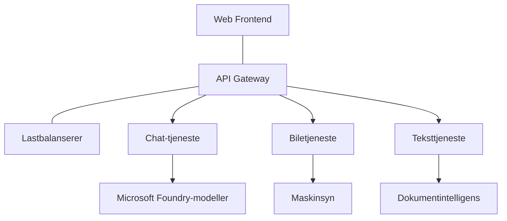

# Beste praksis for produksjons-AI arbeidsbelastninger med AZD

**Kapittelnavigasjon:**
- **📚 Kurs Hjem**: [AZD For Beginners](../../README.md)
- **📖 Nåværende Kapittel**: Kapittel 8 - Produksjons- og Enterprise-mønstre
- **⬅️ Forrige Kapittel**: [Kapittel 7: Feilsøking](../chapter-07-troubleshooting/debugging.md)
- **⬅️ Også Relatert**: [AI Workshop Lab](ai-workshop-lab.md)
- **🎯 Kurs fullført**: [AZD For Beginners](../../README.md)

## Oversikt

Denne guiden gir omfattende beste praksis for å distribuere produksjonsklare AI-arbeidsbelastninger ved bruk av Azure Developer CLI (AZD). Basert på tilbakemeldinger fra Microsoft Foundry Discord-fellesskapet og virkelige kundedistribusjoner, adresserer disse praksisene de vanligste utfordringene i produksjons-AI-systemer.

## Viktige utfordringer som adresseres

Basert på resultatene fra vår fellesskapsundersøkelse, er dette de største utfordringene utviklere står overfor:

- **45 %** har problemer med AI-distribusjoner med flere tjenester
- **38 %** har utfordringer med legitimasjon og hemmelighetshåndtering
- **35 %** synes produksjonsklarhet og skalering er vanskelig
- **32 %** trenger bedre kostnadsoptimaliseringsstrategier
- **29 %** krever forbedret overvåkning og feilsøking

## Arkitekturmønstre for produksjons-AI

### Mønster 1: Mikrotjeneste-AI-arkitektur

**Når å bruke**: Komplekse AI-applikasjoner med flere kapabiliteter



**AZD-implementering**:

```yaml
# azure.yaml
name: enterprise-ai-platform
services:
  web:
    project: ./web
    host: staticwebapp
  api-gateway:
    project: ./api-gateway
    host: containerapp
  chat-service:
    project: ./services/chat
    host: containerapp
  vision-service:
    project: ./services/vision
    host: containerapp
  text-service:
    project: ./services/text
    host: containerapp
```

### Mønster 2: Hendelsesdrevet AI-prosessering

**Når å bruke**: Batch-behandling, dokumentanalyse, asynkrone arbeidsflyter

```bicep
// Event Hub for AI processing pipeline
resource eventHub 'Microsoft.EventHub/namespaces@2023-01-01-preview' = {
  name: eventHubNamespaceName
  location: location
  sku: {
    name: 'Standard'
    tier: 'Standard'
    capacity: 1
  }
}

// Service Bus for reliable message processing
resource serviceBus 'Microsoft.ServiceBus/namespaces@2022-10-01-preview' = {
  name: serviceBusNamespaceName
  location: location
  sku: {
    name: 'Premium'
    tier: 'Premium'
    capacity: 1
  }
}

// Function App for processing
resource functionApp 'Microsoft.Web/sites@2023-01-01' = {
  name: functionAppName
  location: location
  kind: 'functionapp,linux'
  properties: {
    siteConfig: {
      appSettings: [
        {
          name: 'FUNCTIONS_EXTENSION_VERSION'
          value: '~4'
        }
        {
          name: 'AZURE_OPENAI_ENDPOINT'
          value: '@Microsoft.KeyVault(VaultName=${keyVault.name};SecretName=openai-endpoint)'
        }
      ]
    }
  }
}
```

## Tenke på AI-agenthelse

Når en tradisjonell webapp feiler, er symptomene kjente: en side lastes ikke, en API returnerer en feil, eller en distribusjon feiler. AI-drevne applikasjoner kan feile på alle de samme måtene — men de kan også oppføre seg på subtile måter uten å gi åpenbare feilmeldinger.

Dette avsnittet hjelper deg med å bygge en mental modell for overvåkning av AI-arbeidsbelastninger slik at du vet hvor du skal se når noe virker galt.

### Hvordan agenthelse skiller seg fra tradisjonell app-helse

En tradisjonell app fungerer enten eller ikke. En AI-agent kan se ut som den fungerer, men produsere dårlige resultater. Tenk på agenthelse i to lag:

| Lag | Hva du skal overvåke | Hvor du skal se |
|-------|---------------------|-----------------|
| **Infrastrukturshelse** | Kjører tjenesten? Er ressurser provisionert? Er endepunkter tilgjengelige? | `azd monitor`, Azure Portal ressurshelse, container-/applogg |
| **Atferdshelse** | Svarer agenten nøyaktig? Er responsene tidsriktige? Blir modellen kalt korrekt? | Application Insights-spor, målinger for modellkall-latens, logger for responskvalitet |

Infrastrukturshelse er kjent—det er det samme for enhver azd-app. Atferdshelse er det nye laget som AI-arbeidsbelastninger introduserer.

### Hvor du skal se når AI-apper ikke oppfører seg som forventet

Hvis AI-applikasjonen din ikke gir de resultatene du forventer, her er en konseptuell sjekkliste:

1. **Start med grunnleggende.** Kjører appen? Kan den nå sine avhengigheter? Sjekk `azd monitor` og ressurshelse akkurat som for alle apper.
2. **Sjekk modelltilkoblingen.** Kaller applikasjonen din AI-modellen vellykket? Mislykkede eller tidssperrede modellkall er den vanligste årsaken til AI-app-problemer og vil vises i applikasjonsloggene dine.
3. **Se på hva modellen mottok.** AI-responser avhenger av input (prompten og eventuell hentet kontekst). Hvis output er feil, er vanligvis input feil. Sjekk om applikasjonen sender riktig data til modellen.
4. **Vurder responstid.** AI-modellkall er tregere enn typiske API-kall. Hvis appen føles treg, sjekk om modellens responstid har økt—dette kan indikere throttling, kapasitetsgrenser eller regionnivå-kongestjon.
5. **Vær oppmerksom på kostnadssignaler.** Uventede hopp i tokenbruk eller API-kall kan indikere en sløyfe, feilkonfigurert prompt eller overdreven retry.

Du trenger ikke mestre observabilitetsverktøy med en gang. Viktigste poeng er at AI-applikasjoner har et ekstra atferdslag å overvåke, og azd sin innebygde overvåkning (`azd monitor`) gir deg et utgangspunkt for å undersøke begge lagene.

---

## Beste praksis for sikkerhet

### 1. Null-tillit sikkerhetsmodell

**Implementeringsstrategi**:
- Ingen tjeneste-til-tjeneste-kommunikasjon uten autentisering
- Alle API-kall bruker administrerte identiteter
- Nettverksisolasjon med private endepunkter
- Tilgangskontroll med minste privilegium

```bicep
// Managed Identity for each service
resource chatServiceIdentity 'Microsoft.ManagedIdentity/userAssignedIdentities@2023-01-31' = {
  name: 'chat-service-identity'
  location: location
}

// Role assignments with minimal permissions
resource openAIUserRole 'Microsoft.Authorization/roleAssignments@2022-04-01' = {
  scope: openAIAccount
  name: guid(openAIAccount.id, chatServiceIdentity.id, openAIUserRoleDefinitionId)
  properties: {
    roleDefinitionId: subscriptionResourceId('Microsoft.Authorization/roleDefinitions', '5e0bd9bd-7b93-4f28-af87-19fc36ad61bd')
    principalId: chatServiceIdentity.properties.principalId
    principalType: 'ServicePrincipal'
  }
}
```

### 2. Sikker hemmelighetshåndtering

**Key Vault-integrasjonsmønster**:

```bicep
// Key Vault with proper access policies
resource keyVault 'Microsoft.KeyVault/vaults@2023-02-01' = {
  name: keyVaultName
  location: location
  properties: {
    tenantId: tenant().tenantId
    sku: {
      family: 'A'
      name: 'premium'  // Use premium for production
    }
    enableRbacAuthorization: true  // Use RBAC instead of access policies
    enablePurgeProtection: true    // Prevent accidental deletion
    enableSoftDelete: true
    softDeleteRetentionInDays: 90
  }
}

// Store all AI service credentials
resource openAIKeySecret 'Microsoft.KeyVault/vaults/secrets@2023-02-01' = {
  parent: keyVault
  name: 'openai-api-key'
  properties: {
    value: openAIAccount.listKeys().key1
    attributes: {
      enabled: true
    }
  }
}
```

### 3. Nettverkssikkerhet

**Konfigurasjon av private endepunkter**:

```bicep
// Virtual Network for AI services
resource virtualNetwork 'Microsoft.Network/virtualNetworks@2023-04-01' = {
  name: vnetName
  location: location
  properties: {
    addressSpace: {
      addressPrefixes: ['10.0.0.0/16']
    }
    subnets: [
      {
        name: 'ai-services-subnet'
        properties: {
          addressPrefix: '10.0.1.0/24'
          privateEndpointNetworkPolicies: 'Disabled'
        }
      }
      {
        name: 'app-services-subnet'
        properties: {
          addressPrefix: '10.0.2.0/24'
          delegations: [
            {
              name: 'Microsoft.Web/serverFarms'
              properties: {
                serviceName: 'Microsoft.Web/serverFarms'
              }
            }
          ]
        }
      }
    ]
  }
}

// Private endpoints for all AI services
resource openAIPrivateEndpoint 'Microsoft.Network/privateEndpoints@2023-04-01' = {
  name: '${openAIAccountName}-pe'
  location: location
  properties: {
    subnet: {
      id: virtualNetwork.properties.subnets[0].id
    }
    privateLinkServiceConnections: [
      {
        name: 'openai-connection'
        properties: {
          privateLinkServiceId: openAIAccount.id
          groupIds: ['account']
        }
      }
    ]
  }
}
```

## Ytelse og skalering

### 1. Auto-skaleringsstrategier

**Auto-skalerings for Container Apps**:

```bicep
resource containerApp 'Microsoft.App/containerApps@2023-05-01' = {
  name: containerAppName
  location: location
  properties: {
    configuration: {
      ingress: {
        external: true
        targetPort: 8000
        transport: 'http'
      }
    }
    template: {
      scale: {
        minReplicas: 2  // Always have 2 instances minimum
        maxReplicas: 50 // Scale up to 50 for high load
        rules: [
          {
            name: 'http-scaling'
            http: {
              metadata: {
                concurrentRequests: '20'  // Scale when >20 concurrent requests
              }
            }
          }
          {
            name: 'cpu-scaling'
            custom: {
              type: 'cpu'
              metadata: {
                type: 'Utilization'
                value: '70'  // Scale when CPU >70%
              }
            }
          }
        ]
      }
    }
  }
}
```

### 2. Caching-strategier

**Redis Cache for AI-responser**:

```bicep
// Redis Premium for production workloads
resource redisCache 'Microsoft.Cache/redis@2023-04-01' = {
  name: redisCacheName
  location: location
  properties: {
    sku: {
      name: 'Premium'
      family: 'P'
      capacity: 1
    }
    enableNonSslPort: false
    minimumTlsVersion: '1.2'
    redisConfiguration: {
      'maxmemory-policy': 'allkeys-lru'
    }
    // Enable clustering for high availability
    redisVersion: '6.0'
    shardCount: 2
  }
}

// Cache configuration in application
var cacheConnectionString = '${redisCache.properties.hostName}:6380,password=${redisCache.listKeys().primaryKey},ssl=True,abortConnect=False'
```

### 3. Lastbalansering og trafikkhåndtering

**Application Gateway med WAF**:

```bicep
// Application Gateway with Web Application Firewall
resource applicationGateway 'Microsoft.Network/applicationGateways@2023-04-01' = {
  name: appGatewayName
  location: location
  properties: {
    sku: {
      name: 'WAF_v2'
      tier: 'WAF_v2'
      capacity: 2
    }
    webApplicationFirewallConfiguration: {
      enabled: true
      firewallMode: 'Prevention'
      ruleSetType: 'OWASP'
      ruleSetVersion: '3.2'
    }
    // Backend pools for AI services
    backendAddressPools: [
      {
        name: 'ai-services-pool'
        properties: {
          backendAddresses: [
            {
              fqdn: '${containerApp.properties.configuration.ingress.fqdn}'
            }
          ]
        }
      }
    ]
  }
}
```

## 💰 Kostnadsoptimalisering

### 1. Riktig størrelse på ressurser

**Miljøspesifikke konfigurasjoner**:

```bash
# Utviklingsmiljø
azd env new development
azd env set AZURE_OPENAI_SKU "S0"
azd env set AZURE_OPENAI_CAPACITY 10
azd env set AZURE_SEARCH_SKU "basic"
azd env set CONTAINER_CPU 0.5
azd env set CONTAINER_MEMORY 1.0

# Produksjonsmiljø
azd env new production
azd env set AZURE_OPENAI_SKU "S0"
azd env set AZURE_OPENAI_CAPACITY 100
azd env set AZURE_SEARCH_SKU "standard"
azd env set CONTAINER_CPU 2.0
azd env set CONTAINER_MEMORY 4.0
```

### 2. Kostnadsmonitorering og budsjetter

```bicep
// Cost management and budgets
resource budget 'Microsoft.Consumption/budgets@2023-05-01' = {
  name: 'ai-workload-budget'
  properties: {
    timePeriod: {
      startDate: '2024-01-01'
      endDate: '2024-12-31'
    }
    timeGrain: 'Monthly'
    amount: 2000  // $2000 monthly budget
    category: 'Cost'
    notifications: {
      warning: {
        enabled: true
        operator: 'GreaterThan'
        threshold: 80
        contactEmails: [
          'finance@company.com'
          'engineering@company.com'
        ]
        contactRoles: [
          'Owner'
          'Contributor'
        ]
      }
      critical: {
        enabled: true
        operator: 'GreaterThan'
        threshold: 95
        contactEmails: [
          'cto@company.com'
        ]
      }
    }
  }
}
```

### 3. Token-bruksoptimalisering

**OpenAI-kostnadsstyring**:

```typescript
// Applikasjonsnivå tokenoptimalisering
class TokenOptimizer {
  private readonly maxTokens = 4000;
  private readonly reserveTokens = 500;
  
  optimizePrompt(userInput: string, context: string): string {
    const availableTokens = this.maxTokens - this.reserveTokens;
    const estimatedTokens = this.estimateTokens(userInput + context);
    
    if (estimatedTokens > availableTokens) {
      // Forkort kontekst, ikke brukerinput
      context = this.truncateContext(context, availableTokens - this.estimateTokens(userInput));
    }
    
    return `${context}\n\nUser: ${userInput}`;
  }
  
  private estimateTokens(text: string): number {
    // Omtrentlig anslag: 1 token ≈ 4 tegn
    return Math.ceil(text.length / 4);
  }
}
```

## Overvåkning og observabilitet

### 1. Omfattende Application Insights

```bicep
// Application Insights with advanced features
resource applicationInsights 'Microsoft.Insights/components@2020-02-02' = {
  name: applicationInsightsName
  location: location
  kind: 'web'
  properties: {
    Application_Type: 'web'
    WorkspaceResourceId: logAnalyticsWorkspace.id
    SamplingPercentage: 100  // Full sampling for AI apps
    DisableIpMasking: false  // Enable for security
  }
}

// Custom metrics for AI operations
resource aiMetricAlerts 'Microsoft.Insights/metricAlerts@2018-03-01' = {
  name: 'ai-high-error-rate'
  location: 'global'
  properties: {
    description: 'Alert when AI service error rate is high'
    severity: 2
    enabled: true
    scopes: [
      applicationInsights.id
    ]
    evaluationFrequency: 'PT1M'
    windowSize: 'PT5M'
    criteria: {
      'odata.type': 'Microsoft.Azure.Monitor.SingleResourceMultipleMetricCriteria'
      allOf: [
        {
          name: 'high-error-rate'
          metricName: 'requests/failed'
          operator: 'GreaterThan'
          threshold: 10
          timeAggregation: 'Count'
        }
      ]
    }
  }
}
```

### 2. AI-spesifikk overvåkning

**Tilpassede dashbord for AI-metrikker**:

```json
// Dashboard configuration for AI workloads
{
  "dashboard": {
    "name": "AI Application Monitoring",
    "tiles": [
      {
        "name": "OpenAI Request Volume",
        "query": "requests | where name contains 'openai' | summarize count() by bin(timestamp, 5m)"
      },
      {
        "name": "AI Response Latency",
        "query": "requests | where name contains 'openai' | summarize avg(duration) by bin(timestamp, 5m)"
      },
      {
        "name": "Token Usage",
        "query": "customMetrics | where name == 'openai_tokens_used' | summarize sum(value) by bin(timestamp, 1h)"
      },
      {
        "name": "Cost per Hour",
        "query": "customMetrics | where name == 'openai_cost' | summarize sum(value) by bin(timestamp, 1h)"
      }
    ]
  }
}
```

### 3. Helsesjekker og oppetidsovervåkning

```bicep
// Application Insights availability tests
resource availabilityTest 'Microsoft.Insights/webtests@2022-06-15' = {
  name: 'ai-app-availability-test'
  location: location
  tags: {
    'hidden-link:${applicationInsights.id}': 'Resource'
  }
  properties: {
    SyntheticMonitorId: 'ai-app-availability-test'
    Name: 'AI Application Availability Test'
    Description: 'Tests AI application endpoints'
    Enabled: true
    Frequency: 300  // 5 minutes
    Timeout: 120    // 2 minutes
    Kind: 'ping'
    Locations: [
      {
        Id: 'us-east-2-azr'
      }
      {
        Id: 'us-west-2-azr'
      }
    ]
    Configuration: {
      WebTest: '''
        <WebTest Name="AI Health Check" 
                 Id="8d2de8d2-a2b0-4c2e-9a0d-8f9c9a0b8c8d" 
                 Enabled="True" 
                 CssProjectStructure="" 
                 CssIteration="" 
                 Timeout="120" 
                 WorkItemIds="" 
                 xmlns="http://microsoft.com/schemas/VisualStudio/TeamTest/2010" 
                 Description="" 
                 CredentialUserName="" 
                 CredentialPassword="" 
                 PreAuthenticate="True" 
                 Proxy="default" 
                 StopOnError="False" 
                 RecordedResultFile="" 
                 ResultsLocale="">
          <Items>
            <Request Method="GET" 
                     Guid="a5f10126-e4cd-570d-961c-cea43999a200" 
                     Version="1.1" 
                     Url="${webApp.properties.defaultHostName}/health" 
                     ThinkTime="0" 
                     Timeout="120" 
                     ParseDependentRequests="True" 
                     FollowRedirects="True" 
                     RecordResult="True" 
                     Cache="False" 
                     ResponseTimeGoal="0" 
                     Encoding="utf-8" 
                     ExpectedHttpStatusCode="200" 
                     ExpectedResponseUrl="" 
                     ReportingName="" 
                     IgnoreHttpStatusCode="False" />
          </Items>
        </WebTest>
      '''
    }
  }
}
```

## Katastrofegjenoppretting og høy tilgjengelighet

### 1. Distribusjon over flere regioner

```yaml
# azure.yaml - Multi-region configuration
name: ai-app-multiregion
services:
  api-primary:
    project: ./api
    host: containerapp
    env:
      - AZURE_REGION=eastus
  api-secondary:
    project: ./api
    host: containerapp
    env:
      - AZURE_REGION=westus2
```

```bicep
// Traffic Manager for global load balancing
resource trafficManager 'Microsoft.Network/trafficManagerProfiles@2022-04-01' = {
  name: trafficManagerProfileName
  location: 'global'
  properties: {
    profileStatus: 'Enabled'
    trafficRoutingMethod: 'Priority'
    dnsConfig: {
      relativeName: trafficManagerProfileName
      ttl: 30
    }
    monitorConfig: {
      protocol: 'HTTPS'
      port: 443
      path: '/health'
      intervalInSeconds: 30
      toleratedNumberOfFailures: 3
      timeoutInSeconds: 10
    }
    endpoints: [
      {
        name: 'primary-endpoint'
        type: 'Microsoft.Network/trafficManagerProfiles/azureEndpoints'
        properties: {
          targetResourceId: primaryAppService.id
          endpointStatus: 'Enabled'
          priority: 1
        }
      }
      {
        name: 'secondary-endpoint'
        type: 'Microsoft.Network/trafficManagerProfiles/azureEndpoints'
        properties: {
          targetResourceId: secondaryAppService.id
          endpointStatus: 'Enabled'
          priority: 2
        }
      }
    ]
  }
}
```

### 2. Datasikkerhetskopiering og gjenoppretting

```bicep
// Backup configuration for critical data
resource backupVault 'Microsoft.DataProtection/backupVaults@2023-05-01' = {
  name: backupVaultName
  location: location
  identity: {
    type: 'SystemAssigned'
  }
  properties: {
    storageSettings: [
      {
        datastoreType: 'VaultStore'
        type: 'LocallyRedundant'
      }
    ]
  }
}

// Backup policy for AI models and data
resource backupPolicy 'Microsoft.DataProtection/backupVaults/backupPolicies@2023-05-01' = {
  parent: backupVault
  name: 'ai-data-backup-policy'
  properties: {
    policyRules: [
      {
        backupParameters: {
          backupType: 'Full'
          objectType: 'AzureBackupParams'
        }
        trigger: {
          schedule: {
            repeatingTimeIntervals: [
              'R/2024-01-01T02:00:00+00:00/P1D'  // Daily at 2 AM
            ]
          }
          objectType: 'ScheduleBasedTriggerContext'
        }
        dataStore: {
          datastoreType: 'VaultStore'
          objectType: 'DataStoreInfoBase'
        }
        name: 'BackupDaily'
        objectType: 'AzureBackupRule'
      }
    ]
  }
}
```

## DevOps og CI/CD-integrasjon

### 1. GitHub Actions workflow

```yaml
# .github/workflows/deploy-ai-app.yml
name: Deploy AI Application

on:
  push:
    branches: [main]
  pull_request:
    branches: [main]

jobs:
  test:
    runs-on: ubuntu-latest
    steps:
      - uses: actions/checkout@v4
      
      - name: Setup Python
        uses: actions/setup-python@v4
        with:
          python-version: '3.11'
          
      - name: Install dependencies
        run: |
          pip install -r requirements.txt
          pip install pytest
          
      - name: Run tests
        run: pytest tests/
        
      - name: AI Safety Tests
        run: |
          python scripts/test_ai_safety.py
          python scripts/validate_prompts.py

  deploy-staging:
    needs: test
    if: github.event_name == 'pull_request'
    runs-on: ubuntu-latest
    steps:
      - uses: actions/checkout@v4
      
      - name: Setup AZD
        uses: Azure/setup-azd@v2
        
      - name: Login to Azure
        uses: azure/login@v1
        with:
          creds: ${{ secrets.AZURE_CREDENTIALS }}
          
      - name: Deploy to Staging
        run: |
          azd env select staging
          azd deploy

  deploy-production:
    needs: test
    if: github.ref == 'refs/heads/main'
    runs-on: ubuntu-latest
    steps:
      - uses: actions/checkout@v4
      
      - name: Setup AZD
        uses: Azure/setup-azd@v2
        
      - name: Login to Azure
        uses: azure/login@v1
        with:
          creds: ${{ secrets.AZURE_CREDENTIALS }}
          
      - name: Deploy to Production
        run: |
          azd env select production
          azd deploy
          
      - name: Run Production Health Checks
        run: |
          python scripts/health_check.py --env production
```

### 2. Infrastruktursvalidering

```bash
# scripts/validate_infrastructure.sh
#!/bin/bash

echo "Validating AI infrastructure deployment..."

# Sjekk om alle nødvendige tjenester kjører
services=("openai" "search" "storage" "keyvault")
for service in "${services[@]}"; do
    echo "Checking $service..."
    if ! az resource list --resource-type "Microsoft.CognitiveServices/accounts" --query "[?contains(name, '$service')]" -o tsv; then
        echo "ERROR: $service not found"
        exit 1
    fi
done

# Valider OpenAI-modellimplementeringer
echo "Validating OpenAI model deployments..."
models=$(az cognitiveservices account deployment list --name $AZURE_OPENAI_NAME --resource-group $AZURE_RESOURCE_GROUP --query "[].name" -o tsv)
if [[ ! $models == *"gpt-4.1-mini"* ]]; then
  echo "ERROR: Required model gpt-4.1-mini not deployed"
    exit 1
fi

# Test AI-tjenestetilkobling
echo "Testing AI service connectivity..."
python scripts/test_connectivity.py

echo "Infrastructure validation completed successfully!"
```

## Sjekkliste for produksjonsklarhet

### Sikkerhet ✅
- [ ] Alle tjenester bruker administrerte identiteter
- [ ] Hemmeligheter lagret i Key Vault
- [ ] Private endepunkter konfigurert
- [ ] Nettverkssikkerhetsgrupper implementert
- [ ] RBAC med minste privilegium
- [ ] WAF aktivert på offentlige endepunkter

### Ytelse ✅
- [ ] Auto-skalerings konfigurert
- [ ] Caching implementert
- [ ] Lastbalansering satt opp
- [ ] CDN for statisk innhold
- [ ] Database-tilkoblingspooling
- [ ] Token-bruksoptimalisering

### Overvåkning ✅
- [ ] Application Insights konfigurert
- [ ] Egendefinerte metrikker definert
- [ ] Varslingsregler satt opp
- [ ] Dashbord opprettet
- [ ] Helsesjekker implementert
- [ ] Loggoppbevaringspoliser

### Pålitelighet ✅
- [ ] Distribusjon i flere regioner
- [ ] Sikkerhetskopierings- og gjenopprettingsplan
- [ ] Strømbrytere implementert
- [ ] Retry-policyer konfigurert
- [ ] Grasiøs degradering
- [ ] Helsesjekk-endepunkter

### Kostnadsstyring ✅
- [ ] Budsjettvarsler konfigurert
- [ ] Riktig dimensjonering av ressurser
- [ ] Rabatt for utvikling/test anvendt
- [ ] Reserverte instanser kjøpt
- [ ] Kostnadsmonitoreringsdashbord
- [ ] Regelmessige kostnadsanalyser

### Overholdelse ✅
- [ ] Krav til dataresidens møtt
- [ ] Revisjonslogging aktivert
- [ ] Overholdelsespolitikker anvendt
- [ ] Sikkerhetsbaselines implementert
- [ ] Regelmessige sikkerhetsvurderinger
- [ ] Beredskapsplan for hendelser

## Ytelsesbenchmarks

### Typiske produksjonsmetrikker

| Metrikk | Mål | Overvåkning |
|--------|--------|------------|
| **Responstid** | < 2 sekunder | Application Insights |
| **Tilgjengelighet** | 99,9 % | Oppetidsovervåkning |
| **Feilrate** | < 0,1 % | Applikasjonslogger |
| **Tokenbruk** | < $500/måned | Kostnadsstyring |
| **Samtidige brukere** | 1000+ | Lasttesting |
| **Gjenopprettingstid** | < 1 time | Katastrofegjenopprettingstester |

### Lasttesting

```bash
# Lastetestskript for AI-applikasjoner
python scripts/load_test.py \
  --endpoint https://your-ai-app.azurewebsites.net \
  --concurrent-users 100 \
  --duration 300 \
  --ramp-up 60
```

## 🤝 Fellesskapets beste praksis

Basert på tilbakemeldinger fra Microsoft Foundry Discord-fellesskapet:

### Topp anbefalinger fra fellesskapet:

1. **Start lite, skaler gradvis**: Begynn med grunnleggende SKU-er og skaler opp etter faktisk bruk
2. **Overvåk alt**: Sett opp omfattende overvåkning fra første dag
3. **Automatiser sikkerhet**: Bruk infrastruktur som kode for konsistent sikkerhet
4. **Test grundig**: Inkluder AI-spesifikk testing i pipelinen din
5. **Planlegg for kostnader**: Overvåk tokenbruk og sett opp budsjettvarsler tidlig

### Vanlige fallgruver å unngå:

- ❌ Hardkode API-nøkler i koden
- ❌ Ikke sette opp ordentlig overvåkning
- ❌ Ignorere kostnadsoptimalisering
- ❌ Ikke teste feilscenarier
- ❌ Distribuere uten helsesjekker

## AZD AI CLI-kommandoer og utvidelser

AZD inkluderer et voksende sett AI-spesifikke kommandoer og utvidelser som effektiviserer produksjons-AI-arbeidsflyter. Disse verktøyene bygger bro mellom lokal utvikling og produksjonsdistribusjon for AI-arbeidsbelastninger.

### AZD-utvidelser for AI

AZD bruker et utvidelsessystem for å legge til AI-spesifikke kapabiliteter. Installer og håndter utvidelser med:

```bash
# List alle tilgjengelige utvidelser (inkludert AI)
azd extension list

# Undersøk detaljer for installerte utvidelser
azd extension show azure.ai.agents

# Installer Foundry agents-utvidelsen
azd extension install azure.ai.agents

# Installer finjusteringsutvidelsen
azd extension install azure.ai.finetune

# Installer utvidelsen for tilpassede modeller
azd extension install azure.ai.models

# Oppgrader alle installerte utvidelser
azd extension upgrade --all
```

**Tilgjengelige AI-utvidelser:**

| Utvidelse | Formål | Status |
|-----------|--------|--------|
| `azure.ai.agents` | Forvaltning av Foundry Agent Service | Preview |
| `azure.ai.skills` | Gjenbrukbare agent-ferdigheter | Preview |
| `azure.ai.connections` | Foundry-tilkoblinger (datakilder, verktøy) | Preview |
| `azure.ai.finetune` | Finjustering av Foundry-modeller | Preview |
| `azure.ai.models` | Foundry egendefinerte modeller | Preview |
| `azure.coding-agent` | Konfigurasjon av kodeagent | Tilgjengelig |

> `azure.ai.agents`-utvidelsen utvikles raskt. Dette kurset er validert mot `0.1.40-preview`. Kjør `azd extension upgrade --all` for å hente den siste kommandomengden, og `azd extension show azure.ai.agents` for å se versjonen du har installert.

**Hva er de nyere `skills`- og `connections`-utvidelsene?**

To preview-utvidelser dukket opp samtidig med agentverktøyene og er verdt å forstå, selv som nybegynner:

- **`azure.ai.skills`** — En **skill** er en gjenbrukbar kapabilitet (et pakket verktøy eller atferd) du kan legge til én eller flere agenter i stedet for å implementere på nytt hver gang. Tenk på det som en delt byggekloss: definer en "søk i dokumentasjon" eller "sjekk en ordre" ferdighet én gang, og gjenbruk den på tvers av agenter. Dette holder multi-agent-systemer (Kapittel 5) konsistente og unngår kopieringsklisjéer.
- **`azure.ai.connections`** — En **connection** er en administrert kobling fra Foundry-prosjektet ditt til en ekstern ressurs agentene dine trenger—en datakilde (som Azure AI Search), et verktøy-endepunkt eller en annen tjeneste. Tilkoblinger sentraliserer *hvor* og *hvordan* agenter får tilgang til data, slik at legitimasjon og endepunkter oppbevares på ett styrt sted i stedet for spredt gjennom kode.

Du trenger ikke disse for å distribuere dine første agenter—hold deg til `azure.ai.agents` mens du lærer. Ta i bruk `skills` når du ser at du dupliserer det samme verktøyet på tvers av agenter, og `connections` når flere agenter deler samme datakilde.

### Initialisere agentprosjekter med `azd ai agent init`

`azd ai agent init`-kommandoen lager et produksjonsklart AI-agentprosjekt integrert med Microsoft Foundry Agent Service:

```bash
# Initialiser et nytt agentprosjekt fra en agentmanifest
azd ai agent init -m <manifest-path-or-uri>

# Initialiser og målrett et spesifikt Foundry-prosjekt
azd ai agent init -m agent-manifest.yaml --project-id <foundry-project-id>

# Initialiser med en egendefinert kildekatalog
azd ai agent init -m agent-manifest.yaml --src ./agents/my-agent

# Målrett Container Apps som vert
azd ai agent init -m agent-manifest.yaml --host containerapp
```

**Nøkkel-flagg:**

| Flagg | Beskrivelse |
|-------|-------------|
| `-m, --manifest` | Sti eller URI til en agentmanifest for å legge til i prosjektet ditt |
| `-p, --project-id` | Eksisterende Microsoft Foundry prosjekt-ID for din azd-miljø |
| `-s, --src` | Katalog for å laste ned agentdefinisjonen (standard er `src/<agent-id>`) |
| `--host` | Overskriv standard vert (f.eks. `containerapp`) |
| `-e, --environment` | Det azd-miljøet som skal brukes |

**Produksjonstips**: Bruk `--project-id` for å koble direkte til et eksisterende Foundry-prosjekt, slik at agentkoden og skyressursene dine er koblet sammen fra starten.

### Administrere agentens livssyklus

Utover `init` tilbyr `azure.ai.agents`-utvidelsen kommandoer for hele livssyklusen til en hostet agent — test, evaluer, optimaliser og pensjoner den:

```bash
# Kjør en distribuert agent og vis serverens responstid
# (total ventetid og tid til første byte)
azd ai agent invoke

# Vis konfigurasjonen for live endepunkt før endring
azd ai agent endpoint show

# Generer et evalueringsdatasett for agenten
azd ai agent eval generate --dataset ./eval/dataset.jsonl

# Optimaliser agentinstruksjoner basert på evalueringsdata
# (krever en optimization_model i agentprosjektet)
azd ai agent optimize

# Last ned den distribuerte kilden til en kodebasert hostet agent
# (med SHA-256 verifisering)
azd ai agent code download

# Slett en hostet agent og alle dens versjoner
# (--force terminerer aktive sesjoner)
azd ai agent delete --force
```

**Livssyklus i korte trekk:**

| Fase | Kommando | Bruk i produksjon |
|-------|----------|-------------------|
| Test | `azd ai agent invoke` | Validere svar og måle latens før utgivelse |
| Inspeksjon | `azd ai agent endpoint show` | Sjekk endepunktets autentisering/konfigurasjon; oppdag breaking changes tidlig |
| Måling | `azd ai agent eval generate` | Bygg et repeterbart evalueringssett fra reelle spor |
| Forbedring | `azd ai agent optimize` | Juster instruksjoner ut fra målt kvalitet |
| Gjenoppretting | `azd ai agent code download` | Hent den eksakte distribuerte koden for revisjon/rollback |
| Pensjonering | `azd ai agent delete --force` | Fjerner en agent og dens versjoner på en ryddig måte |

> Dette er preview-kommandoer som kan endre seg mellom utvidelsesutgaver. Kjør `azd ai agent --help` for å se tilgjengelige underkommandoer i din installerte versjon.

### Model Context Protocol (MCP) med `azd mcp`
AZD inkluderer innebygd MCP-serverstøtte (Alpha), som gjør det mulig for AI-agenter og verktøy å samhandle med Azure-ressursene dine gjennom et standardisert protokoll:

```bash
# Start MCP-serveren for prosjektet ditt
azd mcp start

# Gjennomgå gjeldende Copilot-samtykkeregler for verktøyutførelse
azd copilot consent list
```

MCP-serveren eksponerer azd-prosjektkonteksten din—miljøer, tjenester og Azure-ressurser—for AI-drevne utviklingsverktøy. Dette gjør det mulig med:

- **AI-assistert utrulling**: La kodeagenter hente prosjektstatus og utløse utrullinger
- **Ressursoppdagelse**: AI-verktøy kan oppdage hvilke Azure-ressurser prosjektet ditt bruker
- **Miljøhåndtering**: Agenter kan bytte mellom utvikling/test/produksjonsmiljøer

### Infrastrukturgenerering med `azd infra generate`

For produksjons-AI-laster kan du generere og tilpasse Infrastruktur som kode i stedet for å stole på automatisk provisjonering:

```bash
# Generer Bicep/Terraform-filer fra prosjektdefinisjonen din
azd infra generate
```

Dette skriver IaC til disk slik at du kan:
- Gjennomgå og revidere infrastrukturen før utrulling
- Legge til egendefinerte sikkerhetspolicyer (nettverksregler, private endepunkter)
- Integrere med eksisterende prosesser for IaC-gjennomgang
- Versjonskontrollere infrastrukturendringer separat fra applikasjonskode

### Produksjonshook-er

AZD-hook-er lar deg injisere egendefinert logikk i alle stadier av utrullingslivssyklusen—kritisk for produksjons-AI-arbeidsflyter:

```yaml
# azure.yaml - Production hooks example
name: ai-production-app
hooks:
  preprovision:
    shell: sh
    run: scripts/validate-quotas.sh    # Check AI model quota before provisioning
  postprovision:
    shell: sh
    run: scripts/configure-networking.sh  # Set up private endpoints
  predeploy:
    shell: sh
    run: scripts/run-ai-safety-tests.sh  # Run prompt safety checks
  postdeploy:
    shell: sh
    run: scripts/smoke-test.sh           # Verify agent responses post-deploy
services:
  agent-api:
    project: ./src/agent
    host: containerapp
    hooks:
      predeploy:
        shell: sh
        run: scripts/validate-model-access.sh  # Per-service hook
```

```bash
# Kjør en spesifikk hook manuelt under utvikling
azd hooks run predeploy
```

**Anbefalte produksjonshook-er for AI-laster:**

| Hook | Bruksområde |
|------|-------------|
| `preprovision` | Verifisere abonnementskvoter for AI-modellkapasitet |
| `postprovision` | Konfigurere private endepunkter, distribuere modellvekter |
| `predeploy` | Kjør AI-sikkerhetstester, valider prompts-maler |
| `postdeploy` | Røyktest agentrespons, verifiser modelltilkobling |

### CI/CD-pipelinekonfigurasjon

Bruk `azd pipeline config` for å koble prosjektet ditt til GitHub Actions eller Azure Pipelines med sikker Azure-autentisering:

```bash
# Konfigurer CI/CD-pipeline (interaktivt)
azd pipeline config

# Konfigurer med en bestemt leverandør
azd pipeline config --provider github
```

Denne kommandoen:
- Oppretter en tjenesteprincipal med minste nødvendige rettigheter
- Konfigurerer fødererte legitimasjoner (ingen lagrede hemmeligheter)
- Genererer eller oppdaterer pipeline-definisjonsfilen din
- Setter nødvendige miljøvariabler i CI/CD-systemet ditt

#### Trinn for trinn: din første GitHub Actions-pipeline

Her er hele gjennomgangen fra et fungerende azd-prosjekt til automatiske utrullinger på hver push.

**1. Sørg for at prosjektet ditt er på GitHub**

```bash
git init
git add .
git commit -m "Initial azd project"
gh repo create my-ai-app --private --source=. --push
```

**2. Kjør pipeline config**

```bash
azd pipeline config --provider github
```

azd vil, interaktivt:
- Spørre hvilket Azure-abonnement og miljø som skal målrettes
- Opprette en Entra **app-registrering + tjenesteprincipal** for pipelinen
- Sette opp **fødererte legitimasjoner (OIDC)**—slik at GitHub autentiserer mot Azure med kortvarige tokens og **ingen hemmeligheter lagres**
- Pushe de nødvendige **variablene** til ditt GitHub-repo (`AZURE_CLIENT_ID`, `AZURE_TENANT_ID`, `AZURE_SUBSCRIPTION_ID`, `AZURE_ENV_NAME`, `AZURE_LOCATION`)

**3. Forstå den genererte arbeidsflyten**

azd legger til `.github/workflows/azure-dev.yml`. Nøkkeldelene ser slik ut:

```yaml
# .github/workflows/azure-dev.yml
on:
  push:
    branches: [ main ]
  workflow_dispatch:        # lets you run it manually too

permissions:
  id-token: write           # required for OIDC federated login
  contents: read

jobs:
  build:
    runs-on: ubuntu-latest
    env:
      AZURE_CLIENT_ID: ${{ vars.AZURE_CLIENT_ID }}
      AZURE_TENANT_ID: ${{ vars.AZURE_TENANT_ID }}
      AZURE_SUBSCRIPTION_ID: ${{ vars.AZURE_SUBSCRIPTION_ID }}
      AZURE_ENV_NAME: ${{ vars.AZURE_ENV_NAME }}
      AZURE_LOCATION: ${{ vars.AZURE_LOCATION }}
    steps:
      - uses: actions/checkout@v4
      - name: Install azd
        uses: Azure/setup-azd@v2
      - name: Log in with OIDC
        run: azd auth login --client-id "$AZURE_CLIENT_ID" --federated-credential-provider "github" --tenant-id "$AZURE_TENANT_ID"
      - name: Provision infrastructure
        run: azd provision --no-prompt
      - name: Deploy application
        run: azd deploy --no-prompt
```

**4. Verifiser at det fungerer**

```bash
# Skyv en endring for å utløse pipelinen
git commit -am "Trigger pipeline" --allow-empty
git push
```

Åpne **Actions**-fanen i GitHub-repoet ditt og følg arbeidsflyten som kjører `azd provision` og `azd deploy` automatisk.

> **Hvorfor fødererte legitimasjoner er viktige:** eldre pipelines lagret en klienthemmelighet i GitHub. OIDC-fødererte legitimasjoner fjerner den hemmeligheten helt—GitHub ber om et kortvarig token ved kjøretid, som både er sikrere og ikke krever rotering eller lekkasjehåndtering. Dette er standard oppsett for `azd pipeline config`.

> **Hemmeligheter vs. variabler:** ikke-sensitive identifikatorer (`AZURE_CLIENT_ID`, etc.) legges i repoets **variabler**. Hvis appen din virkelig trenger en hemmelighet ved bygging, legg den til som en GitHub **secret** og referer med `${{ secrets.NAME }}`—men foretrekk Key Vault + administrert identitet ved kjøretid (se [Kapittel 3](../chapter-03-configuration/authsecurity.md)).

**Produksjonsarbeidsflyt med pipeline config:**

```bash
# 1. Sett opp produksjonsmiljø
azd env new production
azd env set AZURE_OPENAI_CAPACITY 100

# 2. Konfigurer pipelinen
azd pipeline config --provider github

# 3. Pipeline kjører azd deploy ved hvert push til main
```

#### Trinn for trinn: Azure DevOps Pipelines

Foretrekker du Azure DevOps fremfor GitHub Actions? azd støtter dette innebygd med `azdo`-provider. Flyten er nesten identisk—azd genererer pipeline-filene, oppretter en tjenestetilkobling, og setter opp autentisering.

**1. Sørg for at du har et Azure DevOps-prosjekt**

Du trenger en organisasjon og et prosjekt på `https://dev.azure.com/<your-org>`. Generer en Personal Access Token (PAT) med omfangene **Build (Read & execute)**, **Code (Read & write)**, og **Service Connections (Read, query & manage)**—azd vil be om denne.

**2. Konfigurer pipelinen**

```bash
azd pipeline config --provider azdo
```

azd vil:
- Spørre etter din Azure DevOps-organisasjon og -prosjekt
- Opprette (eller gjenbruke) en **tjenestetilkobling** til Azure med en tjenesteprincipal
- Konfigurere **arbeidsbelastningsidentitetsføderasjon (OIDC)** slik at ingen klienthemmelighet lagres
- Comitte en `azure-dev.yml` pipeline-definisjon til repoet ditt

**3. Gå gjennom den genererte `azure-dev.yml`**

azd skriver en pipeline som provisjonerer og deployerer ved hver push til `main`:

```yaml
# azure-dev.yml
trigger:
  - main

pool:
  vmImage: ubuntu-latest

steps:
  - task: setup-azd@1
    displayName: Install azd

  - script: azd provision --no-prompt
    displayName: Provision Infrastructure
    env:
      AZURE_SUBSCRIPTION_ID: $(AZURE_SUBSCRIPTION_ID)
      AZURE_ENV_NAME: $(AZURE_ENV_NAME)
      AZURE_LOCATION: $(AZURE_LOCATION)

  - script: azd deploy --no-prompt
    displayName: Deploy Application
    env:
      AZURE_SUBSCRIPTION_ID: $(AZURE_SUBSCRIPTION_ID)
      AZURE_ENV_NAME: $(AZURE_ENV_NAME)
      AZURE_LOCATION: $(AZURE_LOCATION)
```

**4. Hvor kommer variablene fra**

azd lagrer miljøverdiene (`AZURE_ENV_NAME`, `AZURE_LOCATION`, `AZURE_SUBSCRIPTION_ID`) som en **variabelgruppe** i Azure DevOps slik at pipeline kan lese dem. Du kan se og redigere dem under **Pipelines → Library**.

> **Samme OIDC-fordel som GitHub:** `azdo`-provideren konfigurerer også arbeidsbelastningsidentitetsføderasjon som standard, så ingen klienthemmelighet lagres i tjenestetilkoblingen—Azure DevOps bytter ut et kortvarig token ved kjøring. Bruk `--auth-type client-credentials` bare hvis organisasjonen din ennå ikke kan bruke OIDC.

**5. Kjør det**

```bash
git commit -am "Add Azure DevOps pipeline" --allow-empty
git push
```

Åpne **Pipelines** i Azure DevOps for å se `azd provision` og `azd deploy` kjøre.

### Legge til komponenter med `azd add`

Legg til Azure-tjenester gradvis til et eksisterende prosjekt:

```bash
# Legg til en ny tjenestekomponent interaktivt
azd add
```

Dette er spesielt nyttig for å utvide produksjons-AI-applikasjoner—for eksempel ved å legge til en vektor-søkjetjeneste, nytt agentendepunkt eller en overvåkingskomponent i en eksisterende utrulling.

## Ekstra ressurser

- **Azure Well-Architected Framework**: [Veiledning for AI-laster](https://learn.microsoft.com/azure/well-architected/ai/)
- **Microsoft Foundry-dokumentasjon**: [Offisiell dokumentasjon](https://learn.microsoft.com/azure/ai-studio/)
- **Community-maler**: [Azure Samples](https://github.com/Azure-Samples)
- **Discord Community**: [#Azure-kanal](https://discord.gg/microsoft-azure)
- **Agent Skills for Azure**: [microsoft/github-copilot-for-azure på skills.sh](https://skills.sh/microsoft/github-copilot-for-azure) - 37 åpne agentferdigheter for Azure AI, Foundry, utrulling, kostnadsoptimalisering og diagnostikk. Installer i din editor:
  ```bash
  npx skills add microsoft/github-copilot-for-azure
  ```

---

**Kapittelnavigasjon:**
- **📚 Kurs hjem**: [AZD For Beginners](../../README.md)
- **📖 Nåværende kapittel**: Kapittel 8 - Produksjon & Enterprise-mønstre
- **⬅️ Forrige kapittel**: [Kapittel 7: Feilsøking](../chapter-07-troubleshooting/debugging.md)
- **⬅️ Også relatert**: [AI Workshop Lab](ai-workshop-lab.md)
- **� Kurs fullført**: [AZD For Beginners](../../README.md)

**Husk**: Produksjons-AI-laster krever nøye planlegging, overvåking og kontinuerlig optimalisering. Start med disse mønstrene og tilpass dem til dine spesifikke behov.

---

<!-- CO-OP TRANSLATOR DISCLAIMER START -->
**Ansvarsfraskrivelse**:
Dette dokumentet er oversatt ved hjelp av AI-oversettelsestjenesten [Co-op Translator](https://github.com/Azure/co-op-translator). Selv om vi streber etter nøyaktighet, vær oppmerksom på at automatiske oversettelser kan inneholde feil eller unøyaktigheter. Det opprinnelige dokumentet på originalspråket skal betraktes som den autoritative kilden. For kritisk informasjon anbefales profesjonell menneskelig oversettelse. Vi er ikke ansvarlige for eventuelle misforståelser eller feiltolkninger som oppstår ved bruk av denne oversettelsen.
<!-- CO-OP TRANSLATOR DISCLAIMER END -->