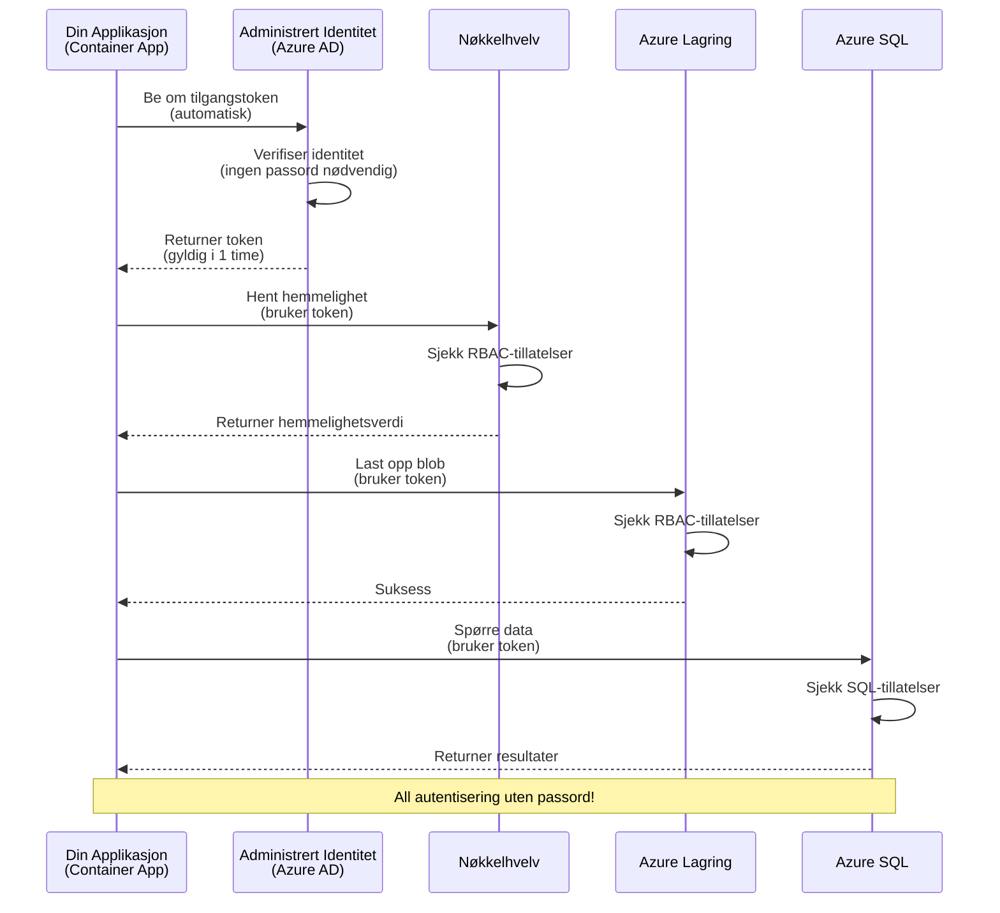
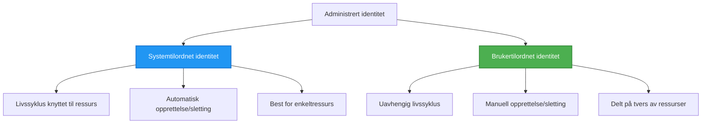

<!--
CO_OP_TRANSLATOR_METADATA:
{
  "original_hash": "e13ff6e1197e0a7462ed0aede7df9f23",
  "translation_date": "2025-11-21T19:29:16+00:00",
  "source_file": "docs/getting-started/authsecurity.md",
  "language_code": "no"
}
-->
# Autentiseringsmønstre og Administrert Identitet

⏱️ **Estimert tid**: 45-60 minutter | 💰 **Kostnadseffekt**: Gratis (ingen ekstra kostnader) | ⭐ **Kompleksitet**: Middels

**📚 Læringssti:**
- ← Forrige: [Konfigurasjonsstyring](configuration.md) - Håndtering av miljøvariabler og hemmeligheter
- 🎯 **Du er her**: Autentisering og sikkerhet (Administrert identitet, Key Vault, sikre mønstre)
- → Neste: [Første prosjekt](first-project.md) - Bygg din første AZD-applikasjon
- 🏠 [Kursoversikt](../../README.md)

---

## Hva du vil lære

Ved å fullføre denne leksjonen vil du:
- Forstå Azure-autentiseringsmønstre (nøkler, tilkoblingsstrenger, administrert identitet)
- Implementere **Administrert Identitet** for passordfri autentisering
- Sikre hemmeligheter med integrasjon av **Azure Key Vault**
- Konfigurere **rollebasert tilgangskontroll (RBAC)** for AZD-distribusjoner
- Anvende sikkerhetspraksis i Container Apps og Azure-tjenester
- Migrere fra nøkkelbasert til identitetsbasert autentisering

## Hvorfor administrert identitet er viktig

### Problemet: Tradisjonell autentisering

**Før administrert identitet:**
```javascript
// ❌ SIKKERHETSRISIKO: Hardkodede hemmeligheter i kode
const connectionString = "Server=mydb.database.windows.net;User=admin;Password=P@ssw0rd123";
const storageKey = "xK7mN9pQ2wR5tY8uI0oP3aS6dF1gH4jK...";
const cosmosKey = "C2x7B9n4M1p8Q5w3E6r0T2y5U8i1O4p7...";
```

**Problemer:**
- 🔴 **Eksponerte hemmeligheter** i kode, konfigurasjonsfiler, miljøvariabler
- 🔴 **Rotasjon av legitimasjon** krever kodeendringer og ny distribusjon
- 🔴 **Revisjonsmareritt** - hvem hadde tilgang til hva, når?
- 🔴 **Spredning** - hemmeligheter spredt over flere systemer
- 🔴 **Samsvarsrisiko** - feiler sikkerhetsrevisjoner

### Løsningen: Administrert identitet

**Etter administrert identitet:**
```javascript
// ✅ SIKKER: Ingen hemmeligheter i koden
const credential = new DefaultAzureCredential();
const client = new BlobServiceClient(
  "https://mystorageaccount.blob.core.windows.net",
  credential  // Azure håndterer autentisering automatisk
);
```

**Fordeler:**
- ✅ **Ingen hemmeligheter** i kode eller konfigurasjon
- ✅ **Automatisk rotasjon** - Azure håndterer det
- ✅ **Full revisjonssporing** i Azure AD-logger
- ✅ **Sentralisert sikkerhet** - administreres i Azure-portalen
- ✅ **Samsvarsklar** - oppfyller sikkerhetsstandarder

**Analogi**: Tradisjonell autentisering er som å bære flere fysiske nøkler for ulike dører. Administrert identitet er som å ha et sikkerhetskort som automatisk gir tilgang basert på hvem du er—ingen nøkler å miste, kopiere eller rotere.

---

## Arkitekturoversikt

### Autentiseringsflyt med administrert identitet


### Typer av administrerte identiteter


| Funksjon | Systemtilordnet | Brukertilordnet |
|----------|----------------|-----------------|
| **Livssyklus** | Knyttet til ressurs | Uavhengig |
| **Opprettelse** | Automatisk med ressurs | Manuell opprettelse |
| **Sletting** | Slettet med ressurs | Består etter ressursens sletting |
| **Deling** | Kun én ressurs | Flere ressurser |
| **Brukstilfelle** | Enkle scenarier | Komplekse multi-ressursscenarier |
| **AZD-standard** | ✅ Anbefalt | Valgfritt |

---

## Forutsetninger

### Nødvendige verktøy

Du bør allerede ha disse installert fra tidligere leksjoner:

```bash
# Verifiser Azure Developer CLI
azd version
# ✅ Forventet: azd versjon 1.0.0 eller høyere

# Verifiser Azure CLI
az --version
# ✅ Forventet: azure-cli 2.50.0 eller høyere
```

### Azure-krav

- Aktiv Azure-abonnement
- Tillatelser til å:
  - Opprette administrerte identiteter
  - Tilordne RBAC-roller
  - Opprette Key Vault-ressurser
  - Distribuere Container Apps

### Kunnskapsforutsetninger

Du bør ha fullført:
- [Installasjonsveiledning](installation.md) - AZD-oppsett
- [AZD-grunnleggende](azd-basics.md) - Kjernebegreper
- [Konfigurasjonsstyring](configuration.md) - Miljøvariabler

---

## Leksjon 1: Forstå autentiseringsmønstre

### Mønster 1: Tilkoblingsstrenger (Legacy - Unngå)

**Hvordan det fungerer:**
```bash
# Tilkoblingsstreng inneholder legitimasjon
STORAGE_CONNECTION_STRING="DefaultEndpointsProtocol=https;AccountName=myaccount;AccountKey=xK7mN9pQ2wR5..."
COSMOS_CONNECTION_STRING="AccountEndpoint=https://myaccount.documents.azure.com:443/;AccountKey=C2x7..."
SQL_CONNECTION_STRING="Server=myserver.database.windows.net;User=admin;Password=P@ssw0rd..."
```

**Problemer:**
- ❌ Hemmeligheter synlige i miljøvariabler
- ❌ Logget i distribusjonssystemer
- ❌ Vanskelig å rotere
- ❌ Ingen revisjonsspor for tilgang

**Når det skal brukes:** Kun for lokal utvikling, aldri i produksjon.

---

### Mønster 2: Key Vault-referanser (Bedre)

**Hvordan det fungerer:**
```bicep
// Store secret in Key Vault
resource keyVault 'Microsoft.KeyVault/vaults@2023-02-01' = {
  name: 'mykv'
  properties: {
    enableRbacAuthorization: true
  }
}

// Reference in Container App
env: [
  {
    name: 'STORAGE_KEY'
    secretRef: 'storage-key'  // References Key Vault
  }
]
```

**Fordeler:**
- ✅ Hemmeligheter lagret sikkert i Key Vault
- ✅ Sentralisert hemmelighetsstyring
- ✅ Rotasjon uten kodeendringer

**Begrensninger:**
- ⚠️ Bruker fortsatt nøkler/passord
- ⚠️ Må administrere tilgang til Key Vault

**Når det skal brukes:** Overgangssteg fra tilkoblingsstrenger til administrert identitet.

---

### Mønster 3: Administrert identitet (Beste praksis)

**Hvordan det fungerer:**
```bicep
// Enable managed identity
resource containerApp 'Microsoft.App/containerApps@2023-05-01' = {
  name: 'myapp'
  identity: {
    type: 'SystemAssigned'  // Automatically creates identity
  }
}

// Grant permissions
resource roleAssignment 'Microsoft.Authorization/roleAssignments@2022-04-01' = {
  scope: storageAccount
  properties: {
    roleDefinitionId: storageBlobDataContributorRole
    principalId: containerApp.identity.principalId
  }
}
```

**Applikasjonskode:**
```javascript
// Ingen hemmeligheter nødvendig!
const { DefaultAzureCredential } = require('@azure/identity');
const { BlobServiceClient } = require('@azure/storage-blob');

const credential = new DefaultAzureCredential();
const blobServiceClient = new BlobServiceClient(
  'https://mystorageaccount.blob.core.windows.net',
  credential
);
```

**Fordeler:**
- ✅ Ingen hemmeligheter i kode/konfigurasjon
- ✅ Automatisk legitimasjonsrotasjon
- ✅ Full revisjonssporing
- ✅ RBAC-baserte tillatelser
- ✅ Samsvarsklar

**Når det skal brukes:** Alltid, for produksjonsapplikasjoner.

---

## Leksjon 2: Implementere administrert identitet med AZD

### Trinnvis implementering

La oss bygge en sikker Container App som bruker administrert identitet for å få tilgang til Azure Storage og Key Vault.

### Prosjektstruktur

```
secure-app/
├── azure.yaml                 # AZD configuration
├── infra/
│   ├── main.bicep            # Main infrastructure
│   ├── core/
│   │   ├── identity.bicep    # Managed identity setup
│   │   ├── keyvault.bicep    # Key Vault configuration
│   │   └── storage.bicep     # Storage with RBAC
│   └── app/
│       └── container-app.bicep
└── src/
    ├── app.js                # Application code
    ├── package.json
    └── Dockerfile
```

### 1. Konfigurer AZD (azure.yaml)

```yaml
name: secure-app
metadata:
  template: secure-app@1.0.0

services:
  api:
    project: ./src
    language: js
    host: containerapp

# Enable managed identity (AZD handles this automatically)
```

### 2. Infrastruktur: Aktiver administrert identitet

**Fil: `infra/main.bicep`**

```bicep
targetScope = 'subscription'

param environmentName string
param location string = 'eastus'

var tags = { 'azd-env-name': environmentName }

// Resource group
resource rg 'Microsoft.Resources/resourceGroups@2021-04-01' = {
  name: 'rg-${environmentName}'
  location: location
  tags: tags
}

// Storage Account
module storage './core/storage.bicep' = {
  name: 'storage'
  scope: rg
  params: {
    name: 'st${uniqueString(rg.id)}'
    location: location
    tags: tags
  }
}

// Key Vault
module keyVault './core/keyvault.bicep' = {
  name: 'keyvault'
  scope: rg
  params: {
    name: 'kv-${uniqueString(rg.id)}'
    location: location
    tags: tags
  }
}

// Container App with Managed Identity
module containerApp './app/container-app.bicep' = {
  name: 'container-app'
  scope: rg
  params: {
    name: 'ca-${environmentName}'
    location: location
    tags: tags
    storageAccountName: storage.outputs.name
    keyVaultName: keyVault.outputs.name
  }
}

// Grant Container App access to Storage
module storageRoleAssignment './core/role-assignment.bicep' = {
  name: 'storage-role'
  scope: rg
  params: {
    principalId: containerApp.outputs.identityPrincipalId
    roleDefinitionId: 'ba92f5b4-2d11-453d-a403-e96b0029c9fe'  // Storage Blob Data Contributor
    targetResourceId: storage.outputs.id
  }
}

// Grant Container App access to Key Vault
module kvRoleAssignment './core/role-assignment.bicep' = {
  name: 'kv-role'
  scope: rg
  params: {
    principalId: containerApp.outputs.identityPrincipalId
    roleDefinitionId: '4633458b-17de-408a-b874-0445c86b69e6'  // Key Vault Secrets User
    targetResourceId: keyVault.outputs.id
  }
}

// Outputs
output AZURE_STORAGE_ACCOUNT_NAME string = storage.outputs.name
output AZURE_KEY_VAULT_NAME string = keyVault.outputs.name
output APP_URL string = containerApp.outputs.url
```

### 3. Container App med systemtilordnet identitet

**Fil: `infra/app/container-app.bicep`**

```bicep
param name string
param location string
param tags object = {}
param storageAccountName string
param keyVaultName string

resource containerApp 'Microsoft.App/containerApps@2023-05-01' = {
  name: name
  location: location
  tags: tags
  identity: {
    type: 'SystemAssigned'  // 🔑 Enable managed identity
  }
  properties: {
    configuration: {
      ingress: {
        external: true
        targetPort: 3000
      }
    }
    template: {
      containers: [
        {
          name: 'api'
          image: 'myregistry.azurecr.io/api:latest'
          resources: {
            cpu: json('0.5')
            memory: '1Gi'
          }
          env: [
            {
              name: 'AZURE_STORAGE_ACCOUNT_NAME'
              value: storageAccountName
            }
            {
              name: 'AZURE_KEY_VAULT_NAME'
              value: keyVaultName
            }
            // 🔑 No secrets - managed identity handles authentication!
          ]
        }
      ]
    }
  }
}

// Output the identity for RBAC assignments
output identityPrincipalId string = containerApp.identity.principalId
output id string = containerApp.id
output url string = 'https://${containerApp.properties.configuration.ingress.fqdn}'
```

### 4. RBAC-rolletilordningsmodul

**Fil: `infra/core/role-assignment.bicep`**

```bicep
param principalId string
param roleDefinitionId string  // Azure built-in role ID
param targetResourceId string

resource roleAssignment 'Microsoft.Authorization/roleAssignments@2022-04-01' = {
  name: guid(principalId, roleDefinitionId, targetResourceId)
  scope: resourceId('Microsoft.Resources/resourceGroups', resourceGroup().name)
  properties: {
    roleDefinitionId: subscriptionResourceId('Microsoft.Authorization/roleDefinitions', roleDefinitionId)
    principalId: principalId
    principalType: 'ServicePrincipal'
  }
}

output id string = roleAssignment.id
```

### 5. Applikasjonskode med administrert identitet

**Fil: `src/app.js`**

```javascript
const express = require('express');
const { DefaultAzureCredential } = require('@azure/identity');
const { BlobServiceClient } = require('@azure/storage-blob');
const { SecretClient } = require('@azure/keyvault-secrets');

const app = express();
const PORT = process.env.PORT || 3000;

// 🔑 Initialiser legitimasjon (fungerer automatisk med administrert identitet)
const credential = new DefaultAzureCredential();

// Azure Storage-oppsett
const storageAccountName = process.env.AZURE_STORAGE_ACCOUNT_NAME;
const blobServiceClient = new BlobServiceClient(
  `https://${storageAccountName}.blob.core.windows.net`,
  credential  // Ingen nøkler nødvendig!
);

// Key Vault-oppsett
const keyVaultName = process.env.AZURE_KEY_VAULT_NAME;
const secretClient = new SecretClient(
  `https://${keyVaultName}.vault.azure.net`,
  credential  // Ingen nøkler nødvendig!
);

// Helsesjekk
app.get('/health', (req, res) => {
  res.json({ status: 'healthy', authentication: 'managed-identity' });
});

// Last opp fil til blob-lagring
app.post('/upload', async (req, res) => {
  try {
    const containerClient = blobServiceClient.getContainerClient('uploads');
    await containerClient.createIfNotExists();
    
    const blobName = `file-${Date.now()}.txt`;
    const blockBlobClient = containerClient.getBlockBlobClient(blobName);
    
    await blockBlobClient.upload('Hello from managed identity!', 30);
    
    res.json({
      success: true,
      blobName: blobName,
      message: 'File uploaded using managed identity!'
    });
  } catch (error) {
    console.error('Upload error:', error);
    res.status(500).json({ error: error.message });
  }
});

// Hent hemmelighet fra Key Vault
app.get('/secret/:name', async (req, res) => {
  try {
    const secretName = req.params.name;
    const secret = await secretClient.getSecret(secretName);
    
    res.json({
      name: secretName,
      value: secret.value,
      message: 'Secret retrieved using managed identity!'
    });
  } catch (error) {
    console.error('Secret error:', error);
    res.status(500).json({ error: error.message });
  }
});

// List blob-beholdere (demonstrerer leseadgang)
app.get('/containers', async (req, res) => {
  try {
    const containers = [];
    for await (const container of blobServiceClient.listContainers()) {
      containers.push(container.name);
    }
    
    res.json({
      containers: containers,
      count: containers.length,
      message: 'Containers listed using managed identity!'
    });
  } catch (error) {
    console.error('List error:', error);
    res.status(500).json({ error: error.message });
  }
});

app.listen(PORT, () => {
  console.log(`Secure API listening on port ${PORT}`);
  console.log('Authentication: Managed Identity (passwordless)');
});
```

**Fil: `src/package.json`**

```json
{
  "name": "secure-app",
  "version": "1.0.0",
  "dependencies": {
    "express": "^4.18.2",
    "@azure/identity": "^4.0.0",
    "@azure/storage-blob": "^12.17.0",
    "@azure/keyvault-secrets": "^4.7.0"
  },
  "scripts": {
    "start": "node app.js"
  }
}
```

### 6. Distribuer og test

```bash
# Initialiser AZD-miljø
azd init

# Distribuer infrastruktur og applikasjon
azd up

# Hent app-URL
APP_URL=$(azd env get-values | grep APP_URL | cut -d '=' -f2 | tr -d '"')

# Test helsesjekk
curl $APP_URL/health
```

**✅ Forventet resultat:**
```json
{
  "status": "healthy",
  "authentication": "managed-identity"
}
```

**Test blob-opplasting:**
```bash
curl -X POST $APP_URL/upload
```

**✅ Forventet resultat:**
```json
{
  "success": true,
  "blobName": "file-1700404800000.txt",
  "message": "File uploaded using managed identity!"
}
```

**Test container-liste:**
```bash
curl $APP_URL/containers
```

**✅ Forventet resultat:**
```json
{
  "containers": ["uploads"],
  "count": 1,
  "message": "Containers listed using managed identity!"
}
```

---

## Vanlige Azure RBAC-roller

### Innebygde rolle-ID-er for administrert identitet

| Tjeneste | Rollenavn | Rolle-ID | Tillatelser |
|----------|-----------|----------|-------------|
| **Storage** | Storage Blob Data Reader | `2a2b9908-6b94-4a3d-8e5a-a7d8f8cc8a12` | Les blobs og containere |
| **Storage** | Storage Blob Data Contributor | `ba92f5b4-2d11-453d-a403-e96b0029c9fe` | Les, skriv, slett blobs |
| **Storage** | Storage Queue Data Contributor | `974c5e8b-45b9-4653-ba55-5f855dd0fb88` | Les, skriv, slett kømeldinger |
| **Key Vault** | Key Vault Secrets User | `4633458b-17de-408a-b874-0445c86b69e6` | Les hemmeligheter |
| **Key Vault** | Key Vault Secrets Officer | `b86a8fe4-44ce-4948-aee5-eccb2c155cd7` | Les, skriv, slett hemmeligheter |
| **Cosmos DB** | Cosmos DB Built-in Data Reader | `00000000-0000-0000-0000-000000000001` | Les Cosmos DB-data |
| **Cosmos DB** | Cosmos DB Built-in Data Contributor | `00000000-0000-0000-0000-000000000002` | Les, skriv Cosmos DB-data |
| **SQL Database** | SQL DB Contributor | `9b7fa17d-e63e-47b0-bb0a-15c516ac86ec` | Administrer SQL-databaser |
| **Service Bus** | Azure Service Bus Data Owner | `090c5cfd-751d-490a-894a-3ce6f1109419` | Send, motta, administrer meldinger |

### Hvordan finne rolle-ID-er

```bash
# Liste alle innebygde roller
az role definition list --query "[].{Name:roleName, ID:name}" --output table

# Søk etter spesifikk rolle
az role definition list --query "[?contains(roleName, 'Storage Blob')].{Name:roleName, ID:name}" --output table

# Hent rolledetaljer
az role definition list --name "Storage Blob Data Contributor"
```

---

## Praktiske øvelser

### Øvelse 1: Aktiver administrert identitet for eksisterende app ⭐⭐ (Middels)

**Mål**: Legg til administrert identitet i en eksisterende Container App-distribusjon

**Scenario**: Du har en Container App som bruker tilkoblingsstrenger. Konverter den til administrert identitet.

**Utgangspunkt**: Container App med denne konfigurasjonen:

```bicep
// ❌ Current: Using connection string
env: [
  {
    name: 'STORAGE_CONNECTION_STRING'
    secretRef: 'storage-connection'
  }
]
```

**Trinn**:

1. **Aktiver administrert identitet i Bicep:**

```bicep
resource containerApp 'Microsoft.App/containerApps@2023-05-01' = {
  name: 'myapp'
  identity: {
    type: 'SystemAssigned'  // Add this
  }
  // ... rest of configuration
}
```

2. **Gi tilgang til Storage:**

```bicep
// Get storage account reference
resource storageAccount 'Microsoft.Storage/storageAccounts@2023-01-01' existing = {
  name: storageAccountName
}

// Assign role
resource roleAssignment 'Microsoft.Authorization/roleAssignments@2022-04-01' = {
  name: guid(containerApp.id, 'ba92f5b4-2d11-453d-a403-e96b0029c9fe', storageAccount.id)
  scope: storageAccount
  properties: {
    roleDefinitionId: subscriptionResourceId('Microsoft.Authorization/roleDefinitions', 'ba92f5b4-2d11-453d-a403-e96b0029c9fe')
    principalId: containerApp.identity.principalId
    principalType: 'ServicePrincipal'
  }
}
```

3. **Oppdater applikasjonskode:**

**Før (tilkoblingsstreng):**
```javascript
const { BlobServiceClient } = require('@azure/storage-blob');

const blobServiceClient = BlobServiceClient.fromConnectionString(
  process.env.STORAGE_CONNECTION_STRING
);
```

**Etter (administrert identitet):**
```javascript
const { DefaultAzureCredential } = require('@azure/identity');
const { BlobServiceClient } = require('@azure/storage-blob');

const credential = new DefaultAzureCredential();
const blobServiceClient = new BlobServiceClient(
  `https://${process.env.STORAGE_ACCOUNT_NAME}.blob.core.windows.net`,
  credential
);
```

4. **Oppdater miljøvariabler:**

```bicep
env: [
  {
    name: 'STORAGE_ACCOUNT_NAME'
    value: storageAccountName  // Just the name, no secrets!
  }
  // Remove STORAGE_CONNECTION_STRING
]
```

5. **Distribuer og test:**

```bash
# Gjenutplassere
azd up

# Test at det fortsatt fungerer
curl https://myapp.azurecontainerapps.io/upload
```

**✅ Suksesskriterier:**
- ✅ Applikasjonen distribueres uten feil
- ✅ Storage-operasjoner fungerer (opplasting, liste, nedlasting)
- ✅ Ingen tilkoblingsstrenger i miljøvariabler
- ✅ Identitet synlig i Azure-portalen under "Identitet"-fanen

**Verifisering:**

```bash
# Sjekk at administrert identitet er aktivert
az containerapp show \
  --name myapp \
  --resource-group rg-myapp \
  --query "identity.type"
# ✅ Forventet: "SystemAssigned"

# Sjekk rolleoppgave
az role assignment list \
  --assignee $(az containerapp show --name myapp --resource-group rg-myapp --query "identity.principalId" -o tsv) \
  --scope /subscriptions/{sub-id}/resourceGroups/rg-myapp/providers/Microsoft.Storage/storageAccounts/mystorageaccount
# ✅ Forventet: Viser rollen "Storage Blob Data Contributor"
```

**Tid**: 20-30 minutter

---

### Øvelse 2: Multi-tjenestetilgang med brukertilordnet identitet ⭐⭐⭐ (Avansert)

**Mål**: Opprett en brukertilordnet identitet som deles mellom flere Container Apps

**Scenario**: Du har 3 mikrotjenester som alle trenger tilgang til samme Storage-konto og Key Vault.

**Trinn**:

1. **Opprett brukertilordnet identitet:**

**Fil: `infra/core/identity.bicep`**

```bicep
param name string
param location string
param tags object = {}

resource userAssignedIdentity 'Microsoft.ManagedIdentity/userAssignedIdentities@2023-01-31' = {
  name: name
  location: location
  tags: tags
}

output id string = userAssignedIdentity.id
output principalId string = userAssignedIdentity.properties.principalId
output clientId string = userAssignedIdentity.properties.clientId
```

2. **Tilordne roller til brukertilordnet identitet:**

```bicep
// In main.bicep
module userIdentity './core/identity.bicep' = {
  name: 'user-identity'
  scope: rg
  params: {
    name: 'id-${environmentName}'
    location: location
    tags: tags
  }
}

// Grant Storage access
resource storageRoleAssignment 'Microsoft.Authorization/roleAssignments@2022-04-01' = {
  name: guid(userIdentity.outputs.principalId, 'storage-contributor')
  scope: storageAccount
  properties: {
    roleDefinitionId: subscriptionResourceId('Microsoft.Authorization/roleDefinitions', 'ba92f5b4-2d11-453d-a403-e96b0029c9fe')
    principalId: userIdentity.outputs.principalId
    principalType: 'ServicePrincipal'
  }
}

// Grant Key Vault access
resource kvRoleAssignment 'Microsoft.Authorization/roleAssignments@2022-04-01' = {
  name: guid(userIdentity.outputs.principalId, 'kv-secrets-user')
  scope: keyVault
  properties: {
    roleDefinitionId: subscriptionResourceId('Microsoft.Authorization/roleDefinitions', '4633458b-17de-408a-b874-0445c86b69e6')
    principalId: userIdentity.outputs.principalId
    principalType: 'ServicePrincipal'
  }
}
```

3. **Tilordne identitet til flere Container Apps:**

```bicep
resource apiGateway 'Microsoft.App/containerApps@2023-05-01' = {
  name: 'api-gateway'
  identity: {
    type: 'UserAssigned'
    userAssignedIdentities: {
      '${userIdentity.outputs.id}': {}
    }
  }
  // ... rest of config
}

resource productService 'Microsoft.App/containerApps@2023-05-01' = {
  name: 'product-service'
  identity: {
    type: 'UserAssigned'
    userAssignedIdentities: {
      '${userIdentity.outputs.id}': {}
    }
  }
  // ... rest of config
}

resource orderService 'Microsoft.App/containerApps@2023-05-01' = {
  name: 'order-service'
  identity: {
    type: 'UserAssigned'
    userAssignedIdentities: {
      '${userIdentity.outputs.id}': {}
    }
  }
  // ... rest of config
}
```

4. **Applikasjonskode (alle tjenester bruker samme mønster):**

```javascript
const { DefaultAzureCredential, ManagedIdentityCredential } = require('@azure/identity');

// For bruker-tilordnet identitet, spesifiser klient-ID
const credential = new ManagedIdentityCredential(
  process.env.AZURE_CLIENT_ID  // Klient-ID for bruker-tilordnet identitet
);

// Eller bruk DefaultAzureCredential (auto-deteksjon)
const credential = new DefaultAzureCredential();

const blobServiceClient = new BlobServiceClient(
  `https://${process.env.STORAGE_ACCOUNT_NAME}.blob.core.windows.net`,
  credential
);
```

5. **Distribuer og verifiser:**

```bash
azd up

# Test alle tjenester kan få tilgang til lagring
curl https://api-gateway.azurecontainerapps.io/upload
curl https://product-service.azurecontainerapps.io/upload
curl https://order-service.azurecontainerapps.io/upload
```

**✅ Suksesskriterier:**
- ✅ Én identitet delt mellom 3 tjenester
- ✅ Alle tjenester kan få tilgang til Storage og Key Vault
- ✅ Identiteten består hvis du sletter én tjeneste
- ✅ Sentralisert tillatelsesstyring

**Fordeler med brukertilordnet identitet:**
- Én identitet å administrere
- Konsistente tillatelser på tvers av tjenester
- Overlever sletting av tjenester
- Bedre for komplekse arkitekturer

**Tid**: 30-40 minutter

---

### Øvelse 3: Implementer Key Vault-hemmelighetsrotasjon ⭐⭐⭐ (Avansert)

**Mål**: Lagre tredjeparts API-nøkler i Key Vault og få tilgang til dem ved hjelp av administrert identitet

**Scenario**: Applikasjonen din må kalle et eksternt API (OpenAI, Stripe, SendGrid) som krever API-nøkler.

**Trinn**:

1. **Opprett Key Vault med RBAC:**

**Fil: `infra/core/keyvault.bicep`**

```bicep
param name string
param location string
param tags object = {}

resource keyVault 'Microsoft.KeyVault/vaults@2023-02-01' = {
  name: name
  location: location
  tags: tags
  properties: {
    enableRbacAuthorization: true  // Use RBAC instead of access policies
    sku: {
      family: 'A'
      name: 'standard'
    }
    tenantId: subscription().tenantId
    enableSoftDelete: true
    softDeleteRetentionInDays: 90
  }
}

// Allow Container App to read secrets
output id string = keyVault.id
output name string = keyVault.name
output uri string = keyVault.properties.vaultUri
```

2. **Lagre hemmeligheter i Key Vault:**

```bash
# Hent navn på Key Vault
KV_NAME=$(azd env get-values | grep AZURE_KEY_VAULT_NAME | cut -d '=' -f2 | tr -d '"')

# Lagre API-nøkler fra tredjepart
az keyvault secret set \
  --vault-name $KV_NAME \
  --name "OpenAI-ApiKey" \
  --value "sk-proj-xxxxxxxxxxxxx"

az keyvault secret set \
  --vault-name $KV_NAME \
  --name "Stripe-ApiKey" \
  --value "sk_live_xxxxxxxxxxxxx"

az keyvault secret set \
  --vault-name $KV_NAME \
  --name "SendGrid-ApiKey" \
  --value "SG.xxxxxxxxxxxxx"
```

3. **Applikasjonskode for å hente hemmeligheter:**

**Fil: `src/config.js`**

```javascript
const { DefaultAzureCredential } = require('@azure/identity');
const { SecretClient } = require('@azure/keyvault-secrets');

class Config {
  constructor() {
    this.credential = new DefaultAzureCredential();
    this.secretClient = new SecretClient(
      `https://${process.env.AZURE_KEY_VAULT_NAME}.vault.azure.net`,
      this.credential
    );
    this.cache = {};
  }

  async getSecret(secretName) {
    // Sjekk cache først
    if (this.cache[secretName]) {
      return this.cache[secretName];
    }

    try {
      const secret = await this.secretClient.getSecret(secretName);
      this.cache[secretName] = secret.value;
      console.log(`✅ Retrieved secret: ${secretName}`);
      return secret.value;
    } catch (error) {
      console.error(`❌ Failed to get secret ${secretName}:`, error.message);
      throw error;
    }
  }

  async getOpenAIKey() {
    return this.getSecret('OpenAI-ApiKey');
  }

  async getStripeKey() {
    return this.getSecret('Stripe-ApiKey');
  }

  async getSendGridKey() {
    return this.getSecret('SendGrid-ApiKey');
  }
}

module.exports = new Config();
```

4. **Bruk hemmeligheter i applikasjonen:**

**Fil: `src/app.js`**

```javascript
const express = require('express');
const config = require('./config');
const { OpenAI } = require('openai');

const app = express();

// Initialiser OpenAI med nøkkel fra Key Vault
let openaiClient;

async function initializeServices() {
  const openaiKey = await config.getOpenAIKey();
  openaiClient = new OpenAI({ apiKey: openaiKey });
  console.log('✅ Services initialized with secrets from Key Vault');
}

// Kall ved oppstart
initializeServices().catch(console.error);

app.post('/chat', async (req, res) => {
  try {
    const completion = await openaiClient.chat.completions.create({
      model: 'gpt-4',
      messages: [{ role: 'user', content: 'Hello!' }]
    });
    
    res.json({
      response: completion.choices[0].message.content,
      authentication: 'Key from Key Vault via Managed Identity'
    });
  } catch (error) {
    res.status(500).json({ error: error.message });
  }
});

app.listen(3000, () => {
  console.log('Secure API with Key Vault integration running');
});
```

5. **Distribuer og test:**

```bash
azd up

# Test at API-nøkler fungerer
curl -X POST https://myapp.azurecontainerapps.io/chat \
  -H "Content-Type: application/json" \
  -d '{"message":"Hello AI"}'
```

**✅ Suksesskriterier:**
- ✅ Ingen API-nøkler i kode eller miljøvariabler
- ✅ Applikasjonen henter nøkler fra Key Vault
- ✅ Tredjeparts API-er fungerer korrekt
- ✅ Kan rotere nøkler uten kodeendringer

**Roter en hemmelighet:**

```bash
# Oppdater hemmelighet i Key Vault
az keyvault secret set \
  --vault-name $KV_NAME \
  --name "OpenAI-ApiKey" \
  --value "sk-proj-NEW_KEY_HERE"

# Start appen på nytt for å hente ny nøkkel
az containerapp revision restart \
  --name myapp \
  --resource-group rg-myapp
```

**Tid**: 25-35 minutter

---

## Kunnskapssjekk

### 1. Autentiseringsmønstre ✓

Test din forståelse:

- [ ] **Q1**: Hva er de tre hovedautentiseringsmønstrene? 
  - **A**: Tilkoblingsstrenger (legacy), Key Vault-referanser (overgang), Administrert identitet (beste)

- [ ] **Q2**: Hvorfor er administrert identitet bedre enn tilkoblingsstrenger?
  - **A**: Ingen hemmeligheter i kode, automatisk rotasjon, full revisjonssporing, RBAC-tillatelser

- [ ] **Q3**: Når ville du brukt brukertilordnet identitet i stedet for systemtilordnet?
  - **A**: Når identiteten deles mellom flere ressurser eller når identitetens livssyklus er uavhengig av ressursens livssyklus

**Praktisk verifisering:**
```bash
# Sjekk hvilken type identitet appen din bruker
az containerapp show \
  --name myapp \
  --resource-group rg-myapp \
  --query "identity.type"

# List opp alle rolleoppdrag for identiteten
az role assignment list \
  --assignee $(az containerapp show --name myapp --resource-group rg-myapp --query "identity.principalId" -o tsv)
```

---

### 2. RBAC og tillatelser ✓

Test din forståelse:

- [ ] **Q1**: Hva er rolle-ID-en for "Storage Blob Data Contributor"?
  - **A**: `ba92f5b4-2d11-453d-a403-e96b0029c9fe`

- [ ] **Q2**: Hvilke tillatelser gir "Key Vault Secrets User"?
  - **A**: Kun lesetilgang til hemmeligheter (kan ikke opprette, oppdatere eller slette)

- [ ] **Q3**: Hvordan gir du en Container App tilgang til Azure SQL?
  - **A**: Tilordne "SQL DB Contributor"-rollen eller konfigurer Azure AD-autentisering for SQL

**Praktisk verifisering:**
```bash
# Finn spesifikk rolle
az role definition list --name "Storage Blob Data Contributor"

# Sjekk hvilke roller som er tildelt identiteten din
PRINCIPAL_ID=$(az containerapp show --name myapp --resource-group rg-myapp --query "identity.principalId" -o tsv)
az role assignment list --assignee $PRINCIPAL_ID --output table
```

---

### 3. Key Vault-integrasjon ✓

Test din forståelse:
- [ ] **Q1**: Hvordan aktiverer du RBAC for Key Vault i stedet for tilgangspolicyer?
  - **A**: Sett `enableRbacAuthorization: true` i Bicep

- [ ] **Q2**: Hvilket Azure SDK-bibliotek håndterer autentisering med administrert identitet?
  - **A**: `@azure/identity` med klassen `DefaultAzureCredential`

- [ ] **Q3**: Hvor lenge forblir Key Vault-hemmeligheter i cache?
  - **A**: Avhenger av applikasjonen; implementer din egen cache-strategi

**Praktisk verifisering:**
```bash
# Test tilgang til Key Vault
az keyvault secret show \
  --vault-name $KV_NAME \
  --name "OpenAI-ApiKey" \
  --query "value"

# Sjekk at RBAC er aktivert
az keyvault show \
  --name $KV_NAME \
  --query "properties.enableRbacAuthorization"
# ✅ Forventet: sant
```

---

## Sikkerhetsbeste praksis

### ✅ GJØR:

1. **Bruk alltid administrert identitet i produksjon**
   ```bicep
   identity: {
     type: 'SystemAssigned'
   }
   ```

2. **Bruk RBAC-roller med minst privilegier**
   - Bruk "Reader"-roller når det er mulig
   - Unngå "Owner" eller "Contributor" med mindre det er nødvendig

3. **Lagre tredjepartsnøkler i Key Vault**
   ```javascript
   const apiKey = await secretClient.getSecret('ThirdPartyApiKey');
   ```

4. **Aktiver revisjonslogging**
   ```bicep
   diagnosticSettings: {
     logs: [{ category: 'AuditEvent', enabled: true }]
   }
   ```

5. **Bruk forskjellige identiteter for utvikling/staging/produksjon**
   ```bash
   azd env new dev
   azd env new staging
   azd env new prod
   ```

6. **Roter hemmeligheter regelmessig**
   - Sett utløpsdatoer på Key Vault-hemmeligheter
   - Automatiser rotasjon med Azure Functions

### ❌ IKKE GJØR:

1. **Aldri hardkode hemmeligheter**
   ```javascript
   // ❌ DÅRLIG
   const apiKey = "sk-proj-xxxxxxxxxxxxx";
   ```

2. **Ikke bruk tilkoblingsstrenger i produksjon**
   ```javascript
   // ❌ DÅRLIG
   BlobServiceClient.fromConnectionString(process.env.STORAGE_CONNECTION_STRING)
   ```

3. **Ikke gi overdrevne tillatelser**
   ```bicep
   // ❌ BAD - too much access
   roleDefinitionId: 'Owner'
   
   // ✅ GOOD - least privilege
   roleDefinitionId: 'Storage Blob Data Reader'
   ```

4. **Ikke logg hemmeligheter**
   ```javascript
   // ❌ DÅRLIG
   console.log('API Key:', apiKey);
   
   // ✅ BRA
   console.log('API Key retrieved successfully');
   ```

5. **Ikke del produksjonsidentiteter på tvers av miljøer**
   ```bicep
   // ❌ BAD - same identity for dev and prod
   // ✅ GOOD - separate identities per environment
   ```

---

## Feilsøkingsveiledning

### Problem: "Unauthorized" ved tilgang til Azure Storage

**Symptomer:**
```
Error: Unauthorized (403)
AuthorizationPermissionMismatch: This request is not authorized to perform this operation
```

**Diagnose:**

```bash
# Sjekk om administrert identitet er aktivert
az containerapp show \
  --name myapp \
  --resource-group rg-myapp \
  --query "identity.type"
# ✅ Forventet: "SystemAssigned" eller "UserAssigned"

# Sjekk rolleoppgaver
PRINCIPAL_ID=$(az containerapp show --name myapp --resource-group rg-myapp --query "identity.principalId" -o tsv)
az role assignment list --assignee $PRINCIPAL_ID

# Forventet: Bør se "Storage Blob Data Contributor" eller lignende rolle
```

**Løsninger:**

1. **Gi riktig RBAC-rolle:**
```bash
STORAGE_ID=$(az storage account show --name mystorageaccount --resource-group rg-myapp --query "id" -o tsv)
az role assignment create \
  --assignee $PRINCIPAL_ID \
  --role "Storage Blob Data Contributor" \
  --scope $STORAGE_ID
```

2. **Vent på propagasjon (kan ta 5-10 minutter):**
```bash
# Sjekk status for rolleoppgave
az role assignment list --assignee $PRINCIPAL_ID --scope $STORAGE_ID
```

3. **Bekreft at applikasjonskoden bruker riktig legitimasjon:**
```javascript
// Sørg for at du bruker DefaultAzureCredential
const credential = new DefaultAzureCredential();
```

---

### Problem: Tilgang til Key Vault nektes

**Symptomer:**
```
Error: Forbidden (403)
The user, group or application does not have secrets get permission
```

**Diagnose:**

```bash
# Sjekk at Key Vault RBAC er aktivert
az keyvault show \
  --name $KV_NAME \
  --query "properties.enableRbacAuthorization"
# ✅ Forventet: sant

# Sjekk rolleoppgaver
az role assignment list \
  --assignee $PRINCIPAL_ID \
  --scope /subscriptions/{sub-id}/resourceGroups/rg-myapp/providers/Microsoft.KeyVault/vaults/$KV_NAME
```

**Løsninger:**

1. **Aktiver RBAC på Key Vault:**
```bash
az keyvault update \
  --name $KV_NAME \
  --enable-rbac-authorization true
```

2. **Gi rollen Key Vault Secrets User:**
```bash
KV_ID=$(az keyvault show --name $KV_NAME --query "id" -o tsv)
az role assignment create \
  --assignee $PRINCIPAL_ID \
  --role "Key Vault Secrets User" \
  --scope $KV_ID
```

---

### Problem: DefaultAzureCredential feiler lokalt

**Symptomer:**
```
Error: DefaultAzureCredential failed to retrieve a token
CredentialUnavailableError: No credential available
```

**Diagnose:**

```bash
# Sjekk om du er logget inn
az account show

# Sjekk Azure CLI-autentisering
az ad signed-in-user show
```

**Løsninger:**

1. **Logg inn på Azure CLI:**
```bash
az login
```

2. **Sett Azure-abonnement:**
```bash
az account set --subscription "Your Subscription Name"
```

3. **For lokal utvikling, bruk miljøvariabler:**
```bash
export AZURE_TENANT_ID="your-tenant-id"
export AZURE_CLIENT_ID="your-client-id"
export AZURE_CLIENT_SECRET="your-client-secret"
```

4. **Eller bruk en annen legitimasjon lokalt:**
```javascript
const { DefaultAzureCredential, AzureCliCredential } = require('@azure/identity');

// Bruk AzureCliCredential for lokal utvikling
const credential = process.env.NODE_ENV === 'production' 
  ? new DefaultAzureCredential()
  : new AzureCliCredential();
```

---

### Problem: Rolleoppgave tar for lang tid å propagere

**Symptomer:**
- Rolle tildelt vellykket
- Fortsatt 403-feil
- Intermitterende tilgang (fungerer noen ganger, andre ganger ikke)

**Forklaring:**
Endringer i Azure RBAC kan ta 5-10 minutter å propagere globalt.

**Løsning:**

```bash
# Vent og prøv igjen
echo "Waiting for RBAC propagation..."
sleep 300  # Vent 5 minutter

# Test tilgang
curl https://myapp.azurecontainerapps.io/upload

# Hvis det fortsatt feiler, start appen på nytt
az containerapp revision restart \
  --name myapp \
  --resource-group rg-myapp
```

---

## Kostnadshensyn

### Kostnader for administrert identitet

| Ressurs | Kostnad |
|---------|---------|
| **Administrert identitet** | 🆓 **GRATIS** - Ingen kostnad |
| **RBAC-rolleoppgaver** | 🆓 **GRATIS** - Ingen kostnad |
| **Azure AD-tokenforespørsler** | 🆓 **GRATIS** - Inkludert |
| **Key Vault-operasjoner** | $0.03 per 10,000 operasjoner |
| **Key Vault-lagring** | $0.024 per hemmelighet per måned |

**Administrert identitet sparer penger ved å:**
- ✅ Eliminere Key Vault-operasjoner for tjeneste-til-tjeneste-autentisering
- ✅ Redusere sikkerhetshendelser (ingen lekkede legitimasjoner)
- ✅ Redusere operasjonell overhead (ingen manuell rotasjon)

**Eksempel på kostnadssammenligning (månedlig):**

| Scenario | Tilkoblingsstrenger | Administrert identitet | Besparelser |
|----------|---------------------|------------------------|-------------|
| Liten app (1M forespørsler) | ~$50 (Key Vault + operasjoner) | ~$0 | $50/måned |
| Middels app (10M forespørsler) | ~$200 | ~$0 | $200/måned |
| Stor app (100M forespørsler) | ~$1,500 | ~$0 | $1,500/måned |

---

## Lær mer

### Offisiell dokumentasjon
- [Azure Managed Identity](https://learn.microsoft.com/entra/identity/managed-identities-azure-resources/overview)
- [Azure RBAC](https://learn.microsoft.com/azure/role-based-access-control/overview)
- [Azure Key Vault](https://learn.microsoft.com/azure/key-vault/general/overview)
- [DefaultAzureCredential](https://learn.microsoft.com/dotnet/api/azure.identity.defaultazurecredential)

### SDK-dokumentasjon
- [@azure/identity (Node.js)](https://www.npmjs.com/package/@azure/identity)
- [Azure.Identity (C#)](https://www.nuget.org/packages/Azure.Identity/)
- [azure-identity (Python)](https://pypi.org/project/azure-identity/)

### Neste steg i dette kurset
- ← Forrige: [Konfigurasjonsstyring](configuration.md)
- → Neste: [Første prosjekt](first-project.md)
- 🏠 [Kursoversikt](../../README.md)

### Relaterte eksempler
- [Azure OpenAI Chat-eksempel](../../../../examples/azure-openai-chat) - Bruker administrert identitet for Azure OpenAI
- [Mikrotjenesteeksempel](../../../../examples/microservices) - Autentiseringsmønstre for flere tjenester

---

## Oppsummering

**Du har lært:**
- ✅ Tre autentiseringsmønstre (tilkoblingsstrenger, Key Vault, administrert identitet)
- ✅ Hvordan aktivere og konfigurere administrert identitet i AZD
- ✅ RBAC-rolleoppgaver for Azure-tjenester
- ✅ Key Vault-integrasjon for tredjepartshemmeligheter
- ✅ Bruker-tilordnet vs system-tilordnet identitet
- ✅ Sikkerhetsbeste praksis og feilsøking

**Viktige punkter:**
1. **Bruk alltid administrert identitet i produksjon** - Ingen hemmeligheter, automatisk rotasjon
2. **Bruk RBAC-roller med minst privilegier** - Gi kun nødvendige tillatelser
3. **Lagre tredjepartsnøkler i Key Vault** - Sentralisert hemmelighetsstyring
4. **Separate identiteter per miljø** - Isolasjon for utvikling, staging og produksjon
5. **Aktiver revisjonslogging** - Spor hvem som har tilgang til hva

**Neste steg:**
1. Fullfør de praktiske øvelsene ovenfor
2. Migrer en eksisterende app fra tilkoblingsstrenger til administrert identitet
3. Bygg ditt første AZD-prosjekt med sikkerhet fra dag én: [Første prosjekt](first-project.md)

---

<!-- CO-OP TRANSLATOR DISCLAIMER START -->
**Ansvarsfraskrivelse**:  
Dette dokumentet er oversatt ved hjelp av AI-oversettelsestjenesten [Co-op Translator](https://github.com/Azure/co-op-translator). Selv om vi streber etter nøyaktighet, vær oppmerksom på at automatiserte oversettelser kan inneholde feil eller unøyaktigheter. Det originale dokumentet på dets opprinnelige språk bør anses som den autoritative kilden. For kritisk informasjon anbefales profesjonell menneskelig oversettelse. Vi er ikke ansvarlige for misforståelser eller feiltolkninger som oppstår ved bruk av denne oversettelsen.
<!-- CO-OP TRANSLATOR DISCLAIMER END -->