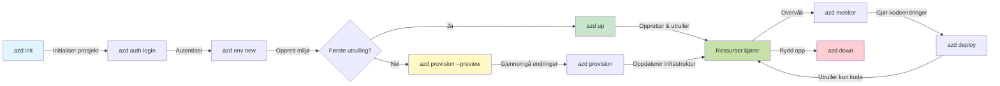

# AZD Grunnleggende - Forstå Azure Developer CLI

# AZD Grunnleggende - Kjernebegreper og Grunnprinsipper

**Kapittelnavigasjon:**
- **📚 Kursoversikt**: [AZD For Nybegynnere](../../README.md)
- **📖 Nåværende Kapittel**: Kapittel 1 - Grunnlag & Hurtigstart
- **⬅️ Forrige**: [Kursoversikt](../../README.md#-chapter-1-foundation--quick-start)
- **➡️ Neste**: [Installasjon & Oppsett](installation.md)
- **🚀 Neste Kapittel**: [Kapittel 2: AI-First Utvikling](../microsoft-foundry/microsoft-foundry-integration.md)

## Introduksjon

Denne leksjonen introduserer deg for Azure Developer CLI (azd), et kraftig kommandolinjeverktøy som akselererer overgangen fra lokal utvikling til distribusjon på Azure. Du vil lære de grunnleggende konseptene, kjernefunksjonene, og forstå hvordan azd forenkler distribusjon av skybaserte applikasjoner.

## Læringsmål

Ved slutten av denne leksjonen vil du:
- Forstå hva Azure Developer CLI er og dens hovedformål
- Lære kjernebegrepene som maler, miljøer og tjenester
- Utforske nøkkelfunksjoner som malbasert utvikling og Infrastructure as Code
- Forstå azd-prosjektstrukturen og arbeidsflyten
- Være klar til å installere og konfigurere azd for ditt utviklingsmiljø

## Læringsutbytte

Etter å ha fullført denne leksjonen vil du kunne:
- Forklare rollen til azd i moderne skyutviklingsarbeidsflyter
- Identifisere komponentene i en azd-prosjektstruktur
- Beskrive hvordan maler, miljøer og tjenester fungerer sammen
- Forstå fordelene med Infrastructure as Code med azd
- Gjenkjenne ulike azd-kommandoer og deres formål

## Hva er Azure Developer CLI (azd)?

Azure Developer CLI (azd) er et kommandolinjeverktøy designet for å akselerere overgangen fra lokal utvikling til distribusjon på Azure. Det forenkler prosessen med å bygge, distribuere og administrere skybaserte applikasjoner på Azure.

### 🎯 Hvorfor bruke AZD? En praktisk sammenligning

La oss sammenligne distribusjon av en enkel webapplikasjon med database:

#### ❌ UTEN AZD: Manuell Azure-distribusjon (30+ minutter)

```bash
# Trinn 1: Opprett ressursgruppe
az group create --name myapp-rg --location eastus

# Trinn 2: Opprett App Service Plan
az appservice plan create --name myapp-plan \
  --resource-group myapp-rg \
  --sku B1 --is-linux

# Trinn 3: Opprett Web App
az webapp create --name myapp-web-unique123 \
  --resource-group myapp-rg \
  --plan myapp-plan \
  --runtime "NODE:18-lts"

# Trinn 4: Opprett Cosmos DB-konto (10-15 minutter)
az cosmosdb create --name myapp-cosmos-unique123 \
  --resource-group myapp-rg \
  --kind MongoDB

# Trinn 5: Opprett database
az cosmosdb mongodb database create \
  --account-name myapp-cosmos-unique123 \
  --resource-group myapp-rg \
  --name tododb

# Trinn 6: Opprett samling
az cosmosdb mongodb collection create \
  --account-name myapp-cosmos-unique123 \
  --resource-group myapp-rg \
  --database-name tododb \
  --name todos

# Trinn 7: Hent tilkoblingsstreng
CONN_STR=$(az cosmosdb keys list \
  --name myapp-cosmos-unique123 \
  --resource-group myapp-rg \
  --type connection-strings \
  --query "connectionStrings[0].connectionString" -o tsv)

# Trinn 8: Konfigurer appinnstillinger
az webapp config appsettings set \
  --name myapp-web-unique123 \
  --resource-group myapp-rg \
  --settings MONGODB_URI="$CONN_STR"

# Trinn 9: Aktiver logging
az webapp log config --name myapp-web-unique123 \
  --resource-group myapp-rg \
  --application-logging filesystem \
  --detailed-error-messages true

# Trinn 10: Sett opp Application Insights
az monitor app-insights component create \
  --app myapp-insights \
  --location eastus \
  --resource-group myapp-rg

# Trinn 11: Koble App Insights til Web App
INSTRUMENTATION_KEY=$(az monitor app-insights component show \
  --app myapp-insights \
  --resource-group myapp-rg \
  --query "instrumentationKey" -o tsv)

az webapp config appsettings set \
  --name myapp-web-unique123 \
  --resource-group myapp-rg \
  --settings APPINSIGHTS_INSTRUMENTATIONKEY="$INSTRUMENTATION_KEY"

# Trinn 12: Bygg applikasjonen lokalt
npm install
npm run build

# Trinn 13: Opprett distribusjonspakke
zip -r app.zip . -x "*.git*" "node_modules/*"

# Trinn 14: Distribuer applikasjonen
az webapp deployment source config-zip \
  --resource-group myapp-rg \
  --name myapp-web-unique123 \
  --src app.zip

# Trinn 15: Vent og håp at det fungerer 🙏
# (Ingen automatisert validering, manuell testing kreves)
```

**Problemer:**
- ❌ 15+ kommandoer å huske og utføre i riktig rekkefølge
- ❌ 30-45 minutter med manuelt arbeid
- ❌ Lett å gjøre feil (tastefeil, feil parametere)
- ❌ Tilkoblingsstrenger eksponert i terminalhistorikk
- ❌ Ingen automatisk tilbakestilling hvis noe feiler
- ❌ Vanskelig å reprodusere for teammedlemmer
- ❌ Ulikt hver gang (ikke reproduserbart)

#### ✅ MED AZD: Automatisert distribusjon (5 kommandoer, 10-15 minutter)

```bash
# Steg 1: Initialiser fra mal
azd init --template todo-nodejs-mongo

# Steg 2: Autentiser
azd auth login

# Steg 3: Opprett miljø
azd env new dev

# Steg 4: Forhåndsvis endringer (valgfritt, men anbefalt)
azd provision --preview

# Steg 5: Distribuer alt
azd up

# ✨ Ferdig! Alt er distribuert, konfigurert og overvåket
```

**Fordeler:**
- ✅ **5 kommandoer** vs. 15+ manuelle trinn
- ✅ **10-15 minutter** total tid (mest venting på Azure)
- ✅ **Ingen feil** - automatisert og testet
- ✅ **Hemmeligheter håndtert sikkert** via Key Vault
- ✅ **Automatisk tilbakestilling** ved feil
- ✅ **Fullt reproduserbart** - samme resultat hver gang
- ✅ **Team-klar** - hvem som helst kan distribuere med samme kommandoer
- ✅ **Infrastructure as Code** - versjonskontrollerte Bicep-maler
- ✅ **Innebygd overvåking** - Application Insights konfigurert automatisk

### 📊 Tids- og feilreduksjon

| Metrikk | Manuell Distribusjon | AZD Distribusjon | Forbedring |
|:-------|:---------------------|:-----------------|:-----------|
| **Kommandoer** | 15+ | 5 | 67% færre |
| **Tid** | 30-45 min | 10-15 min | 60% raskere |
| **Feilrate** | ~40% | <5% | 88% reduksjon |
| **Konsistens** | Lav (manuell) | 100% (automatisert) | Perfekt |
| **Team Onboarding** | 2-4 timer | 30 minutter | 75% raskere |
| **Tilbakestillingstid** | 30+ min (manuell) | 2 min (automatisert) | 93% raskere |

## Kjernebegreper

### Maler
Maler er grunnlaget for azd. De inneholder:
- **Applikasjonskode** - Kildekoden din og avhengigheter
- **Infrastrukturdefinisjoner** - Azure-ressurser definert i Bicep eller Terraform
- **Konfigurasjonsfiler** - Innstillinger og miljøvariabler
- **Distribusjonsskript** - Automatiserte distribusjonsarbeidsflyter

### Miljøer
Miljøer representerer ulike distribusjonsmål:
- **Utvikling** - For testing og utvikling
- **Staging** - Pre-produksjonsmiljø
- **Produksjon** - Live produksjonsmiljø

Hvert miljø opprettholder sine egne:
- Azure ressursgrupper
- Konfigurasjonsinnstillinger
- Distribusjonstilstand

### Tjenester
Tjenester er byggesteinene i applikasjonen din:
- **Frontend** - Webapplikasjoner, SPAs
- **Backend** - API-er, mikrotjenester
- **Database** - Databaseløsninger
- **Lagring** - Fil- og bloblagring

## Nøkkelfunksjoner

### 1. Malbasert Utvikling
```bash
# Bla gjennom tilgjengelige maler
azd template list

# Initialiser fra en mal
azd init --template <template-name>
```

### 2. Infrastructure as Code
- **Bicep** - Azure sitt domene-spesifikke språk
- **Terraform** - Multi-sky infrastrukturverktøy
- **ARM-maler** - Azure Resource Manager-maler

### 3. Integrerte Arbeidsflyter
```bash
# Fullfør distribusjonsarbeidsflyt
azd up            # Klargjør + Distribuer dette er uten manuell interaksjon for første gangs oppsett

# 🧪 NYTT: Forhåndsvis infrastrukturendringer før distribusjon (TRYGT)
azd provision --preview    # Simuler distribusjon av infrastruktur uten å gjøre endringer

azd provision     # Opprett Azure-ressurser hvis du oppdaterer infrastrukturen bruk dette
azd deploy        # Distribuer applikasjonskode eller distribuer applikasjonskode på nytt etter oppdatering
azd down          # Rydd opp ressurser
```

#### 🛡️ Sikker Infrastrukturplanlegging med Forhåndsvisning
Kommandoen `azd provision --preview` er en gamechanger for sikre distribusjoner:
- **Tørrkjøring** - Viser hva som vil bli opprettet, endret eller slettet
- **Null risiko** - Ingen faktiske endringer gjøres i Azure-miljøet ditt
- **Team-samarbeid** - Del forhåndsvisningsresultater før distribusjon
- **Kostnadsestimering** - Forstå ressurskostnader før forpliktelse

```bash
# Eksempel på forhåndsvisningsarbeidsflyt
azd provision --preview           # Se hva som vil endre seg
# Gjennomgå resultatet, diskuter med teamet
azd provision                     # Utfør endringer med selvtillit
```

### 📊 Visualisering: AZD Utviklingsarbeidsflyt


**Forklaring av Arbeidsflyt:**
1. **Init** - Start med mal eller nytt prosjekt
2. **Auth** - Autentiser med Azure
3. **Miljø** - Opprett isolert distribusjonsmiljø
4. **Forhåndsvisning** - 🆕 Forhåndsvis alltid infrastrukturendringer først (sikker praksis)
5. **Provision** - Opprett/oppdater Azure-ressurser
6. **Deploy** - Skyv applikasjonskoden din
7. **Monitor** - Overvåk applikasjonsytelse
8. **Iterer** - Gjør endringer og distribuer koden på nytt
9. **Rydd opp** - Fjern ressurser når du er ferdig

### 4. Miljøadministrasjon
```bash
# Opprett og administrer miljøer
azd env new <environment-name>
azd env select <environment-name>
azd env list
```

## 📁 Prosjektstruktur

En typisk azd-prosjektstruktur:
```
my-app/
├── .azd/                    # azd configuration
│   └── config.json
├── .azure/                  # Azure deployment artifacts
├── .devcontainer/          # Development container config
├── .github/workflows/      # GitHub Actions
├── .vscode/               # VS Code settings
├── infra/                 # Infrastructure code
│   ├── main.bicep        # Main infrastructure template
│   ├── main.parameters.json
│   └── modules/          # Reusable modules
├── src/                  # Application source code
│   ├── api/             # Backend services
│   └── web/             # Frontend application
├── azure.yaml           # azd project configuration
└── README.md
```

## 🔧 Konfigurasjonsfiler

### azure.yaml
Hovedkonfigurasjonsfilen for prosjektet:
```yaml
name: my-awesome-app
metadata:
  template: my-template@1.0.0

services:
  web:
    project: ./src/web
    language: js
    host: appservice
  api:
    project: ./src/api
    language: js
    host: appservice

hooks:
  preprovision:
    shell: pwsh
    run: echo "Preparing to provision..."
```

### .azure/config.json
Miljøspesifikk konfigurasjon:
```json
{
  "version": 1,
  "defaultEnvironment": "dev",
  "environments": {
    "dev": {
      "subscriptionId": "your-subscription-id",
      "location": "eastus"
    }
  }
}
```

## 🎪 Vanlige Arbeidsflyter med Praktiske Øvelser

> **💡 Læringstips:** Følg disse øvelsene i rekkefølge for å bygge opp dine AZD-ferdigheter gradvis.

### 🎯 Øvelse 1: Initialiser Ditt Første Prosjekt

**Mål:** Opprett et AZD-prosjekt og utforsk strukturen

**Trinn:**
```bash
# Bruk en bevist mal
azd init --template todo-nodejs-mongo

# Utforsk de genererte filene
ls -la  # Vis alle filer inkludert skjulte

# Nøkkelfiler opprettet:
# - azure.yaml (hovedkonfigurasjon)
# - infra/ (infrastrukturkode)
# - src/ (applikasjonskode)
```

**✅ Suksess:** Du har azure.yaml, infra/, og src/-mapper

---

### 🎯 Øvelse 2: Distribuer til Azure

**Mål:** Fullfør en ende-til-ende distribusjon

**Trinn:**
```bash
# 1. Autentiser
az login && azd auth login

# 2. Opprett miljø
azd env new dev
azd env set AZURE_LOCATION eastus

# 3. Forhåndsvis endringer (ANBEFALT)
azd provision --preview

# 4. Distribuer alt
azd up

# 5. Verifiser distribusjon
azd show    # Vis appens URL
```

**Forventet Tid:** 10-15 minutter  
**✅ Suksess:** Applikasjons-URL åpnes i nettleseren

---

### 🎯 Øvelse 3: Flere Miljøer

**Mål:** Distribuer til dev og staging

**Trinn:**
```bash
# Har allerede utvikling, opprett staging
azd env new staging
azd env set AZURE_LOCATION westus2
azd up

# Bytt mellom dem
azd env list
azd env select dev
```

**✅ Suksess:** To separate ressursgrupper i Azure-portalen

---

### 🛡️ Ren Start: `azd down --force --purge`

Når du trenger å tilbakestille helt:

```bash
azd down --force --purge
```

**Hva den gjør:**
- `--force`: Ingen bekreftelsesprompter
- `--purge`: Sletter all lokal tilstand og Azure-ressurser

**Bruk når:**
- Distribusjon feilet halvveis
- Bytter prosjekter
- Trenger en ny start

---

## 🎪 Original Arbeidsflytreferanse

### Starte et Nytt Prosjekt
```bash
# Metode 1: Bruk eksisterende mal
azd init --template todo-nodejs-mongo

# Metode 2: Start fra bunnen
azd init

# Metode 3: Bruk gjeldende katalog
azd init .
```

### Utviklingssyklus
```bash
# Sett opp utviklingsmiljø
azd auth login
azd env new dev
azd env select dev

# Distribuer alt
azd up

# Gjør endringer og distribuer på nytt
azd deploy

# Rydd opp når du er ferdig
azd down --force --purge # kommandoen i Azure Developer CLI er en **hard reset** for miljøet ditt—spesielt nyttig når du feilsøker mislykkede distribusjoner, rydder opp foreldreløse ressurser, eller forbereder deg på en ny distribusjon.
```

## Forstå `azd down --force --purge`
Kommandoen `azd down --force --purge` er en kraftig måte å fullstendig fjerne azd-miljøet ditt og alle tilknyttede ressurser. Her er en oversikt over hva hver flagg gjør:
```
--force
```
- Hopper over bekreftelsesprompter.
- Nyttig for automatisering eller skripting der manuell input ikke er mulig.
- Sikrer at oppryddingen fortsetter uten avbrudd, selv om CLI oppdager inkonsistenser.

```
--purge
```
Sletter **all tilknyttet metadata**, inkludert:
Miljøtilstand
Lokal `.azure`-mappe
Bufret distribusjonsinformasjon
Forhindrer azd fra å "huske" tidligere distribusjoner, som kan forårsake problemer som feil ressursgrupper eller utdaterte registerreferanser.


### Hvorfor bruke begge?
Når du har støtt på problemer med `azd up` på grunn av gjenværende tilstand eller delvise distribusjoner, sikrer denne kombinasjonen en **ren start**.

Det er spesielt nyttig etter manuell sletting av ressurser i Azure-portalen eller når du bytter maler, miljøer eller ressursgruppenavn.

---

Resten av innholdet følger samme struktur og kan oversettes tilsvarende.
- [Installasjon og Oppsett](installation.md) - Få azd installert og konfigurert
- [Ditt Første Prosjekt](first-project.md) - Fullfør en praktisk veiledning
- [Konfigurasjonsveiledning](configuration.md) - Avanserte konfigurasjonsalternativer

**🎯 Klar for Neste Kapittel?**
- [Kapittel 2: AI-First Utvikling](../microsoft-foundry/microsoft-foundry-integration.md) - Begynn å bygge AI-applikasjoner

## Ekstra Ressurser

- [Azure Developer CLI Oversikt](https://learn.microsoft.com/en-us/azure/developer/azure-developer-cli/)
- [Mal-Galleri](https://azure.github.io/awesome-azd/)
- [Fellesskapsprøver](https://github.com/Azure-Samples)

---

## 🙋 Ofte Stilte Spørsmål

### Generelle Spørsmål

**Spørsmål: Hva er forskjellen mellom AZD og Azure CLI?**

Svar: Azure CLI (`az`) brukes til å administrere individuelle Azure-ressurser. AZD (`azd`) brukes til å administrere hele applikasjoner:

```bash
# Azure CLI - Ressursadministrasjon på lavt nivå
az webapp create --name myapp --resource-group rg
az sql server create --name myserver --resource-group rg
# ...mange flere kommandoer nødvendig

# AZD - Administrasjon på applikasjonsnivå
azd up  # Distribuerer hele appen med alle ressurser
```

**Tenk på det slik:**
- `az` = Arbeide med individuelle Lego-klosser
- `azd` = Arbeide med komplette Lego-sett

---

**Spørsmål: Må jeg kunne Bicep eller Terraform for å bruke AZD?**

Svar: Nei! Start med maler:
```bash
# Bruk eksisterende mal - ingen IaC-kunnskap nødvendig
azd init --template todo-nodejs-mongo
azd up
```

Du kan lære Bicep senere for å tilpasse infrastrukturen. Maler gir fungerende eksempler å lære av.

---

**Spørsmål: Hvor mye koster det å kjøre AZD-maler?**

Svar: Kostnadene varierer etter mal. De fleste utviklingsmaler koster $50-150/måned:

```bash
# Forhåndsvis kostnader før utrulling
azd provision --preview

# Rydd alltid opp når det ikke brukes
azd down --force --purge  # Fjerner alle ressurser
```

**Tips:** Bruk gratisnivåer der det er tilgjengelig:
- App Service: F1 (Gratis) nivå
- Azure OpenAI: 50,000 tokens/måned gratis
- Cosmos DB: 1000 RU/s gratisnivå

---

**Spørsmål: Kan jeg bruke AZD med eksisterende Azure-ressurser?**

Svar: Ja, men det er enklere å starte fra bunnen av. AZD fungerer best når det administrerer hele livssyklusen. For eksisterende ressurser:

```bash
# Alternativ 1: Importer eksisterende ressurser (avansert)
azd init
# Deretter endre infra/ for å referere til eksisterende ressurser

# Alternativ 2: Start fra bunnen (anbefalt)
azd init --template matching-your-stack
azd up  # Oppretter nytt miljø
```

---

**Spørsmål: Hvordan deler jeg prosjektet mitt med teammedlemmer?**

Svar: Commit AZD-prosjektet til Git (men IKKE .azure-mappen):

```bash
# Allerede i .gitignore som standard
.azure/        # Inneholder hemmeligheter og miljødata
*.env          # Miljøvariabler

# Teammedlemmer da:
git clone <your-repo>
azd auth login
azd env new <their-name>-dev
azd up
```

Alle får identisk infrastruktur fra de samme malene.

---

### Feilsøkingsspørsmål

**Spørsmål: "azd up" feilet halvveis. Hva gjør jeg?**

Svar: Sjekk feilen, rett den, og prøv igjen:

```bash
# Vis detaljerte logger
azd show

# Vanlige løsninger:

# 1. Hvis kvoten er overskredet:
azd env set AZURE_LOCATION "westus2"  # Prøv en annen region

# 2. Hvis ressursnavnkonflikt:
azd down --force --purge  # Rydd opp
azd up  # Prøv igjen

# 3. Hvis autentisering er utløpt:
az login
azd auth login
azd up
```

**Vanligste problem:** Feil Azure-abonnement valgt
```bash
az account list --output table
az account set --subscription "<correct-subscription>"
```

---

**Spørsmål: Hvordan distribuerer jeg bare kodeendringer uten å reprovisionere?**

Svar: Bruk `azd deploy` i stedet for `azd up`:

```bash
azd up          # Første gang: klargjøring + distribusjon (sakte)

# Gjør kodeendringer...

azd deploy      # Påfølgende ganger: kun distribusjon (raskt)
```

Hastighetssammenligning:
- `azd up`: 10-15 minutter (provisionerer infrastruktur)
- `azd deploy`: 2-5 minutter (kun kode)

---

**Spørsmål: Kan jeg tilpasse infrastrukturmalene?**

Svar: Ja! Rediger Bicep-filene i `infra/`:

```bash
# Etter azd init
cd infra/
code main.bicep  # Rediger i VS Code

# Forhåndsvis endringer
azd provision --preview

# Bruk endringer
azd provision
```

**Tips:** Start smått - endre SKUs først:
```bicep
// infra/main.bicep
sku: {
  name: 'B1'  // Change to 'P1V2' for production
}
```

---

**Spørsmål: Hvordan sletter jeg alt AZD har opprettet?**

Svar: Én kommando fjerner alle ressurser:

```bash
azd down --force --purge

# Dette sletter:
# - Alle Azure-ressurser
# - Ressursgruppe
# - Lokal miljøtilstand
# - Bufrede distribusjonsdata
```

**Kjør alltid dette når:**
- Du er ferdig med å teste en mal
- Bytter til et annet prosjekt
- Vil starte på nytt

**Kostnadsbesparelser:** Sletting av ubrukte ressurser = $0 kostnader

---

**Spørsmål: Hva om jeg ved et uhell slettet ressurser i Azure Portal?**

Svar: AZD-tilstanden kan komme ut av synk. Bruk en ren starttilnærming:

```bash
# 1. Fjern lokal tilstand
azd down --force --purge

# 2. Start på nytt
azd up

# Alternativ: La AZD oppdage og fikse
azd provision  # Vil opprette manglende ressurser
```

---

### Avanserte Spørsmål

**Spørsmål: Kan jeg bruke AZD i CI/CD-pipelines?**

Svar: Ja! Eksempel med GitHub Actions:

```yaml
# .github/workflows/deploy.yml
name: Deploy with AZD

on:
  push:
    branches: [main]

jobs:
  deploy:
    runs-on: ubuntu-latest
    steps:
      - uses: actions/checkout@v2
      
      - name: Install azd
        run: curl -fsSL https://aka.ms/install-azd.sh | bash
      
      - name: Azure Login
        run: |
          azd auth login \
            --client-id ${{ secrets.AZURE_CLIENT_ID }} \
            --client-secret ${{ secrets.AZURE_CLIENT_SECRET }} \
            --tenant-id ${{ secrets.AZURE_TENANT_ID }}
      
      - name: Deploy
        run: azd up --no-prompt
```

---

**Spørsmål: Hvordan håndterer jeg hemmeligheter og sensitiv data?**

Svar: AZD integreres automatisk med Azure Key Vault:

```bash
# Hemmeligheter lagres i Key Vault, ikke i kode
azd env set DATABASE_PASSWORD "$(openssl rand -base64 32)"

# AZD automatisk:
# 1. Oppretter Key Vault
# 2. Lagrer hemmelighet
# 3. Gir app tilgang via Managed Identity
# 4. Injiserer ved runtime
```

**Aldri commit:**
- `.azure/`-mappen (inneholder miljødata)
- `.env`-filer (lokale hemmeligheter)
- Tilkoblingsstrenger

---

**Spørsmål: Kan jeg distribuere til flere regioner?**

Svar: Ja, opprett et miljø per region:

```bash
# Øst USA miljø
azd env new prod-eastus
azd env set AZURE_LOCATION eastus
azd up

# Vest Europa miljø
azd env new prod-westeurope
azd env set AZURE_LOCATION westeurope
azd up

# Hvert miljø er uavhengig
azd env list
```

For ekte multi-region apper, tilpass Bicep-maler for å distribuere til flere regioner samtidig.

---

**Spørsmål: Hvor kan jeg få hjelp hvis jeg står fast?**

1. **AZD Dokumentasjon:** https://learn.microsoft.com/azure/developer/azure-developer-cli/
2. **GitHub Issues:** https://github.com/Azure/azure-dev/issues
3. **Discord:** [Azure Discord](https://discord.gg/microsoft-azure) - #azure-developer-cli-kanal
4. **Stack Overflow:** Tag `azure-developer-cli`
5. **Denne Kurset:** [Feilsøkingsveiledning](../troubleshooting/common-issues.md)

**Tips:** Før du spør, kjør:
```bash
azd show       # Viser nåværende tilstand
azd version    # Viser din versjon
```
Inkluder denne informasjonen i spørsmålet ditt for raskere hjelp.

---

## 🎓 Hva Nå?

Du forstår nå AZD-grunnleggende. Velg din vei:

### 🎯 For Nybegynnere:
1. **Neste:** [Installasjon og Oppsett](installation.md) - Installer AZD på maskinen din
2. **Deretter:** [Ditt Første Prosjekt](first-project.md) - Distribuer din første app
3. **Øv:** Fullfør alle 3 øvelsene i denne leksjonen

### 🚀 For AI-utviklere:
1. **Hopp til:** [Kapittel 2: AI-First Utvikling](../microsoft-foundry/microsoft-foundry-integration.md)
2. **Distribuer:** Start med `azd init --template get-started-with-ai-chat`
3. **Lær:** Bygg mens du distribuerer

### 🏗️ For Erfarne Utviklere:
1. **Gå gjennom:** [Konfigurasjonsveiledning](configuration.md) - Avanserte innstillinger
2. **Utforsk:** [Infrastruktur som Kode](../deployment/provisioning.md) - Dypdykk i Bicep
3. **Bygg:** Lag egendefinerte maler for din stack

---

**Kapittelnavigasjon:**
- **📚 Kurs Hjem**: [AZD For Nybegynnere](../../README.md)
- **📖 Nåværende Kapittel**: Kapittel 1 - Grunnlag & Hurtigstart  
- **⬅️ Forrige**: [Kursoversikt](../../README.md#-chapter-1-foundation--quick-start)
- **➡️ Neste**: [Installasjon og Oppsett](installation.md)
- **🚀 Neste Kapittel**: [Kapittel 2: AI-First Utvikling](../microsoft-foundry/microsoft-foundry-integration.md)

---

<!-- CO-OP TRANSLATOR DISCLAIMER START -->
**Ansvarsfraskrivelse**:  
Dette dokumentet er oversatt ved hjelp av AI-oversettelsestjenesten [Co-op Translator](https://github.com/Azure/co-op-translator). Selv om vi streber etter nøyaktighet, vær oppmerksom på at automatiserte oversettelser kan inneholde feil eller unøyaktigheter. Det originale dokumentet på dets opprinnelige språk bør anses som den autoritative kilden. For kritisk informasjon anbefales profesjonell menneskelig oversettelse. Vi er ikke ansvarlige for misforståelser eller feiltolkninger som oppstår ved bruk av denne oversettelsen.
<!-- CO-OP TRANSLATOR DISCLAIMER END -->