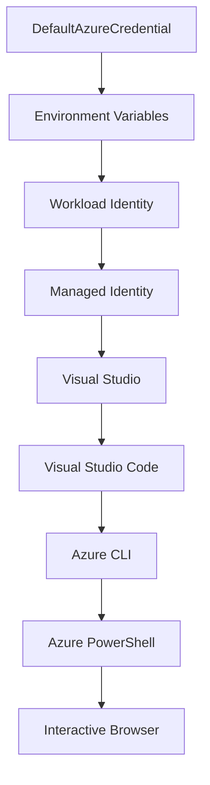

<!--
CO_OP_TRANSLATOR_METADATA:
{
  "original_hash": "4dc26ed8004b58a51875efd07203340f",
  "translation_date": "2025-09-26T18:38:30+00:00",
  "source_file": "docs/getting-started/azd-basics.md",
  "language_code": "no"
}
-->
# AZD Grunnleggende - Forstå Azure Developer CLI

# AZD Grunnleggende - Kjernebegreper og Fundament

**Kapittelnavigasjon:**
- **📚 Kursoversikt**: [AZD For Nybegynnere](../../README.md)
- **📖 Nåværende Kapittel**: Kapittel 1 - Grunnlag & Hurtigstart
- **⬅️ Forrige**: [Kursoversikt](../../README.md#-chapter-1-foundation--quick-start)
- **➡️ Neste**: [Installasjon & Oppsett](installation.md)
- **🚀 Neste Kapittel**: [Kapittel 2: AI-First Utvikling](../ai-foundry/azure-ai-foundry-integration.md)

## Introduksjon

Denne leksjonen introduserer deg til Azure Developer CLI (azd), et kraftig kommandolinjeverktøy som akselererer reisen fra lokal utvikling til Azure-deployering. Du vil lære de grunnleggende konseptene, kjernefunksjonene, og forstå hvordan azd forenkler deployering av skybaserte applikasjoner.

## Læringsmål

Ved slutten av denne leksjonen vil du:
- Forstå hva Azure Developer CLI er og dens hovedformål
- Lære kjernebegreper som maler, miljøer og tjenester
- Utforske nøkkelfunksjoner som malbasert utvikling og Infrastructure as Code
- Forstå azd-projektstrukturen og arbeidsflyten
- Være klar til å installere og konfigurere azd for ditt utviklingsmiljø

## Læringsutbytte

Etter å ha fullført denne leksjonen vil du kunne:
- Forklare rollen til azd i moderne skyutviklingsarbeidsflyter
- Identifisere komponentene i en azd-projektstruktur
- Beskrive hvordan maler, miljøer og tjenester fungerer sammen
- Forstå fordelene med Infrastructure as Code med azd
- Gjenkjenne ulike azd-kommandoer og deres formål

## Hva er Azure Developer CLI (azd)?

Azure Developer CLI (azd) er et kommandolinjeverktøy designet for å akselerere reisen fra lokal utvikling til Azure-deployering. Det forenkler prosessen med å bygge, deployere og administrere skybaserte applikasjoner på Azure.

## Kjernebegreper

### Maler
Maler er grunnlaget for azd. De inneholder:
- **Applikasjonskode** - Kildekode og avhengigheter
- **Infrastrukturbeskrivelser** - Azure-ressurser definert i Bicep eller Terraform
- **Konfigurasjonsfiler** - Innstillinger og miljøvariabler
- **Deployeringsskript** - Automatiserte deployeringsarbeidsflyter

### Miljøer
Miljøer representerer ulike deployeringsmål:
- **Utvikling** - For testing og utvikling
- **Staging** - Pre-produksjonsmiljø
- **Produksjon** - Live produksjonsmiljø

Hvert miljø opprettholder sin egen:
- Azure ressursgruppe
- Konfigurasjonsinnstillinger
- Deployeringstilstand

### Tjenester
Tjenester er byggesteinene i applikasjonen din:
- **Frontend** - Webapplikasjoner, SPAs
- **Backend** - API-er, mikrotjenester
- **Database** - Databaseløsninger
- **Lagring** - Fil- og bloblagring

## Nøkkelfunksjoner

### 1. Malbasert Utvikling
```bash
# Browse available templates
azd template list

# Initialize from a template
azd init --template <template-name>
```

### 2. Infrastructure as Code
- **Bicep** - Azure sitt domene-spesifikke språk
- **Terraform** - Multi-sky infrastrukturverktøy
- **ARM-maler** - Azure Resource Manager-maler

### 3. Integrerte Arbeidsflyter
```bash
# Complete deployment workflow
azd up            # Provision + Deploy this is hands off for first time setup
azd provision     # Create Azure resources if you update the infrastructure use this
azd deploy        # Deploy application code or redeploy application code once update
azd down          # Clean up resources
```

### 4. Miljøadministrasjon
```bash
# Create and manage environments
azd env new <environment-name>
azd env select <environment-name>
azd env list
```

## 📁 Prosjektstruktur

En typisk azd-prosjektstruktur:
```
my-app/
├── .azd/                    # azd configuration
│   └── config.json
├── .azure/                  # Azure deployment artifacts
├── .devcontainer/          # Development container config
├── .github/workflows/      # GitHub Actions
├── .vscode/               # VS Code settings
├── infra/                 # Infrastructure code
│   ├── main.bicep        # Main infrastructure template
│   ├── main.parameters.json
│   └── modules/          # Reusable modules
├── src/                  # Application source code
│   ├── api/             # Backend services
│   └── web/             # Frontend application
├── azure.yaml           # azd project configuration
└── README.md
```

## 🔧 Konfigurasjonsfiler

### azure.yaml
Hovedkonfigurasjonsfilen for prosjektet:
```yaml
name: my-awesome-app
metadata:
  template: my-template@1.0.0

services:
  web:
    project: ./src/web
    language: js
    host: appservice
  api:
    project: ./src/api
    language: js
    host: appservice

hooks:
  preprovision:
    shell: pwsh
    run: echo "Preparing to provision..."
```

### .azure/config.json
Miljøspesifikk konfigurasjon:
```json
{
  "version": 1,
  "defaultEnvironment": "dev",
  "environments": {
    "dev": {
      "subscriptionId": "your-subscription-id",
      "location": "eastus"
    }
  }
}
```

## 🎪 Vanlige Arbeidsflyter

### Starte et Nytt Prosjekt
```bash
# Method 1: Use existing template
azd init --template todo-nodejs-mongo

# Method 2: Start from scratch
azd init

# Method 3: Use current directory
azd init .
```

### Utviklingssyklus
```bash
# Set up development environment
azd auth login
azd env new dev
azd env select dev

# Deploy everything
azd up

# Make changes and redeploy
azd deploy

# Clean up when done
azd down --force --purge # command in the Azure Developer CLI is a **hard reset** for your environment—especially useful when you're troubleshooting failed deployments, cleaning up orphaned resources, or prepping for a fresh redeploy.
```

## Forstå `azd down --force --purge`
Kommandoen `azd down --force --purge` er en kraftig måte å fullstendig rive ned azd-miljøet og alle tilknyttede ressurser. Her er en oversikt over hva hver flagg gjør:
```
--force
```
- Hopper over bekreftelsesprompter.
- Nyttig for automatisering eller skripting der manuell input ikke er mulig.
- Sikrer at nedrivningen fortsetter uten avbrudd, selv om CLI oppdager inkonsistenser.

```
--purge
```
Sletter **all tilknyttet metadata**, inkludert:
Miljøtilstand
Lokal `.azure`-mappe
Bufret deployeringsinformasjon
Forhindrer azd fra å "huske" tidligere deployeringer, som kan forårsake problemer som feil ressursgrupper eller utdaterte registerreferanser.

### Hvorfor bruke begge?
Når du har støtt på problemer med `azd up` på grunn av gjenværende tilstand eller delvise deployeringer, sikrer denne kombinasjonen en **ren start**.

Det er spesielt nyttig etter manuelle ressurs-slettinger i Azure-portalen eller når du bytter maler, miljøer eller ressursgruppenavn.

### Administrere Flere Miljøer
```bash
# Create staging environment
azd env new staging
azd env select staging
azd up

# Switch back to dev
azd env select dev

# Compare environments
azd env list
```

## 🔐 Autentisering og Legitimasjon

Å forstå autentisering er avgjørende for vellykkede azd-deployeringer. Azure bruker flere autentiseringsmetoder, og azd benytter den samme legitimasjonskjeden som andre Azure-verktøy.

### Azure CLI Autentisering (`az login`)

Før du bruker azd, må du autentisere med Azure. Den vanligste metoden er å bruke Azure CLI:

```bash
# Interactive login (opens browser)
az login

# Login with specific tenant
az login --tenant <tenant-id>

# Login with service principal
az login --service-principal -u <app-id> -p <password> --tenant <tenant-id>

# Check current login status
az account show

# List available subscriptions
az account list --output table

# Set default subscription
az account set --subscription <subscription-id>
```

### Autentiseringsflyt
1. **Interaktiv Innlogging**: Åpner standard nettleser for autentisering
2. **Enhetskodeflyt**: For miljøer uten nettlesertilgang
3. **Service Principal**: For automatisering og CI/CD-scenarier
4. **Managed Identity**: For Azure-hostede applikasjoner

### DefaultAzureCredential-kjede

`DefaultAzureCredential` er en legitimasjonstype som gir en forenklet autentiseringsopplevelse ved automatisk å prøve flere legitimasjonskilder i en spesifikk rekkefølge:

#### Legitimasjonskjede Rekkefølge


#### 1. Miljøvariabler
```bash
# Set environment variables for service principal
export AZURE_CLIENT_ID="<app-id>"
export AZURE_CLIENT_SECRET="<password>"
export AZURE_TENANT_ID="<tenant-id>"
```

#### 2. Workload Identity (Kubernetes/GitHub Actions)
Brukes automatisk i:
- Azure Kubernetes Service (AKS) med Workload Identity
- GitHub Actions med OIDC-føderasjon
- Andre fødererte identitetsscenarier

#### 3. Managed Identity
For Azure-ressurser som:
- Virtuelle Maskiner
- App Service
- Azure Functions
- Container Instances

```bash
# Check if running on Azure resource with managed identity
az account show --query "user.type" --output tsv
# Returns: "servicePrincipal" if using managed identity
```

#### 4. Integrasjon med Utviklingsverktøy
- **Visual Studio**: Bruker automatisk innlogget konto
- **VS Code**: Bruker Azure Account-utvidelsen
- **Azure CLI**: Bruker `az login`-legitimasjon (mest vanlig for lokal utvikling)

### AZD Autentiseringsoppsett

```bash
# Method 1: Use Azure CLI (Recommended for development)
az login
azd auth login  # Uses existing Azure CLI credentials

# Method 2: Direct azd authentication
azd auth login --use-device-code  # For headless environments

# Method 3: Check authentication status
azd auth login --check-status

# Method 4: Logout and re-authenticate
azd auth logout
azd auth login
```

### Beste Praksis for Autentisering

#### For Lokal Utvikling
```bash
# 1. Login with Azure CLI
az login

# 2. Verify correct subscription
az account show
az account set --subscription "Your Subscription Name"

# 3. Use azd with existing credentials
azd auth login
```

#### For CI/CD Pipelines
```yaml
# GitHub Actions example
- name: Azure Login
  uses: azure/login@v1
  with:
    creds: ${{ secrets.AZURE_CREDENTIALS }}

- name: Deploy with azd
  run: |
    azd auth login --client-id ${{ secrets.AZURE_CLIENT_ID }} \
                    --client-secret ${{ secrets.AZURE_CLIENT_SECRET }} \
                    --tenant-id ${{ secrets.AZURE_TENANT_ID }}
    azd up --no-prompt
```

#### For Produksjonsmiljøer
- Bruk **Managed Identity** når du kjører på Azure-ressurser
- Bruk **Service Principal** for automatiseringsscenarier
- Unngå å lagre legitimasjon i kode eller konfigurasjonsfiler
- Bruk **Azure Key Vault** for sensitiv konfigurasjon

### Vanlige Autentiseringsproblemer og Løsninger

#### Problem: "Ingen abonnement funnet"
```bash
# Solution: Set default subscription
az account list --output table
az account set --subscription "<subscription-id>"
azd env set AZURE_SUBSCRIPTION_ID "<subscription-id>"
```

#### Problem: "Utilstrekkelige tillatelser"
```bash
# Solution: Check and assign required roles
az role assignment list --assignee $(az account show --query user.name --output tsv)

# Common required roles:
# - Contributor (for resource management)
# - User Access Administrator (for role assignments)
```

#### Problem: "Token utløpt"
```bash
# Solution: Re-authenticate
az logout
az login
azd auth logout
azd auth login
```

### Autentisering i Ulike Scenarier

#### Lokal Utvikling
```bash
# Personal development account
az login
azd auth login
```

#### Teamutvikling
```bash
# Use specific tenant for organization
az login --tenant contoso.onmicrosoft.com
azd auth login
```

#### Multi-leverandør Scenarier
```bash
# Switch between tenants
az login --tenant tenant1.onmicrosoft.com
# Deploy to tenant 1
azd up

az login --tenant tenant2.onmicrosoft.com  
# Deploy to tenant 2
azd up
```

### Sikkerhetsbetraktninger

1. **Legitimasjonslagring**: Aldri lagre legitimasjon i kildekode
2. **Begrenset Omfang**: Bruk minst mulig privilegier for service principals
3. **Tokenrotasjon**: Roter service principal-hemmeligheter regelmessig
4. **Revisjonsspor**: Overvåk autentiserings- og deployeringsaktiviteter
5. **Nettverkssikkerhet**: Bruk private endepunkter når det er mulig

### Feilsøking av Autentisering

```bash
# Debug authentication issues
azd auth login --check-status
az account show
az account get-access-token

# Common diagnostic commands
whoami                          # Current user context
az ad signed-in-user show      # Azure AD user details
az group list                  # Test resource access
```

## Forstå `azd down --force --purge`

### Oppdagelse
```bash
azd template list              # Browse templates
azd template show <template>   # Template details
azd init --help               # Initialization options
```

### Prosjektadministrasjon
```bash
azd show                     # Project overview
azd env show                 # Current environment
azd config list             # Configuration settings
```

### Overvåking
```bash
azd monitor                  # Open Azure portal
azd pipeline config          # Set up CI/CD
azd logs                     # View application logs
```

## Beste Praksis

### 1. Bruk Meningsfulle Navn
```bash
# Good
azd env new production-east
azd init --template web-app-secure

# Avoid
azd env new env1
azd init --template template1
```

### 2. Utnytt Maler
- Start med eksisterende maler
- Tilpass etter behov
- Lag gjenbrukbare maler for organisasjonen din

### 3. Miljøisolasjon
- Bruk separate miljøer for utvikling/staging/produksjon
- Aldri deploy direkte til produksjon fra lokal maskin
- Bruk CI/CD-pipelines for produksjonsdeployeringer

### 4. Konfigurasjonsadministrasjon
- Bruk miljøvariabler for sensitiv data
- Hold konfigurasjon i versjonskontroll
- Dokumenter miljøspesifikke innstillinger

## Læringsprogresjon

### Nybegynner (Uke 1-2)
1. Installer azd og autentiser
2. Deploy en enkel mal
3. Forstå prosjektstruktur
4. Lær grunnleggende kommandoer (up, down, deploy)

### Middels (Uke 3-4)
1. Tilpass maler
2. Administrer flere miljøer
3. Forstå infrastrukturkode
4. Sett opp CI/CD-pipelines

### Avansert (Uke 5+)
1. Lag egne maler
2. Avanserte infrastrukturmønstre
3. Multi-region deployeringer
4. Konfigurasjoner på bedriftsnivå

## Neste Steg

**📖 Fortsett Kapittel 1 Læring:**
- [Installasjon & Oppsett](installation.md) - Få azd installert og konfigurert
- [Ditt Første Prosjekt](first-project.md) - Fullfør praktisk opplæring
- [Konfigurasjonsguide](configuration.md) - Avanserte konfigurasjonsalternativer

**🎯 Klar for Neste Kapittel?**
- [Kapittel 2: AI-First Utvikling](../ai-foundry/azure-ai-foundry-integration.md) - Begynn å bygge AI-applikasjoner

## Tilleggsressurser

- [Azure Developer CLI Oversikt](https://learn.microsoft.com/en-us/azure/developer/azure-developer-cli/)
- [Malbibliotek](https://azure.github.io/awesome-azd/)
- [Community Eksempler](https://github.com/Azure-Samples)

---

**Kapittelnavigasjon:**
- **📚 Kursoversikt**: [AZD For Nybegynnere](../../README.md)
- **📖 Nåværende Kapittel**: Kapittel 1 - Grunnlag & Hurtigstart  
- **⬅️ Forrige**: [Kursoversikt](../../README.md#-chapter-1-foundation--quick-start)
- **➡️ Neste**: [Installasjon & Oppsett](installation.md)
- **🚀 Neste Kapittel**: [Kapittel 2: AI-First Utvikling](../ai-foundry/azure-ai-foundry-integration.md)

---

