# Integrasjon av Application Insights med AZD

⏱️ **Estimert tid**: 40-50 minutter | 💰 **Kostnad**: ~$5-15/måned | ⭐ **Kompleksitet**: Middels

**📚 Læringssti:**
- ← Forrige: [Preflight Checks](preflight-checks.md) - Validering før utrulling
- 🎯 **Du er her**: Integrasjon av Application Insights (overvåking, telemetri, feilsøking)
- → Neste: [Deployment Guide](../deployment/deployment-guide.md) - Utrulling til Azure
- 🏠 [Kursoversikt](../../README.md)

---

## Hva du vil lære

Ved å fullføre denne leksjonen vil du:
- Integrere **Application Insights** automatisk i AZD-prosjekter
- Konfigurere **distribuert sporing** for mikrotjenester
- Implementere **tilpasset telemetri** (metrikker, hendelser, avhengigheter)
- Sette opp **live-metrikker** for sanntidsovervåking
- Lage **varsler og dashbord** fra AZD-utrullinger
- Feilsøke produksjonsproblemer med **telemetrisøk**
- Optimalisere **kostnader og samplingstrategier**
- Overvåke **AI/LLM-applikasjoner** (tokens, forsinkelser, kostnader)

## Hvorfor Application Insights med AZD er viktig

### Utfordringen: Observabilitet i produksjon

**Uten Application Insights:**
```
❌ No visibility into production behavior
❌ Manual log aggregation across services
❌ Reactive debugging (wait for customer complaints)
❌ No performance metrics
❌ Cannot trace requests across services
❌ Unknown failure rates and bottlenecks
```

**Med Application Insights + AZD:**
```
✅ Automatic telemetry collection
✅ Centralized logs from all services
✅ Proactive issue detection
✅ End-to-end request tracing
✅ Performance metrics and insights
✅ Real-time dashboards
✅ AZD provisions everything automatically
```

**Analogien**: Application Insights er som en "svart boks" flyopptaker + cockpitdashboard for applikasjonen din. Du ser alt som skjer i sanntid og kan gjenskape enhver hendelse.

---

## Arkitekturoversikt

### Application Insights i AZD-arkitektur


### Hva som overvåkes automatisk

| Telemetritype | Hva det fanger opp | Bruksområde |
|---------------|--------------------|-------------|
| **Forespørsler** | HTTP-forespørsler, statuskoder, varighet | Overvåking av API-ytelse |
| **Avhengigheter** | Eksterne kall (DB, API-er, lagring) | Identifisere flaskehalser |
| **Unntak** | Ubehandlede feil med stack traces | Feilsøking av feil |
| **Tilpassede hendelser** | Forretningshendelser (registrering, kjøp) | Analyse og trakter |
| **Metrikker** | Ytelsestellere, tilpassede metrikker | Kapasitetsplanlegging |
| **Spor** | Loggmeldinger med alvorlighetsgrad | Feilsøking og revisjon |
| **Tilgjengelighet** | Oppetid og responstidstester | SLA-overvåking |

---

## Forutsetninger

### Nødvendige verktøy

```bash
# Verifiser Azure Developer CLI
azd version
# ✅ Forventet: azd versjon 1.0.0 eller høyere

# Verifiser Azure CLI
az --version
# ✅ Forventet: azure-cli 2.50.0 eller høyere
```

### Azure-krav

- Aktiv Azure-abonnement
- Tillatelser til å opprette:
  - Application Insights-ressurser
  - Log Analytics-arbeidsområder
  - Container Apps
  - Ressursgrupper

### Kunnskapsforutsetninger

Du bør ha fullført:
- [AZD Basics](../getting-started/azd-basics.md) - Grunnleggende AZD-konsepter
- [Configuration](../getting-started/configuration.md) - Miljøoppsett
- [First Project](../getting-started/first-project.md) - Grunnleggende utrulling

---

## Leksjon 1: Automatisk Application Insights med AZD

### Hvordan AZD oppretter Application Insights

AZD oppretter og konfigurerer Application Insights automatisk når du ruller ut. La oss se hvordan det fungerer.

### Prosjektstruktur

```
monitored-app/
├── azure.yaml                     # AZD configuration
├── infra/
│   ├── main.bicep                # Main infrastructure
│   ├── core/
│   │   └── monitoring.bicep      # Application Insights + Log Analytics
│   └── app/
│       └── api.bicep             # Container App with monitoring
└── src/
    ├── app.py                    # Application with telemetry
    ├── requirements.txt
    └── Dockerfile
```

---

### Trinn 1: Konfigurer AZD (azure.yaml)

**Fil: `azure.yaml`**

```yaml
name: monitored-app
metadata:
  template: monitored-app@1.0.0

services:
  api:
    project: ./src
    language: python
    host: containerapp

# AZD automatically provisions monitoring!
```

**Det er alt!** AZD oppretter Application Insights som standard. Ingen ekstra konfigurasjon nødvendig for grunnleggende overvåking.

---

### Trinn 2: Overvåkingsinfrastruktur (Bicep)

**Fil: `infra/core/monitoring.bicep`**

```bicep
param logAnalyticsName string
param applicationInsightsName string
param location string = resourceGroup().location
param tags object = {}

// Log Analytics Workspace (required for Application Insights)
resource logAnalytics 'Microsoft.OperationalInsights/workspaces@2022-10-01' = {
  name: logAnalyticsName
  location: location
  tags: tags
  properties: {
    sku: {
      name: 'PerGB2018'  // Pay-as-you-go pricing
    }
    retentionInDays: 30  // Keep logs for 30 days
    features: {
      enableLogAccessUsingOnlyResourcePermissions: true
    }
  }
}

// Application Insights
resource applicationInsights 'Microsoft.Insights/components@2020-02-02' = {
  name: applicationInsightsName
  location: location
  tags: tags
  kind: 'web'
  properties: {
    Application_Type: 'web'
    WorkspaceResourceId: logAnalytics.id
    IngestionMode: 'LogAnalytics'
    publicNetworkAccessForIngestion: 'Enabled'
    publicNetworkAccessForQuery: 'Enabled'
  }
}

// Outputs for Container Apps
output logAnalyticsWorkspaceId string = logAnalytics.id
output logAnalyticsWorkspaceName string = logAnalytics.name
output applicationInsightsConnectionString string = applicationInsights.properties.ConnectionString
output applicationInsightsInstrumentationKey string = applicationInsights.properties.InstrumentationKey
output applicationInsightsName string = applicationInsights.name
```

---

### Trinn 3: Koble Container App til Application Insights

**Fil: `infra/app/api.bicep`**

```bicep
param name string
param location string
param tags object = {}
param containerAppsEnvironmentName string
param applicationInsightsConnectionString string

resource containerApp 'Microsoft.App/containerApps@2023-05-01' = {
  name: name
  location: location
  tags: tags
  properties: {
    configuration: {
      ingress: {
        external: true
        targetPort: 8000
      }
      secrets: [
        {
          name: 'appinsights-connection-string'
          value: applicationInsightsConnectionString
        }
      ]
    }
    template: {
      containers: [
        {
          name: 'api'
          image: 'myregistry.azurecr.io/api:latest'
          resources: {
            cpu: json('0.5')
            memory: '1Gi'
          }
          env: [
            {
              name: 'APPLICATIONINSIGHTS_CONNECTION_STRING'
              secretRef: 'appinsights-connection-string'
            }
            {
              name: 'APPLICATIONINSIGHTS_ENABLED'
              value: 'true'
            }
          ]
        }
      ]
    }
  }
}

output uri string = 'https://${containerApp.properties.configuration.ingress.fqdn}'
```

---

### Trinn 4: Applikasjonskode med telemetri

**Fil: `src/app.py`**

```python
from flask import Flask, request, jsonify
from opencensus.ext.azure.log_exporter import AzureLogHandler
from opencensus.ext.azure.trace_exporter import AzureExporter
from opencensus.ext.flask.flask_middleware import FlaskMiddleware
from opencensus.trace.samplers import ProbabilitySampler
import logging
import os

app = Flask(__name__)

# Hent tilkoblingsstreng for Application Insights
connection_string = os.environ.get('APPLICATIONINSIGHTS_CONNECTION_STRING')

if connection_string:
    # Konfigurer distribuert sporing
    middleware = FlaskMiddleware(
        app,
        exporter=AzureExporter(connection_string=connection_string),
        sampler=ProbabilitySampler(rate=1.0)  # 100% prøvetaking for utvikling
    )
    
    # Konfigurer logging
    logger = logging.getLogger(__name__)
    logger.addHandler(AzureLogHandler(connection_string=connection_string))
    logger.setLevel(logging.INFO)
    
    print("✅ Application Insights enabled")
else:
    logger = logging.getLogger(__name__)
    logger.setLevel(logging.INFO)
    print("⚠️ Application Insights not configured")

@app.route('/health')
def health():
    logger.info('Health check endpoint called')
    return jsonify({'status': 'healthy', 'monitoring': 'enabled'})

@app.route('/api/products')
def get_products():
    logger.info('Fetching products')
    
    # Simuler databasekall (automatisk sporet som avhengighet)
    products = [
        {'id': 1, 'name': 'Laptop', 'price': 999.99},
        {'id': 2, 'name': 'Mouse', 'price': 29.99},
        {'id': 3, 'name': 'Keyboard', 'price': 79.99}
    ]
    
    logger.info(f'Returned {len(products)} products')
    return jsonify(products)

@app.route('/api/error-test')
def error_test():
    """Test error tracking"""
    logger.error('Testing error tracking')
    try:
        raise ValueError('This is a test exception')
    except Exception as e:
        logger.exception('Exception occurred in error-test endpoint')
        return jsonify({'error': str(e)}), 500

@app.route('/api/slow')
def slow_endpoint():
    """Test performance tracking"""
    import time
    logger.info('Slow endpoint called')
    time.sleep(3)  # Simuler treg operasjon
    logger.warning('Endpoint took 3 seconds to respond')
    return jsonify({'message': 'Slow operation completed'})

if __name__ == '__main__':
    app.run(host='0.0.0.0', port=8000)
```

**Fil: `src/requirements.txt`**

```txt
Flask==3.0.0
opencensus-ext-azure==1.1.13
opencensus-ext-flask==0.8.1
gunicorn==21.2.0
```

---

### Trinn 5: Rull ut og verifiser

```bash
# Initialiser AZD
azd init

# Distribuer (klargjør Application Insights automatisk)
azd up

# Hent app-URL
APP_URL=$(azd env get-values | grep API_URL | cut -d '=' -f2 | tr -d '"')

# Generer telemetri
curl $APP_URL/health
curl $APP_URL/api/products
curl $APP_URL/api/error-test
curl $APP_URL/api/slow
```

**✅ Forventet resultat:**
```json
{
  "status": "healthy",
  "monitoring": "enabled"
}
```

---

### Trinn 6: Se telemetri i Azure Portal

```bash
# Hent detaljer om Application Insights
azd env get-values | grep APPLICATIONINSIGHTS

# Åpne i Azure Portal
az monitor app-insights component show \
  --app $(azd env get-values | grep APPLICATIONINSIGHTS_NAME | cut -d '=' -f2 | tr -d '"') \
  --resource-group $(azd env get-values | grep AZURE_RESOURCE_GROUP | cut -d '=' -f2 | tr -d '"') \
  --query "appId" -o tsv
```

**Naviger til Azure Portal → Application Insights → Transaction Search**

Du bør se:
- ✅ HTTP-forespørsler med statuskoder
- ✅ Forespørselsvarighet (3+ sekunder for `/api/slow`)
- ✅ Unntaksdetaljer fra `/api/error-test`
- ✅ Tilpassede loggmeldinger

---

## Leksjon 2: Tilpasset telemetri og hendelser

### Spor forretningshendelser

La oss legge til tilpasset telemetri for forretningskritiske hendelser.

**Fil: `src/telemetry.py`**

```python
from opencensus.ext.azure import metrics_exporter
from opencensus.stats import aggregation as aggregation_module
from opencensus.stats import measure as measure_module
from opencensus.stats import stats as stats_module
from opencensus.stats import view as view_module
from opencensus.tags import tag_map as tag_map_module
from opencensus.ext.azure.log_exporter import AzureLogHandler
from opencensus.ext.azure.trace_exporter import AzureExporter
from opencensus.trace import tracer as tracer_module
import logging
import os

class TelemetryClient:
    """Custom telemetry client for Application Insights"""
    
    def __init__(self, connection_string=None):
        self.connection_string = connection_string or os.environ.get('APPLICATIONINSIGHTS_CONNECTION_STRING')
        
        if not self.connection_string:
            print("⚠️ Application Insights connection string not found")
            return
        
        # Sett opp logger
        self.logger = logging.getLogger(__name__)
        self.logger.addHandler(AzureLogHandler(connection_string=self.connection_string))
        self.logger.setLevel(logging.INFO)
        
        # Sett opp metrikkeksportør
        self.stats = stats_module.stats
        self.view_manager = self.stats.view_manager
        self.stats_recorder = self.stats.stats_recorder
        
        exporter = metrics_exporter.new_metrics_exporter(
            connection_string=self.connection_string
        )
        self.view_manager.register_exporter(exporter)
        
        # Sett opp sporingsverktøy
        self.tracer = tracer_module.Tracer(
            exporter=AzureExporter(connection_string=self.connection_string)
        )
        
        print("✅ Custom telemetry client initialized")
    
    def track_event(self, event_name: str, properties: dict = None):
        """Track custom business event"""
        properties = properties or {}
        self.logger.info(
            f"CustomEvent: {event_name}",
            extra={
                'custom_dimensions': {
                    'event_name': event_name,
                    **properties
                }
            }
        )
    
    def track_metric(self, metric_name: str, value: float, properties: dict = None):
        """Track custom metric"""
        properties = properties or {}
        self.logger.info(
            f"CustomMetric: {metric_name} = {value}",
            extra={
                'custom_dimensions': {
                    'metric_name': metric_name,
                    'value': value,
                    **properties
                }
            }
        )
    
    def track_dependency(self, name: str, dependency_type: str, duration: float, success: bool):
        """Track external dependency call"""
        with self.tracer.span(name=name) as span:
            span.add_attribute('dependency.type', dependency_type)
            span.add_attribute('duration', duration)
            span.add_attribute('success', success)

# Global telemetriklient
telemetry = TelemetryClient()
```

### Oppdater applikasjonen med tilpassede hendelser

**Fil: `src/app.py` (utvidet)**

```python
from flask import Flask, request, jsonify
from telemetry import telemetry
import time
import random

app = Flask(__name__)

@app.route('/api/purchase', methods=['POST'])
def purchase():
    """Track purchase event with custom telemetry"""
    data = request.json
    product_id = data.get('product_id')
    quantity = data.get('quantity', 1)
    price = data.get('price', 0)
    
    # Spor forretningshendelse
    telemetry.track_event('Purchase', {
        'product_id': product_id,
        'quantity': quantity,
        'total_amount': price * quantity,
        'user_id': request.headers.get('X-User-Id', 'anonymous')
    })
    
    # Spor inntektsmåling
    telemetry.track_metric('Revenue', price * quantity, {
        'product_id': product_id,
        'currency': 'USD'
    })
    
    return jsonify({
        'order_id': f'ORD-{random.randint(1000, 9999)}',
        'status': 'confirmed',
        'total': price * quantity
    })

@app.route('/api/search')
def search():
    """Track search queries"""
    query = request.args.get('q', '')
    
    start_time = time.time()
    
    # Simuler søk (ville vært ekte databaseforespørsel)
    results = [{'id': 1, 'name': f'Result for {query}'}]
    
    duration = (time.time() - start_time) * 1000  # Konverter til ms
    
    # Spor søkshendelse
    telemetry.track_event('Search', {
        'query': query,
        'results_count': len(results),
        'duration_ms': duration
    })
    
    # Spor søk ytelsesmåling
    telemetry.track_metric('SearchDuration', duration, {
        'query_length': len(query)
    })
    
    return jsonify({'results': results, 'count': len(results)})

@app.route('/api/external-call')
def external_call():
    """Track external API dependency"""
    import requests
    
    start_time = time.time()
    success = True
    
    try:
        # Simuler ekstern API-anrop
        response = requests.get('https://api.example.com/data', timeout=5)
        result = response.json()
    except Exception as e:
        success = False
        result = {'error': str(e)}
    
    duration = (time.time() - start_time) * 1000
    
    # Spor avhengighet
    telemetry.track_dependency(
        name='ExternalAPI',
        dependency_type='HTTP',
        duration=duration,
        success=success
    )
    
    return jsonify(result)

if __name__ == '__main__':
    app.run(host='0.0.0.0', port=8000)
```

### Test tilpasset telemetri

```bash
# Spor kjøpshendelse
curl -X POST $APP_URL/api/purchase \
  -H "Content-Type: application/json" \
  -H "X-User-Id: user123" \
  -d '{"product_id": 1, "quantity": 2, "price": 29.99}'

# Spor søkehendelse
curl "$APP_URL/api/search?q=laptop"

# Spor ekstern avhengighet
curl $APP_URL/api/external-call
```

**Se i Azure Portal:**

Naviger til Application Insights → Logs, og kjør:

```kusto
// View purchase events
traces
| where customDimensions.event_name == "Purchase"
| project 
    timestamp,
    product_id = tostring(customDimensions.product_id),
    total_amount = todouble(customDimensions.total_amount),
    user_id = tostring(customDimensions.user_id)
| order by timestamp desc

// View revenue metrics
traces
| where customDimensions.metric_name == "Revenue"
| summarize TotalRevenue = sum(todouble(customDimensions.value)) by bin(timestamp, 1h)
| render timechart

// View search performance
traces
| where customDimensions.event_name == "Search"
| summarize 
    AvgDuration = avg(todouble(customDimensions.duration_ms)),
    SearchCount = count()
  by bin(timestamp, 5m)
| render timechart
```

---

## Leksjon 3: Distribuert sporing for mikrotjenester

### Aktiver sporing på tvers av tjenester

For mikrotjenester korrelerer Application Insights automatisk forespørsler mellom tjenester.

**Fil: `infra/main.bicep`**

```bicep
targetScope = 'subscription'

param environmentName string
param location string = 'eastus'

var tags = { 'azd-env-name': environmentName }

resource rg 'Microsoft.Resources/resourceGroups@2021-04-01' = {
  name: 'rg-${environmentName}'
  location: location
  tags: tags
}

// Monitoring (shared by all services)
module monitoring './core/monitoring.bicep' = {
  name: 'monitoring'
  scope: rg
  params: {
    logAnalyticsName: 'log-${environmentName}'
    applicationInsightsName: 'appi-${environmentName}'
    location: location
    tags: tags
  }
}

// API Gateway
module apiGateway './app/api-gateway.bicep' = {
  name: 'api-gateway'
  scope: rg
  params: {
    name: 'ca-gateway-${environmentName}'
    location: location
    tags: union(tags, { 'azd-service-name': 'gateway' })
    applicationInsightsConnectionString: monitoring.outputs.applicationInsightsConnectionString
  }
}

// Product Service
module productService './app/product-service.bicep' = {
  name: 'product-service'
  scope: rg
  params: {
    name: 'ca-products-${environmentName}'
    location: location
    tags: union(tags, { 'azd-service-name': 'products' })
    applicationInsightsConnectionString: monitoring.outputs.applicationInsightsConnectionString
  }
}

// Order Service
module orderService './app/order-service.bicep' = {
  name: 'order-service'
  scope: rg
  params: {
    name: 'ca-orders-${environmentName}'
    location: location
    tags: union(tags, { 'azd-service-name': 'orders' })
    applicationInsightsConnectionString: monitoring.outputs.applicationInsightsConnectionString
  }
}

output APPLICATIONINSIGHTS_CONNECTION_STRING string = monitoring.outputs.applicationInsightsConnectionString
output GATEWAY_URL string = apiGateway.outputs.uri
```

### Se ende-til-ende-transaksjon

```mermaid
sequenceDiagram
    participant User
    participant Gateway as API Gateway<br/>(Sporings-ID: abc123)
    participant Product as Produkt Tjeneste<br/>(Foreldre-ID: abc123)
    participant Order as Ordre Tjeneste<br/>(Foreldre-ID: abc123)
    participant AppInsights as Applikasjonsinnsikt
    
    User->>Gateway: POST /api/checkout
    Note over Gateway: Start sporing: abc123
    Gateway->>AppInsights: Logg forespørsel (Sporings-ID: abc123)
    
    Gateway->>Product: GET /products/123
    Note over Product: Foreldre-ID: abc123
    Product->>AppInsights: Logg avhengighetsanrop
    Product-->>Gateway: Produktdetaljer
    
    Gateway->>Order: POST /orders
    Note over Order: Foreldre-ID: abc123
    Order->>AppInsights: Logg avhengighetsanrop
    Order-->>Gateway: Ordre opprettet
    
    Gateway-->>User: Utsjekk fullført
    Gateway->>AppInsights: Logg respons (Varighet: 450ms)
    
    Note over AppInsights: Korrelasjon etter sporings-ID
```


**Søk etter ende-til-ende-spor:**

```kusto
// Find complete request flow
let traceId = "abc123...";  // Get from response header
dependencies
| union requests
| where operation_Id == traceId
| project 
    timestamp,
    type = itemType,
    name,
    duration,
    success,
    cloud_RoleName
| order by timestamp asc
```

---

## Leksjon 4: Live-metrikker og sanntidsovervåking

### Aktiver Live Metrics Stream

Live Metrics gir sanntidstelemetri med <1 sekunds forsinkelse.

**Tilgang til Live Metrics:**

```bash
# Get Application Insights resource
APPI_NAME=$(azd env get-values | grep APPLICATIONINSIGHTS_NAME | cut -d '=' -f2 | tr -d '"')

# Get resource group
RG_NAME=$(azd env get-values | grep AZURE_RESOURCE_GROUP | cut -d '=' -f2 | tr -d '"')

echo "Navigate to: Azure Portal → Resource Groups → $RG_NAME → $APPI_NAME → Live Metrics"
```

**Hva du ser i sanntid:**
- ✅ Innkommende forespørselsrate (forespørsler/sek)
- ✅ Utgående avhengighetskall
- ✅ Antall unntak
- ✅ CPU- og minnebruk
- ✅ Antall aktive servere
- ✅ Eksempeltelemetri

### Generer belastning for testing

```bash
# Generer belastning for å se live-metrikker
for i in {1..100}; do
  curl $APP_URL/api/products &
  curl $APP_URL/api/search?q=test$i &
done

# Se live-metrikker i Azure Portal
# Du bør se en økning i forespørselsraten
```

---

## Praktiske øvelser

### Øvelse 1: Sett opp varsler ⭐⭐ (Middels)

**Mål**: Opprett varsler for høye feilrater og langsomme responser.

**Trinn:**

1. **Opprett varsel for feilrate:**

```bash
# Hent ressurs-ID for Application Insights
APPI_ID=$(az monitor app-insights component show \
  --app $APPI_NAME \
  --resource-group $RG_NAME \
  --query "id" -o tsv)

# Opprett metrikkvarsel for mislykkede forespørsler
az monitor metrics alert create \
  --name "High-Error-Rate" \
  --resource-group $RG_NAME \
  --scopes $APPI_ID \
  --condition "count requests/failed > 10" \
  --window-size 5m \
  --evaluation-frequency 1m \
  --description "Alert when error rate exceeds 10 per 5 minutes"
```

2. **Opprett varsel for langsomme responser:**

```bash
az monitor metrics alert create \
  --name "Slow-Responses" \
  --resource-group $RG_NAME \
  --scopes $APPI_ID \
  --condition "avg requests/duration > 3000" \
  --window-size 5m \
  --evaluation-frequency 1m \
  --description "Alert when average response time exceeds 3 seconds"
```

3. **Opprett varsel via Bicep (foretrukket for AZD):**

**Fil: `infra/core/alerts.bicep`**

```bicep
param applicationInsightsId string
param actionGroupId string = ''
param location string = resourceGroup().location

// High error rate alert
resource errorRateAlert 'Microsoft.Insights/metricAlerts@2018-03-01' = {
  name: 'high-error-rate'
  location: 'global'
  properties: {
    description: 'Alert when error rate exceeds threshold'
    severity: 2
    enabled: true
    scopes: [
      applicationInsightsId
    ]
    evaluationFrequency: 'PT1M'
    windowSize: 'PT5M'
    criteria: {
      'odata.type': 'Microsoft.Azure.Monitor.SingleResourceMultipleMetricCriteria'
      allOf: [
        {
          name: 'Error rate'
          metricName: 'requests/failed'
          operator: 'GreaterThan'
          threshold: 10
          timeAggregation: 'Count'
        }
      ]
    }
    actions: actionGroupId != '' ? [
      {
        actionGroupId: actionGroupId
      }
    ] : []
  }
}

// Slow response alert
resource slowResponseAlert 'Microsoft.Insights/metricAlerts@2018-03-01' = {
  name: 'slow-responses'
  location: 'global'
  properties: {
    description: 'Alert when response time is too high'
    severity: 3
    enabled: true
    scopes: [
      applicationInsightsId
    ]
    evaluationFrequency: 'PT1M'
    windowSize: 'PT5M'
    criteria: {
      'odata.type': 'Microsoft.Azure.Monitor.SingleResourceMultipleMetricCriteria'
      allOf: [
        {
          name: 'Response duration'
          metricName: 'requests/duration'
          operator: 'GreaterThan'
          threshold: 3000
          timeAggregation: 'Average'
        }
      ]
    }
  }
}

output errorAlertId string = errorRateAlert.id
output slowResponseAlertId string = slowResponseAlert.id
```

4. **Test varsler:**

```bash
# Generer feil
for i in {1..20}; do
  curl $APP_URL/api/error-test
done

# Generer trege svar
for i in {1..10}; do
  curl $APP_URL/api/slow
done

# Sjekk varslingsstatus (vent 5-10 minutter)
az monitor metrics alert list \
  --resource-group $RG_NAME \
  --query "[].{Name:name, Enabled:enabled, State:properties.enabled}" \
  --output table
```

**✅ Suksesskriterier:**
- ✅ Varsler opprettet vellykket
- ✅ Varsler utløses når terskler overskrides
- ✅ Kan se varselhistorikk i Azure Portal
- ✅ Integrert med AZD-utrulling

**Tid**: 20-25 minutter

---

### Øvelse 2: Lag tilpasset dashbord ⭐⭐ (Middels)

**Mål**: Bygg et dashbord som viser viktige applikasjonsmetrikker.

**Trinn:**

1. **Opprett dashbord via Azure Portal:**

Naviger til: Azure Portal → Dashboards → New Dashboard

2. **Legg til fliser for nøkkelmetrikker:**

- Antall forespørsler (siste 24 timer)
- Gjennomsnittlig responstid
- Feilrate
- Topp 5 tregeste operasjoner
- Geografisk fordeling av brukere

3. **Opprett dashbord via Bicep:**

**Fil: `infra/core/dashboard.bicep`**

```bicep
param dashboardName string
param applicationInsightsId string
param location string = resourceGroup().location

resource dashboard 'Microsoft.Portal/dashboards@2020-09-01-preview' = {
  name: dashboardName
  location: location
  properties: {
    lenses: [
      {
        order: 0
        parts: [
          // Request count
          {
            position: { x: 0, y: 0, rowSpan: 4, colSpan: 6 }
            metadata: {
              type: 'Extension/Microsoft_OperationsManagementSuite_Workspace/PartType/LogsDashboardPart'
              inputs: [
                {
                  name: 'resourceId'
                  value: applicationInsightsId
                }
                {
                  name: 'query'
                  value: '''
                    requests
                    | summarize RequestCount = count() by bin(timestamp, 1h)
                    | render timechart
                  '''
                }
              ]
            }
          }
          // Error rate
          {
            position: { x: 6, y: 0, rowSpan: 4, colSpan: 6 }
            metadata: {
              type: 'Extension/Microsoft_OperationsManagementSuite_Workspace/PartType/LogsDashboardPart'
              inputs: [
                {
                  name: 'resourceId'
                  value: applicationInsightsId
                }
                {
                  name: 'query'
                  value: '''
                    requests
                    | summarize 
                        Total = count(),
                        Failed = countif(success == false)
                    | extend ErrorRate = (Failed * 100.0) / Total
                    | project ErrorRate
                  '''
                }
              ]
            }
          }
        ]
      }
    ]
  }
}

output dashboardId string = dashboard.id
```

4. **Rull ut dashbord:**

```bash
# Legg til i main.bicep
module dashboard './core/dashboard.bicep' = {
  name: 'dashboard'
  scope: rg
  params: {
    dashboardName: 'dashboard-${environmentName}'
    applicationInsightsId: monitoring.outputs.applicationInsightsId
    location: location
  }
}

# Distribuer
azd up
```

**✅ Suksesskriterier:**
- ✅ Dashbord viser nøkkelmetrikker
- ✅ Kan festes til Azure Portal-hjem
- ✅ Oppdateres i sanntid
- ✅ Kan rulles ut via AZD

**Tid**: 25-30 minutter

---

### Øvelse 3: Overvåk AI/LLM-applikasjon ⭐⭐⭐ (Avansert)

**Mål**: Spor bruk av Azure OpenAI (tokens, kostnader, forsinkelser).

**Trinn:**

1. **Lag AI-overvåkingswrapper:**

**Fil: `src/ai_telemetry.py`**

```python
from telemetry import telemetry
from openai import AzureOpenAI
import time

class MonitoredAzureOpenAI:
    """Azure OpenAI client with automatic telemetry"""
    
    def __init__(self, api_key, endpoint, api_version="2024-02-01"):
        self.client = AzureOpenAI(
            api_key=api_key,
            api_version=api_version,
            azure_endpoint=endpoint
        )
    
    def chat_completion(self, model: str, messages: list, **kwargs):
        """Track chat completion with telemetry"""
        start_time = time.time()
        
        try:
            # Kall Azure OpenAI
            response = self.client.chat.completions.create(
                model=model,
                messages=messages,
                **kwargs
            )
            
            duration = (time.time() - start_time) * 1000  # ms
            
            # Ekstraher bruk
            usage = response.usage
            prompt_tokens = usage.prompt_tokens
            completion_tokens = usage.completion_tokens
            total_tokens = usage.total_tokens
            
            # Beregn kostnad (GPT-4 prising)
            prompt_cost = (prompt_tokens / 1000) * 0.03  # $0.03 per 1K tokens
            completion_cost = (completion_tokens / 1000) * 0.06  # $0.06 per 1K tokens
            total_cost = prompt_cost + completion_cost
            
            # Spor tilpasset hendelse
            telemetry.track_event('OpenAI_Request', {
                'model': model,
                'prompt_tokens': prompt_tokens,
                'completion_tokens': completion_tokens,
                'total_tokens': total_tokens,
                'duration_ms': duration,
                'cost_usd': total_cost,
                'success': True
            })
            
            # Spor metrikk
            telemetry.track_metric('OpenAI_Tokens', total_tokens, {
                'model': model,
                'type': 'total'
            })
            
            telemetry.track_metric('OpenAI_Cost', total_cost, {
                'model': model,
                'currency': 'USD'
            })
            
            telemetry.track_metric('OpenAI_Duration', duration, {
                'model': model
            })
            
            return response
            
        except Exception as e:
            duration = (time.time() - start_time) * 1000
            
            telemetry.track_event('OpenAI_Request', {
                'model': model,
                'duration_ms': duration,
                'success': False,
                'error': str(e)
            })
            
            raise
```

2. **Bruk overvåket klient:**

```python
from flask import Flask, request, jsonify
from ai_telemetry import MonitoredAzureOpenAI
import os

app = Flask(__name__)

# Initialiser overvåket OpenAI-klient
openai_client = MonitoredAzureOpenAI(
    api_key=os.environ['AZURE_OPENAI_API_KEY'],
    endpoint=os.environ['AZURE_OPENAI_ENDPOINT']
)

@app.route('/api/chat', methods=['POST'])
def chat():
    data = request.json
    user_message = data.get('message')
    
    # Kall med automatisk overvåking
    response = openai_client.chat_completion(
        model='gpt-4',
        messages=[
            {'role': 'user', 'content': user_message}
        ]
    )
    
    return jsonify({
        'response': response.choices[0].message.content,
        'tokens': response.usage.total_tokens
    })
```

3. **Søk etter AI-metrikker:**

```kusto
// Total AI spend over time
traces
| where customDimensions.event_name == "OpenAI_Request"
| where customDimensions.success == "True"
| summarize TotalCost = sum(todouble(customDimensions.cost_usd)) by bin(timestamp, 1h)
| render timechart

// Token usage by model
traces
| where customDimensions.event_name == "OpenAI_Request"
| summarize 
    TotalTokens = sum(toint(customDimensions.total_tokens)),
    RequestCount = count()
  by Model = tostring(customDimensions.model)

// Average latency
traces
| where customDimensions.event_name == "OpenAI_Request"
| summarize AvgDuration = avg(todouble(customDimensions.duration_ms))
| project AvgDurationSeconds = AvgDuration / 1000

// Cost per request
traces
| where customDimensions.event_name == "OpenAI_Request"
| extend Cost = todouble(customDimensions.cost_usd)
| summarize 
    TotalCost = sum(Cost),
    RequestCount = count(),
    AvgCostPerRequest = avg(Cost)
```

**✅ Suksesskriterier:**
- ✅ Hvert OpenAI-kall spores automatisk
- ✅ Tokenbruk og kostnader synlige
- ✅ Forsinkelser overvåkes
- ✅ Kan sette budsjettvarsler

**Tid**: 35-45 minutter

---

## Kostnadsoptimalisering

### Samplingstrategier

Kontroller kostnader ved å sample telemetri:

```python
from opencensus.trace.samplers import ProbabilitySampler

# Utvikling: 100% prøvetaking
sampler = ProbabilitySampler(rate=1.0)

# Produksjon: 10% prøvetaking (reduser kostnader med 90%)
sampler = ProbabilitySampler(rate=0.1)

# Adaptiv prøvetaking (justerer seg automatisk)
from opencensus.trace.samplers import AdaptiveSampler
sampler = AdaptiveSampler()
```

**I Bicep:**

```bicep
resource applicationInsights 'Microsoft.Insights/components@2020-02-02' = {
  name: applicationInsightsName
  properties: {
    SamplingPercentage: 10  // 10% sampling
  }
}
```

### Dataretensjon

```bicep
resource logAnalytics 'Microsoft.OperationalInsights/workspaces@2022-10-01' = {
  name: logAnalyticsName
  properties: {
    retentionInDays: 30  // Minimum (cheapest)
    // Options: 30, 31, 60, 90, 120, 180, 270, 365, 550, 730
  }
}
```

### Månedlige kostnadsestimater

| Datavolum | Retensjon | Månedlig kostnad |
|-----------|-----------|------------------|
| 1 GB/måned | 30 dager | ~$2-5 |
| 5 GB/måned | 30 dager | ~$10-15 |
| 10 GB/måned | 90 dager | ~$25-40 |
| 50 GB/måned | 90 dager | ~$100-150 |

**Gratisnivå**: 5 GB/måned inkludert

---

## Kunnskapssjekk

### 1. Grunnleggende integrasjon ✓

Test din forståelse:

- [ ] **Q1**: Hvordan oppretter AZD Application Insights?
  - **A**: Automatisk via Bicep-maler i `infra/core/monitoring.bicep`

- [ ] **Q2**: Hvilken miljøvariabel aktiverer Application Insights?
  - **A**: `APPLICATIONINSIGHTS_CONNECTION_STRING`

- [ ] **Q3**: Hva er de tre hovedtypene telemetri?
  - **A**: Forespørsler (HTTP-kall), Avhengigheter (eksterne kall), Unntak (feil)

**Praktisk verifisering:**
```bash
# Sjekk om Application Insights er konfigurert
azd env get-values | grep APPLICATIONINSIGHTS

# Verifiser at telemetri flyter
az monitor app-insights metrics show \
  --app $APPI_NAME \
  --resource-group $RG_NAME \
  --metric "requests/count"
```

---

### 2. Tilpasset telemetri ✓

Test din forståelse:

- [ ] **Q1**: Hvordan sporer du tilpassede forretningshendelser?
  - **A**: Bruk logger med `custom_dimensions` eller `TelemetryClient.track_event()`

- [ ] **Q2**: Hva er forskjellen mellom hendelser og metrikker?
  - **A**: Hendelser er diskrete forekomster, metrikker er numeriske målinger

- [ ] **Q3**: Hvordan korrelerer du telemetri på tvers av tjenester?
  - **A**: Application Insights bruker automatisk `operation_Id` for korrelasjon

**Praktisk verifisering:**
```kusto
// Verify custom events
traces
| where customDimensions.event_name != ""
| summarize count() by tostring(customDimensions.event_name)
```

---

### 3. Overvåking i produksjon ✓

Test din forståelse:

- [ ] **Q1**: Hva er sampling og hvorfor bruke det?
  - **A**: Sampling reduserer datavolum (og kostnad) ved kun å fange en prosentandel av telemetri

- [ ] **Q2**: Hvordan setter du opp varsler?
  - **A**: Bruk metrikker i Bicep eller Azure Portal basert på Application Insights-metrikker

- [ ] **Q3**: Hva er forskjellen mellom Log Analytics og Application Insights?
  - **A**: Application Insights lagrer data i Log Analytics-arbeidsområde; App Insights gir applikasjonsspesifikke visninger

**Praktisk verifisering:**
```bash
# Sjekk prøvetakingskonfigurasjon
az monitor app-insights component show \
  --app $APPI_NAME \
  --resource-group $RG_NAME \
  --query "properties.SamplingPercentage"
```

---

## Beste praksis

### ✅ GJØR:

1. **Bruk korrelasjons-ID-er**
   ```python
   logger.info('Processing order', extra={
       'custom_dimensions': {
           'order_id': order_id,
           'user_id': user_id
       }
   })
   ```

2. **Sett opp varsler for kritiske metrikker**
   ```bicep
   // Error rate, slow responses, availability
   ```

3. **Bruk strukturert logging**
   ```python
   # ✅ GODT: Strukturert
   logger.info('User signup', extra={'custom_dimensions': {'user_id': 123}})
   
   # ❌ DÅRLIG: Ustrukturert
   logger.info(f'User 123 signed up')
   ```

4. **Overvåk avhengigheter**
   ```python
   # Automatisk spore databaseanrop, HTTP-forespørsler, osv.
   ```

5. **Bruk Live Metrics under utrullinger**

### ❌ IKKE:

1. **Ikke logg sensitiv data**
   ```python
   # ❌ DÅRLIG
   logger.info(f'Login: {username}:{password}')
   
   # ✅ BRA
   logger.info('Login attempt', extra={'custom_dimensions': {'username': username}})
   ```

2. **Ikke bruk 100% sampling i produksjon**
   ```python
   # ❌ Kostbar
   sampler = ProbabilitySampler(rate=1.0)
   
   # ✅ Kostnadseffektiv
   sampler = ProbabilitySampler(rate=0.1)
   ```

3. **Ikke ignorer køer med døde meldinger**

4. **Ikke glem å sette grenser for dataretensjon**

---

## Feilsøking

### Problem: Ingen telemetri vises

**Diagnose:**
```bash
# Sjekk at tilkoblingsstrengen er satt
azd env get-values | grep APPLICATIONINSIGHTS

# Sjekk applikasjonslogger
azd logs api --tail 50
```

**Løsning:**
```bash
# Verifiser tilkoblingsstreng i Container App
az containerapp show \
  --name $APP_NAME \
  --resource-group $RG_NAME \
  --query "properties.template.containers[0].env" \
  | grep -i applicationinsights
```

---

### Problem: Høye kostnader

**Diagnose:**
```bash
# Sjekk datainntak
az monitor app-insights metrics show \
  --app $APPI_NAME \
  --resource-group $RG_NAME \
  --metric "availabilityResults/count"
```

**Løsning:**
- Reduser samplingrate
- Reduser retensjonsperiode
- Fjern detaljert logging

---

## Lær mer

### Offisiell dokumentasjon
- [Application Insights Oversikt](https://learn.microsoft.com/azure/azure-monitor/app/app-insights-overview)
- [Application Insights for Python](https://learn.microsoft.com/azure/azure-monitor/app/opencensus-python)
- [Kusto Query Language](https://learn.microsoft.com/azure/data-explorer/kusto/query/)
- [AZD Overvåking](https://learn.microsoft.com/azure/developer/azure-developer-cli/monitor-your-app)

### Neste steg i dette kurset
- ← Forrige: [Preflight Checks](preflight-checks.md)
- → Neste: [Deployment Guide](../deployment/deployment-guide.md)
- 🏠 [Kursoversikt](../../README.md)

### Relaterte eksempler
- [Azure OpenAI Eksempel](../../../../examples/azure-openai-chat) - AI-telemetri
- [Mikrotjenester Eksempel](../../../../examples/microservices) - Distribuert sporing

---

## Oppsummering

**Du har lært:**
- ✅ Automatisk oppretting av Application Insights med AZD
- ✅ Tilpasset telemetri (hendelser, metrikker, avhengigheter)
- ✅ Distribuert sporing på tvers av mikrotjenester
- ✅ Live-metrikker og sanntidsovervåking
- ✅ Varsler og dashbord
- ✅ AI/LLM-applikasjonsovervåking
- ✅ Strategier for kostnadsoptimalisering

**Viktige punkter:**
1. **AZD setter opp overvåking automatisk** - Ingen manuell oppsett nødvendig
2. **Bruk strukturert logging** - Gjør spørringer enklere
3. **Spor forretningshendelser** - Ikke bare tekniske målinger
4. **Overvåk AI-kostnader** - Følg med på tokens og utgifter
5. **Sett opp varsler** - Vær proaktiv, ikke reaktiv
6. **Optimaliser kostnader** - Bruk sampling og begrensninger på lagring

**Neste steg:**
1. Fullfør de praktiske øvelsene
2. Legg til Application Insights i dine AZD-prosjekter
3. Lag tilpassede dashbord for teamet ditt
4. Lær [Deployeringsveiledning](../deployment/deployment-guide.md)

---

<!-- CO-OP TRANSLATOR DISCLAIMER START -->
**Ansvarsfraskrivelse**:  
Dette dokumentet er oversatt ved hjelp av AI-oversettelsestjenesten [Co-op Translator](https://github.com/Azure/co-op-translator). Selv om vi streber etter nøyaktighet, vær oppmerksom på at automatiserte oversettelser kan inneholde feil eller unøyaktigheter. Det originale dokumentet på dets opprinnelige språk bør anses som den autoritative kilden. For kritisk informasjon anbefales profesjonell menneskelig oversettelse. Vi er ikke ansvarlige for misforståelser eller feiltolkninger som oppstår ved bruk av denne oversettelsen.
<!-- CO-OP TRANSLATOR DISCLAIMER END -->