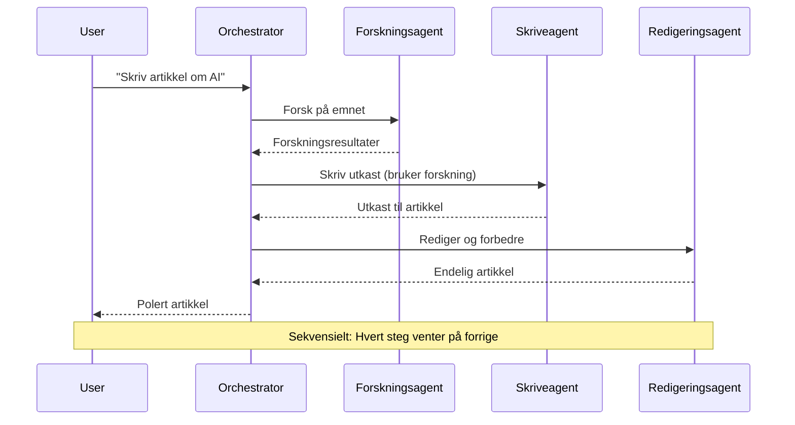
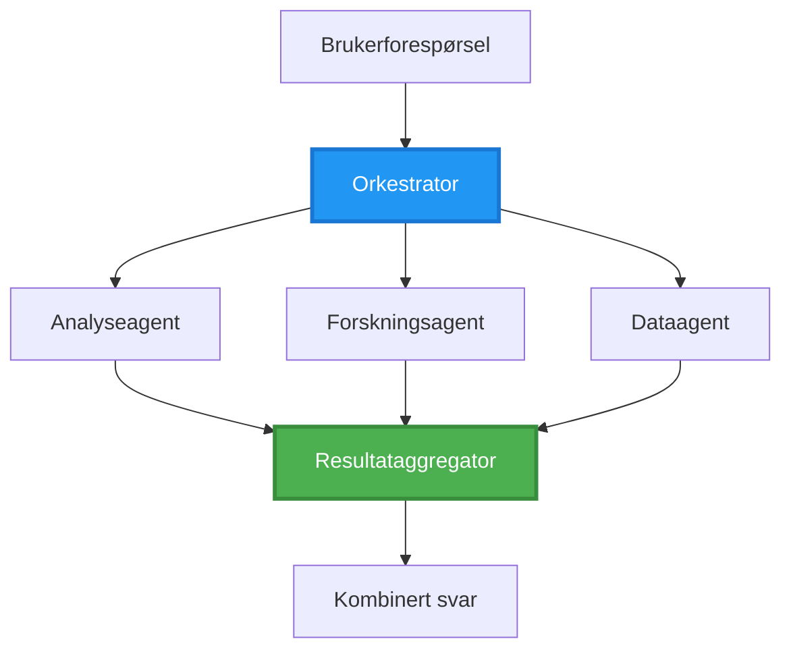
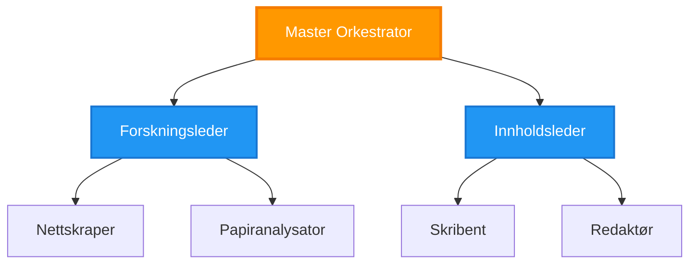
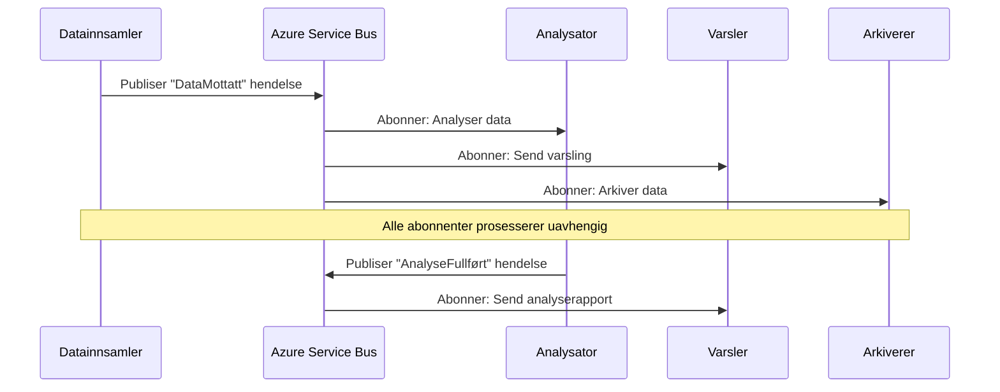
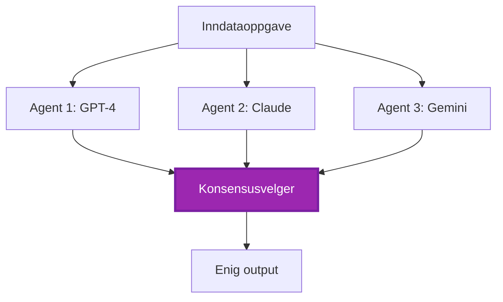
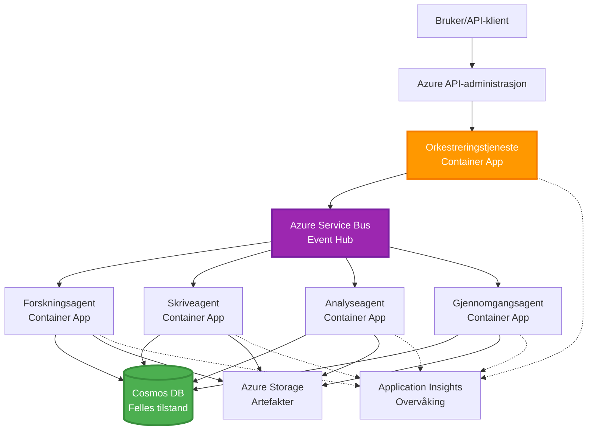

# Koordineringsmønstre for Multi-Agent

⏱️ **Estimert tid**: 60-75 minutter | 💰 **Estimert kostnad**: ~$100-300/måned | ⭐ **Kompleksitet**: Avansert

**📚 Læringssti:**
- ← Forrige: [Kapasitetsplanlegging](capacity-planning.md) - Strategier for ressursstørrelse og skalering
- 🎯 **Du er her**: Koordineringsmønstre for Multi-Agent (Orkestrering, kommunikasjon, tilstandshåndtering)
- → Neste: [SKU-valg](sku-selection.md) - Velge riktige Azure-tjenester
- 🏠 [Kursoversikt](../../README.md)

---

## Hva du vil lære

Ved å fullføre denne leksjonen vil du:
- Forstå **arkitekturmønstre for multi-agent** og når de skal brukes
- Implementere **orkestreringsmønstre** (sentralisert, desentralisert, hierarkisk)
- Designe **kommunikasjonsstrategier for agenter** (synkron, asynkron, hendelsesdrevet)
- Håndtere **delt tilstand** mellom distribuerte agenter
- Distribuere **multi-agent-systemer** på Azure med AZD
- Anvende **koordineringsmønstre** for virkelige AI-scenarier
- Overvåke og feilsøke distribuerte agentsystemer

## Hvorfor koordineringsmønstre for multi-agent er viktig

### Utviklingen: Fra enkeltagent til multi-agent

**Enkeltagent (Enkelt):**
```
User → Agent → Response
```
- ✅ Enkel å forstå og implementere
- ✅ Rask for enkle oppgaver
- ❌ Begrenset av én modells evner
- ❌ Kan ikke parallellisere komplekse oppgaver
- ❌ Ingen spesialisering

**Multi-agent-system (Avansert):**
```
           ┌─────────────┐
           │ Orchestrator│
           └──────┬──────┘
        ┌─────────┼─────────┐
        │         │         │
    ┌───▼──┐  ┌──▼───┐  ┌──▼────┐
    │Agent1│  │Agent2│  │Agent3 │
    │(Plan)│  │(Code)│  │(Review)│
    └──────┘  └──────┘  └───────┘
```
- ✅ Spesialiserte agenter for spesifikke oppgaver
- ✅ Parallell utførelse for hastighet
- ✅ Modulært og vedlikeholdbart
- ✅ Bedre for komplekse arbeidsflyter
- ⚠️ Krever koordineringslogikk

**Analogi**: En enkeltagent er som én person som gjør alle oppgaver. Et multi-agent-system er som et team der hvert medlem har spesialiserte ferdigheter (forsker, programmerer, korrekturleser, skribent) som jobber sammen.

---

## Kjernekoordineringsmønstre

### Mønster 1: Sekvensiell koordinering (Ansvarskjede)

**Når du skal bruke det**: Oppgaver må fullføres i spesifikk rekkefølge, hver agent bygger på forrige output.


**Fordeler:**
- ✅ Klar dataflyt
- ✅ Enkel å feilsøke
- ✅ Forutsigbar utførelsesrekkefølge

**Begrensninger:**
- ❌ Langsom (ingen parallellitet)
- ❌ Én feil blokkerer hele kjeden
- ❌ Kan ikke håndtere gjensidig avhengige oppgaver

**Eksempler på bruk:**
- Innholdsskaping (forskning → skriving → redigering → publisering)
- Kodegenerering (planlegging → implementering → testing → distribusjon)
- Rapportgenerering (datainnsamling → analyse → visualisering → oppsummering)

---

### Mønster 2: Parallell koordinering (Fan-Out/Fan-In)

**Når du skal bruke det**: Uavhengige oppgaver kan kjøres samtidig, resultater kombineres til slutt.


**Fordeler:**
- ✅ Rask (parallell utførelse)
- ✅ Feiltolerant (delvise resultater akseptable)
- ✅ Skalerer horisontalt

**Begrensninger:**
- ⚠️ Resultater kan komme i feil rekkefølge
- ⚠️ Krever aggregeringslogikk
- ⚠️ Kompleks tilstandshåndtering

**Eksempler på bruk:**
- Datainnsamling fra flere kilder (API-er + databaser + nettskraping)
- Konkurranseanalyse (flere modeller genererer løsninger, beste velges)
- Oversettelsestjenester (oversett til flere språk samtidig)

---

### Mønster 3: Hierarkisk koordinering (Manager-Worker)

**Når du skal bruke det**: Komplekse arbeidsflyter med deloppgaver, delegasjon nødvendig.


**Fordeler:**
- ✅ Håndterer komplekse arbeidsflyter
- ✅ Modulært og vedlikeholdbart
- ✅ Klare ansvarsgrenser

**Begrensninger:**
- ⚠️ Mer kompleks arkitektur
- ⚠️ Høyere ventetid (flere koordineringslag)
- ⚠️ Krever sofistikert orkestrering

**Eksempler på bruk:**
- Dokumentbehandling i bedrifter (klassifisere → rute → behandle → arkivere)
- Flertrinns datapipelines (innhente → rense → transformere → analysere → rapportere)
- Komplekse automatiseringsarbeidsflyter (planlegging → ressursallokering → utførelse → overvåking)

---

### Mønster 4: Hendelsesdrevet koordinering (Publish-Subscribe)

**Når du skal bruke det**: Agenter må reagere på hendelser, løs kobling ønskes.


**Fordeler:**
- ✅ Løs kobling mellom agenter
- ✅ Enkel å legge til nye agenter (bare abonnere)
- ✅ Asynkron behandling
- ✅ Robust (meldingspersistens)

**Begrensninger:**
- ⚠️ Eventuell konsistens
- ⚠️ Kompleks feilsøking
- ⚠️ Utfordringer med meldingsrekkefølge

**Eksempler på bruk:**
- Sanntidsovervåkingssystemer (varsler, dashbord, logger)
- Multikanalvarsler (e-post, SMS, push, Slack)
- Databehandlingspipelines (flere konsumenter av samme data)

---

### Mønster 5: Konsensusbasert koordinering (Avstemning/Kvorum)

**Når du skal bruke det**: Trenger enighet fra flere agenter før du går videre.


**Fordeler:**
- ✅ Høyere nøyaktighet (flere meninger)
- ✅ Feiltolerant (mindre feil akseptable)
- ✅ Kvalitetssikring innebygd

**Begrensninger:**
- ❌ Kostbart (flere modellkall)
- ❌ Langsomt (venter på alle agenter)
- ⚠️ Konfliktløsning nødvendig

**Eksempler på bruk:**
- Innholdsmoderering (flere modeller vurderer innhold)
- Kodegjennomgang (flere linters/analysetjenester)
- Medisinsk diagnose (flere AI-modeller, ekspertvalidering)

---

## Arkitekturoversikt

### Komplett multi-agent-system på Azure


**Nøkkelkomponenter:**

| Komponent | Formål | Azure-tjeneste |
|-----------|--------|----------------|
| **API Gateway** | Inngangspunkt, hastighetsbegrensning, autentisering | API Management |
| **Orkestrator** | Koordinerer agentarbeidsflyter | Container Apps |
| **Meldingskø** | Asynkron kommunikasjon | Service Bus / Event Hubs |
| **Agenter** | Spesialiserte AI-arbeidere | Container Apps / Functions |
| **Tilstandslager** | Delt tilstand, oppgavesporing | Cosmos DB |
| **Artefaktlagring** | Dokumenter, resultater, logger | Blob Storage |
| **Overvåking** | Distribuert sporing, logger | Application Insights |

---

## Forutsetninger

### Nødvendige verktøy

```bash
# Verifiser Azure Developer CLI
azd version
# ✅ Forventet: azd versjon 1.0.0 eller høyere

# Verifiser Azure CLI
az --version
# ✅ Forventet: azure-cli 2.50.0 eller høyere

# Verifiser Docker (for lokal testing)
docker --version
# ✅ Forventet: Docker versjon 20.10 eller høyere
```

### Azure-krav

- Aktiv Azure-abonnement
- Tillatelser til å opprette:
  - Container Apps
  - Service Bus-navneområder
  - Cosmos DB-kontoer
  - Lagringskontoer
  - Application Insights

### Kunnskapsforutsetninger

Du bør ha fullført:
- [Konfigurasjonsstyring](../getting-started/configuration.md)
- [Autentisering og sikkerhet](../getting-started/authsecurity.md)
- [Eksempel på mikrotjenester](../../../../examples/microservices)

---

## Implementeringsveiledning

### Prosjektstruktur

```
multi-agent-system/
├── azure.yaml                    # AZD configuration
├── infra/
│   ├── main.bicep               # Main infrastructure
│   ├── core/
│   │   ├── servicebus.bicep     # Message queue
│   │   ├── cosmos.bicep         # State store
│   │   ├── storage.bicep        # Artifact storage
│   │   └── monitoring.bicep     # Application Insights
│   └── app/
│       ├── orchestrator.bicep   # Orchestrator service
│       └── agent.bicep          # Agent template
└── src/
    ├── orchestrator/            # Orchestration logic
    │   ├── app.py
    │   ├── workflows.py
    │   └── Dockerfile
    ├── agents/
    │   ├── research/            # Research agent
    │   ├── writer/              # Writer agent
    │   ├── analyst/             # Analyst agent
    │   └── reviewer/            # Reviewer agent
    └── shared/
        ├── state_manager.py     # Shared state logic
        └── message_handler.py   # Message handling
```

---

## Leksjon 1: Sekvensielt koordineringsmønster

### Implementering: Innholdsskaping

La oss bygge en sekvensiell pipeline: Forskning → Skriving → Redigering → Publisering

### 1. AZD-konfigurasjon

**Fil: `azure.yaml`**

```yaml
name: content-pipeline
metadata:
  template: multi-agent-sequential@1.0.0

services:
  orchestrator:
    project: ./src/orchestrator
    language: python
    host: containerapp
  
  research-agent:
    project: ./src/agents/research
    language: python
    host: containerapp
  
  writer-agent:
    project: ./src/agents/writer
    language: python
    host: containerapp
  
  editor-agent:
    project: ./src/agents/editor
    language: python
    host: containerapp
```

### 2. Infrastruktur: Service Bus for koordinering

**Fil: `infra/core/servicebus.bicep`**

```bicep
param name string
param location string
param tags object = {}

resource serviceBusNamespace 'Microsoft.ServiceBus/namespaces@2022-10-01-preview' = {
  name: name
  location: location
  tags: tags
  sku: {
    name: 'Standard'
    tier: 'Standard'
  }
  properties: {
    minimumTlsVersion: '1.2'
  }
}

// Queue for orchestrator → research agent
resource researchQueue 'Microsoft.ServiceBus/namespaces/queues@2022-10-01-preview' = {
  parent: serviceBusNamespace
  name: 'research-tasks'
  properties: {
    maxDeliveryCount: 3
    lockDuration: 'PT5M'
    deadLetteringOnMessageExpiration: true
  }
}

// Queue for research agent → writer agent
resource writerQueue 'Microsoft.ServiceBus/namespaces/queues@2022-10-01-preview' = {
  parent: serviceBusNamespace
  name: 'writer-tasks'
  properties: {
    maxDeliveryCount: 3
    lockDuration: 'PT5M'
  }
}

// Queue for writer agent → editor agent
resource editorQueue 'Microsoft.ServiceBus/namespaces/queues@2022-10-01-preview' = {
  parent: serviceBusNamespace
  name: 'editor-tasks'
  properties: {
    maxDeliveryCount: 3
    lockDuration: 'PT5M'
  }
}

output namespace string = serviceBusNamespace.name
output connectionString string = listKeys('${serviceBusNamespace.id}/AuthorizationRules/RootManageSharedAccessKey', serviceBusNamespace.apiVersion).primaryConnectionString
```

### 3. Delt tilstandsadministrator

**Fil: `src/shared/state_manager.py`**

```python
from azure.cosmos import CosmosClient, PartitionKey
from datetime import datetime
import os

class StateManager:
    """Manages shared state across agents using Cosmos DB"""
    
    def __init__(self):
        endpoint = os.environ['COSMOS_ENDPOINT']
        key = os.environ['COSMOS_KEY']
        
        self.client = CosmosClient(endpoint, key)
        self.database = self.client.get_database_client('agent-state')
        self.container = self.database.get_container_client('tasks')
    
    def create_task(self, task_id: str, task_type: str, input_data: dict):
        """Create a new task"""
        task = {
            'id': task_id,
            'type': task_type,
            'status': 'pending',
            'input': input_data,
            'created_at': datetime.utcnow().isoformat(),
            'steps': []
        }
        self.container.create_item(task)
        return task
    
    def update_task_step(self, task_id: str, step_name: str, result: dict):
        """Update task with completed step"""
        task = self.container.read_item(task_id, partition_key=task_id)
        
        task['steps'].append({
            'name': step_name,
            'completed_at': datetime.utcnow().isoformat(),
            'result': result
        })
        
        self.container.replace_item(task_id, task)
        return task
    
    def complete_task(self, task_id: str, final_result: dict):
        """Mark task as complete"""
        task = self.container.read_item(task_id, partition_key=task_id)
        task['status'] = 'completed'
        task['result'] = final_result
        task['completed_at'] = datetime.utcnow().isoformat()
        self.container.replace_item(task_id, task)
        return task
    
    def get_task(self, task_id: str):
        """Retrieve task state"""
        return self.container.read_item(task_id, partition_key=task_id)
```

### 4. Orkestratortjeneste

**Fil: `src/orchestrator/app.py`**

```python
from flask import Flask, request, jsonify
from azure.servicebus import ServiceBusClient, ServiceBusMessage
import json
import uuid
import os
from shared.state_manager import StateManager

app = Flask(__name__)
state_manager = StateManager()

# Service Bus-tilkobling
servicebus_connection_str = os.environ['SERVICEBUS_CONNECTION_STRING']
servicebus_client = ServiceBusClient.from_connection_string(servicebus_connection_str)

@app.route('/health', methods=['GET'])
def health():
    return jsonify({'status': 'healthy', 'service': 'orchestrator'})

@app.route('/create-content', methods=['POST'])
def create_content():
    """
    Sequential workflow: Research → Write → Edit → Publish
    """
    data = request.json
    topic = data.get('topic')
    
    if not topic:
        return jsonify({'error': 'Topic required'}), 400
    
    # Opprett oppgave i tilstandslager
    task_id = str(uuid.uuid4())
    task = state_manager.create_task(
        task_id=task_id,
        task_type='content_creation',
        input_data={'topic': topic}
    )
    
    # Send melding til forskningsagent (første steg)
    sender = servicebus_client.get_queue_sender('research-tasks')
    message = ServiceBusMessage(
        body=json.dumps({
            'task_id': task_id,
            'topic': topic,
            'next_queue': 'writer-tasks'  # Hvor resultatene skal sendes
        }),
        content_type='application/json'
    )
    
    with sender:
        sender.send_messages(message)
    
    return jsonify({
        'task_id': task_id,
        'status': 'started',
        'workflow': 'sequential',
        'steps': ['research', 'write', 'edit', 'publish'],
        'message': 'Content creation pipeline initiated'
    }), 202

@app.route('/task/<task_id>', methods=['GET'])
def get_task_status(task_id):
    """Check task status"""
    try:
        task = state_manager.get_task(task_id)
        return jsonify(task)
    except Exception as e:
        return jsonify({'error': str(e)}), 404

if __name__ == '__main__':
    app.run(host='0.0.0.0', port=8080)
```

### 5. Forskningsagent

**Fil: `src/agents/research/app.py`**

```python
from azure.servicebus import ServiceBusClient, ServiceBusMessage
from openai import AzureOpenAI
import json
import os
import time
from shared.state_manager import StateManager

# Initialiser klienter
state_manager = StateManager()
servicebus_client = ServiceBusClient.from_connection_string(
    os.environ['SERVICEBUS_CONNECTION_STRING']
)

openai_client = AzureOpenAI(
    api_key=os.environ['AZURE_OPENAI_API_KEY'],
    api_version="2024-02-01",
    azure_endpoint=os.environ['AZURE_OPENAI_ENDPOINT']
)

def process_research_task(message_data):
    """Process research request and pass to writer"""
    task_id = message_data['task_id']
    topic = message_data['topic']
    next_queue = message_data['next_queue']
    
    print(f"🔬 Researching: {topic}")
    
    # Kall Azure OpenAI for forskning
    response = openai_client.chat.completions.create(
        model="gpt-4",
        messages=[
            {"role": "system", "content": "You are a research assistant. Provide comprehensive research on the given topic."},
            {"role": "user", "content": f"Research this topic thoroughly: {topic}"}
        ],
        max_tokens=1500
    )
    
    research_results = response.choices[0].message.content
    
    # Oppdater tilstand
    state_manager.update_task_step(
        task_id=task_id,
        step_name='research',
        result={'research': research_results}
    )
    
    # Send til neste agent (skribent)
    sender = servicebus_client.get_queue_sender(next_queue)
    message = ServiceBusMessage(
        body=json.dumps({
            'task_id': task_id,
            'topic': topic,
            'research': research_results,
            'next_queue': 'editor-tasks'
        }),
        content_type='application/json'
    )
    
    with sender:
        sender.send_messages(message)
    
    print(f"✅ Research complete for task {task_id}")

def main():
    """Listen to research queue"""
    receiver = servicebus_client.get_queue_receiver('research-tasks')
    
    print("🔬 Research Agent started, listening for tasks...")
    
    with receiver:
        while True:
            messages = receiver.receive_messages(max_wait_time=5)
            for message in messages:
                try:
                    message_data = json.loads(str(message))
                    process_research_task(message_data)
                    receiver.complete_message(message)
                except Exception as e:
                    print(f"❌ Error processing message: {e}")
                    receiver.abandon_message(message)

if __name__ == '__main__':
    main()
```

### 6. Skriveagent

**Fil: `src/agents/writer/app.py`**

```python
from azure.servicebus import ServiceBusClient, ServiceBusMessage
from openai import AzureOpenAI
import json
import os
from shared.state_manager import StateManager

state_manager = StateManager()
servicebus_client = ServiceBusClient.from_connection_string(
    os.environ['SERVICEBUS_CONNECTION_STRING']
)

openai_client = AzureOpenAI(
    api_key=os.environ['AZURE_OPENAI_API_KEY'],
    api_version="2024-02-01",
    azure_endpoint=os.environ['AZURE_OPENAI_ENDPOINT']
)

def process_writing_task(message_data):
    """Write article based on research"""
    task_id = message_data['task_id']
    topic = message_data['topic']
    research = message_data['research']
    next_queue = message_data['next_queue']
    
    print(f"✍️ Writing article: {topic}")
    
    # Ring Azure OpenAI for å skrive artikkel
    response = openai_client.chat.completions.create(
        model="gpt-4",
        messages=[
            {"role": "system", "content": "You are a professional writer. Write engaging, well-structured articles."},
            {"role": "user", "content": f"Based on this research:\n\n{research}\n\nWrite a comprehensive article about: {topic}"}
        ],
        max_tokens=2000
    )
    
    article_draft = response.choices[0].message.content
    
    # Oppdater status
    state_manager.update_task_step(
        task_id=task_id,
        step_name='writing',
        result={'draft': article_draft}
    )
    
    # Send til redaktør
    sender = servicebus_client.get_queue_sender(next_queue)
    message = ServiceBusMessage(
        body=json.dumps({
            'task_id': task_id,
            'topic': topic,
            'draft': article_draft
        }),
        content_type='application/json'
    )
    
    with sender:
        sender.send_messages(message)
    
    print(f"✅ Article draft complete for task {task_id}")

def main():
    """Listen to writer queue"""
    receiver = servicebus_client.get_queue_receiver('writer-tasks')
    
    print("✍️ Writer Agent started, listening for tasks...")
    
    with receiver:
        while True:
            messages = receiver.receive_messages(max_wait_time=5)
            for message in messages:
                try:
                    message_data = json.loads(str(message))
                    process_writing_task(message_data)
                    receiver.complete_message(message)
                except Exception as e:
                    print(f"❌ Error: {e}")
                    receiver.abandon_message(message)

if __name__ == '__main__':
    main()
```

### 7. Redigeringsagent

**Fil: `src/agents/editor/app.py`**

```python
from azure.servicebus import ServiceBusClient
from openai import AzureOpenAI
import json
import os
from shared.state_manager import StateManager

state_manager = StateManager()
servicebus_client = ServiceBusClient.from_connection_string(
    os.environ['SERVICEBUS_CONNECTION_STRING']
)

openai_client = AzureOpenAI(
    api_key=os.environ['AZURE_OPENAI_API_KEY'],
    api_version="2024-02-01",
    azure_endpoint=os.environ['AZURE_OPENAI_ENDPOINT']
)

def process_editing_task(message_data):
    """Edit and finalize article"""
    task_id = message_data['task_id']
    topic = message_data['topic']
    draft = message_data['draft']
    
    print(f"📝 Editing article: {topic}")
    
    # Ring Azure OpenAI for å redigere
    response = openai_client.chat.completions.create(
        model="gpt-4",
        messages=[
            {"role": "system", "content": "You are an expert editor. Improve grammar, clarity, and structure."},
            {"role": "user", "content": f"Edit and improve this article:\n\n{draft}"}
        ],
        max_tokens=2000
    )
    
    final_article = response.choices[0].message.content
    
    # Merk oppgaven som fullført
    state_manager.complete_task(
        task_id=task_id,
        final_result={
            'topic': topic,
            'final_article': final_article,
            'word_count': len(final_article.split())
        }
    )
    
    print(f"✅ Article finalized for task {task_id}")

def main():
    """Listen to editor queue"""
    receiver = servicebus_client.get_queue_receiver('editor-tasks')
    
    print("📝 Editor Agent started, listening for tasks...")
    
    with receiver:
        while True:
            messages = receiver.receive_messages(max_wait_time=5)
            for message in messages:
                try:
                    message_data = json.loads(str(message))
                    process_editing_task(message_data)
                    receiver.complete_message(message)
                except Exception as e:
                    print(f"❌ Error: {e}")
                    receiver.abandon_message(message)

if __name__ == '__main__':
    main()
```

### 8. Distribuer og test

```bash
# Initialiser og distribuer
azd init
azd up

# Hent orkestrator-URL
ORCHESTRATOR_URL=$(azd env get-values | grep ORCHESTRATOR_URL | cut -d '=' -f2 | tr -d '"')

# Opprett innhold
curl -X POST $ORCHESTRATOR_URL/create-content \
  -H "Content-Type: application/json" \
  -d '{"topic": "The Future of AI in Healthcare"}'
```

**✅ Forventet output:**
```json
{
  "task_id": "a1b2c3d4-e5f6-7890-abcd-ef1234567890",
  "status": "started",
  "workflow": "sequential",
  "steps": ["research", "write", "edit", "publish"],
  "message": "Content creation pipeline initiated"
}
```

**Sjekk oppgavefremdrift:**
```bash
TASK_ID="a1b2c3d4-e5f6-7890-abcd-ef1234567890"
curl $ORCHESTRATOR_URL/task/$TASK_ID
```

**✅ Forventet output (fullført):**
```json
{
  "id": "a1b2c3d4-e5f6-7890-abcd-ef1234567890",
  "type": "content_creation",
  "status": "completed",
  "steps": [
    {
      "name": "research",
      "completed_at": "2025-11-19T10:30:00Z",
      "result": {"research": "..."}
    },
    {
      "name": "writing",
      "completed_at": "2025-11-19T10:32:00Z",
      "result": {"draft": "..."}
    }
  ],
  "result": {
    "topic": "The Future of AI in Healthcare",
    "final_article": "...",
    "word_count": 1500
  }
}
```

---

## Leksjon 2: Parallelt koordineringsmønster

### Implementering: Multi-kilde forskningsaggregator

La oss bygge et parallelt system som samler informasjon fra flere kilder samtidig.

### Parallell orkestrator

**Fil: `src/orchestrator/parallel_workflow.py`**

```python
from flask import Flask, request, jsonify
from azure.servicebus import ServiceBusClient, ServiceBusMessage
import json
import uuid
import os
from shared.state_manager import StateManager

app = Flask(__name__)
state_manager = StateManager()

servicebus_client = ServiceBusClient.from_connection_string(
    os.environ['SERVICEBUS_CONNECTION_STRING']
)

@app.route('/research-parallel', methods=['POST'])
def research_parallel():
    """
    Parallel workflow: Multiple agents work simultaneously
    """
    data = request.json
    query = data.get('query')
    
    task_id = str(uuid.uuid4())
    task = state_manager.create_task(
        task_id=task_id,
        task_type='parallel_research',
        input_data={
            'query': query,
            'agents': ['web', 'academic', 'news', 'social']
        }
    )
    
    # Fan-out: Send til alle agenter samtidig
    agents = [
        ('web-research-queue', 'web'),
        ('academic-research-queue', 'academic'),
        ('news-research-queue', 'news'),
        ('social-research-queue', 'social')
    ]
    
    for queue_name, agent_type in agents:
        sender = servicebus_client.get_queue_sender(queue_name)
        message = ServiceBusMessage(
            body=json.dumps({
                'task_id': task_id,
                'query': query,
                'agent_type': agent_type,
                'result_queue': 'aggregation-queue'
            }),
            content_type='application/json'
        )
        
        with sender:
            sender.send_messages(message)
    
    return jsonify({
        'task_id': task_id,
        'status': 'started',
        'workflow': 'parallel',
        'agents_dispatched': 4,
        'message': 'Parallel research initiated'
    }), 202

if __name__ == '__main__':
    app.run(host='0.0.0.0', port=8080)
```

### Aggregeringslogikk

**Fil: `src/agents/aggregator/app.py`**

```python
from azure.servicebus import ServiceBusClient
import json
import os
from collections import defaultdict
from shared.state_manager import StateManager

state_manager = StateManager()
servicebus_client = ServiceBusClient.from_connection_string(
    os.environ['SERVICEBUS_CONNECTION_STRING']
)

# Spor resultater per oppgave
task_results = defaultdict(list)
expected_agents = 4  # web, akademisk, nyheter, sosial

def process_result(message_data):
    """Aggregate results from parallel agents"""
    task_id = message_data['task_id']
    agent_type = message_data['agent_type']
    result = message_data['result']
    
    # Lagre resultat
    task_results[task_id].append({
        'agent': agent_type,
        'data': result
    })
    
    print(f"📊 Received result from {agent_type} agent ({len(task_results[task_id])}/{expected_agents})")
    
    # Sjekk om alle agenter er ferdige (fan-in)
    if len(task_results[task_id]) == expected_agents:
        print(f"✅ All agents completed for task {task_id}. Aggregating...")
        
        # Kombiner resultater
        aggregated = {
            'query': message_data['query'],
            'sources': task_results[task_id],
            'summary': generate_summary(task_results[task_id])
        }
        
        # Merk som fullført
        state_manager.complete_task(task_id, aggregated)
        
        # Rydd opp
        del task_results[task_id]
        
        print(f"✅ Aggregation complete for task {task_id}")

def generate_summary(results):
    """Generate summary from all sources"""
    summaries = [r['data'].get('summary', '') for r in results]
    return '\n\n'.join(summaries)

def main():
    """Listen to aggregation queue"""
    receiver = servicebus_client.get_queue_receiver('aggregation-queue')
    
    print("📊 Aggregator started, listening for results...")
    
    with receiver:
        while True:
            messages = receiver.receive_messages(max_wait_time=5)
            for message in messages:
                try:
                    message_data = json.loads(str(message))
                    process_result(message_data)
                    receiver.complete_message(message)
                except Exception as e:
                    print(f"❌ Error: {e}")
                    receiver.abandon_message(message)

if __name__ == '__main__':
    main()
```

**Fordeler med parallelt mønster:**
- ⚡ **4x raskere** (agenter kjører samtidig)
- 🔄 **Feiltolerant** (delvise resultater akseptable)
- 📈 **Skalerbart** (legg til flere agenter enkelt)

---

## Praktiske øvelser

### Øvelse 1: Legg til timeout-håndtering ⭐⭐ (Medium)

**Mål**: Implementer timeout-logikk slik at aggregator ikke venter for alltid på trege agenter.

**Trinn**:

1. **Legg til timeout-sporing i aggregator:**

```python
from datetime import datetime, timedelta

task_timeouts = {}  # oppgave_id -> utløpstid

def process_result(message_data):
    task_id = message_data['task_id']
    
    # Sett tidsavbrudd på første resultat
    if task_id not in task_timeouts:
        task_timeouts[task_id] = datetime.utcnow() + timedelta(seconds=30)
    
    task_results[task_id].append({
        'agent': message_data['agent_type'],
        'data': message_data['result']
    })
    
    # Sjekk om fullført ELLER tidsavbrutt
    if len(task_results[task_id]) == expected_agents or \
       datetime.utcnow() > task_timeouts[task_id]:
        
        print(f"📊 Aggregating with {len(task_results[task_id])}/{expected_agents} results")
        
        aggregated = {
            'query': message_data['query'],
            'sources': task_results[task_id],
            'completed_agents': len(task_results[task_id]),
            'timed_out': len(task_results[task_id]) < expected_agents
        }
        
        state_manager.complete_task(task_id, aggregated)
        
        # Rydd opp
        del task_results[task_id]
        del task_timeouts[task_id]
```

2. **Test med kunstige forsinkelser:**

```python
# I en agent, legg til forsinkelse for å simulere treg behandling
import time
time.sleep(35)  # Overskrider 30-sekunders tidsavbrudd
```

3. **Distribuer og verifiser:**

```bash
azd deploy aggregator

# Send inn oppgave
curl -X POST $ORCHESTRATOR_URL/research-parallel \
  -H "Content-Type: application/json" \
  -d '{"query": "AI safety research"}'

# Sjekk resultater etter 30 sekunder
curl $ORCHESTRATOR_URL/task/$TASK_ID
```

**✅ Suksesskriterier:**
- ✅ Oppgaven fullføres etter 30 sekunder selv om agenter ikke er ferdige
- ✅ Respons indikerer delvise resultater (`"timed_out": true`)
- ✅ Tilgjengelige resultater returneres (3 av 4 agenter)

**Tid**: 20-25 minutter

---

### Øvelse 2: Implementer retry-logikk ⭐⭐⭐ (Avansert)

**Mål**: Automatisk prøve på nytt mislykkede agentoppgaver før du gir opp.

**Trinn**:

1. **Legg til retry-sporing i orkestrator:**

```python
from dataclasses import dataclass
from typing import Dict

@dataclass
class RetryConfig:
    max_retries: int = 3
    backoff_seconds: int = 5

retry_counts: Dict[str, int] = {}  # meldings_id -> antall_forsøk

def send_with_retry(queue_name: str, message_data: dict, retry_config: RetryConfig):
    """Send message with retry metadata"""
    message_id = message_data.get('message_id', str(uuid.uuid4()))
    message_data['message_id'] = message_id
    message_data['retry_count'] = retry_counts.get(message_id, 0)
    message_data['max_retries'] = retry_config.max_retries
    
    sender = servicebus_client.get_queue_sender(queue_name)
    message = ServiceBusMessage(
        body=json.dumps(message_data),
        content_type='application/json',
        message_id=message_id
    )
    
    with sender:
        sender.send_messages(message)
```

2. **Legg til retry-håndtering i agenter:**

```python
def process_with_retry(message, receiver, process_func):
    """Process message with automatic retry on failure"""
    try:
        message_data = json.loads(str(message))
        
        # Behandle meldingen
        process_func(message_data)
        
        # Suksess - fullført
        receiver.complete_message(message)
        
    except Exception as e:
        message_id = message.message_id
        retry_count = message_data.get('retry_count', 0)
        max_retries = message_data.get('max_retries', 3)
        
        if retry_count < max_retries:
            # Prøv igjen: avbryt og legg i kø på nytt med økt antall
            print(f"⚠️ Retry {retry_count + 1}/{max_retries} for message {message_id}")
            
            message_data['retry_count'] = retry_count + 1
            
            # Send tilbake til samme kø med forsinkelse
            time.sleep(5 * (retry_count + 1))  # Eksponentiell tilbakegang
            send_with_retry(queue_name, message_data, RetryConfig())
            
            receiver.complete_message(message)  # Fjern originalen
        else:
            # Maks antall forsøk overskredet - flytt til dødbrevkø
            print(f"❌ Max retries exceeded for message {message_id}")
            receiver.dead_letter_message(
                message,
                reason="MaxRetriesExceeded",
                error_description=str(e)
            )
```

3. **Overvåk dead letter-kø:**

```python
def monitor_dead_letters():
    """Check dead letter queue for failed messages"""
    receiver = servicebus_client.get_queue_receiver(
        'research-queue',
        sub_queue='deadletter'
    )
    
    with receiver:
        messages = receiver.receive_messages(max_wait_time=5)
        for message in messages:
            print(f"☠️ Dead letter: {message.message_id}")
            print(f"Reason: {message.dead_letter_reason}")
            print(f"Description: {message.dead_letter_error_description}")
```

**✅ Suksesskriterier:**
- ✅ Mislykkede oppgaver prøves automatisk på nytt (opptil 3 ganger)
- ✅ Eksponentiell tilbakegang mellom forsøk (5s, 10s, 15s)
- ✅ Etter maks forsøk går meldinger til dead letter-kø
- ✅ Dead letter-kø kan overvåkes og spilles av

**Tid**: 30-40 minutter

---

### Øvelse 3: Implementer kretsbryter ⭐⭐⭐ (Avansert)

**Mål**: Forhindre kaskaderende feil ved å stoppe forespørsler til mislykkede agenter.

**Trinn**:

1. **Opprett kretsbryterklasse:**

```python
from enum import Enum
from datetime import datetime, timedelta

class CircuitState(Enum):
    CLOSED = "closed"      # Normal drift
    OPEN = "open"          # Feiler, avvis forespørsler
    HALF_OPEN = "half_open"  # Tester om gjenopprettet

class CircuitBreaker:
    def __init__(self, failure_threshold=5, timeout_seconds=60):
        self.failure_threshold = failure_threshold
        self.timeout_seconds = timeout_seconds
        self.failure_count = 0
        self.last_failure_time = None
        self.state = CircuitState.CLOSED
    
    def call(self, func):
        """Execute function with circuit breaker protection"""
        if self.state == CircuitState.OPEN:
            # Sjekk om tidsavbrudd er utløpt
            if datetime.utcnow() - self.last_failure_time > timedelta(seconds=self.timeout_seconds):
                self.state = CircuitState.HALF_OPEN
                print("🔄 Circuit breaker: HALF_OPEN (testing)")
            else:
                raise Exception(f"Circuit breaker OPEN for agent. Try again in {self.timeout_seconds}s")
        
        try:
            result = func()
            
            # Suksess
            if self.state == CircuitState.HALF_OPEN:
                self.state = CircuitState.CLOSED
                self.failure_count = 0
                print("✅ Circuit breaker: CLOSED (recovered)")
            
            return result
            
        except Exception as e:
            self.failure_count += 1
            self.last_failure_time = datetime.utcnow()
            
            if self.failure_count >= self.failure_threshold:
                self.state = CircuitState.OPEN
                print(f"🔴 Circuit breaker: OPEN (too many failures)")
            
            raise e
```

2. **Bruk på agentkall:**

```python
# I orkestrator
agent_circuits = {
    'web': CircuitBreaker(failure_threshold=5, timeout_seconds=60),
    'academic': CircuitBreaker(failure_threshold=5, timeout_seconds=60),
    'news': CircuitBreaker(failure_threshold=5, timeout_seconds=60),
    'social': CircuitBreaker(failure_threshold=5, timeout_seconds=60)
}

def send_to_agent(agent_type, message_data):
    """Send with circuit breaker protection"""
    circuit = agent_circuits[agent_type]
    
    try:
        circuit.call(lambda: send_message(agent_type, message_data))
    except Exception as e:
        print(f"⚠️ Skipping {agent_type} agent: {e}")
        # Fortsett med andre agenter
```

3. **Test kretsbryter:**

```bash
# Simuler gjentatte feil (stopp en agent)
az containerapp stop --name web-research-agent --resource-group rg-agents

# Send flere forespørsler
for i in {1..10}; do
  curl -X POST $ORCHESTRATOR_URL/research-parallel \
    -H "Content-Type: application/json" \
    -d '{"query": "test query '$i'"}'
  sleep 2
done

# Sjekk logger - bør se kretsen åpne etter 5 feil
azd logs orchestrator --tail 50
```

**✅ Suksesskriterier:**
- ✅ Etter 5 feil åpnes kretsen (avviser forespørsler)
- ✅ Etter 60 sekunder går kretsen til halvåpen (tester gjenoppretting)
- ✅ Andre agenter fortsetter å fungere normalt
- ✅ Kretsen lukkes automatisk når agenten gjenoppretter

**Tid**: 40-50 minutter

---

## Overvåking og feilsøking

### Distribuert sporing med Application Insights

**Fil: `src/shared/tracing.py`**

```python
from opencensus.ext.azure.log_exporter import AzureLogHandler
from opencensus.ext.azure.trace_exporter import AzureExporter
from opencensus.trace import config_integration
from opencensus.trace.tracer import Tracer
from opencensus.trace.samplers import AlwaysOnSampler
import logging
import os

# Konfigurer sporing
config_integration.trace_integrations(['requests', 'logging'])

connection_string = os.environ.get('APPLICATIONINSIGHTS_CONNECTION_STRING')

# Opprett sporingsverktøy
tracer = Tracer(
    exporter=AzureExporter(connection_string=connection_string),
    sampler=AlwaysOnSampler()
)

# Konfigurer logging
logger = logging.getLogger(__name__)
logger.addHandler(AzureLogHandler(connection_string=connection_string))
logger.setLevel(logging.INFO)

def trace_agent_call(agent_name, task_id, operation):
    """Trace agent operations"""
    with tracer.span(name=f'{agent_name}.{operation}') as span:
        span.add_attribute('agent', agent_name)
        span.add_attribute('task_id', task_id)
        span.add_attribute('operation', operation)
        
        try:
            result = operation()
            span.add_attribute('status', 'success')
            return result
        except Exception as e:
            span.add_attribute('status', 'error')
            span.add_attribute('error', str(e))
            raise
```

### Application Insights-spørringer

**Spor multi-agent arbeidsflyter:**

```kusto
// Trace complete workflow for a task
traces
| where customDimensions.task_id == "a1b2c3d4-..."
| project timestamp, message, customDimensions.agent, customDimensions.operation
| order by timestamp asc
```

**Sammenligning av agentytelse:**

```kusto
// Compare agent execution times
dependencies
| where name contains "agent"
| summarize 
    avg_duration = avg(duration),
    p95_duration = percentile(duration, 95),
    count = count()
  by agent = tostring(customDimensions.agent)
| order by avg_duration desc
```

**Feilanalyse:**

```kusto
// Find which agents fail most
exceptions
| where customDimensions.agent != ""
| summarize 
    failure_count = count(),
    unique_errors = dcount(outerMessage)
  by agent = tostring(customDimensions.agent)
| order by failure_count desc
```

---

## Kostnadsanalyse

### Kostnader for multi-agent-system (månedlige estimater)

| Komponent | Konfigurasjon | Kostnad |
|-----------|---------------|---------|
| **Orkestrator** | 1 Container App (1 vCPU, 2GB) | $30-50 |
| **4 Agenter** | 4 Container Apps (0.5 vCPU, 1GB hver) | $60-120 |
| **Service Bus** | Standardnivå, 10M meldinger | $10-20 |
| **Cosmos DB** | Serverless, 5GB lagring, 1M RUs | $25-50 |
| **Blob Storage** | 10GB lagring, 100K operasjoner | $5-10 |
| **Application Insights** | 5GB inntak | $10-15 |
| **Azure OpenAI** | GPT-4, 10M tokens | $100-300 |
| **Totalt** | | **$240-565/måned** |

### Strategier for kostnadsoptimalisering

1. **Bruk serverless der det er mulig:**
   ```bicep
   // Cosmos DB serverless (no minimum cost)
   properties: {
     databaseAccountOfferType: 'Standard'
     capabilities: [{ name: 'EnableServerless' }]
   }
   ```

2. **Skaler agenter til null når de er inaktive:**
   ```bicep
   scale: {
     minReplicas: 0  // Scale to zero when no messages
     maxReplicas: 10
   }
   ```

3. **Bruk batching for Service Bus:**
   ```python
   # Send meldinger i grupper (billigere)
   sender.send_messages([message1, message2, message3])
   ```

4. **Cache ofte brukte resultater:**
   ```python
   # Bruk Azure Cache for Redis
   if cache.exists(query_hash):
       return cache.get(query_hash)
   ```

---

## Beste praksis

### ✅ GJØR:

1. **Bruk idempotente operasjoner**
   ```python
   # Agenten kan trygt behandle samme melding flere ganger
   def process_task(task_id):
       if state_manager.task_exists(task_id):
           print(f"Task {task_id} already processed, skipping")
           return
       # Behandler oppgave...
   ```

2. **Implementer omfattende logging**
   ```python
   logger.info(f"Agent: {agent_name}, Task: {task_id}, Action: {action}")
   ```

3. **Bruk korrelasjons-ID-er**
   ```python
   # Send task_id gjennom hele arbeidsflyten
   message_data = {
       'task_id': task_id,  # Korrelasjons-ID
       'timestamp': datetime.utcnow().isoformat()
   }
   ```

4. **Sett meldings-TTL (time-to-live)**
   ```bicep
   properties: {
     defaultMessageTimeToLive: 'PT1H'  // 1 hour max
   }
   ```

5. **Overvåk dead letter-køer**
   ```python
   # Regelmessig overvåking av feilede meldinger
   monitor_dead_letters()
   ```

### ❌ IKKE:

1. **Ikke opprett sirkulære avhengigheter**
   ```python
   # ❌ DÅRLIG: Agent A → Agent B → Agent A (uendelig løkke)
   # ✅ BRA: Definer klar rettet acyklisk graf (DAG)
   ```

2. **Ikke blokker agenttråder**
   ```python
   # ❌ DÅRLIG: Synkron venting
   while not task_complete:
       time.sleep(1)
   
   # ✅ BRA: Bruk meldingskøtilbakemeldinger
   ```

3. **Ikke ignorer delvise feil**
   ```python
   # ❌ DÅRLIG: Feil hele arbeidsflyten hvis en agent mislykkes
   # ✅ BRA: Returner delvise resultater med feilmeldingsindikatorer
   ```

4. **Ikke bruk uendelige retries**
   ```python
   # ❌ DÅRLIG: prøv på nytt for alltid
   # ✅ BRA: max_retries = 3, deretter dødsbrev
   ```

---
## Feilsøkingsguide

### Problem: Meldinger sitter fast i køen

**Symptomer:**
- Meldinger hoper seg opp i køen
- Agenter behandler ikke
- Oppgavestatus sitter fast på "venter"

**Diagnose:**
```bash
# Sjekk kødybde
az servicebus queue show \
  --namespace-name mybus \
  --name research-tasks \
  --query "countDetails"

# Sjekk agenthelse
azd logs research-agent --tail 50
```

**Løsninger:**

1. **Øk antall agentkopier:**
   ```bash
   az containerapp update \
     --name research-agent \
     --min-replicas 3 \
     --max-replicas 10
   ```

2. **Sjekk dødbrevkøen:**
   ```bash
   az servicebus queue show \
     --namespace-name mybus \
     --name research-tasks \
     --query "countDetails.deadLetterMessageCount"
   ```

---

### Problem: Oppgave tidsavbrudd/fullføres aldri

**Symptomer:**
- Oppgavestatus forblir "in_progress"
- Noen agenter fullfører, andre ikke
- Ingen feilmeldinger

**Diagnose:**
```bash
# Sjekk oppgave status
curl $ORCHESTRATOR_URL/task/$TASK_ID

# Sjekk Application Insights
# Kjør spørring: traces | where customDimensions.task_id == "..."
```

**Løsninger:**

1. **Implementer tidsavbrudd i aggregator (Øvelse 1)**

2. **Sjekk for agentfeil:**
   ```bash
   azd logs --follow | grep "ERROR\|FAIL"
   ```

3. **Bekreft at alle agenter kjører:**
   ```bash
   az containerapp list \
     --resource-group rg-agents \
     --query "[].{name:name, status:properties.runningStatus}"
   ```

---

## Lær mer

### Offisiell dokumentasjon
- [Azure Service Bus](https://learn.microsoft.com/azure/service-bus-messaging/service-bus-messaging-overview)
- [Cosmos DB](https://learn.microsoft.com/azure/cosmos-db/introduction)
- [Container Apps DAPR](https://learn.microsoft.com/azure/container-apps/dapr-overview)
- [Multi-Agent Design Patterns](https://learn.microsoft.com/azure/architecture/guide/ai/multi-agent-systems)

### Neste steg i dette kurset
- ← Forrige: [Kapasitetsplanlegging](capacity-planning.md)
- → Neste: [SKU-valg](sku-selection.md)
- 🏠 [Kursoversikt](../../README.md)

### Relaterte eksempler
- [Mikrotjenester Eksempel](../../../../examples/microservices) - Kommunikasjonsmønstre for tjenester
- [Azure OpenAI Eksempel](../../../../examples/azure-openai-chat) - AI-integrasjon

---

## Sammendrag

**Du har lært:**
- ✅ Fem koordineringsmønstre (sekvensiell, parallell, hierarkisk, hendelsesdrevet, konsensus)
- ✅ Multi-agent arkitektur på Azure (Service Bus, Cosmos DB, Container Apps)
- ✅ Tilstandshåndtering på tvers av distribuerte agenter
- ✅ Håndtering av tidsavbrudd, gjentakelser og kretsbrytere
- ✅ Overvåking og feilsøking av distribuerte systemer
- ✅ Strategier for kostnadsoptimalisering

**Viktige punkter:**
1. **Velg riktig mønster** - Sekvensiell for ordnede arbeidsflyter, parallell for hastighet, hendelsesdrevet for fleksibilitet
2. **Håndter tilstand nøye** - Bruk Cosmos DB eller lignende for delt tilstand
3. **Håndter feil på en god måte** - Tidsavbrudd, gjentakelser, kretsbrytere, dødbrevkøer
4. **Overvåk alt** - Distribuert sporing er essensielt for feilsøking
5. **Optimaliser kostnader** - Skaler til null, bruk serverløse løsninger, implementer caching

**Neste steg:**
1. Fullfør de praktiske øvelsene
2. Bygg et multi-agent system for din brukssituasjon
3. Studer [SKU-valg](sku-selection.md) for å optimalisere ytelse og kostnader

---

<!-- CO-OP TRANSLATOR DISCLAIMER START -->
**Ansvarsfraskrivelse**:  
Dette dokumentet er oversatt ved hjelp av AI-oversettelsestjenesten [Co-op Translator](https://github.com/Azure/co-op-translator). Selv om vi streber etter nøyaktighet, vær oppmerksom på at automatiserte oversettelser kan inneholde feil eller unøyaktigheter. Det originale dokumentet på dets opprinnelige språk bør anses som den autoritative kilden. For kritisk informasjon anbefales profesjonell menneskelig oversettelse. Vi er ikke ansvarlige for misforståelser eller feiltolkninger som oppstår ved bruk av denne oversettelsen.
<!-- CO-OP TRANSLATOR DISCLAIMER END -->