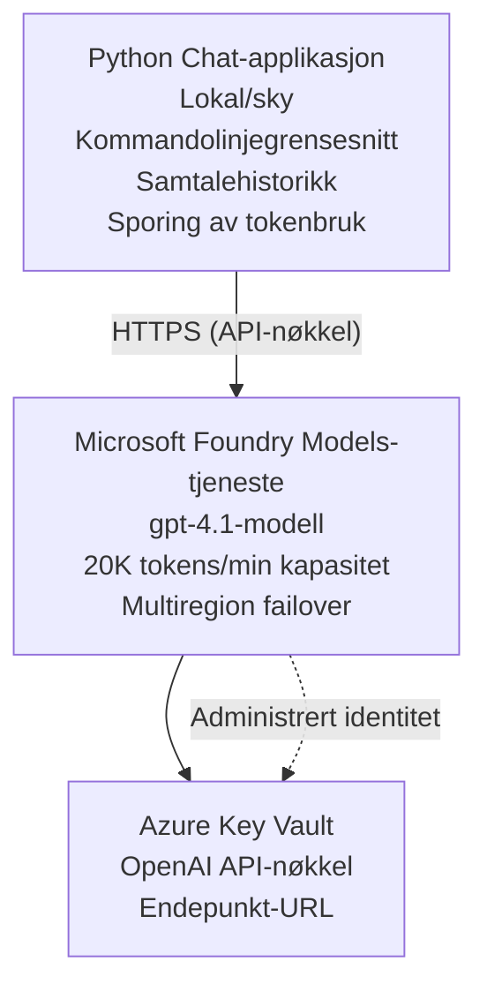

# Microsoft Foundry Models Chat-applikasjon

**Læringssti:** Middels ⭐⭐ | **Tid:** 35-45 minutter | **Kostnad:** $50-200/måned

En komplett Microsoft Foundry Models chat-applikasjon distribuert ved bruk av Azure Developer CLI (azd). Dette eksemplet demonstrerer gpt-4.1 distribusjon, sikker API-tilgang og et enkelt chattegrensesnitt.

## 🎯 Hva du vil lære

- Distribuere Microsoft Foundry Models Service med gpt-4.1-modellen  
- Sikre OpenAI API-nøkler med Key Vault  
- Bygge et enkelt chattegrensesnitt med Python  
- Overvåke tokenbruk og kostnader  
- Implementere ratebegrensning og feilhåndtering  

## 📦 Hva som er inkludert

✅ **Microsoft Foundry Models Service** - gpt-4.1 modell distribusjon  
✅ **Python Chat App** - Enkelt kommandolinje chattegrensesnitt  
✅ **Key Vault-integrasjon** - Sikker API-nøkkellagring  
✅ **ARM-maler** - Komplett infrastruktur som kode  
✅ **Kostnadsovervåking** - Sporing av tokenbruk  
✅ **Ratebegrensning** - Forhindre kvoteutarming  

## Arkitektur



## Forutsetninger

### Nødvendig

- **Azure Developer CLI (azd)** - [Installasjonsveiledning](https://learn.microsoft.com/azure/developer/azure-developer-cli/install-azd)  
- **Azure-abonnement** med OpenAI-tilgang - [Be om tilgang](https://aka.ms/oai/access)  
- **Python 3.9+** - [Installer Python](https://www.python.org/downloads/)  

### Sjekk forutsetninger

```bash
# Sjekk azd-versjon (trenger 1.5.0 eller høyere)
azd version

# Verifiser Azure-pålogging
azd auth login

# Sjekk Python-versjon
python --version  # eller python3 --versjon

# Verifiser OpenAI-tilgang (sjekk i Azure Portal)
az cognitiveservices account list-skus \
  --kind OpenAI \
  --location eastus
```

> **⚠️ Viktig:** Microsoft Foundry Models krever godkjenning av applikasjon. Hvis du ikke har søkt, besøk [aka.ms/oai/access](https://aka.ms/oai/access). Godkjenning tar vanligvis 1-2 virkedager.

## ⏱️ Distribusjonstid

| Fase | Varighet | Hva skjer |
|-------|----------|--------------|
| Forutsetningssjekk | 2-3 minutter | Verifiser OpenAI kvotekapasitet |
| Distribuer infrastruktur | 8-12 minutter | Opprett OpenAI, Key Vault, modell-distribusjon |
| Konfigurer applikasjon | 2-3 minutter | Sett opp miljø og avhengigheter |
| **Totalt** | **12-18 minutter** | Klar til å chatte med gpt-4.1 |

**Merk:** Første distribusjon av OpenAI kan ta lengre tid på grunn av modellprovisionering.

## Kom i gang raskt

```bash
# Naviger til eksempelet
cd examples/azure-openai-chat

# Initialiser miljø
azd env new myopenai

# Distribuer alt (infrastruktur + konfigurasjon)
azd up
# Du vil bli bedt om å:
# 1. Velge Azure-abonnement
# 2. Velge plassering med OpenAI-tilgjengelighet (f.eks., eastus, eastus2, westus)
# 3. Vent 12-18 minutter på distribusjonen

# Installer Pythons avhengigheter
pip install -r requirements.txt

# Begynn å chatte!
python chat.py
```

**Forventet utdata:**  
```
🤖 Microsoft Foundry Models Chat Application
Connected to: gpt-4.1 (eastus)
Type your message (or 'quit' to exit)

You: Hello! Tell me about Microsoft Foundry Models.
Assistant: Microsoft Foundry Models Service provides REST API access to OpenAI's powerful language models including gpt-4.1, GPT-3.5-Turbo, and Embeddings...

[Tokens used: 145 | Estimated cost: $0.0044]
```

## ✅ Verifiser distribusjon

### Steg 1: Sjekk Azure-ressurser

```bash
# Vis distribuerte ressurser
azd show

# Forventet resultat viser:
# - OpenAI-tjeneste: (ressursnavn)
# - Key Vault: (ressursnavn)
# - Distribusjon: gpt-4.1
# - Lokasjon: eastus (eller din valgte region)
```

### Steg 2: Test OpenAI API

```bash
# Hent OpenAI-endepunkt og nøkkel
OPENAI_ENDPOINT=$(azd env get-value AZURE_OPENAI_ENDPOINT)
OPENAI_KEY=$(azd env get-value AZURE_OPENAI_API_KEY)

# Test API-kall
curl "$OPENAI_ENDPOINT/openai/deployments/gpt-4.1/chat/completions?api-version=2024-08-01-preview" \
  -H "Content-Type: application/json" \
  -H "api-key: $OPENAI_KEY" \
  -d '{
    "messages": [{"role": "user", "content": "Say hello!"}],
    "max_tokens": 50
  }'
```

**Forventet svar:**  
```json
{
  "choices": [
    {
      "message": {
        "role": "assistant",
        "content": "Hello! How can I assist you today?"
      }
    }
  ],
  "usage": {
    "prompt_tokens": 8,
    "completion_tokens": 9,
    "total_tokens": 17
  }
}
```

### Steg 3: Verifiser Key Vault-tilgang

```bash
# List hemmeligheter i Key Vault
KV_NAME=$(azd env get-value AZURE_KEY_VAULT_NAME)

az keyvault secret list \
  --vault-name $KV_NAME \
  --query "[].name" \
  --output table
```

**Forventede hemmeligheter:**  
- `openai-api-key`  
- `openai-endpoint`  

**Suksesskriterier:**  
- ✅ OpenAI-tjeneste distribuert med gpt-4.1  
- ✅ API-kall returnerer gyldig fullføring  
- ✅ Hemmeligheter lagret i Key Vault  
- ✅ Tokenbruk-sporing fungerer  

## Prosjektstruktur

```
azure-openai-chat/
├── README.md                   ✅ This guide
├── azure.yaml                  ✅ AZD configuration
├── infra/                      ✅ Infrastructure as Code
│   ├── main.bicep             ✅ Main Bicep template
│   ├── main.parameters.json   ✅ Parameters
│   └── openai.bicep           ✅ OpenAI resource definition
├── src/                        ✅ Application code
│   ├── chat.py                ✅ Chat interface
│   ├── config.py              ✅ Configuration loader
│   └── requirements.txt       ✅ Python dependencies
└── .gitignore                  ✅ Git ignore rules
```

## Applikasjonsfunksjoner

### Chat-grensesnitt (`chat.py`)

Chat-applikasjonen inkluderer:

- **Samtalehistorikk** - Opprettholder kontekst over meldinger  
- **Token-telling** - Sporer bruk og estimerer kostnader  
- **Feilhåndtering** - Håndterer ratebegrensning og API-feil på en ryddig måte  
- **Kostnadsestimering** - Sanntids kalkulering av kostnad per melding  
- **Streaming-støtte** - Valgfri strømmet respons  

### Kommandoer

Under chatten kan du bruke:  
- `quit` eller `exit` - Avslutte økten  
- `clear` - Tømme samtalehistorikk  
- `tokens` - Vis total tokenbruk  
- `cost` - Vis estimert totalkostnad  

### Konfigurasjon (`config.py`)

Laster konfigurasjon fra miljøvariabler:  
```python
AZURE_OPENAI_ENDPOINT  # Fra Key Vault
AZURE_OPENAI_API_KEY   # Fra Key Vault
AZURE_OPENAI_MODEL     # Standard: gpt-4.1
AZURE_OPENAI_MAX_TOKENS # Standard: 800
```

## Brukseksempler

### Grunnleggende chat

```bash
python chat.py
```

### Chat med egendefinert modell

```bash
export AZURE_OPENAI_MODEL=gpt-35-turbo
python chat.py
```

### Chat med streaming

```bash
python chat.py --stream
```

### Eksempelsamtale

```
You: Explain Microsoft Foundry Models Service in 3 sentences.
Assistant: Microsoft Foundry Models Service is Microsoft Azure's cloud platform offering 
that provides access to OpenAI's powerful language models. It enables developers 
to integrate capabilities like gpt-4.1 into their applications with enterprise-grade 
security and compliance. The service includes features for content filtering, 
abuse monitoring, and responsible AI practices.

[Tokens used: 89 | Estimated cost: $0.0027]

You: What models are available?
Assistant: Microsoft Foundry Models Service offers several model families including gpt-4.1 
(most capable), GPT-3.5-Turbo (faster and cost-effective), and Embeddings models 
for vector search. Each model has different capabilities, pricing, and token limits.

[Tokens used: 67 | Estimated cost: $0.0020]

Total session: 156 tokens | $0.0047
```

## Kostnadsstyring

### Tokenpriser (gpt-4.1)

| Modell | Input (per 1K tokens) | Output (per 1K tokens) |
|-------|----------------------|------------------------|
| gpt-4.1 | $0.03 | $0.06 |
| GPT-3.5-Turbo | $0.0015 | $0.002 |

### Estimerte månedlige kostnader

Basert på bruksmønstre:

| Bruksnivå | Meldinger/dag | Tokens/dag | Månedskostnad |
|-------------|--------------|------------|--------------|
| **Lett** | 20 meldinger | 3 000 tokens | $3-5 |
| **Moderat** | 100 meldinger | 15 000 tokens | $15-25 |
| **Tung** | 500 meldinger | 75 000 tokens | $75-125 |

**Basiskostnad infrastruktur:** $1-2/måned (Key Vault + minimal compute)

### Kostnadsoptimaliseringstips

```bash
# 1. Bruk GPT-3.5-Turbo for enklere oppgaver (20 ganger billigere)
export AZURE_OPENAI_MODEL=gpt-35-turbo

# 2. Reduser maks antall tokens for kortere svar
export AZURE_OPENAI_MAX_TOKENS=400

# 3. Overvåk tokenbruk
python chat.py --show-tokens

# 4. Sett opp budsjettvarsler
az consumption budget create \
  --budget-name "openai-budget" \
  --amount 50 \
  --time-grain Monthly
```

## Overvåking

### Se tokenbruk

```bash
# I Azure-portalen:
# OpenAI-ressurs → Metrikker → Velg "Token-transaksjon"

# Eller via Azure CLI:
az monitor metrics list \
  --resource $(azd env get-value AZURE_OPENAI_RESOURCE_ID) \
  --metric "TokenTransaction" \
  --start-time $(date -u -d '1 hour ago' '+%Y-%m-%dT%H:%M:%S') \
  --interval PT1M
```

### Se API-logger

```bash
# Strøm diagnostiske logger
az monitor diagnostic-settings create \
  --resource $(azd env get-value AZURE_OPENAI_RESOURCE_ID) \
  --name openai-logs \
  --logs '[{"category": "Audit", "enabled": true}]' \
  --workspace $(azd env get-value LOG_ANALYTICS_WORKSPACE_ID)

# Spørringslogger
az monitor log-analytics query \
  --workspace $(azd env get-value LOG_ANALYTICS_WORKSPACE_ID) \
  --analytics-query "AzureDiagnostics | where Category == 'Audit' | top 10 by TimeGenerated"
```

## Feilsøking

### Problem: "Access Denied"-feil

**Symptomer:** 403 Forbidden ved API-kall

**Løsninger:**  
```bash
# 1. Bekreft at OpenAI-tilgang er godkjent
az cognitiveservices account show \
  --name $(azd env get-value AZURE_OPENAI_NAME) \
  --resource-group $(azd env get-value AZURE_RESOURCE_GROUP)

# 2. Sjekk at API-nøkkelen er korrekt
azd env get-value AZURE_OPENAI_API_KEY

# 3. Bekreft formatet på endepunkt-URLen
azd env get-value AZURE_OPENAI_ENDPOINT
# Skal være: https://[navn].openai.azure.com/
```

### Problem: "Rate Limit Exceeded"

**Symptomer:** 429 For mange forespørsler

**Løsninger:**  
```bash
# 1. Sjekk nåværende kvote
az cognitiveservices account deployment show \
  --name $(azd env get-value AZURE_OPENAI_NAME) \
  --resource-group $(azd env get-value AZURE_RESOURCE_GROUP) \
  --deployment-name gpt-4.1

# 2. Be om kvoteøkning (hvis nødvendig)
# Gå til Azure-portalen → OpenAI-ressurs → Kvoter → Be om økning

# 3. Implementer retry-logikk (allerede i chat.py)
# Applikasjonen prøver automatisk igjen med eksponentiell tilbakekobling
```

### Problem: "Model Not Found"

**Symptomer:** 404-feil for distribusjon

**Løsninger:**  
```bash
# 1. List opp tilgjengelige distribusjoner
az cognitiveservices account deployment list \
  --name $(azd env get-value AZURE_OPENAI_NAME) \
  --resource-group $(azd env get-value AZURE_RESOURCE_GROUP)

# 2. Verifiser modellnavn i miljøet
echo $AZURE_OPENAI_MODEL

# 3. Oppdater til riktig distribusjonsnavn
export AZURE_OPENAI_MODEL=gpt-4.1  # eller gpt-35-turbo
```

### Problem: Høy latenstid

**Symptomer:** Lang responstid (>5 sekunder)

**Løsninger:**  
```bash
# 1. Sjekk regional ventetid
# Distribuer til region nærmest brukerne

# 2. Reduser max_tokens for raskere svar
export AZURE_OPENAI_MAX_TOKENS=400

# 3. Bruk streaming for bedre brukeropplevelse
python chat.py --stream
```

## Sikkerhetsanbefalinger

### 1. Beskytt API-nøkler

```bash
# Aldri last opp nøkler til versjonskontroll
# Bruk Key Vault (allerede konfigurert)

# Roter nøkler regelmessig
az cognitiveservices account keys regenerate \
  --name $(azd env get-value AZURE_OPENAI_NAME) \
  --resource-group $(azd env get-value AZURE_RESOURCE_GROUP) \
  --key-name key1
```

### 2. Implementer innholdsfiltrering

```python
# Microsoft Foundry Models inkluderer innebygd innholdsfiltrering
# Konfigurer i Azure-portalen:
# OpenAI-ressurs → Innholdsfiltre → Opprett egendefinert filter

# Kategorier: Hat, Seksuelt, Vold, Selvskading
# Nivåer: Lav, Medium, Høy filtrering
```

### 3. Bruk Managed Identity (produksjon)

```bash
# For produksjonsdistribusjoner, bruk administrert identitet
# i stedet for API-nøkler (krever app-hosting på Azure)

# Oppdater infra/openai.bicep for å inkludere:
# identity: { type: 'SystemAssigned' }
```

## Utvikling

### Kjør lokalt

```bash
# Installer avhengigheter
pip install -r src/requirements.txt

# Sett miljøvariabler
export AZURE_OPENAI_ENDPOINT="https://[name].openai.azure.com/"
export AZURE_OPENAI_API_KEY="your-api-key"
export AZURE_OPENAI_MODEL="gpt-4.1"

# Kjør applikasjon
python src/chat.py
```

### Kjør tester

```bash
# Installer testavhengigheter
pip install pytest pytest-cov

# Kjør tester
pytest tests/ -v

# Med dekning
pytest tests/ --cov=src --cov-report=html
```

### Oppdater modell-distribusjon

```bash
# Distribuer forskjellige modellversjoner
az cognitiveservices account deployment create \
  --name $(azd env get-value AZURE_OPENAI_NAME) \
  --resource-group $(azd env get-value AZURE_RESOURCE_GROUP) \
  --deployment-name gpt-35-turbo \
  --model-name gpt-35-turbo \
  --model-version "0613" \
  --model-format OpenAI \
  --sku-capacity 20 \
  --sku-name "Standard"
```

## Rydd opp

```bash
# Slett alle Azure-ressurser
azd down --force --purge

# Dette fjerner:
# - OpenAI-tjeneste
# - Key Vault (med 90 dagers myk sletting)
# - Ressursgruppe
# - Alle distribusjoner og konfigurasjoner
```

## Neste steg

### Utvid dette eksempelet

1. **Legg til webgrensesnitt** - Bygg frontend med React/Vue  
   ```bash
   # Legg til frontend-tjeneste i azure.yaml
   # Distribuer til Azure Static Web Apps
   ```

2. **Implementer RAG** - Legg til dokumentsøk med Azure AI Search  
   ```python
   # Integrer Azure AI Search
   # Last opp dokumenter og lag vektorindeks
   ```

3. **Legg til funksjonsanrop** - Aktiver verktøybruk  
   ```python
   # Definer funksjoner i chat.py
   # La gpt-4.1 kalle eksterne API-er
   ```

4. **Støtte for flere modeller** - Distribuer flere modeller  
   ```bash
   # Legg til gpt-35-turbo, embeddings modeller
   # Implementer logikk for modellrutering
   ```

### Relaterte eksempler

- **[Retail Multi-Agent](../retail-scenario.md)** - Avansert multi-agent-arkitektur  
- **[Database App](../../../../examples/database-app)** - Legg til vedvarende lagring  
- **[Container Apps](../../../../examples/container-app)** - Distribuer som containerisert tjeneste  

### Læringsressurser

- 📚 [AZD For Beginners Course](../../README.md) - Hovedkurs  
- 📚 [Microsoft Foundry Models Documentation](https://learn.microsoft.com/azure/ai-services/openai/) - Offisiell dokumentasjon  
- 📚 [OpenAI API Reference](https://platform.openai.com/docs/api-reference) - API-detaljer  
- 📚 [Responsible AI](https://www.microsoft.com/ai/responsible-ai) - Beste praksis  

## Ytterligere ressurser

### Dokumentasjon  
- **[Microsoft Foundry Models Service](https://learn.microsoft.com/azure/ai-services/openai/)** - Fullstendig veiledning  
- **[gpt-4.1 Models](https://learn.microsoft.com/azure/ai-services/openai/concepts/models)** - Modellfunksjoner  
- **[Content Filtering](https://learn.microsoft.com/azure/ai-services/openai/concepts/content-filter)** - Sikkerhetsfunksjoner  
- **[Azure Developer CLI](https://learn.microsoft.com/azure/developer/azure-developer-cli/)** - azd referanse  

### Veiledninger  
- **[OpenAI Quickstart](https://learn.microsoft.com/azure/ai-services/openai/quickstart)** - Første distribusjon  
- **[Chat Completions](https://learn.microsoft.com/azure/ai-services/openai/how-to/chatgpt)** - Bygging av chatte-apper  
- **[Function Calling](https://learn.microsoft.com/azure/ai-services/openai/how-to/function-calling)** - Avanserte funksjoner  

### Verktøy  
- **[Microsoft Foundry Models Studio](https://oai.azure.com/)** - Nettbasert lekeplass  
- **[Prompt Engineering Guide](https://platform.openai.com/docs/guides/prompt-engineering)** - Skriv bedre instruksjoner  
- **[Token Calculator](https://platform.openai.com/tokenizer)** - Estimer tokenbruk  

### Fellesskap  
- **[Azure AI Discord](https://discord.gg/azure)** - Få hjelp fra fellesskapet  
- **[GitHub Discussions](https://github.com/Azure-Samples/openai/discussions)** - Spørsmål og svar-forum  
- **[Azure Blog](https://azure.microsoft.com/blog/tag/azure-openai-service/)** - Siste nyheter  

---

**🎉 Suksess!** Du har distribuert Microsoft Foundry Models og bygget en fungerende chat-applikasjon. Begynn å utforske gpt-4.1 sine muligheter og eksperimenter med ulike instruksjoner og brukstilfeller.

**Spørsmål?** [Åpne en sak](https://github.com/microsoft/AZD-for-beginners/issues) eller se [FAQ](../../resources/faq.md)

**Kostnadsvarsel:** Husk å kjøre `azd down` etter testing for å unngå løpende kostnader (~$50-100/måned for aktiv bruk).

---

<!-- CO-OP TRANSLATOR DISCLAIMER START -->
**Ansvarsfraskrivelse**:
Dette dokumentet er oversatt ved hjelp av AI-oversettelsestjenesten [Co-op Translator](https://github.com/Azure/co-op-translator). Selv om vi streber etter nøyaktighet, vær oppmerksom på at automatiske oversettelser kan inneholde feil eller unøyaktigheter. Det opprinnelige dokumentet på originalspråket skal betraktes som den autoritative kilden. For kritisk informasjon anbefales profesjonell menneskelig oversettelse. Vi er ikke ansvarlige for eventuelle misforståelser eller feiltolkninger som oppstår ved bruk av denne oversettelsen.
<!-- CO-OP TRANSLATOR DISCLAIMER END -->